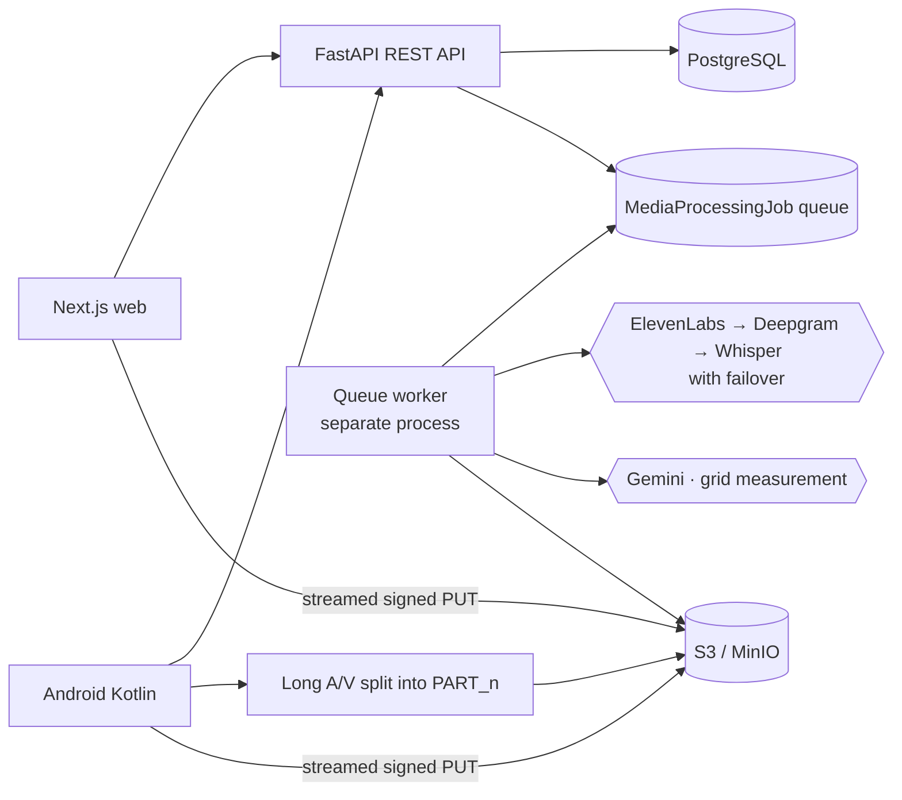

# Design Prototype Workshop

Full-stack, API-first application for craft and textile **designers** running a design & prototype
development workshop: capture every stage of the workshop on a phone or in the browser — at Basic,
Standard and Advanced tiers — and generate the workshop report, with prose, tables and photographs,
as a `.docx` or a PDF.

The stage set is declared once, as data, in `backend/app/services/stage_schema.py`, and that one
declaration drives the capture form, the completeness gate and the report. Every exporter renders
from one shared document model (`backend/app/services/report_model.py`): OOXML for
`.docx` and ReportLab for PDF on the server, and `DocxWriter` / `PdfWriter` in
`android/app/src/main/java/com/designprototype/workshop/report/`, which write the same OOXML and
draw the same layout onto `android.graphics.pdf.PdfDocument` pages **entirely offline** — a
workshop held with no signal still ends with a finished report on the phone.

Alongside the workshop record it keeps the supporting corpus — artisans, crafts, products, tools,
media, GPS locations, structured interviews with transcription, and review decisions.

> **Live:** the backend runs on AWS (EC2 at `13.206.216.18`) and is served over HTTPS through
> CloudFront at **https://d3ekigkotd1xa2.cloudfront.net/api/** (Terraform in `infra/terraform/`,
> auto-deployed by `.github/workflows/deploy-backend.yml`). CloudFront is dual-stack, so the API is
> reachable on IPv6-only mobile networks where the IPv4-only origin is not.

**📚 [docs/](docs/README.md) is the documentation index** — start there. It routes you by what you
are doing, and every document states how it is kept true.

The ones you most likely want:

| | |
|---|---|
| The stages, the field registry, the report pipeline | [docs/DESIGN_WORKSHOP.md](docs/DESIGN_WORKSHOP.md) |
| Handing the app to a designer | [docs/RESEARCHER_GUIDE.md](docs/RESEARCHER_GUIDE.md) |
| What each screen asks for | [docs/WALKTHROUGH.md](docs/WALKTHROUGH.md) |
| How the system fits together | [docs/ARCHITECTURE.md](docs/ARCHITECTURE.md) |
| What is stored | [docs/DATA_MODEL.md](docs/DATA_MODEL.md) |
| Who may do what | [docs/PERMISSIONS.md](docs/PERMISSIONS.md) |
| Every environment variable | [docs/ENVIRONMENT.md](docs/ENVIRONMENT.md) |
| Deploy runbooks | [backend/DEPLOY_AWS.md](backend/DEPLOY_AWS.md) · [docs/DEPLOYMENT_VERCEL.md](docs/DEPLOYMENT_VERCEL.md) · [docs/CI.md](docs/CI.md) |
| Known failure modes | [docs/QA_AUDIT.md](docs/QA_AUDIT.md) |
| Counts: models, endpoints, tests, code volume | [docs/REPO_FACTS.md](docs/REPO_FACTS.md) — **generated; no count is written by hand anywhere** |

The app is split into:

- `backend/`: Python FastAPI REST API, JWT auth, Prisma ORM schema/client, PostgreSQL metadata, S3-compatible signed uploads, CSV export.
- `frontend/`: Next.js TypeScript + Tailwind CSS web interface for admins and researchers.
- `android/`: Kotlin + Jetpack Compose Android client using the same REST API.
- `docker-compose.yml`: local PostgreSQL and MinIO object storage.

## Architecture

PostgreSQL stores structured records, media metadata and durable media-processing jobs. Any PostgreSQL server will do — the backend's only database configuration is `DATABASE_URL`, and which provider that points at is a deployment choice rather than an architectural one ("PostgreSQL — pointing this at any provider", below). Images, video, audio and PDFs are uploaded directly to S3-compatible storage using signed PUT URLs. The database stores object keys, URLs, MIME type, size, uploaded-by user, linked record IDs, optional GPS metadata, transcript state and queued AI processing state.

This keeps the backend API-first and reusable by both the web client and the Android client.

Detailed Mermaid diagrams are in [docs/ARCHITECTURE.md](docs/ARCHITECTURE.md).



## The Workshop Record

A design and prototype workshop is captured as a numbered sequence of stages, at three tiers —
**Basic** (the minimum the report cannot be written without), **Standard** (desirable for most
workshops) and **Advanced** (where facilities and expertise permit). Only Basic fields may be
required, so a workshop held in a village with no power can still reach a complete report.

**There is no per-stage form code, validator or report section anywhere in this repository.** Every
stage, entity and field is declared once, as data, in `backend/app/services/stage_definitions.py`
against the machinery in `backend/app/services/stage_schema.py`. That one declaration drives:

- the capture form on both clients — they fetch `GET /api/design-workshops/schema`, cache it by its
  `version`, and render each stage by walking entities → fields and dispatching on `field.type`;
- validation and the completeness gate (`validate_entry`, `stage_completeness`);
- the report, which `report_builder` produces by walking the same declaration and dispatching on
  each field's `ReportRole`;
- the research export, with stable keys and declared units.

Storage is hybrid on purpose. Answers live as JSON in `DwStageEntry.data`, keyed by field key; a
short list of fields (`PROMOTED_COLUMNS`) is *also* written onto typed, indexed columns of
`DesignWorkshop` so the list screen and the dataset API can answer "every workshop on Ikat in Odisha
in 2026" with an index seek instead of a table scan. Those columns are an **index over the JSON**,
not a second copy of it — `promoted_values` is their only writer.

Reports go through one document model. `workshop data + template → ReportDocument → .docx / .pdf /
HTML preview`, where `ReportDocument` (`backend/app/services/report_model.py`) says *what the report
says* and nothing about how it is drawn. `report_docx.py` writes OOXML with no third-party
dependency; `report_pdf.py` lays out through ReportLab; the web preview renders the same blocks. On
Android, `DocxWriter.kt` and `PdfWriter.kt` are **ports** of those two and run with the radio off, so
a workshop held with no signal still ends with a finished report on the phone. Because they are ports
rather than a shared library, the model is the only thing preventing drift.

One honest limitation: ReportLab does no complex-script shaping, so a **server-side** PDF of Indic
prose is legible but not correctly shaped. The `.docx` (Word shapes it) and the **on-device** PDF
(Android's text stack is HarfBuzz) are both correct.

Full account, including the stage table, the report templates and what offline generation required:
**[docs/DESIGN_WORKSHOP.md](docs/DESIGN_WORKSHOP.md)**.

## Local Setup

### 1. Start Infrastructure

```powershell
docker compose up -d
docker compose ps
```

This starts:

- PostgreSQL at `localhost:55432` on the host, mapped to `5432` inside the container
- MinIO API at `localhost:9000`
- MinIO console at `localhost:9001`
- A one-shot bucket initializer for the local media bucket `design-workshop` (it must stay in step
  with `AWS_S3_BUCKET`; the production bucket is a different, pre-rebrand name that cannot be
  renamed — see `docs/ENVIRONMENT.md`)

### 2. Configure And Run Backend

```powershell
cd backend
if (-not (Test-Path .env)) { Copy-Item .env.example .env }
python -m venv .venv
.\.venv\Scripts\Activate.ps1
pip install -e .
python -m prisma generate --schema=prisma/schema.prisma
python -m prisma migrate dev --schema=prisma/schema.prisma --name init
python scripts/seed_admin.py
uvicorn app.main:app --reload --port 8000
```

Backend checks:

```powershell
Invoke-RestMethod http://127.0.0.1:8000/health
```

Open the interactive API docs at `http://127.0.0.1:8000/docs` — but note they are **off by default**.
`BACKEND_EXPOSE_DOCS` gates `/docs`, `/redoc` and `/openapi.json`, and it defaults to `false` so a
deployment does not publish its own schema. Set `BACKEND_EXPOSE_DOCS=true` in `backend/.env` for local
development; `.env.example` ships the line commented in.

### 3. Configure And Run Frontend

```powershell
cd frontend
if (-not (Test-Path .env.local)) { Copy-Item .env.local.example .env.local }
npm install
npm run dev
```

`.env.local.example` carries the localhost defaults; `.env.example` documents the production shape
of the same four variables. `NEXT_PUBLIC_API_URL` is the backend **origin only** — `lib/api.ts`
appends `/api` itself, so a trailing `/api` makes every request 404.

Open the web app at `http://127.0.0.1:3000/login`.

### 4. Run Both Apps In Separate Terminals

Terminal A:

```powershell
cd backend
.\.venv\Scripts\Activate.ps1
uvicorn app.main:app --reload --host 127.0.0.1 --port 8000
```

Terminal B:

```powershell
cd frontend
npm run dev -- -H 127.0.0.1 -p 3000
```

### 5. Open Local Tools

- Web app: `http://localhost:3000`
- API docs: `http://localhost:8000/docs`
- MinIO console: `http://localhost:9001`

The local admin account is seeded by `backend/scripts/seed_admin.py` from `backend/.env`:

- `ADMIN_EMAIL` — defaults to `admin@example.com`
- `ADMIN_PASSWORD` — **no default.** The script raises
  `ADMIN_PASSWORD must be set in .env before seeding local admin accounts` rather than seeding a
  guessable one. Choose a password and put it in your private `.env`.

## Android App

The Kotlin Android app lives in `android/` and uses the same backend:

- Default (production) base URL: `https://d3ekigkotd1xa2.cloudfront.net/api/` — the API fronted by **CloudFront over HTTPS**. CloudFront is **dual-stack** (publishes a native IPv6 `AAAA` record), so the app connects on IPv6-only mobile networks (common with Jio/Airtel). The IPv4-only EC2 origin — whether addressed by its bare IP `13.206.216.18` or its AWS hostname `ec2-13-206-216-18.ap-south-1.compute.amazonaws.com` — works on Wi-Fi but fails on such cellular networks ("Failed to connect" for the IP, "No address associated with hostname" for the hostname, because `AI_ADDRCONFIG` drops an IPv4-only name when the phone has no IPv4 and there is no DNS64/NAT64). HTTPS also clears the web app's mixed-content block. Media uploads/reads use the **dual-stack S3 endpoint** (`s3.dualstack.ap-south-1.amazonaws.com`) for the same reason. A live device that still has IPv4 on cellular can be forced by setting the APN protocol to `IPv4/IPv6`.
- Emulator base URL: set `apiBaseUrl=http://10.0.2.2:8000/api/` in `android/local.properties`.
- Other physical device / LAN: set an ignored `apiBaseUrl` line in `android/local.properties`, for example `apiBaseUrl=http://192.168.1.20:8000/api/`, and run the backend with `--host 0.0.0.0`.
- Package name: `com.designprototype.workshop`
- Google sign-in: Android Credential Manager requests a Google ID token with the same web OAuth client ID used by the Next.js app, then posts it to `POST /api/auth/login`.

Run from Android Studio:

1. Open the `android/` folder.
2. Let Gradle sync.
3. Start the backend on `127.0.0.1:8000`.
4. Run the `app` configuration on an emulator.
5. Log in with the admin email and password from your private `.env`, or use Google sign-in after OAuth is configured.

Command-line build, if Android SDK is installed:

```powershell
cd android
.\gradlew.bat :app:assembleDebug
```

The Android client supports email/password login, Google login, dashboard summary, and full field capture at parity with the web app through the same REST endpoints:

- Craft, artisan, workshop, product, tool, process and questionnaire forms capture the complete field set the backend accepts (not just a few columns), including local names, dimensions, costs, market demand, maker/tradition type, status and remarks.
- Every record form embeds native media capture (pick files, take photo, record video, record audio) that links uploaded media to the record automatically, plus one-tap GPS tagging.
- Craft and artisan dropdown pickers (with a free-text fallback) auto-fill linked names; the process form cascades artisan → that artisan's products; tools/products cascade craft → that craft's artisans; workshops and questionnaires use an artisan multi-select; workshops use native start/end date pickers.
- Process documentation records how a product is made: ordered steps (sequential or grouped), per-step media, and an optional "record additional information" notes box per step.
- "Document using grid" reads **length and breadth from a single top-down photo** and height from a separate side-on photo (Gemini `gemini-2.5-flash-lite`), auto-filling the measurement fields; the grid photos are also stored as media.
- Long audio/video is **split into `PART_1`, `PART_2`, …** by re-muxing at sync frames before upload, so each part stays under the transcription/upload limits; uploads stream from the content URI so large videos never exhaust the device heap.
- Previously-uploaded media shows on edit forms with uploader/date provenance and a **Save to device** action; audio uploaded from any form sends a `TRANSCRIPTION` request, queuing transcription through the provider chain on the backend.

## Google OAuth Setup

Backend verification and web sign-in use the web OAuth client ID only. The web client secret is not required for this ID-token login flow and should not be committed.

Local ignored env values:

```powershell
# backend/.env
GOOGLE_CLIENT_ID=<google-web-client-id>

# frontend/.env.local
NEXT_PUBLIC_GOOGLE_CLIENT_ID=<google-web-client-id>
```

For Android Google sign-in, create an Android OAuth client in Google Cloud Console with:

- Package name: `com.designprototype.workshop`
- SHA-1 certificate fingerprint: the debug or release signing certificate fingerprint for the build you run
- Android OAuth client ID: `614092441670-5rckig6t1al6plbfll8irn9prcmp446t.apps.googleusercontent.com`

Get the local debug SHA-1 with:

```powershell
keytool -list -v -keystore "$env:USERPROFILE\.android\debug.keystore" -alias androiddebugkey -storepass android -keypass android
```

The Android app keeps the web OAuth client ID in `android/app/build.gradle.kts` as `GOOGLE_WEB_CLIENT_ID` because Credential Manager uses it as the server client ID.

## Roles And Permissions

Eight-tier role ladder, strictly ordered by privilege. Each tier inherits everything below it;
per-user grantable booleans (`canManageQuestionnaire`, `canReview`, `canViewProvenance`,
`canDownloadDataset`) can additionally lift a single capability for a lower tier.

| Tier | Rank | Powers |
| --- | --- | --- |
| `MASTER_ADMIN` | 60 | Reserved for `MASTER_ADMIN_EMAIL`. Everything, plus the three nobody else has: provider key values, repository settings, OTA releases. The only account that may act on a peer. |
| `ADMIN` | 50 | Create/delete accounts; **delete records**; grant workshop access; assign tasks; approve **late** submissions. |
| `PROFESSOR` | 40 | Everything a researcher can do, plus craft/workshop/questionnaire management, dataset download, viewing and promoting users, and editing records created by anyone below them. No account creation, no deletes. |
| `INSPECTOR` | 37 | Labelled **Inspector / Reviewer**. Inspects and reviews a designer's work: may approve, reject and send back records created by anyone at Designer and below. **Does not run workshops and does not sign reports** — outranking a designer is not the same as being one. May not *rewrite* another person's record either; that floor is Professor. |
| `DESIGNER` | 35 | Run design & prototype workshops and sign the report: the 22 stages, the custom sections, the AI layers, the report exports. Everything a researcher can do. **NOT a rank threshold** — see the third rule below. |
| `RESEARCHER` | 30 | **Create** and edit their own records, contribute to others' (fill-empty), run questionnaire interviews. |
| `FIELD_CONTRIBUTOR` | 20 | Populate existing records — media, answers, comments — and review volunteers. **Cannot create records.** |
| `CROWDSOURCE_VOLUNTEER` | 10 | Lowest tier and the default for new self-registered Google accounts (`DEFAULT_SIGNUP_ROLE`). Upload media, answer questionnaires, comment. |

Three rules people get wrong:

- **A Field Contributor cannot create records.** `can_create_records` requires Researcher. The two
  tiers below *populate* records rather than open them — that is the reason they exist.
- **You may only act on someone ranked strictly below you.** You can assign roles at or below your
  own tier, but you can only manage (or review, or edit the records of) users **below** it. One admin
  can never rewrite another admin's account or approve their work; only the master admin manages
  peers.
- **`DESIGNER` is a rank in the ladder, but running a design workshop is not a rank threshold.**
  `can_run_design_workshops` is a **SET** — `{DESIGNER, ADMIN, MASTER_ADMIN}` — not a floor, so a
  Professor at 40 outranks a designer at 35 and still cannot run a workshop. That is deliberate: the
  ladder answers "how much may this account do to the repository", and running a workshop is a job
  somebody was empanelled for, not a privilege earned by seniority. A DESIGNER account may also sign
  in only while an ACTIVE row in `DesignerRoster` carries its email — two separate facts, `User.role`
  saying what somebody may do and the roster saying whether the institution still recognises them.

  Rank 35 sits in the gap the original tens deliberately left, so inserting the tier renumbered
  nothing and every stored role kept its meaning. `INSPECTOR` was inserted at **37** on
  2026-08-27 the same way, in the middle of the free 36-39 band so a later tier can still go on
  either side of it, and it inherits the same non-inheritance: **an inspector is not in that set
  either**, so rank 37 buys no workshop authority at all. An inspector reaches a design workshop
  only through a read-only, per-workshop assignment an **admin** makes — the inspected does not
  choose the inspector — and never through the ladder. See
  [docs/PERMISSIONS.md](docs/PERMISSIONS.md) §1 and §4.5.

Live grantable capability booleans are `canManageQuestionnaire`, `canReview`, `canViewProvenance` and
`canDownloadDataset`. `canManageCrafts` and `canManageWorkshops` still exist as columns but are
**deliberately no longer read** — craft and workshop management is Professor by rank alone, because a
grant that lifts a researcher over the taxonomy is invisible in the role column.

The backend enforces all of this and the web UI mirrors it; the mirrors are checked against each
other by `node docs/tools/check-docs.mjs`. **Full matrix and the review state machine:
[docs/PERMISSIONS.md](docs/PERMISSIONS.md).**

## Field Capture, AI And Media

Media capture is embedded in the craft, artisan, workshop, product, tool and questionnaire workflows instead of being a primary menu destination. These record forms support:

- precise browser geolocation capture;
- MapTiler coordinate picking with `NEXT_PUBLIC_MAPTILER_API_KEY`;
- multiple images, videos, audio files and documents in one batch;
- camera/video capture through mobile browser file inputs;
- browser audio recording with a live level meter;
- original-file upload so image EXIF data is retained;
- EXIF summaries in remarks/metadata where image metadata is readable;
- queued audio transcription through the STT provider chain (see below);
- collapsed transcript display for completed audio transcripts.

### Transcription Provider Chain

Speech-to-text walks a provider chain in priority order, using whichever keys are configured and
failing over automatically on provider errors:

1. **ElevenLabs Scribe** (`ELEVENLABS_API_KEY`, model **`scribe_v2`**) — auto language detection,
   accepts files up to ~1 GB, no chunking needed. Note the model: `ELEVENLABS_STT_MODEL` *defaults*
   to `scribe_v1` in config, and the code treats that value as "unset" and uses `scribe_v2`. Setting
   `scribe_v1` explicitly does not pin the old model.
2. **Deepgram Nova-3** (`DEEPGRAM_API_KEY`, model `nova-3`, `language=multi`) — code-switched
   Hindi + English handled natively, up to 2 GB.
3. **OpenAI Whisper** (`OPENAI_API_KEY`, `whisper-1`) — fallback only; files over 24 MB are split
   into chunks and stitched.

The order is a **master-admin setting**, not a constant: it is ranked in the Settings hub and stored
on `AppSetting`. Ranking expresses a preference, not a requirement — a provider whose key is unset is
skipped wherever it sits, and keys resolve through the managed-secret layer, so adding one in the UI
extends the chain immediately with no restart.

Failure handling distinguishes three cases: `401/403` is a hard failure that names the key an admin
must fix; `429/503` returns `RATE_LIMITED` and requeues the job **without spending an attempt**,
behind a growing cooldown; `5xx` is a hard failure under the normal retry budget. An *empty* result
is kept as a fallback but the next provider still gets a chance. Full semantics with a diagram:
[docs/ARCHITECTURE.md §6](docs/ARCHITECTURE.md).

The OpenAI key's primary role is **refinement and translation**: raw transcripts are rewritten into
clean interviewer/interviewee dialogue and translated to English per the master-admin
`transcriptionMode` setting (`RAW` / `REFINED` / `REFINED_TRANSLATED`). It only *transcribes* when
reached as the third link in the chain.

The product and tool forms support a "Document using grid" capture alongside manual `lengthInches`, `breadthInches` and height. Tick **Length & breadth** to read both from one top-down photo, and/or **Height** to read it from a side-on photo; each photo is analysed synchronously by Gemini (`GEMINI_MEASUREMENT_MODEL`, default `gemini-2.5-flash-lite`) and the returned inches auto-fill the matching fields (still editable). The grid photos are also stored as media on the record. If `GEMINI_API_KEY` is missing, the fields stay manual.

Decimal columns (measurements, costs) are returned by the API as JSON **strings**; the Android and web clients read them as strings so a record with a measurement never breaks list parsing.

The Tools page also has an **Assign a tool to multiple artisans** section: pick a tool, multi-select crafts, then tick the artisans of those crafts to assign the same documented tool to several artisans across the same or different crafts (`ToolArtisan` join), instead of re-entering the tool per craft.

### Durable Media Queue

`POST /api/media/complete` can include `processingRequests`, currently `TRANSCRIPTION` for audio and `MEASUREMENT` for grid-sheet images. The backend stores a `MediaProcessingJob` row before any AI request is attempted.

**In production the worker is a separate process**, not the web process: a `fieldrepo-queue` systemd
unit running `python -m app.worker`, with `MEDIA_QUEUE_WORKER_ENABLED=false` on the web service.
(That unit name is the product's pre-rebrand one and is deliberate — it names a unit installed on the
live box that `.github/workflows/deploy-backend.yml` restarts by that literal string. The full
argument is in the module docstring of `backend/app/worker.py`.)
Running ffmpeg and transcription inside a uvicorn worker is what caused the orphaned-Prisma-engine
500s. Locally, **set** the flag `true` and the FastAPI lifespan starts it in-process — since
2026-09-03 the default is `false`, so that is a line you add rather than one you leave alone. Both
entry points also take a host-wide advisory lock, so a second drain on one box refuses to start
instead of running silently beside the first. Either way the
worker:

- recovers stale `PROCESSING` jobs after worker interruption;
- downloads the already-saved object from S3-compatible storage;
- calls the transcription chain (or Gemini, for measurement) only after the metadata is durable;
- retries transient failures with backoff, and requeues a **throttled** job (HTTP 429/503) without
  spending an attempt, behind a growing cooldown;
- runs transcription on idle time — outside the off-peak window it still works whenever the box's
  one-minute load average is low enough — so spare capacity on a burstable instance is used;
- records unavailable API-key states without deleting uploaded media.

## Questionnaire

The questionnaire module is seeded from `2nd Workshop_Interview Questions.docx` into reusable questions. Run this after migrations:

```powershell
cd backend
.\.venv\Scripts\Activate.ps1
python scripts/seed_questionnaire.py
```

Researchers can create questionnaire interviews, link one interview to many artisans, answer any subset of the questions, and edit questionnaire interviews. Admin users can delete questionnaire interviews.

## Core API Endpoints

### The design workshop

- `GET /api/design-workshops/schema` — the field registry: `{version, enums, stages[]}`. Fetched
  once and cached by `version`; every stage form on every client is rendered from it
- `GET /api/design-workshops/templates` — `[{id, name, description}]`
- `GET /api/design-workshops?page&pageSize&search&statusFilter&craftName&state&mineOnly`
- `POST /api/design-workshops` — only `title` is required to start
- `GET /api/design-workshops/{id}` — header + stages + completeness
- `PATCH /api/design-workshops/{id}`
- `DELETE /api/design-workshops/{id}` — **soft** delete; nothing in this record is ever hard-deleted
- `POST /api/design-workshops/{id}/restore` — admin only
- `GET /api/design-workshops/{id}/stages`
- `GET /api/design-workshops/{id}/stages/{stageKey}` — `{singleton, collections, completeness}`
- `PUT /api/design-workshops/{id}/stages/{stageKey}` — a stage is saved **whole**, never field by
  field: `{entries:[{entityKey, entryId?, ordinal?, data{}}], replaceCollections, submit}` →
  `{saved, created, updated, removed, errors, droppedKeys, completeness}`
- `GET /api/design-workshops/{id}/report/preview?templateId` — `{meta, blocks[], warnings[]}`, built
  from the same `ReportDocument` the files are rendered from
- `POST /api/design-workshops/{id}/report` — `{templateId, formats:["DOCX"|"PDF"]}` returns the file
  bytes directly; warnings travel in `X-Report-Warnings`
- `GET /api/design-workshops/{id}/exports`
- `POST /api/design-workshops/{id}/exports` — record a report the phone generated offline

### The supporting corpus

- `POST /api/auth/login`
- `POST /api/auth/logout`
- `GET /api/me`
- `CRUD /api/users` for admins
- `CRUD /api/artisans`
- `CRUD /api/crafts`
- `CRUD /api/workshops`
- `CRUD /api/products`
- `CRUD /api/tools`
- `GET/POST/DELETE /api/tools/{toolId}/artisans` — assign one tool to many artisans (many-to-many)
- `CRUD /api/processes` — process documentation with ordered steps (each step has optional notes)
- `POST /api/media/analyze-measurement?dimension=` — grid measurement (no dimension = length+breadth; `height` = single value)
- `POST /api/media/presign`
- `POST /api/media/complete`
- `GET /api/media`
- `GET /api/media/jobs`
- `POST /api/media/jobs/process`
- `POST /api/media/jobs/{jobId}/retry`
- `GET /api/dashboard/stats`
- `GET /api/search`
- `POST /api/review/{recordType}/{recordId}/approve`
- `POST /api/review/{recordType}/{recordId}/reject`
- `GET /api/export/products.csv` — dataset-download permission required
- `GET /api/export/tools.csv` — dataset-download permission required
- `POST /api/datasets/token` — exchange **admin** email/password for a read-only `dataset:read` token
- `GET /api/datasets` — bulk-download catalogue: every dataset, its row count and its URLs
- `GET /api/datasets/{dataset}` — one page of a dataset (JSON)
- `GET /api/datasets/{dataset}.ndjson` — the whole dataset, streamed, no row cap
- `GET /api/datasets/{dataset}.csv` — the whole dataset as CSV, streamed, no row cap
- `GET /api/data/tree?path=` — admin data browser: one level of the virtual file system
  (workshops → artisans → products/tools/questionnaire/misc; users → uploads by type; media-types)
- `GET /api/data/manifest?path=&include=` — flattened subtree manifest filtered by
  `text,images,videos,audios,transcripts,documents,other`; client zips in the browser
- `GET /api/data/media/{id}/download?format=mp4` — single file; audio is converted to `.mp4` (AAC)

Researchers can create and manage their own submissions. Admins can view all records, manage users, review submissions and export CSV.

### Bulk Dataset API

`/api/datasets` is mass download **for a machine**, behind **admin credentials** — a scheduled
mirror, an archival snapshot, a statistics pipeline. It streams (`.ndjson` / `.csv`, no row cap,
constant memory, keyset-paged), it is filtered by the same shared `workshopIds` vocabulary as every
other screen, and it sends `X-Dataset-Total` before each body so a client can *prove* a download is
complete rather than assume it. Artisan identity numbers are masked by default and released only to
a master admin who asks by name. A `dataset:read` token minted from admin credentials reaches this
router and nothing else in the API. Full reference: [docs/DATASET_API.md](docs/DATASET_API.md).

### Data Browser

Users with the dataset-download permission (Professor and above, or an explicit grant) get a
**Data Browser** (`/data` on the web) that presents the whole repository as a browsable virtual
file system with three roots:

- **workshops/** → per-workshop → per-artisan → `products/` (with per-product `processes/`),
  `tools/`, `questionnaire/`, `misc/` — plus generated `details.txt`/`answers.txt` files;
- **users/** → per-uploader → their uploads grouped by record type;
- **media-types/** → `images/`, `videos/`, `audios/`, `documents/`, `other/`.

Any folder can be browsed online (image previews, audio playback, inline transcripts) or
downloaded as a zip assembled in the browser, filtered by content type (text, images, videos,
audios, transcripts, documents, other — any combination). **Audio downloads are converted to
`.mp4` (AAC) server-side**, with automatic fallback to the original file if conversion fails.
The web front-end and the landing page are Vercel-ready (static prerender, no route handlers, no
server actions, no `fs` access, no `output: "standalone"`). Step-by-step deploy, the environment
variables to set in the dashboard, the matching backend CORS change and a troubleshooting section
are in [docs/DEPLOYMENT_VERCEL.md](docs/DEPLOYMENT_VERCEL.md).

## Signed Media Upload Flow

1. On Android, long audio/video is first split into `PART_1`, `PART_2`, … so each segment stays within transcription/upload limits (fail-safe: if the codec can't be re-muxed it uploads whole).
2. Client calls `POST /api/media/presign` (per file / per part) with file name, MIME type, media type and size.
3. API returns a signed S3-compatible PUT URL and object key.
4. Client streams the file directly to object storage with PUT (64 KB chunks, retried on transient errors so it never buffers the whole file in memory).
5. Client calls `POST /api/media/complete` to store metadata in PostgreSQL and link it to a craft, artisan, workshop, product, tool, process step or questionnaire interview.
6. For audio or measurement requests, the API writes a durable `MediaProcessingJob` row.
7. The backend worker processes queued jobs and patches transcript or measurement fields when available.

## Environment Variables

**[docs/ENVIRONMENT.md](docs/ENVIRONMENT.md) is the complete reference** — one table per service
listing every variable with its default, whether it is required, and whether it is a secret, plus a
triage table for the usual misconfigurations. Annotated templates: `backend/.env.example`,
`frontend/.env.example`, `frontend/.env.local.example`, and the aggregate `.env.example` at the
repository root. The summary below is the short version.

Required backend variables (the app refuses to start without them):

- `DATABASE_URL` — a PostgreSQL connection string. `prisma migrate deploy` reads it raw and needs **session** mode (advisory locks, DDL); the running app reads it through `Settings` and wants the pooled endpoint where a provider publishes one. Which process gets which value is a deployment arrangement — see `DATABASE_USE_TRANSACTION_POOLER` and [docs/ENVIRONMENT.md](docs/ENVIRONMENT.md).
- `JWT_SECRET`
- `AWS_ACCESS_KEY_ID`
- `AWS_SECRET_ACCESS_KEY`
- `AWS_S3_BUCKET`
- `MASTER_ADMIN_EMAIL` — the master administrator's Google account.

Useful optional backend variables:

- `AWS_REGION` (default `us-east-1`; production `ap-south-1`) and `AWS_S3_PUBLIC_BASE_URL` for preview/export links — use the **dual-stack** host so media loads on IPv6-only mobile networks.
- `AWS_S3_ENDPOINT` only for MinIO or other non-AWS storage; leave it unset on real AWS.
- `DATABASE_USE_TRANSACTION_POOLER` (default `true`; it *declares* that `DATABASE_URL` is a transaction-mode pooler and adds `pgbouncer=true` to any remote DSN — **set it `false` for a direct endpoint**; no hostname is matched, see [docs/ENVIRONMENT.md](docs/ENVIRONMENT.md)), `DATABASE_CONNECTION_LIMIT` (code default `10` per worker — raising it once exhausted a pooler's client ceiling and crash-looped startup; **the deployment sets `5`**), `DATABASE_POOL_TIMEOUT` (unset by default → Prisma's own 10 s; **the deployment sets `5`** seconds, so a saturated pool fails rather than hangs). Both deployed values are stated once, with their reasoning, in [docs/ENVIRONMENT.md](docs/ENVIRONMENT.md).
- `NEXT_PUBLIC_APP_URL` and `BACKEND_CORS_ORIGINS` — comma-separated **exact** frontend origins, no trailing slash or wildcard.
- `GOOGLE_CLIENT_ID` to verify Google OAuth ID tokens; `GOOGLE_ANDROID_CLIENT_ID` to also accept Android OAuth audience tokens if needed.
- `MASTER_ADMIN_NAME` defaults to `Ankit Kumar`; `DEFAULT_SIGNUP_ROLE` defaults to `CROWDSOURCE_VOLUNTEER`.
- `ELEVENLABS_API_KEY`/`ELEVENLABS_STT_MODEL`, `DEEPGRAM_API_KEY`/`DEEPGRAM_STT_MODEL`, `OPENAI_API_KEY`/`OPENAI_TRANSCRIPTION_MODEL`/`OPENAI_CHAT_MODEL`, `GEMINI_API_KEY`/`GEMINI_API_KEYS`/`GEMINI_MEASUREMENT_MODEL` (default `gemini-2.5-flash-lite`), `NEXT_PUBLIC_MAPTILER_API_KEY` for optional transcription, refinement, measurement and map picking.
- `MEDIA_QUEUE_WORKER_ENABLED` (default **false** since 2026-09-03; set it `true` only to drain inside uvicorn for local dev — the separate `fieldrepo-queue` service drains production, and both entry points take a host-wide lock), `MEDIA_QUEUE_INTERVAL_SECONDS`, `MEDIA_QUEUE_BATCH_SIZE`, `MEDIA_QUEUE_JOB_MAX_ATTEMPTS`, `MEDIA_UPLOAD_MAX_BYTES` (default 1 GiB — the ceiling on one uploaded object, refused at presign and re-checked at complete).
- `MEDIA_PRESIGNED_READS` (default **false**) and `MEDIA_PRESIGNED_READ_TTL_SECONDS` (default `900`) — whether a served media `url` is a 15-minute signed URL instead of the permanent CDN one. Off is exactly today's behaviour and the stored column is never rewritten, so the flip is a redeploy to undo. ⚠ **Do not turn it on ad hoc**: a fielded 0.0.7 handset renders photographs from a cached `url` with no network, so flipping ahead of fleet adoption loses images on a phone nothing can reach. It is one step of the sequenced operator runbook in [docs/SECURITY.md](docs/SECURITY.md).
- `SUPABASE_REST_URL`, `SUPABASE_PUBLISHABLE_KEY`, `SUPABASE_SECRET_KEY` — **unused; historical since 2026-08-22.** No code in this repository reads them: the application consumes exactly one thing from its database host — the PostgreSQL DSN — never a provider's HTTP APIs. Kept, unset, only so the names are explained rather than mysterious; see [docs/ENVIRONMENT.md](docs/ENVIRONMENT.md).
- `ADMIN_EMAIL`, `ADMIN_NAME`, `ADMIN_PASSWORD` for seeding the first admin. Keep the password only in private `.env` files or deployment secrets.
- Security knobs, all safe at their defaults: `JWT_ALGORITHM` (`HS256`; HS-family only), `ALLOW_WEAK_JWT_SECRET` (local dev only), `DATABASE_REQUIRE_SSL` (unset = `sslmode=require` for remote hosts only), `AWS_S3_SSE_ALGORITHM` (`AES256`; empty for MinIO), and `SECURITY_HSTS_ENABLED`/`SECURITY_HSTS_MAX_AGE`/`SECURITY_FORCE_HSTS` — **set `SECURITY_FORCE_HSTS=true` in production**, because nginx overwrites `X-Forwarded-Proto` and the app otherwise never sees that the viewer used TLS. Details in [docs/SECURITY.md](docs/SECURITY.md).

Frontend variables — all four are `NEXT_PUBLIC_*`, so they are **inlined into the browser bundle at
build time**: none can be a secret, and changing one on Vercel needs a redeploy to take effect.

- `NEXT_PUBLIC_API_URL` (required) — backend **origin only**, e.g. `https://d3ekigkotd1xa2.cloudfront.net`. `frontend/lib/api.ts` appends `/api`, so a trailing `/api` or `/` turns every call into a 404.
- `NEXT_PUBLIC_APP_URL` (optional in the web build) — public origin of the web app itself. No code under `frontend/` reads it; it shares its name with the **backend** variable so one value can feed both. The origin that actually has to be configured is `BACKEND_CORS_ORIGINS` on the API.
- `NEXT_PUBLIC_GOOGLE_CLIENT_ID` (optional) — blank hides the Google button.
- `NEXT_PUBLIC_MAPTILER_API_KEY` (optional) — blank falls back to manual latitude/longitude entry.

## PostgreSQL — pointing this at any provider

The application requires **PostgreSQL and nothing more specific**. `backend/prisma/schema.prisma`
declares `provider = "postgresql"`, no migration installs an extension, and `docker-compose.yml`
runs `postgres:16-alpine` locally. Any managed PostgreSQL, or a server you run yourself, is a
candidate; which one is deployed is a property of the environment, not of the code.

To point a deployment at a different one, set `DATABASE_URL` in `backend/.env` (or the deployment's
environment) to that server's connection string, and then run:

```powershell
cd backend
python -m prisma migrate deploy --schema=prisma/schema.prisma
python scripts/seed_admin.py
python scripts/seed_questionnaire.py
```

Three things to get right, none of them provider-specific:

- **Session mode.** `prisma migrate` takes advisory locks and runs DDL, so `DATABASE_URL` must be a
  connection that holds a session. If your provider publishes a separate transaction-mode/pooled
  endpoint, that endpoint is for *runtime* queries, not for migrations.
- **IPv4.** Some providers hand out an IPv6-only direct host. CI runners and many office networks
  are IPv4-only, so use whichever endpoint the provider offers for IPv4 clients.
- **TLS.** Any non-loopback host gets `sslmode=require` appended automatically —
  `DATABASE_REQUIRE_SSL` forces it either way. Prisma and libpq default to `sslmode=prefer`, which
  falls back to plaintext without saying so, which is why this is not left to the default.

Clients always call the FastAPI backend. Nothing should write to the database — or to any
provider-side REST/data API — directly, because validation, review state, role checks, media
metadata and JWT authorization all live in the API.

**Where it runs today** is recorded in exactly one place, with its evidence and how to re-check it
without reading a secret: the "The database" section of
[docs/ENVIRONMENT.md](docs/ENVIRONMENT.md). It is deliberately not repeated here, because it being
repeated in thirty files is what left this repository describing the wrong provider for months.

### Keep-alive cron — live again since 2026-09-02

`.github/workflows/keep-supabase-active.yml` and `scripts/keep-supabase-active.mjs` ping the
database nightly. They exist because a free-tier project at the provider hosting production today
*pauses* after a stretch of inactivity and needs a human to restore it — which is why the cron was
dormant from 2026-08-22 to 2026-09-02, while the provider of that era suspended idle compute and
woke it on the next connection by itself. The 2026-09-02 move restored the two `schedule:` lines
and set the database secret; `workflow_dispatch` is kept for firing the ping by hand. A red run is
a real signal now. The file's header has the full story; where production runs is recorded in
[docs/ENVIRONMENT.md](docs/ENVIRONMENT.md)'s database section, deliberately not here.

## Android Data Flow Notes

The Android app uses the same REST endpoints and JWT bearer auth:

- Email/password and Google login both call `POST /api/auth/login`.
- The returned access token is stored locally and sent as `Authorization: Bearer <token>` on protected API calls.
- Create forms submit directly to `/api/crafts`, `/api/artisans`, `/api/workshops`, `/api/products`, `/api/tools`, and `/api/questionnaire/interviews`.
- Native media capture uses the same presign-upload-complete sequence so files do not pass through the backend server.
- Audio uploaded from Android sends `processingRequests=["TRANSCRIPTION"]`, which queues a job for the provider chain on the backend.
- Keep GPS capture in a separate location object and submit it with artisan/product/tool/workshop/media payloads.

## Cost Notes

- PostgreSQL stores relational data, JSONB metadata and S3 keys only.
- Object storage holds large media files.
- Signed uploads prevent backend bandwidth from scaling with media size.
- Pagination is implemented for list/search endpoints.
- Cloudflare R2, Backblaze B2, MinIO or AWS S3 can be used behind the same S3-compatible utility.
- Add object storage lifecycle rules for old/raw media and future thumbnail/transcription worker outputs.

---

## How this document is kept true

This file is an **orientation document**: what the project is, how to run it locally, and where to go
next. Anything that needs depth belongs in [docs/](docs/README.md), and the maintenance rule follows
from that — **when this file and a document in `docs/` disagree, `docs/` wins**, and this file is the
one to fix.

| Claim class | Kept true by |
|---|---|
| Every link and repository path | `node docs/tools/check-docs.mjs` resolves them, including the ones in this file. |
| Counts of any kind | Not stated here. [docs/REPO_FACTS.md](docs/REPO_FACTS.md) is generated. |
| The role table | A summary of [docs/PERMISSIONS.md](docs/PERMISSIONS.md), which is the authority and is itself parity-checked against `frontend/lib/permissions.ts`. |
| The provider chain | A summary of [docs/ARCHITECTURE.md §6](docs/ARCHITECTURE.md); the default order is generated. |
| Environment variables | A summary of [docs/ENVIRONMENT.md](docs/ENVIRONMENT.md), which has a one-command completeness check. |
| Local setup commands | Run them on a clean clone. Nothing else verifies a `README` quick-start, and a broken one is the first thing a new contributor meets. |
| The endpoint list under "Core API Endpoints" | **Illustrative, not exhaustive** — it is a sample of the surface, and the real inventory is the OpenAPI schema. Treat a route missing from it as normal; treat a route *listed* and absent as a bug. The design-workshop block is the exception: it is the complete router, and is diffable against the `@router` decorators in `backend/app/api/routes/design_workshops.py`. |
| "The Workshop Record" | A summary of [docs/DESIGN_WORKSHOP.md](docs/DESIGN_WORKSHOP.md), which is the authority and carries its own source-of-truth table for the registry, the storage model and the report pipeline. |

**Review triggers:** a new top-level directory, a change to the local-setup commands, a change to the
design-workshop router, or a change to any of the summaries above in their authoritative document.

**Known unverified:** the local-setup commands are verified by running them, which nothing automates
— a dependency bump or a Node/Python version change can break the quick-start while every other
check here stays green. The live URLs and IP addresses quoted at the top are console and
infrastructure state, not repository state, and cannot be checked from a clone.

**Known unverified:** the production hostnames, the EC2 IP and the S3 bucket name are recorded from a
deployment, not read from code. They are correct as of 2026-07-27 to the extent the deployment has
not changed under them.
