# Architecture

One API-first backend, used by both the web app and the Android app. PostgreSQL owns structured
records and review state. S3 owns the media binaries, and the clients push bytes to it **directly** —
they never travel through the API.

The product on top of it is **Design Prototype Workshop**: a craft or textile designer captures the
stages of a design & prototype development workshop, and the system generates the workshop report —
prose, tables and photographs — as `.docx` or PDF. Two pieces of that shape the architecture and are
not obvious from the request path below:

- **The stage set is data, not schema.** `backend/app/services/stage_schema.py` declares every stage
  and every field once, at Basic/Standard/Advanced tiers, and that declaration drives the capture
  form on both clients, the completeness gate, and the report. Answers live as JSON on `DwStageEntry`
  with only the filterable fields promoted to typed columns on `DesignWorkshop`, so a new field is a
  code change rather than a migration mid-season.
- **Report generation is duplicated on purpose.** `backend/app/services/report_model.py` is the
  renderer-agnostic document model; `report_docx.py` and `report_pdf.py` render it on the server, and
  `DocxWriter`/`PdfWriter` under `android/app/src/main/java/com/designprototype/workshop/report/` are a
  Kotlin port that renders the same model on the device with no network at all. The port is what lets
  a workshop held with no signal still end with a finished report; the shared model is the only thing
  stopping the outputs from drifting.

This document is the map. The territory is split across:

| For | Read |
|---|---|
| The stages, the field registry, the completeness gate, the report pipeline and its templates | [DESIGN_WORKSHOP.md](DESIGN_WORKSHOP.md) |
| What is stored and how it relates | [DATA_MODEL.md](DATA_MODEL.md) |
| Who may do what, and the review state machine | [PERMISSIONS.md](PERMISSIONS.md) |
| How bytes get from a phone into the bucket | [MEDIA_PIPELINE.md](MEDIA_PIPELINE.md) |
| Transport, secrets, PII, open risks | [SECURITY.md](SECURITY.md) |
| Where the latency actually is | [SCALABILITY.md](SCALABILITY.md) |
| Caching and the CloudFront timeout | [CDN.md](CDN.md) |
| Counts: models, endpoints, code volume | [REPO_FACTS.md](REPO_FACTS.md) |

---

## 1. System context

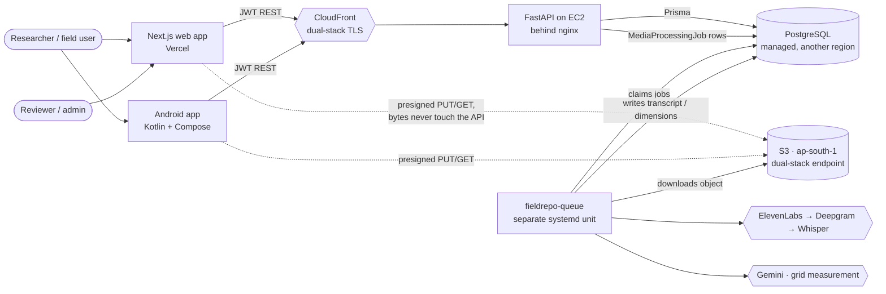

The dotted lines are the point of the design: a 400 MB video costs the API one presign and one
metadata row, not 400 MB of bandwidth.

---

## 2. The production request path

Worth drawing in full, because the two facts that dominate this system's behaviour are both
invisible in the logical diagram above: **the database is in a different AWS region from the web
box**, and **the box is a single burstable t3.micro**.

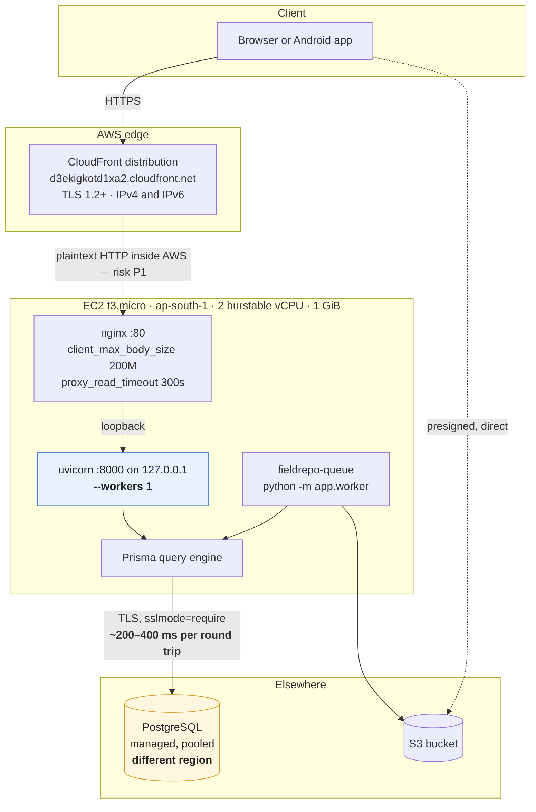

### 2.1 What each hop costs

Measured against live production on 2026-07-27, median of five, from a developer machine in India.
These are **end-to-end** figures including the client's own network, not server timings.

| Endpoint | Median | What it is measuring |
|---|---:|---|
| `GET /health` | **129 ms** | the floor: client network + TLS + CloudFront + nginx + uvicorn, and **no database at all** |
| `GET /health/ready` | 828 ms | the floor **plus one `SELECT 1`** — so a single cross-region round trip is most of 700 ms as seen from here |
| `GET /api/data/tree` | 1,029 ms | |
| `GET /api/media` | 3,074 ms | |
| `GET /api/artisans` | 3,310 ms | 20 rows out of a 16-artisan table |
| `GET /api/tools` | 4,633 ms | 20 rows out of a 74-row table |
| `GET /api/search` | 8,920 ms | |
| `GET /api/dashboard/stats` | 10,567 ms | |

> **Do not quote "154 ms at `/api/health`".** That path does not exist and returns 404 — verified
> again while writing this. The health endpoints are `/health` and `/health/ready`, declared on the
> app rather than on the API router, and therefore **not** under the `/api` prefix.

### 2.2 The finding that explains the table

This is the interesting result, and it is not the one anybody expects.

**There was no classic N+1 in the read routes.** Prisma's query engine already batches a relation
across a page into a single statement — `include={"craft": True}` over twenty artisans issues one
`SELECT … FROM "Craft" WHERE id IN ($1,…,$20)`, not twenty selects.

**The defect was that relations resolved *sequentially*.** Each `include` cost its own round trip,
one awaiting the last. So the cost of a page tracked **the number of relations, not the number of
rows** — which is why twenty rows out of a seventy-four-row table took 3.3 seconds, and why making
the table smaller would have changed nothing.

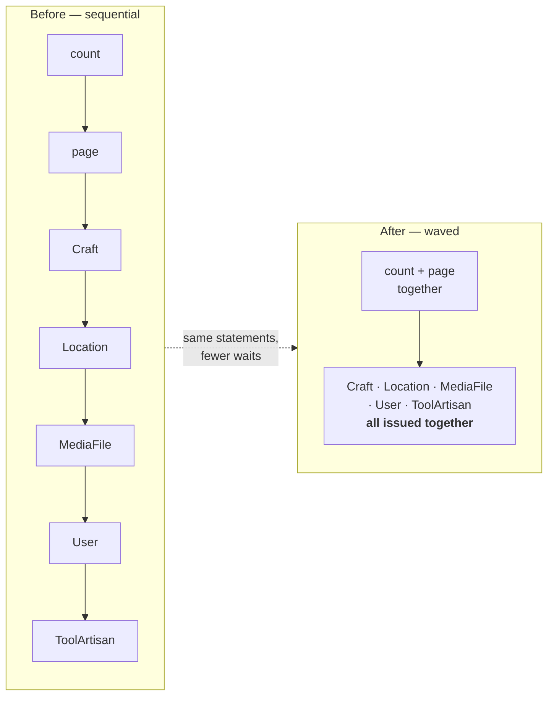

**Statement counts are identical before and after.** Only the waiting changed.

| Endpoint | Sequential waves | After |
|---|---:|---:|
| artisans list | 6 | 3–4 |
| tools list | 8 | 4–5 |
| questionnaire interviews | 12 | 5–6 |
| questionnaire completion | 10 | 5 |

**The real N+1s were in the writes.** A twenty-answer questionnaire PATCH issued **69 statements** —
three round trips per answer — which at production latency is a ~28-second save. It now issues 14.

Measured on an isolated database clone behind a 200 ms-per-statement proxy, **not** on production.
The full analysis, the ranked inventory and the reproduction commands are in
[SCALABILITY.md](SCALABILITY.md).

### 2.3 Why one uvicorn worker

`--workers 1`, and it is not a default nobody changed. With more than one worker uvicorn runs a
supervisor that will `SIGKILL` a busy child; the child's Prisma query engine survives as an orphan
holding pooler connections, and enough orphans exhaust the server's client-connection limit and turn
every request into a 500. (Measured on the Supabase deployment this ran on until 2026-08-22; the
mechanism is leaked connections, not that provider, so it applies to any PostgreSQL with a finite
client limit.) The queue therefore runs as a **separate systemd unit** (`fieldrepo-queue`,
`python -m app.worker`) rather than as a second web worker, so ffmpeg and transcription never block
HTTP and never share the supervisor.

`MEDIA_QUEUE_WORKER_ENABLED` must be `false` on the web process for exactly that reason. See
[ENVIRONMENT.md](ENVIRONMENT.md).

---

## 3. Backend module flow

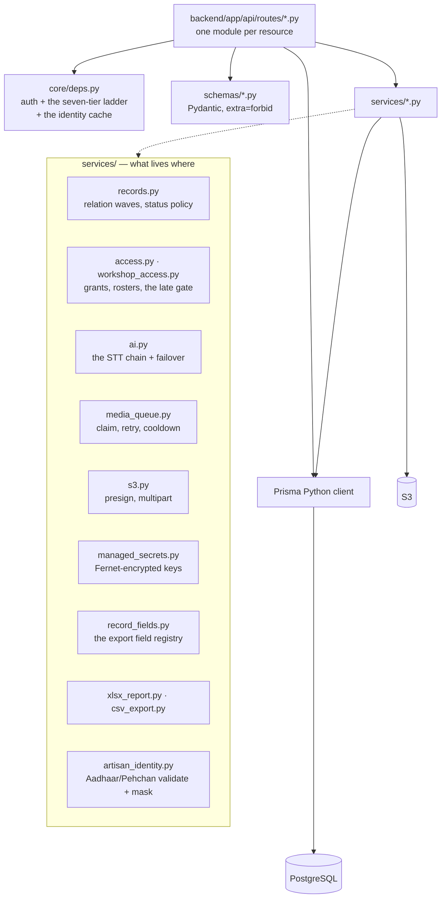

Two module-level things worth knowing before reading any route:

- **`APIModel` is `extra="forbid"`.** An unknown key in a payload is a 422, not a 500 from Prisma.
- **Decimal columns are serialised as JSON strings.** Clients must type measurements and costs as
  strings, not numbers. This has emptied a dropdown twice.

---

## 4. Authentication

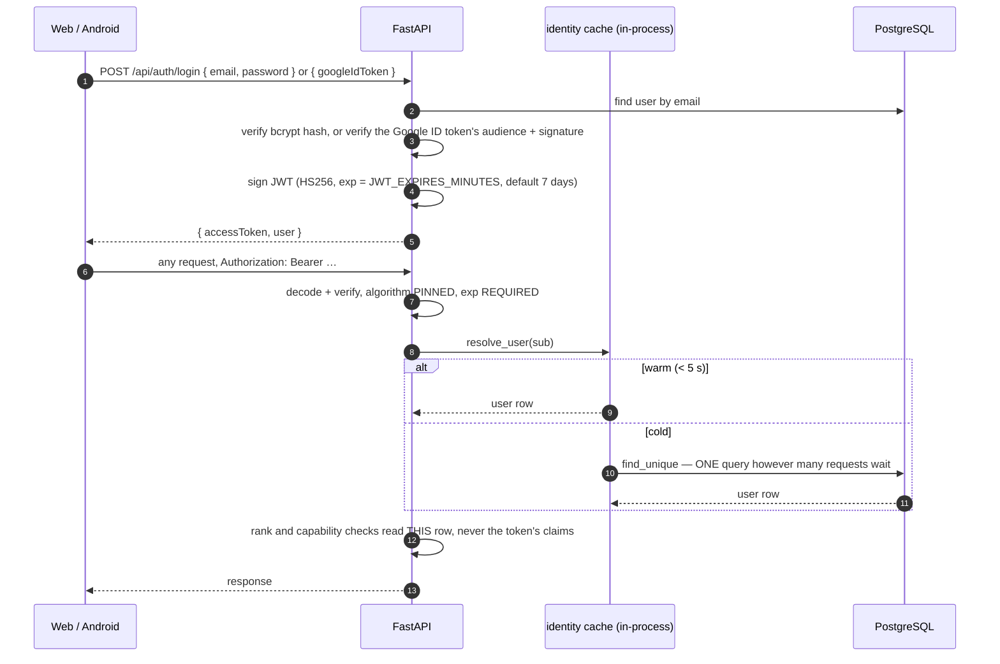

The step that matters for security is the last one. The token carries `email` and `role`, and
**neither is trusted for authorisation**. The database row is re-read because that read *is* the
revocation check: tokens live seven days and are never revoked, so a role claim minted before a
demotion would otherwise stay valid for a week.

The identity cache shortens that revocation window rather than removing it — five seconds by default,
sized to collapse the burst of parallel requests one page load makes and nothing more, with explicit
invalidation on every write that changes a user's authority, and a miss that is never cached so a
deleted account 401s every time. `AUTH_USER_CACHE_ENABLED=false` restores one-query-per-request with
a restart and no deploy.

### 4.1 Google sign-in

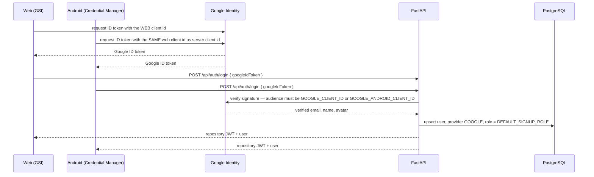

A brand-new self-registered Google account lands on `DEFAULT_SIGNUP_ROLE`, which defaults to the
**lowest** tier (`CROWDSOURCE_VOLUNTEER`). An unknown Google account therefore cannot read or write
as a researcher until an admin elevates it.

---

## 5. Field capture

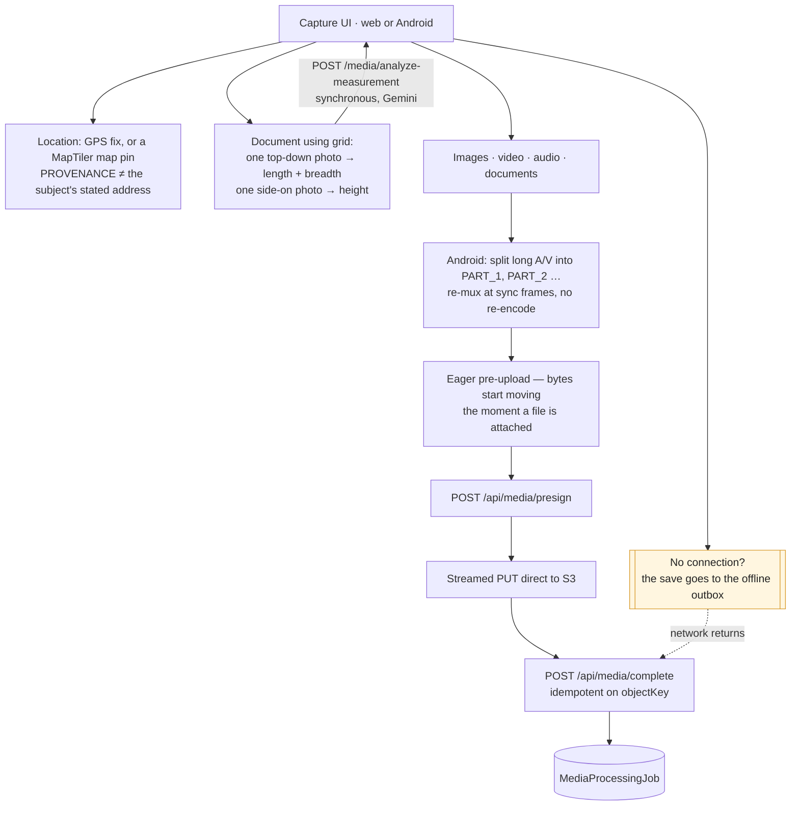

Long audio and video captured on Android is split by **re-muxing at sync frames — no re-encoding** —
into `PART_1`, `PART_2`, … so each segment stays inside the transcription and upload limits and
uploads as its own media file. Uploads stream straight from the content URI and are never buffered
whole, so a multi-hundred-megabyte video cannot exhaust the device heap.

Every tactic in that diagram, and the several the web has that Android does not, is documented in
[MEDIA_PIPELINE.md](MEDIA_PIPELINE.md). The on-device photograph quality checks that run at the
moment a file is chosen — blur, resolution, duplicates, missing views — are
[MEDIA_PIPELINE.md](MEDIA_PIPELINE.md) §3.2.

### 5.1 Place search moves the camera. It never writes the record.

Both map pickers open on the centre of India at zoom 4, so a designer documenting a cluster in rural
Odisha would otherwise pan and pinch roughly two thousand kilometres to reach a village they could
have named in eight keystrokes — on the rural connection everything else here is built for, over
tiles MapTiler bills for. `frontend/lib/placeSearch.ts` (and `PlaceSearch.kt` on Android, pinned by
`android/app/src/test/java/com/designprototype/workshop/data/PlaceSearchParityTest.kt`) is the
forward geocoder that fixes it.

**The rule the whole feature is built around: a result of this search moves the CAMERA and nothing
else.** The coordinate that reaches a research record is the one the designer then places by hand,
and the state and district that reach it come from the *reverse* path — `LocationFields.resolvePoint`
— which puts the geocoder's spelling through the same closed lists `backend/app/services/address.py`
validates a write against.

That rule is enforced structurally rather than by discipline: **`PlaceHit` carries no address fields
at all.** A name, a context string, a point and an optional bounding box — nothing a record wants.
The module therefore *cannot* be wired into a write by accident, which is the point, because a search
that dropped a pin would put a geocoder's guess into a research record with nobody in the loop. That
is character-for-character the failure the location fields exist to have ended: **the geocoder may
offer a value; a person accepts it.**

Three smaller decisions worth keeping:

- **India only, with no setting for it.** Every cluster this repository documents is Indian and the
  address register it validates against is the Indian one. Without the `country=in` filter a search
  for "Bagru" ranks a same-named place elsewhere in the world above the block-printing town in
  Rajasthan. `proximity` biases further to where the map is already looking, because the live API
  returns four Barpalis for one query across two states and only the context string separates them.
- **`MIN_QUERY_LENGTH` is 3**, and the caller says so rather than searching: one or two letters match
  thousands of places and spend a quota unit to return a list nobody can choose from.
- **A failure is not an empty list.** "The search is down" and "there is no such village" are
  different sentences to a designer standing in the village, so `searchPlaces` throws and
  `describeSearchFailure` sorts the throw into the repository's existing two questions — did anything
  reach a server (`isUnreachable`), and is it worth trying again (`isTransient`) — plus a third
  bucket for a key that is missing, expired or out of quota, which is something an administrator can
  act on. An empty **array** is the honest answer to "no such place", and it is the caller's to word,
  because it is not a failure. The bounding box is honoured where the feature has one: a district is
  an area, and flying to its centre at village zoom shows one arbitrary street inside it.

The box is hidden entirely when `NEXT_PUBLIC_MAPTILER_API_KEY` is unset — the same key that draws the
tiles, so there is never a search box without a map to move.

---

## 6. Transcription: three providers, with failover

Not Whisper. Whisper is the **third** provider, and on a deployment with an ElevenLabs key it is
usually never called.

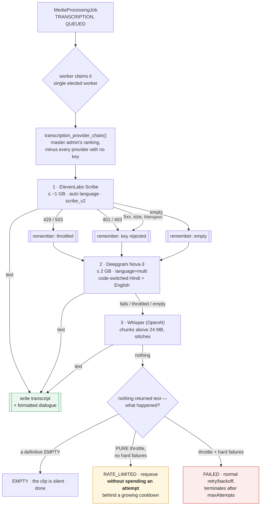

Three distinctions in that diagram are the whole design, and they are genuinely different failures:

| Response | Read as | Queue behaviour |
|---|---|---|
| `401` / `403` | the key is wrong or revoked — every retry will be rejected identically | **hard failure**, but the message names the key an admin must fix, not an HTTP status |
| `429` / `503` | "come back later", in the two ways a provider says it | **`RATE_LIMITED`** — requeued **without consuming an attempt**, behind a growing cooldown, so a throttled clip is still transcribed eventually |
| `5xx` | the provider broke on *this* request | hard failure; the normal attempt budget applies, so a permanently broken clip terminates |

An **empty** result is kept as a fallback but the next provider still gets a chance, because a codec
or language one engine cannot decode is sometimes fine on another.

Ordering is a master-admin setting (`AppSetting.sttProviderOrder`, edited in the Settings hub and on
Android). Ranking expresses a **preference, not a requirement**: a provider whose key is unset is
dropped wherever it sits, so promoting Deepgram on a deployment with no Deepgram key does not stop
transcription. Keys resolve through the managed-secret layer, so adding a key in the UI extends the
chain immediately, with no restart.

Transcription also runs on **idle time**: outside the off-peak window the worker still transcribes
when the one-minute load average is below a fraction of the CPU count, so spare daytime capacity on a
burstable instance is used rather than wasted. Measurement jobs keep flowing during a transcription
cooldown — they are lighter and hit a different provider.

**Refinement is separate from transcription.** `OPENAI_API_KEY`'s primary job is rewriting a raw
transcript into clean interviewer/interviewee dialogue and translating it, per the master-admin
`transcriptionMode` setting (`RAW` / `REFINED` / `REFINED_TRANSLATED`). It only *transcribes* when it
is reached as the third link in the chain.

---

## 7. The offline outbox

Both clients can complete a save with no connection at all. They do it differently, and the
difference is deliberate.

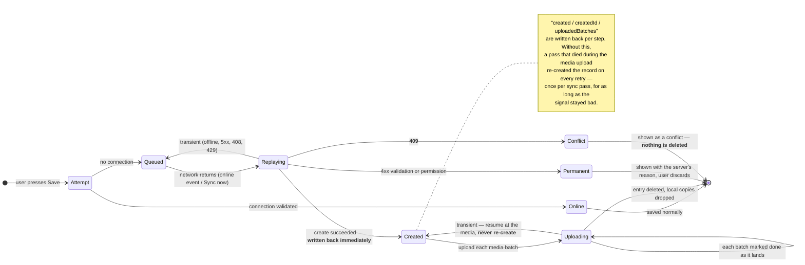

**The two clients triage failures differently, on purpose.** Android's outbox stops at the first
failure, which is right for a connection that dropped again. The web's does not, because one 422 at
the head of the queue would block every entry behind it forever with nothing on screen to say why —
so a permanent failure marks *that* entry and the pass carries on.

**A 409 is never treated as "already saved."** It used to be, and the entry and its photographs were
deleted as sent. No endpoint in this API means that by 409: from `/artisans` it is a clashing Aadhaar
number, from `/crafts` a craft of that name, from `/questionnaire/interviews` an interview that
already exists for that exact artisan set. So the one answer meaning "someone else's record collides
with yours" was destroying the record *and* the attachments *and* reporting success. The lost-response
case it was aiming at is now covered properly by `created`, which knows rather than guesses.

Storage: IndexedDB on the web (`File` objects survive by structured clone), a file plus a `Mutex` on
Android. Media is stored as a **list of batches**, not one lump, because a product queues its two
measurement-grid photos each with the caption naming its dimension, and for a grid photo the caption
is the only thing recording which dimension it measures.

---

## 8. The workshop hierarchy

Everything a researcher records is scoped to a workshop, and that scoping is what the Data Browser,
the export and the permission checks all read.

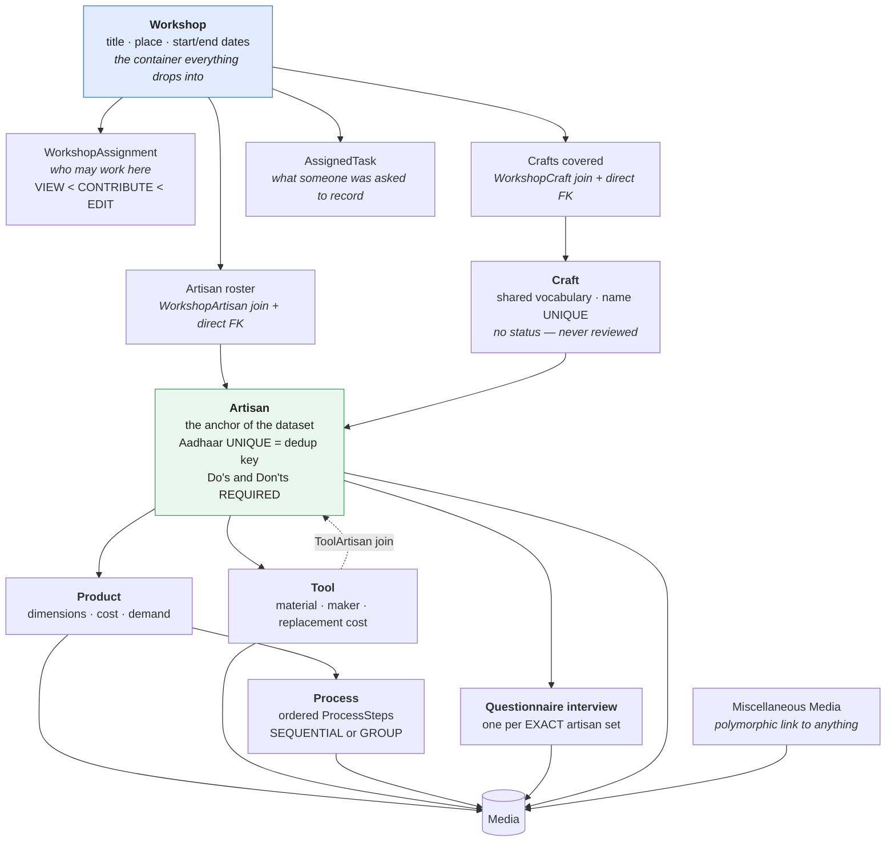

Two consequences of that shape a newcomer will hit:

- **A record created outside its workshop's dates is flagged and pinned** to `PENDING`, and only an
  admin can approve it. The full gate, including its three bypasses, is in
  [PERMISSIONS.md §3.3](PERMISSIONS.md).
- **`Craft` has no status column**, because it is vocabulary rather than a submission. It is
  therefore never reviewed, never pinned, and managed by rank alone (Professor and above).

---

## 9. Record lifecycle

Summarised here; the authoritative version, with who may make each transition, is
[PERMISSIONS.md §3](PERMISSIONS.md).

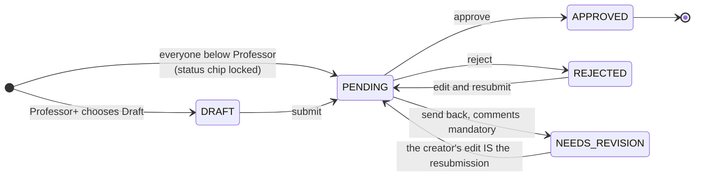

`NEEDS_REVISION` is a real state and has been for some time; a diagram without it is wrong, and
earlier versions of this file were.

---

## 10. Deployment shapes

### 10.1 Production, today

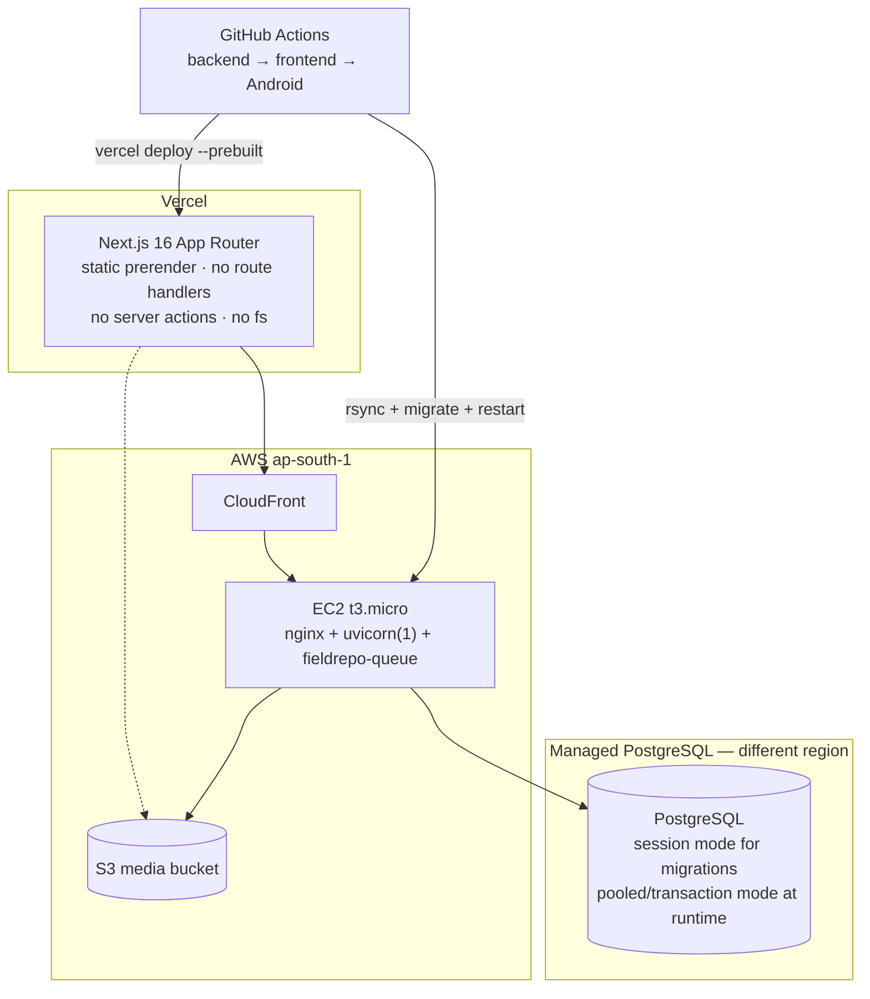

Alternative shapes are documented and, in the case of Kubernetes, partially validated:
[DOCKER.md](DOCKER.md) for containers, [KUBERNETES.md](KUBERNETES.md) for a cluster,
[SCALABILITY.md](SCALABILITY.md) for what would break first at each size.

### 10.2 Local development

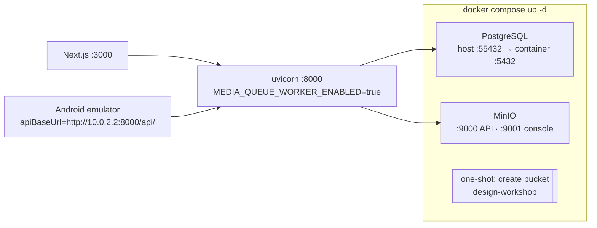

Two local-only gotchas: set `AWS_S3_SSE_ALGORITHM=` (empty) or MinIO rejects multipart creates with
`NotImplemented`, and leave the queue worker **on** locally — the split into a separate service is a
production concern.

---

## How this document is kept true

| Claim class | Kept true by |
|---|---|
| Every path and file reference | `node docs/tools/check-docs.mjs` resolves them; the run fails on a path that no longer exists. |
| Counts (models, endpoints, code volume) | Not stated here. Generated into [REPO_FACTS.md](REPO_FACTS.md). |
| §5.1's "never writes the record" | Structural, and that is why it is stated as structural: the claim holds exactly as long as `PlaceHit` in `frontend/lib/placeSearch.ts` carries no address field. A `state`, `district` or `pincode` added to that type falsifies the section, and would do it silently — the type is the enforcement. |
| §2.1 latency table | Re-measure, do not trust. `for u in /health /health/ready /api/artisans; do curl -s -o /dev/null -w "$u %{time_total}\n" https://d3ekigkotd1xa2.cloudfront.net$u; done` — take a median of five and **re-date the table**. Numbers with no date are the ones that mislead. |
| §2.2 the sequential-waves finding | [SCALABILITY.md](SCALABILITY.md) §1 and §3, and the long comment above `load_relations` in `backend/app/services/records.py`. Re-derive wave counts with the proxy method described in SCALABILITY.md §13. |
| §2.3 one uvicorn worker | `infra/terraform/user_data.sh` — the `ExecStart` line and the comment above it. |
| §4 authentication | `backend/app/core/deps.py` (`get_current_user`, `resolve_user`) and `backend/app/core/security.py`. |
| §6 the provider chain | `backend/app/services/ai.py` (`transcription_provider_chain`, `_transcribe_sync`, `_AUTH_STATUSES`, `_DEFER_STATUSES`) and `backend/app/services/media_queue.py`. `backend/tests/test_stt_providers.py` covers the failover cases. Default order is generated into [REPO_FACTS.md](REPO_FACTS.md). |
| §7 the offline outbox | `frontend/lib/offline.ts` (module docstring) and `android/app/src/main/java/com/designprototype/workshop/data/Offline.kt`. |
| The stage registry (intro) | `backend/app/services/stage_schema.py` — `STAGES`, `Tier`, `FieldSpec`, and `validate_registry`, which the tests run. Storage shape: `DesignWorkshop` / `DwStageEntry` in `backend/prisma/schema.prisma` and `promoted_columns`. |
| Report rendering (intro) | `backend/app/services/report_model.py` is the shared model; `report_docx.py` and `report_pdf.py` render it server-side, and `DocxWriter.kt` / `PdfWriter.kt` / `ReportModel.kt` under `android/app/src/main/java/com/designprototype/workshop/report/` are the on-device port. If a block type is added to the model, every one of those has to gain a branch or the outputs drift — the Kotlin side has no compiler link to the Python side. |
| §8–§9 hierarchy and lifecycle | `backend/prisma/schema.prisma`; the authority for transitions is [PERMISSIONS.md](PERMISSIONS.md). |
| §10 deployment | `infra/terraform/user_data.sh`, `.github/workflows/*.yml`, `docker-compose.yml`. |

**Review triggers:** a new migration, a change to `backend/app/services/ai.py` or `records.py`, a
change to `infra/terraform/user_data.sh`, any new top-level `backend/app/` package, a stage or
field added to `stage_schema.py`, or a new block type in `report_model.py`.

**Known unverified:** that the Android renderers still produce the same document as the server's.
Nothing in this repository diffs a `.docx` written by `DocxWriter.kt` against one written by
`report_docx.py`; the shared model is a convention, not an enforced contract. Also, the CloudFront distribution's cache policy and origin timeout are console
settings this repository cannot read. §2 draws them as [CDN.md](CDN.md) describes them; confirm in
the console rather than from this diagram.
