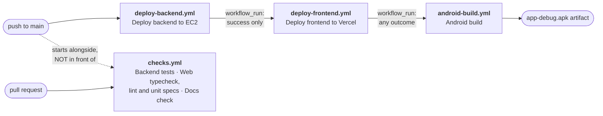

# Continuous integration and delivery

Everything that happens automatically when you push to `main`, why it happens in that order, and
every secret it needs. Sister documents:

- [docs/DEPLOYMENT_VERCEL.md](DEPLOYMENT_VERCEL.md) — the Vercel project itself (env vars, domains).
- [backend/DEPLOY_AWS.md](../backend/DEPLOY_AWS.md) — the EC2/S3/CloudFront side.
- [docs/ENVIRONMENT.md](ENVIRONMENT.md) — every environment variable, per service.

---

> ## ⚠ READ THIS BEFORE YOU SET, COPY OR CHECK A DEPLOY SECRET — 2026-08-22
>
> **This portal and the field repository are two live deployments that share almost every name.**
> Two different EC2 boxes each run systemd units called `fieldrepo` and `fieldrepo-queue`; both
> repositories carry a byte-identical `deploy-backend.yml`; the two Vercel projects sit in the same
> team. **Nothing in a unit name, a workflow file or a hostname distinguishes them.** The only
> things that decide which machine a push touches are the `EC2_HOST`, `EC2_SSH_KEY` and
> `VERCEL_PROJECT_ID` secrets in *this* repository.
>
> A wrong value here does not fail. It **authenticates and succeeds**: `rsync --delete` over another
> product's live `backend/`, its `.env` overwritten, its CORS stripped, `prisma migrate deploy`
> against its database, and a green tick. That box accepts SSH from anywhere, so no security group
> fails it safe.
>
> **This portal's own infrastructure**, read out of
> `infra/terraform/terraform.tfstate.d/designrepo/terraform.tfstate` (the `designrepo` Terraform
> workspace) and `frontend/.vercel/project.json`:
>
> | | This portal (`designer-portal`) | The field repository — **never put these here** |
> |---|---|---|
> | API box (Elastic IP) | `13.206.216.18` | `15.207.145.174` |
> | EC2 instance | `i-0e091ca8e6b417b52` | `i-06f177db5c4e3b0af` |
> | SSH key pair / file | `designrepo-deploy` · `infra/terraform/designrepo-deploy.pem` | `fieldrepo-deploy` · `infra/terraform/fieldrepo-deploy.pem` |
> | S3 media bucket | `designrepo-media-626159998512` | `fieldrepo-media-626159998512` |
> | Vercel project | `designer-repository` · `prj_uRYcc64FRwcrkvMDZg9Gp7ZEtCoc` | `field-repository` · `prj_EzXN8hhGKpMciFBrZRdxpcgUUzN0` |
> | Vercel production alias | `designer-repository.vercel.app` | `field-repository.vercel.app` |
> | GitHub repository | `cxacraftecosystem-ui/designer-portal` | not established from this checkout |
> | CloudFront | **UNRESOLVED — see below** | **UNRESOLVED — see below** |
>
> **The CloudFront row is deliberately not filled in, and must stay that way until somebody opens
> the AWS console.** Two distributions are named in this repository and nothing in a checkout says
> which is this portal's: [ENVIRONMENT.md](ENVIRONMENT.md) §4 states the whole question under
> "UNRESOLVED — WHICH CLOUDFRONT DISTRIBUTION IS THIS PORTAL'S?", with both answers and the one
> command that settles it. `check-docs.mjs` holds the pair open in both directions
> (`checkAndroidApiHost` ties the handset's compiled-in literal to that document; `checkSiblingIdentity`
> refuses to let this row name a winner while the question stands, and refuses to let it go on
> saying UNRESOLVED once the question is gone).
>
> **What is open is the DISTRIBUTION, not the box.** Until 2026-08-22 the sweep read any mention of
> the field repository's Elastic IP `15.207.145.174` near either distribution hostname as a
> restatement of the question above, and excused it. That was wrong twice over. It excused every
> OTHER inherited value in the same table as well — putting `fieldrepo-media-626159998512` back into
> DEPLOYMENT_VERCEL.md §0 produced no finding at all, because a neighbouring row named a CloudFront
> host. And the IP is not the part in question: the `designrepo` Terraform workspace and
> [ENVIRONMENT.md](ENVIRONMENT.md) §4 both say that box is the field repository's and this portal's
> is `13.206.216.18`. A document pairing that IP with "this portal's backend" is making a false
> claim rather than asking a question, so it is labelled like every other mention: by saying whose
> box it is.
>
> **Until 2026-08-22 the table in §2 below gave the field repository's host AND its key — wrong
> together, which is the combination that authenticates.** The rows are corrected. If a deploy ran
> from this repository before that date, see [§7](#7-2026-08-22--what-a-human-must-check-by-hand)
> before assuming nothing landed on the wrong box.
>
> **`terraform output api_public_ip` answers for whichever workspace is selected**, and the
> selection lives in `infra/terraform/.terraform/environment` — a machine-local, untracked file. On
> a fresh clone there is no workspace and no state at all, so that command cannot answer this
> question for you; run `terraform workspace show` first, and if it does not say `designrepo` the
> number it prints is the other product's.

---

## 1. The pipeline

Three workflows chained into a deploy pipeline, **plus one that is deliberately not in the chain.**
One push to `main` walks the whole chain.

**The dotted arrow is the important one.** `checks.yml` also fires on `push: main`, but a GitHub
workflow cannot `needs:` a job in another workflow file, so on `main` it RACES the deploy rather than
blocking it: a commit that breaks the backend suite still ships. The only thing that makes Checks a
real gate is adding its three job names as **required status checks** in branch protection, which is
repository configuration and exists nowhere in this repository. Until somebody does that, treat the
three as advisory on `main` and as a genuine gate on a pull request, where a human reads the red tick
before pressing merge. §5 carries the same warning at the point a reader is deciding what to trust.

| # | Workflow | File | Trigger | What it does |
|---|---|---|---|---|
| 1 | Deploy backend to EC2 | `.github/workflows/deploy-backend.yml` | `push` to `main` | rsync → write `.env` → `prisma migrate deploy` → restart `fieldrepo` + `fieldrepo-queue` → poll `/health` |
| 2 | Deploy frontend to Vercel | `.github/workflows/deploy-frontend.yml` | `workflow_run` on **1** completing | `vercel pull` → **assert the pulled env carries what the app needs** → `vercel build --prod` → **assert those values actually reached the bundle** → `vercel deploy --prebuilt --prod` → smoke-check the alias → **assert the bundle the CDN serves is the one that was verified** |
| 3 | Android build | `.github/workflows/android-build.yml` | `workflow_run` on **2** completing, plus `pull_request` | JDK 17 → `compileDebugKotlin` → `testDebugUnitTest` → `lintDebug` (advisory) → `assembleDebug` → upload APK |
| — | Checks | `.github/workflows/checks.yml` | **every** `pull_request`, `push` to `main`, `workflow_dispatch` — **no `paths:` filter, deliberately** | Three independent jobs: `Backend tests` (whole pytest suite, DSN `ci.invalid` so the database-backed modules skip — and, despite the job's name, a last step that runs `ruff check .` over `backend/` and can fail the build on its own; the dated baseline in `backend/pyproject.toml` is what keeps it green), `Web typecheck, lint and unit specs` (`tsc --noEmit`, `eslint . --max-warnings=0`, `npm run test:unit`), `Docs check` (`node docs/tools/check-docs.mjs`). Chained to nothing in either direction. |

There is also `.github/workflows/keep-supabase-active.yml` — a nightly cron that pinged Postgres so
a free-tier Supabase project would not pause. **It is dormant as of 2026-08-22:** production is not
on that provider, its two `schedule:` lines are commented out, and only `workflow_dispatch` remains.
It asserted nothing about the code either way. The file's header carries the full argument for
keeping it rather than deleting it, and the date it should be reviewed again.

### Why the order is a dependency, not a preference

**Backend before frontend.** The browser calls the FastAPI box **directly**; there is no Next.js
proxy or rewrite in front of it (DEPLOYMENT_VERCEL.md §0). So the bundle Vercel publishes assumes
every endpoint it calls already exists. A single commit routinely adds a page *and* the API route
that page reads — if the Vercel deploy wins that race, the live site spends the gap calling routes
that answer `404`, which users see as empty lists, failed saves and "Failed to fetch" toasts. The
window is not theoretical: the backend deploy **stops the `fieldrepo` service** before running
`prisma migrate deploy`, so there is a real interval where the API is down and a freshly-shipped
frontend would be pointing straight at it. Backend first, frontend second, always.

**Android last, and unconditional.** Stage 3 builds an APK; it deploys nothing. (Getting a build
onto phones is a separate deliberate act — the in-app OTA updater compares `versionCode` against a
*release-signed* APK uploaded by a master admin. Nothing in CI can reach a device.) It is ordered
last only because it is the cheapest and least urgent stage, and running it first would delay the
deploys. It deliberately has **no success gate**: a build gate's inputs are the source tree, not the
state of the servers, so "does the Android app still compile?" is a question you want answered *more*
urgently when a deploy just failed, not less. Gating it would hide a Kotlin compile break behind an
unrelated infrastructure failure.

### What actually runs, per kind of change

The backend workflow has **no `paths:` filter** — it starts on every push to `main` and decides for
itself whether to touch EC2. That is the fix for the obvious `workflow_run` dead-lock: if stage 1
were filtered to `backend/**`, a frontend-only push would never start it, so stage 2 would never be
triggered and the frontend would never ship. Instead, stage 1's `changes` job diffs the push range,
publishes the result as the `pipeline-changes` artifact, and stages 1 and 2 skip their own work when
their area is untouched.

| Push touches | 1 · backend deploy | 2 · frontend deploy | 3 · Android build | — · Checks |
|---|---|---|---|---|
| `backend/**` only | **runs** | skipped (nothing to publish) | runs | **runs** |
| `frontend/**` only | skipped (run still succeeds) | **runs** | runs | **runs** |
| `android/**` only | skipped | skipped | **runs** | **runs** |
| several areas | **runs** | **runs**, after 1 is green | runs | **runs** |
| docs only | skipped | skipped | runs | **runs** |
| backend deploy **fails** | ❌ red | **refuses to deploy**, says why in the summary | still runs | unaffected — it is not in the chain |

The Checks column has no "skipped" cell and that is the design: it has no `paths:` filter, because a
filter is exactly how `android-build.yml` ended up unreachable from a backend pull request. It also
runs on **pull requests with no path filter at all**, which is the gap it was written for. Stages 1
and 2 have no `pull_request` trigger whatever; stage 3 does, but filtered to `android/**` and its own
workflow file — **so before `checks.yml` a pull request touching only `backend/` and `frontend/` ran
nothing**, which is the hole, stated the way `android-build.yml`'s own header states it rather than
as "none of the three run on PRs". **Its result does not hold any of the other three back**; see the note under the pipeline
diagram.

Anything the diff cannot be computed for — manual dispatch, the first push of a branch, a force-push
that orphaned the previous head — is treated as "everything changed". The pipeline over-deploys
rather than silently skipping a real change.

### The three assertions stage 2 makes about the environment

Added after a green pipeline shipped a live site nobody could log in to. Each is a separate step,
and each fails the run loudly:

1. **After `vercel pull`** — every variable the app cannot run without is present in the pulled
   environment. A variable typed **Sensitive** in the dashboard is withheld from `vercel pull` by
   design; because the build happens on a GitHub runner rather than on Vercel, Next.js then inlines
   `undefined` and *both the build and the deploy still succeed*.
2. **After `vercel build`** — those values are actually present in the compiled output. The pull
   succeeding does not prove the build consumed them.
3. **After deploy** — the bundle the CDN is serving is the one that was verified. The step fetches
   `/login`, walks its JavaScript chunks, and confirms the API host appears in them.

Assertion 3 is the one that catches a class the other two cannot: a correct build published behind a
stale alias. **It only catches it against the alias this project actually publishes, and until
2026-08-22 it did not**: both it and the smoke check above named `field-repository.vercel.app`, a
site this pipeline has never deployed, so a `--prod` that failed to move *our* alias still found
another product's healthy page and passed. Both now read the alias from the `projectName` that
`vercel pull` writes into `.vercel/project.json`, so the check follows the deploy target instead of
a literal. It deliberately does **not** check `vercel deploy`'s output URL: that URL addresses the
deployment just uploaded and serves the new build whether or not production was ever moved onto it,
which is the one thing this assertion exists to find out. Together they turn "the site is live but nobody can log in" from a support ticket days
later into a red run in five minutes.

**Know the limit of that derivation.** `https://<projectName>.vercel.app` is the domain Vercel
*conventionally* gives a project of that name — it is not a guarantee that the alias is assigned to
it. `.vercel.app` subdomains are globally unique across all of Vercel, so a project whose
conventional domain was already taken gets a suffixed one while the plain name answers for a
stranger's account; the checks would then grade a page nobody here publishes, which is the same
false green as before by a different route. It is right for `designer-repository` today —
`deploy-backend.yml`'s `BACKEND_CORS_ORIGINS` pin corroborates that hostname from a second,
independent place — and the step refuses outright if `vercel pull` ever resolves the project
`field-repository`. The assertion that would need no such argument is `vercel inspect <deployment
url>` after the deploy, checking the alias against the Aliases the platform reports for that
deployment. It is not in the workflow because it cannot be exercised from a checkout with no Vercel
credentials, and an untested hard gate on the production deploy path is a worse failure than the
one it closes. Promote it the next time somebody has the token in hand.

---

## 2. Required repository secrets

**Settings → Secrets and variables → Actions → New repository secret.** Names are case-sensitive.

| Secret | Used by | Where to get the value |
|---|---|---|
| `EC2_HOST` | backend | Elastic IP of **this portal's** API box: `13.206.216.18` (instance `i-0e091ca8e6b417b52`, tagged `designrepo-api`). From the repository: `cd infra/terraform && terraform workspace show` — it must print `designrepo` — then `terraform output api_public_ip`. In the EC2 console pick the instance tagged **`designrepo-api`**, never `fieldrepo-api`: both exist in the same account and region. `15.207.145.174` is the field repository and must never appear here. |
| `EC2_SSH_KEY` | backend | The **entire** private key file for that instance's key pair `designrepo-deploy`, `-----BEGIN…` through `-----END…` inclusive, with the trailing newline: `infra/terraform/designrepo-deploy.pem`. Paste the file contents, not the path. `*.pem` is gitignored — never commit it. The sibling `infra/terraform/fieldrepo-deploy.pem` opens the *other* product's box; pasting it together with the IP above is the pair that deploys successfully onto the wrong machine. |
| `BACKEND_ENV` | backend | The full contents of the production `backend/.env`: `DATABASE_URL`, `JWT_SECRET`, `AWS_*`, `OPENAI_API_KEY`, `GEMINI_API_KEYS`, `ELEVENLABS_*`, `DEEPGRAM_*`, `BACKEND_CORS_ORIGINS`, … Every key and its meaning is in [ENVIRONMENT.md](ENVIRONMENT.md). Easiest source of truth: `ssh ubuntu@$EC2_HOST cat /home/ubuntu/app/backend/.env`. The workflow pipes it over the SSH tunnel; it is never on a command line. |
| `VERCEL_TOKEN` | frontend | <https://vercel.com/account/tokens> → **Create Token**. Scope it to the **team that owns `designer-repository`**, not "Personal Account", or the CLI 403s. Set an expiry you will actually remember — the deploy starts failing with `Error: Not authorized` the day it lapses. This is the only genuinely sensitive value of the three Vercel ones. |
| `VERCEL_ORG_ID` | frontend | `team_pcTf4Alb2DCIwq2IZcdu00dS`. Also at Vercel → Team Settings → General → **Team ID**, or in the `.vercel/project.json` that a local `vercel link` writes inside `frontend/` (`orgId`). An identifier, not a credential. Both products live in this one team, so it is the one Vercel value that is the same either way — and therefore the one that cannot warn you. |
| `VERCEL_PROJECT_ID` | frontend | `prj_uRYcc64FRwcrkvMDZg9Gp7ZEtCoc` — Vercel → Project **`designer-repository`** → Settings → General → **Project ID**. CORRECTED 2026-08-23: this row said `designer-repository`, and the owner has confirmed the production target is **`designer-repository`** — measured, `designer-repository.vercel.app/login` answers 200 and `designer-repository.vercel.app/login` answers 404. A root-path probe returns 200 for both and proves nothing. WHETHER THE ID BELOW IS STILL THE RIGHT ONE IS UNVERIFIED: it was written by `vercel link`, whose `.vercel/project.json` records `projectName: designer-repository`. Read it off the `designer-repository` project before trusting it, or the same `.vercel/project.json` (`projectId`), which is what `vercel link` wrote in this checkout. An identifier, not a credential, but it is the **deploy target**: `prj_EzXN8hhGKpMciFBrZRdxpcgUUzN0` is the field repository's project, and publishing there succeeds — it replaces another product's live site with this one's build. `deploy-backend.yml` pins `BACKEND_CORS_ORIGINS` to `designer-repository.vercel.app`, so the correct target is also the only one the API will answer. |
| `SUPABASE_DATABASE_URL` *or* `DATABASE_URL` | keep-alive cron — **dormant since 2026-08-22** | A PostgreSQL connection string for the keep-alive ping. **Do not add it.** The cron no longer runs on a schedule and the current provider wakes idle compute on connection, so the secret would buy nothing; the script also rewrites `:5432 → :6543` only for a `.pooler.supabase.com` host, so on anything else it pings whatever the URL names. Unrelated to deploys either way. |

> `.vercel/` is gitignored and is created by `vercel link`, so it is absent from a fresh clone —
> which is why the two rows above name it as a directory `vercel link` produces rather than as a
> repository path.
>
> ~~`field-repository` is the Vercel **project's** name and is deliberately not rebranded: a
> project's name and its production domain are console state, not repository state, and "correcting"
> either here would describe a project that does not exist. `deploy-backend.yml` pins the same host
> in `BACKEND_CORS_ORIGINS` for the same reason, with the full argument next to it.~~
> **STRUCK 2026-08-22 — the argument was sound and the premise was false.** This repository's
> project is `designer-repository` (`frontend/.vercel/project.json`), and `deploy-backend.yml` pins
> `BACKEND_CORS_ORIGINS` to `https://designer-repository.vercel.app,https://designer-repository.vercel.app,http://localhost:3000`
> — it does **not** name `field-repository` anywhere. So the paragraph was defending a
> not-rebranded name that was never this project's name in the first place, and it is what kept the
> wrong project id in the table above and the wrong hostname in three checks in
> `.github/workflows/deploy-frontend.yml`. The general rule it states still holds — console state is
> not repository state — which is why that workflow now **resolves** the production alias from
> `.vercel/project.json` at deploy time instead of writing any hostname down at all.

`GITHUB_TOKEN` is **not** something you create — GitHub injects it per run. Stage 2 uses it only to
download stage 1's change-detection artifact (`permissions: actions: read`).

**The Vercel project is deliberately NOT linked to the GitHub repository.** It was, and every push
produced a second, competing build: Vercel's own Git integration cloning the repo and building it
with no knowledge of this pipeline's ordering. Twelve of those failed outright with `No Next.js
version detected`, because the project's Root Directory was unset and Vercel was building the
repository root, whose `package.json` has no `next` in it. Setting Root Directory to `frontend`
fixed the error; `frontend/vercel.json`'s `ignoreCommand` then turned the builds into cancellations
rather than failures — but a cancelled build is still a deployment record and still an email, for
work that was never wanted. So the link is removed outright: `DELETE /v9/projects/{id}/link`.

GitHub Actions is the only publisher, it authenticates with `VERCEL_TOKEN` rather than with the
repository connection, and `vercel deploy --prebuilt` does not need the project to know about GitHub
at all — verified by deploying successfully immediately after unlinking. The cost is that pull
requests no longer get automatic preview deployments; if those are ever wanted back, re-link in the
dashboard and rely on `ignoreCommand` to keep Git builds off `main`.

**Until the three Vercel secrets exist, stage 2 skips instead of failing.** Its gate job checks for
`VERCEL_TOKEN` and, when it is absent, writes the table above into the run summary and reports
`should_deploy=false`. The run stays green, stage 3 still fires, and the backend deploy's tick keeps
meaning "the backend deployed". This is deliberate: a red X that everyone knows to ignore is worse
than no X at all.

> **UNVERIFIED:** which secrets the repository currently holds cannot be read from a checkout. An
> earlier version of this document asserted the set was `BACKEND_ENV`, `DATABASE_URL`, `EC2_HOST` and
> `EC2_SSH_KEY` only; the Vercel project has since been unlinked and deployed successfully through
> the CLI, which is only possible with `VERCEL_TOKEN` present, so that list is stale. Read the real
> one at **Settings → Secrets and variables → Actions**, or `gh secret list`. Do not restate it here
> — the value of this paragraph is the *mechanism*, and the inventory belongs in the console.

The Android workflow needs **no secrets at all**. It produces a debug-signed APK, and debug signing
uses the auto-generated debug keystore. The release key is deliberately not in CI.

### Not GitHub secrets: the `NEXT_PUBLIC_*` values

`NEXT_PUBLIC_API_URL`, `NEXT_PUBLIC_GOOGLE_CLIENT_ID`, `NEXT_PUBLIC_MAPTILER_API_KEY` and friends are
**build-time** variables that live in the Vercel project (Project → Settings → Environment
Variables, DEPLOYMENT_VERCEL.md §2). `vercel pull` fetches them into the runner before
`vercel build`, so the Vercel dashboard stays the single source of truth and you do not maintain the
same value in two places. Change one there and re-run this workflow (or push) to pick it up.

---

## 3. One-time setup

1. **Add the three `VERCEL_*` secrets** above. The other secrets already exist.

2. **Ensure Vercel is not also publishing.** ~~This is not optional and it is the easiest thing to
   miss.~~ **Already done, and done more thoroughly than this step described:** the Vercel project
   has been **unlinked from the GitHub repository** outright (`DELETE /v9/projects/{id}/link`), so
   there is no Git integration left to race the pipeline. See the "deliberately NOT linked"
   paragraph in §2 for why cancelling builds was not enough.

   The belt-and-braces layers behind that are still in place and should stay: `ignoreCommand:
   "exit 0"` in `frontend/vercel.json`, and `gitProviderOptions.createDeployments` disabled at the
   project level. If the link is ever restored for PR previews, those two are what keep Git builds
   off `main`.

3. **Merge these workflow files to `main`.** `workflow_run` only fires for workflow files that exist
   **on the default branch** — on a feature branch, stages 2 and 3 will not trigger no matter what
   stage 1 does. Stage 3 still builds on pull requests, so PR feedback works before the merge.

4. **First run:** push a no-op commit to `main` (or `workflow_dispatch` the backend workflow) and
   watch all three go green in order before trusting the chain.

---

## 4. Running things by hand

| Goal | How |
|---|---|
| Deploy the backend now | Actions → *Deploy backend to EC2* → **Run workflow**. Manual dispatch always deploys (it skips change detection). Stage 2 does **not** chain off a manual dispatch of stage 1 unless the run completes on `main`. |
| Deploy the frontend now | Actions → *Deploy frontend to Vercel* → **Run workflow**. Leave `force` = true to deploy regardless of what changed. This bypasses the backend gate — that is the escape hatch, use it knowing why. |
| Build the APK now | Actions → *Android build* → **Run workflow**, or open a PR touching `android/**`. |
| Re-deploy after changing a Vercel env var | Re-run *Deploy frontend to Vercel*. `NEXT_PUBLIC_*` values are baked at build time; changing them in the dashboard does nothing until something rebuilds. |
| Get the APK | The run's **Artifacts** section → `app-debug-<sha>`. Debug-signed: sideload-only, and Android will refuse to install it over a release-signed build. |
| Run the Checks suite now | Actions → *Checks* → **Run workflow**. Or locally, which is faster — `PYTHONUTF8=1 python -m pytest -rf --durations=15` from `backend/` (see [QA_AUDIT.md §5](QA_AUDIT.md) — an empty environment does **not** give you the pure core, it gives 70 collection errors) and `./.venv/Scripts/ruff.exe check .` also from `backend/`, because that job lints as well as tests — `check .`, not `check app`, which is narrower than the gate; `npx tsc --noEmit && npx eslint . --max-warnings=0 && npm run test:unit` from `frontend/`; `node docs/tools/check-docs.mjs` from the repo root **on a clean tree**, since `REPO_FACTS.md`'s line counts are read off disk. **`-q` is what this row used to prescribe and it is now the one flag that must not be used** — under `-q` pytest never writes `conftest.pytest_report_header`, so the `database:` sentence saying whether the database-backed modules ran or skipped is absent, and the job's own grep counts it and goes red. **The backend job has a SECOND step that is not in the list above on purpose:** *Prove the database gate on a runner that has only a dotenv* writes `backend/.env` and deletes it again, and it refuses to start if that file already exists. Do not paste it into a terminal on a machine that has real credentials there. |

---

## 5. Known limits, and things that are deliberately not gates

- ~~**The backend test suite is not a gate, and it should be.**~~ **BUILT — 2026-08-20, and not in
  the shape this bullet asked for.** `grep -rn pytest .github/workflows/*.yml` is no longer empty:
  the `Backend tests` job in `checks.yml` runs the whole suite. The bullet asked for "a job running
  `cd backend && python -m pytest -q` that stage 1 `needs:`", and a `needs:` inside
  `deploy-backend.yml` was rejected on purpose — that workflow only fires on `push: main`, so the
  job would never have run on a pull request, which is where the drift it guards against is
  introduced. A separate workflow runs on both. **What the bullet asked for that is still NOT true:
  it does not block the deploy.** `deploy-backend.yml` fires on `push: main` independently and
  cannot `needs:` across a workflow file, so on `main` the two race; only branch protection makes it
  a gate. See §1.
  **The description of the SUITE in the previous version of this bullet was also wrong twice, and
  both corrections are load-bearing.** It first described "294 cases passing in 8.7 s … with **no**
  database fixture, no test client and no secrets" (true on 2026-07-27; `backend/tests/` has since
  grown to the count in [REPO_FACTS.md](REPO_FACTS.md), and ~28 modules import
  `fastapi.testclient.TestClient` and drive real routes against Postgres). It then said "a CI box
  with no `DATABASE_URL` runs the pure core and skips the rest" — **MEASURED, it does not.**
  `app.core.config.Settings` requires `DATABASE_URL`, `JWT_SECRET`, three AWS values and
  `MASTER_ADMIN_EMAIL`, so an environment holding none of them fails to build `Settings` and gives
  **70 collection ERRORS**, collecting 1244 of ~3230 tests — among the casualties
  `test_reference_carry.py`, the entire carry-fidelity suite the workflow exists for. That is why
  the job exports deliberately unusable placeholders including an `.invalid` DSN; the DSN, not the
  absence of one, is what makes the ~28 modules skip. With them it is 2862 passed, 381 skipped, 0
  failed, in four to five minutes. Standing up Postgres in that job would run the other ~28 as well
  and is a second, larger decision — worth taking, but not this bullet's.
- **The Playwright suite is HALF a gate — corrected 2026-08-20.** `checks.yml` runs
  `npm run test:unit`, the `*-unit.spec.ts` selection minus two files excluded by name: pure-function
  specs, no dev server, no browser download, seconds rather than minutes. **No count and no duration
  is written down here, deliberately, and putting one back is the repair to refuse** — Playwright
  prints "N passed" in the step's own log on every run, so a total kept in prose can only ever be
  wrong between edits. This bullet carried "536 tests in about 31 s" long enough for both halves to
  go stale, and a replacement figure was then written here — on the same day, and it is gone again,
  because the number had already moved: `checks.yml`'s `Unit specs` comment records **550** for this
  exact selection on 2026-08-20, and running it here on 2026-08-20 with nothing on :3000 gives **564
  passed**. Nobody was wrong; sibling lanes were adding `*-unit.spec.ts` files between the two. That
  is the whole argument for keeping no total in prose, and it is why the two numbers in this sentence
  are the last ones — they are evidence that the figure rots within a day, not a figure to quote.
  `checks.yml`'s `Unit specs` step takes the same line and says why; the one measurement it does keep
  is of the EXCLUSION — what the pattern collects without the two excluded files, and how they fail —
  which is there to justify the exclusion list and not to describe the suite's size. **The specs that
  drive a screen are still gated by
  nothing**, and neither is `frontend/scripts/pw-smoke.mjs`. Those need a running app and a
  database, so they remain a genuinely larger job — but the cheap half is no longer an argument for
  postponing it, because the cheap half is done.
- **Android Lint is advisory.** `./gradlew :app:lintDebug` on the current tree reports
  *1 error, 44 warnings* and aborts. The error is pre-existing and unrelated to any code change:
  `AndroidManifest.xml:6 PermissionImpliesUnsupportedChromeOsHardware` — `CAMERA` is requested with
  no matching `<uses-feature android:name="android.hardware.camera" android:required="false"/>`.
  Making lint a hard gate today would fail every run and train everyone to ignore red. The HTML/XML
  report is uploaded on every run. Fix the manifest (or commit a `lint-baseline.xml`), then delete
  `continue-on-error` from the lint step and it becomes a real gate.
- ~~**There are no Android tests.**~~ **The Android unit suite is a REAL GATE — corrected
  2026-08-19, and this is the one bullet in §5 that had inverted.** `android/app/src` no longer
  contains only `main/`: there is a unit source set and an instrumented one, with the counts in
  [REPO_FACTS.md](REPO_FACTS.md), which also records that the generated table itself once asserted
  this absence and had never looked. The **Unit tests** step in `android-build.yml` branches on
  whether `app/src/test` holds sources — it now takes the "running them for real" branch, and it
  carries no `continue-on-error`, so a failing Kotlin test fails the workflow. **The step's own
  comment still describes the NO-SOURCE case as the current state** and needs the same correction;
  it belongs to the Android workstream, not to this document. Instrumented tests are still not run —
  they need an emulator; add a separate job with an emulator action rather than bolting one onto
  this build, which is what that step's comment says and is still right.
- ~~**No web typecheck/lint gate of its own.**~~ **BUILT — 2026-08-20.** The `Web typecheck, lint and
  unit specs` job runs `npx tsc --noEmit` and `npx eslint . --max-warnings=0` on every pull request,
  so the answer arrives before the merge rather than as a `next build` failure after the backend has
  already deployed. `--max-warnings=0` is deliberate: this config's warnings are the accessibility
  and hook rules, and a warning nobody fails on is a warning nobody reads. Same caveat as the backend
  bullet — on `main` it does not hold the deploy back; only branch protection would.
- **Don't chain a fourth stage.** GitHub caps how deep `workflow_run` chains can go (documented at
  three levels); this pipeline already uses two hops. A fourth stage should be a job with `needs:`
  inside an existing workflow, not another `workflow_run` link.
- **`concurrency.cancel-in-progress` is off for both deploys.** Cancelling a backend run mid-deploy
  can leave `fieldrepo` stopped between the service stop and the migrate, with no restart step left
  to run. Overlapping pushes queue instead. Only the Android build is cancellable — nothing outside
  the runner is mutated there.

---

## 6. Troubleshooting

**Stage 2 never starts.** `workflow_run` fires only for workflow files on the **default branch**,
and only for runs whose head branch is `main` (the trigger is filtered to `branches: [main]`). Check
that both files are merged. Also check stage 1 actually *ran* — with change detection it may show a
skipped `deploy` job, which is normal and still triggers stage 2.

**Stage 2 says "Backend deploy concluded 'failure' — refusing to publish the frontend".** Working as
designed. Fix the backend deploy, re-run it, and stage 2 will follow automatically. If you must ship
the frontend anyway, dispatch it manually (§4) and know that the site may call endpoints that are
not there yet.

**`Error: Not authorized` / `Forbidden` from the Vercel CLI.** `VERCEL_TOKEN` expired, was revoked,
or is scoped to a personal account instead of the team that owns the project. Re-issue it (§2).

**`Vercel project Root Directory is '', expected 'frontend'`.** Someone cleared Root Directory in
the dashboard. The workflow fails fast on this on purpose, because the alternative is a confusing
`No Next.js version detected` sixty lines into a build. Restore it: Project → Settings → General →
Root Directory = `frontend`. Every Vercel CLI command in the workflow runs from the **repository
root** precisely because that setting is what points the build at `frontend/`; do not "fix" a
root-directory error by adding `working-directory: frontend`, which makes the CLI look for
`frontend/frontend`.

**`Invalid vercel.json - should NOT have additional property '//'`.** JSON has no comments, and the
Vercel CLI validates the file strictly — but only on `deploy`, not on `build`. A `//` key therefore
survives the whole build and fails at the very last step, after several minutes. Keep
`frontend/vercel.json` to schema keys only and put the prose here.

**Why `frontend/vercel.json` sets `ignoreCommand: "exit 0"`.** It stops Vercel's own Git
integration from building this project. Two publishers for one site is the bug: a Git build starts
the moment `main` moves, which is *before* the backend has deployed and migrated, so the live site
spends that window calling endpoints that answer 404. GitHub Actions is the single publisher and it
waits for the backend. The Ignored Build Step is a Git-integration feature only — `vercel build` and
`vercel deploy --prebuilt` from CI never run it, so this cannot block the pipeline. Git-triggered
deployments are *also* disabled at the project level (`gitProviderOptions.createDeployments`), so
this is belt and braces.

**`npm ci can only install packages when … in sync`.** `frontend/package-lock.json` is stale. Run
`npm install` in `frontend/` and commit the lockfile (DEPLOYMENT_VERCEL.md §7.5).

**Two production deployments per push.** Vercel's Git integration has been re-linked. It was removed
outright (§2); if two deployments appear again, that is what happened. Unlink it, or at minimum
restore the Ignored Build Step — see §3.2.

**The deploy is green and the live site cannot log anyone in.** This should now be impossible: the
three assertions in §1 fail the run instead. If it happens anyway, the assertions have a hole and
that hole is the bug — do not just fix the variable. Start at
[DEPLOYMENT_VERCEL.md §2.2](DEPLOYMENT_VERCEL.md).

**Android build fails on the SDK.** The workflow installs `platforms;android-35` and
`build-tools;35.0.0` explicitly because runner images drift. If `compileSdk` in
`android/app/build.gradle.kts` moves, update that step and the JDK pin together — the JDK 17 pin
tracks `sourceCompatibility`/`jvmTarget` in the same file.

**A deploy hangs on the health poll.** Stage 1 polls `http://127.0.0.1:8000/health` 40 times at 2 s
and dumps `journalctl -u fieldrepo -n 80` on failure. Read that output first; the usual causes are a
bad `BACKEND_ENV` value and database connection exhaustion — both covered in
[QA_AUDIT.md](QA_AUDIT.md).

Note the path: **`/health`, not `/api/health`.** The health routes are declared on the app rather
than on the API router, so they sit outside the `/api` prefix and `/api/health` 404s. Any monitor
pointed at the `/api` form is measuring a 404, not the service.

---

## 7. 2026-08-22 — what a human must check by hand

Three defects were repaired in the repository on this date. **None of the three can be closed from
the repository**, because each of them, if it ever ran, moved a value into a console this checkout
cannot read. Nothing below was done automatically and nothing below should be: revoking a live
token and rewriting another team's secrets are decisions with an owner.

### 7.1 `scripts/vercel-ci-setup.mjs` sealed this portal's Vercel token into a different repository

`scripts/vercel-ci-setup.mjs` — exposed as `npm run vercel-ci-setup` — carried a hard-coded
`const REPO = "cxacraftecosystem-ui/documentation-portal"`, while `git remote get-url origin` in
this checkout is `cxacraftecosystem-ui/designer-portal`. Its step 3 writes `VERCEL_TOKEN`,
`VERCEL_ORG_ID` and `VERCEL_PROJECT_ID` into `POST /repos/{REPO}/actions/secrets/…`. So every run
put a **live, team-scoped Vercel token** into the Actions secrets of a repository that is not this
one — where any workflow in that repository can read it, and anyone who can push a branch there can
add a workflow that does — and left this repository with no token, which is the state §2's
"stage 2 skips instead of failing" paragraph describes.

The script now derives the slug from `GITHUB_REPOSITORY` or the `origin` remote, exits non-zero if
neither resolves, prints the repository and Vercel project it is about to touch, and refuses to run
unattended without `--yes`.

**If that script has ever been run, treat the token as exposed.** By hand, in this order:

1. **Revoke it** — Vercel → Account Settings → Tokens → the token used → Delete. Do this first;
   everything else can wait, this cannot.
2. **Issue a replacement**, scoped to the team that owns `designer-repository`, and set it as
   `VERCEL_TOKEN` in **this** repository's Actions secrets. Confirm `VERCEL_PROJECT_ID` is
   `prj_uRYcc64FRwcrkvMDZg9Gp7ZEtCoc` while you are there (§2).
3. **Audit the other repository.** `cxacraftecosystem-ui/documentation-portal` → Settings → Secrets
   and variables → Actions. Delete any `VERCEL_TOKEN`, `VERCEL_ORG_ID` or `VERCEL_PROJECT_ID` that
   this script wrote — but check with that repository's owner first: a secret of the same name may
   legitimately be theirs, and deleting it breaks their pipeline.
4. **Read that repository's Actions log** for runs after the first time this script was used. A
   token in a secret is a token that may already have been used.
5. **Check Vercel's audit log** for deployments and project changes made with the old token.

> **The other product's name survives in one more place, deliberately.** The root
> `package.json`'s `"name"` is still `documentation-portal-root`, and it is NOT a fourth
> undiscovered instance of the bug above — it was found, weighed and left. The package is
> `"private": true`, nothing declares workspaces, nothing resolves it by name, and it is not a
> deploy target; the three fields that a human or a tool actually follows — `repository.url`,
> `bugs.url`, `homepage` — were all corrected to `designer-portal` in the same pass. What keeps it
> from being changed on sight is that `package-lock.json` records the same root name twice and
> `keep-supabase-active.yml` runs `npm ci` from the repository root, so the rename is a two-file
> change and half of it fails CI. Rename both together, in one commit, or not at all.

### 7.2 The documented deploy secrets named the field repository's box and key

§2's table gave `EC2_HOST = 15.207.145.174` together with `infra/terraform/fieldrepo-deploy.pem` —
the other product's Elastic IP and the key that opens it. Wrong *together* is the dangerous
combination, because the deploy then authenticates and completes: rsync `--delete` over
`/home/ubuntu/app/backend/` on a live box, its `.env` replaced, its CORS stripped, and
`prisma migrate deploy` against its database. The rows are corrected and the banner at the top of
this document states the split.

**By hand:** open this repository's `EC2_HOST` and `EC2_SSH_KEY` secrets and confirm they are
`13.206.216.18` and `designrepo-deploy.pem`. If a backend deploy from this repository has ever gone
green, check the field repository's box (`15.207.145.174`) before assuming it was untouched: look at
`/home/ubuntu/app/backend/.env`, its `BACKEND_CORS_ORIGINS` line, and its Prisma migration history.

### 7.3 The frontend deploy smoke-checked another product's site

Three places in `.github/workflows/deploy-frontend.yml` named `field-repository.vercel.app` — the
environment link and both post-deploy assertions — and its header documented
`VERCEL_PROJECT_ID = prj_EzXN8hhGKpMciFBrZRdxpcgUUzN0`, the field repository's project. The alias is
now resolved at runtime from `.vercel/project.json`; the header names this portal's project id.

**By hand:** confirm `VERCEL_PROJECT_ID` in this repository's secrets, and check the Vercel
`field-repository` project's deployment list for builds that came from this pipeline.

---

## How this document is kept true

Everything here describes five YAML files, so almost all of it is mechanically checkable — and the
parts that are not are exactly the parts that were wrong before.

| Claim class | Kept true by |
|---|---|
| The workflows, their triggers and their step order | `.github/workflows/*.yml`. `grep -n "^name:\|^on:\|    - name:" .github/workflows/deploy-frontend.yml` renders the shape of a workflow in one command. **This row said "the three workflows" and there are five**, named rather than counted because a count is what went stale: `android-build.yml`, `checks.yml`, `deploy-backend.yml`, `deploy-frontend.yml`, `keep-supabase-active.yml`. Re-derive them with `ls .github/workflows/` rather than from this sentence; the same stale count was just repaired in `checks.yml`'s own header, which now NAMES the workflows beside it for exactly this reason ("a count is the one fact in this header that a new file falsifies silently and nobody re-reads"). |
| **"Runs" versus "gates"** | **Not checkable from a checkout, which is why §1 and §5 say it in words rather than leaving it implied.** A workflow file proves a job RUNS; nothing in `.github/` proves it BLOCKS anything, because required status checks live in the repository's branch-protection settings (`gh api repos/:owner/:repo/branches/main/protection`, or the Settings page). A reader who takes a green Checks tick as protection for `main` is wrong today. **The gap this row used to record is CLOSED and the row is kept for the rule, not the complaint:** `checks.yml` landed on 2026-08-20 with a long header about what it stops and no sentence about what it does not, and it now carries one — the `THIS WORKFLOW RUNS. IT DOES NOT, BY ITSELF, GATE ANYTHING` block, which names the two specific things it does not do (block a merge without the three job names set as required checks, and block a deploy, since `deploy-backend.yml` fires on its own `push: main` trigger and the two RACE). Whenever a bullet in §5 moves from "not a gate" to built, say which of the two it became — and say it in the workflow as well as here, because a reader who opens the YAML rarely opens this file. |
| The secrets **table** (names and purposes) | `grep -ho 'secrets\.[A-Z_]*' .github/workflows/*.yml \| sort -u` lists every secret the workflows read. Anything in that output missing from §2 is undocumented. |
| Which secrets **exist** | **Not checkable from a checkout, and deliberately not stated.** `gh secret list`, or the Actions settings page. A previous version asserted an inventory here and it went stale within days. |
| The §5 non-gates | The absence of a job. A row leaves that list when a workflow gains the step — so re-read §5 against the workflow files, not against memory. **This row is not enough on its own and 2026-08-19 proved it:** the Android bullet went stale not because a workflow changed but because the *tree* did — the step was already there, branching on whether `app/src/test` had sources, and the sources arrived. A non-gate bullet that describes the CODE as well as the workflow has two ways to rot, and only one of them is visible in `.github/`. |
| The measured pytest figure in §5 | **There is no longer a figure to re-date, on purpose.** It said "294 cases passing in 8.7 s" for three weeks after the suite had roughly septupled and grown ~28 `TestClient` modules, and a stale number quoted as the cost of a proposed CI job is worse than no number. §5 points at [REPO_FACTS.md](REPO_FACTS.md), which is generated. If you put a timing back, date it and say which `DATABASE_URL` it ran with — the same command takes seconds with the database modules skipping and minutes with them running. |
| Vercel project settings (Root Directory, Git link, `createDeployments`) | **UNVERIFIED from here** — dashboard state. §3 and §6 say what they must be; the workflow's own "Assert the project is still rooted at frontend/" step is the only thing that actually checks one of them, and it checks it at deploy time. |
| **§0's identity register** | `docs/tools/check-docs.mjs` (`checkSiblingIdentity`), which reads THIS table and then sweeps every tracked file for the field repository's values: each occurrence must say whose it is within a few lines, or the run reports it. Where a checkout holds the artefacts §0 names, the *this portal* column is corroborated against them — `outputs.api_public_ip` and `outputs.s3_bucket` of the `designrepo` Terraform workspace, `frontend/.vercel/project.json`, and `git remote get-url origin`. So the way to add a fact is to add a ROW: an identity established anywhere else is one the sweep cannot see, and a row that states its value in prose instead of a backticked literal is a row that has quietly left the sweep — both are failures, and the number of sibling values this table yields is pinned in `EXPECTED_SIBLING_VALUES`. **An unlabelled sibling value is a failure wherever it is written**, .kt and .tf and .env.example included, since those are the files that point a deploy at a machine. The nine mentions already in the tree are listed one per line in `SIBLING_ALLOWLIST` and printed as `known` on every run; shrinking that list is the work. Changed 2026-08-22 — until then only `docs/*.md` could fail, so a reintroduced deploy target in a source file produced a green run. |
| The CloudFront row staying empty | Two checks, in both directions. `checkAndroidApiHost` requires ENVIRONMENT.md to carry the open question for exactly as long as the handset default and its infrastructure table disagree; `checkSiblingIdentity` requires §0's CloudFront row to say UNRESOLVED for exactly as long as that question stands, and to stop saying it the moment it is answered. Neither picks a side, and neither will let the question be quietly dropped or quietly outlive its answer. |

**Review triggers:** any change under `.github/workflows/`, `frontend/vercel.json`, or
`infra/terraform/user_data.sh` (which defines the services stage 1 restarts).

**The failure mode to watch for in this document specifically:** it accumulates entries about
console state — a Vercel toggle, a secret, an Ignored Build Step — that nobody can verify from the
repository and everybody assumes is still true. Each such claim is marked **UNVERIFIED**. When one
turns out to be wrong, do not just correct the value: ask whether the claim belongs here at all, or
whether the pipeline should be asserting it at runtime the way §1's three environment assertions now
do.
