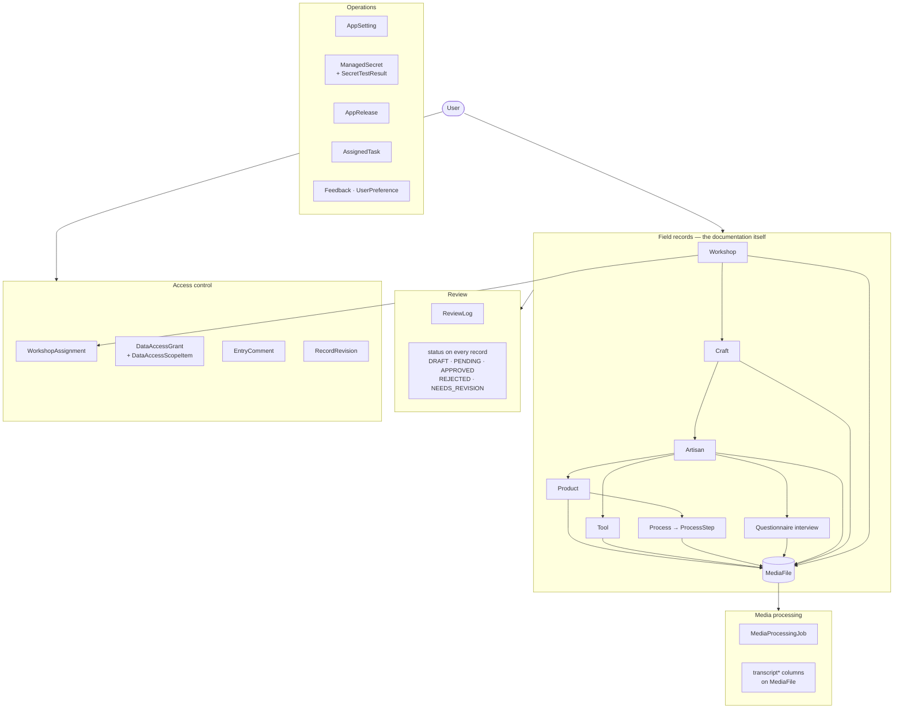
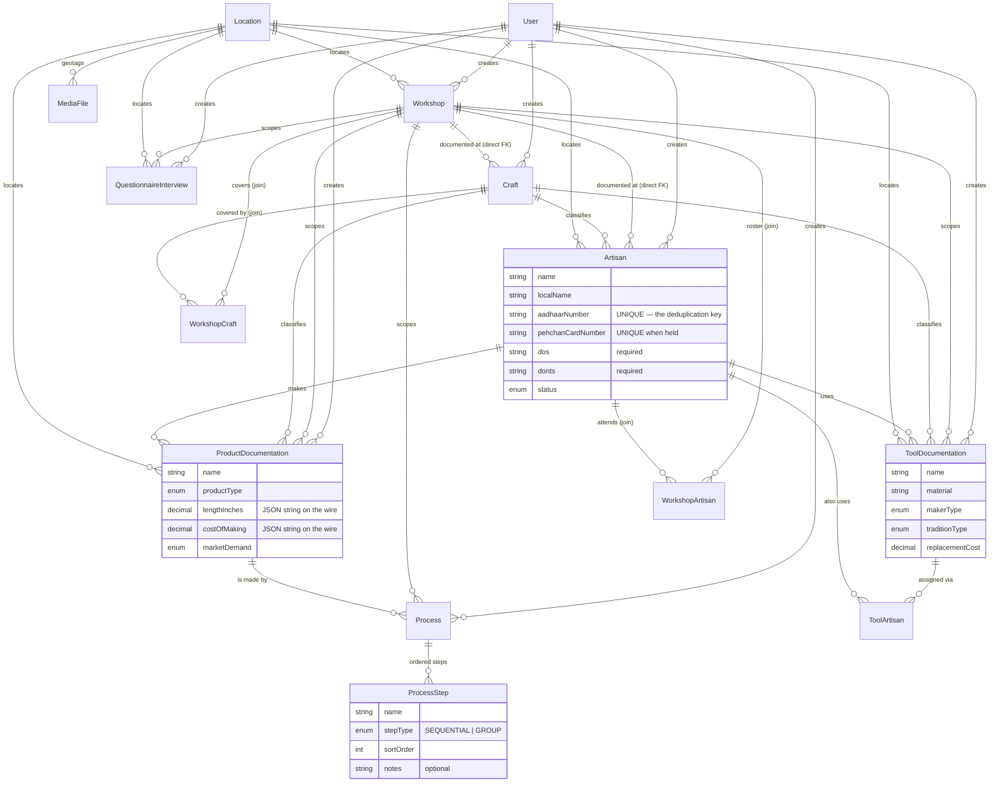
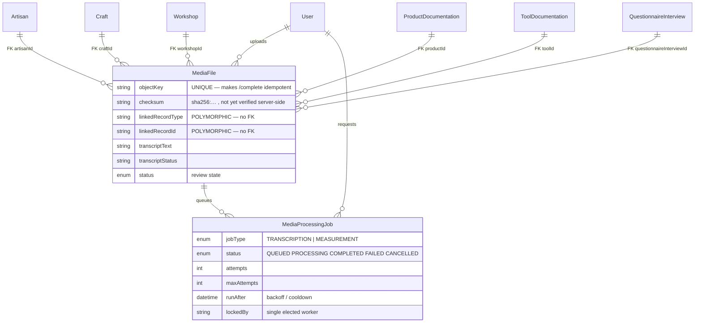
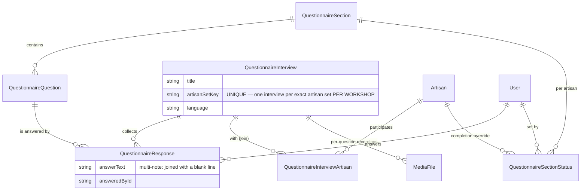
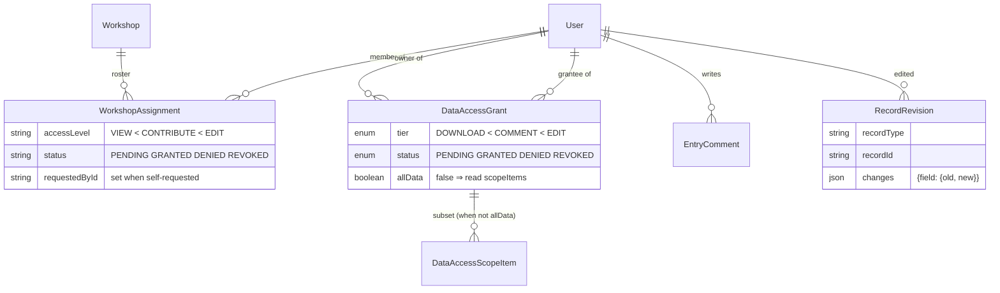

# The data model

The shape of everything the repository stores, why each relationship exists, and the four places
where the schema does something a reader would not predict from the field names.

Source of truth is `backend/prisma/schema.prisma` — a single file, heavily commented, and the only
definition of the database. Model and enum **counts** are not written here; they are generated into
[REPO_FACTS.md](REPO_FACTS.md), because a count in prose is wrong the first time anyone adds a table.

Sister documents: [ARCHITECTURE.md](ARCHITECTURE.md) for how requests reach these tables,
[PERMISSIONS.md](PERMISSIONS.md) for who may write to them, [SCALABILITY.md](SCALABILITY.md) for what
the indexes are for, and [DESIGN_WORKSHOP.md](DESIGN_WORKSHOP.md) for why `DesignWorkshop`'s typed
columns are an *index over* `DwStageEntry.data` rather than a second copy of it — the one place in
this schema where a column is deliberately derived rather than authoritative.

---

## 1. The one-line shape

**Workshop → Craft → Artisan → { Product → Process → ProcessStep, Tool, Questionnaire } → Media.**

Everything else in the schema is one of four supporting systems: review, media processing, access
control, or operations (settings, secrets, releases, tasks, feedback).



Read that as: a `User` is the author of everything in `core`; `acl` decides which users may see or
change another user's rows; `review` and `proc` are state machines that run *over* core records
rather than beside them.

---

## 2. Field records

The tables a researcher actually fills in. Attribute lists below are the load-bearing columns, not
every column — the schema has the full list with a comment on each non-obvious one.



### 2.1 Workshop is linked twice, on purpose

`Craft` and `Artisan` each carry **both** a direct `workshopId` column and a row in the
`WorkshopCraft` / `WorkshopArtisan` join table. That is not redundancy left behind by a migration.
The join answers "which crafts did this workshop cover", which is many-to-many and always was; the
direct column answers "which workshop was this record *documented at*", which is single-valued and is
what every workshop-scoped permission check and every Data Browser folder reads. The two are written
in lock-step (`link_workshop_artisan` / `link_workshop_craft` in
`backend/app/services/workshop_access.py`), and the column is nullable so rows recorded before it
existed keep working.

**`Craft.workshopId` is live, and one migration's header says it is not — do not follow it.**
`backend/prisma/migrations/20260729120000_map_legacy_records_to_their_workshop` backfills every model
EXCEPT `Craft`, on the stated ground that "a craft is taxonomy … and **no screen narrows crafts by
workshop**, so filling the column would invent a fact". The second clause is stale: `GET /crafts`
takes a `workshopId` parameter, and `REFERENCE_MODELS["Craft"].workshop_where` in
`backend/app/services/design_workshops.py` narrows the design-workshop craft picker by it. An
engineer who reads the migration and believes it concludes the column has no consumers and deletes
them.

**The migration's CONCLUSION still holds, which is why the SQL is left exactly as it is.** Both of
those readings are `OR`ed with the `WorkshopCraft` join (`{"OR": [{"workshopId": wid}, {"workshops":
{"some": {"workshopId": wid}}}]}`), so a legacy craft with a NULL column still appears under every
workshop that links it — the backfill would buy nothing — and inferring the column from a craft's
neighbours would assert that the craft was *documented at* that workshop, which is a documentation
event that never happened. **Never edit the SQL of an applied migration**: Prisma checksums them and
a rewritten file makes the whole history unapplyable. Repeat this pointer in the header of the next
migration that touches `Craft`, where the next reader will actually be standing.

### 2.2 One tool, many artisans — and, since 2026-09-15, many crafts

The same documented tool recurs across crafts. `ToolArtisan` exists so it is entered once and then
assigned, rather than re-entered per craft — which is also why `ToolDocumentation` keeps its own
single `artisanId` (the artisan it was *documented with*) alongside the join.

`ToolCraft` (migration `20260915100000_tool_craft_links`) is the same shape on the other axis, added
when the tool record form's "Linked craft" became a multi-select on all four clients. It is
`@@unique([toolId, craftId])` with a `@@index([craftId])` and both sides `Cascade`, and it carries no
`@@index([toolId])` of its own because that is the leading column of the unique.

**The two joins are siblings and the scalar column beside each means the same thing**, which is the
part worth reading twice. `ToolDocumentation.craftId` is not a denormalised copy of the first row of
the join — it is *the craft the tool was documented under*, exactly as `artisanId` is the artisan it
was documented with. What IS derived is `craftName`, the required text box on the form: it is the
selected crafts' names joined with `", "`, recomputed from the selection on every save. That
derivation is bounded on both sides at 180 characters — `TOOL_CRAFT_NAME_MAX_LENGTH` in
`backend/app/schemas/records.py` and `CRAFT_NAME_MAX_LENGTH` in
`frontend/components/forms/recordPickers.ts` — and an over-long selection is **refused, never
truncated**, naming the crafts that do not fit. A server that stored a name its own update schema
would reject would make the record permanently unsaveable, which is why the bound is checked where
the join is built rather than only where the column is declared.

### 2.3 Decimals are strings on the wire

Every `Decimal` column — measurements, costs, prices — is serialised by the API as a **JSON string**,
not a number. Clients must type them as strings. This has emptied a dropdown twice by being
forgotten; see the note in [ARCHITECTURE.md](ARCHITECTURE.md).

### 2.4 `Location` is two answers to two different questions

The largest comment in the schema is on this model, and it is worth reading in full. Briefly:

| Group | Columns | Means | Written by |
|---|---|---|---|
| **Provenance** | `latitude`, `longitude`, `altitude`, `accuracy`, `capturedAt`, `placeName`, `address` | where the **device** was when the record was typed | automatically, by the capture UI |
| **Stated address** | `state`, `district`, `village`, `pincode`, `subjectLatitude`, `subjectLongitude` | where the **subject** is, as a statement by the researcher | only ever by a person |

The split exists because every artisan on the live database with a location sits within a few hundred
metres of one point in Kharagpur, West Bengal, while the places their researchers typed are Bagru,
Balotra, Kutch, Rudraprayag, Ballupur, Sanganer and Kappaladoddi. The coordinates are not wrong —
they are genuine GPS fixes, with real accuracy values, **of the desk the record was typed at**. The
schema previously had nowhere to say that, so the fix got read as the artisan's address. Nothing was
backfilled; the mismatch is flagged in the form rather than guessed at in the database.

> **In flux.** The geocoding service (`backend/app/services/address.py`), the reference endpoint and
> both clients' `LocationFields` are being changed by another workstream as this is written. The
> table above is the schema's shape, which is settled; the UI wording around it may not match yet.

---

## 3. Media, and the polymorphic link

`MediaFile` is the one table almost everything points at, and it uses **two different linking
mechanisms** — which is the single most confusing thing in the schema if you meet it by accident.



**Six parents are real foreign keys.** Artisan, craft, workshop, product, tool and questionnaire
interview each have a nullable column on `MediaFile`, with `onDelete: SetNull` — deleting a product
orphans its photographs rather than destroying them.

**Process and process-step media are not.** There is no `processId` or `processStepId` column on
`MediaFile`. Those attachments are carried by the polymorphic pair `linkedRecordType` +
`linkedRecordId` (`"process"`, `"processstep"`), as `backend/app/api/routes/processes.py` says
explicitly. Anything that walks media by parent must handle both mechanisms — the Data Browser and
the XLSX export both do, via their `_MEDIA_TAG_SLOTS` / `_OWNER_TAGS` lists.

> If you are drawing this relationship for a paper, draw it as two mechanisms. Earlier versions of
> `ARCHITECTURE.md` drew `ProcessStep ||--o{ MediaFile` as an ordinary relation; there is no such
> relation in the database, and a reader who trusts it will write a join that cannot be written.

`linkedRecordType`/`linkedRecordId` is also how Miscellaneous Media attaches to anything at all, and
how `EntryComment` and `RecordRevision` address a record without one FK per table.

---

## 4. Questionnaire



Three things here that are not obvious:

- **`artisanSetKey` is unique, and it carries the workshop.** The value is
  `"<workshopId>|<designWorkshopId>|<sorted artisan ids>"`, so there is exactly one interview per
  *exact* set of artisans **at a given workshop**. Saving answers for a set that already has an
  interview there folds into it rather than creating a second one — which is why
  `POST /questionnaire/interviews` is the one route that cannot decide from its signature whether it
  is a create (see `assert_can_create_records`). The scope went into the key on 2026-09-20
  (migration `20260920120000`): before it, one set held one interview *repository-wide*, so a second
  workshop interviewing the same artisans had its answers folded onto the first workshop's row and
  its own sitting never existed. It is inside the key rather than a composite index because both
  workshop columns are nullable and NULLs are distinct under a Postgres unique index — a composite
  would have stopped deduping the interviews that name no workshop, which are the majority.
- **Completion is derived, then overridden.** The artisans × sections matrix is computed from the
  responses that exist; `QuestionnaireSectionStatus` stores an *admin override* on top, for the
  legitimate case of a section that will never be answered.
- **A response belongs to its answerer.** `answeredById` is why a question already answered by
  somebody else cannot be silently overwritten by the next contributor.

**`Questionnaire` — the uploaded pro-forma, a different object from the interview family above — is
now citable from a design-workshop stage (2026-09-03).** Stage 7's `surveyPlan.questionnaireRef` is a
REF at it, and three facts about that citation are worth having in one place:

- **It carries the TITLE and nothing else.** `REFERENCE_MODELS["Questionnaire"]`'s `data` lambda is
  `{"name": r.title}`, and `REFERENCE_HYDRATION["surveyPlan.questionnaireRef"]` is the single pair
  `name → questionnaireName`. **No `QuestionnaireFormEntry` and no `QuestionnaireFormAnswer` is
  loaded on that path.** Citing a questionnaire from a stage does not pull anybody's answers into the
  workshop, and the stage's own required prose box is untouched and still required.
- **The picker is account-scoped, and it is the only reference model that is.** Every other entry is
  pooled; `Questionnaire` carries `ownerId`, a nullable `designWorkshopId` and an admin-set
  `isShared`, so its options are narrowed by the asking account through `ReferenceModel.viewer_where`.
  A reference request that names no account is refused **401** rather than served an unfiltered list.
- **The rule is `questionnaire_forms.visible_questionnaire_where` — the same one `GET /questionnaires`
  applies**, moved out of the route and into the service on 2026-09-03 so there is one definition
  rather than two copies of a four-clause visibility rule. The route keeps a one-line alias.

---

## 5. Access control

Three separate systems, deliberately not merged, because they answer three different questions.



| System | Question it answers | Granted by |
|---|---|---|
| Role (`User.role`) | what *kind* of thing may you do at all | a professor or admin, on the Users page |
| `WorkshopAssignment` | may you work **in this workshop** | an admin — either by assigning, or by deciding a user's own request |
| `DataAccessGrant` | may you see **another researcher's** records | that researcher, the record owner |

`WorkshopAssignment` and `DataAccessGrant` are both two-sided: a row can start as an admin's grant or
as the subject's own request (`requestedById` distinguishes them), and a refusal is kept as `DENIED`
rather than deleted, so nobody can re-request their way quietly around a "no".

`RecordRevision` is append-only and stores `{field: {old, new}}`, which is what lets an admin
reconstruct a record's original values after a cross-researcher edit. It is written on the contribute
path, so an edit that goes through the normal PATCH is captured; a direct database write is not.

**It is written inside the same transaction as the row update it describes** (since 2026-09-03: every
PATCH route opens one `db.tx()` spanning `guard_record_edit` and its own `update`, and
`access.record_revision` takes the caller's `client`), so a revision with no corresponding row change
is not a state the schema can reach. What that replaces is specific: a revision committed one
statement before an `update` that died, naming an editor as the author of a value no row holds.

**The same transaction now also carries an OPTIONAL precondition — `expectedUpdatedAt`, added
2026-09-03, and it is inert until a client opts in.** All six record PATCH routes (`/artisans`,
`/crafts`, `/workshops`, `/products`, `/tools`, `/processes`) accept it. It is **a question, not a
column**: `records.take_expected_updated_at` pops it off the payload before anything reaches Prisma,
and `assert_expected_updated_at` is called **inside the transaction and above every write**, so a
refusal rolls the `RecordRevision` back with it.

* **Absent passes**, and that is the whole compatibility story — every client shipped to date sends
  no precondition, so only a caller that opts in by sending the field can ever meet the refusal. A
  row with no stored `updatedAt` also passes.
* **A mismatch is `409` with a dict detail**: `{"code": "record_changed", "message": "Someone else
  changed this record after this edit was composed.", "expectedUpdatedAt": …, "currentUpdatedAt": …}`.
  Tell it apart from the other 409s these routes can answer — a taken craft name, an Aadhaar
  conflict — **by `detail["code"]`, never by the status**.
* **The comparison is a one-second tolerance, not equality**, and naive datetimes are read as UTC on
  both sides. It is a narrowing rather than a promise: the window it closes is hours wide, not
  milliseconds.
* **A timestamp rather than a counter** because `updatedAt` already exists on all six models and is
  already in every response, so the server half needed no migration.

**It is not reachable from either client yet, and the gap is mechanical and named.** Six Kotlin DTOs
(`ArtisanDetailDto`, `CraftDto`, `WorkshopDetailDto`, `ProductDetailDto`, `ToolDetailDto`,
`ProcessDetailDto`) and the six matching TypeScript types each declare `createdAt` and **stop** —
none declares `updatedAt`, though the server has always sent it. Until a client deserialises the
value it has nothing to echo back, which is why the two client halves are deferred rather than
built.

One exception, in `access.REVISION_REDACTED_FIELDS` (`aadhaarNumber`, `pehchanCardNumber`, `phone`,
`email`, `address`): those entries record which field changed, who changed it, when, and the
direction it moved (set / replaced / cleared, flagged `redacted`), but not the value — so their
originals are **not** reconstructable from the ledger. Clearing a contact column is how a subject's
"take my number off your system" is honoured, and a ledger that copies the number on the way out
would make that request a lie. The reasoning, and what it costs on the two unique identity columns,
is argued out above the set in `backend/app/services/access.py`.

That argument **rested in part on a premise that no longer holds**, and the comment now says so:
it reasoned that the ledger's `old` was the last copy of a previous Aadhaar number anywhere in the
system, because the Aadhaar crossed into no design-workshop stage entry at any masking. The owner
reversed that carry on 2026-08-24 — both identity numbers now ride into a workshop's participant
roster masked to their last four digits — so the alternative that was declined there (store
`mask_identity_number(old_value)` instead of a flat placeholder) is **re-raised, not settled**.
Nothing about `REVISION_REDACTED_FIELDS` itself changed; what changed is that the reason for
refusing to widen it is spent.

### 5.1 `SanctionOrder` — the ministry's instrument, and the one row that writes both rosters

Added 2026-09-13 (migration `20260913110000_sanction_orders`); **made multi-designer on 2026-09-16**
(migration `20260916150000_sanction_order_designers`, §5.1.1). A sanction order is the document that
authorises a design & prototype workshop and names its budget. A ministry officer records the order
number, the order date, the sanctioned amount and the designers it names through
`POST /api/sanction-orders`, and that one request writes — in one transaction, per designer where the
row is per-designer — an `AccessRoster` admission, a `DesignerRoster` empanelment, a `User` (only
where the mailbox has none), a `DesignerProfile`, one `DesignWorkshop`, a `DesignWorkshopViewer` row
on it for every named designer, the `SanctionOrder` itself and its `SanctionOrderDesigner` rows.
`backend/app/services/sanction_orders.py` is where the order of those writes and the transaction
boundary are argued.

| Column | Type | Why it is shaped this way |
|---|---|---|
| `sanctionOrderNo` | `String @unique` | the ministry's own spelling, trimmed and whitespace-collapsed and nothing else — it is what an auditor holding the paper will search for |
| `sanctionOrderKey` | `String @unique` | the same number upper-cased with every non-alphanumeric removed. **This is the constraint that actually bites**: `SO/2026/42`, `SO-2026-42` and `so 2026 42` are three house styles for one instrument and Postgres calls them three values. NOT NULL, unlike `DesignerProfile.empanelmentKey`, because that column was backfilled over rows that had already collided and this table starts empty |
| `sanctionOrderDate` | `DateTime` | a DATE in meaning; a timestamp because this schema has no date-only type. Always written midnight UTC |
| `sanctionAmount` | `Decimal @db.Decimal(14, 2)` | `NUMERIC(14,2)` with a `CHECK (> 0)`. **Never a float** — see §2.3, and see the migration header for why 14 digits rather than the 12 the product money columns use, and why there is no currency column |
| `designerUserId` | FK → `User`, **Restrict** | the **lead** designer the order NAMES. Part of what the order says, not a grant that can be withdrawn. Kept as a scalar after the order became multi-designer, for the reason §5.1.1 gives |
| `designerEmail` | `String` | the lead's **canonical** mailbox (`designers.canonical_email`), which for an aliased Gmail is deliberately NOT `designerUser.email` — see below |
| `designers` | `SanctionOrderDesigner[]` | every designer the order names, **including the lead**. A lead with no row here would be a second place to look for "who is on this order" |
| `sourceFilename`, `sheetRow` | `String?`, `Int?` | which uploaded sheet and which 1-based Excel gutter row recorded this order. NULL on every hand-typed order and every row predating the importer. Per-order columns rather than a pointer at the ledger, the shape `AnnualPlanEntry` already uses, so the register answers "which line of which sheet" with no join |
| `designWorkshopId` | FK → `DesignWorkshop`, `@unique`, **Restrict** | one order, one workshop, both directions. Restrict because the API's delete is a SOFT delete, so this fires only on a hard purge — and a hard purge of a workshop the ministry funded must be refused by the database rather than discouraged by a route |
| `createdById` | FK → `User`, **Restrict** | the officer. Who authorised the spend outlives their employment |
| `accountCreated` | `Boolean` | did this order mint the account, or did the designer already have one? It is what decides whether a sign-in link is offered at all |
| `notes` | `String?` | admin-typed only, like `AccessRoster.notes`. The machine-written provenance goes on the ROSTER rows instead |

**THE MONEY HAS EXACTLY ONE HOME AND NO REPORT COPY, AND THAT IS THE WHOLE REASON THIS IS A TABLE.**
`sanctionOrderNo` and `sanctionOrderDate` already existed as stage-1 registry fields living inside
`DwStageEntry.data` JSON, and there was no sanctioned-amount field anywhere in the registry at all.
Promoting the three onto `DesignWorkshop` was the obvious-looking fix and is wrong in the way that
matters: a promoted column's single writer is `promoted_values`, i.e. the DESIGNER saving stage 1, so
an officer's sanction figure would be overwritable by typing in a box — and `_coerce_promoted` NULLs a
promoted column whose entity was touched with a blank value, which would delete a ministry figure
under a 200 reading "Stage saved". The stage fields keep their copy of the NUMBER and the DATE,
seeded once at creation, because a report is a historical document and an order amended in 2028 must
not rewrite the cover of a report submitted in 2026. **The amount has no copy and must never get
one**; `backend/tests/test_sanction_order_gate.py` fails the day a FieldSpec named for one appears.
Drift between the register and the cover is REPORTED — `reportCopyMatches` on the wire — and never
blocked, because a designer correcting a mistyped number on their own cover is doing something
legitimate and blocking it would make the cover unfixable without a ministry officer, offline, in a
village.

**`User.email` AND `SanctionOrder.designerEmail` DIFFER FOR AN ALIASED GMAIL, ON PURPOSE.** Both
sign-in doors look `User.email` up LITERALLY, so the account is written under the literal lower-cased
address; both rosters and this column are written under `canonical_email`, because that is the key
the gates read. Getting either backwards is silent at write time and locks somebody out days later —
a canonical `User.email` 401s a password sign-in and is missed by Google sign-in, which then mints a
second account.

**Both `User` foreign keys are `Restrict`, so a sanction order makes TWO people undeletable** — the
officer who recorded it and the designer it names. `backend/app/api/routes/users.py` carries two
relation lists rather than one for that reason: `_CREATOR_RELATIONS` renders "This account created …"
and `_NAMED_ON_RELATIONS` renders a second sentence, because a designer named on an order created
nothing and the first sentence would be false about the one account it is describing.

**There is no `cancelledAt`, no `supersededById` and no delete.** The first time the ministry
withdraws an order, the product's only answer today is "edit the notes". That is an open question for
the owner rather than an oversight.

#### 5.1.1 `SanctionOrderDesigner` and `SanctionOrderImport` — several names on one order, and the sheet that recorded it

Added 2026-09-16 (migration `20260916150000_sanction_order_designers`). One migration, two tables, two
nullable columns on `SanctionOrder` and one backfill — and every statement in it is a `CREATE`, an
`ADD COLUMN`, an `ADD CONSTRAINT` or an `INSERT`. Nothing existing is altered, retyped or dropped.

**`SanctionOrderDesigner`** is `@@id([sanctionOrderId, designerUserId])` with `Cascade` to the order
and **`Restrict`** to the `User`. The `Restrict` is the choice worth reading: `DesignWorkshopViewer.user`
is `Cascade`, and its own comment argues that because *a viewer row is not authorship*. This one is
authorship-adjacent — it records that the ministry named this person on an instrument that authorised
money — so it makes a co-designer undeletable exactly as the lead already was.

Four columns beyond the key, each answering a question the scalars cannot:

* `designerEmail` — the canonical mailbox **this** designer was admitted under, per row, for exactly
  the reason `SanctionOrder.designerEmail` is not derived from `designerUser.email`.
* `accountCreated` — did this order mint **this** account. With several designers the answer differs
  per person, and it is what decides whether a sign-in link is offered for them.
* `position` — first-seen order from the sheet or the picker, **0 for the lead**. An officer's chosen
  order is the only order they can see, and "the first name" has to keep meaning something on a screen
  where the first name is the one that reaches a ministry document.
* `createdAt` — the order's own instant for every backfilled row, not `now()`, so "position 0, then
  oldest first" stays meaningful across the backfill.

**Why the three lead scalars stayed.** `SanctionOrder.designerUserId`, `designerEmail` and
`accountCreated` were NOT migrated away into the join. A list cannot express "this one is the lead",
and the lead is not decoration: their profile is what seeds stage 1 and stage 3, and one name reaches
`dc:creator` on the generated report because the file format cannot hold a list. Keeping the scalars
also means the create body a deployed client already sends is byte-for-byte valid — `APIModel` is
`extra="forbid"`, so replacing two scalars with one list would have 422'd every older client at once.
The rule that keeps the two representations honest is that the lead has a row in **both**, which is
why `routes/users.py`'s `_NAMED_ON_RELATIONS` counts the JOIN and not the scalar: counting both would
report one order as two, and counting only the scalar answers `0` for a co-designer — the people this
table exists for.

**`SanctionOrderImport`** is the upload ledger, in the shape `DwArtisanImport` set: the filename, the
sheet `pick_sheet` chose (found by heading, not by position, so worth recording), four counts, the
problems as `Json`, who uploaded it and when. The counts are on the wire because
`rowsRead = recorded + skipped + refused` must **add up on screen** — a report whose numbers do not
sum is a report an officer cannot check, and the panel says so when they do not. The problems are JSON
and not a child table for `DwArtisanImport.problems`' reason: they are sentences written to be read
once, not rows anything queries.

**Two things the importer deliberately does not do**, recorded here because their absence is a
decision: it mints **no sign-in links** (a link is shown once, and a link nobody was standing in front
of is a link nobody sent — each is re-issued from its own row afterwards), and it writes **no
tombstone** for a refused row. Confirmation is stateless: every refusal is re-run per row at confirm
time, so a stale tab's row is refused rather than recorded wrongly.

### 5.2 `DesignWorkshopOversight` and `DwArtisanImport` — the sixth access system, and its ledger

Added 2026-09-13 (migrations `20260913120000_dw_workshop_oversight` and
`20260913120100_dw_artisan_import`).

`DesignWorkshopOversight` says WHO IS ACCOUNTABLE for one design & prototype workshop: exactly one
Assistant Director and exactly one Regional Director. Its primary key is
`(designWorkshopId, capacity)`, where `capacity` is the Postgres enum `DwOversightCapacity` with two
members — **the pair IS the identity**, so re-assigning a capacity to a different person is an UPDATE
of the same row rather than a second row, and a `@@unique([designWorkshopId, userId, capacity])`
would have admitted two Assistant Directors where the requirement and the line on the report have
room for one.

**AN ENUM AND NOT TEXT, which is the OPPOSITE of the choice `workshopKind` and `FeedbackReport`
made**, so the reason has to be stated rather than assumed. Those two are closed lists a product
decision widens and a typo'd value prints oddly and does nothing else. This column is HALF THE
PRIMARY KEY: a typo'd capacity is a third row on a workshop that neither the AD lookup nor the RD
lookup finds — an officer assigned to a workshop nobody can see they were assigned to, which is
`DwAccessRequestStatus`'s argument rather than `workshopKind`'s.

**DESIGNER IS DELIBERATELY NOT A MEMBER OF THE ENUM.** Who a workshop is FOR already has an owner —
the promoted `DesignWorkshop.designerName` column, the `DesignWorkshopViewer` row, and the stage 1 /
stage 3 copy the designer prefill makes. A capacity row saying "the designer is X" beside a column
saying "the designer is Y" would be two answers to one question, and the report prints the column.
`services/design_workshop_oversight.reassign_designer` drives that machinery instead of duplicating
it.

**It is NOT a `capacity` column on `DesignWorkshopInspector` and NOT a `DesignWorkshopViewer` row.**
Six reasons for the first, in the header of `backend/app/services/design_workshop_oversight.py`; the
second is the one that would be silent, because a viewer row confers every stage save.
`docs/PERMISSIONS.md` §4.6 is the argument in full.

`assignedAt` is a column of its own rather than a reading of `createdAt`, and the difference is the
question each answers: `createdAt` says "since when has this workshop had an AD", where the question
anybody asks is "since when has THIS PERSON been its AD". A re-assignment restamps the first and not
the second.

`DwArtisanImport` is the LEDGER of the artisan-list upload: one row per accepted `.xlsx`, carrying
the filename, the sheet, five counts and the per-row problem list as JSONB. It is modelled on
`DwReportExport` — a per-event row, actor `SetNull`, indexed `(designWorkshopId, createdAt)`.

**The workbook itself is never stored, only its filename, and that is a PII decision rather than a
size one.** An artisan list carries Aadhaar numbers; keeping the bytes would turn one regulated
COLUMN into a regulated FILE with its own retention question, its own access rule and its own
deletion story. The parse is transient. Every identity number inside `problems` is already MASKED by
the importer at the one place the number is read — nothing on the read path re-masks it, because a
mask applied in two places is a mask that can be forgotten in one.

**The ledger row is written BEFORE any artisan and updated at the end**, which is why partial success
is legible: a failure halfway leaves a row saying what had happened by then, and a deployment whose
migration has not run fails on the importer's first write with nothing created.

**Every `Location` an import creates carries the WORKSHOP'S venue coordinate as PROVENANCE and a NULL
subject pin**, and the upload is refused outright when the workshop has no venue location on stage 1.
That is §2.4's finding applied: a coordinate invented for fifteen artisans in four states is exactly
what the split columns exist to end. `extraMetadata` carries
`{source: "ARTISAN_XLSX_IMPORT", designWorkshopId, importId}` — three keys chosen so that none of
them collides with `common._stated_district`'s fallback read of `extraMetadata["district"]`.

### 5.3 `AnnualPlanEntry` — the ministry's directory, and the one table that is not a workshop

Added 2026-09-13 (migration `20260913140000_annual_plan_directory`).

**A ROW HERE IS A LINE IN A DOCUMENT.** Somebody at the ministry intends that a workshop happen: a
number, a date, a state, a district, a venue. Two hundred to three hundred rows a year arrive as one
Excel sheet and are corrected by uploading the same sheet again. The row holds **no fieldwork** — no
stages, no viewers, no inspectors, no media, no dictation consent, no completeness score, no report
— and it **confers access on nobody**.

It is in §5 with the access systems and it is not one of them, which is the whole reason it has a
section here rather than a line in §2. `DesignWorkshop` is the container a fortnight of work lives
in. Conflating the two is how a ministry is shown "287 workshops held this year" when 284 of them
have not happened, and the leak does not arrive as a union: it arrives as a helpful-looking change to
ONE query — a dashboard tile that "should include planned workshops too", a dataset that "should show
what is coming" — each a one-line edit in a file that has nothing to do with this feature.
`backend/tests/test_annual_plan_is_not_a_workshop.py` is a **census** for that reason: exactly two
modules in `backend/app/` may name the table on a Prisma client, and a third fails the suite.

**THE NATURAL KEY IS `(planYear, workshopNoKey)`, AND THE SECOND HALF IS A FOLDED COPY.** The
ministry's workshop number is the only thing in the row that is stable across two versions of one
spreadsheet — the correction is usually to the venue, the district or the date. But the number AS
TYPED is not a key: the same reference arrives as `DPW/2026/017`, `dpw/2026/017 ` and
`DPW/2026/<NBSP>017` across three saves of one file. So it is stored twice — `workshopNo` exactly as
the sheet spells it, because that is what a person reads and what becomes the workshop's code, and
`workshopNoKey` folded (NFKC, whitespace runs collapsed, trimmed, upper-cased) for matching. That is
the split `DesignerProfile.phoneKey`/`empanelmentKey` made, for the same stated reason.

**Punctuation is KEPT by the fold**: `DPW/2026/017` and `DPW-2026-017` stay two references, because
they are two strings in the ministry's own document and merging them would merge two plan rows on a
guess. And there is **no SQL twin of the folding rule** — unlike migration `20260830170000`, which
had to spell its normalisations in SQL as well because it BACKFILLED existing rows. This table is new
and has no history, so `annual_plan_xlsx.fold_workshop_no` in Python is the only writer and there is
no second copy to drift from. Do not add one.

**`planYear` IS ONE INTEGER AND THE LABEL IS RENDERED.** 2026 means FY 2026-27. An integer sorts,
indexes and compares with no normalisation rule, and a normalisation rule spelled in Python and again
in SQL is exactly the trap the identity keys above carry. `annual_plan.plan_year_label` owns the
printable form and nothing stores it.

**THERE IS NO `status` COLUMN AND NO `AnnualPlanEntryStatus` ENUM.** Standing is PLANNED / PROMOTED /
WITHDRAWN and all three are readable off `withdrawnAt` and `designWorkshopId`, so
`annual_plan.standing_of` derives it in one place. A stored status beside those two columns would be
a second source for a fact they already carry, and the two would disagree the first time a promotion
failed halfway. `workshopKind` is TEXT for the reason `DesignWorkshop.workshopKind` is: the
vocabulary lives in `stage_schema.ENUMS["WORKSHOP_KIND"]`, and a second list in the database would be
the copy that refuses a write for a member the registry already offers.

**`designWorkshopId` IS `@unique`, AND THAT IS THE PROMOTION RULE MADE STRUCTURAL.** A planned row
becomes at most one workshop and a workshop comes out of at most one planned row. The route refuses a
second promotion with a sentence naming the workshop that already exists — a constraint violation
cannot say WHICH — but a route is one door and this is the kind of rule a second door gets added to.
**The foreign key sits on THIS table** rather than as a column on `DesignWorkshop` because that table
is read by forty-odd routes and is the subject of `stage_schema.PROMOTED_COLUMNS`; a new column there
invites the next reader to promote it out of a stage, which is a registry change and an Android
release. `onDelete: SetNull` and not Cascade: a workshop is soft-deleted and never removed, so this
fires only if somebody removes one by hand, and losing the ministry's plan row because a workshop was
cleaned up would be the wrong end of the leash.

**NOTHING IS EVER DELETED.** A row absent from a later sheet is WITHDRAWN — a stamp and the account
that made it — and a withdrawn row that reappears in a later sheet is reinstated. A row that has
already become a workshop is **never** withdrawn by an upload, whatever the checkbox says: a designer
may be standing in the courtyard, and taking the line out of the directory while the workshop, its
viewers, its media and its report went on existing would leave nothing anywhere saying why the two
disagree.

**`revision`, `sheetRow` AND `sourceFilename` ARE THE PER-ROW PROVENANCE, AND THERE IS NO UPLOAD
HISTORY TABLE.** The upload report is the HTTP RESPONSE and is not persisted, which is what the
questionnaire upload does too. `revision` counts the uploads that CHANGED this row: an upload that
re-states a row byte for byte writes nothing at all — not a column, not `updatedAt`, not `revision` —
and that no-write is the whole of what makes "re-upload the corrected sheet" safe to do twice.

⚠ **`sheetRow` GOES STALE ON PURPOSE, and it is the visible price of the paragraph above.** After a
re-SORTED sheet that changed no data, every `sheetRow` still holds its old position, because no row
differed and therefore no row was written. That drift is asserted rather than tolerated in silence:
`test_annual_plan_upload.py::test_a_re_sorted_sheet_that_changes_nothing_writes_nothing` fails if
somebody "fixes" it by writing the column on every row.

**The four `User` pointers are all `SetNull` and all indexed** — for the DELETE each is on the wrong
end of, not for any read, which is the reasoning `DwStageEntry.createdById` and
`DesignWorkshop.dictationConsentById` both record. None of them makes an account undeletable and none
belongs in `routes/users.py`'s `_NAMED_ON_RELATIONS`.

**THE ONE LEGITIMATE JOIN IS `designWorkshopId`**, in either direction, and it is written by exactly
one function: `annual_plan.promote_entry`, which calls `design_workshops.open_design_workshop` — the
shared opener that runs the eligibility check, the create, the viewer rows and
`seed_designer_prefill` in that order. A second copy of those four steps is a second place that can
forget the fourth, and forgetting the fourth is not a visible failure: it is a workshop whose
promoted columns have no stage entry behind them, which the designer's FIRST stage-1 save nulls out
under a 200 reading "Stage saved".

---

## 6. Operations

| Model | Holds | Notes |
|---|---|---|
| `AppSetting` | repository-wide settings | includes `transcriptionMode` (`RAW`/`REFINED`/`REFINED_TRANSLATED`) and the STT provider order |
| `ManagedSecret` | runtime-editable provider keys | value is **Fernet-encrypted at rest**; never returned in full, only a masked preview |
| `SecretTestResult` | the last reachability check per key | so "is this key working" has an answer that is not a guess |
| `AppRelease` | published Android APKs | the OTA channel; `versionCode` is what devices compare, and `sizeBytes` (`BigInt`, **nullable**) is what a phone compares a finished download against before handing the file to the installer |
| `AssignedTask` | one row per assignee | a batch of five researchers is five rows sharing a `batchId` |
| `Feedback`, `UserPreference` | one row per user each | |
| `ReviewLog` | one row per review decision | append-only; an edit-then-approve writes two rows |

### `clientKey` on the four record models — added 2026-09-03

`Workshop`, `ProductDocumentation`, `ToolDocumentation` and `Process` each carry
**`clientKey String? @unique`** (migration `20260903100000_record_client_key`). It is what makes an
offline replay of a CREATE idempotent, and it closes [AUDIT-2026-08-30.md](AUDIT-2026-08-30.md)'s
A30-05 for the record family.

**Nullable, with a plain `@unique` rather than a partial index.** Postgres treats NULLs as distinct
under a unique index, so the column already permits any number of keyless rows and
`… WHERE "clientKey" IS NOT NULL` would build exactly the same guarantee — while being inexpressible
in `schema.prisma`. `NOT NULL DEFAULT ''` was refused for the obvious reason: one empty string would
collide with the next, and the second create of any kind on this deployment would be refused.

**The replay contract is `/media/complete`'s, copied almost line for line.** A create whose
`clientKey` is already present returns **the existing row through the same 201 handler** — there is
no `replayed: true`, because a caller must not be able to tell a replay from a first landing. A key
whose row belongs to another account answers **403**. A replayed process returns its steps and writes
no new ones; a replayed workshop writes neither roster.

**Do not confuse it with `DwStageEntry.clientKey`**, which identifies one ROW WITHIN ONE WORKSHOP and
is unique only in company (`@@unique([designWorkshopId, entityKey, clientKey])`). These four identify
one CREATE REQUEST, globally.

**Three models deliberately did not get one**, because each already carries a constraint that catches
the same duplicate, and two idempotency mechanisms can disagree about what a duplicate is:
`Artisan.aadhaarNumber @unique` (plus a pre-write 409 naming the holder),
`QuestionnaireInterview.artisanSetKey @unique` (creation is already idempotent on it, per
workshop since 2026-09-20) and
`Craft.name @unique`.

### Two columns added on 2026-09-03

**`DwStageEntry.version` — `Int NOT NULL DEFAULT 0`, the optimistic-concurrency counter.** `save_stage`
writes `update_many(where={"id": …, "version": seen}, data={…, "version": {"increment": 1}})`, and a
count of zero is read as **a concurrent writer, not a missing row** — the row is addressed by primary
key, so the only way to write nothing is for the version to have moved. `update_many` rather than
`update` exists solely to get that count: `update` raises on no-such-row and cannot distinguish the
two.

Two writes are deliberately **not** guarded by it. The **sweep** (the soft delete of rows the client
did not send back) is not, because its input is an absence rather than a value a second designer could
have edited — guarding it would refuse a legitimate deletion because somebody else touched an
unrelated row in the same stage. The **`DesignWorkshop` header write** is not, because it is a
different row with a different contention story and a version on it would make every stage save
conflict with every header edit. Both are decisions, not omissions; the refusal contract for the
guarded path is in [DESIGN_WORKSHOP.md](DESIGN_WORKSHOP.md).

**`AppRelease.sizeBytes` — `BigInt`, nullable, the published APK's length in bytes when the publisher
recorded one.** Nullable because **no release row written before 2026-09-03 has one and nothing
backfills them**, so an absent value must keep meaning "download and trust the transfer" — the
behaviour every fielded handset already has. A present value is what a phone compares a finished
download against before handing the file to the installer; Android's own signature check remains what
decides whether the file may be installed at all. The publish workflow's body now carries the field,
which imposes a deploy ordering — see [CI.md](CI.md) §1.4.

---

## 7. Enums

Every enum, and the thing to know about each. The list of names is generated into
[REPO_FACTS.md](REPO_FACTS.md); this is what they *mean*.

| Enum | Values | Note |
|---|---|---|
| `UserRole` | the eleven tiers, `DESIGNER` at 35, `INSPECTOR` at 37 and the three directorate tiers at 42/45/48 | strictly ordered by rank, but **`can_run_design_workshops` is a SET** (Designer/Admin/Master Admin), so both a Professor and an Inspector outrank a Designer and still cannot run a design workshop. `INSPECTOR` reaches a workshop only through the read-only per-workshop scope — see [PERMISSIONS.md](PERMISSIONS.md) §1 and §4.5 |
| `AuthProvider` | `LOCAL`, `GOOGLE` | a Google account has no password hash at all |
| `RecordStatus` | `DRAFT`, `PENDING`, `APPROVED`, `REJECTED`, `NEEDS_REVISION` | `NEEDS_REVISION` is the "sent back with comments" state |
| `ReviewRecordType` | artisan, workshop, product, tool, process, questionnaire, media | processes and interviews are reviewable because the late-submission gate can pin them `PENDING` |
| `MediaType` | image, video, audio, pdf, document, other | |
| `MediaProcessingJobType` | `TRANSCRIPTION`, `MEASUREMENT` | |
| `MediaProcessingJobStatus` | queued, processing, completed, failed, cancelled | a throttled job returns to `QUEUED` **without** spending an attempt |
| `ProcessStepType` | `SEQUENTIAL`, `GROUP` | ordered stage versus things done together |
| `DataAccessTier` | `DOWNLOAD` < `COMMENT` < `EDIT` | ordered; each includes the ones below |
| `DataAccessStatus` | pending, granted, denied, revoked | only `GRANTED` confers anything |
| `ProductType`, `MarketDemand`, `MakerType`, `TraditionType` | field vocabularies | |

Note that two ordered ladders — `WorkshopAssignment.accessLevel` and `AssignedTask.status` — are
**plain `String` columns, not enums**, for client compatibility. Treat them as enums in code; the
database will not.

---

## How this document is kept true

| Claim class | Kept true by |
|---|---|
| Model and enum counts, index counts, the model list | Generated. `node docs/tools/check-docs.mjs --write` rewrites [REPO_FACTS.md](REPO_FACTS.md); the check fails if it is stale. No count appears in this file. |
| The relationships in every `erDiagram` | Hand-written against `backend/prisma/schema.prisma`. Re-derive with the one-liner below and diff the result against §2–§5. |
| Column semantics and the four surprises (§2.1, §2.3, §2.4, §3) | The schema comments. Each is quoted from a comment that lives next to the column; if the comment and this file disagree, the schema wins and this file is wrong. |
| Paths and line references | `node docs/tools/check-docs.mjs` resolves every path mentioned here. |

Re-derive the relation graph after any migration:

```bash
python - <<'EOF'
import re
src = open('backend/prisma/schema.prisma', encoding='utf-8').read()
models = re.findall(r'^model (\w+) \{(.*?)^\}', src, re.S | re.M)
names = {n for n, _ in models}
for name, body in models:
    rels = [f"{m[1]}:{m[2]}" for line in body.splitlines()
            if (m := re.match(r'\s*(\w+)\s+(\w+)(\[\])?\??\s', line + ' ')) and m[2] in names]
    print(f"{name}: {', '.join(rels) or '-'}")
EOF
```

**Review trigger:** any file under `backend/prisma/migrations/`. A new migration means this document
needs a human read, not just a regenerated count — a new column is a fact, but what the column
*means* is the part only a person can write.
