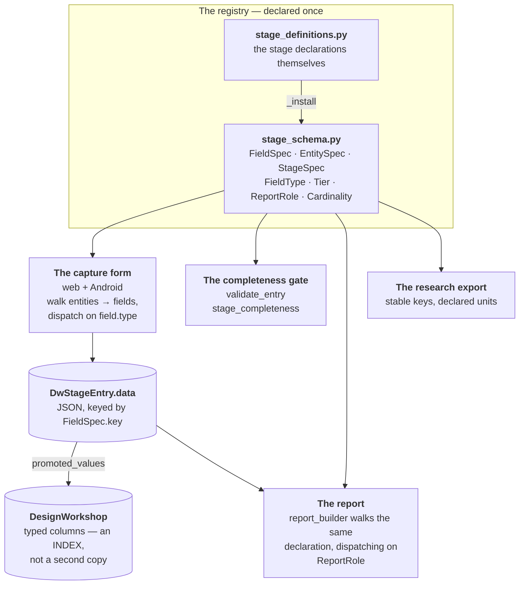
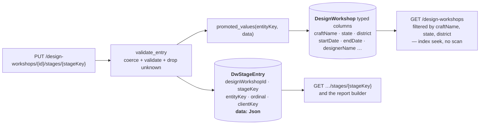
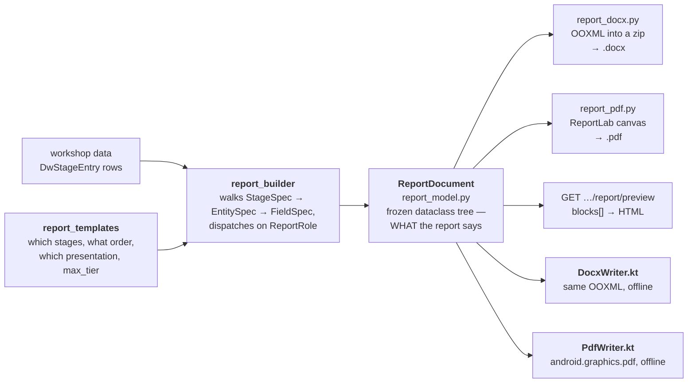

# The design & prototype workshop

The product this repository exists for. A craft or textile **designer** runs a design and prototype
development workshop in a cluster — a fortnight in a courtyard with a group of artisans — and
records every stage of it as it happens, on a phone with no signal or in a browser. At the end the
system produces the workshop report: prose, tables, photographs, cost sheets, signatures, in a
format a Development Commissioner's office or a District Industries Centre will accept, as a `.docx`
or a PDF. On Android that report is generated **entirely on the device**, with no network at any
point.

Everything the app asks for is declared once, as data, in the **field registry**. There is no
per-stage form code, no per-stage report code and no per-stage validator anywhere in this
repository. That single decision is what this document is mostly about, because it is what makes
the rest of the system small enough to be correct.

Sister documents: [ARCHITECTURE.md](ARCHITECTURE.md) for how a request reaches this code,
[DATA_MODEL.md](DATA_MODEL.md) for the surrounding schema, [MEDIA_PIPELINE.md](MEDIA_PIPELINE.md)
for how the photographs get off the phone, [COMPUTED_FINDINGS.md](COMPUTED_FINDINGS.md) for the
arithmetic that checks a designer's stage-9 and stage-17 conclusions against the rows underneath
them, [PERMISSIONS.md](PERMISSIONS.md) §4.4 for who besides the creator may open one of these records,
[WALKTHROUGH.md](WALKTHROUGH.md) for the designer-facing version of the same sequence.

---

## 1. The shape of the thing



A field added to `STAGES` tomorrow appears on the web form, on the Android form, in the completeness
score, in all of the report templates and in both file formats, with no code change on any of those
five surfaces. The alternative — a form per stage, a validator per stage, a report section per stage
— is the same declaration written out three times in three languages, and the drift between the
copies is silent: the report simply omits a field and nobody notices until an officer asks where the
cost sheet went.

---

## 2. The stages

The source requirements document (`Design Prototype Workshop App-ed.docx`, at the repository root)
defines the workshop as a numbered sequence of stages, and the registry keeps that numbering
verbatim so a conversation about "stage 13" means the same thing in the document, in the app and in
the database. `validate_registry` rejects any stage whose number falls outside the document's range
or repeats another's.

| № | `StageSpec.key` | Title | What it captures |
|---|---|---|---|
| 1 | `WORKSHOP_SETUP` | Workshop Setup & Cover Information | What the workshop is called, under which scheme and sanction, for which craft and cluster, where and when, and who is responsible. These fields become the cover page of every report. |
| 2 | `INTRODUCTORY_ADMIN_DOCUMENTATION` | Introduction & Administrative Documentation | The prose that opens the report — why the workshop was held, who supported it, what it set out to deliver. |
| 3 | `WORKSHOP_PLAN_PARTICIPANTS_OPENING` | Workshop Plan, Participants & Opening | The day-by-day plan, the artisans who took part, the designer's own profile, the opening session. |
| 4 | `CLUSTER_CRAFT_BACKGROUND` | Cluster, Area & Craft Background | Where the cluster is, how the craft is practised there, what it has traditionally made, what the community's dependence on it looks like. |
| 5 | `TRADITIONAL_PROCESS_BASELINE` | Traditional Process, Tools & Raw Materials | The craft as practised *before* the workshop intervenes: sequence of making, tools, materials and their sources, the problems the artisans already name. |
| 6 | `EXISTING_PRODUCTS_BASELINE` | Existing Products & Artisan Baseline | What the cluster already makes and sells, recorded before any new design work, so the workshop's effect can be measured against it. |
| 7 | `SURVEY_PLANNING` | Market Survey Planning | What the survey is meant to find out, who will be asked, where, with which questions. |
| 8 | `MARKET_SURVEY_CAPTURE` | Market Survey & Field Data | What the survey found: responses per group, photographs of the market, prices seen, competing products on the shelf. |
| 9 | `MARKET_ANALYSIS_DIRECTION` | Market Analysis & Design Direction | What the survey means: the SWOT, the price bands the market will bear, the design opportunities that follow from the evidence. |
| 10 | `DESIGN_BRIEF` | Design Brief & Concept | The designer's statement of what will be made and why — concept, target market, material/colour/motif direction. |
| 11 | `SKETCH_DEVELOPMENT` | Sketch Development | The design sketches produced during the workshop, each with its intent. |
| 12 | `SKETCH_REVIEW` | Sketch Review & Shortlisting | Which sketches go forward, and on whose judgement — the artisans' and the master craftsperson's as much as the designer's. **Marked `optional_stage`** (see below). |
| 13 | `PROTOTYPE_DEVELOPMENT` | Prototype Development | The making of each prototype: who made it, from what, how long it took, what it cost, and the problems met along the way. |
| 14 | `PROTOTYPE_ITERATION` | Prototype Iteration & Testing | Every change made after a prototype's first making, why, and what it cost in time and money. |
| 15 | `PROTOTYPE_VALIDATION` | Prototype Selection & Validation | Which prototypes were accepted, on what assessment, with whose approval. |
| 16 | `FINAL_PROTOTYPE_DOCUMENTATION` | Final Product Documentation | The catalogue record of each accepted product: name, code, final photographs, dimensions, materials, technique, description. |
| 17 | `COSTING_MARKET_LINKAGE` | Costing, Packaging & Market Linkage | What each product costs to make and what it should sell for — built from line items rather than asserted — plus how it reaches a buyer. |
| 18 | `WORKSHOP_OUTCOMES` | Workshop Outcomes, Problems & Feedback | What the workshop achieved, what went wrong, what the artisans and the designer say about it. |
| 19 | `INSPECTION_CLOSING` | Inspection & Closing | The closing session, the certificates issued, the inspecting officer's remarks. |
| 20 | `REPORT_GENERATION` | Report Generation & Submission | Choose the template, decide what the report contains, generate it, keep a record of every file produced. |
| 21 | `DATA_QUALITY_ARCHIVE` | Data Quality & Archive | Confirm the record and its media are preserved; record any quality problem found in the photographs before archiving. |
| 22 | `POST_WORKSHOP_FOLLOWUP` | Post-Workshop Follow-up | Whether the designs were actually taken up: what is being produced, what has sold, what the artisans still need. |

Three things about that table are load-bearing.

**Capture order is not report order.** The designer fills stages in whatever order the fortnight
allows — the source document's own reviewer notes that the process and product baselines "may come
later, when they actually go to the field after market and consumer survey". So the app never
enforces a sequence, and `NARRATIVE_ORDER` in `backend/app/services/report_templates.py` carries a
separate reading order for the printed document. Capture order belongs to the designer; narrative
order belongs to the reader.

**Two stages never print.** `NON_PRINTING_STAGES` excludes `REPORT_GENERATION` and
`DATA_QUALITY_ARCHIVE` from every template. Stage 20 configures the report and stage 21 records the
archive; printing either would be the report describing its own generation.

**`optional_stage` is a marker, not a switch.** The source document's reviewer proposed dropping
sketch review entirely. It is kept, flagged, and given no fields that are required of the workshop as
a whole — so a workshop that skips it still reads as complete. It is retained because the selection
*reason* is the only record of **why** a design was dropped, and the research use of this dataset
needs that.

### Entities within a stage

A stage is not a flat form. Each `StageSpec` holds `EntitySpec`s, and an entity's `Cardinality`
decides how it is rendered and stored:

| Cardinality | Rows per workshop | Rendered as |
|---|---|---|
| `SINGLETON` | exactly one | the stage's own fields, laid out directly |
| `COLLECTION` | as many as the designer creates | a repeating list — add, edit, reorder, delete — each row titled by the entity's `label_field` |

`validate_registry` refuses a stage that declares more than one `SINGLETON`, and refuses a duplicate
entity key anywhere in the registry — a stage-entry row is addressed by `(workshopId, entityKey,
ordinal)` alone, so entity keys have to be globally unique for that address to mean one thing.
Entities may nest through `EntitySpec.parent` (an iteration belongs to a prototype), and the parent
must resolve to a real entity.

---

## 3. The three capture tiers

Every `FieldSpec` carries a `Tier`. The tiers come straight from the source document's own capture
matrix, and they exist for one reason: **a workshop held in a village with no power, no measuring
equipment and no laptop must still be able to produce a complete report.**

| `Tier` | Meaning | On the form | In the completeness gate |
|---|---|---|---|
| `BASIC` | the minimum the report cannot be written without | always shown, at the top | **scored.** The only tier a field may set `required=True` on |
| `STANDARD` | desirable for most workshops | always shown, optional | counted as optional progress only — never blocks anything |
| `ADVANCED` | where facilities and expertise permit | collapsed behind a "More detail" disclosure by default | counted as optional progress only |

### What the gate actually computes

`stage_completeness` returns a `StageCompleteness` per stage, and the important property is that
`percent` and `is_complete` are computed **from required fields only** — which, by the rule below,
means from `BASIC` fields only. `optional_total` / `optional_filled` are reported alongside so a
designer can see how much detail they have added, but they never gate anything.

- A `SINGLETON` contributes each of its non-deprecated fields once.
- A `COLLECTION` contributes its required fields **once per existing row**, and contributes nothing
  when it has no rows. An empty sketch list on day one of a workshop is a legitimate state, not an
  error, and scoring it as a failure would make every workshop start at an alarming red.
- A stage with no required fields at all reads as **complete**, not as zero. `percent` returns 100
  rather than dividing by zero — dividing by zero to decide whether a designer may submit is how a
  stage becomes permanently unsubmittable.
- `missing` carries the *labels* of unfilled required fields, de-duplicated with order preserved, so
  the UI can say "Sanction order number" rather than "sanctionOrderNo".

### Draft versus submit

`validate_entry` takes `enforce_required`, and the whole product depends on it being **off** while a
stage is a draft and **on** at submission. A 22-stage document is filled in over a fortnight; a
stage that could not be saved half-filled overnight would be a stage nobody could use.

---

## 4. The field registry: why fields are data, not columns

The registry is split deliberately across two modules:

| Module | Holds |
|---|---|
| `backend/app/services/stage_schema.py` | the **machinery** — `FieldSpec`, `EntitySpec`, `StageSpec`, the `FieldType` / `Tier` / `ReportRole` / `Cardinality` enumerations, `ENUMS`, `PROMOTED_COLUMNS`, coercion, validation, completeness, serialisation |
| `backend/app/services/stage_definitions.py` | the **data** — every stage declaration, installed into `stage_schema.STAGES` through `_install` at import |

That split is what keeps the machinery reviewable. The rules are a few hundred lines somebody can
read in one sitting; the declarations are thousands of lines nobody should have to read to
understand the rules.

### Why not columns

The source matrix runs to roughly two and a half thousand fields. As columns, that is a database
schema nobody can open, and — far worse — **every new field is a migration**. The app is used during
a workshop season; a Standard-tier field that turns out to be needed in week two cannot wait for a
deployment window with a schema change in it. As data, adding a field is an edit to a tuple.

### Why not just a config file

Because three surfaces have to agree about every field, and only one of them is written in Python.
The registry is served to clients over the wire, from `GET /api/design-workshops/schema`, as
`registry_to_dict()`:

```json
{ "version": "…", "enums": { … }, "stages": [ … ] }
```

A client fetches it **once**, caches it by `version`, and renders every stage by walking
`stages → entities → fields` and dispatching on `field.type`. `registry_version` is a digest of
every key, type, tier, required flag, enum name and deprecation flag in the registry — deliberately
*insensitive* to labels and help text, so retitling a field does not invalidate every cached draft
on every phone, while adding, removing or retyping one does. `field_to_dict` omits defaulted keys,
because the whole registry crosses the wire on every app start and the empty strings are most of its
bulk.

### The field types a client must render

`TEXT` · `LONG_TEXT` · `INT` · `DECIMAL` · `MONEY` · `PERCENT` · `DATE` · `TIME` · `BOOL` · `ENUM` ·
`MULTI_ENUM` · `TAGS` · `IMAGE` · `IMAGE_LIST` · `FILE` · `AUDIO` · `VIDEO` · `GEO` · `REF` · `URL` ·
`PHONE` · `EMAIL`.

The set is small on purpose: every additional type costs a branch in the web form, a Composable on
Android, a validator in `coerce_value` and a renderer in `report_builder`, so a new one has to earn
its place four times over. `FieldType` exposes `is_media`, `is_numeric` and `is_multi` so client and
server code can group them without restating the membership.

Some rules are not expressible as a type and must be honoured by every client. The register is
`field_to_dict` in `stage_schema.py` — the keys it emits are exactly what crosses the wire — and
these are the ones that change what a client must DO. **This paragraph said "two rendering rules"
until 2026-08-26 and named the first two; a count in prose over a register that grows is the failure
this document's own maintenance table forbids, so it no longer states one.**

- **`captionFor`.** A field with `caption_for` set is the caption *of* that media field. Render it
  directly beneath the field it captions, never as a separate input in the list. `validate_registry`
  proves the target exists in the same entity and is genuinely a media field.
- **`ReportRole`.** Where a value lands in the printed document — `NARRATIVE`, `KEY_VALUE`,
  `TABLE_COLUMN`, `CAPTION`, `GALLERY`, `COVER_FIELD`, `METRIC`, `BULLETS`, `HIDDEN`. A field with
  `HIDDEN` is captured and retained but never printed, which is a legitimate outcome for internal
  bookkeeping and much better than the alternative of printing everything and burying the narrative.
- **`maxItems`.** How many entries a multi-valued field may hold — `IMAGE_LIST`, `TAGS`,
  `MULTI_ENUM` — and the one entry on this list a client must act on *before* the designer does
  anything, because `coerce_value` **refuses** an over-long array rather than trimming it. A cap only
  the server knows about is a cap a designer meets after attaching the twenty-fifth photograph, with
  the work already done and nothing saying which five to drop; on a handset it is worse still,
  because the import has by then copied the bytes into the workshop's media directory. So both
  clients read the key, stop at it, and say the number on screen. **An ABSENT `maxItems` means the
  server's `DEFAULT_MAX_ITEMS`, not "unbounded":** `field_to_dict` emits the key only where a field
  declares a cap, so a client must neither read the absence as no limit nor print a number it did
  not read — a stated cap that is not the enforced cap is worse than no sentence at all. It is
  deliberately **not** part of `registry_version()`, since the values already stored are still valid,
  which means a client that has not refetched is enforcing the previous cap and the server remains
  the authority either way.
- **`minItems`.** How many entries a multi-valued field must hold before its stage counts as
  **complete** — declared today by stage 4's two motif galleries, at 25 each, because the owner
  asked for 25 of each and all of them. It is the mirror image of `maxItems` in every respect that
  matters, and reading the two as symmetrical is the mistake to avoid:
  - **A ceiling refuses a save; a floor never does.** `minItems` is scored in `stage_completeness`
    and enforced **nowhere else** — not in `coerce_value`, not in `validate_entry`, therefore not on
    any write path. A designer can always comply with a ceiling (they hold 26 and post 25), but a
    designer with 20 photographs and 5 still to shoot has *no* body that satisfies a floor, so a
    floor on the write path is not validation, it is an instruction to lose the 20. It would be lost
    twice over: Android's `saveOrQueue` does not queue a 4xx, so a refused body is a record dropped
    rather than retried; and on the `submit=true` path `save_stage` restores a rejected key from
    `previous`, so the gallery would silently **revert** and the 422 would arrive after the
    transaction had already committed. Stage 4 is the fourth of twenty-two, so either outcome blocks
    the whole workshop from ever being saved. "Required" therefore means the stage is not complete,
    the field is listed in `missing` **with its count** — `Traditional motif photographs (20 of 25)`
    — and the workshop is not ready to submit. Work in progress is never at risk.
  - **It IS part of `registry_version()`, and `maxItems` is not.** A cap has a server-side backstop
    (`coerce_value` refuses the over-long array whatever the client believes), so a stale client
    still posts a legal body. A floor has none: it is scored and never validated, so a handset that
    has never fetched since the floor was declared scores the stage complete at 20 photographs and
    tells the designer they may leave the cluster. Same reasoning as `storeMasked` and `format`.
  - **It makes the field required at whatever tier it sits.** A narrow, deliberate exception to the
    rule that only `BASIC` fields may be required: both galleries are `STANDARD` and stay `STANDARD`,
    because promoting them would move the digest *and* splice fifty photographs into
    `COMPACT_SUMMARY`, whose whole description is "Basic-tier fields only". `validate_registry`
    refuses a floor on a scalar field or above the field's effective ceiling, either of which would
    make a stage permanently uncompletable with no error anywhere.
  - Emitted only where declared, exactly as `maxItems` is, so both clients read the number instead of
    hard-coding it — for their ports of the scorer, and for the "20 of 25" progress bar.

### Coercion is forgiving; typing is not

`coerce_value` accepts `"12"` for an `INT` and `"yes"` for a `BOOL`, because three clients write
these values — a web form that sends strings, an Android draft that sends typed JSON, and a bulk
import — and failing a whole stage over a formatting difference is not a defensible outcome. What is
*not* forgiven is a value that cannot be read as its declared type at all, because that becomes a
blank cell in a document somebody submits to a ministry. `MONEY` is stored as a two-place **string**
so it survives the JSON round trip without acquiring a binary-float artefact: `1250.10` must not come
back as `1250.0999999999999`.

### The three rules `validate_registry` enforces

`validate_registry()` returns a list of violations; an empty list means the registry is sound. It is
run by `backend/tests/test_stage_schema.py`, and its checks are ordered by how expensive the mistake
is to discover late — a duplicate key silently overwrites research data, a missing label is
cosmetic.

**Rule 1 — keys are permanent.** A field key is what the research dataset is indexed by, what a phone
wrote into a draft a fortnight ago, and what a saved report template refers to. Renaming one does not
break anything loudly; it silently orphans the data already stored under the old name. So fields are
**deprecated, never renamed** — `FieldSpec.deprecated` with a `replaced_by` pointing at the
successor, and `validate_registry` rejects a deprecated field that names no successor, because that
leaves a form with a dead input and no migration path for the data behind it. The same rule is
enforced structurally: duplicate stage keys, duplicate stage numbers, duplicate entity keys,
duplicate entity model names and duplicate field keys within an entity are all violations. It also
covers the promoted-column paths — every path must resolve to exactly one real field, and no two
paths may target the same column, since either mistake gives the denormalisation two possible sources
that will disagree the first time both are edited.

**Rule 2 — every enum resolves to a shared canonical list.** Several stages ask for a material, and
several independent authors will spell it several ways. `ENUMS` is what makes `COTTON` in stage 5 the
same answer as `COTTON` in a stage 17 cost sheet — which is the whole difference between a dataset
you can aggregate and a pile of free text. A field typed `ENUM` or `MULTI_ENUM` that names no list,
or names one that is not in `ENUMS`, is a violation; so is a field that names a list but is not one of
those two types. Stored values are `UPPER_SNAKE` tokens and the **label** is what a designer sees and
what the report prints, because a report that says `TIE_AND_DYE` is not a report anyone will submit.
`enum_label` falls back to the raw token rather than raising, so a draft written by a phone one
release ahead of the server prints something legible instead of failing an export the designer is
standing there waiting for.

**Rule 3 — only `BASIC` fields may be required.** This is the rule that makes the tier system mean
anything. If a `STANDARD` or `ADVANCED` field could be required, the completeness gate would become
unsatisfiable in exactly the setting the app exists for: a workshop with no laboratory, no laptop and
no reliable power. `validate_registry` reports any `required` field whose tier is not `BASIC`, and
`backend/tests/test_stage_schema.py` asserts it independently.

Beyond the three, it also checks that `REF` fields name a `ref_model`, that `caption_for` targets a
media field in the same entity, that `label_field` names a real field of its entity, that
`min_value` does not exceed `max_value`, and that `column_width_pct` hints are in range.

### Unknown keys are dropped, not rejected

This is the one place the codebase deliberately departs from its own house rule. `APIModel` sets
`extra="forbid"`, so an unknown key is a 422 everywhere else — right for endpoints whose client and
server ship together, wrong for a stage payload. An Android draft written a fortnight ago in a
village, by a build one release ahead of the server, carries field keys this build has never heard
of. Refusing the submission would lose the fieldwork rather than the field. So `StageEntryIn.data`
is an open dict, `validate_entry` drops what it does not recognise, and the dropped keys come back in
the response as `droppedKeys` for the caller to log. The envelope around the data is still
`forbid`-ed.

---

## 5. The hybrid storage model



Answers live in `DwStageEntry.data`, a JSON object keyed by `FieldSpec.key`. A `SINGLETON` entity has
exactly one row per workshop; a `COLLECTION` has one row per record the designer created, ordered by
`ordinal`. Rows are addressed by `(designWorkshopId, entityKey, ordinal)`, and carry an optional
`clientKey` set by whichever client created them — that key is what lets a phone match a row it
created offline to the row the server now has. Without it, every reconnect would duplicate the whole
collection.

Then a small, deliberately short list of fields is **also** written onto typed columns of
`DesignWorkshop`, by `promoted_values` on every stage save, according to `PROMOTED_COLUMNS`.

### Why neither pure option worked

**Pure JSON could not answer the questions.** "Every workshop on Ikat, in Odisha, in 2026" against a
JSON column is a table scan — and the workshop list screen, the researcher's filters and the dataset
API all ask exactly that shape of question. The promoted columns exist so that `craftName`, `state`,
`district`, `startDate` and the rest are ordinary indexed columns with ordinary indexes behind them
(`@@index([craftName])`, `@@index([state, district])`, `@@index([startDate])` on `DesignWorkshop`).

**Pure columns could not absorb change.** Two and a half thousand columns is a schema no migration
tool and no reviewer can handle, and it makes every new Standard-tier field a deployment. The JSON
side exists so the long tail costs nothing to add.

### The rule that keeps it honest

**The promoted columns are an INDEX over `DwStageEntry.data`, not a second copy of it.** The JSON is
the record; the columns are a derived read path. Nothing writes them by hand — `promoted_values` is
the only writer, and the Prisma schema says so at the column block. Adding an entry to
`PROMOTED_COLUMNS` is a migration; removing one is not. Keeping the list short is the point.

`PROMOTED_COLUMNS` is keyed by `"entityKey.fieldKey"` rather than by field key alone, and that is not
tidiness. Field keys are unique only *within* an entity: `startDate` is legitimately both the
workshop's and a prototype's, `designerName` is both the workshop's designer and the person credited
on a final product. An unscoped map would have two possible sources for one column and would silently
take whichever entity was saved last, which is a bug that only shows up as a list screen quietly
disagreeing with the record it links to. `promoted_values` therefore matches on the entity key before
it looks at the field.

### Who set each field — and the boundary with reference hydration

`DwStageEntry.fieldProvenance` is a **sparse** map, `{fieldKey: {by, byName, at, source, …}}`, written
by `entry_provenance.merge_entry_provenance` on every save. It answers *who last set THIS field*,
which `createdById` cannot: a workshop is run by two designers over one shared set of rows
(`DesignWorkshopViewer`), so the row's creator stops being the truth the moment the second designer
touches it.

Two sources, and the second is why the column exists:

| `source` | `by` is | when |
| --- | --- | --- |
| `designer` | the person working on this workshop | they typed or changed the value |
| `reference` | the **canonical record's** author | `hydrate_entries` copied the value off a shared `Artisan`, `ProductDocumentation`, `ToolDocumentation`, `Process` or `Craft` row |

An unchanged field carries its stamp forward untouched, so opening a stage and pressing save does not
make you the author of everything in it. A field that is unchanged **and** carries no stamp gets
none: rows written before this column exist in every archive, and attributing them to whoever saves
next would manufacture an audit trail on a document submitted to a ministry.

**The boundary with `REFERENCE_HYDRATION` is the value/authorship line, and both policies are right.**
Hydration deliberately COPIES field-pairs onto a stage entry so that a report — a dated observation,
generated months later and kept by an office — is not rewritten by a later correction to a live
record. (This sentence used to say **81** field-pairs. It was 109 when somebody next counted, which
is a third of the way wrong and is exactly what the note below the maintenance table forbids: the
count is the sum of `REFERENCE_HYDRATION`'s mappings and belongs in the registry, not in prose here.)
The requirement behind `fieldProvenance` is "do not duplicate the record per designer". They
meet like this: **the value is copied and stays copied; only authorship is attributed.** Nothing
resolves a hydrated field through its `refId` at render time, and making it do so would reintroduce
exactly the defect hydration exists to prevent. The full argument is the module docstring of
`backend/app/services/entry_provenance.py`, which also records the private per-designer overlay that
was deliberately **not** built and the two written policies it would contradict.

`GET /design-workshops/{id}/provenance` (admin and master admin only) adds the one thing no other
reader can produce: for every `reference` field, what the canonical record says **today**, beside
what this workshop stored. Divergence is not an error — the workshop is supposed to keep what the
designer saw — but before this it was invisible, because a hydrated value and a typed value are the
same bytes once stored.

The shared record tables need none of this. `records.viewable_where` returns `{}` — every signed-in
account already reads one canonical `Artisan` row, there is no per-designer duplicate of one, and
`records.merge_field_provenance` has moved per-field authorship on edit for all six record types
since long before this feature.

### Identity numbers on the roster: both, masked — and the reversal that put one there

The participant roster carries **two** identity numbers off the linked `Artisan` record, and both
arrive masked to their last four digits by `records.mask_identity_number` (which *is* `mask_aadhaar`,
reused verbatim so one artisan's identity reads identically on every surface):

| Registry field | Source column | Report role |
| --- | --- | --- |
| `participant.artisanCardNo` "Artisan ID / card number" | `Artisan.pehchanCardNumber` | `TABLE_COLUMN` in the participant table |
| `participant.aadhaarNumber` "Aadhaar number" | `Artisan.aadhaarNumber` | `KEY_VALUE`, in the per-row block beneath the table |

**The second one is a reversal, decided by the owner on 2026-08-24, and it is written down here
because a design workshop is the surface it affects.** Until that date the Aadhaar was carried into no
stage entry at any masking, and the argument for refusing it was recorded in three places. The owner
reversed it having been shown the exposure in full:

* a workshop's stage reads do **not** pass through `records._redact_sensitive`, so nothing downstream
  re-masks the value on the way out;
* a `DesignWorkshopViewer` is a grantee, so the audience is wider than the designer who typed the row;
* a hydrated entry is a **permanent copy** — §5's whole argument — so clearing
  `Artisan.aadhaarNumber` afterwards retracts it from no entry and no report already generated.

Four properties of the field follow from the decision rather than from convenience, and each is
pinned by a test:

1. **`KEY_VALUE`, never `TABLE_COLUMN`.** The participant table's six declared widths already total
   exactly 100, and a seventh column fails silently in one of two ways depending on where it is
   declared. `_table_columns` slices the **first six** non-media `TABLE_COLUMN` fields in declaration
   order and the proportional fallback fires only when *those six* miss 100±0.5: so a seventh
   appended after `isMasterCraftsperson` is **dropped from the table altogether** — captured,
   counted towards completeness, printed nowhere — while one declared before an existing column
   pushes the sixth out of the slice and re-lays-out participant tables inside documents that have
   already been filed. (This entry previously described only the second, as though it were general.)
   `test_no_new_table_column_was_added_to_a_table_whose_widths_are_already_full` sums *all* of the
   entity's `TABLE_COLUMN`s and so catches either position.
2. **The bare digits still cross nowhere.** Only the mask is copied, and
   `test_both_identity_numbers_arrive_masked_and_neither_arrives_bare` asserts the twelve digits
   appear nowhere in the carried data.
3. **The box is typeable, and what it stores is the mask either way.** Hydration only fills blanks,
   so a designer entitled to the full number can supply one the record does not hold, and their
   answer survives every later save. ~~"…and can write a full twelve digits in one tap"~~ — that was
   true for one revision and was the gap between the decision and the code: the mask was guaranteed
   only for the value the server wrote, while a client-supplied number was kept verbatim in a
   permanent, grantee-readable entry. The field now declares `FieldSpec.store_masked`, so
   `coerce_value` masks it on **every** save; the only thing that survives is the last four digits,
   which is all the report was ever going to print. Android's `DwIdentityOcr` still matches identity
   fields per field and still offers its Verhoeff-checked reader here — it prints the full number on
   the button so it can be proofread against the card and commits `XXXX XXXX ####`, and
   `StageSchemaStore` applies the same mask in the same branch of its port so the phone's own draft
   and on-device report agree with the server. The web mounts its (Pehchan-only) capture on the FIRST
   matching field and so offers no camera here; it prints what the save will keep instead. Note the
   asymmetry: `participant.artisanCardNo` is deliberately **not** masked on save, because its capture
   control exists to write the full Pehchan number off the card.
4. **The two labels share no word that names a card.** Two rows reading "XXXX XXXX ####" told apart
   only by their labels is how the wrong one gets checked against the wrong card, so the label and
   help text name the other box explicitly and a test asserts the naming words stay disjoint.

The decision, what the owner was shown, and the exact procedure to reverse it (four deletions plus a
regenerated Android asset — and the note that a reversal does **not** retract entries already
written) are recorded above `participant.aadhaarNumber` in
`backend/app/services/stage_definitions.py`. The earlier reasoning is kept rather than deleted at
every site that carried it, so a later reader can tell a considered reversal from a widening nobody
weighed.

### Nothing is hard-deleted

`DELETE /api/design-workshops/{id}` sets `deletedAt`; every read filters `deletedAt: null`; an admin
can restore. This is a research dataset, retention is an explicit requirement, and a designer's two
weeks of fieldwork is not something a mis-tap should end. `DesignWorkshop` also records
`schemaVersion` — the registry digest the record was last written against — which is what lets a
migration run once against drafts written under an older registry rather than being guessed at on
every read.

---

## 6. The report pipeline



`ReportDocument` is the waist of the hourglass. It is a plain tree of frozen dataclasses describing
*what the report says* — a cover, headings, prose, tables, photo grids, cost sheets, signatures — and
it says nothing whatever about *how any of it is drawn*.

### The builder is generic

`backend/app/services/report_builder.py` contains **no per-stage code**. It walks each stage's
entities and dispatches on each field's `ReportRole`, which is why a field added to the registry
tomorrow appears in every template, in both file formats, on both surfaces, with no change here.
What the builder does own is editorial judgement — the rules that make a readable government report
rather than a data dump:

- An empty *optional* field prints nothing. An empty *required* field prints "Not recorded.", so a
  gap in the record is visible **as a gap** rather than as an absence.
- A collection with no rows prints a single italic line saying so, never an empty table with a
  header. A header over nothing reads as a rendering fault.
- Long text becomes prose paragraphs under their own sub-heading; short values become a key-value
  grid. Mixing the two in one block is what made the first drafts unreadable.
- A photo is never printed without its caption when the registry declares one, and never printed at
  all when the template says the audience does not want photographs.

### The Kotlin renderers are a PORT, and the model is the only thing preventing drift

`ReportModel.kt` is a port of `report_model.py`. `DocxWriter.kt` is a line-for-line port of
`report_docx.py` against `java.util.zip.ZipOutputStream`. `PdfWriter.kt` is a transliteration of
`report_pdf.py` onto `android.graphics.pdf.PdfDocument`. They are ports rather than a shared library
because there is no shared runtime — which means **nothing at build time proves the five outputs
agree.** The model is the whole of the discipline, and two properties of it carry that weight:

**Sizes are relative, never absolute.** No block carries points, twips, EMUs or pixels. Column widths
are percentages of the text column; image widths are a fraction of it; each renderer multiplies by
its own page geometry. The first draft of the model carried centimetres, and the `.docx` and the
`.pdf` of the same workshop disagreed about every table width — because Word's usable column is the
page minus its margins, while ReportLab's frame had already subtracted them. The same number meant
two different widths. Percentages cannot express that bug.

**Every string reaches a renderer through `clean_text` and nothing else.** `word/document.xml` is XML
1.0, which admits only tab, LF, CR and the printable ranges. A lone surrogate from a phone that cut an
emoji in half serialises to a numeric reference no XML parser will accept, and Word's response is to
refuse to open the file at all rather than to drop the character. The block constructors call
`clean_text` for you, which is why they take strings rather than runs; build a block by hand and
bypass it and the failure reappears — in a file the user only opens after leaving the field.

Two further things `report_docx.py` learned the hard way, both of which the Kotlin port must keep:
a `w:tbl` must be followed by a paragraph (two adjacent tables are silently merged by Word into one),
and relationship ids are **allocated, never guessed** (an earlier version numbered images from their
position in the block tree, so a document with a cover logo produced two relationships with the same
id and Word dropped both pictures without complaint).

`backend/tests/test_report_model.py` fails if either model rule is broken;
`backend/tests/test_report_docx.py` opens the produced package, parses every part and asserts that
every `r:embed` resolves.

### A child collection prints under its parent

`EntitySpec.parent` had been declared in the registry, validated by `validate_registry` and shipped
to every client since the schema existed, and **no renderer read it**. So stage 17 printed "Cost
sheets" as one table and then "Material cost lines" as a *second* flat table holding every line of
every sheet, interleaved in entry order — and `costMaterialLine.costSheetRef`, the field that says
which line belongs to which sheet, is `report_role=HIDDEN`, so it was not in that table either. The
submitted document contained no way whatsoever to work out which materials cost which product, which
is the one question a cost sheet exists to answer, in a report an officer reads as the basis of a
sanctioned amount.

`ReportBuilder._parent_groups` now splits such a collection into its parents' records, and
`DwParentGroups.kt` does the same on the handset. Five invariants make the change safe, and each is
a property of the control flow rather than a promise:

**A parent-free stage renders unchanged.** `_parent_groups` returns `None` on its first line for any
entity that declares no parent, and the caller falls straight through to the same single
`_render_rows` call it always made. `_render_stage` is the path *every* stage of *every* report goes
through, so this is the property that makes the change safe rather than merely correct.
`test_a_parent_free_stage_is_untouched_by_the_grouping` compares the **whole block list** against the
same builder with grouping monkeypatched off — which *is* the pre-change code path — because an
outline-level assertion would miss heading numbers, column widths, captions and paragraph styles.
A companion test asserts exactly which stages declare a parent, so a stage that gains or loses one
fails a test instead of quietly slipping past the guard.

**No row is ever lost, and no row is ever gained.** Children are bucketed by the ref they name;
groups are emitted in the *parent's* own order; whatever is left is printed last. Every line that was
recorded is printed exactly once.

**Orphans print under their own heading, never under somebody else's.** A line naming no sheet — or
naming a sheet deleted after the line cited it — goes under "No cost sheet recorded". Filing it under
a parent it does not belong to would be a fabrication; dropping it would delete fieldwork somebody
did and money somebody spent. `cost_integrity` takes the identical position for the same rows (see
[COMPUTED_FINDINGS.md](COMPUTED_FINDINGS.md) §3.5), and the two must agree: a total the integrity
check calls unattributed must not appear in the report as some product's material cost.

**A parent with no id of its own claims nothing.** The orphan bucket is keyed by the empty string,
and a parent row that has not synced yet carries no `_entryId` — so popping `""` for it would print
every line that names *no* sheet at all as that one sheet's breakdown. That is the same fabrication
reached from the other end.

**No new block kind was added, and that is the constraint that shaped the design.** A group is a
`HeadingBlock` followed by the rows rendered through the ordinary `_render_rows`. There are five
renderers over `ReportDocument` — `report_docx.py`, `report_pdf.py`, the web preview, `DocxWriter.kt`
and `PdfWriter.kt` — and three of them are hand ports with no cross-language test, so a new block
kind is five drawing implementations that must agree and nothing that proves they do. Reusing a
heading meant the `.docx`, the PDF, the preview and both on-device writers got the grouping with no
change to any of them, and the PDF bookmark outline picked the group headings up for free.

The link is found **by model, not by field name**: the child's `REF` field whose `ref_model` is the
parent entity's `name`. Matching a key like `costSheetRef` would be a spelling convention nothing
enforces, while model names are validated unique. A parent that no field of the child points at is a
registry mistake and not a document to mangle, so that collection prints flat, exactly as before,
rather than grouped by a guess.

Group headings sit one level below whatever named the collection — the entity heading when the stage
has several collections, the stage's own heading when it has one — so a group never outranks the
thing it is part of, and the sub-headings join the numbering the table of contents already uses.

### The preview is the same document

`GET /api/design-workshops/{id}/report/preview` builds the **same** `ReportDocument` and serialises
its blocks to JSON for the web to render as HTML. It is not a fourth traversal of the data. A preview
that walked the data itself would be the first thing to drift, and it would drift in the one place a
designer trusts most — the screen they approve before they press Export.

### Generation returns bytes, not a link

`POST /api/design-workshops/{id}/report` renders and returns the file directly. A designer generating
a report is about to attach it to an email; an intermediate storage round trip would add a failure
mode and a retention question for a file that is reproducible from the record at any time. Warnings —
a missing required field, a photo that could not be embedded — travel in the `X-Report-Warnings` and
`X-Report-Warning-Count` headers rather than in the file, because they describe the *act of
generating* and an officer opening the `.docx` next month should not find a note about what was
missing on the day. The header value is forced to ASCII before it is set: a warning naming a craft in
Odia would otherwise raise inside the ASGI server and turn a successful report into a 500.

Every generated file is recorded as a `DwReportExport` — format, template, file name, size, page
count, SHA-256, the registry version in force, and whether it was `generatedOnDevice`. The bytes are
not stored; only the fact, so a file handed to an office can be matched back to the record and the
template it came from.

---

## 7. The report templates

A template declares **which stages a report prints, under what headings, at which capture tier, and
in which presentation**. What it deliberately never mentions is a font, a column width or a page
break — those belong to `ReportTheme` and the renderers, and keeping them out is exactly what lets
one set of templates produce a `.docx` and a `.pdf`, on a server and on a phone, without more copies
of the layout rules.

| `ReportTemplate.id` | Name | For | `max_tier` |
|---|---|---|---|
| `DCH_STANDARD` | DCH standard workshop report | Submission to the Development Commissioner (Handicrafts): cover, contents, every stage in the reader's order, photographs, cost sheets, sign-off | `ADVANCED` |
| `DIC_STANDARD` | DIC standard workshop report | The District Industries Centre format — the same content with the section names a DIC submission expects and the administrative annexure brought forward | `ADVANCED` |
| `IMPLEMENTING_AGENCY` | Implementing agency format | The agency's own file: outcomes, costs and prototypes first, with cluster and survey background reduced to an annexure | `ADVANCED` |
| `COMPACT_SUMMARY` | Compact summary | A few pages for a review meeting — what was done, what came of it, what it cost. One photograph per prototype | `BASIC` |
| `DETAILED_TECHNICAL` | Detailed technical report | Everything captured, including the Advanced tier: process sequences, material specifications, iteration histories, quality assessments, full media annexure. The archival copy | `ADVANCED` |
| `PHOTO_CATALOGUE` | Photo catalogue | Buyer-facing: the final products, large, with dimensions, materials and prices. Almost no prose | `ADVANCED` |

`GET /api/design-workshops/templates` serves `template_choices()` — `{id, name, description}` — so a
client never hard-codes this list either. `template()` falls back to the first template rather than
raising, because an unknown id arriving from a stale phone should produce a report, not an error.

The interesting part is the per-section `Presentation`, because the same stage data is legitimately
printed several ways and which is right depends on the **audience**, not on the data:

| `Presentation` | Renders as | Typical use |
|---|---|---|
| `KEY_VALUE` | a label/value grid | an administrative annexure |
| `NARRATIVE` | prose paragraphs under headings | the body of a submitted report |
| `TABLE` | one row per record | participant lists, cost sheets, sketch indexes |
| `CARDS` | a heading and photo per record | a prototype catalogue |
| `GALLERY` | a photo grid | the media annexure |
| `AUTO` | the builder decides from the fields' `ReportRole` | the default |

`SpecialSection` covers the parts of a report that are not one of the stages at all: `COVER`, `TOC`,
`ACKNOWLEDGEMENT`, `SUMMARY_METRICS`, `SIGNATURES`, `ANNEXURE_MEDIA`, `COMPLETENESS`.

`PHOTO_CATALOGUE` and `DETAILED_TECHNICAL` print the same stages. They differ **only** in these
presentation choices, their `max_tier` and their `ReportTheme`. That is the entire justification for
the indirection: a new ministry format is a declaration, not a renderer.

---

## 8. Offline, on-device generation on Android

The requirement is blunt: a workshop held with no signal must still end with a finished report on
the phone. `ReportExport` is the entry point and it talks to no API at all — `DocxWriter` needs only
`java.util.zip`, `PdfWriter` only `android.graphics`. Everything under
`android/app/src/main/java/com/designprototype/workshop/report/` runs with the radio off.

That is why `report_docx.py` has **no third-party dependency**. It is not a stunt. `python-docx`
would have made the server file shorter and the phone's copy impossible; writing OOXML by hand is
what makes the two provably the same document rather than two libraries' interpretations of one
intent.

### What it required: a durable draft store

Offline generation needed something the app did not have — a **local read model with durable bytes**
— and building it meant being honest about why the existing offline machinery could not serve.

`OfflineOutbox`, in `android/app/src/main/java/com/designprototype/workshop/data/Offline.kt`, is a
**send queue**. Its entries carry an opaque `payloadJson` create-request that nothing local can read
a field out of, and `OfflineOutbox.remove` **deletes the staged media the instant an entry syncs**.
It answers "what still has to reach the server", which is a completely different question from "what
has the designer captured so far". Generating a report from it is not possible even in principle:
there is nothing to read, and after a successful sync there are no local photographs left to embed.

`WorkshopDraftStore`, in the same package, is the answer. It holds the whole multi-stage document,
every photo and every recording, on the device, in a shape the app can **read back** rather than
merely replay. A workshop is filled in over a fortnight, out of signal, in a courtyard; it must be
openable, editable and printable on that device the entire time, and it must still be all of those
things after the process has been killed forty times in between.

It does **not** hold the reports generated from them, and that sentence used to say it did. The
store carried a whole export-retention subsystem — `DraftExport`, `exports`, `exportsDir`,
`registerExport`, `exportCount` — that nothing ever called, so `draft.exports` was permanently empty
and the paragraph above described a capability no build ever had. A generated report is published
straight to Downloads by `ReportExport` and is not copied back into `filesDir`; see that object's
header for why the subsystem was removed rather than wired.

Two details in it are the difference between working and appearing to work:

**Media is copied into `filesDir`, not referenced where it was captured.** The capture path puts
camera and recorder output in `cacheDir`, which is the first thing Android reclaims under storage
pressure — without asking and without telling the app. A designer who photographs a loom on day one
and opens the report on day twelve finds an empty frame, and no log line anywhere says why. So the
store's `importMedia` copies the bytes into `filesDir/workshops/<id>/media/` the moment they are
captured, and every later reference is to that copy: never to the content `Uri` (which the granting
app may revoke the moment our process dies) and never to the cache file.

**Stage values are a map, not a class per stage.** The draft carries `Map<String, JsonElement>`
keyed by field key, for the same reason the server stores JSON: the stages are registry data, and a
Kotlin data class per stage would be a fourth copy of the field list to keep in step. The draft
records its own `schemaVersion`, and a document written before that key existed is detected and
migrated rather than misread.

Publishing reuses `WorkshopRepository.persistFileToDownloads` rather than reimplementing it — that
function already carries the Android Q+ `IS_PENDING` handshake, the pre-Q permission check and the
app-private fallback that stops a refused permission from destroying an export the designer just
waited out a progress bar for. A second copy of that logic would be a second copy to get wrong, and
it would get it wrong on exactly the handsets nobody develops on.

`POST /api/design-workshops/{id}/exports` exists so that an export produced this way can be recorded
against the workshop once the device has signal — `record_device_export` forces `generatedOnDevice`
to true on anything that arrives through it. **The bytes are deliberately not uploaded**, only the
fact, the file name, the size, the page count and the SHA-256: a designer on a metered field
connection should not be charged for a thirty-megabyte report merely to prove one was made, and the
checksum is enough to match the file later. The distinction matters for the archive — an on-device
export exists on exactly one device until somebody copies it off, and the record is what says so.

(`WorkshopRepositoryApi.kt` now declares that call — `@POST("design-workshops/{id}/exports")`. That
the declaration exists is checkable from this repository; that an export screen on a real handset
reaches it is not, and nothing here has been run on a device.)

### Syncing a stage: why the client key is load-bearing

A stage is saved **whole**, never field by field. The phone reconnects after two days in a
courtyard and posts everything it holds for one stage; either all of it lands or none of it does. A
per-field endpoint would leave a stage half-written whenever the connection dropped mid-sync, which
on one bar of signal is most of the time.

Making that safe to repeat is what `_clientKey` is for. The client mints an id when it creates a
row offline and keeps it across every later sync. Without it the server cannot tell *the row you
already have* from *a new row*, and every reconnect duplicates the whole collection — the most
common way an offline-first app corrupts its own data. `save_stage` matches an incoming entry to an
existing row by `entryId` first, then by client key, then — for a singleton — by entity.

**Soft-deleted rows take part in that match, and must.** The unique index is
`(designWorkshopId, entityKey, clientKey)` and carries no `deletedAt`, so a row the client removed
still occupies its client key. Matching only live rows made the matcher blind to it: the save fell
through to an `INSERT`, the index refused, and the whole stage failed with a bare 500 and no
explanation. The path that reaches it is completely ordinary — a designer deletes a sketch and
undoes it, or a phone that never received an acknowledgement replays the queue it still holds.

So a re-asserted client key **resurrects** the row rather than inserting beside it, and it keeps the
row's id, which is what stops the prototypes and reviews that reference that sketch from being
orphaned. The sweep that soft-deletes rows the client no longer sends runs over live rows only, so
a row deleted a fortnight ago is not re-reported as removed today and does not have its `deletedAt`
rewritten to now, destroying the record of when the designer actually removed it.

`backend/tests/test_stage_sync.py` pins all of this against a real database, because the failure was
in an index and no amount of reading the Python could have shown it.

---

## 9. The API

All paths below are under `/api` and take a bearer token. Permissions follow the repository's
existing ladder rather than a second one — see [PERMISSIONS.md](PERMISSIONS.md). A contributor may
create and edit their own workshops; editing someone else's is gated by `require_workshop_manager`;
deletion by `assert_can_delete`; restore is admin-only. Report generation is allowed to **anyone who
can read the workshop**, because a report is a view of data the caller can already see and refusing
it would only push people to photograph the screen.

**One tier reads a design workshop without appearing anywhere in this section, and that is by
construction.** `INSPECTOR` (rank 37, added 2026-08-27) holds **no** design-workshop authority from
its rank — every gate here is set membership, so outranking a designer buys nothing — and reads a
workshop only through a `DesignWorkshopInspector` row and its own loader
(`backend/app/services/design_workshop_inspectors.py`), which is separate from the one every route
below uses precisely so that no route below can start honouring it. Read-only: no stage write, no
report generation, no dictation consent, no AI verbs, no media and no questionnaire responses. It is
the fifth access system; [PERMISSIONS.md](PERMISSIONS.md) §4.5 is the whole of it, including which
parts are asserted and which are not yet.

| Method | Path | Returns |
|---|---|---|
| `GET` | `/design-workshops/schema` | the registry — `{version, enums, stages[]}` |
| `GET` | `/design-workshops/templates` | `[{id, name, description}]` |
| `GET` | `/design-workshops?page&pageSize&search&statusFilter&craftName&state&mineOnly` | a page of workshop headers |
| `POST` | `/design-workshops` | `201` — only `title` is required to start |
| `GET` | `/design-workshops/{id}` | header + stages + completeness |
| `PATCH` | `/design-workshops/{id}` | the updated header |
| `DELETE` | `/design-workshops/{id}` | `204` — soft delete |
| `POST` | `/design-workshops/{id}/restore` | admin only |
| `GET` | `/design-workshops/{id}/stages` | every stage's entries, provenance and completeness |
| `GET` | `/design-workshops/{id}/stages/{stageKey}` | `{singleton, collections, custom, provenance, completeness}` |
| `GET` | `/design-workshops/{id}/provenance` | admin only — per field: who set it, and what the canonical record says today |
| `PUT` | `/design-workshops/{id}/stages/{stageKey}` | `{saved, created, updated, removed, errors, droppedKeys, completeness}` |
| `GET` | `/design-workshops/{id}/references?model` | the records a `REF` field may point at |
| `GET` | `/design-workshops/{id}/transcripts` | the stage recordings and their transcripts |
| `GET` | `/design-workshops/{id}/market-analysis` | stage 9's findings — see [COMPUTED_FINDINGS.md](COMPUTED_FINDINGS.md) |
| `GET` | `/design-workshops/{id}/cost-integrity` | stage 17's sheets against their lines — same document |
| `GET` | `/design-workshops/{id}/report/preview?templateId` | `{meta, blocks[], warnings[]}` |
| `POST` | `/design-workshops/{id}/report` | the file bytes, plus `X-Report-Warnings` |
| `GET` | `/design-workshops/{id}/exports` | every report file ever produced for this workshop |
| `POST` | `/design-workshops/{id}/exports` | `201` — record an export the phone produced offline |
| `GET` | `/design-workshops/{id}/report-history` | the export record, for the "what changed between these two files" view |
| `POST` | `/design-workshops/ocr/identity` | read an identity card's number off a photograph, for a designer to confirm |
| `POST` | `/design-workshops/dictate` | transcribe a spoken passage into a field |
| `GET` | `/design-workshops/eligible-viewers` | **admin** — the accounts that may be given access ([PERMISSIONS.md](PERMISSIONS.md) §4.4) |
| `GET` · `PUT` | `/design-workshops/{id}/viewers` | **admin** — read and replace the viewer set |

Every path above except the last three answers for a caller who may read the workshop, which since
the viewer grant landed means the creator, an admin, **or** somebody an admin has granted a
`DesignWorkshopViewer` row.

**A stage is saved whole, never field by field.** `PUT …/stages/{stageKey}` takes
`{entries: [{entityKey, entryId?, ordinal?, data{}}], replaceCollections, submit}`. Field-at-a-time
saving would mean a partially-applied stage on a dropped connection, which on a two-week document is
a corruption nobody can see. `submit` is what flips `enforce_required` on. Payload size is bounded
(`MAX_STAGE_ROWS`, `MAX_FIELD_KEYS` in `backend/app/schemas/design_workshops.py`) so one malformed
client cannot post an unbounded blob into a JSON column. **Those two bound the CONTAINERS — rows per
stage and keys per row — and for a long time nothing bounded the CONTENTS**, so a single
multi-valued field could still carry an arbitrarily long array into the jsonb column and be
re-serialised in full on every later read of the stage. `DEFAULT_MAX_ITEMS` and
`DEFAULT_MAX_ITEM_CHARS` in `stage_schema.py` close that half, applied by `coerce_value` on every
save; a field may narrow the first for itself with `max_items` (see `maxItems` in §4). A field's
`min_items` floor is deliberately **not** applied here — `enforce_required` does not reach it and
neither does `coerce_value`, so a gallery below its floor still saves. See `minItems` in §4 for why
a floor on this path would drop the record on Android and revert the gallery on a `submit=true`.

Operation counts for the whole API are generated into [REPO_FACTS.md](REPO_FACTS.md).

---

## 10. Honest limitations

**A server-side PDF does not shape complex scripts.** ReportLab positions glyphs by advance width
and applies no complex-script reordering, so Devanagari, Odia, Bengali and Gujarati come out with
correct **glyphs** but without the reordering and conjunct formation those scripts require. In
practice: a short Indic string — a craft's local name, an artisan's name — is legible; **a paragraph
of Odia prose is legible but not correctly shaped.** `report_pdf.py` draws any run tagged with a
non-Latin script in a Unicode-covering face so it is never tofu, but that is coverage, not shaping.

The two artefacts that do **not** have this problem:

- **The `.docx`**, from either the server or the phone. Word does the shaping itself, from the same
  OOXML. For Indic-heavy content the DOCX is the authoritative output.
- **The on-device PDF**, because Android's text stack *is* HarfBuzz. `PdfWriter.kt` produces
  correctly shaped Indic PDF where `report_pdf.py` cannot.

**Fonts are resolved from the host.** `register_fonts` tries a list of well-known Unicode faces and
falls back to the built-in Helvetica if none are present, which is legal and covers Latin only. A
deployment that needs Indic PDF output **must ship a font**; the function returns which family it
actually bound, so the caller can log it once at start-up rather than discover it in a report.

**What is covered, and the one hole that is left — re-checked 2026-08-19.** *This paragraph used to
say "There is no `test_report_pdf.py`" and "the PDF renderer and the Kotlin ports have no automated
test". Both files exist. The correction is not that the gap closed — it is that the gap MOVED, and
naming the wrong gap sends the next person to write a harness twice.*

- The DOCX path: `backend/tests/test_report_docx.py`, which parses every part of the produced
  package. The document model: `backend/tests/test_report_model.py`. The registry:
  `backend/tests/test_stage_schema.py`.
- **The PDF renderer: `backend/tests/test_report_pdf.py`**, and it asserts on the FILE rather than on
  the renderer's state — the bytes are read back with `pypdf` and the drawing operators read out of
  the content stream. Its header says why: both failures it was opened for produced a PDF that opens
  perfectly, raises nothing, and is wrong — a contents page whose every number was ten pages short,
  and a table header underlined in the download and not on the phone. Neither is visible from any
  assertion about the model.
- **Server-versus-Kotlin: `backend/tests/test_report_parity.py`**, which reads the Kotlin SOURCE as
  text and asserts that the values that must match the Python do. It skips rather than fails when
  the Android tree is absent, because the backend deploys without it.

**The residual gap, stated exactly, because the old sentence overstated it and an overstated gap is
ignored:** `test_report_parity.py` is a blunt instrument on purpose. It catches somebody editing
`45.0` to `40.0` in one of the two files; it does not run the Kotlin, so **a LOGIC divergence
between `report_docx.py` and `DocxWriter.kt` — the same constants, different behaviour — is still
invisible to every test in this repository.** Closing it would need a JVM in CI. That, and not "no
automated test", is the largest known gap in this area; see [QA_AUDIT.md](QA_AUDIT.md).

> **Two limitations that stood here until 2026-08-08 are now false, and are recorded rather than
> deleted** — because both were quoted elsewhere and somebody will meet the old wording again. This
> document said "the web client has no design-workshop UI yet" and "the Android capture screens are
> not wired to the workshop API either". Both had been overtaken by the code:
> `frontend/app/(protected)/design-workshops/` now carries the list, the workshop page, the
> data-driven stage form, the report and report-history pages, a readiness page, a photo-intake page
> and a codes page; and `WorkshopRepositoryApi.kt` carries `GET`/`PUT
> design-workshops/{id}/stages/{stageKey}`, the schema and template calls, the reference lookup, the
> identity OCR upload and `POST design-workshops/{id}/exports` — which §8 also said was "not yet
> wired". **The lesson is the one this document's own maintenance table is for:** a limitation
> section is the part of a document that rots first and most misleadingly, because nothing about a
> confidently-worded "not built yet" looks stale.

> **A THIRD limitation joined those two on 2026-08-19, in the same shape and for the same reason.**
> This section said "**The on-device report ignores the template and most of stage 20's settings** —
> `report_templates.py` and `apply_report_settings` have no Kotlin port … Two files, one desk,
> different documents". The port is `android/…/report/ReportTemplates.kt`; its `applyReportSettings`
> is called by `ui/designworkshop/ReportPlan.kt` when it builds the plan, and
> `ReportTemplatePinTest`'s *"applyReportSettings agrees with the server over the whole case table"*
> pins it against the server case-for-case. The claim was the most consequential one in this
> document — "two files, one desk, different documents" is the failure this whole area is designed
> to prevent — and it was false while it was being read.

**What the handset genuinely cannot honour is three special sections, and it says so on the file.**
`ReportSettings.UNSUPPORTED_SECTIONS` is the list, with the sentence a designer reads for each, and
two of the three are CONDITIONAL rather than absolute:

- **Transcripts** — the recordings are on the phone; transcription happens after they reach the
  server, so the office's copy carries them.
- **Questionnaire answers** — drawn on the device from `DwQuestionnaireStore` once this handset has
  read the workshop's questionnaire list even once. The warning fires only on a device that never
  has, which is why it is phrased conditionally: an unconditional "the answers are missing" would be
  a false alarm on most exports, and that is how a designer learns to stop reading warnings.
- **AI layers** — unconditional. A layer is a server row carrying which model produced it and who
  accepted it; nothing under `data/` on the handset holds one and no screen offers to fetch them.

Quote that map rather than a count of settings. A section that becomes renderable is deleted from it
in the same edit, so the map cannot silently outlive its own truth the way the paragraph above did.

**One computed-findings module reaches no designer, and it is the BROWSER half.** `DwMarketAnalysis.kt`
and `DwCostIntegrity.kt` are both surfaced on the handset now, through
`ui/designworkshop/DwFindingsPanel.kt`, which `StageScreen` mounts on every stage form — that half of
this entry was false and is corrected here. What remains true is that there is **no cost-integrity
port or UI in the browser at all**: no module under `frontend/lib/`, no panel, and nothing calling
`GET /design-workshops/{id}/cost-integrity`. See [COMPUTED_FINDINGS.md](COMPUTED_FINDINGS.md) §3.6
for exactly what is surfaced where.

---

## How this document is kept true

Everything here is a property of code in this repository, cited by symbol name rather than by line
number so a refactor cannot silently invalidate a citation. The sources, in the order to re-read
them:

| Claim | Source of truth | How to check |
|---|---|---|
| The stage table — numbers, keys, titles, purposes | `STAGES` in `backend/app/services/stage_definitions.py` | Diff the table against the `StageSpec` declarations. `backend/tests/test_stage_schema.py` proves the numbering is complete and unique |
| The tiers and the completeness rules | `Tier`, `stage_completeness`, `StageCompleteness` in `backend/app/services/stage_schema.py` | Read `percent` and `is_complete` |
| The three registry rules | `validate_registry` in the same module | Run `python -m pytest tests/test_stage_schema.py -q` from `backend/` |
| The hybrid store | `PROMOTED_COLUMNS` / `promoted_values`, and the `DesignWorkshop` and `DwStageEntry` models in `backend/prisma/schema.prisma` | Diff the promoted list against the typed columns |
| The pipeline and the model rules | `backend/app/services/report_model.py`, `report_builder.py`, `report_docx.py`, `report_pdf.py` | `backend/tests/test_report_model.py` and `test_report_docx.py` |
| The template table | `TEMPLATES` in `backend/app/services/report_templates.py` | Diff against `template_choices()` output |
| The parent-grouping invariants | `ReportBuilder._parent_groups` in `backend/app/services/report_builder.py`, and `DwParentGroups.kt` | `backend/tests/test_report_child_grouping.py` — every invariant in that subsection is one named test there, including the "renders exactly as before" comparison and the guard listing which stages declare a parent |
| The endpoint table | `backend/app/api/routes/design_workshops.py` **and** `backend/app/api/routes/design_workshop_viewers.py` | Compare against the `@router` decorators in **both** files. The viewer routes live in their own module and are registered first in `backend/app/api/router.py`, because `GET /design-workshops/{workshop_id}` would otherwise swallow `/design-workshops/eligible-viewers` |
| §10's limitations | Nothing. **This is the section that rots**, and it has now rotted three times — the two client entries retracted on 2026-08-08, and the template entry on 2026-08-19. Each entry names a file or a symbol, so each is one grep. List `frontend/app/(protected)/design-workshops/` and grep `WorkshopRepositoryApi.kt` for the client entries; grep `android/…/report/ReportTemplates.kt` for `applyReportSettings` and `ui/designworkshop/ReportPlan.kt` for its call before repeating anything about the handset and templates; grep `android/app/src/main` for `DwCostIntegrity`/`DwMarketAnalysis` before repeating anything about the ports being unsurfaced. **A grep that comes back NON-empty is the alarm here** — every one of these entries asserts an absence, which is the class of claim a reader cannot falsify by reading the document |
| The offline story | `WorkshopDraftStore.kt`, `Offline.kt`, `ReportExport.kt` under `android/app/src/main/java/com/designprototype/workshop/` | Read the KDoc on each |
| The two masked identity numbers on the roster, and the 2026-08-24 reversal that put the second one there | `REFERENCE_MODELS["Artisan"].data` in `backend/app/services/design_workshops.py` (the two `mask_identity_number` calls), and `participant.artisanCardNo` / `participant.aadhaarNumber` in `stage_definitions.py` | `backend/tests/test_reference_carry.py`: `test_both_identity_numbers_arrive_masked_and_neither_arrives_bare` (the values), `test_the_carried_aadhaar_is_a_mask_a_key_value_and_never_a_column` (the role, the width sum, mask idempotence and the labels), `test_the_designers_own_answers_survive_the_widening` (a typed number is not reverted). **If either `mask_identity_number` call is gone, this subsection is false and something leaked** |

No count appears in this document's prose. The stage and template tables are enumerations — the rows
*are* the data, so they cannot state a number that drifts independently of it. Repository counts
live in [REPO_FACTS.md](REPO_FACTS.md).

**Review triggers:** a stage, entity or field added to or removed from
`backend/app/services/stage_definitions.py`; a new member of `FieldType`, `Tier`, `ReportRole`,
`Cardinality` or `Presentation`; a change to `validate_registry`'s rule set; an entry added to or
removed from `PROMOTED_COLUMNS` (which is a migration); a new or retired `ReportTemplate`; a new
renderer, or a change to `report_model.py`'s block set that the Kotlin port has to follow; the web or
Android design-workshop UI shipping, which retires two of the limitations in §10.

**Known unverified:** that the Kotlin renderers still match the Python ones — they are a hand port
with no cross-language test, and the only evidence is the shared `ReportDocument` contract, so a
drift would be invisible until two files of the same workshop are compared side by side. That the
on-device PDF shapes Indic prose correctly on **every** Android version in the field — it is a
property of the platform text stack, asserted from the platform's documented behaviour and not
measured here on a device. Which Unicode font family `register_fonts` actually binds on the
production EC2 host, since that is a property of the host's installed fonts and not of this
repository. Whether the source requirements document at the repository root has been revised since
the registry was written from it.
