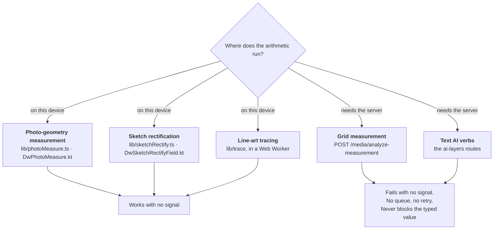

# Where the work happens: this device, or the server

**The question this answers:** for each thing the app computes from a photograph — a dimension, a
plate, a traced outline — does the arithmetic run on the machine the designer is holding, or does it
require a round trip to the server and a provider behind it? And, the half that matters in a
courtyard: **what can a designer still do with no signal?**

It exists because that split was true in the code and written down nowhere, so every reader had to
re-derive it by opening files, and every writer of a hint on a screen had to guess. One of them
guessed wrong, in the direction that costs the most: the web's grid-measurement control said
"The measured inches auto-fill the matching field(s)" and said nothing about needing a connection, so
a designer with no signal checked the box, laid the object out on the ruled sheet, photographed it,
waited, and got `Analysis failed — enter it manually`. That reads as a broken feature. It is in fact
a working feature that is honestly unavailable there — and the difference between those two is one
sentence, placed before the capture instead of after it.

---

## 1. The constraint this is measured against

The owner's rule for this feature set: **the work happens on the edge device, and the handset's
features work offline.** Most of it already did. Exactly one route does not, and pretending otherwise
is what turns a documented limit into a bug report.

The rule this document therefore enforces on every surface:

1. **The on-device route is the default, never the fallback.** It is always available, so it is what
   the screen offers first and what the copy names first.
2. **A server-backed control says so BEFORE the capture**, in its own hint, not in a status line the
   designer reaches a minute later with the object already laid out.
3. **A server-backed control may never block, disable or gate** a device-side route, a typed value,
   or the save. Its failure costs the reading and never the record.
4. **A machine-produced value is a proposal, never a silent write.** That rule is older than this
   document and is argued in full in the headers of
   `frontend/components/designworkshop/PhotoMeasureField.tsx` and
   `android/app/src/main/java/com/designprototype/workshop/ui/designworkshop/DwPhotoMeasureField.kt`.
5. **Do not queue a machine reading.** `ENQUEUEABLE_PROCESSING_REQUESTS` in
   `backend/app/api/routes/media.py` refuses it by name, and its comment carries the incident: a
   background worker once wrote a vision model's `lengthInches` straight onto a costed, printed
   dimension nobody had ever seen.

---

## 2. The register



| Feature | Where the work happens | Needs a connection? | With no signal, a designer can still… |
|---|---|---|---|
| **Measure a dimension from a photograph** (stage forms) | The designer's device — plane projective geometry over marked points | **No** | Do the whole thing, on any photograph whose bytes are on this device, and accept the reading into the field |
| **Document using grid** (product and tool forms) | The server, then a vision model | **Yes** | Type the dimension into the length / breadth / height boxes, which nothing disables. The grid photograph is still attached and still uploads with the record |
| **Straighten a photographed sketch into a plate** | The designer's device | **No** | Do the whole thing |
| **Trace a sketch to line art or vectors** | The designer's device, in a Web Worker | **No** | Do the whole thing |
| **Text AI verbs** (summarise, expand, …) | The server, then a provider | **Yes** | Write the passage by hand. The verbs are unavailable and are deliberately not queued |
| **Save a record or a stage** | The device, then the outbox | **No** | Save. `frontend/lib/offline.ts` banks it and replays it; the handset has its own journal |

---

## 3. Measurement, which is where both answers live at once

### 3.1 The on-device path, which is the default

`frontend/lib/photoMeasure.ts` is the authority for both clients, and its own header says why the
computation is arithmetic rather than a service: *"the feature has to be available at the moment the
object is still in the designer's hands, which in this application means a village with no connection
for days. Everything below is plane projective geometry over four to eight marked points — no
network, no model, no image decoding, and no matrix library."*

The claim is checkable rather than asserted. Verified 2026-08-27:

```bash
grep -n "fetch\|apiFetch\|XMLHttpRequest" frontend/lib/photoMeasure.ts \
  frontend/components/designworkshop/PhotoMeasureField.tsx
```

The only hits are prose — the module header's own "no `fetch`" and the panel header's "NO NETWORK, NO
CANVAS READBACK, NO RE-ENCODING". The panel imports React, an icon set, `@/components/ui/Dropdown`,
`@/lib/designWorkshops` and `@/lib/photoMeasure`, and nothing that can reach the network.

The handset's port carries the same guarantee in one line of its own header —
*"Everything below runs on this device. There is no network call anywhere in this file."* — and names
`frontend/lib/photoMeasure.ts` as the authority, so parity here is web↔handset with no server in the
middle. `android/app/src/test/java/com/designprototype/workshop/data/DwPhotoMeasureTest.kt` and
`frontend/e2e/photo-measure.spec.ts` both drive constructions whose answers are known in advance,
which is only possible because neither side calls anything.

**One honest qualification, because "works offline" is a stronger claim than "computes offline".**
The panel measures where a person pointed on an ``; it never reads a pixel. So the geometry needs
no connection, and neither does a photograph whose bytes are on this device — an object URL from the
capture that just happened. A photograph that exists only as an uploaded media row is fetched by the
browser like any other image, and *that* needs a connection. The feature is offline-complete for the
case it was written for — the designer who took the photograph minutes ago with the object still in
front of them — and the qualification is stated so nobody promises more.

**Where it appears:** `FieldInput` mounts it on an image field of a design-workshop stage entity that
also declares a length-unit number field to propose into. The decision is `offersPhotoMeasure` and
`measurableLengthFields` in `frontend/components/designworkshop/stageFieldRoles.ts`, which refuses
weights, money and percentages by unit — proposing a centimetre figure into a field measured in grams
is the silent, plausible, uncorrectable error the whole feature exists to reduce.

**It never writes by itself.** Every path ends at a button, `onPropose`, pressed by a person who
checked the number against the object in their hands.

### 3.2 The grid path, which is the exception

`POST /media/analyze-measurement` sends a photograph of the object on a 1-inch grid sheet to a vision
model. The route is in `backend/app/api/routes/media.py` and the provider chain in
`backend/app/services/ai.py`. The web caller is `analyzeMeasurementImage` in `frontend/lib/media.ts`,
surfaced by `frontend/components/media/GridMeasurement.tsx` on
`frontend/components/forms/ProductForm.tsx` and `frontend/components/forms/ToolForm.tsx`; the handset
reaches it through `WorkshopRepository.analyzeMeasurement` and `analyzeMeasurementLengthBreadth`.

**It is network-only, and deliberately so in both directions.** There is no job, no outbox entry and
no retry behind it: MEASUREMENT is absent from `ENQUEUEABLE_PROCESSING_REQUESTS`, and a request that
asks for it is refused with a 422 rather than dropped, because a queued measurement is a background
worker reading a photograph with no person in the loop at any point. So this route cannot be made to
work offline by adding a queue — the queue is the thing that was *removed*, and re-adding it would
reintroduce the defect the refusal exists to prevent. **This is not a gap to close. It is the design.**

**What it must never cost.** Verified 2026-08-27 by reading `pick()` and the render in
`frontend/components/media/GridMeasurement.tsx`:

- the length, breadth and height inputs above the section are ordinary number fields that this
  component never disables, so a failed read leaves the record perfectly recordable;
- the captured photograph is handed up through `onFilesChange` *before* the request is made, so it is
  attached and uploads with the save whatever the model answers — carrying
  `MEASUREMENT_GRID_PURPOSE`, so a sheet of graph paper can never become the record's printed
  photograph;
- nothing gates the submit button on the analysis, and a failure resolves to a status line that names
  the next move.

**And the screen now says it needs a connection**, in the handset's words and in the same place: under
the "Document using grid" heading, before the checkbox, rather than in the status line afterwards. The
handset's hint carries a second clause the web's does not; §5 records why, and what closes it.

### 3.3 The thing that is not this, and is easy to mistake for it

`backend/app/ai_features/` contains a vectoriser with two providers, one of which is named
`VTRACER_LOCAL`. **"Local" there means local to the server process, not on the designer's device.**
Both providers sit behind the server, and as of 2026-08-27 the package is **dormant**: no API route
imports it and no client calls it.

```bash
grep -rn "ai_features" backend/app/api/routes/      # no route mounts the package
```

`docs/AI_FEATURES.md` covers it as a capability an operator can turn on. It is named here only so that
a reader who meets `VTRACER_LOCAL` while looking for on-device work does not conclude that the app
already has a server-side tracer and reach for it. See §4.

---

## 4. Tracing: on the device, and the honest limit of that claim

`frontend/lib/trace/` holds a line-art and vectorisation engine vendored verbatim from another
codebase. `frontend/lib/trace/README.md` is the authority for what it is, where it came from and how
to check it for drift; this section records only the edge/server answer.

**It runs on the device, in a Web Worker, and there is no other path into it.** No main-thread route
exists, on purpose — the pipeline is straight loops over typed arrays and a large trace is seconds of
solid CPU, which on the page thread is a frozen tab. There is no server route either, and **the owner
has ruled a server-side tracer out**: do not propose one, and do not read `VTRACER_LOCAL` (§3.3) as
evidence that one is half-built.

The engine depends on no package and issues no request; the vendoring note records that every import
specifier inside it is relative, which is why taking the copy added nothing to
`frontend/package.json`. The surface, `frontend/components/sketches/upload/SketchTraceField.tsx`,
already prints the sentence on screen: *"Everything below is computed on this device — the photograph
is not sent anywhere to be traced."*

**The limit, quoted rather than paraphrased, because it is the sentence most likely to be
over-claimed.** The upstream application does not merely claim to be offline, it makes the platform
enforce it — a `connect-src 'none'` Content-Security-Policy in the browser, and an Android build with
no INTERNET permission. Neither was copied, and neither can hold here: every authenticated page in
this portal calls the API, uploads to signed URLs and loads map tiles. So, in that README's own words:

> The honest claim this portal can make is **"the tracing is computed on the device"** — which is
> true, and is the claim that matters for a designer four days from a connection. The claim it must
> **not** make is "the image cannot leave the device", because nothing here stops that.

The handset's member of this family is sketch rectification rather than this engine:
`DwSketchRectifyField.kt`, whose own copy reads *"It runs on this device and needs no connection."*
Its web twin `frontend/lib/sketchRectify.ts` states the same and explains its refusal to vectorise —
the plate it produces is a raster that stands on its own in the report.

---

## 5. Known gaps, dated

| Gap | State on 2026-08-27 | What closes it |
|---|---|---|
| The web's grid control writes the model's number into form state with no press | Open. The handset holds the reading in `proposedLengthBreadth` until Accept; the web's `GridMeasurement` calls `onLengthBreadth` / `onHeight` directly | The propose gesture on the web, plus the second clause of the handset's hint — "the inches it returns are offered for you to check and accept" — moving into the copy in the same edit. The comment above `GridMeasurement` names the exact sentence it replaces |
| The web cannot tell "the provider is unconfigured" from "there is no signal" | Open. The server distinguishes them deliberately — an unconfigured provider answers 503 naming the setting, while a provider that answered and could not read the grid returns 200 with a message — and the web collapses both into one status line | Reading the status off the `ApiError` in `GridMeasurement`, so a designer is not re-photographing an object in better light while the real answer is that nobody set the key |
| Nothing records HOW a stored dimension was produced | Open on the clients. The server half is built — `backend/app/services/measurement_provenance.py` holds the marker shape and the argument | Sending the method marker back with the accepted value, from both clients |
| A photograph that exists only as an uploaded media row cannot be measured with no signal | Open, and may stay open — the bytes are not on the device to measure (§3.1) | Nothing is planned. It is recorded so the offline claim is not read as stronger than it is |

---

## 6. If you are adding a feature to this family

Answer these before writing the first line, and put the answer in the file header:

1. **Can this be arithmetic?** If it can, it must be. `frontend/lib/photoMeasure.ts` and
   `frontend/lib/sketchRectify.ts` are the pattern: a pure core with no DOM, no `File` and no `fetch`,
   then a thin adapter. That shape is what makes the test a construction with a known answer, and the
   Kotlin port a transcription rather than a rewrite.
2. **If it genuinely needs a provider, say so on the screen before the capture** — not in the failure
   message, and not only in a comment.
3. **Do not add a queue to make a model call look offline.** See §3.2.
4. **Never let it gate the typed value or the save.**
5. **Add a row to §2.** A register with a missing row is worse than no register: the honest reading of
   an absent feature is "somebody checked, and it does not exist".

---

## How this document is kept true

Everything above is either a quotation from a file header or a claim with a command beside it, so the
whole document is re-checkable in a few minutes without reading any of the modules end to end.

**The checks, in the order they are worth running:**

```bash
# 1. The on-device paths are still on-device. Prose hits only; a real call site is a finding.
grep -n "fetch\|apiFetch\|XMLHttpRequest" frontend/lib/photoMeasure.ts \
  frontend/components/designworkshop/PhotoMeasureField.tsx frontend/lib/sketchRectify.ts
grep -rn "http\|fetch(" frontend/lib/trace/engine frontend/lib/trace/worker

# 2. The server path is still exactly one route, and still un-queueable.
grep -rn "analyze-measurement" frontend/ backend/app android/app/src/main
grep -n "ENQUEUEABLE_PROCESSING_REQUESTS" backend/app/api/routes/media.py

# 3. The vectoriser is still dormant - no route, no client.
grep -rn "ai_features" backend/app/api/routes/

# 4. The vendored engine has not drifted from the copy this describes: compare against
#    frontend/lib/trace/UPSTREAM-MANIFEST.txt, following that README's own instructions.

# 5. The docs gate.
node docs/tools/check-docs.mjs
```

**What should trigger a human re-read**, because no command above catches it:

- a new control that computes something from a photograph, on either client — it needs a row in §2 and
  a sentence on its own screen;
- any change to `frontend/components/media/GridMeasurement.tsx` or to the grid section of the
  handset's record form, because those two are a wording pair and §5's first row is the sentence that
  closes it;
- a client beginning to send the measurement-method marker, which retires §5's third row;
- the owner revisiting the ruling in §4. Until that happens in writing, a server-side tracer is not a
  design option, and a proposal for one should be refused with this section.

**What this document deliberately does not do:** repeat what `frontend/lib/trace/README.md`,
`docs/MEDIA_PIPELINE.md` or `docs/AI_FEATURES.md` already say. It answers one question — device or
server, and what survives with no signal — and points at the authority for everything else. If you
find yourself explaining *how* a homography is solved here, that belongs in the module header.
