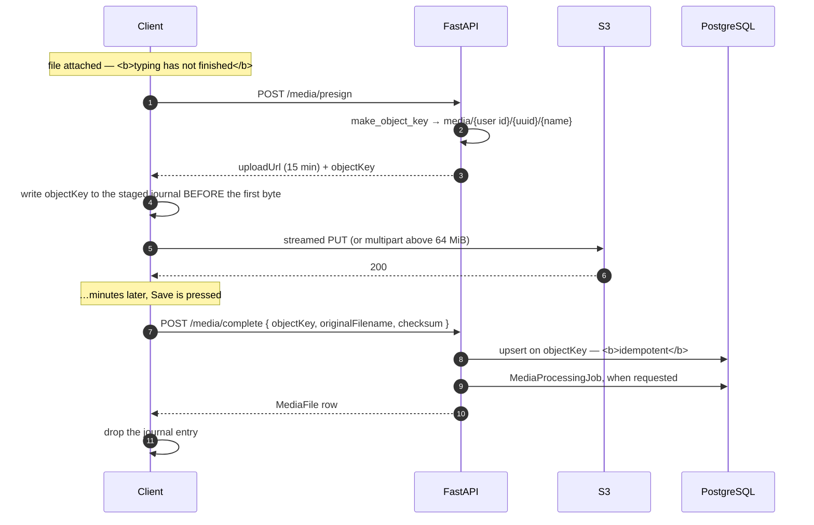

# Media pipeline — how a photo, clip or video gets from the field into the repository

Field capture happens on bad networks. A researcher standing in a workshop in a village has a
2G-ish uplink, a phone full of 12 MP photos and 4K video, and no patience for a save button that
spins for four minutes. Every tactic in this document exists to make that situation work, and to
make sure that when it *doesn't* work nothing is silently lost or silently left behind.

Both clients — the Android app and the web app — talk to the **same** API and push bytes **straight
to object storage**, never through the API. This document is the single description of that pipeline
and of every trick either client plays.

- Android: `android/app/src/main/java/com/designprototype/workshop/`
- Web: `frontend/lib/media.ts`, `frontend/lib/uploads.tsx`, `frontend/components/forms/MediaCaptureField.tsx`
- API: `backend/app/api/routes/media.py`, `backend/app/services/s3.py`

**Scope.** This document ends where the bytes land. What happens to an audio file *after* it is
stored — the three-provider transcription chain, its failover semantics and the queue's cooldown
behaviour — is [ARCHITECTURE.md §6](ARCHITECTURE.md).

> **Citations are by symbol name, not by line number.** They used to be by line — `MainActivity.kt:2126`,
> `WorkshopRepository.kt:1094` — and every one of them had silently drifted by 60 to 170 lines within a
> few weeks, while still looking precise. `grep -n "fun preuploadObject"` is one keystroke longer and
> cannot rot. `docs/tools/check-docs.mjs` reports any document that still pins line numbers.
> Note that `MainActivity.kt` contains a NUL byte, so plain `grep` finds nothing in it — use
> `grep -a`.

---

## 1. The server contract

```
POST   /api/media/presign                  -> { uploadUrl, objectKey, bucket, headers, publicUrl }
POST   /api/media/multipart/create         -> { objectKey, uploadId, bucket, partSize, partCount }
POST   /api/media/multipart/presign-parts  -> { urls: { "1": …, "2": … } }
POST   /api/media/multipart/complete       -> { objectKey, bucket, publicUrl }
POST   /api/media/multipart/abort          -> { aborted: true }
POST   /api/media/complete                 -> the created MediaFile row
DELETE /api/media/object?objectKey=…       -> 204 (staged object that was never linked)
```

Four properties of that contract the clients lean on hard:

| Property | Where | Why it matters |
| --- | --- | --- |
| **`/complete` is idempotent on `objectKey`** | `media.py` → `complete_media_upload`; `MediaFile.objectKey` is `@unique` | The key embeds the uploader id + a per-upload uuid, so a row already present for a key *is* this upload. A retried finish returns the existing row instead of a 500 `UniqueViolationError` — this is what makes retrying `/complete` safe rather than duplicating records. |
| **Every object lives under `media/<user_id>/`** | `s3.py` → `make_object_key` | Ownership is a prefix check, so `/media/object` can delete *your* staged uploads and nothing else. |
| **`originalFilename` is independent of `objectKey`** | `media.py` → `complete_media_upload` | The displayed name is applied at `/complete`. A file can therefore be uploaded under a provisional key long before its final, nomenclature-correct name is known. This is the whole basis of eager uploading. |
| **`/media/object` refuses attached objects (409)** | `media.py` → `delete_staged_object` | An orphan sweeper can never delete an object that a record now points at. |

`MediaCompleteRequest` also accepts a free-form `checksum` (`backend/app/schemas/media.py`).



**Presign lifetimes:** whole-object PUT **15 minutes**, multipart part **1 hour**
(`ExpiresIn` in `s3.py`). Both clients re-presign a part that 403s mid-transfer, and the web
re-presigns per attempt for whole objects.

`s3.py` also has `presign_get_url` — currently used only for APK release downloads
(`app_release.py`), not for media reads. It is the building block the P0 fix in
[SECURITY.md](SECURITY.md) needs, and it already exists.

---

## 2. Android — the tactics already in place

### 2.1 Eager pre-upload

The single biggest win. The bytes start moving the moment a file is attached, not when the form is
saved, so the transfer overlaps the minutes spent typing.

| Piece | Symbol |
| --- | --- |
| presign + PUT under a provisional key, no record needed | `data/WorkshopRepository.kt` → `preuploadObject` |
| one uri, progress + failure bookkeeping, on a process-lifetime scope | `MainActivity.kt` → `startEagerUpload` |
| the per-file staging state | `MainActivity.kt` → `MediaCaptureState.stagedDeferred / staged / stagedProgress / stagedFailed` |
| fired for every newly attached uri | `MainActivity.kt` → `MediaStagingEffect` |
| applies the final filename and links the object at save | `WorkshopRepository.kt` → `completeStaged` |
| a process-lifetime scope, so a transfer survives recomposition | `data/AppScope.kt` → `AppScope.io` |

### 2.2 Cleanup of staged-but-unsaved objects

| Situation | Handling |
| --- | --- |
| One attachment removed (`✕`) | await the in-flight transfer, then `deleteStaged` |
| "Clear attachments" | the same, for the whole batch |
| Capture screen dismissed without saving | `DisposableEffect { onDispose { … deleteStaged … } }` |
| A grid-measurement photo re-captured or discarded | same path, per photo |
| `deleteStaged` itself | `WorkshopRepository.kt` → `deleteStaged` → `DELETE /media/object` |

### 2.3 Multipart above a size threshold

`MULTIPART_THRESHOLD = 64 MiB` (`WorkshopRepository.kt`). At or under it, one streamed PUT; above it,
`create` -> `presign-parts` -> per-part PUT -> `complete`, and S3 stitches the parts into a single
object so the stored file is still whole (`uploadBytesToS3`, `uploadMultipart`).

- Per-part retry with backoff, 3 attempts: `putPart`.
- `Content-Type` is deliberately unset on a part — the part presign does not sign it.
- **Abort on any failure** so half-written parts never linger.
- **Per-part re-presigning on expiry.** Every part is signed once, up front, for an hour
  (`s3.py`); on a field connection the last parts of a 400 MB video can still be queued when
  their signature runs out, and S3 rejects it with 403. That part alone is re-signed and re-sent
  (`putPart`'s `repesign`), which does not spend one of its three retry attempts — an expired URL is
  not a failed transfer. Allowed once per part, so a genuine `AccessDenied` still fails fast.
- Bytes are streamed from the content Uri, never held on the heap: `uploadResolved`.

### 2.4 Safe-request retry with backoff

An OkHttp interceptor in `data/ApiClient.kt` retries **only** requests that are safe to repeat: GETs,
plus `/media/presign`, `/media/multipart/create`, `/media/multipart/presign-parts`,
`/media/multipart/abort`. Record-creating calls are deliberately excluded so a 504 can never create a
duplicate. Retriable codes: 502/503/504, up to 4 attempts, backoff `min(4 s, 600 ms × attempt)`.
Generous transport timeouts and `retryOnConnectionFailure(true)` for mobile data.

### 2.5 Offline outbox

With no validated internet, a create is written to disk instead of the network and replayed later
(`data/Offline.kt`).

- `ConnectivityObserver.isOnline` — validated internet, not merely an attached interface.
- `OfflineOutbox.stageMedia` — copies the captured content Uri into app storage so it survives.
- `queueOfflineEntry` — the serialised create request plus its media specs.
- `syncOutbox` — create the record, upload its media, *then* drop the local copy; **stops at the
  first failure** so the rest stay queued.
- `syncProcessEntry` — process records fan their media out to the right freshly-created step.
- A legacy entry that would 422 forever is repaired rather than allowed to block the queue.

Android's stop-at-first-failure is the one place the two clients deliberately differ; §3.1 explains
why the web does the opposite.

### 2.6 Idempotent completion

Android never auto-retries `/complete` at the transport layer, but the server-side idempotency
(§1) is what makes the app's own save/back-guard retry flow safe.

### 2.7 Journal + sweep of orphaned staged objects

§2.2 covers every abandonment the app is still alive for. This covers the one it isn't: the process
dies between the PUT and `/media/complete` — swiped away mid-transfer, killed for memory behind the
camera, battery flat in a workshop — and the bytes sit in the bucket with nothing pointing at them
and nothing in memory that remembers they exist. Eager upload makes that window as long as the
researcher spends typing.

So every presigned key is written to disk **before the first byte moves** — in `uploadBytesToS3` for
a single PUT and in `uploadMultipart` for a multipart — and forgotten the moment it settles:
`/complete` claimed it, `deleteStaged` removed it, or an aborted multipart discarded its parts.
`data/StagedJournal.kt` is `filesDir/staged-objects.json`, written through the same
file + `Mutex` + kotlinx mechanism as the offline outbox, because both have to survive the same kill.

Each entry carries the id of the process that wrote it, and the sweep deletes only entries owned by
a **previous** one (`StagedJournal.sweep`, called from `sweepStagedObjects`).
That is the whole ownership rule — a phone has one process, and a process that is gone cannot still
be waiting to save, so nothing can be deleted out from under an open form. The web needs a 60 s
heartbeat and a 5-minute staleness cut-off only because one browser has many tabs.

It runs **once per process**, kicked off the first time `syncOutbox` is called — the app's
existing "signed in, or the network just came back" hook, and the only start-up path carrying a
`Context` — detached on `AppScope.io` so a sweep never delays the queued records. A key is dropped
when the server settles it: 204 (gone), 409 (a record claimed it after all — `/media/object` refuses
attached objects, so the sweeper can never orphan live data), 403 (another account's key; this
device changed hands), 404. A gateway failure or no signal leaves the entry for the next launch
rather than abandoning the bytes.

### 2.8 Content checksum

SHA-256 of what actually went up, sent as `checksum: "sha256:<hex>"` on `/complete`
(`ContentDigest` in `WorkshopRepository.kt`). Nothing verifies it server-side yet; it is stored so a
later integrity sweep *can*, and so identical bytes are recognisable.

Unlike the browser, Android hashes **incrementally from the bytes on their way to the socket** —
inside `StreamingRequestBody.writeTo` for a single PUT, and per part as each is read for a multipart
upload — so there is no second read of a 400 MB video and no size cap (the web skips above 32 MiB
because `crypto.subtle.digest` needs the whole file in one allocation). A retry re-sends from the
start, so the digest resets with it; multipart parts are hashed in read order, which is the order S3
stitches them, so the hash is of the whole stored object either way.

For a staged object the hash is produced minutes before the save that sends it, so it is kept in the
journal entry for that key (`StagedJournal.checksumFor`) — the one record of a staged object that
outlives the upload coroutine.

---

## 3. Web — what it does now

Before this change the web uploaded **only after the record was saved**, strictly one file at a time,
with no multipart, no orphan cleanup, and a flat 5-minute `xhr.timeout`. All of the Android tactics
that make sense in a browser are now in place, plus several that Android does not have.

Everything lives behind the unchanged `uploadMediaFile` / `uploadMediaBatch` signatures, so **no call
site had to change**.

### 3.1 Eager pre-upload (`frontend/lib/media.ts`, `frontend/lib/uploads.tsx`)

```
attach file ──► stageFiles(files, ownerId)
                   └─ presign ──► PUT to S3 ──► StagedObject { objectKey, bucket, checksum, … }
                                                        │
save record ──► uploadMediaBatch(files)                 │
                   └─ takeStagedFor(files) ─────────────┘  (synchronous, before any await)
                        └─ POST /media/complete   ← the only call save has to make
```

- `MediaCaptureField` calls `useEagerStaging(files, title)`; every media form in the app already uses
  that component, so every form gets eager upload for free.
- The capture tiles show per-file byte progress, `Uploaded ✓`, or `Upload failed — …` with a **Retry**
  button; the card header shows Android's wording, *"All uploaded ✓ — ready to save"*.
- The eager transfer is published into the page-level `<UploadTray>` as its own section. A file
  claimed by a save leaves the store in the same tick the batch row appears, so the two never
  double-count.

**Matching a staged object back to its file.** The store is keyed by `File` object identity. Three
call sites rename a file just before saving (the Miscellaneous Media page, `ProcessForm`,
`ToolForm`) — `new File([file], …)`
keeps the bytes but destroys identity. The fallback is a content signature
(`size:lastModified:type`), honoured **only when it is unambiguous**: if two staged files share a
signature, neither is matched and both simply upload again. Attaching the wrong photo to a record is
far worse than re-uploading one.

### 3.2 Correctness — every way a staged object can be abandoned

| Situation | What happens |
| --- | --- |
| File removed from the attach list (`Discard`) | `discardStagedFile` aborts the XHR and `DELETE /media/object`s whatever reached storage |
| Eager upload failed | the record is marked `error`, the tile offers **Retry**, and the save path re-uploads from scratch after binning the failed attempt's object |
| Save never happens; user navigates away in the SPA | the owning component unmounts -> `releaseStagedOwner` -> after a 2 s grace (React StrictMode re-runs effects on mount) any object nobody else owns is aborted and deleted |
| Tab closed mid-form | `pagehide` (skipped when `event.persisted`, i.e. bfcache) fires a `keepalive` DELETE per staged object |
| Tab closed **while bytes are still moving** | `beforeunload` warns the user first; if they leave anyway the object is reclaimed by the sweep below |
| Browser crash, power loss, keepalive lost | the **journal sweep**: every presigned key is written to `localStorage["field_repo_staged_objects"]` with a timestamp, refreshed by a 60 s heartbeat while the tab still owns it. A key not heart-beaten for 5 minutes is deleted on the next page load and every 5 minutes thereafter. Because a live form keeps heart-beating, the sweeper can never delete an object out from under an open form; because `/media/object` 409s on attached objects, it can never delete a linked one either. |
| `/complete` succeeded but the response was lost | the retry returns the same row (server idempotency); a later sweep gets a 409 and simply drops the journal entry |

### 3.3 Parallel uploads with a concurrency cap

`uploadMediaBatch` used to be a strict `for` loop. It now runs `UPLOAD_CONCURRENCY = 3` files at a
time through a pool that preserves the caller's ordering of `uploaded[]`.

*Why 3:* one connection cannot saturate even a poor link (TCP slow-start plus per-request latency
dominates), while a high fan-out on a 200 kbit uplink starves every individual transfer and pushes
them all towards the stall watchdog. Three is the usual sweet spot and matches the per-part
concurrency used for multipart.

### 3.4 Stall watchdog instead of a flat timeout

The old `xhr.timeout = 5 * 60 * 1000` is exactly wrong for field conditions: it kills a large video
that is uploading perfectly well but slowly, and then burns all three retries doing it again.

`putBlob` sets `xhr.timeout = 0` and instead arms a watchdog that is **reset on every progress
event**:

- `STALL_TIMEOUT_MS = 60 s` — no bytes moved at all: the socket is dead, abort now.
- `FINALIZE_TIMEOUT_MS = 5 min` — armed once the last byte is handed to the socket, because S3
  finalising a large object produces no further progress events.

A slow-but-alive upload can now run for as long as it needs; a genuinely dead one fails in a minute
instead of five.

### 3.5 Multipart for large files

Mirrors Android: over `MULTIPART_THRESHOLD = 64 MiB`, `create` -> `presign-parts` -> per-part PUT
(3 in parallel, 3 attempts each) -> `complete`, with `abort` on any failure. Two things it does that
Android does not:

- **ETag capability probe.** S3 identifies parts by the ETag it returns, and a browser can only read
  that header when the bucket CORS rule lists `ETag` under `ExposeHeaders`. Part 1 is uploaded alone;
  if its ETag is unreadable the upload is aborted, the session flips to single PUTs, and the file is
  retried whole. A misconfigured bucket therefore costs 16 MiB, not every large upload.
- **Per-part re-presigning.** A part that 403s because its (1 hour) signature expired mid-transfer is
  re-signed individually rather than failing a 400 MB upload.

### 3.6 Safe-request retry, and a retriable `/complete`

`apiRetry` reproduces Android's interceptor policy — 4 attempts, `min(4 s, 600 ms × attempt)`, on
502/503/504 and on transport-level `TypeError` — and is applied only to presign, the multipart setup
calls, the multipart abort, **and `/media/complete`**.

Retrying `/complete` is the meaningful addition. Previously a `/complete` that timed out threw away a
completed upload and re-did the whole presign + PUT on the next attempt. Because the endpoint
de-duplicates on `objectKey`, retrying just the finish is both safe and free.

### 3.7 SHA-256 checksum

Computed with WebCrypto *concurrently with the transfer* (so it never delays the bytes) and sent as
`checksum: "sha256:<hex>"` on `/complete`. Skipped above 32 MiB, because `crypto.subtle.digest` needs
the whole file in one allocation and a 300 MB video is not worth that; skipped on an insecure origin
where `crypto.subtle` is unavailable. Nothing verifies it server-side yet — it is stored so that a
later integrity sweep *can*, and so identical bytes are recognisable.

### 3.8 Clearer failure of impossible uploads

A zero-byte file used to reach `/media/presign` and come back as an opaque 422 (`sizeBytes` must be
`> 0`). It now fails immediately with *"…is empty (0 bytes) — there is nothing to upload."*

---

## 3.1 The offline outbox — `frontend/lib/offline.ts`

The last Android tactic the web was missing. A save made with no connection is written to an
IndexedDB queue instead of failing, and sent when the network returns.

**What is stored.** One entry per attempted save: the record request (endpoint, method, JSON body)
and the attached files as `File` objects. IndexedDB stores those by structured clone, so the bytes,
the name and the MIME type survive a browser restart — a blob: URL or an in-memory array would not.
The attachments are the part that cannot be recreated: by the time signal returns the artisan has
gone home.

**Media is a LIST of batches, not one lump.** A product queues its two measurement-grid photos —
each with the caption naming its dimension — beside the general field media; a tool adds its numbered
process-stage captures on top; an interview adds one batch per question carrying that question's
`questionId` metadata. Flattening them would put every file under one caption, and for a grid photo
the caption is the only thing that says which dimension it measures.

**Server-created children.** The process form's step captures link to `processstep` rows that do not
exist until the server makes them, so those batches carry a `stepIndex` and the replay resolves the
real id from the create response's `steps[]`.

**A replay is RESUMABLE, and this is load-bearing.** "Create the record, then upload its media" is two
steps, and only the first is expensive to repeat — repeating it makes a second record. So each step
is written back to the entry the moment it lands (`created`, `createdId`, `uploadedBatches`), and a
pass that dies half way through picks up at the media instead of starting the record again.

> Without that write-back the outbox **duplicated every record whose media upload was interrupted,
> once per sync pass, for as long as the signal stayed bad** — the worst possible timing, since a bad
> signal is the only reason the entry is in the outbox at all.

**How a failure is triaged** — the one place this deliberately differs from Android, whose outbox
stops at the first failure:

| Failure | Verdict | What happens |
| --- | --- | --- |
| No connection, 5xx, 408, 429 | transient | Stop the pass, keep everything queued, retry on the next `online` event. |
| 4xx (validation, permission) | permanent | Mark **that** entry with the server's reason, leave it for the user to read and discard, carry on to the next. |
| **409** | **a genuine conflict** | Surface it to the researcher to resolve. **Nothing is deleted.** |

Stopping at the first failure is right for a connection that dropped again and wrong for a request
the server will never accept: one 422 at the head of the queue would block every entry behind it
indefinitely with nothing on screen to say why.

**Nothing is ever deleted because the server said 409** — and this row used to say the opposite. It
read a 409 as "the create already landed and we lost the response", and dropped the entry *and its
files* as sent. **No endpoint in this API means that by 409:** from `/artisans` it is a clashing
Aadhaar number, from `/crafts` a craft of that name, from `/questionnaire/interviews` an interview
that already exists for that exact artisan set. So the one answer that means "someone else's record
collides with yours" was destroying the record, destroying the photographs, and reporting success.
The lost-response case it was aiming at is covered properly by `created` above, which knows rather
than guesses.

```mermaid
stateDiagram-v2
  direction LR
  [*] --> queued: save with no connection
  queued --> creating: online event / Sync now
  creating --> created: 201 — <b>written back at once</b>
  creating --> queued: transient (offline, 5xx, 408, 429)
  creating --> permanent: 4xx validation or permission
  creating --> conflict: <b>409</b>
  created --> uploading
  uploading --> uploading: each batch marked done as it lands
  uploading --> created: transient — resume at the media,<br/><b>never re-create</b>
  uploading --> [*]: entry and local files dropped
  permanent --> [*]: shown with the server's reason; user discards
  conflict --> [*]: shown as a conflict; <b>nothing deleted</b>
```



**Where it shows.** `components/OutboxBanner.tsx`, mounted once in the protected layout above the
page. An outbox nobody can see is worse than no outbox — the researcher believes the record is filed
when it is sitting in one laptop's browser storage — so the banner names every entry, says plainly
that they live in this browser, drains automatically on `online`, and offers "Sync now" for captive
portals that report `navigator.onLine === true` while nothing routes.

**Wired into:** artisan, product, tool, process, craft, workshop and questionnaire saves — every form
that creates a record in the field. `saveOrQueue` deliberately does not upload the media when online;
the caller keeps its own `uploadMediaBatch` call so progress, per-file retry and the eager-staging
claim all behave exactly as before, and the files are handed over only if the save is queued.

---

## 3.2 Quality checks at the moment of choosing — `frontend/lib/imageQuality.ts`

Everything above is about getting the bytes off the phone. This is the one check that has to happen
*before* they leave, and the timing is the whole feature.

A designer photographs a product in a village a couple of hundred kilometres from the next reliable
connection, and the upload happens hours or days later. A check that runs on the server therefore
reports "that photograph is out of focus" to somebody at a desk, about an object that has since been
sold, in a cluster nobody is going back to this month. The finding is true and completely useless.
The only moment the warning is worth anything is the moment the designer is still standing in front
of the object and can simply take the picture again — the instant the file is **chosen**, before it
joins the upload queue.

### 3.2.1 Two hard rules

**It measures and never modifies.** §5 below records a deliberate refusal to re-encode images: this
is a heritage archive, the original file *is* the artifact, and a canvas round trip destroys full
resolution and strips the EXIF the app preserves on purpose. So this module decodes to a scratch
bitmap, reads numbers off it, closes it, and leaves the `File` byte-for-byte untouched. **There is no
`toBlob`, no `toDataURL`, no re-compression and no write path anywhere in the file, and there must
never be one** — a "helpful" downscale here is exactly the thing §5 exists to forbid, arriving
through a door marked "quality".

**A finding is advice, never a refusal.** Every function returns descriptions. None can stop an
upload, delete a file or swap one out. A designer may have deliberately photographed something
blurred — a loom in motion — or may be holding the only photograph that will ever exist of an object
about to leave. Blocking that is a worse failure than every problem this module can detect put
together.

**This rule ended at the surfacing on 2026-08-27, on an owner's instruction, and the exception is
narrow on purpose.** The paragraph above used to end "and the surfacing must keep it that way"; it no
longer can. The instruction was that a shaky or poor-quality photograph must not reach the server at
all, which is the owner's decision to make — what is *not* theirs to make is the claim, so a gate may
only refuse on something this product actually measures and only where the designer can comply.
Neither `frontend/lib/imageQuality.ts` nor `android/app/src/main/java/com/designprototype/workshop/data/ImageQuality.kt` changed: both still
only measure, and both are still incapable of stopping anything. The refusal lives one level up, in
`frontend/components/media/photoGate.ts` and `android/app/src/main/java/com/designprototype/workshop/data/DwPhotoGate.kt`, which are ports of
each other and hold the whole of the exception:

| Fault | What happens | Why |
|---|---|---|
| `BLUR` | **Refused** | "Shaky", the owner's own first word |
| `LOW_RESOLUTION` | **Refused** | Provably cannot fill a report plate at `RENDER_DPI`; unarguable |
| `DUPLICATE`, identical SHA-256 | **Refused** | Complying costs nothing — the bytes are already here |
| `DUPLICATE`, perceptual hash | **Admitted, warned** | Two exposures of one object seconds apart land *inside* the threshold (§3.2.3), which is how twenty-five motifs on one length of cloth get photographed |
| `MISSING_VIEW` | Advice, as before | About a row rather than about one file |
| Anything unmeasurable | **Admitted** | No measurement, therefore no finding, therefore no refusal — it fails open by construction rather than by a branch |

The gate runs **before the upload starts** on each client, which is a different place on each: in the
browser, before `setPending`, because `useEagerStaging` has already begun streaming anything that
reaches the capture card; on the handset, before `WorkshopDraftStore.importMedia` copies a byte,
because from that moment the photograph is in the draft and the sync pass will carry it. On Android
it also runs in the bulk importer (`PhotoIntakeScreen`), which is the wider of the two doors into a
gallery.

**Two things it deliberately still cannot do.** There is no override — whether a designer may push a
refused photograph through is an open question for the owner, and the loom-in-motion case above is
the strongest argument for one. And there is no server-side re-measurement: a direct API call, a bulk
import or an older build still uploads whatever it likes, because the check is client-side on both
clients and the server has no opinion about image quality.

### 3.2.2 How it stays off the main thread

`createImageBitmap` decodes off-thread in every engine that has it, so the expensive part of a 12 MP
JPEG never runs where the UI does; a second `createImageBitmap` resizes off-thread too; and the
full-size bitmap is `close()`d *before* the pixel read, so a ~48 MB RGBA decode and the working copy
never coexist longer than they must. Only the working plane is convolved, on the main thread, because
at that size it is sub-millisecond arithmetic and a worker would cost a second copy of the pixels and
a message round trip to save less than the copy costs.

Failure is always silent and always `null`. A corrupt file, a codec this browser lacks (HEIC), or a
bitmap the GPU refused is a photograph with **no findings**, never an error in front of the designer
— the file is fine and the upload is already on its way.

### 3.2.3 The thresholds, and what each one is

| Constant | Value | What it is |
|---|---|---|
| `WORK_EDGE_PX` | `640` | The long edge every measurement is taken at. Defocus is a *low*-frequency phenomenon, so a genuinely out-of-focus photograph is still obviously out of focus at 640px, at roughly forty times less arithmetic than full size |
| `BLUR_VARIANCE_FLOOR` | `60` | Variance of the Laplacian below which a photograph is called blurred |
| `MIN_CONTRAST_STDDEV` | `12` | Luma standard deviation below which the blur warning is **withheld entirely** |
| `MIN_LONG_EDGE_PX` | `1280` | Below this a photograph cannot fill a full-width report plate |
| `NEAR_DUPLICATE_MAX_DISTANCE` | `6` | Bits of a 64-bit dHash that may differ before two photographs are called the same shot |

**`WORK_EDGE_PX` and `BLUR_VARIANCE_FLOOR` move together or not at all.** Variance of the Laplacian
depends entirely on the scale it is measured at, so changing the working size invalidates the floor
and the calibration has to be re-run on both clients.

**`MIN_LONG_EDGE_PX` is derived, not a rule of thumb.** The report is A4 with 25 mm margins, so a
full-width plate is 160 mm — 6.2992 in — and `report_raster.RENDER_DPI` is 200.0, the resolution this
app rasterises its own maps and charts at. 6.2992 × 200 = 1260, rounded up to 1280. Deliberately
**not** the 300 dpi print standard, which would put it at 1890: below 1280 a photograph provably
cannot fill the plate at the resolution the app itself considers adequate and there is nothing to
argue about, whereas between 1280 and 1890 it merely falls short of commercial offset, which is real
but arguable — and a warning that fires there would flag a great many photographs that look perfectly
good in the delivered document. Photographs are embedded at their original size and never resampled,
so nothing downstream rescues a small one; saying so at capture time is the only chance anybody gets.

### 3.2.4 The low-contrast guard, which is the interesting one

**Variance of the Laplacian scales with the square of the image's own contrast**, so a *perfectly
sharp* photograph of a low-contrast subject scores like a blurred one. That is not a rare corner in
this archive. Undyed cotton on a white sheet, raw bamboo against a mud wall, a pale terracotta pot in
flat shade — all ordinary craft documentation, and all low-contrast by nature.

So contrast is measured first, and where there is too little of it for the blur measure to
discriminate, the module says nothing rather than guessing. `isBlurred` checks the contrast guard
**first**, and it is not a tie-breaker: below the floor the answer is "no finding", never "probably
blurred".

The evidence, *MEASURED* — re-derived by the Kotlin port from the same generators and pinned figure
by figure in `android/app/src/test/java/com/designprototype/workshop/data/ImageQualityParityTest.kt`:

A sharp 1/f field flattened to a low-contrast subject scores a blur variance of **58.98** — *below
the floor of 60, so it would have been reported as blurred* — at a contrast of **9.03**, which is
below the guard and therefore says nothing at all.

And the pair that makes contrast a *safe* guard rather than a second blur measure wearing a different
name: the same photo-like field measures a contrast of **32.23** sharp and **29.58** after a
radius-4 blur. Blurring barely moves contrast, because defocus removes high-frequency detail and
leaves the overall spread of tones intact — so contrast can tell "flat" from "unfocused", and
withholding the warning below 12 costs no genuine blur detections while removing the one false
positive that matters.

Without this guard, the first thing the feature would have done in the field is call a correctly
exposed, perfectly sharp photograph of undyed cotton blurred.

### 3.2.5 Why 60 sits at the bottom of the gap

*MEASURED* on the calibration corpus:

| Source | Sharp | Blurred (box blur radius 1 / 2 / 4) |
|---|---|---|
| 1/f "photo-like" field, seed 1337 | 733 | 5.1 / 2.4 / 1.8 |
| 1/f "photo-like" field, seed 90210 | 807 | 5.5 / 2.4 / 1.8 |
| A canvas-encoded JPEG through the browser decoder | 15473 | 56.3 *(6 px Gaussian)* |
| A 4000×3000 frame through the browser decoder | 9308 | — |
| Checkerboard, 8 px cells | 40106 | *(synthetic ceiling, not a photograph)* |

The Kotlin port re-derived the generated rows from the same generators and records them to two
places — 732.55, 806.59, 40106.18 — which is the same corpus, more precisely written down. The two
real-JPEG rows exist only on the web side, because the parity harness drives the pure core and not a
browser decoder.

The realistic sharp population sits at 732 and above; everything genuinely out of focus sits at 56.3
and below. **60 is placed hard against the blurred population rather than in the middle of that gap,
and the asymmetry is the whole design.** A missed blurred photograph costs one photograph. A false
"this is blurred" on a photograph that is perfectly sharp costs the *feature* — a designer wrongly
warned twice stops reading warnings, and then the real one goes past unread too. At 60 the lowest
realistic sharp score clears the line by a factor of twelve, and that margin is what absorbs the
low-detail subjects this corpus does not contain: a plain pot against a plain wall is sharp and
carries far less edge energy than any sample above.

The accepted cost is that photographs which are only *slightly* soft score in the hundreds and pass
unremarked. Downscaling to 640px is itself a low-pass filter — a 4 px blur at 4000 px wide is 0.64 px
at 640 — so the module is deliberately biased toward silence about marginal cases.

> **There is no real handset corpus, and the thresholds must not be tightened without one.** Every
> figure above comes from images the calibration spec *generates*: seeded 1/f noise fields, a
> checkerboard, and a canvas-encoded JPEG — real encoding and a real browser decode, synthetic
> content. Nothing here has been measured against photographs taken on the handsets designers
> actually carry, of the subjects they actually photograph, in courtyard light. The images are
> generated on purpose (a binary fixture rots invisibly, and one re-saved by an image editor moves
> every score with no visible cause), and the spec asserts the **separation** between the two
> populations rather than the literal values — so it will catch a measurement that drifts, and it
> cannot tell you the floor is right for a real photograph of a real loom. Collecting such a corpus
> is the work that would justify moving either number. Until it exists, treat the floor as an
> anti-false-positive setting that happens to catch bad blur, not as a calibrated detector.

### 3.2.6 Duplicates, and what they reuse

Exact first and exclusively: when the SHA-256 the upload already computed (§2.8, §3.7) matches a file
already attached, that is the finding, and no perceptual comparison is run — reporting "duplicate"
twice about one file reads as two separate problems. Only when the bytes differ does the 64-bit
**dHash** come into play.

A *difference* hash rather than an average hash, on purpose: aHash compares every pixel to the
frame's mean, so it is dominated by overall exposure and two different products shot against the same
wall in the same light hash alike. dHash encodes the direction of local gradients, which is a property
of the *subject*, and is naturally immune to the exposure and white-balance drift between two shots
of one object. `resampleGrey` box-averages rather than sampling, because a nearest-neighbour shrink of
the same photograph a frame apart lands on different source pixels and produces a different hash —
which is precisely the near-duplicate this is supposed to catch.

A missing checksum is treated as **unknown**, never as unique.

### 3.2.7 Missing views exist only where the registry has named slots

`NAMED_VIEW_SLOTS` maps one entity — stage 6's `existingProduct`, which really does declare
`viewFront` / `viewBack` / `viewDetail` as separate `IMAGE` fields — and nothing else. Stage 11's
`sketch` has one `image`; stage 16's `finalProduct` has galleries, not named views. A "missing back
view" warning on either would point at a field that does not exist, which is worse than no warning:
it asks for something the form cannot accept. The map grows only when the registry does.

The warning fires only once **at least one** slot is filled. Every slot is Advanced-tier and
optional; a designer who filled none has decided this product does not need a multi-view record, and
telling them three times that they have not started is noise.

### 3.2.8 Vocabulary, and where it surfaces

The flags are `MEDIA_QUALITY_FLAG` in `backend/app/services/stage_schema.py`, verbatim — the same
words stage 21's media-quality table records against a file. Inventing a second set of names would
mean the warning a designer reads in the field and the flag the archive stores describe the same
problem differently. The module implements four of that enum's tokens: `BLUR`, `LOW_RESOLUTION`,
`DUPLICATE`, `MISSING_VIEW`. `OVEREXPOSED`, `UNDEREXPOSED` and `WRONG_SUBJECT` exist in the registry
and have **no on-device check** — the first two are measurable and simply not built; the third is a
judgement no arithmetic here can make.

Every message carries the **measurement**, not just the verdict. "Sharpness score 42 — a sharp
photograph normally scores well above 60" lets somebody who deliberately photographed a moving loom
dismiss it in one read; "Image may be blurred" gives them nothing to judge with and is
indistinguishable from the app being wrong.

| Surface | Where |
|---|---|
| Per-file findings on capture | `frontend/components/forms/MediaCaptureField.tsx` |
| Missing-view findings per row | `frontend/components/designworkshop/EntityForm.tsx` |
| The Kotlin port | `android/app/src/main/java/com/designprototype/workshop/data/ImageQuality.kt` (pure) and `ImageQualityDecode.kt` (the `BitmapFactory` half), pinned **by value** against the TypeScript by `android/app/src/test/java/com/designprototype/workshop/data/ImageQualityParityTest.kt` |
| Per-file findings on the handset | `DwPhotoQualityAdvisories`, from `android/app/src/main/java/com/designprototype/workshop/ui/designworkshop/DwMediaCapture.kt` |
| Missing-view findings on the handset | `DwMissingViewsNote`, from `android/app/src/main/java/com/designprototype/workshop/ui/designworkshop/StageScreen.kt` |

That parity test is worth copying elsewhere. It asserts the numbers the web module actually produces,
obtained by transpiling and running `frontend/lib/imageQuality.ts` itself, rather than asserting
properties — because `assertFalse(isBlurred(sharp))` passes for a threshold of 1 and for one of
100000, and would go on passing while the two clients drifted far enough to disagree about a real
photograph.

The pure core (everything above `measureImageFile`) touches no DOM, no `File` and no network, which
is what makes both the direct unit tests and the Kotlin port possible without dragging the browser's
decoding machinery along.

---

## 4. Tactic matrix

| Tactic | Android | Web |
| --- | --- | --- |
| Eager pre-upload on capture/attach | yes | **yes (new)** |
| Per-file progress, retry, remove | yes | **yes (new)** |
| Delete staged object on discard / leave | yes | **yes (new)** |
| Journal + sweep of orphaned staged objects | **yes (new)** — see §2.7 | **yes (new)** |
| `beforeunload` guard while bytes are moving | n/a | **yes (new)** |
| Multipart over 64 MiB, per-part retry, abort | yes | **yes (new)** |
| ETag capability probe + fallback | n/a (OkHttp reads the header directly) | **yes (new)** |
| Per-part re-presigning on expiry | **yes (new)** — see §2.3 | **yes (new)** |
| Parallel files with a concurrency cap | **yes (new, 3)** | **yes (new, 3)** |
| Stall watchdog instead of a flat timeout | n/a (OkHttp) | **yes (new)** |
| Safe-request retry on 502/503/504 | yes | **yes (new)** |
| Retriable, idempotent `/complete` | server-side | **yes (new, client too)** |
| Content checksum | **yes (new)** — see §2.8 | **yes (new)** |
| Quality findings at selection — blur, resolution, duplicates | **yes** — `ImageQuality.kt` + `ImageQualityDecode.kt`, surfaced by `DwPhotoQualityAdvisories` in `DwMediaCapture.kt`, and **pinned by value** to the web's numbers | **yes** — see §3.2 |
| Missing named-view findings | **yes** — `DwMissingViewsNote`, from `StageScreen.kt` | **yes** (`EntityForm`) |
| Offline outbox for whole records | yes | **yes (new)** — see §3.1 |
| Streams from disk, never buffers the file | yes | yes (XHR streams a `File`/`Blob`) |

---

## 5. Considered and deliberately not done

**Client-side image downscaling before upload.** Tempting — field photos are 6–12 MB and the uplink
is bad — but wrong for this product. This is a heritage documentation archive: the original file *is*
the artifact, and re-encoding through a canvas destroys full resolution and strips the EXIF the app
deliberately preserves (`collectExifMetadata`, and the on-screen promise that "captured files go up
unchanged"). The bandwidth problem is better solved by not making the user *wait* for the bytes
(eager upload), by not restarting them (multipart + per-part retry), and by not killing a slow
transfer (stall watchdog). If it is ever wanted, it should be an explicit, off-by-default
"low-bandwidth mode" that transplants the original EXIF onto the resized JPEG and records
`extraMetadata.downscaledFrom` — never a silent default.

**Resumable uploads across a page reload.** S3 multipart *is* resumable in principle (the `uploadId`
and completed part ETags could be journalled and the transfer picked up later), but a browser cannot
re-open the user's file after a reload without them re-picking it, so "resume" would still start with
a file dialog. Not worth the machinery; the eager upload already means a reload rarely lands
mid-transfer.

**Client-side dedupe on checksum.** Now cheap to add (the hash already exists) but it needs a server
lookup endpoint and a policy for what "the same file twice" means for two different records. Noted,
not built.

**Retrying the record-creating calls.** Deliberately never done, on either client: a 504 on a create
may or may not have landed, and a duplicate artisan is worse than an error message.

---

## 6. Operational notes

- **S3 bucket CORS must expose ETag** or multipart from the browser can never complete:
  `"ExposeHeaders": ["ETag"]` (documented in `backend/DEPLOY_AWS.md` §4 and
  [DEPLOYMENT_VERCEL.md](DEPLOYMENT_VERCEL.md) §4.2; the Terraform variable is
  `cors_allowed_origins`). Local MinIO exposes it by default. The client degrades to single PUTs if it
  is missing, so the symptom is "large uploads are slower and less resilient", not "large uploads
  fail".
- **Local MinIO and SSE.** `AWS_S3_SSE_ALGORITHM` defaults to `AES256`
  (`backend/app/core/config.py`), and MinIO without a KMS backend rejects
  `CreateMultipartUpload` with `NotImplemented: Server side encryption specified but KMS is not
  configured`. For local development set `AWS_S3_SSE_ALGORITHM=` (empty) in `backend/.env`, as
  `.env.example` already advises. Real S3 is unaffected.
- **Presign lifetimes**: whole-object PUT 15 min, multipart part 1 hour (`ExpiresIn` in `s3.py`).
  The web client re-presigns per attempt for whole objects and per part on a 403; Android re-presigns
  per part on a 403 (§2.3).
- **The staged-object journal** is `localStorage["field_repo_staged_objects"]` on the web, a
  `{ objectKey: lastSeenEpochMs }` map, and `filesDir/staged-objects.json` on Android, a list of
  `{ objectKey, owner, checksum }` (§2.7). Clearing either is harmless: the objects simply stop being
  tracked, and the bucket lifecycle rule (if configured) is the final backstop.

---

## 7. How to verify it end to end

With the local stack up (`docker compose up -d`, API on `:8000`, web on `:3000`, MinIO on `:9000`):

1. Open **Crafts**, attach two files, and *do not save*. The network panel should show one
   `POST /api/media/presign` and one `PUT` to `:9000` per file, **no** `/api/media/complete`, and the
   card should read *"All uploaded ✓ — ready to save"*.
2. Save the craft. There should be exactly one `/api/media/complete` per file, carrying the
   `objectKey`s from step 1 and a `sha256:` checksum — and **no** new presign or PUT.
3. Attach a file, wait for *Uploaded ✓*, press **Discard**: a `DELETE /api/media/object` fires and
   `GET http://127.0.0.1:9000/design-workshop/<objectKey>` returns 404.
4. Attach a file and navigate away without saving, or close the tab: same 404.
5. On **Miscellaneous Media** (which renames files before saving), repeat step 2 — `/complete` must
   still carry the staged `objectKey` while `originalFilename` is the nomenclature name.

Two more that matter more than the five above, because they are the paths that have actually lost
data (see [QA_AUDIT.md](QA_AUDIT.md) §3):

6. **Interrupted replay must not duplicate.** Go offline (devtools → Offline), save a craft with two
   photographs, go online, and **kill the tab while the media is uploading**. Reopen: the outbox
   entry must resume at the media and produce **exactly one** craft, not two.
7. **A 409 must not delete anything.** Queue an artisan offline with an Aadhaar number that already
   exists in the database, then go online. The entry must remain in the outbox, marked as a conflict,
   **with its photographs still attached**.

---

## How this document is kept true

| Claim class | Kept true by |
|---|---|
| Symbol references | Symbol names, not line numbers — see the note at the top. `docs/tools/check-docs.mjs` resolves every file path and reports any document still pinning line numbers. A symbol that has been renamed is caught by `grep -n "fun <name>"` returning nothing. |
| The server contract (§1) | `backend/app/api/routes/media.py` and `backend/app/schemas/media.py`. The idempotency property rests on `MediaFile.objectKey` being `@unique` in `backend/prisma/schema.prisma` — if that constraint ever goes, §1's first row is false and retrying `/complete` starts duplicating rows. |
| Thresholds and lifetimes | `MULTIPART_THRESHOLD` in `WorkshopRepository.kt` and `frontend/lib/media.ts`; `ExpiresIn` in `backend/app/services/s3.py`. All four are single constants. |
| The tactic matrix (§4) | The only way to keep it true is to add a row when a tactic is added. It is a checklist for parity between two clients that drift independently — a tactic in one and not the other is exactly what it exists to show. |
| §3.2's thresholds | Five module-scope constants in `frontend/lib/imageQuality.ts`, mirrored in `ImageQuality.kt`. `android/app/src/test/java/com/designprototype/workshop/data/ImageQualityParityTest.kt` fails if the two clients' *numbers* diverge; `frontend/e2e/image-quality.spec.ts` fails if the separation between the sharp and blurred populations stops holding. Neither can tell you the floor is right for a real photograph — see the box in §3.2.5. |
| §3.2's "measures and never modifies" | `grep -n "toBlob\|toDataURL\|convertToBlob" frontend/lib/imageQuality.ts` must stay empty. That grep is the whole check, and it is the one that keeps §5's refusal from being undone by a well-meaning optimisation. |
| Which flags actually have a check (§3.2.8) | `MEDIA_QUALITY_FLAG` in `backend/app/services/stage_schema.py` is the vocabulary; `QualityFlag` in `frontend/lib/imageQuality.ts` is the implemented subset. A token added to the enum with no check silently widens the gap that paragraph names. |
| §7's procedures | Manual. Steps 6 and 7 correspond to real regressions and are the two to run before any release that touches `frontend/lib/offline.ts` or `Offline.kt`. |

**Review triggers:** `frontend/lib/media.ts`, `frontend/lib/uploads.tsx`, `frontend/lib/offline.ts`,
`frontend/lib/imageQuality.ts`, `frontend/components/forms/MediaCaptureField.tsx`,
`backend/app/api/routes/media.py`, `backend/app/services/s3.py`, and the Android `data/` package.

**Known unverified:** the S3 bucket's CORS `ExposeHeaders` and its default-encryption setting are
console state this repository cannot read. §6 says what they must be, not what they are — the ETag
probe in §3.5 exists precisely because the client cannot assume either.
