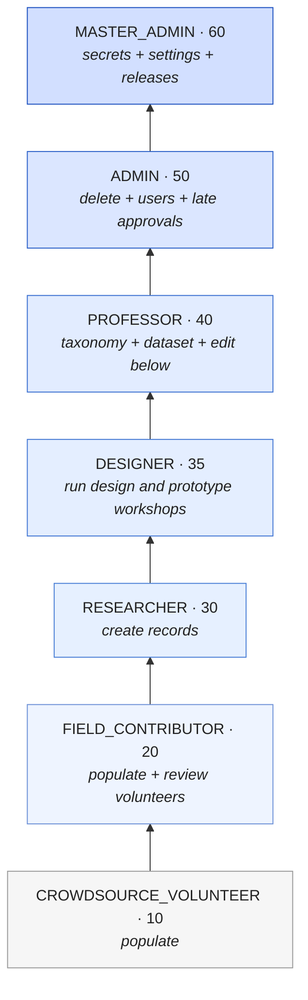
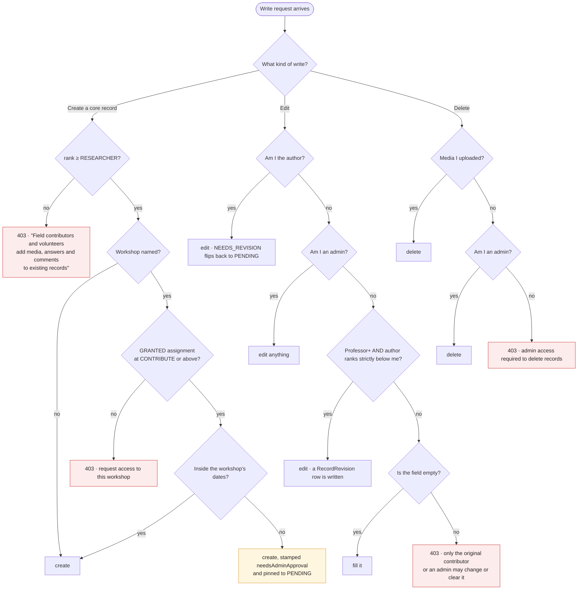
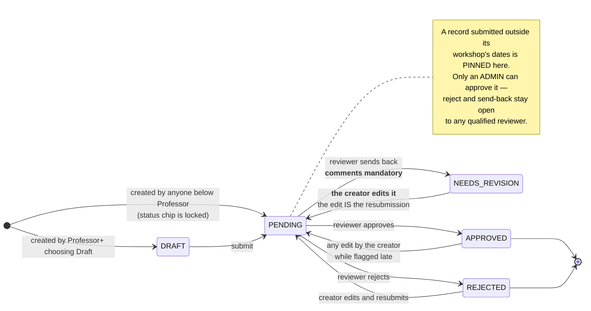
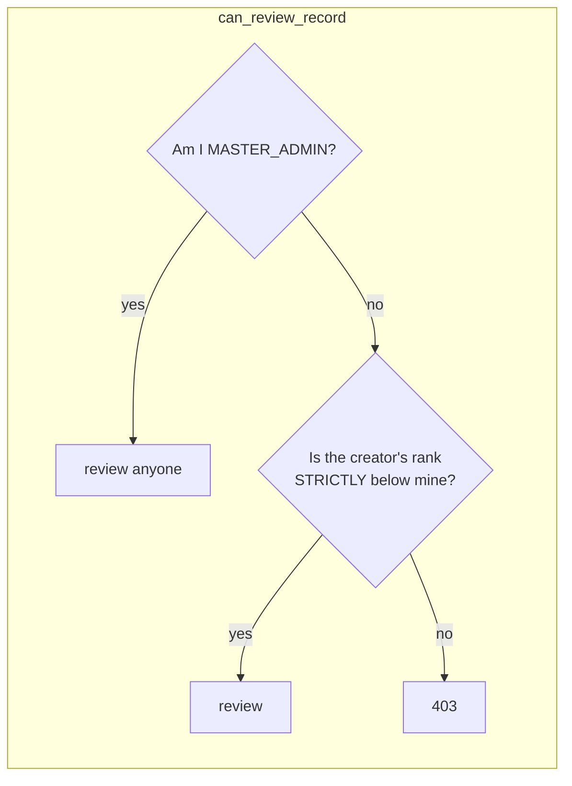
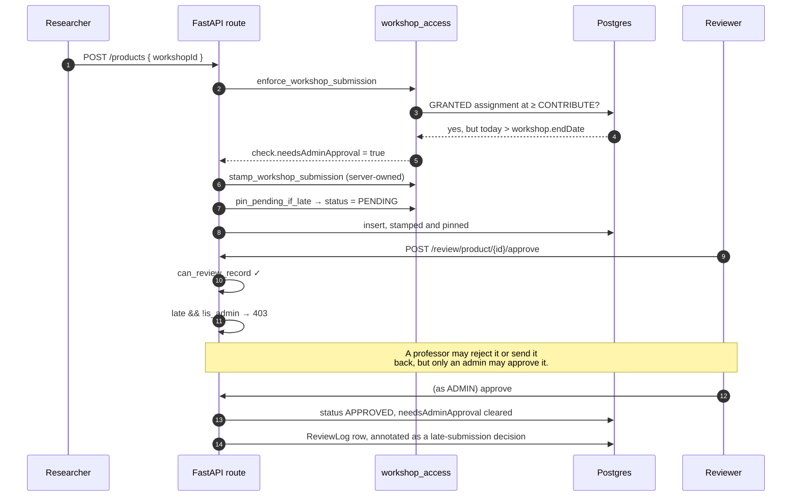
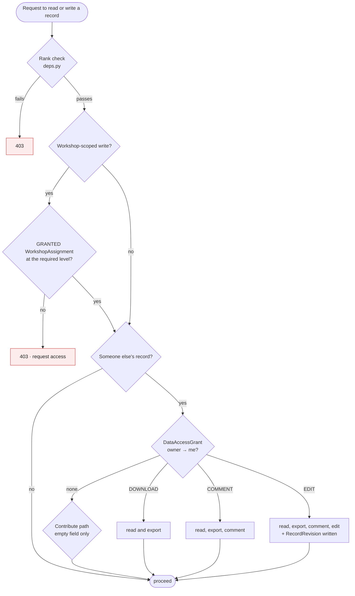

# Permissions: who may do what, and the review state machine

The complete authorisation model — the role ladder, the capability matrix, the access systems that
layer on top of it, and the exact state machine every record moves through.

**Source of truth is `backend/app/core/deps.py`.** The web client mirrors it in
`frontend/lib/permissions.ts` and the Android client in `MainActivity.kt`; both mirrors are advisory
UI, and neither is a control. Every rule below is enforced server-side, and the client copies exist
only so a user is not offered a button that will 403.

Sister documents: [SECURITY.md](SECURITY.md) for how the identity behind these checks is
established, [DATA_MODEL.md](DATA_MODEL.md) for the tables, [WALKTHROUGH.md](WALKTHROUGH.md) for what
this feels like to a researcher.

---

## 1. The ladder

Strictly ordered. Each tier inherits **everything** below it. The ranks themselves are generated into
[REPO_FACTS.md](REPO_FACTS.md).



**`DESIGNER` is 35, in the gap the original tens deliberately left**, and the reason it was inserted
rather than renumbered is that every stored role value and every `has_rank` comparison in
`deps.py` goes on meaning exactly what it meant before. A designer runs a workshop and signs the
report; a researcher documents what they find.

> **Rank is not the whole answer for a designer.** `can_run_design_workshops` is the one predicate in
> `deps.py` that is a **SET** — `DESIGNER`, `ADMIN`, `MASTER_ADMIN` — and not a threshold, so a
> **Professor cannot run a design & prototype workshop even though they outrank a designer.** A
> design workshop is a fortnight of a named designer's work ending in a document submitted to a
> ministry under their name, and being senior to a designer is not the same thing as being one.
> Admins are in the set because somebody has to be able to administer the records.
>
> A non-monotonic rule is far easier to let drift than a threshold, which is why
> `frontend/lib/permissions.ts` carries the identical set and must keep carrying it.

**There are two gates on top of the role, and neither is in `deps.py`.** Both run on
`POST /api/auth/login`, in this order, and both refuse with a 403 carrying a sentence rather than a
permission error:

1. **The platform allow-list** (`backend/app/services/access_roster.py` → `AccessRoster`) governs
   **every account except the master admin's**. No ACTIVE row, no sign-in — a missing row is read as
   "awaiting approval", not as an admission, so the gate fails closed. The refusals are deliberately
   distinguishable: *awaiting approval*, *not approved*, *access suspended*, and — unchanged —
   `401 Invalid email or password` for a wrong credential. **The `MASTER_ADMIN` exemption is what
   makes gating everybody safe**: it lives in the gate, not in the table, so there is always one
   account that can reach the roster and let people back in. Google sign-in is gated too; an address
   that is not admitted becomes a pending request instead of an account.
2. **The designer empanelment** (`backend/app/services/designers.py` → `roster_allows`) still gates
   `DESIGNER` accounts only, and still answers in its own words. `User.role = DESIGNER` is not by
   itself what admits a designer. Admins are deliberately not empanelment-gated — an admin
   empanelled years ago and later suspended must not lose the ability to administer anything — and
   an ACTIVE `DesignerRoster` row is accepted by the allow-list as an admission, so empanelling
   somebody remains one action rather than two.

Admin and above manage the allow-list (`can_manage_access_roster` → `require_access_manager`,
`/api/access/roster`); read is gated with write, because the pending queue is a list of somebody's
colleagues, applicants and former staff.

**Where an administrator actually does it, on each client, and how they are told.** There is no
email sender and no push transport anywhere in this codebase, so the notification is a COUNT on a
surface an admin already opens, with the queue one tap behind it. The number is the same on both
clients; the route to it is not, and that is deliberate rather than drift:

| | Web | Android |
|---|---|---|
| The screen | `/admin/access` (`frontend/app/(protected)/admin/access/page.tsx`) | `AccessRosterScreen` (`android/…/ui/AccessRosterScreen.kt`) |
| How it is reached | the "Who may sign in" tile on the `/admin` hub — rosters get no nav entry of their own here, the same rule the designer roster follows | the "Who may sign in" menu entry, beside "Designer roster" |
| Where the count shows | the hub tile, and a badge on the nav's "Settings hub" (`usePendingAccessCount`, one shared fetch, no timer) | a badge on that menu entry, fed by the app-wide 45-second loop that already drains the outbox — **no second poller** |
| Client permission mirror | `canManageAccessRoster` in `frontend/lib/permissions.ts`, plus a `ROUTE_GUARDS` row and an `ADMIN_CHROME_ROUTES` row | `FieldPermissions.canManageAccessRoster`, plus the entry's own `can` predicate |

**The refused person is told which refusal it was, and the clients are told in a header.** The
sentence in `detail` is for the reader; `X-Access-Status` (`PENDING` / `REJECTED` / `SUSPENDED` /
`DESIGNER_SUSPENDED` / `NOT_RECORDED`) is how the two sign-in screens choose the heading and the
"what to do next" line around it — because matching on the prose would break silently the first time
somebody rewords a sentence. A 401 carries no label at all, and an unlabelled 403 draws neutral
chrome around the server's own words rather than a guessed heading. The header must stay in
`expose_headers` on the CORS middleware (`app/main.py`) or the browser cannot read it while the
phone can.

The single most-misdocumented line in this repository, stated plainly:

> **A Field Contributor cannot create records.** `can_create_records` requires **Researcher**
> (rank 30). The two tiers below *populate* records that already exist — uploading media, answering
> questions in an open interview, commenting. That is the reason those tiers exist, and none of those
> three paths passes through the create gate.

Earlier versions of `README.md`, `SECURITY.md` and `RESEARCHER_GUIDE.md` all said Field Contributors
create records. They did not, and do not.

### 1.1 Grantable capabilities

A master admin can lift one specific power for a lower tier without promoting the account. Three of
the six columns on `User` still do that; **two are deliberately no longer read.**

| Column | Read? | Effect |
|---|---|---|
| `canReview` | **yes** | opens the review queue below Field Contributor |
| `canDownloadDataset` | **yes** | dataset download and the Data Browser below Professor |
| `canManageQuestionnaire` | **yes** | edit the questionnaire structure below Professor |
| `canViewProvenance` | **yes** (client-side) | shows created-by and per-field edit history; `isAdmin \|\| canViewProvenance` |
| `canManageCrafts` | **NO — ignored** | craft management is Professor **by rank alone** |
| `canManageWorkshops` | **NO — ignored** | workshop management is Professor **by rank alone** |

The last two were removed from the decision, not from the schema. The reasoning is in
`can_manage_crafts`' docstring and is worth repeating: a grant that lifts a researcher over the
*taxonomy itself* is the one clause that lets someone the permission matrix places underneath the
vocabulary rewrite it — and because a grant does not change the role column, nobody auditing the user
table can see who holds it. The columns stay (dropping them is neither safe nor reversible, and no
live account below Professor holds either), simply unread. Restoring the old behaviour is putting one
clause back in each function.

---

## 2. The capability matrix

Read across: ✅ allowed, ⬜ refused, and a note where the rule is conditional. This is the whole
gate list; each row names the function in `deps.py` that decides it.

| Capability | Gate | VOL 10 | FIELD 20 | RESEARCH 30 | DESIGN 35 | PROF 40 | ADMIN 50 | MASTER 60 |
|---|---|:--:|:--:|:--:|:--:|:--:|:--:|:--:|
| Sign in, read lists and search | `get_current_user` | ✅ | ✅ | ✅ | ✅³ | ✅ | ✅ | ✅ |
| Upload media, answer an open interview, comment | `get_current_user` | ✅ | ✅ | ✅ | ✅ | ✅ | ✅ | ✅ |
| **Create** artisan / product / tool / process / interview | `require_record_creator` | ⬜ | ⬜ | ✅ | ✅ | ✅ | ✅ | ✅ |
| Edit **own** record | ownership | ✅ | ✅ | ✅ | ✅ | ✅ | ✅ | ✅ |
| Fill an **empty** field on someone else's record | `assert_can_contribute_fields` | ✅ | ✅ | ✅ | ✅ | ✅ | ✅ | ✅ |
| Change or clear a **populated** field on someone else's record | `assert_can_contribute_fields` | ⬜ | ⬜ | ⬜ | ⬜ | ⬜¹ | ✅ | ✅ |
| Edit a record created by someone **ranked below** | `can_edit_others_record` | ⬜ | ⬜ | ⬜ | ⬜ | ✅ | ✅ | ✅ |
| Open the **review queue** | `require_reviewer` | grant | ✅ | ✅ | ✅ | ✅ | ✅ | ✅ |
| Approve / reject / send back a **specific** record | `can_review_record` | ⬜ | vol only | below only | below only | below only | below only | ✅ everyone |
| Approve a **late** (out-of-window) submission | `set_review_status` | ⬜ | ⬜ | ⬜ | ⬜ | ⬜ | ✅ | ✅ |
| Create or edit a **craft** | `require_craft_manager` | ⬜ | ⬜ | ⬜ | ⬜ | ✅ | ✅ | ✅ |
| Create or edit a **workshop** | `require_workshop_manager` | ⬜ | ⬜ | ⬜ | ⬜ | ✅ | ✅ | ✅ |
| Edit the **questionnaire structure** | `require_questionnaire_manager` | grant | grant | grant | grant | ✅ | ✅ | ✅ |
| **Download the dataset** / Data Browser | `require_dataset_downloader` | grant | grant | grant | grant | ✅ | ✅ | ✅ |
| View the **user table**, promote / demote | `require_professor` | ⬜ | ⬜ | ⬜ | ⬜ | ✅ | ✅ | ✅ |
| **Create** or **delete** a user account | `require_admin` | ⬜ | ⬜ | ⬜ | ⬜ | ⬜ | ✅ | ✅ |
| **Delete** any record | `assert_can_delete` | ⬜ | ⬜ | ⬜ | ⬜ | ⬜ | ✅ | ✅ |
| Delete **media you uploaded** | route-local | ✅ | ✅ | ✅ | ✅ | ✅ | ✅ | ✅ |
| Grant / decide **workshop access** | `require_admin` | ⬜ | ⬜ | ⬜ | ⬜ | ⬜ | ✅ | ✅ |
| **Run a design & prototype workshop** | `can_run_design_workshops` | ⬜ | ⬜ | ⬜ | **✅** | **⬜²** | ✅ | ✅ |
| **Download the offline speech model** | `can_run_design_workshops` | ⬜ | ⬜ | ⬜ | **✅** | **⬜²** | ✅ | ✅ |
| Decide a design workshop's **viewers** (§4.4) | `require_admin` | ⬜ | ⬜ | ⬜ | ⬜ | ⬜ | ✅ | ✅ |
| Assign **tasks** to other users | `require_admin` | ⬜ | ⬜ | ⬜ | ⬜ | ⬜ | ✅ | ✅ |
| Rank the **transcription providers** | `require_admin` | ⬜ | ⬜ | ⬜ | ⬜ | ⬜ | ✅ | ✅ |
| Read / set **API key values** | `require_master_admin` | ⬜ | ⬜ | ⬜ | ⬜ | ⬜ | ⬜ | ✅ |
| Repository **app settings** | `require_master_admin` | ⬜ | ⬜ | ⬜ | ⬜ | ⬜ | ⬜ | ✅ |
| Publish an **Android OTA release** | `require_master_admin` | ⬜ | ⬜ | ⬜ | ⬜ | ⬜ | ⬜ | ✅ |

¹ A Professor may change a populated field on a record created by someone **ranked strictly below**
them, via `can_edit_others_record`. On a peer's or a superior's record they are refused like anyone
else. "grant" = refused by rank, allowed if the matching `can*` column is set.

² **Not a threshold.** `can_run_design_workshops` is a SET — see §1. These are the only ⬜s in the
table that a *higher* rank does not clear, and the only rows where reading down a column tells you the
wrong thing. The speech-model row reuses that predicate rather than inventing one: the model is a
workshop capture aid, and a laxer gate would make the offline half of dictation reachable by accounts
the online half is not. It is entitlement only — the artifact is **not** behind the daily dictation cap
or the Tier 3 consent gate, because neither applies to a file travelling *to* the phone
(`docs/ASR-MODEL-HOSTING.md` §2.6).

³ Subject to the roster: a `DESIGNER` whose `DesignerRoster` row is inactive is refused at sign-in
itself, before any gate in this table is reached. See §1.

Two asymmetries in that table are deliberate and easy to misread:

- **An admin cannot edit another admin's record.** `can_edit_others_record` composes
  `has_rank(PROFESSOR)` **and** `can_review_record`, and `can_review_record` requires *strictly*
  below. Rank 50 is not strictly below rank 50. Only the master admin can act on a peer's work. The
  same is true of user management: `canManageUser` refuses equals.
- **The review ladder reaches one tier further down than the edit ladder.** A Field Contributor may
  *review* a volunteer's record but may not *rewrite* it — reviewing is a judgement, editing is
  authorship, and `can_edit_others_record` narrows to Professor and above for exactly that reason.

### 2.1 Create, edit, delete — as a decision tree



Note the shape of the edit branch: the *contribute* path (fill an empty field) is the widest, and it
is checked **last**, after ownership and rank have both failed. That ordering is what makes an
unprivileged contribution possible without ever letting it overwrite somebody's work — and the guard
covers clearing a populated field as well as changing it, because an earlier version skipped incoming
empty values and let anyone blank a field out.

---

## 3. The review and approval state machine

Every record type except `Craft` carries a `status`. `Craft` has none — it is shared vocabulary, not
a submission.



### 3.1 Who may move a record, and how status changes actually work

There are **three** distinct mechanisms, and conflating them is how a privilege bug gets written.

| Mechanism | Function | Behaviour on refusal |
|---|---|---|
| Explicit review action | `POST /review/{type}/{id}/{approve\|reject\|revise}` | **403** — a loud, deliberate refusal |
| Status sent on an ordinary edit | `apply_status_policy_update` | **silently dropped** — see below |
| Automatic resubmission | `resubmit_status` | not a permission at all |

The middle row is the subtle one. Old clients always echo the record's current status back on every
PATCH, so treating an unauthorised status field as an error would 403 every save. Instead the field
is *popped* from the payload and the stored value is untouched. A status change on an edit sticks
only when the editor is Professor-or-above **and** is either the record's creator or outranks the
creator on the review ladder.

`resubmit_status` then does the thing researchers actually notice: when the **creator** edits a record
sitting in `NEEDS_REVISION`, and sends no explicit status, the edit itself flips it back to `PENDING`.
Other editors — an admin tidying up, a contributor filling a gap — never flip it.

### 3.2 Who may review which record



So: an admin reviews everyone beneath, a professor reviews designers and below, a designer reviews
researchers and below, a researcher reviews field contributors and volunteers, a field contributor
reviews volunteers, and a volunteer reviews nobody. A record whose creator has no role on file is
treated as a researcher's work — which, now that `DESIGNER` sits at 35, means a designer may review
it and a researcher may not.

Opening the **queue** (`require_reviewer`) is a separate, wider check than acting on a **record**
(`can_review_record`): the queue opens for Field Contributor and above, and then shows only what that
reviewer may act on. A user granted `canReview` with nobody beneath them gets an empty queue, which
review.py handles explicitly rather than leaving as a puzzle.

### 3.3 The late-submission gate

The most intricate rule in the system, and the one worth understanding before changing anything near
it. A record created or re-pointed into a workshop **after that workshop's end date** is stamped
`extraMetadata.workshopSubmission.needsAdminApproval = true` and pinned to `PENDING`.



Four properties of that flag are load-bearing, and each closes a specific way round it:

1. **It is server-owned.** A `workshopSubmission` key arriving in the caller's `extraMetadata` is
   replaced, never trusted. Otherwise a creator could PATCH the flag away and then self-approve.
2. **It is carried forward on every update.** Provenance rebuilds `extraMetadata` from the incoming
   payload, so a stamp that was not explicitly carried would vanish on the next edit.
3. **It survives a re-link.** Re-pointing a late record at a workshop that happens to be in-window
   produces a fresh "not late" check, which would otherwise launder the flag. Being moved does not
   make late work on-time.
4. **`pin_pending_if_late` runs after the status policy**, so it *overrides* the submitter's own
   rights. A professor who documents a workshop after it ended cannot approve their own record.

Three bypasses, all deliberate: **admins** pass the whole gate (`pin_pending_if_late` is a no-op for
them); a record with **no workshop** is never late; and `Craft`, having no status column, is never
pinned.

### 3.4 Reviewer edit

A reviewer can fix a record in place instead of bouncing it back — the misspelt village, the craft
name in the wrong column. `POST /review/{type}/{id}/edit` runs under the same authority as the other
review actions, validates the payload against **the record type's own update schema** so it cannot
bypass a rule the ordinary PATCH enforces, and refuses a fixed set of keys outright:

`status` (an edit must not be a back-door approval), `extraMetadata` (holds the server-owned late
stamp), `workshopId` (moving a record between workshops has its own checks), and the relation lists
and `location` (separate writes, not column updates).

`approve: true` runs the ordinary approval immediately afterwards as a **second, separately logged**
action, so the audit trail shows the edit and the approval as two decisions and the approval still
passes the admin gate.

---

## 4. The access systems layered on top

Rank says what *kind* of thing you may do. It does not say *whose* data, or *which workshop*.

Three systems answer that for the record types in §2's matrix, and a **fourth** (§4.4) answers it for
design & prototype workshops, which are gated by authorship rather than by any of the three.



### 4.1 Workshop assignment — two-sided

`WorkshopAssignment` carries an ordered `accessLevel` (`VIEW` < `CONTRIBUTE` < `EDIT`) and a
`status` (`PENDING` / `GRANTED` / `DENIED` / `REVOKED`). A row can begin either way:

- an admin **assigns** somebody (`POST /workshops/{id}/assignments`, status `GRANTED`);
- a user **requests** access (`POST /workshops/access-requests`, status `PENDING`,
  `requestedById` set), and an admin decides it.

`DENIED` and `REVOKED` rows are kept rather than deleted, so a refusal is auditable and nobody can
quietly re-request their way around it. Only `GRANTED` confers anything.

A workshop with **no** assignment rows is *uncurated* and open to any qualified user; the first
assignment curates it, and from then on the roster is the gate. That is what
`workshop_is_curated` decides, and it is what stops adding the feature from locking everyone out of
every existing workshop.

### 4.2 Cross-researcher data access — three tiers

`DataAccessGrant` is owner-to-grantee, one row per pair (`@@unique([ownerId, granteeId])`), and it is
the record **owner** who grants — not an admin.

| Tier | The grantee may |
|---|---|
| `DOWNLOAD` | see and export the owner's records |
| `COMMENT` | the above, plus leave `EntryComment`s |
| `EDIT` | the above, plus change fields — and every change writes a `RecordRevision` |

`allData: false` narrows a grant to a **subset**, listed in `DataAccessScopeItem` rows. Like workshop
access it is two-sided: `POST /data-access/requests` asks, `POST /data-access/grants` gives, and
`/grants/{id}/decide` and `/revoke` close the loop.

### 4.3 Provenance and the audit trail

`RecordRevision` stores `{field: {old, new}}` per edit, append-only, and is what makes cross-researcher
editing safe to offer at all — an admin can reconstruct the original values and see who changed each
one. It is written on the contribute path, so it captures edits made through the API. A direct
database write is invisible to it, as it is to everything else in this document.

Who may *see* provenance is `canViewProvenance`: admins always, plus anyone the master admin grants
it. The admin-view toggle can hide it from an admin browsing as an ordinary user; a grantee keeps it.

---

## 4.4 Design-workshop viewer grants — the fourth access system

A **design & prototype workshop** is not gated by any of the three above. It is gated by
authorship: `load_workshop_or_404` in `backend/app/services/design_workshops.py` admitted
`createdById` and admins, and nobody else.

That is the correct refusal for a stranger and the wrong one for the room a workshop is actually run
in. A real Design & Prototype Development Workshop is a fortnight of work by two designers alongside
a master craftsperson and a reviewing officer, all of whom read the same 22 stages — and stage 1
captures `designerName` as free TEXT while access was decided solely by who pressed the button. The
second designer could not open the record at all, and a designer leaving mid-season took a
fortnight's fieldwork with them, with no handover short of an admin editing the database.

`DesignWorkshopViewer` is the fix: one row per (workshop, account), written by an admin.

### 4.4.1 What a grant confers, and what it does not

| Confers | Does **not** confer |
|---|---|
| Reading the workshop, its stages, its references, its transcripts, its computed findings, its report preview — **and generating the report** | **Deleting it.** The delete route loads the workshop and *then* calls `assert_can_delete`, which is unchanged and still admin-only |
| Writing its stages — `PUT …/stages/{stageKey}` goes through the same helper | **Re-granting.** Every route in `backend/app/api/routes/design_workshop_viewers.py` is `require_admin` |
| Appearing in this account's workshop **list**, via `visible_to_clause` | Any of the six columns in §1.1, or any rank |
| Reading a questionnaire attached to that workshop — see §4.4.4 | An **unattached** questionnaire, which stays its owner's alone |
| **Recording the artisan's Tier-3 dictation consent** — `POST …/{id}/dictation-consent`, gated `_require_designer` + `load_workshop_or_404(for_edit=True)` | — |
| **Registering, accepting, unaccepting and deleting AI layers** — the five `…/{id}/ai-layers` routes, same pair of gates | Reading the **text** of a layer whose recording this account may not read: that is gated per media file by `owned_or_granted_where(user, owner_field="uploadedById")`, which a workshop grant does **not** satisfy |
| **Rewriting the workshop's custom-section definition** — `PUT …/{id}/custom-sections`, same pair of gates | — |

The two original refusals hold **because the routes that already own them were not widened**.
Widening the LOAD is what widened read and stage-writes; delete and re-granting are gated somewhere
else and were deliberately left there. That is the property to preserve when this is next touched: a
new capability gated by "can you load this workshop" silently joins the first column.

> **AND THAT SENTENCE CAME TRUE — THREE TIMES, ON 2026-08-12.** The last three rows above were added
> that day, after an audit found this table describing a grant that had grown three capabilities
> nobody had recorded. Every one of them gates on `_require_designer` followed by
> `load_workshop_or_404(workshop_id, current_user, for_edit=True)`, and that helper admits a grantee
> as its third clause — so all three joined the first column exactly as predicted, silently, in the
> commits that built them.
>
> **TWO OF THE THREE ARE SIGNED ACTS, AND THAT IS WHY THIS MATTERS MORE THAN A DOCUMENTATION GAP.**
> `DesignWorkshop.dictationConsentById` records who decided that a named artisan's recorded voice may
> leave the device for a third-party transcription service. `DwAiLayer.acceptedById` records who put
> their name to machine-written text that a report then prints as accepted, in a document submitted to
> a ministry. A grant now delegates **both** — so an admin adding a colleague to a workshop is also
> handing them the authority to release that artisan's voice and to stand behind a model's prose,
> which is a delegation the granting admin has never been shown.
>
> **This is recorded rather than changed, deliberately.** Narrowing any of the three is a code change
> — an extra predicate beside `_require_designer` — and it would have to answer a real question first:
> a co-designer running the same fortnight in the same courtyard is exactly the person who *should* be
> able to record the artisan's answer, which is the whole reason `DesignWorkshopViewer` exists. What
> is wrong is not necessarily the gate; it is that the gate was never written down. If a later change
> does narrow one, this table and that code must move in the same commit.

`load_workshop_or_404` checks the grant **last**, only after `createdById` and `is_admin` have both
failed, so the ordinary read — a designer opening their own workshop — costs exactly what it did
before. It is a primary-key lookup, not a scan: `@@id([designWorkshopId, userId])` *is* that
question, which is why the join table has no synthetic id.

**The refusal is still 404 with the same detail string.** Widening who may enter must not change
what a stranger is told; a 403 here would confirm the id exists to exactly the people the clause
turns away.

### 4.4.2 Administration is admin-only, including for the creator

This is the rule most likely to be argued with. Letting the owner choose their own readers sounds
reasonable right up to the moment the owner leaves — their workshop's access then freezes in
whatever state they left it, which is the handover problem the table exists to solve, reintroduced
one level up. An admin's grant has an administrator behind it who is still here.

### 4.4.3 What was borrowed from `WorkshopAssignment`, and what deliberately was not

The shape is the same on purpose: one row per (record, user), admin-only administration, and a
whole-set `PUT` that replaces the roster so that removing somebody is sending the list without them.

The request/approve **lifecycle** is not borrowed. There is no `status`, no `requestedById`, no
`decidedAt`. That vocabulary exists on the sibling table (§4.1) because a researcher may *ask* for a
workshop and be refused, and `DENIED`/`REVOKED` rows are kept so a refusal cannot be quietly
re-requested around. **Nothing asks for a design workshop** — an admin decides who is on the team —
so modelling states nobody can enter would leave those columns permanently equal to `GRANTED` and
invite the next reader to go looking for the request queue that feeds them.

Removing a viewer therefore **deletes** the row rather than revoking it, which is the one place this
departs from §4.1's "nothing is ever deleted". A grant here carries no decision to audit: it never
refused anybody and was never asked for, so a tombstone would record only that an admin changed
their mind about a colleague.

Four more properties worth knowing before changing anything near it:

1. **Eligibility is a SET, not a rank.** `DESIGN_WORKSHOP_ROLES` is Designer / Admin / Master Admin —
   **a Professor cannot run a design workshop despite outranking a designer.** This is the one
   capability in `deps.py` that is not a rank threshold, and it is why `/design-workshops/eligible-viewers`
   exists as a server endpoint rather than as a client-side filter over the user directory: the two
   would drift, and the drift shows up as an admin granting access that the next sign-in refuses.
2. **A suspended designer is the trap.** A `DESIGNER` whose `DesignerRoster` row is missing or
   inactive cannot sign in at all (`services/designers.roster_allows`). Such accounts are excluded
   from the picker **and refused by the write**, because a picker is a suggestion and the write is
   the rule. Admins are not roster-gated, deliberately: an admin empanelled years ago and later
   suspended must not lose the ability to administer anything.
3. **Validation runs to completion before any write.** One bad id refuses the whole `PUT` with a 422
   naming the account, never a silent skip. An admin who ticked four designers and is shown three
   has been told nothing about which one failed or why, and a partially applied access change looks
   like it worked.
4. **The creator is a no-op, not an error.** They are dropped from the incoming list *before*
   validation, because their access comes from `createdById` and a row for them would be a second
   source of truth for access they already hold. A screen that renders the creator alongside the
   viewers and posts the lot back is the obvious client to write, so this has to be harmless rather
   than merely documented. It also means **an empty viewer list does not mean "nobody can see this"**,
   and any UI over it must say so.

The `PUT` is idempotent: only the difference is written, so re-saving an unchanged screen touches no
rows and does not restamp `createdAt` — which matters, because `grantedAt` is the only answer anybody
has to "how long has this person been on this workshop".

### 4.4.4 The questionnaire visibility that follows

A grant admits a co-designer to the workshop and to writing its stages. A questionnaire, however, is
scoped on `Questionnaire.ownerId` alone — so the co-designer opened the workshop, read stage 7
telling them a survey instrument exists, and found an empty questionnaire list. The two halves of one
piece of fieldwork disagreed about who was working on it, and the colleague's reasonable conclusion
was that the form had never been uploaded.

`_works_on_this_questionnaires_workshop` in `backend/app/api/routes/questionnaire_forms.py` closes
it: a questionnaire attached to a design workshop the caller may see is visible to them, and so are
its **sittings** and its `.xlsx` export.

**The sittings come with it deliberately.** A sitting carries a respondent's name and answers — but
so does stage 8's `surveyResponse` collection, which a granted co-designer can already read *and
edit* through the stage form. Withholding the questionnaire's copy of the same interview while
showing the stage's copy protects nothing and only makes the questionnaire look empty. The same
argument covers the workbook: `export_payload` is losslessly every sitting, and letting somebody read
the answers on the page while refusing the download of those answers is a distinction the data cannot
support and one they would route around by copying the page. **The grant is the decision; this
follows it.**

Three boundaries are held:

| Boundary | Rule |
|---|---|
| An **unattached** questionnaire (`designWorkshopId` is null) | Stays the owner's alone. The grant reaches the workshop's fieldwork, not the whole of a colleague's filing cabinet |
| `mineOnly=true` on the list | Still means MINE — the ones this designer uploaded. It asks about authorship, not about what may be read |
| An **ungranted** designer | Sees neither the row, nor the sittings, nor the workbook. The FORM itself stays readable by any designer, which is unchanged policy — a colleague handed a form has to be able to fill it in |

One asymmetry to be aware of: `GET /questionnaires/options`, the attach-to-a-workshop dropdown, is
still scoped on `ownerId` for a non-admin and is **not** widened by a grant. So a co-designer can
read and answer a colleague's attached questionnaire but will not find it offered in that dropdown.
Whether that is right is a product question — the dropdown is about *attaching* a form, which is
closer to authorship — but it is a real difference from the list beside it and is not stated anywhere
in the code.

`_visible_questionnaire_where` returns a fragment for `where["AND"]` and is never assigned to
`where["OR"]`. The list endpoint already spends `OR` on its search box, so writing this as a
top-level `OR` would silently replace the search and widen the result set — the identical trap the
design-workshop list hit when grants were added there, which is why `visible_to_clause` carries the
same warning in its own docstring.

---

## 5. Route guards on the web client

The client's half of gating is declared **once**, in `ROUTE_GUARDS` in `frontend/lib/permissions.ts`,
and enforced by `AppShell` for the entire `(protected)` tree. A hidden nav entry is not a guard —
every one of these routes is reachable by typing the URL.

**All fourteen rules, in the order they are declared.** Every one of them, deliberately — see the
note under the table about why a partial list here is worse than no list at all.

| Route | Client gate | Backend dependency it mirrors |
|---|---|---|
| `/users` | `canManageUsers` | `require_professor` |
| `/admin` | `isAdmin` | `require_admin` |
| `/admin/analytics` | `isAdmin` — a **designer is refused**, because this aggregates clusters and workshops beyond their own | `require_admin` |
| `/admin/designers` | `canManageDesignerRoster` | `require_designer_roster_manager` |
| `/admin/access` | `canManageAccessRoster` — **admin and above**, deliberately not master-admin-only: the master-admin exemption in the sign-in gate is the break-glass, and a queue only one account can clear would make that exemption a single point of failure | `require_access_manager` |
| `/settings/api-keys` | `isAdmin` (key **values** are master-admin inside the page) | `require_admin` / `require_master_admin` |
| `/settings/tasks` | `canAssignTasks` | `require_admin` |
| `/review` | `canReview` | `require_reviewer` |
| `/data` | `canDownloadDataset` | `require_dataset_downloader` |
| `/design-workshops` | `canRunDesignWorkshops` — a **set**, not a rank threshold: Designer, Admin, Master Admin, so a **professor is refused** | `can_run_design_workshops` |
| `/questionnaires` (**plural** — see below) | `canRunDesignWorkshops` — the same set, so a **professor is refused** | `can_run_design_workshops` (`_require_designer`) |
| `/designers/profile` | `canRunDesignWorkshops` | `require_designer` |
| `/artisans/new`, `/products/new`, `/tools/new` | `canCreateRecords` | `require_record_creator` |

`/questionnaires` is the plural, and the plural is the whole point: `/questionnaire` (singular) is the
one global artisan questionnaire, it is open to every signed-in user, and `routeMatches` compares
whole segments so this rule cannot reach it. A future rule written with the singular would lock every
researcher out of taking an interview.

Anything unlisted is open to any signed-in user, which is the correct default for read surfaces —
**but that sentence is only true if this table is complete**, and for a long time it was not. Five
rules were missing, three of them the design-workshop family, and those three are exactly the ones a
reader cannot re-derive: they are a SET (Designer, Admin, Master Admin), not a threshold, so no
amount of reasoning down the rank ladder in §2 produces them. A maintainer adding a page beside the
design-workshop tree read this table, found nothing, believed the closing sentence and shipped
without a guard entry — which is the bug `frontend/lib/permissions.ts` records having already shipped
for `/design-workshops` itself. The table is therefore checked mechanically now, not by eye: see the
route-guard row of "How this document is kept true" below.

Matching is by path segment and the **longest** rule wins, so `/artisans/new` can be stricter than
`/artisans`, and `/admin/analytics` and `/admin/designers` answer for themselves rather than riding
on `/admin`. (Those two are nested under a rule that already refuses everyone below admin, so they
change no decision today; they are listed because the day one of the server's predicates moves, the
row that names it is what stops the two halves silently disagreeing.) Admin-view is deliberately not
consulted — it is a display preference, not a permission, and must never lock an admin out of a URL
the API would serve.

`ROUTE_REDIRECTS` handles the different case where a page *has* an ordinary-user twin: a researcher
opening `/workshop-access/manage` is sent to `/workshop-access/request`, because a padlock would be
hiding a page they are fully entitled to.

---

## 6. Verifying a permission claim yourself

Do not trust this table over the code, including when this table is right. To check one rule:

```bash
# 1. What does the backend actually gate this route with?
grep -n "@router\.\|Depends(require_" backend/app/api/routes/products.py

# 2. What does that dependency decide?
grep -n "def require_record_creator" -A 4 backend/app/core/deps.py

# 3. Does the web client agree?
grep -n "canCreateRecords" -A 3 frontend/lib/permissions.ts

# 4. Is there a test?
grep -rn "record_creator\|can_create_records" backend/tests/
```

`backend/tests/test_permission_matrix.py` exists precisely so the matrix in §2 has something
mechanical standing behind it.

---

## How this document is kept true

| Claim class | Kept true by |
|---|---|
| Role names and ranks | Generated into [REPO_FACTS.md](REPO_FACTS.md), and `docs/tools/check-docs.mjs` **fails** if `ROLE_RANK` in `backend/app/core/deps.py` and `frontend/lib/permissions.ts` ever disagree. That parity check is the one piece of this document that cannot silently rot. |
| The §2 capability matrix | `backend/tests/test_permission_matrix.py`. Run `python -m pytest -q backend/tests/test_permission_matrix.py`. Every ⬜/✅ should correspond to a case there; a row with no test is a row to distrust. |
| The gate named in each matrix row | Re-derive with §6's step 1 across `backend/app/api/routes/*.py`. A route whose dependency changed but whose row did not is the failure mode this column exists to catch. |
| The state machine (§3) | `RecordStatus` in `backend/prisma/schema.prisma` for the states; `set_review_status`, `apply_status_policy_update` and `resubmit_status` for the transitions. |
| The late-submission gate (§3.3) | `backend/app/services/workshop_access.py` — `enforce_workshop_submission`, `stamp_workshop_submission`, `pin_pending_if_late`. The four numbered properties are each a docstring paragraph there. |
| Design-workshop viewer grants (§4.4) | `backend/app/services/design_workshop_viewers.py` and `backend/app/api/routes/design_workshop_viewers.py`; the "three ways in" are the three clauses of `load_workshop_or_404` in `backend/app/services/design_workshops.py`, and the model's own reasoning is on `DesignWorkshopViewer` in `backend/prisma/schema.prisma`. `backend/tests/test_design_workshop_viewers.py` asserts the two refusals — delete and re-granting — rather than the routes that happen to enforce them today |
| The questionnaire visibility that follows (§4.4.4) | `_works_on_this_questionnaires_workshop` and `_visible_questionnaire_where` in `backend/app/api/routes/questionnaire_forms.py`. The three boundaries are each pinned by a test; the `/options` asymmetry is not, and is the row of §4.4.4 most likely to change |
| The offline speech-model download row | `_require_entitlement` in `backend/app/api/routes/asr_models.py`, and `backend/tests/test_asr_model_download.py`, which parametrises all seven roles and asserts PROFESSOR is **refused** on the manifest, the bytes and the HEAD. A separate test in that file reads the route's own import lines and asserts the dictation cap and consent gate are absent, which is the half of the rule a role matrix cannot express |
| The route-guard table (§5) | `docs/tools/check-docs.mjs` **fails** when the `path` values in `ROUTE_GUARDS` (`frontend/lib/permissions.ts`) and the routes in §5's table disagree, in either direction. This used to read "diff it against the table" — a human instruction, and the table sat at 7 of 14 rules until an audit counted them. The gate NAMES in the middle column are still a human read; only the completeness of the route list is mechanical. |

**Review triggers** — this document needs a human read whenever any of these change:
`backend/app/core/deps.py`, `backend/app/services/access.py`,
`backend/app/services/workshop_access.py`, `backend/app/api/routes/review.py`,
`backend/app/services/design_workshop_viewers.py`, `backend/app/services/designers.py`,
`backend/app/api/routes/questionnaire_forms.py`,
`frontend/lib/permissions.ts`, or the `UserRole` / `RecordStatus` / `DataAccessTier` enums.

**A row that has already gone stale once, as a warning about the failure mode.** `DESIGNER` was
inserted into `ROLE_RANK` at 35 and this document went on calling the ladder six tiers and printing a
matrix with no column for it — so every reader who counted down the columns to work out what a
designer may do got an answer for somebody who does not exist. The `ROLE_RANK` parity check in
`docs/tools/check-docs.mjs` did not catch it, and could not: it compares the backend's ladder against
the web client's, and **both were correct**. Nothing mechanical checks this document against either.
When a tier is added, §1 and §2 are hand work.

**Known unverified:** the Android client's mirror of these rules is asserted from
`MainActivity.kt` (`canViewProvenance`, the admin Danger-zone controls) but is **not** covered by the
parity check the web client has — there is no Kotlin equivalent of the `ROLE_RANK` diff. Treat the
Android column of any permission question as "believed to match, not proven to".
