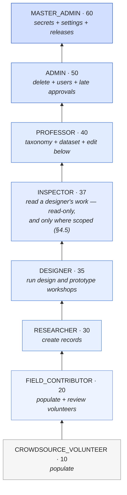
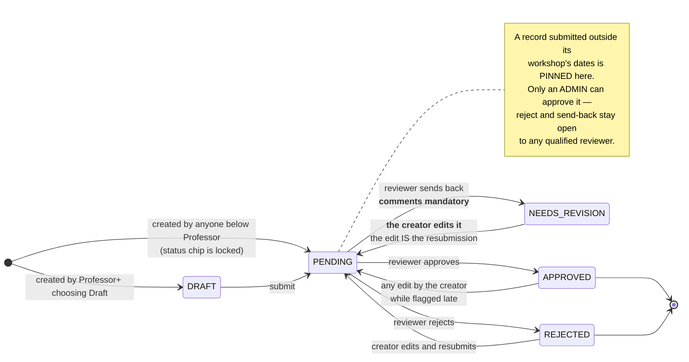
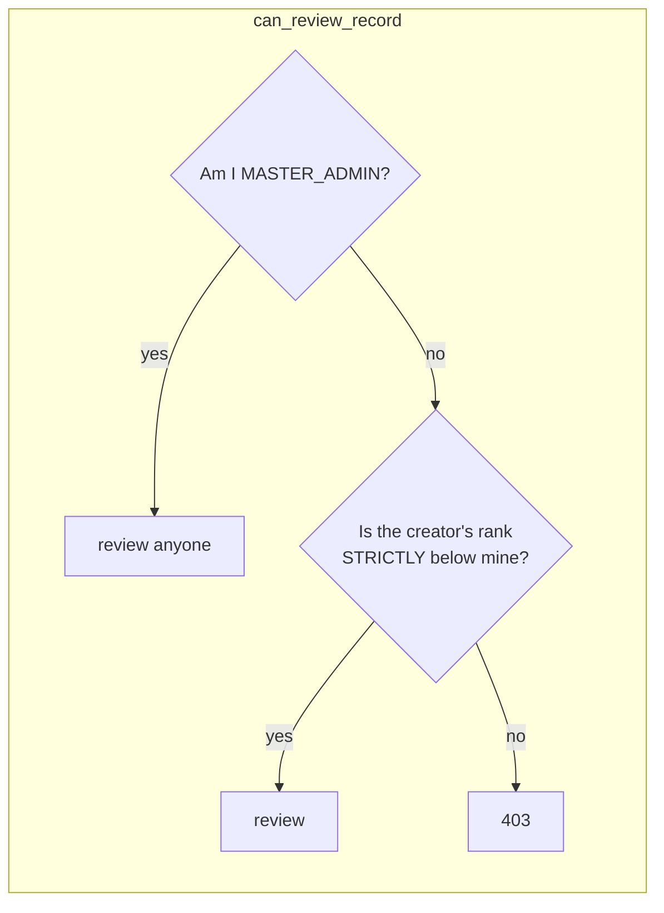
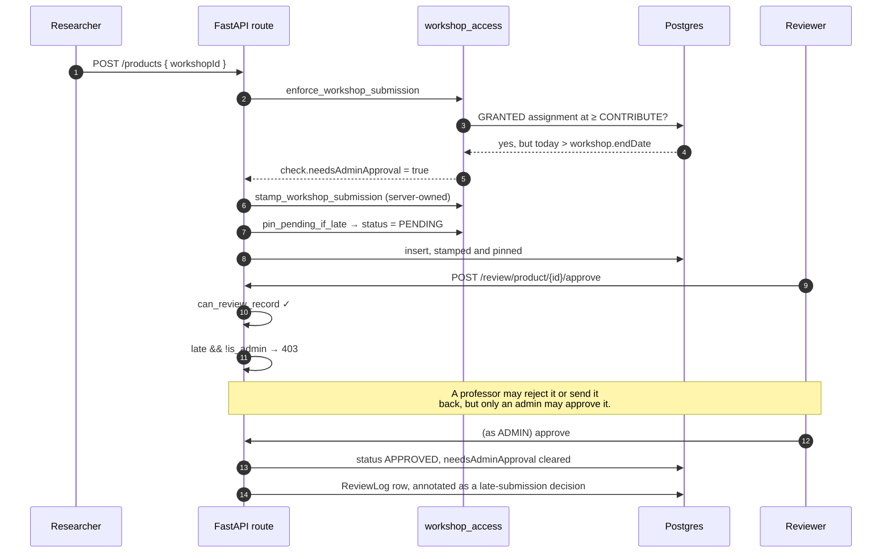

# Permissions: who may do what, and the review state machine

The complete authorisation model — the role ladder, the capability matrix, the access systems that
layer on top of it, and the exact state machine every record moves through.

**Source of truth is `backend/app/core/deps.py`.** The web client mirrors it in
`frontend/lib/permissions.ts` and the Android client in `MainActivity.kt`; both mirrors are advisory
UI, and neither is a control. Every rule below is enforced server-side, and the client copies exist
only so a user is not offered a button that will 403.

Sister documents: [SECURITY.md](SECURITY.md) for how the identity behind these checks is
established, [DATA_MODEL.md](DATA_MODEL.md) for the tables, [WALKTHROUGH.md](WALKTHROUGH.md) for what
this feels like to a researcher.

---

## 1. The ladder

Strictly ordered. Each tier inherits **everything** below it. The ranks themselves are generated into
[REPO_FACTS.md](REPO_FACTS.md).



**`DESIGNER` is 35, in the gap the original tens deliberately left**, and the reason it was inserted
rather than renumbered is that every stored role value and every `has_rank` comparison in
`deps.py` goes on meaning exactly what it meant before. A designer runs a workshop and signs the
report; a researcher documents what they find.

> **Rank is not the whole answer for a designer.** `can_run_design_workshops` is the one predicate in
> `deps.py` that is a **SET** — `DESIGNER`, `ADMIN`, `MASTER_ADMIN` — and not a threshold, so a
> **Professor cannot run a design & prototype workshop even though they outrank a designer.** A
> design workshop is a fortnight of a named designer's work ending in a document submitted to a
> ministry under their name, and being senior to a designer is not the same thing as being one.
> Admins are in the set because somebody has to be able to administer the records.
>
> A non-monotonic rule is far easier to let drift than a threshold, which is why
> `frontend/lib/permissions.ts` carries the identical set and must keep carrying it.

**`INSPECTOR` is 37, and every client labels it "Inspector / Reviewer".** Added 2026-08-27, in the
same kind of gap and for the same reason: 36-39 was free, so inserting there rather than renumbering
keeps every stored role value and every `has_rank` comparison meaning exactly what it meant before.
**37 rather than 36 or 39 because it is the MIDDLE of that free band** — it leaves a gap on both
sides, so a later tier can go between designer and inspector (36) or between inspector and professor
(38-39) with no renumbering either. It is the tier for somebody who **inspects and reviews a
designer's work without running workshops themselves** — an examiner, an external assessor, a
funder's reviewer.

**The enum value is `INSPECTOR` and deliberately not `REVIEWER`, and that is load-bearing rather than
taste.** "Review" already names a different and *relational* concept in this codebase: `canReview` is
held by everyone at Field Contributor and above and means "may review anyone ranked **strictly below
me**" (`can_review_record` in `deps.py`, `backend/app/api/routes/review.py`, `reviewEditFields`).
A role literally called `REVIEWER` would make one word mean two things one grep apart — a *rank*
and a *relation* — in the file every permission question is answered from. The **label** carries both
words so nobody has to learn the distinction to use the product; the **value** carries one so nobody
has to unlearn it to maintain the product.

> **AN INSPECTOR CANNOT RUN OR SIGN A DESIGN WORKSHOP, AND OUTRANKING A DESIGNER IS EXACTLY WHY THAT
> HAD TO BE SAID OUT LOUD.** `INSPECTOR` is **not** in `can_run_design_workshops`' set — that stays
> `{DESIGNER, ADMIN, MASTER_ADMIN}`, "the people who sign the report". So an inspector sits at 37,
> above a designer at 35, and is refused every row the blockquote above refuses a professor: it may
> not create, run, stage-write, submit or sign a workshop, may not open the design-workshop tree on
> either client, and may not download the offline speech model. **Rank 37 confers nothing whatsoever
> inside the design-workshop tree.** Everything an inspector may see there arrives through the
> read-only, per-workshop scope in §4.5 — an **assignment**, not a rank, and not a grant either:
> `DesignWorkshopInspector` carries `assignedById` rather than `grantedById`, because nothing was
> granted to anybody. An admin assigned an examiner to a piece of work.
>
> **THE TRAP THIS TIER WALKED INTO, WRITTEN DOWN BECAUSE IT COSTS NOTHING TO WALK INTO IT AGAIN.**
> An audit on 2026-08-26 established that *every* design-workshop gate in this product is **set
> membership, not a rank floor** — `_require_designer` in front of eighteen routes,
> `load_ratable_workshop_or_404` (which 404s a non-member before it looks at anything),
> `access_for` (which hands a non-member an all-false `RatingAccess`), and
> `_assert_every_id_may_be_granted` (whose 422 discards the whole PUT body). That is why a professor
> at 40 cannot open a design workshop today. Adding a rank between 35 and 40 therefore does **two**
> wrong things at once, and **no existing test fails to say so**: the new tier gets *zero* workshop
> authority — precisely a professor's position — and it *silently* gains authority over every
> designer's records, below. Both were answered on purpose rather than inherited: the first by §4.5's
> separate read-only scope, the second by the paragraph that follows. `deps.py`'s comment on rank 37
> carries the same two answers, and ends with the instruction that matters most here — *do not "fix"
> that by adding INSPECTOR to the set.*

**What rank 37 DOES buy, and it is the reason the tier is above 35 rather than below it.**
`can_review_record` admits a reviewer over any creator ranked **strictly below** them, and 35 < 37 —
so an inspector may approve, reject and send back the repository records (artisans, products, tools,
processes, interviews) created by every **designer**, as well as by every researcher, field
contributor and volunteer. **That is wanted, and it is a decision rather than an inheritance.**
`can_review_record`'s docstring says so in capitals and explains why it had to be said at all: "below
me" is a rank comparison, so inserting a tier above `DESIGNER` confers authority over every
designer's records **with no line of code naming either tier and no test going red** — the exact
shape the 2026-08-26 audit flagged before this tier existed.
`backend/tests/test_inspector_tier.py` pins both halves and the direction: an inspector **may** review
a designer's record, **may not** rewrite it (`can_edit_others_record` narrows the same comparison to
Professor and above, and 37 < 40), a professor reviews an inspector, and an inspector does not review
a peer.

Two properties of it are worth stating separately, because §4.5 is easy to over-read. It is
**repository-wide** — it covers the record types in §2's matrix, not design workshops — and it is
**not scoped by §4.5**: an inspector with no `DesignWorkshopInspector` row anywhere still holds it in
full. Anyone moving this tier's rank, or inserting another near it, is changing who may reject a
designer's fortnight of fieldwork. §2's ⁴ marks the row. Re-check with
`grep -n "def can_review_record" -A 30 backend/app/core/deps.py` (true as of 2026-08-27).

**There are two gates on top of the role, and neither is in `deps.py`.** Both run on
`POST /api/auth/login`, in this order, and both refuse with a 403 carrying a sentence rather than a
permission error:

1. **The platform allow-list** (`backend/app/services/access_roster.py` → `AccessRoster`) governs
   **every account except the master admin's**. No ACTIVE row, no sign-in — a missing row is read as
   "awaiting approval", not as an admission, so the gate fails closed. The refusals are deliberately
   distinguishable: *awaiting approval*, *not approved*, *access suspended*, and — unchanged —
   `401 Invalid email or password` for a wrong credential. **The `MASTER_ADMIN` exemption is what
   makes gating everybody safe**: it lives in the gate, not in the table, so there is always one
   account that can reach the roster and let people back in. Google sign-in is gated too; an address
   that is not admitted becomes a pending request instead of an account.
2. **The designer empanelment** (`backend/app/services/designers.py` → `roster_allows`) still gates
   `DESIGNER` accounts only, and still answers in its own words. `User.role = DESIGNER` is not by
   itself what admits a designer. Admins are deliberately not empanelment-gated — an admin
   empanelled years ago and later suspended must not lose the ability to administer anything — and
   an ACTIVE `DesignerRoster` row is accepted by the allow-list as an admission, so empanelling
   somebody remains one action rather than two.

**Four paths empanel a designer, and `POST /api/users` became the fourth on 2026-09-03.** The other
three are the designer-roster screen itself (`POST /api/designers/roster`), admitting an address on
the platform allow-list (`routes/access`), and the sign-in path (`routes/auth`, for an address the
allow-list already admits). The fourth was the gap: an admin creating an account at `DESIGNER`
produced a user with no roster row, so the person did not appear on `/admin/designers` and nothing on
the screen said why. It now empanels immediately, with `DesignerRoster.addedById` naming that admin,
and **the row appears before the person has ever signed in**. Adding them again by hand answers 409.
**It never revives a suspended empanelment** — `ensure_empanelled` only ever creates, which is the one
rule shared by all four doors and the reason a readmission cannot be smuggled through any of them.

**Barring somebody now ends their live sessions, and a role change deliberately does not (2026-09-03).**
Pressing **Suspend** (`DELETE /api/access/roster/{id}`) or **Reject** (the REJECT arm of
`POST /api/access/roster/{id}/decision`) stamps `User.sessionsValidFrom`, so every token that address
is already holding stops working on its next request — an administrator no longer has to wait out
`JWT_EXPIRES_MINUTES` before "access is cut" is true. Ending an empanelment on the designer roster
does the same, when the empanelment was actually carrying admissions.

Two exceptions, named because both fail in the direction where the administrator has been *told*
access is cut: **rows barred before 2026-09-03 were never stamped** and nothing backfills them, and a
**Gmail-alias sweep that exceeds its limit** returns no answer rather than a wrong one, logs at ERROR
naming the address, and leaves any live session running. See
[OPEN_FINDINGS.md](OPEN_FINDINGS.md).

A **role change signs nobody out** — neither the PATCH on a roster row nor `PATCH /api/users`. That is
a decision, not an omission: losing a tier is not losing access, and ending every session somebody
holds because an admin corrected their role would be a worse outcome than the correction. The identity
cache is invalidated instead, so the new role takes effect on the very next request.

Admin and above manage the allow-list (`can_manage_access_roster` → `require_access_manager`,
`/api/access/roster`); read is gated with write, because the pending queue is a list of somebody's
colleagues, applicants and former staff.

**Where an administrator actually does it, on each client, and how they are told.** There is no
email sender and no push transport anywhere in this codebase, so the notification is a COUNT on a
surface an admin already opens, with the queue one tap behind it. The number is the same on both
clients; the route to it is not, and that is deliberate rather than drift:

| | Web | Android |
|---|---|---|
| The screen | `/admin/access` (`frontend/app/(protected)/admin/access/page.tsx`) | `AccessRosterScreen` (`android/…/ui/AccessRosterScreen.kt`) |
| How it is reached | the "Who may sign in" tile on the `/admin` hub — rosters get no nav entry of their own here, the same rule the designer roster follows | the "Who may sign in" menu entry, beside "Designer roster" |
| Where the count shows | the hub tile, and a badge on the nav's "Settings hub" (`usePendingAccessCount`, one shared fetch, no timer) | a badge on that menu entry, fed by the app-wide 45-second loop that already drains the outbox — **no second poller** |
| Client permission mirror | `canManageAccessRoster` in `frontend/lib/permissions.ts`, plus a `ROUTE_GUARDS` row and an `ADMIN_CHROME_ROUTES` row | `FieldPermissions.canManageAccessRoster`, plus the entry's own `can` predicate |

**The refused person is told which refusal it was, and the clients are told in a header.** The
sentence in `detail` is for the reader; `X-Access-Status` (`PENDING` / `REJECTED` / `SUSPENDED` /
`DESIGNER_SUSPENDED` / `NOT_RECORDED`) is how the two sign-in screens choose the heading and the
"what to do next" line around it — because matching on the prose would break silently the first time
somebody rewords a sentence. A 401 carries no label at all, and an unlabelled 403 draws neutral
chrome around the server's own words rather than a guessed heading. The header must stay in
`expose_headers` on the CORS middleware (`app/main.py`) or the browser cannot read it while the
phone can.

The single most-misdocumented line in this repository, stated plainly:

> **A Field Contributor cannot create records.** `can_create_records` requires **Researcher**
> (rank 30). The two tiers below *populate* records that already exist — uploading media, answering
> questions in an open interview, commenting. That is the reason those tiers exist, and none of those
> three paths passes through the create gate.

Earlier versions of `README.md`, `SECURITY.md` and `RESEARCHER_GUIDE.md` all said Field Contributors
create records. They did not, and do not.

### 1.1 Grantable capabilities

A master admin can lift one specific power for a lower tier without promoting the account. Three of
the six columns on `User` still do that; **two are deliberately no longer read.**

| Column | Read? | Effect |
|---|---|---|
| `canReview` | **yes** | opens the review queue below Field Contributor |
| `canDownloadDataset` | **yes** | dataset download and the Data Browser below Professor |
| `canManageQuestionnaire` | **yes** | edit the questionnaire structure below Professor |
| `canViewProvenance` | **yes** (client-side) | shows created-by and per-field edit history; `isAdmin \|\| canViewProvenance` |
| `canManageCrafts` | **NO — ignored** | craft management is Professor **by rank alone** |
| `canManageWorkshops` | **NO — ignored** | workshop management is Professor **by rank alone** |

The last two were removed from the decision, not from the schema. The reasoning is in
`can_manage_crafts`' docstring and is worth repeating: a grant that lifts a researcher over the
*taxonomy itself* is the one clause that lets someone the permission matrix places underneath the
vocabulary rewrite it — and because a grant does not change the role column, nobody auditing the user
table can see who holds it. The columns stay (dropping them is neither safe nor reversible, and no
live account below Professor holds either), simply unread. Restoring the old behaviour is putting one
clause back in each function.

---

## 2. The capability matrix

Read across: ✅ allowed, ⬜ refused, and a note where the rule is conditional. This is the whole
gate list; each row names the function in `deps.py` that decides it.

| Capability | Gate | VOL 10 | FIELD 20 | RESEARCH 30 | DESIGN 35 | INSPECT 37 | PROF 40 | ADMIN 50 | MASTER 60 |
|---|---|:--:|:--:|:--:|:--:|:--:|:--:|:--:|:--:|
| Sign in, read lists and search | `get_current_user` | ✅ | ✅ | ✅ | ✅³ | ✅ | ✅ | ✅ | ✅ |
| Upload media, answer an open interview, comment | `get_current_user` | ✅ | ✅ | ✅ | ✅ | ✅ | ✅ | ✅ | ✅ |
| **Create** artisan / product / tool / process / interview | `require_record_creator` | ⬜ | ⬜ | ✅ | ✅ | ✅ | ✅ | ✅ | ✅ |
| Edit **own** record | ownership | ✅ | ✅ | ✅ | ✅ | ✅ | ✅ | ✅ | ✅ |
| Fill an **empty** field on someone else's record | `assert_can_contribute_fields` | ✅ | ✅ | ✅ | ✅ | ✅ | ✅ | ✅ | ✅ |
| Change or clear a **populated** field on someone else's record | `assert_can_contribute_fields` | ⬜ | ⬜ | ⬜ | ⬜ | ⬜ | ⬜¹ | ✅ | ✅ |
| Edit a record created by someone **ranked below** | `can_edit_others_record` | ⬜ | ⬜ | ⬜ | ⬜ | ⬜ | ✅ | ✅ | ✅ |
| Open the **review queue** | `require_reviewer` | grant | ✅ | ✅ | ✅ | ✅ | ✅ | ✅ | ✅ |
| Approve / reject / send back a **specific** record | `can_review_record` | ⬜ | vol only | below only | below only | below only⁴ | below only | below only | ✅ everyone |
| Approve a **late** (out-of-window) submission | `set_review_status` | ⬜ | ⬜ | ⬜ | ⬜ | ⬜ | ⬜ | ✅ | ✅ |
| Create or edit a **craft** | `require_craft_manager` | ⬜ | ⬜ | ⬜ | ⬜ | ⬜ | ✅ | ✅ | ✅ |
| Create or edit a **workshop** | `require_workshop_manager` | ⬜ | ⬜ | ⬜ | ⬜ | ⬜ | ✅ | ✅ | ✅ |
| Edit the **questionnaire structure** | `require_questionnaire_manager` | grant | grant | grant | grant | grant | ✅ | ✅ | ✅ |
| **Download the dataset** / Data Browser | `require_dataset_downloader` | grant | grant | grant | grant | grant | ✅ | ✅ | ✅ |
| View the **user table**, promote / demote | `require_professor` | ⬜ | ⬜ | ⬜ | ⬜ | ⬜ | ✅ | ✅ | ✅ |
| **Create** or **delete** a user account | `require_admin` | ⬜ | ⬜ | ⬜ | ⬜ | ⬜ | ⬜ | ✅ | ✅ |
| **Delete** any record | `assert_can_delete` | ⬜ | ⬜ | ⬜ | ⬜ | ⬜ | ⬜ | ✅ | ✅ |
| Delete **media you uploaded** | route-local | ✅ | ✅ | ✅ | ✅ | ✅ | ✅ | ✅ | ✅ |
| Grant / decide **workshop access** | `require_admin` | ⬜ | ⬜ | ⬜ | ⬜ | ⬜ | ⬜ | ✅ | ✅ |
| **Run a design & prototype workshop** | `can_run_design_workshops` | ⬜ | ⬜ | ⬜ | **✅** | **⬜²** | **⬜²** | ✅ | ✅ |
| **Download the offline speech model** | `can_run_design_workshops` | ⬜ | ⬜ | ⬜ | **✅** | **⬜²** | **⬜²** | ✅ | ✅ |
| Decide a design workshop's **viewers** (§4.4) | `require_admin` | ⬜ | ⬜ | ⬜ | ⬜ | ⬜ | ⬜ | ✅ | ✅ |
| Decide a design workshop's **inspectors** (§4.5) | `require_admin` | ⬜ | ⬜ | ⬜ | ⬜ | ⬜⁵ | ⬜ | ✅ | ✅ |
| Assign **tasks** to other users | `require_admin` | ⬜ | ⬜ | ⬜ | ⬜ | ⬜ | ⬜ | ✅ | ✅ |
| Rank the **transcription providers** | `require_admin` | ⬜ | ⬜ | ⬜ | ⬜ | ⬜ | ⬜ | ✅ | ✅ |
| Read / set **API key values** | `require_master_admin` | ⬜ | ⬜ | ⬜ | ⬜ | ⬜ | ⬜ | ⬜ | ✅ |
| Repository **app settings** | `require_master_admin` | ⬜ | ⬜ | ⬜ | ⬜ | ⬜ | ⬜ | ⬜ | ✅ |
| Publish an **Android OTA release** | `require_master_admin` | ⬜ | ⬜ | ⬜ | ⬜ | ⬜ | ⬜ | ⬜ | ✅ |

¹ A Professor may change a populated field on a record created by someone **ranked strictly below**
them, via `can_edit_others_record`. On a peer's or a superior's record they are refused like anyone
else. "grant" = refused by rank, allowed if the matching `can*` column is set.

² **Not a threshold.** `can_run_design_workshops` is a SET — see §1. These are the only ⬜s in the
table that a *higher* rank does not clear, and the only rows where reading down a column tells you the
wrong thing. **Two ranks now sit above `DESIGNER` and are refused here, not one** — `INSPECTOR` (37)
and `PROFESSOR` (40) — which is worth noticing because it is the shape of the rule and not a
coincidence about professors: the set is "the people who sign the report", and no number gets an
account into it. The speech-model row reuses that predicate rather than inventing one: the model is a
workshop capture aid, and a laxer gate would make the offline half of dictation reachable by accounts
the online half is not. It is entitlement only — the artifact is **not** behind the daily dictation cap
or the Tier 3 consent gate, because neither applies to a file travelling *to* the phone
(`docs/ASR-MODEL-HOSTING.md` §2.6).

³ Subject to the roster: a `DESIGNER` whose `DesignerRoster` row is inactive is refused at sign-in
itself, before any gate in this table is reached. See §1. **The marker is on the `DESIGNER` cell
only.** `roster_allows` gates designer accounts and no others, so an `INSPECTOR` needs no
`DesignerRoster` row and cannot be suspended by one — it is admitted, like every other tier, by the
platform allow-list alone.

⁴ **The one authority rank 37 confers by itself, and the only cell where an inspector's column is
wider than a designer's.** `can_review_record` is "strictly below me", so an inspector's "below" is
one tier deeper than a designer's: it reaches **`DESIGNER` as well**, over the repository record types
in this table, with no §4.5 scope and no grant of any kind involved. Everything else in the column is
inherited from below or refused. It is deliberate — it is why the tier is at 37 and not at 34 — and
`backend/tests/test_inspector_tier.py` asserts it in both directions, including that an inspector
may **not** rewrite the record it just rejected. See §1.

⁵ **The inspected does not choose the inspector, and the ⬜ in the `INSPECT` cell is the sharpest
instance of that rule.** An inspector cannot put themselves — or anybody else — on a workshop, so the
tier has no way to widen its own scope. The `DESIGN` ⬜ two columns to the left is the same rule read
from the other side: a designer who could add or remove the person examining their own workshop would
make the inspection worth nothing. `replace_inspectors` sits behind `require_admin`, and the
workshop's own creator gets no say at all — not even a “suggest an inspector” route, because a
suggestion an admin rubber-stamps is the same thing wearing a queue. §4.5 has the argument and the
route list.

Two asymmetries in that table are deliberate and easy to misread:

- **An admin cannot edit another admin's record.** `can_edit_others_record` composes
  `has_rank(PROFESSOR)` **and** `can_review_record`, and `can_review_record` requires *strictly*
  below. Rank 50 is not strictly below rank 50. Only the master admin can act on a peer's work. The
  same is true of user management: `canManageUser` refuses equals.
- **The review ladder reaches one tier further down than the edit ladder.** A Field Contributor may
  *review* a volunteer's record but may not *rewrite* it — reviewing is a judgement, editing is
  authorship, and `can_edit_others_record` narrows to Professor and above for exactly that reason.
  `INSPECTOR` is the sharpest instance of that split and the one the tier was named for: it may
  reject a designer's record and may not change a word of it, because `can_edit_others_record`
  composes `has_rank(PROFESSOR)` **and** `can_review_record`, and 37 clears only the second.
- **Read the `INSPECT 37` column against `DESIGN 35` rather than down the ladder.** They are the
  same column but for three cells: the inspector loses both `can_run_design_workshops` rows and
  gains one tier of review reach (⁴). An inspector is therefore **not** "a designer with more" — on
  the repository matrix it is a designer with *less*, plus a judgement it may pass on the designer.
  That is the tier working as intended, and it is also why counting privilege by rank number is the
  wrong instrument on this table.

### 2.1 Create, edit, delete — as a decision tree


Note the shape of the edit branch: the *contribute* path (fill an empty field) is the widest, and it
is checked **last**, after ownership and rank have both failed. That ordering is what makes an
unprivileged contribution possible without ever letting it overwrite somebody's work — and the guard
covers clearing a populated field as well as changing it, because an earlier version skipped incoming
empty values and let anyone blank a field out.

---

## 3. The review and approval state machine

Every record type except `Craft` carries a `status`. `Craft` has none — it is shared vocabulary, not
a submission.



### 3.1 Who may move a record, and how status changes actually work

There are **three** distinct mechanisms, and conflating them is how a privilege bug gets written.

| Mechanism | Function | Behaviour on refusal |
|---|---|---|
| Explicit review action | `POST /review/{type}/{id}/{approve\|reject\|revise}` | **403** — a loud, deliberate refusal |
| Status sent on an ordinary edit | `apply_status_policy_update` | **silently dropped** — see below |
| Automatic resubmission | `resubmit_status` | not a permission at all |

The middle row is the subtle one. Old clients always echo the record's current status back on every
PATCH, so treating an unauthorised status field as an error would 403 every save. Instead the field
is *popped* from the payload and the stored value is untouched. A status change on an edit sticks
only when the editor is Professor-or-above **and** is either the record's creator or outranks the
creator on the review ladder.

`resubmit_status` then does the thing researchers actually notice: when the **creator** edits a record
sitting in `NEEDS_REVISION`, and sends no explicit status, the edit itself flips it back to `PENDING`.
Other editors — an admin tidying up, a contributor filling a gap — never flip it.

### 3.2 Who may review which record



So: an admin reviews everyone beneath, a professor reviews inspectors and below, an **inspector
reviews designers and below**, a designer reviews researchers and below, a researcher reviews field
contributors and volunteers, a field contributor reviews volunteers, and a volunteer reviews nobody.
A record whose creator has no role on file is treated as a researcher's work — which, now that
`DESIGNER` sits at 35, means a designer may review it and a researcher may not.

**The inspector link in that chain is the one no line of code names**, and §2's ⁴ is the same fact
from the matrix's side. `INSPECTOR` sits at 37, "strictly below me" is arithmetic, and the arithmetic
hands it every designer's repository records at once — repository-wide and unscoped, on a tier whose
design-workshop reach is read-only and per-workshop (§4.5). **It is intended**, and
`can_review_record`'s own docstring is where that intention is recorded, precisely because the
mechanism producing it is invisible: no test would have gone red had it been an accident. Recorded
2026-08-27; `backend/tests/test_inspector_tier.py` pins it.

Opening the **queue** (`require_reviewer`) is a separate, wider check than acting on a **record**
(`can_review_record`): the queue opens for Field Contributor and above, and then shows only what that
reviewer may act on. A user granted `canReview` with nobody beneath them gets an empty queue, which
review.py handles explicitly rather than leaving as a puzzle.

### 3.3 The late-submission gate

The most intricate rule in the system, and the one worth understanding before changing anything near
it. A record created or re-pointed into a workshop **after that workshop's end date** is stamped
`extraMetadata.workshopSubmission.needsAdminApproval = true` and pinned to `PENDING`.



Four properties of that flag are load-bearing, and each closes a specific way round it:

1. **It is server-owned.** A `workshopSubmission` key arriving in the caller's `extraMetadata` is
   replaced, never trusted. Otherwise a creator could PATCH the flag away and then self-approve.
2. **It is carried forward on every update.** Provenance rebuilds `extraMetadata` from the incoming
   payload, so a stamp that was not explicitly carried would vanish on the next edit.
3. **It survives a re-link.** Re-pointing a late record at a workshop that happens to be in-window
   produces a fresh "not late" check, which would otherwise launder the flag. Being moved does not
   make late work on-time.
4. **`pin_pending_if_late` runs after the status policy**, so it *overrides* the submitter's own
   rights. A professor who documents a workshop after it ended cannot approve their own record.

Three bypasses, all deliberate: **admins** pass the whole gate (`pin_pending_if_late` is a no-op for
them); a record with **no workshop** is never late; and `Craft`, having no status column, is never
pinned.

### 3.4 Reviewer edit

A reviewer can fix a record in place instead of bouncing it back — the misspelt village, the craft
name in the wrong column. `POST /review/{type}/{id}/edit` runs under the same authority as the other
review actions, validates the payload against **the record type's own update schema** so it cannot
bypass a rule the ordinary PATCH enforces, and refuses a fixed set of keys outright:

`status` (an edit must not be a back-door approval), `extraMetadata` (holds the server-owned late
stamp), `workshopId` (moving a record between workshops has its own checks), and the relation lists
and `location` (separate writes, not column updates).

`approve: true` runs the ordinary approval immediately afterwards as a **second, separately logged**
action, so the audit trail shows the edit and the approval as two decisions and the approval still
passes the admin gate.

---

## 4. The access systems layered on top

Rank says what *kind* of thing you may do. It does not say *whose* data, or *which workshop*.

**There are five scope systems, and they are not variations on one idea** — each answers a different
question, holds its own table, and is granted by a different person:

| # | System | Scopes | Granted by | Section |
|---|---|---|---|---|
| 1 | `WorkshopAssignment` | a **workshop** (the ordinary field kind), read→write by level | an admin, or requested and decided | §4.1 |
| 2 | `DataAccessGrant` | one **account's** records at large | the record **owner**, not an admin | §4.2 |
| 3 | `DesignWorkshopViewer` | one **design workshop**, read + stage-writes | an admin only, including for the creator | §4.4 |
| 4 | `DesignWorkshopAccessRequest` | nothing on its own — it is the **asking** half of 3, a separate table with its own `DwAccessRequestStatus` and `DwAccessRequestSource` enums (`backend/prisma/schema.prisma`) | the requester raises it, an admin decides it | **not written up here** — §4.4.3 only says why the lifecycle is not on the grant table itself |
| 5 | `DesignWorkshopInspector` | one **design workshop**, **read-only**, for an `INSPECTOR` — the stage data and nothing attached to it | an admin only, and never the workshop's own people | **§4.5** |

§4.3 is not one of them: it is the audit trail that records what the five permitted. Row 4 is the one
gap in this document rather than in the product — the table is real and shipped, and no section below
describes it; that is recorded here rather than left for a reader to discover the way the five were
counted (2026-08-27; re-check with `grep -n "model DesignWorkshopAccessRequest" -A 40
backend/prisma/schema.prisma`).

A fifth system rather than a sixth column on one of the four is the decision most worth
understanding, and §4.5 gives the reasoning.


### 4.1 Workshop assignment — two-sided

`WorkshopAssignment` carries an ordered `accessLevel` (`VIEW` < `CONTRIBUTE` < `EDIT`) and a
`status` (`PENDING` / `GRANTED` / `DENIED` / `REVOKED`). A row can begin either way:

- an admin **assigns** somebody (`POST /workshops/{id}/assignments`, status `GRANTED`);
- a user **requests** access (`POST /workshops/access-requests`, status `PENDING`,
  `requestedById` set), and an admin decides it.

`DENIED` and `REVOKED` rows are kept rather than deleted, so a refusal is auditable and nobody can
quietly re-request their way around it. Only `GRANTED` confers anything.

A workshop with **no** assignment rows is *uncurated* and open to any qualified user; the first
assignment curates it, and from then on the roster is the gate. That is what
`workshop_is_curated` decides, and it is what stops adding the feature from locking everyone out of
every existing workshop.

**A 403 on the rosters now rolls back the field change that arrived in the same PATCH (2026-09-03).**
`PATCH /workshops/{id}` guards its `artisanIds` / `craftIds` rewrites with
`assert_can_contribute_relation`, and those guards need the existing link counts — the very truth the
save is about to replace — so they sit *after* the workshop row's own update. Before this date that
ordering meant an ordinary contributor who edited the title *and* tried to rewrite a populated roster
was refused, correctly, **having already had their title change committed** (and, before that, an
audit row written for it). The whole PATCH is now one transaction, so the refusal takes the row
update back with it. **The 403 itself, its detail string and the response shape are unchanged; only
the rollback is new** — and the guards were not moved, because they cannot be evaluated any earlier.
It is the same rule `processes.update_process` states out loud: a rejected request must leave no
partial state behind.

### 4.2 Cross-researcher data access — three tiers

`DataAccessGrant` is owner-to-grantee, one row per pair (`@@unique([ownerId, granteeId])`), and it is
the record **owner** who grants — not an admin.

| Tier | The grantee may |
|---|---|
| `DOWNLOAD` | see and export the owner's records |
| `COMMENT` | the above, plus leave `EntryComment`s |
| `EDIT` | the above, plus change fields — and every change writes a `RecordRevision` |

`allData: false` narrows a grant to a **subset**, listed in `DataAccessScopeItem` rows. Like workshop
access it is two-sided: `POST /data-access/requests` asks, `POST /data-access/grants` gives, and
`/grants/{id}/decide` and `/revoke` close the loop.

### 4.3 Provenance and the audit trail

`RecordRevision` stores `{field: {old, new}}` per edit, append-only, and is what makes cross-researcher
editing safe to offer at all — an admin can reconstruct the original values and see who changed each
one. It is written on the contribute path, so it captures edits made through the API. A direct
database write is invisible to it, as it is to everything else in this document.

Who may *see* provenance is `canViewProvenance`: admins always, plus anyone the master admin grants
it. The admin-view toggle can hide it from an admin browsing as an ordinary user; a grantee keeps it.

**`canViewProvenance` does not open the design-workshop divergence view**, despite the shared word.
That flag gates the record tables' edit history on View Data; `/design-workshops/:id/provenance` is
`isAdmin` and its route never consults the flag (§5). Granting it to a researcher therefore opens the
first and not the second, and a client that OR'd the flag into its own gate would offer a grantee a
screen the API refuses. The two are different questions: one is "may this account see who edited a
record", the other is "may this account read one account's workshop beside another account's records".

---

## 4.4 Design-workshop viewer grants — the fourth access system

A **design & prototype workshop** is not gated by any of the three above. It is gated by
authorship: `load_workshop_or_404` in `backend/app/services/design_workshops.py` admitted
`createdById` and admins, and nobody else.

That is the correct refusal for a stranger and the wrong one for the room a workshop is actually run
in. A real Design & Prototype Development Workshop is a fortnight of work by two designers alongside
a master craftsperson and a reviewing officer, all of whom read the same 22 stages — and stage 1
captures `designerName` as free TEXT while access was decided solely by who pressed the button. The
second designer could not open the record at all, and a designer leaving mid-season took a
fortnight's fieldwork with them, with no handover short of an admin editing the database.

`DesignWorkshopViewer` is the fix: one row per (workshop, account), written by an admin.

### 4.4.1 What a grant confers, and what it does not

| Confers | Does **not** confer |
|---|---|
| Reading the workshop, its stages, its references, its transcripts, its computed findings, its report preview — **and generating the report** | **Deleting it.** The delete route loads the workshop and *then* calls `assert_can_delete`, which is unchanged and still admin-only |
| Writing its stages — `PUT …/stages/{stageKey}` goes through the same helper | **Re-granting.** Every route in `backend/app/api/routes/design_workshop_viewers.py` is `require_admin` |
| Appearing in this account's workshop **list**, via `visible_to_clause` | Any of the six columns in §1.1, or any rank |
| Reading a questionnaire attached to that workshop — see §4.4.4 | An **unattached** questionnaire, which stays its owner's alone |
| **Recording the artisan's Tier-3 dictation consent** — `POST …/{id}/dictation-consent`, gated `_require_designer` + `load_workshop_or_404(for_edit=True)` | — |
| **Registering, accepting, unaccepting and deleting AI layers** — the five `…/{id}/ai-layers` routes, same pair of gates | Reading the **text** of a layer standing on a recording that is **not this workshop's** — one tagged to another workshop, or to none at all. Still gated per media file by `owned_or_granted_where(user, owner_field="uploadedById")`. Corrected 2026-08-27; the note below says what this cell used to claim |
| **Rewriting the workshop's custom-section definition** — `PUT …/{id}/custom-sections`, same pair of gates | — |
| **This workshop's own media** — the bytes, the `url` and the transcript of every `MediaFile` whose `linkedRecordType` is `designWorkshop` and whose `linkedRecordId` is **this** workshop, on every surface that resolves a viewer — see the note below for the two media-queue routes that resolve none, and so serve the row and not the bytes to anybody at all | That **uploader's** other files. Taking one account's data at large is a `DataAccessGrant` from that account, which a workshop grant is not and never becomes |

The two original refusals hold **because the routes that already own them were not widened**.
Widening the LOAD is what widened read and stage-writes; delete and re-granting are gated somewhere
else and were deliberately left there. That is the property to preserve when this is next touched: a
new capability gated by "can you load this workshop" silently joins the first column.

**A grant is honoured only while the holder's CURRENT role is in `deps.DESIGN_WORKSHOP_ROLES`
(2026-09-03).** Before that date the read path never re-asked, so a grantee who was demoted out of
that set kept the grant working: the row said "this account may run workshops" and the account no
longer could. **This narrows nobody's eligibility** — `design_workshop_viewers` already refused to
*issue* a grant outside that set, and the write path is unchanged. What it closes is the read path's
silence about a role that moved afterwards.

**The row is not deleted, and that is the point.** A grant records a decision an admin made about a
workshop, and a demotion is not a revocation of that decision — so the row stays and starts working
again the moment the role does. Deleting it would make a temporary demotion into a permanent loss of
access that an admin would have to notice and repair by hand. A demoted grantee gets the same 404 as
a stranger and a revoked grantee, which is the existing behaviour for anyone the load turns away.

**Inspector scope is untouched by this**, and not by exemption: an inspector has never reached
`load_workshop_or_404` at all (§4.5), so there was nothing here to narrow.

> **AND THAT SENTENCE CAME TRUE — THREE TIMES, ON 2026-08-12.** The dictation-consent, AI-layers
> and custom-sections rows were added that day, after an audit found this table describing a grant
> that had grown three capabilities nobody had recorded. (They are NAMED here rather than counted
> off the bottom of the table, which is how this sentence used to point at them and is a reference
> that rots the moment a row is appended — as one was on 2026-08-27.) Every one of them gates on
> `_require_designer` followed by
> `load_workshop_or_404(workshop_id, current_user, for_edit=True)`, and that helper admits a grantee
> as its third clause — so all three joined the first column exactly as predicted, silently, in the
> commits that built them.
>
> **TWO OF THE THREE ARE SIGNED ACTS, AND THAT IS WHY THIS MATTERS MORE THAN A DOCUMENTATION GAP.**
> `DesignWorkshop.dictationConsentById` records who decided that a named artisan's recorded voice may
> leave the device for a third-party transcription service. `DwAiLayer.acceptedById` records who put
> their name to machine-written text that a report then prints as accepted, in a document submitted to
> a ministry. A grant now delegates **both** — so an admin adding a colleague to a workshop is also
> handing them the authority to release that artisan's voice and to stand behind a model's prose,
> which is a delegation the granting admin has never been shown.
>
> **This is recorded rather than changed, deliberately.** Narrowing any of the three is a code change
> — an extra predicate beside `_require_designer` — and it would have to answer a real question first:
> a co-designer running the same fortnight in the same courtyard is exactly the person who *should* be
> able to record the artisan's answer, which is the whole reason `DesignWorkshopViewer` exists. What
> is wrong is not necessarily the gate; it is that the gate was never written down. If a later change
> does narrow one, this table and that code must move in the same commit.

> **THE SAME TABLE WAS ALSO UNDERSTATING THE GRANT IN THE OTHER COLUMN — CORRECTED 2026-08-27.**
> Those three were capabilities that had arrived unrecorded. This is the mirror image: a **refusal**
> written down here that the code had already stopped making. The AI-layers row's second cell used
> to end: *"that is gated per media file by `owned_or_granted_where(user, owner_field="uploadedById")`,
> which a workshop grant does **not** satisfy"*. The gate named is still the right one; the clause
> about the grant was false, and had been since that function grew a THIRD arm keyed on the media
> **tag** rather than on the uploader — `_design_workshop_media_branches` in
> `backend/app/services/records.py`, which admits every `MediaFile` whose `linkedRecordType` is
> `designWorkshop` and whose `linkedRecordId` is a workshop this account may open. Ever since, a
> grantee has read this workshop's transcripts, its `/export` and `/data` rows, its AI-layer text
> and its report images. That arm exists because of the refusal it removed: without it, the
> co-designer the grant is FOR was told the workshop held no recordings at all — an empty list
> reading as "nothing exists" when it meant "withheld from you", over interviews their own
> colleague had uploaded to their own workshop. `backend/tests/test_media_entitlement.py` pins both
> directions of it, in `test_a_granted_co_designer_is_shown_the_workshops_own_recordings` and
> `test_a_designer_with_no_grant_is_still_refused_the_same_recording`.
>
> **WHO MAY HOLD THE STRING IS ONE QUESTION; HOW LONG THE STRING STAYS GOOD IS ANOTHER, ADDED
> 2026-09-03.** Everything above decides *whether* an account is served a `url` at all, and none of it
> changed. What it has never said is that the string is permanent — and with `MEDIA_PRESIGNED_READS`
> on, it is not: a served `url` is signed and expires in fifteen minutes
> (`MEDIA_PRESIGNED_READ_TTL_SECONDS`). **Do not read the entitlement rule as a statement that a URL
> once handed out keeps working.** Today the flag ships `false` and the URL is permanent, which is
> exactly the exposure [SECURITY.md](SECURITY.md)'s risk P0 is about; its operator runbook is the
> sequence that changes it. The entitlement test is unaffected either way — an unentitled account is
> served no `url`, signed or otherwise.
>
> **THE ONE SURFACE THAT DISAGREED WAS `GET /media`, AND IT WAS BROUGHT INTO LINE ON THE SAME DATE.**
> Its `url` gate keyed on uploader identity alone, so the API withheld the download link for a
> photograph the same account could obtain by generating the report — a refusal that protected
> nothing and taught a reader that these two answers were meant to differ. `media_url_scope` in
> `backend/app/services/records.py` now returns the uploader set **and** the set of workshops this
> account may open, and the redaction widens the **test** rather than the uploader set: no
> co-designer is added to anybody's uploader scope, so nothing moves on a surface with no workshop
> in it.
>
> **"ON EVERY SURFACE THAT RESOLVES A VIEWER" IS THE EXACT PHRASE IN THAT ROW, AND THE QUALIFIER
> WENT IN ON 2026-08-27** — the row first said *"on every surface that serves them"*, and two routes
> make the wider claim false. They are the media-processing queue rather than anything a designer
> opens: `list_media_processing_jobs` (`GET /media/jobs`) and `retry_media_processing_job`
> (`POST /media/jobs/{id}/retry`) in `backend/app/api/routes/media.py` both `include` the job's
> `mediaFile` and then call `public_encode` with **no viewer at all**. No viewer means no uploader
> set and no workshop set to test against, so `records._redact_sensitive` drops every takeable key
> — `url`, `publicUrl`, `objectKey` and both transcript columns — off the nested file: from a
> grantee, yes, but equally from the account that uploaded it and from a master admin. A
> transcription job on a design-workshop recording serves the row and not the bytes, to everybody.
>
> **That is fail-closed and PRE-EXISTING**, unchanged by the 2026-08-27 widening, and it is recorded
> rather than fixed: both clients are already typed to the absence (`MediaProcessingJob.mediaFile`
> in `frontend/lib/media.ts` is a `Pick<>` with no `url`), and the bytes have their own surfaces in
> `GET /media` and `GET /media/{id}`. It is recorded HERE because a reader checking this table
> against the media-jobs panel would otherwise find the row wrong, with no way to tell a deliberate
> refusal from a bug — which is the same failure this whole §4.4.1 note exists to end, pointing the
> other way. `public_encode(interview.media or [])` in `backend/app/api/routes/artisans.py` has the
> same shape; questionnaire-interview media cannot carry the workshop tag, so nothing is wrongly
> refused there. Re-check by reading the `public_encode(` calls in
> `backend/app/api/routes/media.py` and asking which of them name a viewer (true as of 2026-08-27).
>
> **WHAT A GRANT STILL DOES NOT CONFER, STATED PRECISELY, BECAUSE THE IMPRECISE VERSION IS WHAT
> ROTTED.** It confers **this workshop's tagged files and nothing else**. A file tagged to a
> different workshop, or to no workshop, is still refused — including one named on *this* workshop's
> own stage, because a stage field stores a media id and nothing obliges that id to be this
> workshop's. And the uploader-identity route is untouched: a `DataAccessGrant` from an uploader
> remains the only way to take that uploader's data at large, and no part of this change widened
> who holds one.

`load_workshop_or_404` checks the grant **last**, only after `createdById` and `is_admin` have both
failed, so the ordinary read — a designer opening their own workshop — costs exactly what it did
before. It is a primary-key lookup, not a scan: `@@id([designWorkshopId, userId])` *is* that
question, which is why the join table has no synthetic id.

**The refusal is still 404 with the same detail string.** Widening who may enter must not change
what a stranger is told; a 403 here would confirm the id exists to exactly the people the clause
turns away.

### 4.4.2 Administration is admin-only, including for the creator

This is the rule most likely to be argued with. Letting the owner choose their own readers sounds
reasonable right up to the moment the owner leaves — their workshop's access then freezes in
whatever state they left it, which is the handover problem the table exists to solve, reintroduced
one level up. An admin's grant has an administrator behind it who is still here.

### 4.4.3 What was borrowed from `WorkshopAssignment`, and what deliberately was not

The shape is the same on purpose: one row per (record, user), admin-only administration, and a
whole-set `PUT` that replaces the roster so that removing somebody is sending the list without them.

The request/approve **lifecycle** is not borrowed. There is no `status`, no `requestedById`, no
`decidedAt`. That vocabulary exists on the sibling table (§4.1) because a researcher may *ask* for a
workshop and be refused, and `DENIED`/`REVOKED` rows are kept so a refusal cannot be quietly
re-requested around. A `DesignWorkshopViewer` row is a **grant and nothing else** — it is only ever
written by an admin, so four of those five lifecycle columns would sit permanently at `GRANTED`.

> **This paragraph used to say "Nothing asks for a design workshop", and that is no longer true.**
> `DesignWorkshopAccessRequest` is the queue it said did not exist: a designer who scanned a
> workshop's card asks through `POST /api/design-workshop-access/requests`, and an admin answers at
> `POST /api/design-workshop-access/requests/{id}/decide`. The sentence is corrected rather than
> deleted because **the division it argues still holds, and is exactly why the queue is a second
> table**: an ask and its refusal are auditable history and are kept for ever, a grant is current
> fact and is deleted when it ends (the next paragraph). Granting a request writes a row *here*,
> through `services/design_workshop_viewers.replace_viewers`, so there is still exactly one way to
> be a viewer and `load_workshop_or_404` still asks `has_viewer_grant` and only that.

Removing a viewer therefore **deletes** the row rather than revoking it, which is the one place this
departs from §4.1's "nothing is ever deleted". A grant here carries no decision to audit: it never
refused anybody and was never asked for, so a tombstone would record only that an admin changed
their mind about a colleague.

Four more properties worth knowing before changing anything near it:

1. **Eligibility is a SET, not a rank.** `DESIGN_WORKSHOP_ROLES` is Designer / Admin / Master Admin —
   **a Professor cannot run a design workshop despite outranking a designer.** This is the one
   capability in `deps.py` that is not a rank threshold, and it is why `/design-workshops/eligible-viewers`
   exists as a server endpoint rather than as a client-side filter over the user directory: the two
   would drift, and the drift shows up as an admin granting access that the next sign-in refuses.
2. **A suspended designer is the trap.** A `DESIGNER` whose `DesignerRoster` row is missing or
   inactive cannot sign in at all (`services/designers.roster_allows`). Such accounts are excluded
   from the picker **and refused by the write**, because a picker is a suggestion and the write is
   the rule. Admins are not roster-gated, deliberately: an admin empanelled years ago and later
   suspended must not lose the ability to administer anything.
3. **Validation runs to completion before any write.** One bad id refuses the whole `PUT` with a 422
   naming the account, never a silent skip. An admin who ticked four designers and is shown three
   has been told nothing about which one failed or why, and a partially applied access change looks
   like it worked.
4. **The creator is a no-op, not an error.** They are dropped from the incoming list *before*
   validation, because their access comes from `createdById` and a row for them would be a second
   source of truth for access they already hold. A screen that renders the creator alongside the
   viewers and posts the lot back is the obvious client to write, so this has to be harmless rather
   than merely documented. It also means **an empty viewer list does not mean "nobody can see this"**,
   and any UI over it must say so.

The `PUT` is idempotent: only the difference is written, so re-saving an unchanged screen touches no
rows and does not restamp `createdAt` — which matters, because `grantedAt` is the only answer anybody
has to "how long has this person been on this workshop".

### 4.4.4 The questionnaire visibility that follows

A grant admits a co-designer to the workshop and to writing its stages. A questionnaire, however, is
scoped on `Questionnaire.ownerId` alone — so the co-designer opened the workshop, read stage 7
telling them a survey instrument exists, and found an empty questionnaire list. The two halves of one
piece of fieldwork disagreed about who was working on it, and the colleague's reasonable conclusion
was that the form had never been uploaded.

`_works_on_this_questionnaires_workshop` in `backend/app/api/routes/questionnaire_forms.py` closes
it: a questionnaire attached to a design workshop the caller may see is visible to them, and so are
its **sittings** and its `.xlsx` export.

**The sittings come with it deliberately.** A sitting carries a respondent's name and answers — but
so does stage 8's `surveyResponse` collection, which a granted co-designer can already read *and
edit* through the stage form. Withholding the questionnaire's copy of the same interview while
showing the stage's copy protects nothing and only makes the questionnaire look empty. The same
argument covers the workbook: `export_payload` is losslessly every sitting, and letting somebody read
the answers on the page while refusing the download of those answers is a distinction the data cannot
support and one they would route around by copying the page. **The grant is the decision; this
follows it.**

Three boundaries are held:

| Boundary | Rule |
|---|---|
| An **unattached** questionnaire (`designWorkshopId` is null) | Stays the owner's alone. The grant reaches the workshop's fieldwork, not the whole of a colleague's filing cabinet |
| `mineOnly=true` on the list | Still means MINE — the ones this designer uploaded. It asks about authorship, not about what may be read |
| An **ungranted** designer | Sees neither the row, nor the sittings, nor the workbook. The FORM itself stays readable by any designer, which is unchanged policy — a colleague handed a form has to be able to fill it in |

One asymmetry to be aware of: `GET /questionnaires/options`, the attach-to-a-workshop dropdown, is
still scoped on `ownerId` for a non-admin and is **not** widened by a grant. So a co-designer can
read and answer a colleague's attached questionnaire but will not find it offered in that dropdown.
Whether that is right is a product question — the dropdown is about *attaching* a form, which is
closer to authorship — but it is a real difference from the list beside it and is not stated anywhere
in the code.

`_visible_questionnaire_where` returns a fragment for `where["AND"]` and is never assigned to
`where["OR"]`. The list endpoint already spends `OR` on its search box, so writing this as a
top-level `OR` would silently replace the search and widen the result set — the identical trap the
design-workshop list hit when grants were added there, which is why `visible_to_clause` carries the
same warning in its own docstring.

---

## 4.5 The inspector scope — the fifth access system, and the only read-only one

`INSPECTOR` (rank 37, §1) reaches a design workshop **through a row in `DesignWorkshopInspector` and
never through its rank**. The sentence is meant literally: an inspector with no row sees exactly what
rank 37 buys in the design-workshop tree, which is nothing at all.

`backend/app/services/design_workshop_inspectors.py` is the whole system. Its predicates are
`has_inspection_scope`, `inspectable_by_clause` and `load_inspectable_workshop_or_404`, and those
names are deliberately **not** the viewer module's `has_viewer_grant` / `visible_to_clause` — the
module's own header explains that an autocompleted `visible_to_clause` import inside
`records._design_workshop_media_ids` would hand an inspector the artisan's recorded voice.

**READ-ONLY IS STRUCTURAL, NOT A FLAG.** The obvious build — a `DesignWorkshopViewer` row, or a
`level` column on one — was designed and rejected, and the reason is the one §4.4.1 has been
recording all along. `load_workshop_or_404(…, for_edit=True)` carries no *inspector* predicate: the
creator, an admin, or a viewer grantee passes — and since 2026-09-03 a grant is honoured only for an
account whose role is still in the design-workshop set, so a demoted or suspended grantee is turned
away (F1's closure; the helper's own docstring carries the argument). That single helper is what
**fourteen**
write routes pair with `_require_designer` — nine in their own handlers plus the five AI-verb routes
that inherit the pair from `_verb_gate`. (It said *eighteen*, which is the count of every route
`_require_designer` guards, two of them GET allowance probes that write nothing and never reach this
loader; `app/services/design_workshop_inspectors.py` names the fourteen.) A predicate added to it
is a write grant whatever it is named. So the inspector predicate is never added to it. `load_inspectable_workshop_or_404` is a separate
loader that **has no `for_edit` parameter**, and the module refuses to grow one. There is no code
path on which an inspection row and a write meet, so there is no check anybody can forget.

**What a `DesignWorkshopInspector` row does and does not carry, against §4.4.1's grant.** The
right-hand column is narrower than a reader expects, and the narrowness is the design:

| §4.4.1 capability | `DesignWorkshopViewer` | `DesignWorkshopInspector` |
|---|:--:|:--:|
| Reading the workshop and its stage data | ✅ | ✅ **read-only, through its own loader** |
| Appearing in a workshop **list** | ✅ `visible_to_clause` | ✅ `inspectable_by_clause` — a separate clause |
| **Stage writes** — any of the 22 stages | ✅ | ⬜ |
| **Generating the report** | ✅ | ⬜ — `POST …/report` stands behind `load_workshop_or_404`, which an inspector fails |
| **Recording dictation consent** | ✅ | ⬜ |
| **AI layers** — register, accept, unaccept, delete; all five verbs | ✅ | ⬜ |
| **Rewriting the custom-section definition** | ✅ | ⬜ |
| **This workshop's media** — recordings, photographs, transcripts | ✅ | ⬜ — see below |
| **Questionnaire responses** | ✅ (§4.4.4) | ⬜ — `_visible_questionnaire_where` writes `viewers: {some: {userId}}` by hand |
| Deleting the workshop, or re-granting it to anyone | ⬜ | ⬜ |

**The media row is the one to read twice.** The "recordings of a workshop I may open" arm of
`records._design_workshop_media_branches` is keyed on `DesignWorkshopViewer` and `createdById`
through the viewer module's `visible_to_clause` (§4.4.1 records why that arm exists). An inspector
holds neither, and `owned_or_granted_where` gives them nothing either — its free pass starts at
`has_rank(user, "PROFESSOR")`, rank 40, above this tier. **Whether an inspector should see a
workshop's photographs is an owner's decision that has not been made**, and it is unmade on purpose
rather than by accident: it is a product question, and the structure was built so that answering it
has to be a deliberate edit.

**ADMIN ONLY, and the reason is stronger than §4.4.2's.** That section's argument is handover — an
owner who picks their own readers freezes access the day they leave. Here the argument is the point
of the tier: **the inspected must not choose the inspector.** If a designer could add or remove the
person examining their own workshop, the inspection is worth nothing. So `replace_inspectors` is
reached only through `require_admin`, the workshop's creator gets no say at all — not even a "suggest
an inspector" route — and `_assert_every_id_may_inspect` refuses **by name** any account that is on
the workshop, creator or viewer. `INSPECTION_ROLES` and `DESIGN_WORKSHOP_ROLES` are disjoint today
(checked at import time), which makes that nearly unreachable — but "nearly" is doing real work: a
designer holding a viewer row who is later **promoted** to inspector would otherwise become eligible
to inspect the very workshop they worked on, and nothing else in the codebase would notice.

**`INSPECTION_ROLES` is a frozenset of one — `{"INSPECTOR"}` — and both exclusions are decisions.**
Admins are out because an admin already reads every workshop by a shorter route, so an inspection row
would be a second and strictly weaker source of the same access — the "two places to look when
somebody has access they should not" that `services/design_workshop_access` refuses in its header.
Professors are out because a professor cannot open a design workshop today, and a door through this
table would be a new product decision wearing an implementation detail. A rank *floor* here would
have quietly included both.

**It does NOT join `deps.DESIGN_WORKSHOP_ROLES`.** That frozenset stays
`{"DESIGNER", "ADMIN", "MASTER_ADMIN"}` — "the people who sign the report" — and `deps.py`'s own
comment on rank 37 says in as many words: *do not "fix" that by adding INSPECTOR to the set.* Adding
it would hand the tier eighteen `_require_designer` routes at once, sixteen of them writes and the
other two GET allowance probes.
**If a future change puts `INSPECTOR` in that set, this section is void and §1's blockquote with it.**

**The refusal is 404 and not 403**, matching every other loader in this family, and a soft-deleted
workshop is a 404 here with no 409 arm — the sibling's 409 tells an editor holding unsent stages to
ask for a restore, and an inspector has nothing pending and no restore button.

> **STATUS, DATED 2026-08-27: THE WHOLE SERVER SIDE IS IN; NO CLIENT REACHES IT YET.** The model
> (`DesignWorkshopInspector` in `backend/prisma/schema.prisma`), the migration
> (`20260827130000_dw_inspector_scope`), the service, `DesignWorkshopInspectorsIn` in
> `backend/app/schemas/design_workshop_inspections.py`, the router
> (`backend/app/api/routes/design_workshop_inspections.py`, mounted on its own prefix
> `/api/design-workshop-inspections` from `backend/app/api/router.py`) and **both** test modules —
> `backend/tests/test_dw_inspector_scope_gate.py` and `backend/tests/test_dw_inspector_scope.py` —
> are all in the tree.
>
> **THE TWO TEST MODULES DIVIDE ALONG WHAT NEEDS A DATABASE, AND THE SPLIT IS DELIBERATE.** The
> `_gate` module replaces `db` with a tripwire and asserts what is true of the SOURCE — which doors
> exist, that every inspector-reachable route is a `GET`, that the read-only loader has no
> `for_edit` parameter — so it runs in CI, where there is no Postgres. The other asserts what is
> only true of a DATABASE: the zero state, and the three write doors (`DELETE /{id}`,
> `POST /{id}/report`, `POST /{id}/exports`) that call `load_workshop_or_404` *before* they gate and
> therefore cannot be refused from the request alone. It skips itself off a local `DATABASE_URL`,
> and skips again until `INSPECTOR` has reached `deps.ROLE_RANK`.
>
> **The prefix carries five routes, and the shape of that list IS the read-only claim above restated
> as something a reader can count** — true as of 2026-08-27; re-check with
> `grep -n "@router" backend/app/api/routes/design_workshop_inspections.py`. Behind `require_admin`,
> the assignment screen: `GET /eligible-inspectors`, `GET /{workshop_id}/inspectors`,
> `PUT /{workshop_id}/inspectors`. Behind `require_inspector` — the `INSPECTOR` tier and **nobody
> else, admins included**, because an admin scoped by their own inspection rows would read an empty
> list as a broken feature, and an admin scoped by "everything" would turn this prefix into a second
> full read of every workshop in the repository — the inspector's own surface: `GET ""` and
> `GET /{workshop_id}`. There is no `POST`, no `PATCH`, no `DELETE` and no `for_edit` anywhere on
> the prefix. The single-workshop read says `readOnly: true` **on the wire** rather than leaving a
> client to infer it from the URL, and it omits `transcripts` altogether — the media row above is
> the reason, and the sharper half of that reason is that asking for them would put this route on
> the media path at all, where the next person widening that predicate would widen this surface
> without noticing.
>
> **THIS PARAGRAPH SAID THE OPPOSITE EARLIER ON THE SAME DAY, AND THAT IS THE ARGUMENT FOR DATING
> IT.** It read *"THE TABLE AND THE SERVICE ARE IN, THE ROUTES ARE NOT"* — true when written, and
> deliberate: the gate was built before the door, so the scope was enforceable and unreachable. The
> routes and the gate test arrived hours later in the same wave, on 2026-08-27. Undated, that note
> would have gone on telling readers a shipped surface did not exist, which is the failure mode the
> "kept true" table at the foot of this document exists to catch.
>
> **What is still absent, stated narrowly so the correction above is not read as more than it is.**
> This paragraph read: *"**No client calls this prefix** — `grep -rl "design-workshop-inspections"
> frontend/ android/` finds nothing as of 2026-08-27 — so neither half has a screen yet: an admin
> assigns an inspection through the API or not at all, and an inspector has nothing to open."* True
> when written and **half true by the end of the same day**, which is why the sentence is kept and
> dated rather than deleted: it is the third correction in this section and the shape of all three is
> the same — a note describing the tree at the hour it was typed, read later as a description of the
> product.
>
> **THE WEB CLIENT NOW CALLS ALL FIVE ROUTES** (2026-08-27). Both halves have a screen:
> `frontend/components/settings/DesignWorkshopInspectorsPanel.tsx`, mounted on
> `/workshop-access/manage` beside the viewers panel, is where an admin assigns an inspection; and
> `/design-workshop-inspections` — a list — plus `/design-workshop-inspections/[id]` — one workshop,
> every stage, read-only, with the per-field authorship this read resolves names for — is what an
> inspector opens. The typed client is `frontend/lib/designWorkshopInspections.ts` and the client
> mirror of the door is `canInspectDesignWorkshops`, with the §5 row above it.
>
> **AND THE HANDSET NOW CALLS ALL FIVE TOO** (2026-08-27, hours after the sentence above it). This
> paragraph read: *"**THE HANDSET DOES NOT** — `grep -rl "design-workshop-inspections" android/`
> still finds nothing — so an inspector on a phone has nothing to open, and this is now a client GAP
> rather than a feature gap."* True when written; superseded the same day, and kept because it is
> now the FOURTH worked example in this section of a note describing the tree at the hour it was
> typed and read later as a description of the product.
>
> The handset's typed client is `android/…/data/DesignWorkshopInspections.kt` (the DTOs, the picker,
> the pending set, the failure sentences and the value reader), its Retrofit bindings are the five
> declarations under the `design-workshop-inspections` prefix in `data/WorkshopRepositoryApi.kt`, and
> the three screens are `ui/designworkshop/WorkshopInspectorsScreen.kt` (the admin's appointment
> screen, reached from a workshop's own stage index rather than from a hub), plus
> `InspectionListScreen.kt` and `InspectionDetailScreen.kt` behind
> `NavDestination.DESIGN_WORKSHOP_INSPECTIONS`. The client mirror of the door is
> `FieldPermissions.canInspectDesignWorkshops`, delegating to `data.canInspectDesignWorkshops`, and
> `android/…/test/ui/designworkshop/InspectionGateTest.kt` walks all eight tiers over both doors —
> it is registered in `backend/tests/test_role_ladder_parity.py`, as its web twin now is.
>
> **THE ONE PLACE THE TWO CLIENTS DIFFER, AND IT IS DELIBERATE.** The web mounts the appointment
> panel on `/workshop-access/manage`, so an admin there begins by choosing a workshop out of a
> hundred behind a search box. The handset hangs the same screen off the workshop's own stage index —
> the workshop is already in hand, so the picker that would have chosen it is a dropdown of a hundred
> titles on the one screen where picking the wrong row misassigns an examination. It is the same
> divergence, for the same reason, that `WorkshopViewersScreen` records for the viewer roster.
>
> **NEITHER CLIENT CACHES AN INSPECTION** — a deliberate decision on the handset, where everything
> else in the design-workshop block degrades to the device. The scope is a row an admin can withdraw,
> the provenance names are resolved server-side at read time, and there is no write route to queue
> anything into: `saveOrQueue` does not queue a 4xx, so a queued inspector write would be accepted by
> the app, refused for ever by the server, and reported to the inspector as saved. The repository
> methods throw and the screens say "this needs a connection" before anything is attempted.
>
> Re-check both halves with `grep -rl "design-workshop-inspections" frontend/ android/`.
>
> **CORRECTED THE SAME DAY, AND THE SUPERSEDED SENTENCE IS KEPT BECAUSE IT IS THE WORKED EXAMPLE.**
> This paragraph read: *"the list handler cites a `tests/test_dw_inspector_scope.py` (no `_gate`) for
> the empty-list case; only the `_gate` file is in the tree, so 'an inspector with no row sees an
> empty page' is the one property in this section still resting on structure rather than on an
> assertion."* That was true when written and is no longer: the module was written later on
> 2026-08-27 and `test_an_inspector_with_no_scope_row_sees_an_empty_list` asserts the empty list
> against a database that is deliberately **not** empty — a workshop under inspection by somebody
> else exists while it runs, so an empty answer cannot be an empty fixture. Its sibling
> `test_an_inspector_with_no_scope_row_cannot_open_a_workshop` asserts the 404, because a scope
> honoured by the list but not the detail route (or the reverse) tells its holder simultaneously
> that a workshop exists and that it does not. Re-check with `ls backend/tests/ | grep inspector`.

---

## 5. Route guards on the web client

The client's half of gating is declared **once**, in `ROUTE_GUARDS` in `frontend/lib/permissions.ts`,
and enforced by `AppShell` for the entire `(protected)` tree. A hidden nav entry is not a guard —
every one of these routes is reachable by typing the URL.

**All nineteen rules, in the order they are declared, as seventeen rows.** Every one of them,
deliberately — see the note under the table about why a partial list here is worse than no list at
all.

The two numbers differ for one reason and it is worth stating rather than leaving a reader to wonder
whether something is missing: `/artisans/new`, `/products/new` and `/tools/new` are three separate
`ROUTE_GUARDS` entries with identical gates, and they share the last row. Nothing else is collapsed.
This sentence said "all fourteen rules" for as long as there were sixteen — it was counting rows and
calling them rules — which is a small error to make in the one section of this document whose entire
argument is that an incomplete list here is worse than no list at all. If you add a rule, the count
to update is the number of `path:` values; `docs/tools/check-docs.mjs` reports it on every run.

| Route | Client gate | Backend dependency it mirrors |
|---|---|---|
| `/users` | `canManageUsers` | `require_professor` |
| `/admin` | `isAdmin` | `require_admin` |
| `/admin/analytics` | `isAdmin` — a **designer is refused**, because this aggregates clusters and workshops beyond their own | `require_admin` |
| `/admin/designers` | `canManageDesignerRoster` | `require_designer_roster_manager` |
| `/admin/access` | `canManageAccessRoster` — **admin and above**, deliberately not master-admin-only: the master-admin exemption in the sign-in gate is the break-glass, and a queue only one account can clear would make that exemption a single point of failure | `require_access_manager` |
| `/design-workshops/:id/provenance` | `isAdmin` — the per-field authorship on each stage stays open to every designer on the workshop; this is the CANONICAL COMPARISON, which crosses into the shared record tables and reports one account's data beside another's | `require_admin` (`GET /design-workshops/{id}/provenance`) |
| `/settings/api-keys` | `isAdmin` (key **values** are master-admin inside the page) | `require_admin` / `require_master_admin` |
| `/settings/tasks` | `canAssignTasks` | `require_admin` |
| `/settings/usage` | `isAdmin` | `require_usage_reader` (`GET /usage/routes`, `GET /usage/timeline`, `GET /usage/latency`, `GET /usage/clients`, `GET /usage/screens`, `GET /usage/collection`). **`GET /usage/accounts/{user_id}/trail` is NOT on this gate** — one named person's request-by-request trail is `require_person_usage_reader`, which is MASTER ADMIN and is additionally refused unless that account's own usage consent is `GRANTED`. See `deps.can_read_person_usage` for the argument and `docs/DECISION-usage-consent-at-sign-in.md` for the flow. A person's own usage (`GET /usage/me`, `GET /usage/me/trail`) and their own consent (`GET /usage/consent*`) need no permission at all, and `GET /usage/consent/notice` is ungated because somebody deciding whether to agree has not agreed yet |
| `/review` | `canReview` | `require_reviewer` |
| `/data` | `canDownloadDataset` | `require_dataset_downloader` |
| `/design-review` | `canRunDesignWorkshops` — the same **set**, so a **professor is refused**. A sibling of the workshop tree and not a child, because the pool round reaches ACROSS workshops: a designer ranks work from rounds they were never added to. No prefix rule covered it, so until this row existed the URL was open to every signed-in account | `can_run_design_workshops` (`load_ratable_workshop_or_404`) |
| `/sketches-and-prototypes` | `canRunDesignWorkshops` — the same **set**, so a **professor is refused**. A sibling of the workshop tree and not a child because the page is CHOSEN-WORKSHOP-FIRST: the designer arrives from the menu with nothing chosen and picks the workshop on the page, so there is no id to nest the path under. Nothing covered it — `routeMatches` compares whole segments — so until this row existed the URL was open to every signed-in account | `can_run_design_workshops` (`load_workshop_or_404` once a workshop is chosen; the picker's own list is `get_current_user` filtered by `visible_to_clause`) |
| `/design-workshop-inspections` | `canInspectDesignWorkshops` — a **set with ONE member**, so an **ADMIN is refused** as well as a professor and a designer. A sibling of the workshop tree and not a child, mirroring the API's own separate prefix: every caller of every route on it is somebody `load_workshop_or_404` turns away, and a shared prefix invites widening that loader, which grants stage WRITES | `assert_inspection_surface` (`INSPECTION_ROLES` in `services/design_workshop_inspectors.py`) |
| `/design-workshops` | `canRunDesignWorkshops` — a **set**, not a rank threshold: Designer, Admin, Master Admin, so a **professor is refused** | `can_run_design_workshops` |
| `/questionnaires` (**plural** — see below) | `canRunDesignWorkshops` — the same set, so a **professor is refused** | `can_run_design_workshops` (`_require_designer`) |
| `/designers/profile` | `canRunDesignWorkshops` | `require_designer` |
| `/artisans/new`, `/products/new`, `/tools/new` | `canCreateRecords` | `require_record_creator` |

**Every row above that says "a professor is refused" refuses an `INSPECTOR` too.** The five
design-workshop-family rules gate on `canRunDesignWorkshops`, which is the SET and not the rank — so
rank 37 clears none of them, and no rule had to be tightened to keep an inspector out. Two rows move
for a different reason and both move the same way: the user table is `canManageUsers`
(`require_professor`, rank 40), so an inspector at 37 is refused it, and the review queue is
`canReview` (`require_reviewer`, Field Contributor and above), so an inspector opens it — and then
sees a designer's records in it, which is §2's ⁴ arriving on a screen.

**WHAT DID CHANGE IS THE ROW ABOVE, AND THIS PARAGRAPH SAID THE OPPOSITE UNTIL THE WEB CLIENT GREW A
SCREEN.** It read "the inspector's read-only workshop scope (§4.5) is per-workshop and is therefore
**not** a route guard at all", which was true only for as long as no client called the scope: with
nothing at a URL there was nothing for a rule to refuse. `/design-workshop-inspections` is now a page,
so the URL exists and the rule is owed — the same debt `/design-workshops`, `/design-review` and
`/sketches-and-prototypes` each shipped without. **The per-workshop half of §4.5 is still not a route
guard and cannot become one**: WHICH workshops an inspector may read is decided by
`load_inspectable_workshop_or_404` on each request, the way §4.4's grant is. The rule above answers
only whether the account may reach the surface at all.

Note that this is the first row in the table whose refusal is **not** monotonic in rank — an admin is
refused a page a rank-37 account may open. Nothing else here behaves that way, and `§2`'s ladder will
give the wrong answer for it every time; the reasoning is at `canInspectDesignWorkshops` and in
`assert_inspection_surface`, and `frontend/e2e/design-workshop-inspections-unit.spec.ts` pins it.
True as of 2026-08-27; re-check by grepping `canRunDesignWorkshops`, `canInspectDesignWorkshops` and
`canReview` in `frontend/lib/permissions.ts`.

`/questionnaires` is the plural, and the plural is the whole point: `/questionnaire` (singular) is the
one global artisan questionnaire, it is open to every signed-in user, and `routeMatches` compares
whole segments so this rule cannot reach it. A future rule written with the singular would lock every
researcher out of taking an interview.

`/sketches-and-prototypes` has a twin that is NOT in this table and does not belong in it. The same
screen also exists inside a workshop, at /design-workshops/[id]/sketches-and-prototypes, reached from
that workshop's hub; one extracted component renders both pages, so they cannot drift in what they
show. The twin needs no row because the `/design-workshops` prefix already covers it, and the
top-level path needs one because a prefix that matches whole segments cannot reach it. That is the
whole asymmetry: two URLs, one component, one guarded by inheritance and one only by its own row.

The twin's path is spelled WITHOUT BACKTICKS in the paragraph above, which is the only place in this
file it appears at all — the `/sketches-and-prototypes` row does not name it — and that is not an
oversight. `docs/tools/check-docs.mjs` harvests every backticked path from the whole of a table ROW,
not just its first cell, and then demands a `ROUTE_GUARDS` rule for each one, so backticking a route
that deliberately has no rule of its own turns this section red. Worse, `[` and `]` fall outside the
character class it captures with, so the failure would name `/design-workshops/` and send the next
reader hunting for a rule that is already there. Prose below the table is not scanned, so the
backticks would in fact be harmless exactly where they are missing — and the convention is kept here
anyway, because the obvious next edit to this section is to lift that sentence into the table, and a
path that arrived already wearing backticks would arrive already red.

Anything unlisted is open to any signed-in user, which is the correct default for read surfaces —
**but that sentence is only true if this table is complete**, and for a long time it was not. Five
rules were missing, three of them the design-workshop family, and those three are exactly the ones a
reader cannot re-derive: they are a SET (Designer, Admin, Master Admin), not a threshold, so no
amount of reasoning down the rank ladder in §2 produces them. A maintainer adding a page beside the
design-workshop tree read this table, found nothing, believed the closing sentence and shipped
without a guard entry — which is the bug `frontend/lib/permissions.ts` records having already shipped
for `/design-workshops` itself. The table is therefore checked mechanically now, not by eye: see the
route-guard row of "How this document is kept true" below.

Matching is by path segment and the **longest** rule wins, so `/artisans/new` can be stricter than
`/artisans`, and `/admin/analytics` and `/admin/designers` answer for themselves rather than riding
on `/admin`. (Those two are nested under a rule that already refuses everyone below admin, so they
change no decision today; they are listed because the day one of the server's predicates moves, the
row that names it is what stops the two halves silently disagreeing.) Admin-view is deliberately not
consulted — it is a display preference, not a permission, and must never lock an admin out of a URL
the API would serve.

`ROUTE_REDIRECTS` handles the different case where a page *has* an ordinary-user twin: a researcher
opening `/workshop-access/manage` is sent to `/workshop-access/request`, because a padlock would be
hiding a page they are fully entitled to.

---

## 6. Verifying a permission claim yourself

Do not trust this table over the code, including when this table is right. To check one rule:

```bash
# 1. What does the backend actually gate this route with?
grep -n "@router\.\|Depends(require_" backend/app/api/routes/products.py

# 2. What does that dependency decide?
grep -n "def require_record_creator" -A 4 backend/app/core/deps.py

# 3. Does the web client agree?
grep -n "canCreateRecords" -A 3 frontend/lib/permissions.ts

# 4. Is there a test?
grep -rn "record_creator\|can_create_records" backend/tests/
```

`backend/tests/test_permission_matrix.py` exists precisely so the matrix in §2 has something
mechanical standing behind it.

---

## How this document is kept true

| Claim class | Kept true by |
|---|---|
| Role names and ranks | Generated into [REPO_FACTS.md](REPO_FACTS.md), and `docs/tools/check-docs.mjs` **fails** if `ROLE_RANK` in `backend/app/core/deps.py` and `frontend/lib/permissions.ts` ever disagree. That check compares the KEYS and the NUMBERS of **two** copies and nothing else; `frontend/e2e/role-ladder-parity-unit.spec.ts` adds the other two properties the web mirror's header claims — the LABELS and the declaration ORDER — by reading both files off disk rather than hard-coding an expectation, which is why “Inspector / Reviewer” cannot drift on the client that renders it; and `backend/tests/test_role_ladder_parity.py` covers every remaining copy — see the Android row below. True as of 2026-08-27. |
| Every hand-kept COPY of the ladder, in all three trees | `backend/tests/test_role_ladder_parity.py`, added 2026-08-27. It holds a registry of **twenty-three** mirrors — nine in `frontend/` (`lib/types.ts`, two in `lib/permissions.ts`, `components/hero/AccessLadder.tsx` and five role tuples in `e2e/`), **seven Kotlin literals across four Android source files** (`MainActivity.kt` ranks and labels, `ui/AppNavigation.kt`'s `FieldPermissions.RANKS` and `LABELS`, `ui/TaskAdminScreen.kt`'s display order and labels, `ui/AccessRosterScreen.kt`'s deliberately partial grant list), six role tuples in the Android tests, and **README.md's own Tier / Rank / Powers table** — each held to `ROLE_RANK` by reading it as text (counts true as of 2026-08-27; re-check with `grep -c "    Mirror(" backend/tests/test_role_ladder_parity.py`), and sweeps both client trees for any file naming five or more tiers that the registry has never heard of. Its own header states which mirrors were already self-enforcing and which were not, and one assertion re-derives that claim from the source so it cannot become a comment that used to be true. **When one of these fails, the expectation is `deps.py`** — find the mirror that lagged. |
| The `INSPECTOR` tier (§1, §2's ⁴) | The rank and the label ride on the two rows above. The **review** half — that an inspector may reject a designer's record and may not rewrite it, that a professor reviews an inspector, that an inspector does not review a peer — is `backend/tests/test_inspector_tier.py`, and `can_review_record`'s docstring is where the decision itself is written down. |
| The inspector scope (§4.5) | **Two modules, split along what needs a database, and §4.5's status note says why.** `backend/tests/test_dw_inspector_scope_gate.py` (632 lines) replaces `db` with a tripwire and asserts what is true of the SOURCE — which doors exist, that everybody outside the tier including an admin is refused the read surface, that only an admin reads or writes the roster, that the literal `/eligible-inspectors` path is not swallowed by the `/{workshop_id}` route, that every stage-write door refuses an inspector **before** the database, that the read-only loader has no `for_edit` parameter, that a viewer row and an inspection row cannot satisfy each other's predicate, that `INSPECTION_ROLES` and `DESIGN_WORKSHOP_ROLES` stay disjoint, and that no module outside the feature names its predicates. `backend/tests/test_dw_inspector_scope.py` (928 lines) asserts what only a database can show — the zero state against a deliberately non-empty database, the 404 on the detail route that must agree with it, the three write doors that call `load_workshop_or_404` before they gate, the absent `transcripts`, the two rows' mutual invisibility, and the roster refusals (the creator, a co-designer, a designer, a barred account, an unknown id). **This row read “the service header, and nothing else yet” for part of 2026-08-27**, then named the zero state as the one unasserted property; both were overtaken within the day — see §4.5's status note, which keeps the superseded sentences as the worked example. The single thing to re-check before trusting §4.5 is that `load_inspectable_workshop_or_404` still has **no `for_edit` parameter**: `grep -n "for_edit" backend/app/services/design_workshop_inspectors.py` should find it only in prose. The day it is a parameter, §4.5 is describing a write grant. The RANK half (§2's ⁴) is `backend/tests/test_inspector_tier.py`, including `test_an_inspector_has_no_design_workshop_authority`. |
| The §2 capability matrix | `backend/tests/test_permission_matrix.py`. Run `python -m pytest -q backend/tests/test_permission_matrix.py`. Every ⬜/✅ should correspond to a case there; a row with no test is a row to distrust. |
| The gate named in each matrix row | Re-derive with §6's step 1 across `backend/app/api/routes/*.py`. A route whose dependency changed but whose row did not is the failure mode this column exists to catch. |
| The state machine (§3) | `RecordStatus` in `backend/prisma/schema.prisma` for the states; `set_review_status`, `apply_status_policy_update` and `resubmit_status` for the transitions. |
| The late-submission gate (§3.3) | `backend/app/services/workshop_access.py` — `enforce_workshop_submission`, `stamp_workshop_submission`, `pin_pending_if_late`. The four numbered properties are each a docstring paragraph there. |
| Design-workshop viewer grants (§4.4) | `backend/app/services/design_workshop_viewers.py` and `backend/app/api/routes/design_workshop_viewers.py`; the "three ways in" are the three clauses of `load_workshop_or_404` in `backend/app/services/design_workshops.py`, and the model's own reasoning is on `DesignWorkshopViewer` in `backend/prisma/schema.prisma`. `backend/tests/test_design_workshop_viewers.py` asserts the two refusals — delete and re-granting — rather than the routes that happen to enforce them today |
| The **media** half of a grant (§4.4.1's `MediaFile` row, added 2026-08-27) | `_design_workshop_media_ids` in `backend/app/services/records.py`, which is deliberately the ONE spelling of "the design workshops this account may open": the download filter (`_design_workshop_media_branches`) and the `url` gate (`media_url_scope`) both read it, and the defect that produced this row was those two answering differently. `backend/tests/test_media_entitlement.py` asserts both directions — a grantee is shown this workshop's recordings, a designer with no grant is refused the very same file. The day those two gates stop sharing that helper, this row and §4.4.1 are the first things to distrust |
| The questionnaire visibility that follows (§4.4.4) | `_works_on_this_questionnaires_workshop` and `_visible_questionnaire_where` in `backend/app/api/routes/questionnaire_forms.py`. The three boundaries are each pinned by a test; the `/options` asymmetry is not, and is the row of §4.4.4 most likely to change |
| The offline speech-model download row | `_require_entitlement` in `backend/app/api/routes/asr_models.py`, and `backend/tests/test_asr_model_download.py`, which parametrises every role on the ladder and asserts PROFESSOR is **refused** (`INSPECTOR` is refused by the same set, and for the same reason) on the manifest, the bytes and the HEAD. A separate test in that file reads the route's own import lines and asserts the dictation cap and consent gate are absent, which is the half of the rule a role matrix cannot express |
| The route-guard table (§5) | `docs/tools/check-docs.mjs` **fails** when the `path` values in `ROUTE_GUARDS` (`frontend/lib/permissions.ts`) and the routes in §5's table disagree, in either direction. This used to read "diff it against the table" — a human instruction, and the table sat at 7 of 14 rules until an audit counted them. The gate NAMES in the middle column are still a human read; only the completeness of the route list is mechanical. |

**Review triggers** — this document needs a human read whenever any of these change:
`backend/app/core/deps.py`, `backend/app/services/access.py`,
`backend/app/services/workshop_access.py`, `backend/app/api/routes/review.py`,
`backend/app/services/design_workshop_viewers.py`, `backend/app/services/designers.py`,
`backend/app/services/records.py` (`owned_or_granted_where`, `media_url_owners`, `media_url_scope` —
these decide the media half of §4.4.1, and are not reachable from any of the gate names above),
`backend/app/api/routes/questionnaire_forms.py`,
`frontend/lib/permissions.ts`, or the `UserRole` / `RecordStatus` / `DataAccessTier` enums.

**A row that has already gone stale once, as a warning about the failure mode.** `DESIGNER` was
inserted into `ROLE_RANK` at 35 and this document went on calling the ladder six tiers and printing a
matrix with no column for it — so every reader who counted down the columns to work out what a
designer may do got an answer for somebody who does not exist. The `ROLE_RANK` parity check in
`docs/tools/check-docs.mjs` did not catch it, and could not: it compares the backend's ladder against
the web client's, and **both were correct**. Nothing mechanical checks this document against either.
When a tier is added, §1 and §2 are hand work.

**That was acted on when `INSPECTOR` was added on 2026-08-27, which is the only reason the paragraph
above is a warning and not a second incident.** §1's diagram, §2's whole matrix, §3.2's review chain
and §5's prose were all widened in the same wave as the enum, deliberately and by hand, because
nothing would have gone red if they had not been. **Still nothing does.** The prose in this document
is checked by nobody: `test_role_ladder_parity.py`'s sweep stops at `frontend/` and `android/` and
says so in its own header — source can be swept, prose cannot — and its README row is hand-registered
with nothing behind it. If you are counting tiers, count them from `ROLE_RANK`. If you are adding
one, the files to open are listed in that test's registry **plus** every document named in
`docs/README.md` that describes the ladder in sentences.

**§1's ladder is one registry row away from being machine-checked, and the test says so by name.**
The `README.md` row in `MIRRORS` carries a `why` that ends: *"`docs/PERMISSIONS.md` carries the same
ladder as a Mermaid node (`MASTER_ADMIN · 60`) and is one more row away from being covered too — left
for whoever owns that document, since its shape is different again."* That is an open invitation to the
reader of this section and it has not been taken up as of **2026-08-27**. What it needs is a
`kind="ranked"` `Mirror` row whose pattern captures §1's `flowchart BT` block, **plus one new regex in
that file's extractor**: `_ranked_tiers` unions `_RANK_ENTRY` (`NAME: 35` / `"NAME" to 35`) with
`_TABLE_ROW` (`| NAME | 35 |`), and a Mermaid node label — `I["INSPECTOR · 37<br/>…"]` — is neither, so a
row added without widening the extractor would read **zero** tiers and fail for the wrong reason. The
diagram is the only place in this document where every tier and every number appears together, which is
exactly what makes it checkable when the surrounding paragraphs are not. Until that row exists, §1's
diagram is prose wearing a box. Re-check with
`grep -n 'PERMISSIONS.md' backend/tests/test_role_ladder_parity.py` — a hit means somebody took it up
and this paragraph is the thing that is now stale.

**The Android ladder is machine-checked now, and this paragraph used to say it was not.** It read:
*"the Android client's mirror of these rules is … **not** covered by the parity check the web client
has — there is no Kotlin equivalent of the `ROLE_RANK` diff. Treat the Android column of any
permission question as 'believed to match, not proven to'."* That was true for as long as the only
mechanical check was `checkRoleParity` in `docs/tools/check-docs.mjs`, which reads `deps.py` and
`frontend/lib/permissions.ts` and nothing else. **`backend/tests/test_role_ladder_parity.py` closed
it on 2026-08-27** by reading the Kotlin as text — Kotlin has no exhaustiveness over a `mapOf` or a
`listOf` of strings, so an Android copy short a tier compiles perfectly and ranks the missing tier at
**0**, below a crowdsource volunteer, hiding every screen from the one group a feature was built
for. Seven Kotlin ladder literals across four source files and six hand-kept role tuples in the
Android tests are now each held to `ROLE_RANK` by name, and the ranked ones by number as well
(true as of 2026-08-27; the registry is `MIRRORS` in that file).

**What is still believed rather than proven, stated narrowly so the correction above is not read as
more than it is.** The parity test compares LADDERS — the tier names and their numbers. It does not
compare *predicates*: `FieldPermissions` in `ui/AppNavigation.kt` and the `canViewProvenance` and
Danger-zone rules in `MainActivity.kt` are still hand-written Kotlin re-statements of §2's matrix,
and a Kotlin predicate that disagrees with `deps.py` about *what a tier may do* fails nothing. Treat
the ladder as proven and the Android **capability** column as believed. Re-check with
`python -m pytest -q backend/tests/test_role_ladder_parity.py` (true as of 2026-08-27).
