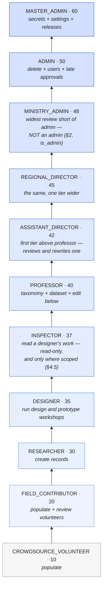
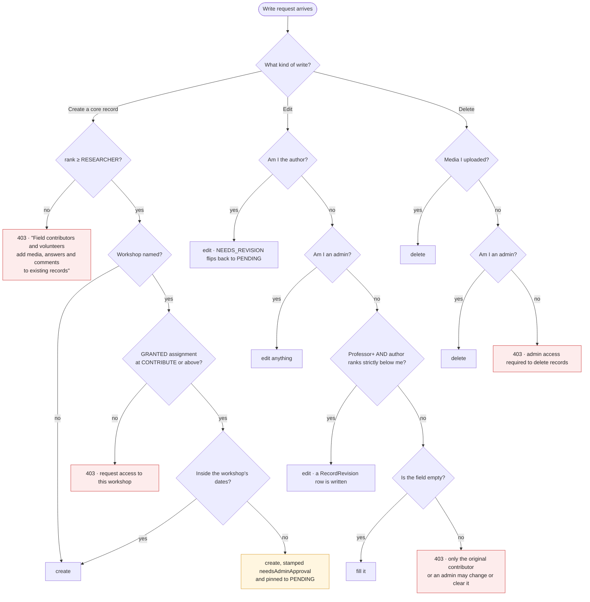
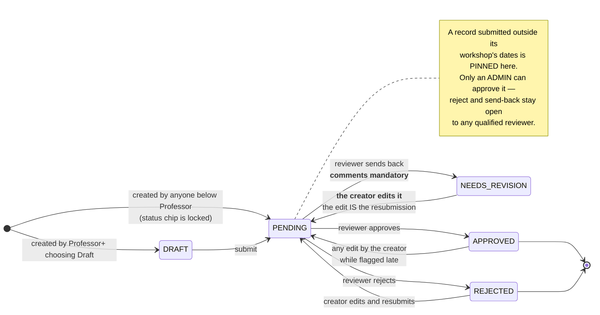
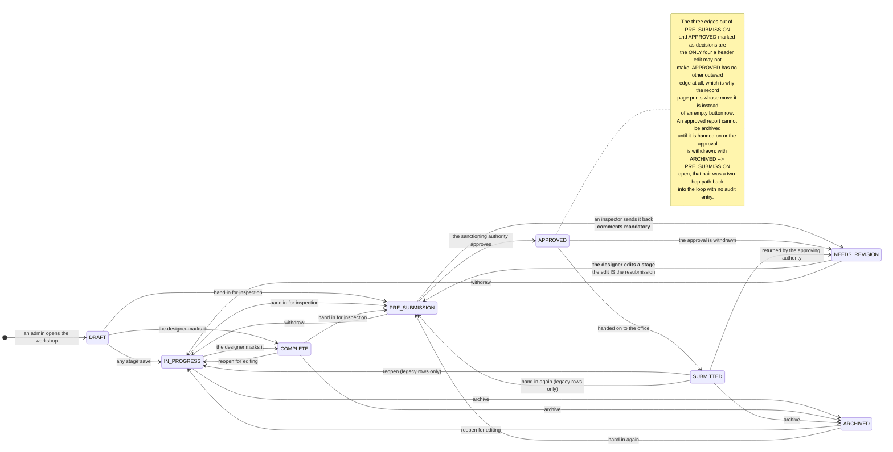
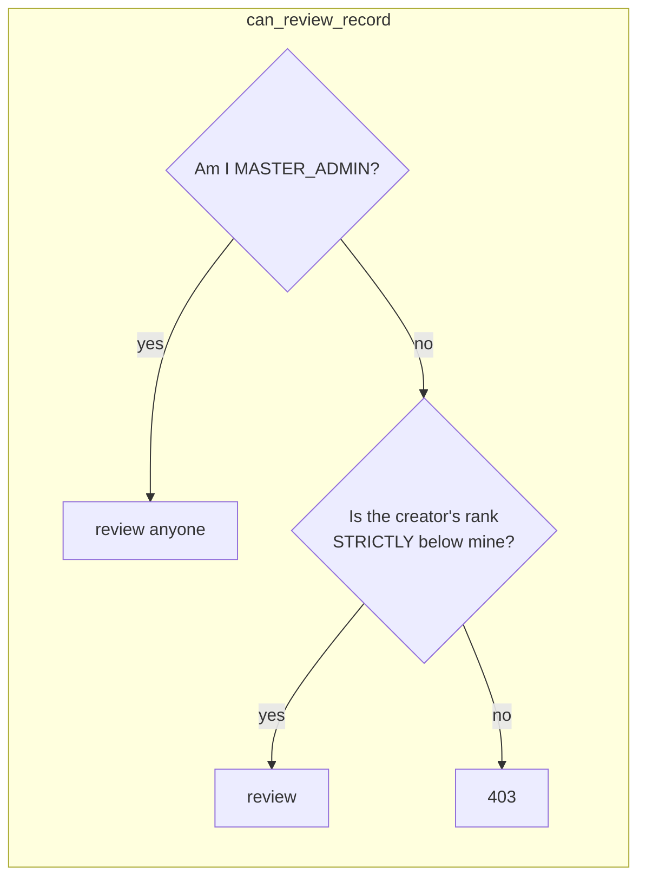
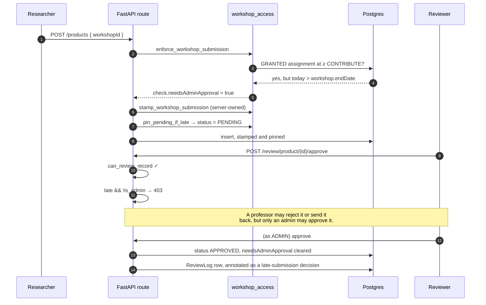
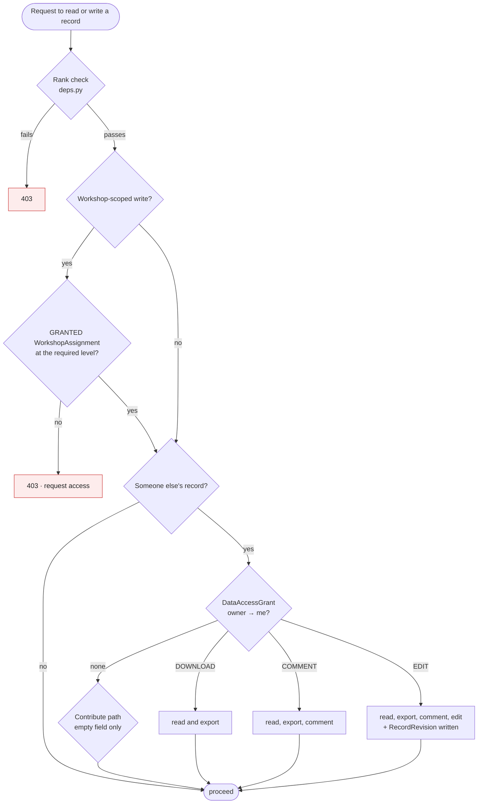

# Permissions: who may do what, and the review state machine

The complete authorisation model — the role ladder, the capability matrix, the access systems that
layer on top of it, and the exact state machine every record moves through.

**Source of truth is `backend/app/core/deps.py`.** The web client mirrors it in
`frontend/lib/permissions.ts` and the Android client in `MainActivity.kt`; both mirrors are advisory
UI, and neither is a control. Every rule below is enforced server-side, and the client copies exist
only so a user is not offered a button that will 403.

Sister documents: [SECURITY.md](SECURITY.md) for how the identity behind these checks is
established, [DATA_MODEL.md](DATA_MODEL.md) for the tables, [WALKTHROUGH.md](WALKTHROUGH.md) for what
this feels like to a researcher.

---

## 1. The ladder

Strictly ordered. Each tier inherits **everything** below it. The ranks themselves are generated into
[REPO_FACTS.md](REPO_FACTS.md).


```mermaid
flowchart BT
  V["CROWDSOURCE_VOLUNTEER · 10<br/><i>populate</i>"]
  F["FIELD_CONTRIBUTOR · 20<br/><i>populate + review volunteers</i>"]
  R["RESEARCHER · 30<br/><i>create records</i>"]
  D["DESIGNER · 35<br/><i>run design and prototype workshops</i>"]
  I["INSPECTOR · 37<br/><i>read a designer's work — read-only,<br/>and only where scoped (§4.5)</i>"]
  P["PROFESSOR · 40<br/><i>taxonomy + dataset + edit below</i>"]
  AD["ASSISTANT_DIRECTOR · 42<br/><i>first tier above professor —<br/>reviews and rewrites one</i>"]
  RD["REGIONAL_DIRECTOR · 45<br/><i>the same, one tier wider</i>"]
  MA["MINISTRY_ADMIN · 48<br/><i>widest review short of admin —<br/>NOT an admin (§2, is_admin)</i>"]
  A["ADMIN · 50<br/><i>delete + users + late approvals</i>"]
  M["MASTER_ADMIN · 60<br/><i>secrets + settings + releases</i>"]

  V --> F --> R --> D --> I --> P --> AD --> RD --> MA --> A --> M

  style V fill:#f6f6f6,stroke:#999,color:#222
  style F fill:#eef4ff,stroke:#6b8fd6,color:#222
  style R fill:#e8f1ff,stroke:#4f84d8,color:#222
  style D fill:#e5efff,stroke:#4679d4,color:#222
  style I fill:#e3edff,stroke:#4074d2,color:#222
  style P fill:#e1ebff,stroke:#3b70d0,color:#222
  style AD fill:#dfe9ff,stroke:#356bce,color:#222
  style RD fill:#dde7ff,stroke:#3066cc,color:#222
  style MA fill:#dae4ff,stroke:#2a61ca,color:#222
  style A fill:#d6e1ff,stroke:#2358c6,color:#222
  style M fill:#d2dfff,stroke:#1a4fbe,color:#222
```

**`DESIGNER` is 35, in the gap the original tens deliberately left**, and the reason it was inserted
rather than renumbered is that every stored role value and every `has_rank` comparison in
`deps.py` goes on meaning exactly what it meant before. A designer runs a workshop and signs the
report; a researcher documents what they find.

**The three directorate tiers are 42, 45 and 48**, inserted 2026-09-13 into the free 41-49 band with
nothing renumbered. They are the first tiers ever added **above** `PROFESSOR`, and that is a
different kind of insert: `can_review_record` is "strictly below me" and `can_edit_others_record` is
that same comparison narrowed to a Professor floor, so all three clear **both** — a directorate tier
may reject a professor's record *and* rewrite it, where an inspector at 37 may only reject a
designer's. They also pick up every Professor-floor capability at once: crafts, workshops, the
questionnaire builder, dataset download, and the user table. **`MINISTRY_ADMIN` is not an admin.**
`is_admin` is set membership on `{MASTER_ADMIN, ADMIN}`, so rank 48 opens no part of the admin
surface — no deletes, no capability grants, no decisions on the platform allow-list, no key store,
no `/admin` tree. What the tier does hold beyond its rank it holds through **named sets beside
`is_admin`**, each a separate decision: it names a workshop's designers, directors and inspectors
(`OVERSIGHT_ASSIGNER_ROLES`, §4.6), it **provisions password accounts** (`ACCOUNT_PROVISIONER_ROLES`
since 2026-10-09, §1.2 — this sentence said "no account creation" until then), and it may be
**appointed to a post** on one workshop by somebody else (§4.8). See
`backend/tests/test_directorate_tiers.py`.

> **Rank is not the whole answer for a designer.** `can_run_design_workshops` is the one predicate in
> `deps.py` that is a **SET** — `DESIGN_WORKSHOP_ROLES`: `DESIGNER`, the three directorate tiers
> (since 2026-09-14, §2's ¹²), `ADMIN`, `MASTER_ADMIN` — and not a threshold, so a **Professor
> cannot run a design & prototype workshop even though they outrank a designer.** A design workshop
> is a fortnight of a named designer's work ending in a document submitted to a ministry under their
> name, and being senior to a designer is not the same thing as being one. Admins are in the set
> because somebody has to be able to administer the records. (This blockquote named only
> `DESIGNER`, `ADMIN` and `MASTER_ADMIN` until 2026-10-09; the frozenset is the authority.)
>
> **And on one workshop the set is necessary, not sufficient.** Whoever holds a workshop's
> inspection, or its Assistant or Regional Director post, may read it and may write neither its
> content nor its designer team, through the admin routes too (§4.8). That is a fact about one
> workshop, so no role can carry it.
>
> A non-monotonic rule is far easier to let drift than a threshold, which is why
> `frontend/lib/permissions.ts` carries the identical set and must keep carrying it.

**`INSPECTOR` is 37, and every client labels it "Inspector / Reviewer".** Added 2026-08-27, in the
same kind of gap and for the same reason: 36-39 was free, so inserting there rather than renumbering
keeps every stored role value and every `has_rank` comparison meaning exactly what it meant before.
**37 rather than 36 or 39 because it is the MIDDLE of that free band** — it leaves a gap on both
sides, so a later tier can go between designer and inspector (36) or between inspector and professor
(38-39) with no renumbering either. It is the tier for somebody who **inspects and reviews a
designer's work without running workshops themselves** — an examiner, an external assessor, a
funder's reviewer.

**The enum value is `INSPECTOR` and deliberately not `REVIEWER`, and that is load-bearing rather than
taste.** "Review" already names a different and *relational* concept in this codebase: `canReview` is
held by everyone at Field Contributor and above and means "may review anyone ranked **strictly below
me**" (`can_review_record` in `deps.py`, `backend/app/api/routes/review.py`, `reviewEditFields`).
A role literally called `REVIEWER` would make one word mean two things one grep apart — a *rank*
and a *relation* — in the file every permission question is answered from. The **label** carries both
words so nobody has to learn the distinction to use the product; the **value** carries one so nobody
has to unlearn it to maintain the product.

> **AN INSPECTOR CANNOT RUN OR SIGN A DESIGN WORKSHOP, AND OUTRANKING A DESIGNER IS EXACTLY WHY THAT
> HAD TO BE SAID OUT LOUD.** `INSPECTOR` is **not** in `can_run_design_workshops`' set — "the people
> who sign the report", which reached the three directorate tiers on 2026-09-14 and has never reached
> this one. So an inspector sits at 37,
> above a designer at 35, and is refused every row the blockquote above refuses a professor: it may
> not create, run, stage-write, submit or sign a workshop, may not open the design-workshop tree on
> either client, and may not download the offline speech model. **Rank 37 confers nothing whatsoever
> inside the design-workshop tree.** Everything an inspector may see there arrives through the
> read-only, per-workshop scope in §4.5 — an **assignment**, not a rank, and not a grant either:
> `DesignWorkshopInspector` carries `assignedById` rather than `grantedById`, because nothing was
> granted to anybody. An assigner — a Ministry Admin, an admin or the master admin — appointed an
> examiner to a piece of work.
>
> **THE TRAP THIS TIER WALKED INTO, WRITTEN DOWN BECAUSE IT COSTS NOTHING TO WALK INTO IT AGAIN.**
> An audit on 2026-08-26 established that *every* design-workshop gate in this product is **set
> membership, not a rank floor** — `_require_designer` in front of eighteen routes,
> `load_ratable_workshop_or_404` (which 404s a non-member before it looks at anything),
> `access_for` (which hands a non-member an all-false `RatingAccess`), and
> `_assert_every_id_may_be_granted` (whose 422 discards the whole PUT body). That is why a professor
> at 40 cannot open a design workshop today. Adding a rank between 35 and 40 therefore does **two**
> wrong things at once, and **no existing test fails to say so**: the new tier gets *zero* workshop
> authority — precisely a professor's position — and it *silently* gains authority over every
> designer's records, below. Both were answered on purpose rather than inherited: the first by §4.5's
> separate read-only scope, the second by the paragraph that follows. `deps.py`'s comment on rank 37
> carries the same two answers, and ends with the instruction that matters most here — *do not "fix"
> that by adding INSPECTOR to the set.*

**What rank 37 DOES buy, and it is the reason the tier is above 35 rather than below it.**
`can_review_record` admits a reviewer over any creator ranked **strictly below** them, and 35 < 37 —
so an inspector may approve, reject and send back the repository records (artisans, products, tools,
processes, interviews) created by every **designer**, as well as by every researcher, field
contributor and volunteer. **That is wanted, and it is a decision rather than an inheritance.**
`can_review_record`'s docstring says so in capitals and explains why it had to be said at all: "below
me" is a rank comparison, so inserting a tier above `DESIGNER` confers authority over every
designer's records **with no line of code naming either tier and no test going red** — the exact
shape the 2026-08-26 audit flagged before this tier existed.
`backend/tests/test_inspector_tier.py` pins both halves and the direction: an inspector **may** review
a designer's record, **may not** rewrite it (`can_edit_others_record` narrows the same comparison to
Professor and above, and 37 < 40), a professor reviews an inspector, and an inspector does not review
a peer.

Two properties of it are worth stating separately, because §4.5 is easy to over-read. It is
**repository-wide** — it covers the record types in §2's matrix, not design workshops — and it is
**not scoped by §4.5**: an inspector with no `DesignWorkshopInspector` row anywhere still holds it in
full. Anyone moving this tier's rank, or inserting another near it, is changing who may reject a
designer's fortnight of fieldwork. §2's ⁴ marks the row. Re-check with
`grep -n "def can_review_record" -A 30 backend/app/core/deps.py` (true as of 2026-08-27).

**There are two gates on top of the role, and neither is in `deps.py`.** Both run on
`POST /api/auth/login`, in this order, and both refuse with a 403 carrying a sentence rather than a
permission error:

1. **The platform allow-list** (`backend/app/services/access_roster.py` → `AccessRoster`) governs
   **every account except the master admin's**. No ACTIVE row, no sign-in — a missing row is read as
   "awaiting approval", not as an admission, so the gate fails closed. The refusals are deliberately
   distinguishable: *awaiting approval*, *not approved*, *access suspended*, and — unchanged —
   `401 Invalid email or password` for a wrong credential. **The `MASTER_ADMIN` exemption is what
   makes gating everybody safe**: it lives in the gate, not in the table, so there is always one
   account that can reach the roster and let people back in. Google sign-in is gated too; an address
   that is not admitted becomes a pending request instead of an account.
2. **The designer empanelment** (`backend/app/services/designers.py` → `roster_allows`) still gates
   `DESIGNER` accounts only, and still answers in its own words. `User.role = DESIGNER` is not by
   itself what admits a designer. Admins are deliberately not empanelment-gated — an admin
   empanelled years ago and later suspended must not lose the ability to administer anything — and
   an ACTIVE `DesignerRoster` row is accepted by the allow-list as an admission, so empanelling
   somebody remains one action rather than two.

**Four paths empanel a designer, and `POST /api/users` became the fourth on 2026-09-03.** The other
three are the designer-roster screen itself (`POST /api/designers/roster`), admitting an address on
the platform allow-list (`routes/access`), and the sign-in path (`routes/auth`, for an address the
allow-list already admits). The fourth was the gap: an admin creating an account at `DESIGNER`
produced a user with no roster row, so the person did not appear on `/admin/designers` and nothing on
the screen said why. It now empanels immediately, with `DesignerRoster.addedById` naming the
provisioner who created it, and **the row appears before the person has ever signed in**. Adding them
again by hand answers 409. Since 2026-10-09 that door is
`account_provisioning.empanel_an_admitted_designer` — the one implementation `POST /api/users` and the
operator's `scripts/provision_account.py` both call. **It never revives a suspended empanelment** —
`ensure_empanelled` only ever creates, which is the one rule shared by every door and the reason a
readmission cannot be smuggled through any of them. A provisioner who is not an admin is refused
(409) before that point when it tries to create a `DESIGNER` whose empanelment an administrator ended,
or to move a designer's account onto such an address, or to move an account of any role carrying an
ended empanelment onto an address whose empanelment is active, which would end it (§1.2).

**Barring somebody now ends their live sessions, and a role change deliberately does not (2026-09-03).**
Pressing **Suspend** (`DELETE /api/access/roster/{id}`) or **Reject** (the REJECT arm of
`POST /api/access/roster/{id}/decision`) stamps `User.sessionsValidFrom`, so every token that address
is already holding stops working on its next request — an administrator no longer has to wait out
`JWT_EXPIRES_MINUTES` before "access is cut" is true. Ending an empanelment on the designer roster
does the same, when the empanelment was actually carrying admissions.

Two exceptions, named because both fail in the direction where the administrator has been *told*
access is cut: **rows barred before 2026-09-03 were never stamped** and nothing backfills them, and a
**Gmail-alias sweep that exceeds its limit** returns no answer rather than a wrong one, logs at ERROR
naming the address, and leaves any live session running. See
[OPEN_FINDINGS.md](OPEN_FINDINGS.md).

A **role change signs nobody out** — neither the PATCH on a roster row nor `PATCH /api/users`. That is
a decision, not an omission: losing a tier is not losing access, and ending every session somebody
holds because an admin corrected their role would be a worse outcome than the correction. The identity
cache is invalidated instead, so the new role takes effect on the very next request.

**A password change made FOR somebody does sign them out (2026-10-09).** When a provisioner sets
another account's password, or raises its `mustChangePassword`, at `PATCH /api/users/{id}`, the same
`sessionsValidFrom` stamp ends every session that account holds: the server refuses each one from its
next request. When a device NOTICES is the client's part. A browser tab drops its token at that
request; the Android source since 2026-10-09 does too, signing out with "This sign-in has ended. If
your password was changed on another device or by an administrator, sign in with the new one."; and
builds up to 0.0.15 notice only at their next launch. Both clients keep their queued work on the 401,
whichever build. Redeeming a password link has always done the same. The full list of the stamp's
writers is in [SECURITY.md](SECURITY.md) §3.2, and when each client notices is §3.6 there.

**And so does any change of the password, your own included (2026-10-09).** Every session is now
bound to the password it was opened with, so a change by any door — the forced change, a voluntary
one from Settings, a provisioner's temporary password, a link — ends every session opened with the
old password. Changing your own at `POST /api/auth/change-password` hands the session that made the
change a fresh token, in the answer's `X-Session-Token` header, so that one carries on, and signs you
out everywhere else. Tokens minted
before that release carry no binding, so a password change does not end them; only the watermark
can, before they expire. [SECURITY.md](SECURITY.md) §3.6.

Admin and above manage the allow-list (`can_manage_access_roster` → `require_access_manager`,
`/api/access/roster`); read is gated with write, because the pending queue is a list of somebody's
colleagues, applicants and former staff.

**Where an administrator actually does it, on each client, and how they are told.** The
notification is a COUNT on a surface an admin already opens, with the queue one tap behind it (the
product's e-mail carries password links and workshop review notices, not this queue — see
[SECURITY.md](SECURITY.md)). The number is the same on both
clients; the route to it is not, and that is deliberate rather than drift:

| | Web | Android |
|---|---|---|
| The screen | `/admin/access` (`frontend/app/(protected)/admin/access/page.tsx`) | `AccessRosterScreen` (`android/…/ui/AccessRosterScreen.kt`) |
| How it is reached | the "Who may sign in" tile on the `/admin` hub — rosters get no nav entry of their own here, the same rule the designer roster follows | the "Who may sign in" menu entry, beside "Designer roster" |
| Where the count shows | the hub tile, and a badge on the nav's "Settings hub" (`usePendingAccessCount`, one shared fetch, no timer) | a badge on that menu entry, fed by the app-wide 45-second loop that already drains the outbox — **no second poller** |
| Client permission mirror | `canManageAccessRoster` in `frontend/lib/permissions.ts`, plus a `ROUTE_GUARDS` row and an `ADMIN_CHROME_ROUTES` row | `FieldPermissions.canManageAccessRoster`, plus the entry's own `can` predicate |

**The refused person is told which refusal it was, and the clients are told in a header.** The
sentence in `detail` is for the reader; `X-Access-Status` (`PENDING` / `REJECTED` / `SUSPENDED` /
`DESIGNER_SUSPENDED` / `NOT_RECORDED`) is how the two sign-in screens choose the heading and the
"what to do next" line around it — because matching on the prose would break silently the first time
somebody rewords a sentence. A 401 carries no label at all, and an unlabelled 403 draws neutral
chrome around the server's own words rather than a guessed heading. The header must stay in
`expose_headers` on the CORS middleware (`app/main.py`) or the browser cannot read it while the
phone can.

The single most-misdocumented line in this repository, stated plainly:

> **A Field Contributor cannot create records.** `can_create_records` requires **Researcher**
> (rank 30). The two tiers below *populate* records that already exist — uploading media, answering
> questions in an open interview, commenting. That is the reason those tiers exist, and none of those
> three paths passes through the create gate.

Earlier versions of `README.md`, `SECURITY.md` and `RESEARCHER_GUIDE.md` all said Field Contributors
create records. They did not, and do not.

### 1.1 Grantable capabilities

An admin or the master admin can lift one specific power for a lower tier without promoting the
account — on `POST /api/users` and `PATCH /api/users/{id}` alike, and **only** they: a Ministry Admin
who provisions accounts (§1.2) is refused with a 403 the moment a request would CHANGE a flag, while
a form echoing the values an account already holds is accepted and the echo dropped
(`account_provisioning.assert_may_grant`). (This sentence said "a master admin" until 2026-10-09;
the code has let any admin set every flag for longer than that.) The columns below still do that,
except **two that are deliberately no longer read.**

| Column | Read? | Effect |
|---|---|---|
| `canReview` | **yes** | opens the review queue below Field Contributor |
| `canDownloadDataset` | **yes** | dataset download and the Data Browser below Professor |
| `canManageQuestionnaire` | **yes** | edit the questionnaire structure below Professor |
| `canViewProvenance` | **yes** (client-side) | shows created-by and per-field edit history; `isAdmin \|\| canViewProvenance` |
| `canManageCrafts` | **NO — ignored** | craft management is Professor **by rank alone** |
| `canManageWorkshops` | **NO — ignored** | workshop management is Professor **by rank alone** |

The last two were removed from the decision, not from the schema. The reasoning is in
`can_manage_crafts`' docstring and is worth repeating: a grant that lifts a researcher over the
*taxonomy itself* is the one clause that lets someone the permission matrix places underneath the
vocabulary rewrite it — and because a grant does not change the role column, nobody auditing the user
table can see who holds it. The columns stay (dropping them is neither safe nor reversible, and no
live account below Professor holds either), simply unread. Restoring the old behaviour is putting one
clause back in each function.

### 1.2 Account provisioning, and the forced password change

**Who provisions a password account is a set beside `is_admin`, not a widening of it** (owner's
decision, 2026-10-09). `deps.ACCOUNT_PROVISIONER_ROLES` is `{MINISTRY_ADMIN, ADMIN, MASTER_ADMIN}`,
checked by `can_provision_accounts` and the `require_account_provisioner` dependency; `is_admin` is
still exactly `{MASTER_ADMIN, ADMIN}`. Every rule below is written once, in
`backend/app/services/account_provisioning.py`, and the routes and the operator's command line all
call it — so the script cannot permit what the routes refuse.

| Act | Route | Who | What else is true | On the handset |
|---|---|---|---|---|
| **Create** a password account | `POST /api/users` | a provisioner | Role at or below the provisioner's own tier — the ceiling is INCLUSIVE (`assert_role`: an admin creates an admin, a ministry admin a ministry admin), `MASTER_ADMIN` only by a master admin, and the `MASTER_ADMIN_EMAIL` address is always created `MASTER_ADMIN`; any other spelling of that Gmail mailbox (dots, a `+tag`, `googlemail.com`) is a 403 to everybody but a master admin. The password is 8 to 200 characters and stored as typed. `mustChangePassword` defaults to **true**. An address already held in any letter case is a 409, a concurrent double-submit included, and so, for every provisioner since later the same day, is any spelling of a Gmail mailbox another account uses — "Email already exists" either way (`email_in_use`; a 503 when every spelling could not be read). The account is admitted on the platform allow-list at its tier and a `DESIGNER` is empanelled, because creating somebody is approving them | **No screen** — web only |
| **Require a new password** at the next sign-in, keeping the current one | `PATCH /api/users/{id}` `{mustChangePassword: true}` | a provisioner, on an account it manages | Raising the flag ends the account's sessions. 422 on an account with no password: nothing could ever satisfy the flag. The web's dialog for it offers to issue a link in the same step, for somebody who signs in with Google and may not know the present password | No screen. An owner flagged this way who signs in on 0.0.6 to 0.0.15 is told "An administrator set your password", which is untrue here; the web's dialog says so, and the source since 2026-10-09 uses the neutral sentence |
| **Withdraw a required change** | `PATCH /api/users/{id}` `{mustChangePassword: false}` | a provisioner, on an account it manages | Makes the password the account holds final — the same power as setting one with the flag down — so it ends no session, and a session already opened with that password is released from the hold (owner's ruling, 2026-10-09) | No screen |
| **Set a temporary password** | `PATCH /api/users/{id}` `{password, mustChangePassword?}` | a provisioner, on an account it manages | Temporary unless `mustChangePassword: false` is sent beside it. Ends the account's sessions | No screen |
| **Issue** or **withdraw** a set-password link | `POST /api/auth/password-links` `{userId}` · `POST /api/auth/password-links/{id}/revoke` | a provisioner, on an account it manages | INVITE (72 hours) for an account with no password, or with one nobody has signed in with yet (`firstLoginAt` empty) on an account created on or after 2026-08-30 17:00 UTC; RESET (2 hours) otherwise — `credential_links.purpose_for`. 422 for an account that signs in with Google and has no password. Revoking a link that does not exist is a 404. A per-account issue throttle answers 429. **Redemption asks again** whether the issuer could still manage the account: a link whose account has outgrown its issuer — promoted past it, or the issuer demoted — reads as withdrawn | **Admins only**: "Issue a set-password link" on the users screen, for an account the admin manages that has a password (`passwordSetAt` set, the web's test too), and the link just issued can be withdrawn. **Not offered to a Ministry Admin** — the route admits one, the handset's screen does not |
| **Correct** a name or an address | `PATCH /api/users/{id}` `{name?, email?}` | a provisioner, on an account it manages or on its own | An address another account holds, in any letter case, is a 409, a race lost to another request included — and, for every actor, so is any spelling of a Gmail mailbox another account uses ("Email already exists", or a 503 when every spelling could not be read). Any spelling of the master admin's mailbox is a 403 to everybody but a master admin. The allow-list row follows the new address (`access_roster.follow_email_change`) — and **a bar goes with it**: a non-admin moving an account onto or OFF an address an administrator barred, or a `DESIGNER` onto or off an ended empanelment, is a 409, and so is a non-admin's move of an account of any role from an address with an ended empanelment onto one with an active empanelment, which would end it; an admin's move carries the bar to the new address and leaves the old one barred (below) | No screen |
| **Change a role** | `PATCH /api/users/{id}` `{role}` | Professor and above (`require_professor`) | Ceiling `assert_role`, target `assert_can_manage_target`. **A raise withdraws the account's outstanding password links** in the same request, and is a **409** while the account still holds a temporary password (the flag up and a password present) unless the same request sets a new one — below. The access screen's approve and re-admit, which lift an existing account, apply the same rule without the 409 (below) | The same rule, on the users screen; a raise refused for a temporary password cannot be finished there, because the handset sends no password — set one on the web, or promote once the owner has chosen their own |
| **Grant** a capability flag | `POST` / `PATCH /api/users` | admins only | §1.1 | Admins only, on the users screen |
| **Delete** an account | `DELETE /api/users/{id}` | admins only (`require_admin`) | Unchanged; a Ministry Admin's attempt is a 403 | No screen |
| **Choose your own password** — when the account carries `mustChangePassword`, or any time from Settings | `POST /api/auth/change-password` | the account itself | Until a flagged account does, every route outside a short allow-list answers `401` with `X-Password-Change-Required: 1` — below. **Every other session of the account ends** ([SECURITY.md](SECURITY.md) §3.6), and the session that made the change carries on with a fresh token in the answer's `X-Session-Token` header, which CORS exposes; the body stays exactly `{"ok": true}` | A gate screen from build 0.0.6, and no Settings screen for it. Treating that `401` as a live session — token and queues kept, sends paused, resumed when the flag clears — and adopting the fresh token from the header are in the Android source since 2026-10-09 and reach handsets with the next published build. **On 0.0.6 to 0.0.15 the gate reports the change as made**, but those builds never read the header, so the session the handset holds ends with the old password; those builds notice that only at their next launch, and the person then signs in with the one they just chose. When the change's answer is LOST — no answer, a 5xx, a plain 401 — the source's gate asks `GET /me` before it says anything, and signs out saying "Your new password may already be in effect. Sign in with it; if it is refused, use the one you were given." when the session has gone; the change itself is sent once and never resent by the HTTP client. **Builds 0.0.2 to 0.0.5 have no gate**: change the password on the web first |

**WHOM a provisioner may touch is `account_provisioning.assert_can_manage_target`**: strictly lower
tiers, and master admins are peers who cannot manage each other — so a ministry admin looks after
Regional Directors and below, an admin looks after Ministry Admins and below. A professor, an
Assistant Director or a Regional Director who sends a name, an address, a password or the flag is
refused with a 403 naming the tier that can; they change roles and nothing else.

**NEVER YOUR OWN.** A password, the flag or a link for one's own account is a 403 pointing at
**Change password** (`POST /api/auth/change-password`), which asks for the current password and
spends the per-account guessing budget. It is asked before anything else, for every tier: a door that
skipped both would turn a stolen session into a permanent takeover.

**WHAT ONLY AN ADMIN DOES, AND HOW A MINISTRY ADMIN IS TOLD.** Deleting an account and changing a
capability flag are refused with a 403. Overturning an administrator's BAR is refused with a 409 and a
sentence naming who can lift it: creating an account on, or moving an account onto, an address whose
allow-list row is REJECTED or SUSPENDED (Gmail spellings of one mailbox included), or putting a
`DESIGNER` — by creating one, or by moving an account that is or is becoming one — on an address whose
designer empanelment an administrator ended. Only the role the account will hold decides the second
case, because an ended empanelment refuses a designer's sign-in and nobody else's. **Since 2026-10-09
the address an account LEAVES is asked as well** (`account_provisioning.assert_not_escaping_a_bar`):
moving an account off a REJECTED or SUSPENDED address, or a `DESIGNER` off an address whose empanelment
was ended, is the same 409. Only the destination used to be asked, so a suspended person who planted
a PENDING row at a second address — one refused Google sign-in does it — could be "corrected" onto it
and walk back in, the bar stranded on an address no account held while the access screen went on
showing it. Without these refusals "create an account" or "correct an address" would be a way round
somebody else's decision, because `access_roster.admit` re-activates a barred row. An admin keeps the
power to make every one of these moves, and the server's log line says what each address carried —
but moving a barred account does not let it back in: **the bar goes with the account**
(`access_roster.follow_email_change`). The destination's allow-list row takes the old status, with a
note saying why — even an ACTIVE row there — and an ended empanelment is carried to the new mailbox,
so the next sign-in there cannot empanel it afresh. **And the old address stays barred** (since later
the same day): when the destination has no row, a barred row is CREATED there — the status, who
barred the account and when, its tier and its name, and `BAR_CARRIED_BY_EMAIL_MOVE_NOTE` — and the old
row is left where it is; a row a racing sign-in writes at the destination first takes the bar instead.
The barred row used to MOVE, so the old mailbox was left with no row: a Google sign-in there was queued
PENDING as a stranger's, with no trace of the suspension, and approving that request let the person
back in under a new account. Letting the person back in is the access screen's act, or the designer
roster's, on either address, where it is recorded as one. **Nor may a non-admin end an empanelment by
moving an account** (also since later that day): the carry happens whatever the account's role, and
carrying an ended empanelment onto an address with an ACTIVE one ends that one — an administrator's
empanelment, possibly of somebody else — so a provisioner who is not an admin moving an account of any
role from an address with an ended empanelment onto one with an active empanelment gets a 409
(`ENDING_AN_EMPANELMENT_BY_MOVING_DETAIL`, asked through `account_provisioning.empanelment_active`). An
admin's same move still ends it, and the audit line says so. **A change of role alone asks nothing
about the address** (true as of 2026-10-09): the empanelment check runs only when an address is
created or changed, so a
`PATCH` carrying `role: DESIGNER` and no new address — open to a Professor and above — is not refused
on an address whose empanelment was ended, and the account is then refused at its next sign-in until
its role is changed back or an administrator restores the empanelment. That is an open entry in
[OPEN_FINDINGS.md](OPEN_FINDINGS.md).

**A PROMOTION DOES NOT CARRY A LOWER PROVISIONER'S CREDENTIAL UPWARD (2026-10-09).** A temporary
password and a set-password link are credentials the provisioner who made them holds, so an account
raised above that provisioner would be one it could never have managed — a ministry admin choosing an
admin's password. A `PATCH /api/users/{id}` that raises the role therefore withdraws every outstanding
link of the account in the same request (`credential_links.revoke_outstanding`), and is refused with a
409 while the account still holds a temporary password unless the same request sets a new one; a
demotion asks neither. Redeeming a link asks too: a link whose issuer could no longer manage the
account reads as withdrawn (`account_provisioning.issuer_still_manages` — a master admin's link always
passes, and so does one nobody issued or whose issuer's account was deleted). **One consequence on the
users screen**: an account created with the flag on, as it is by default, cannot be promoted until its
owner has chosen a password, unless the promotion sets a new temporary one — or create it at the tier
it needs. **The access screen's approve and re-admit apply the same rule** (since later the same day;
they asked neither question until then). They lift an existing account to the approved tier
(`routes/access._lift_existing_account`), and a lift withdraws the account's outstanding links after
its write. An account still holding a temporary password is not lifted: that screen has no password
field, and refusing the approval would leave the person's access undecided over a question about their
tier, so the approval of the address stands, the account keeps its tier, and the decision's answer
carries `accountPromotionHeld` — the sentence saying so, naming the address, both tiers and the two
ways on — which `/admin/access` shows word for word in place of its receipt, on Approve and on
Restore alike. It is `null` on every other decision, REJECT included. The handset decodes the answer
as the roster row and skips the key, so an approval made on a phone says nothing of it (true as of
2026-10-09). Both doors ask one predicate, `account_provisioning.holds_a_temporary_password`. A
Google sign-in on an empanelled address and the sanction register still lift an account without
asking, and only to `DESIGNER`, which sits below every provisioner, so neither carries a credential
past whoever issued it.

**ONE ACCOUNT PER MAILBOX, FOR EVERY PROVISIONER (2026-10-09).** No account is created at, or moved
onto, any spelling of a Gmail mailbox another account already uses — dots, a `+tag`, `googlemail.com`
— on `/users` or from the operator script, and the answer is the 409 "Email already exists" an address
taken in another letter case has always had (`account_provisioning.email_in_use`, which reads
`access_roster.accounts_on_the_mailbox_for_sign_in`, the Gmail fold done by Postgres). An admin and the
master admin are refused too. Every gate that
reads the allow-list and both rosters reads such an inbox as ONE key, so a second account on it
inherited the first one's admission and empanelment; a move onto it rewrote the first account's
allow-list row and could end its empanelment; and a Google sign-in, which will not guess between two
password accounts on one mailbox, then refused them both. A check that could not read every spelling
answers 503 and writes nothing. Outside the Gmail domains a dot is an ordinary character and the
literal comparison is the whole answer. An account may still be respelled within its own mailbox —
unless another account already shares that mailbox, in which case the pair has to be merged or
corrected first.

**THE MASTER ADMIN'S MAILBOX IS A MASTER ADMIN'S TO ASSIGN, UNDER ANY SPELLING (2026-10-09).** Creating
an account on, or moving one onto, any spelling of the `MASTER_ADMIN_EMAIL` Gmail mailbox is a 403 for
everybody but a master admin (`account_provisioning.is_master_email`, canonical on both sides). It
compared strings until then, and an account planted at another spelling could be found — and promoted
to `MASTER_ADMIN`, the provisioner's password still on it — by the master's first Google sign-in
([SECURITY.md](SECURITY.md) §3.3, which no longer folds for the master). What protects the master's
own account — always `MASTER_ADMIN`, never deleted, changed only by a master admin — stays on the
configured address itself (`is_master_address`), so an account at another spelling is an ordinary one.
**The sanction register names that mailbox for nobody** (since later the same day): an order naming
any spelling of it, as the lead or as a co-designer, is a **422** (`SANCTION_MASTER_MAILBOX`, asked by
`sanction_orders.designer_standing_verdict` before it reads anything), whoever records it and whether
or not the account exists; a spreadsheet import reports such a row as refused and never offers it for
confirmation; and an older order cannot re-issue a first-password link for an account on it. Until
then an order recorded before the master's own row existed created the account there and handed the
recording officer its first link. **And the master's
Google sign-in promotes only an account that is already a master admin or has no password**: any other
account at the configured address is answered 409, unchanged, until the operator runs
`scripts/seed_admin.py` ([SECURITY.md](SECURITY.md) §3.3, [DOCKER.md](DOCKER.md)).

**WHERE IT IS DONE: THE WEB, AND A SHELL.** On `/users` — the create form, and per row **Edit**,
**Password link**, **Require a new password** and **Set temporary password**, offered only on rows the
reader manages, beside a Sign-in status column. The panel that confirms a new account offers its
password link only when the creator may manage that account, and says why not for one created at the
creator's own tier. `/admin/access` links to that form for an address that will sign in with a
password rather than with Google, with the address filled in, and the tier when one was chosen there;
for an address admitted at the platform default, `/users` requires the tier to be chosen — its tier
picker opens empty and the form will not submit without one (`createFormRole` in
`frontend/app/(protected)/users/accountAdmin.ts`), where it used to open on Researcher — two rungs
above `DEFAULT_SIGNUP_ROLE`'s shipped value, Crowdsource Volunteer, at which a Google sign-in would
have started the person. **The handset has no provisioning screen**, by
[DECISION-ministry-surfaces-web-only.md](DECISION-ministry-surfaces-web-only.md); its
"Issue a set-password link" button stays admin-only and is offered only to an account that has a
password — the table's last column says what the handset does with each act. With no browser in
reach, `backend/scripts/provision_account.py` (from `backend/`:
`python -m scripts.provision_account`) provisions one account as the account `--actor-email` names and
refuses exactly what the route would refuse it. It is a dry run until `--apply`, reads the password
from `PROVISION_PASSWORD` and from nowhere else, and with `--google-only` writes an ACTIVE allow-list
row instead of an account, so the person's first Google sign-in creates it at that tier — an
Admin-only act, as it is on the access screen. `scripts/seed_admin.py` writes only temporary passwords,
and resets the master admin and nobody else.

#### The forced password change is enforced by the server

`User.mustChangePassword` means the password this account holds was chosen by somebody else. It is
raised by a provisioner creating the account (by default), setting somebody's password (by default)
or asking for a new one, and by `scripts/seed_admin.py`; it is cleared when the owner sets their own,
at `POST /api/auth/change-password` or by redeeming a link, and withdrawn by a provisioner who sends
`{mustChangePassword: false}` on its own for an account it manages (the table above). The sanction
register no longer raises it (2026-10-09): the account it mints holds a random password nobody was
ever shown, and the INVITE link it issues is how the designer sets one — while a raised flag held a
designer who signed in with Google first behind a gate asking for a password nobody had. **Until
2026-10-09 it was reported and never refused**: both clients drew the change-password screen, and
anybody holding the temporary password and a token could use the whole API from a script for the
token's seven days. Now:

- **Signing in still succeeds**, and answers `user.mustChangePassword: true` — change-password, the
  route somebody holding a temporary password uses to replace it, needs a bearer token, so refusing
  the sign-in would leave the account unable to comply without a link.
- **Every other authenticated route answers `401`** with the header `X-Password-Change-Required: 1` and
  the detail `Choose a new password to continue.`, except an allow-list, `deps.PASSWORD_CHANGE_ALLOWED_ROUTES`:
  `GET /api/me`, `GET /api/auth/me`, `POST /api/auth/change-password`, `POST /api/auth/logout`, `GET`
  and `POST /api/usage/consent`, and `GET /api/app/release/latest`. Matched on the exact method and
  path.
- **401 and never 403**, because both clients keep queued offline work on a 401 and treat a 403 as a
  permanent refusal that parks or drops it. The header is what tells a client to keep the token,
  re-read `/me` and draw the gate instead of signing out; CORS lists it in `expose_headers`, or a
  browser could not read it.
- **Exempt: the account at `MASTER_ADMIN_EMAIL`, and no other master admin** (`deps.is_configured_master_admin`).
  A second `MASTER_ADMIN` made with a typed password is held until it chooses its own — which cannot
  lock it out, because change-password is on the allow-list. **An account with no password is never
  held**, since there is nothing for it to replace.
- **Where it is checked**: inside `get_current_user`, so behind every `require_*` dependency, and in
  `require_dataset_admin`. A `dataset:read` token minted before the flag went up is not held there but
  ended, for good: raising the flag stamps the watermark, and the new password changes the fingerprint
  the token carries, so it answers a plain 401 with no header — before and after the owner chooses a
  password — and the operator mints a new one. Only a token minted while the flag was already up, which
  the mint has refused since 2026-10-09, is held by the check. (This bullet said such an earlier token
  "is held too" until it was corrected the same day.) `POST /api/datasets/token` refuses a flagged
  account with a 403 and a sentence.
- **Replacing the password ends every other session** (2026-10-09): the change-password answer hands
  the session that made it a fresh token in its `X-Session-Token` header — its body stays exactly
  `{"ok": true}`, the one every handset build decodes — and every session opened with the old
  password — the provisioner's, or anybody's who read the message the temporary password travelled
  in — is refused from its next request ([SECURITY.md](SECURITY.md) §3.6).
- **On the clients**: the web keeps the session on a gated 401, re-reads `/me` and draws **Set a new
  password** in place, pausing its offline drains until the flag clears, and adopts the fresh token
  from the header when the change goes through. The handset draws the same gate screen from build
  0.0.6; its handling of the gated 401 itself — keep the session, pause the outbox and the
  design-workshop and join-card sends, resume when the flag clears — and its adoption of the fresh
  token are in the Android source as of 2026-10-09 and reach handsets with the next published build. A
  handset on 0.0.6 to 0.0.15 never reads the header: it reports the change as made, the session it
  holds ends with the old password, and — since those builds read a session's end only at launch — the
  person signs in again with the new one when the app next starts (the table above, last row). The
  source also asks `GET /me` before it reports a change whose answer was lost, rather than saying
  nothing changed over a password that may already be in force, and sends the change exactly once
  ([SECURITY.md](SECURITY.md) §3.6). **Builds 0.0.2 to 0.0.5 have no gate screen at all**, so an
  account flagged while its owner is on one of them has to choose its password on the web first. That
  cost was accepted with the ruling.
- **A session ended by somebody else's change is noticed at the next request** on the web and, since
  2026-10-09, in the Android source: a plain 401 to a request carrying the token the handset still
  holds raises `SessionEndedSignal`, the app re-reads `/me`, and a session that has really ended is
  signed out with "This sign-in has ended. If your password was changed on another device or by an
  administrator, sign in with the new one." Nothing queued is lost. Builds up to 0.0.15 notice only at
  their next launch, and until then their queues retry with the dead token.
- **The way out is guarded too.** A wrong current password at change-password is a `400` (not `401`,
  which the web would read as a dead session) and is charged to the per-account budget; a new password
  equal to the current one is a `400` and is not charged; and a link redeemed while the flag is up
  refuses the temporary password itself. Every password somebody chooses — on create, update,
  change-password and a link — shares one ceiling of 200 characters (`security.MAX_PASSWORD_LENGTH`);
  the sign-in box stays unbounded, and an over-long value there is simply a wrong password.
- **Google sign-in does not clear it.** An account that has a password keeps it, and keeps the flag,
  when its owner signs in with Google — see [SECURITY.md](SECURITY.md) §3.3.

---

## 2. The capability matrix

Read across: ✅ allowed, ⬜ refused, and a note where the rule is conditional. This is the whole
gate list; each row names the function that decides it. **Most of those functions live in `deps.py`
and a growing minority do not** — `require_workshop_assigner` and `assert_may_assign_oversight` are
in the oversight service and its router, `require_sanction_recorder` and `require_annual_plan_manager`
are in theirs, the account-provisioning rules are `services/account_provisioning.py` and the
per-workshop separation of duties is `services/design_workshop_posts.py`, and §2's ⁸ lists five
Professor floors that live in services and routes. Each is where
it is for a stated reason and each is a welcome candidate for consolidation; what matters for reading
this table is that "grep `deps.py`" is no longer a complete way to check a row.

| Capability | Gate | VOL 10 | FIELD 20 | RESEARCH 30 | DESIGN 35 | INSPECT 37 | PROF 40 | ASST 42 | REGIONAL 45 | MINISTRY 48 | ADMIN 50 | MASTER 60 |
|---|---|:--:|:--:|:--:|:--:|:--:|:--:|:--:|:--:|:--:|:--:|:--:|
| Sign in, read lists and search | `get_current_user` | ✅ | ✅ | ✅ | ✅³ | ✅ | ✅ | ✅ | ✅ | ✅ | ✅ | ✅ |
| Upload media¹⁷, answer an open interview, comment | `get_current_user` | ✅ | ✅ | ✅ | ✅ | ✅ | ✅ | ✅ | ✅ | ✅ | ✅ | ✅ |
| **Create** artisan / product / tool / process / interview | `require_record_creator` | ⬜ | ⬜ | ✅ | ✅ | ✅ | ✅ | ✅ | ✅ | ✅ | ✅ | ✅ |
| Edit **own** record¹⁷ | ownership | ✅ | ✅ | ✅ | ✅ | ✅ | ✅ | ✅ | ✅ | ✅ | ✅ | ✅ |
| Fill an **empty** field on someone else's record¹⁷ | `assert_can_contribute_fields` | ✅ | ✅ | ✅ | ✅ | ✅ | ✅ | ✅ | ✅ | ✅ | ✅ | ✅ |
| Change or clear a **populated** field on someone else's record¹⁷ | `assert_can_contribute_fields` | ⬜ | ⬜ | ⬜ | ⬜ | ⬜ | ⬜¹ | ⬜¹ | ⬜¹ | ⬜¹ | ✅ | ✅ |
| Edit a record created by someone **ranked below**¹⁷ | `can_edit_others_record` | ⬜ | ⬜ | ⬜ | ⬜ | ⬜ | ✅ | ✅ | ✅ | ✅ | ✅ | ✅ |
| Open the **review queue** | `require_reviewer` | grant | ✅ | ✅ | ✅ | ✅ | ✅ | ✅ | ✅ | ✅ | ✅ | ✅ |
| Approve / reject / send back a **specific** record | `can_review_record` | ⬜ | vol only | below only | below only | below only⁴ | below only | below only⁶ | below only⁶ | below only⁶ | below only | ✅ everyone |
| Approve a design workshop's **report**, send it back without approving, withdraw an approval, hand it on to the office, return a handed-on report¹⁹ | `require_approving_authority` (`APPROVAL_AUTHORITY_ROLES`) + rule 7 (`design_workshop_posts.decision_refusal`) | ⬜ | ⬜ | ⬜ | ⬜ | ⬜ | ⬜ | ⬜ | ⬜ | ✅¹⁹ | ⬜ | ✅¹⁹ |
| Approve a **late** (out-of-window) submission | `set_review_status` | ⬜ | ⬜ | ⬜ | ⬜ | ⬜ | ⬜ | ⬜ | ⬜ | ⬜ | ✅ | ✅ |
| Create or edit a **craft** | `require_craft_manager` | ⬜ | ⬜ | ⬜ | ⬜ | ⬜ | ✅ | ✅ | ✅ | ✅ | ✅ | ✅ |
| **Open** a workshop | `require_workshop_opener` | ⬜ | ⬜ | ⬜ | ⬜ | ⬜ | ⬜ | ⬜ | ⬜ | ✅ | ✅ | ✅ |
| **Edit** a workshop | `require_workshop_manager` | ⬜ | ⬜ | ⬜ | ⬜ | ⬜ | ✅ | ✅ | ✅ | ✅ | ✅ | ✅ |
| Edit the **questionnaire structure** | `require_questionnaire_manager` | grant | grant | grant | grant | grant | ✅ | ✅ | ✅ | ✅ | ✅ | ✅ |
| **Download the dataset** / Data Browser | `require_dataset_downloader` | grant | grant | grant | grant | grant | ✅ | ✅ | ✅ | ✅ | ✅ | ✅ |
| **View** design-workshop stage data on screen | `can_view_design_workshop_data` | ⬜ | ⬜ | ⬜ | ⬜ | ⬜ | ✅ | ✅ | ✅ | ✅ | ✅ | ✅ |
| **Export** design-workshop stage data | `can_export_design_workshop_data` | ⬜ | ⬜ | ⬜ | ⬜ | ⬜ | ⬜ | ⬜ | ⬜ | ⬜ | ✅ | ✅ |
| Read an artisan's **unmasked Aadhaar number** | `artisans._may_read_full_aadhaar` | ⬜⁸ | ⬜⁸ | ⬜⁸ | ⬜⁸ | ⬜⁸ | ✅⁸ | ✅⁸ | ✅⁸ | ✅⁸ | ✅⁸ | ✅⁸ |
| See **de-masked identity numbers** and **every uploader's media** on an encoded record | `records.public_encode` / `media_url_owners` | ⬜⁸ | ⬜⁸ | ⬜⁸ | ⬜⁸ | ⬜⁸ | ✅⁸ | ✅⁸ | ✅⁸ | ✅⁸ | ✅⁸ | ✅⁸ |
| **Take every row out** in a download or export, not only your own | `records.owned_or_granted_where` | ⬜⁸ | ⬜⁸ | ⬜⁸ | ⬜⁸ | ⬜⁸ | ✅⁸ | ✅⁸ | ✅⁸ | ✅⁸ | ✅⁸ | ✅⁸ |
| A record you create arrives **APPROVED** rather than PENDING | `records.apply_status_policy_create` | ⬜⁸ | ⬜⁸ | ⬜⁸ | ⬜⁸ | ⬜⁸ | ✅⁸ | ✅⁸ | ✅⁸ | ✅⁸ | ✅⁸ | ✅⁸ |
| View the **user table**, promote / demote | `require_professor` | ⬜ | ⬜ | ⬜ | ⬜ | ⬜ | ✅ | ✅ | ✅ | ✅ | ✅ | ✅ |
| **Create** a password account; set a temporary password; require a new password; issue a password link; correct a name or an address (§1.2) | `require_account_provisioner`, then `assert_can_manage_target` on the account | ⬜ | ⬜ | ⬜ | ⬜ | ⬜ | ⬜ | ⬜ | ⬜ | **✅¹⁵** | ✅ | ✅ |
| **Delete** a user account; **grant** a capability flag (§1.1) | `require_admin` · `assert_may_grant` | ⬜ | ⬜ | ⬜ | ⬜ | ⬜ | ⬜ | ⬜⁷ | ⬜⁷ | ⬜⁷ | ✅ | ✅ |
| **Delete** any record¹⁷ | `assert_can_delete` | ⬜ | ⬜ | ⬜ | ⬜ | ⬜ | ⬜ | ⬜⁷ | ⬜⁷ | ⬜⁷ | ✅ | ✅ |
| Delete **media you uploaded**¹⁷ | route-local | ✅ | ✅ | ✅ | ✅ | ✅ | ✅ | ✅ | ✅ | ✅ | ✅ | ✅ |
| Grant / decide **workshop access** | `require_admin` | ⬜ | ⬜ | ⬜ | ⬜ | ⬜ | ⬜ | ⬜⁷ | ⬜⁷ | ⬜⁷ | ✅ | ✅ |
| **Run a design & prototype workshop** | `can_run_design_workshops` | ⬜ | ⬜ | ⬜ | **✅** | **⬜²** | **⬜²** | **✅¹²** | **✅¹²** | **✅¹²** | ✅ | ✅ |
| **Open** a NEW design & prototype workshop | three doors, three gates — see ¹³ | ⬜ | ⬜ | ⬜ | ⬜¹³ | ⬜ | ⬜ | ⬜¹³ | ⬜¹³ | **✅¹³** | ✅ | ✅ |
| **Download the offline speech model** | `can_run_design_workshops` | ⬜ | ⬜ | ⬜ | **✅** | **⬜²** | **⬜²** | **✅¹²** | **✅¹²** | **✅¹²** | ✅ | ✅ |
| Decide a design workshop's **viewers** (§4.4) | two doors — see ¹⁴ | ⬜ | ⬜ | ⬜ | ⬜ | ⬜ | ⬜ | **⬜⁹** | **⬜⁹** | **✅¹⁴** | ✅ | ✅ |
| Decide a design workshop's **inspectors** (§4.5) | `require_workshop_assigner` | ⬜ | ⬜ | ⬜ | ⬜ | ⬜⁵ | ⬜ | **⬜⁹** | **⬜⁹** | **✅⁵** | ✅ | ✅ |
| Decide a design workshop's **AD and RD** (§4.6) | `assert_may_assign_oversight` | ⬜ | ⬜ | ⬜ | ⬜ | ⬜ | ⬜ | **⬜⁹** | **⬜⁹** | **✅** | ✅ | ✅ |
| **Be appointed** to a post on one workshop, by somebody else (§4.8) | the holder sets, then `design_workshop_posts`' rules | ⬜ | ⬜ | ⬜ | designer | inspector | ⬜ | designer, AD | designer, RD | **any¹⁶** | **any¹⁶** | **any¹⁶** |
| **Read a workshop I monitor** (§4.6) | `assert_oversight_surface` | ⬜ | ⬜ | ⬜ | ⬜ | ⬜ | ⬜ | **✅¹⁰** | **✅¹⁰** | **✅¹⁰** | **✅¹⁰** | **✅¹⁰** |
| **Read a workshop I inspect** (§4.5) | `assert_inspection_surface` | ⬜ | ⬜ | ⬜ | ⬜ | ✅ | ⬜ | ⬜ | ⬜ | **✅¹¹** | **✅¹¹** | **✅¹¹** |
| **File a correction suggestion / send a report back** (§4.5) | `require_inspector` + the row | ⬜ | ⬜ | ⬜ | ⬜ | **✅¹¹** | ⬜ | ⬜ | ⬜ | **✅¹¹** | **✅¹¹** | **✅¹¹** |
| **Upload a workshop's artisan list**, or unlink an artisan from it | `assert_may_assign_oversight`, then `refuse_a_holders_write` | ⬜ | ⬜ | ⬜ | ⬜ | ⬜ | ⬜ | **⬜⁹** | **⬜⁹** | **✅¹⁶** | ✅¹⁶ | ✅¹⁶ |
| Assign **tasks** to other users | `require_admin` | ⬜ | ⬜ | ⬜ | ⬜ | ⬜ | ⬜ | ⬜⁷ | ⬜⁷ | ⬜⁷ | ✅ | ✅ |
| Rank the **transcription providers** | `require_admin` | ⬜ | ⬜ | ⬜ | ⬜ | ⬜ | ⬜ | ⬜⁷ | ⬜⁷ | ⬜⁷ | ✅ | ✅ |
| Read / set **API key values** | `require_master_admin` | ⬜ | ⬜ | ⬜ | ⬜ | ⬜ | ⬜ | ⬜ | ⬜ | ⬜ | ⬜ | ✅ |
| Repository **app settings** | `require_master_admin` | ⬜ | ⬜ | ⬜ | ⬜ | ⬜ | ⬜ | ⬜ | ⬜ | ⬜ | ⬜ | ✅ |
| Publish an **Android OTA release** | `require_master_admin` | ⬜ | ⬜ | ⬜ | ⬜ | ⬜ | ⬜ | ⬜ | ⬜ | ⬜ | ⬜ | ✅ |

¹¹ **The inspector's own surface and its only write — and since 2026-10-09 both follow the ROW, not
the tier.** `require_inspector` is `assert_inspection_surface` over `INSPECTION_HOLDER_ROLES`: the
`INSPECTOR` tier plus MINISTRY_ADMIN, ADMIN and MASTER_ADMIN, the three tiers that may now be
appointed to inspect a workshop (§4.8). What any of them reads and writes is scoped by its own
inspection rows, so an administrator files a suggestion or sends a report back exactly where somebody
else appointed them to inspect, and an administrator appointed nowhere sees an empty list. Until that
date this footnote read "the two ⬜s on the right are not an oversight", because the door was
`INSPECTION_ROLES` — a set of one — and an admin was refused it by name; the ruling made admins
holders, so the door widened to the holders and the scope stayed the rows. A professor and the two
director tiers are still refused. An assigner decides WHO inspects (the inspectors row above); whoever
holds the inspection decides WHAT the report should say. The write is two routes on the inspection
surface —
`POST /api/design-workshop-inspections/{id}/feedback`, which files a suggestion and moves nothing,
and `POST /api/design-workshop-inspections/{id}/send-back`, which files one and moves the report to
`NEEDS_REVISION` — and both are refused with a sentence unless the report is in `PRE_SUBMISSION` or
`NEEDS_REVISION`, because a suggestion belongs to a submission cycle and a report nobody has handed
in has none. Neither can touch a stage: see §4.5. True as of «2026-09-13»; check
`grep -n "router.post" backend/app/api/routes/design_workshop_inspections.py`. **Both clients file
and send back since 2026-10-10**: the handset opens the surface to the INSPECTOR tier alone (the
three administering tiers stay web-only, `DECISION-ministry-surfaces-web-only.md`), calls the same
two routes, and queues a note written without signal under the conflict rules in §4.5 — no
permission was widened for it.

¹ A Professor **or any directorate tier** may change a populated field on a record created by
someone **ranked strictly below** them, via `can_edit_others_record`. On a peer's or a superior's
record they are refused like anyone else. "grant" = refused by rank, allowed if the matching `can*`
column is set.

² **Not a threshold.** `can_run_design_workshops` is a SET — see §1. These are the only ⬜s in the
table that a *higher* rank does not clear, and the only rows where reading down a column tells you the
wrong thing. **It said "five ranks now sit above `DESIGNER` and are refused here — `INSPECTOR` (37),
`PROFESSOR` (40) and the three directorate tiers (42/45/48)" until 2026-09-16, and three of those five
were admitted on 2026-09-14** (¹²). **Two remain, and the pair is the better illustration of the
rule anyway:** `INSPECTOR` (37) and `PROFESSOR` (40) are refused while ranks 42, 45 and 48 pass, so
this is now a column in which the refusals are *interleaved* with the admissions and no reading of the
ladder produces it at all. The set is "the people who sign the report", and no number gets an account
into it — which is exactly why three tiers could be added by editing one frozenset and none of the
surrounding footnotes went red. The speech-model row reuses that predicate rather than inventing one: the model is a
workshop capture aid, and a laxer gate would make the offline half of dictation reachable by accounts
the online half is not. It is entitlement only — the artifact is **not** behind the daily dictation cap
or the Tier 3 consent gate, because neither applies to a file travelling *to* the phone
(`docs/ASR-MODEL-HOSTING.md` §2.6).

³ Subject to the roster: a `DESIGNER` whose `DesignerRoster` row is inactive is refused at sign-in
itself, before any gate in this table is reached. See §1. **The marker is on the `DESIGNER` cell
only.** `roster_allows` gates designer accounts and no others, so an `INSPECTOR` needs no
`DesignerRoster` row and cannot be suspended by one — it is admitted, like every other tier, by the
platform allow-list alone. The three directorate tiers need no `DesignerRoster` row either, for the
same reason — `roster_allows` gates designer accounts and no others, so nothing on this table can
suspend them except the platform allow-list.

⁴ **The one authority rank 37 confers by itself, and the only cell where an inspector's column is
wider than a designer's.** `can_review_record` is "strictly below me", so an inspector's "below" is
one tier deeper than a designer's: it reaches **`DESIGNER` as well**, over the repository record types
in this table, with no §4.5 scope and no grant of any kind involved. Everything else in the column is
inherited from below or refused. It is deliberate — it is why the tier is at 37 and not at 34 — and
`backend/tests/test_inspector_tier.py` asserts it in both directions, including that an inspector
may **not** rewrite the record it just rejected. See §1. Footnote ⁶ is the directorate version of
this cell, and it differs in the half that matters: those three tiers clear `can_edit_others_record`
as well.

⁵ **The inspected does not choose the inspector, and the ⬜ in the `INSPECT` cell is the sharpest
instance of that rule.** An inspector cannot put themselves — or anybody else — on a workshop, so the
tier has no way to widen its own scope. The `DESIGN` ⬜ two columns to the left is the same rule read
from the other side: a designer who could add or remove the person examining their own workshop would
make the inspection worth nothing. The workshop's own creator gets no say at all — not even a
“suggest an inspector” route, because a suggestion an admin rubber-stamps is the same thing wearing
a queue. §4.5 has the argument and the route list.

**THE GATE MOVED ON 2026-09-16 AND THE INVARIANT DID NOT — this is ruling OQ-6, and the ✅ in the
`MINISTRY 48` cell is the whole of what changed.** All three inspector routes —
`GET /design-workshop-inspections/eligible-inspectors`, `GET …/{id}/inspectors` and
`PUT …/{id}/inspectors` — stood behind `require_admin` until that day and now stand behind
`require_workshop_assigner`, i.e. `OVERSIGHT_ASSIGNER_ROLES` = `{MINISTRY_ADMIN, ADMIN, MASTER_ADMIN}`,
which is why this row now reads exactly like the AD-and-RD row two below it and carries ⁹ in the same
two cells. **Why it had to move:** `/officers` puts the designer team, the Assistant Director, the
Regional Director, the artisan roster and the inspectors on one page for one audience, and a Ministry
Admin who may name four of those five and is 403'd on the fifth has a screen that stops working
halfway down. Asking an admin to finish the job is the two-places-to-look this feature exists to end.

**And "the inspected must not choose the inspector" still holds — since 2026-10-09 on the workshop,
where until then it was kept by keeping two role sets apart.** This paragraph used to rest on
`INSPECTION_ROLES` being `frozenset({"INSPECTOR"})` with MINISTRY_ADMIN outside it, "so the account
that appoints an inspector still cannot BE one", and on an import-time check that refused to boot if
the inspector set ever overlapped `DESIGN_WORKSHOP_ROLES`. The owner's ruling that MINISTRY_ADMIN,
ADMIN and MASTER_ADMIN may be APPOINTED to inspect ends both halves: an appointer may now be an
inspector — of a workshop somebody else appoints them to — and those three tiers sit in the designer
set by role and in `INSPECTION_HOLDER_ROLES` by appointment. The import-time check is gone. What keeps
an inspection independent now is a short list of rules about one workshop, written once in
`services/design_workshop_posts.py` (§4.8): nobody appoints themselves; nobody inspects a workshop they
authored (a viewer row on it, or stages they wrote — never merely having created it); nobody both
supervises and inspects one; and whoever inspects a workshop writes neither its content nor its
designer team, through the admin routes too.
`test_the_inspection_surface_offers_only_the_two_write_doors_it_is_allowed` still walks the
router's real dependency tree and names two admissible gates — `require_inspector` and
`require_workshop_assigner` — so a route hung on a third still fails;
`test_the_tier_stays_out_of_the_designer_set_and_the_holders_overlap_it_by_ruling` replaced the
disjointness test; and `backend/tests/test_admin_serve_as.py` pins each per-workshop rule over
Postgres.

A REGIONAL_DIRECTOR is still refused this row for the reason in ⁹: the supervised do not choose who
examines them.

⁶ **"Below only" is wider here than anywhere else on the ladder, and it is the point of these three
tiers.** `can_review_record` is "strictly below me", so an assistant director's "below" reaches
`PROFESSOR`; a regional director's reaches `ASSISTANT_DIRECTOR`; a ministry admin's reaches
`REGIONAL_DIRECTOR`. None reviews a peer, and none reaches `ADMIN` or `MASTER_ADMIN`. **Unlike
footnote ⁴'s inspector, all three also clear `can_edit_others_record`** — the same comparison narrowed
to a Professor floor — so they may *rewrite* what they may send back. That is deliberate: the
directorate corrects work rather than only returning it. `backend/tests/test_directorate_tiers.py`
asserts both halves for all three, in both directions.

⁷ **Every ⬜ in the three directorate columns on an `is_admin` row is the same refusal, and
`MINISTRY_ADMIN` is the cell to read twice.** `deps.is_admin` is `role_value(user) in
{"MASTER_ADMIN", "ADMIN"}` — set membership, not a rank floor — so no number below 50 reaches it and
48 is not close. A token containing the word ADMIN that passes no admin gate is the most misreadable
fact in this document; it is stated in `deps.ROLE_RANK`'s comment, in the tier's migration header, on
`README.md`'s row and here. Widening `is_admin` would grant every row carrying this footnote at once,
which is the objection `can_read_usage`'s docstring makes in full. **Read it beside footnote ⁸**:
"not an admin" is not the same sentence as "reads nothing sensitive". **And beside ¹⁵ and ¹⁶**: some
of what an admin does is no longer an `is_admin` row at all — creating accounts and looking after
their passwords, naming a workshop's posts, being appointed to one — because each was handed to
`MINISTRY_ADMIN` as a set of its own rather than by widening `is_admin`, which is the shape this
footnote argues for.

⁸ **Five Professor floors live outside `deps.py`, and the three directorate tiers clear all five
without a line of code naming any of them.** They are `artisans._may_read_full_aadhaar` (the
function's own docstring calls Aadhaar *"regulated personal data"* and draws the line at *"the
researcher who recorded the artisan, and professor-and-above"*), `records.public_encode` (which
passes `unmasked=` into `_redact_sensitive`, and which resolves media URLs to `ALL_MEDIA_URLS`),
`records.media_url_owners` (the same answer on the transcript, annexure and export paths),
`records.owned_or_granted_where` (an empty **download** filter — reading the repository is already
open to every signed-in account through `viewable_where`, which narrows for nobody, so what this
floor decides is what *leaves*), and `records.apply_status_policy_create` (APPROVED rather than
PENDING on create; `workshop_access.pin_pending_if_late` still overrides it for a late workshop
submission). **None of these had a row in this table before 2026-09-13**, which is why three tiers
could inherit regulated-PII access from a rank number with nothing to read that said so.
`backend/tests/test_directorate_tiers.py` pins each as an intention. Re-check the list with
`grep -rn 'has_rank(' backend/app --include=*.py | grep -v core/deps.py`.

Two asymmetries in that table are deliberate and easy to misread:

- **An admin cannot edit another admin's record.** `can_edit_others_record` composes
  `has_rank(PROFESSOR)` **and** `can_review_record`, and `can_review_record` requires *strictly*
  below. Rank 50 is not strictly below rank 50. Only the master admin can act on a peer's work. The
  same is true of user management: `canManageUser` refuses equals.
- **The review ladder reaches one tier further down than the edit ladder.** A Field Contributor may
  *review* a volunteer's record but may not *rewrite* it — reviewing is a judgement, editing is
  authorship, and `can_edit_others_record` narrows to Professor and above for exactly that reason.
  `INSPECTOR` is the sharpest instance of that split and the one the tier was named for: it may
  reject a designer's record and may not change a word of it, because `can_edit_others_record`
  composes `has_rank(PROFESSOR)` **and** `can_review_record`, and 37 clears only the second.
- **Read the `INSPECT 37` column against `DESIGN 35` rather than down the ladder.** They are the
  same column but for three cells: the inspector loses both `can_run_design_workshops` rows and
  gains one tier of review reach (⁴). An inspector is therefore **not** "a designer with more" — on
  the repository matrix it is a designer with *less*, plus a judgement it may pass on the designer.
  That is the tier working as intended, and it is also why counting privilege by rank number is the
  wrong instrument on this table.

¹⁹ **The approving authority (2026-10-10).** The owner's "sanctioning authority" is the Ministry Admin
and the master admin, estate-wide, by role (`deps.APPROVAL_AUTHORITY_ROLES`, twin
`APPROVAL_AUTHORITY_ROLES` in `frontend/lib/permissions.ts`), on Reports to approve
(`/api/design-workshop-approvals`). Not the Assistant or Regional Director posts — view-and-monitor by
the 2026-10-09 ruling — and not ADMIN, which is platform administration. On one workshop rule 7 of
§4.8 refuses (403) whoever authored it (designer access or written stages; opening it is not authoring)
and whoever inspects it; a director post neither grants nor bars it, recording the workshop's sanction
order does not bar it, and one person may approve and then hand on. Every decision is one transaction
with a compare-and-set update and a `ReviewLog` row. An approved or handed-on report is frozen: every
write of its content answers 403, except recording a report export and the dictation consent.

### 2.1 Create, edit, delete — as a decision tree


```mermaid
flowchart TD
  start([Write request arrives]) --> kind{What kind of write?}

  kind -->|Create a core record| c1{rank ≥ RESEARCHER?}
  c1 -->|no| deny1[403 · &quot;Field contributors and volunteers<br/>add media, answers and comments<br/>to existing records&quot;]
  c1 -->|yes| ws{Workshop named?}
  ws -->|no| ok1[create]
  ws -->|yes| ws2{GRANTED assignment<br/>at CONTRIBUTE or above?}
  ws2 -->|no| deny2[403 · request access to this workshop]
  ws2 -->|yes| late{Inside the workshop's dates?}
  late -->|yes| ok1
  late -->|no| pin[create, stamped needsAdminApproval<br/>and pinned to PENDING]

  kind -->|Edit| e1{Am I the author?}
  e1 -->|yes| ok2[edit · NEEDS_REVISION flips back to PENDING]
  e1 -->|no| e2{Am I an admin?}
  e2 -->|yes| ok3[edit anything]
  e2 -->|no| e3{Professor+ AND author ranks strictly below me?}
  e3 -->|yes| ok4[edit · a RecordRevision row is written]
  e3 -->|no| e4{Is the field empty?}
  e4 -->|yes| ok5[fill it]
  e4 -->|no| deny3[403 · only the original contributor<br/>or an admin may change or clear it]

  kind -->|Delete| d1{Media I uploaded?}
  d1 -->|yes| ok6[delete]
  d1 -->|no| d2{Am I an admin?}
  d2 -->|yes| ok7[delete]
  d2 -->|no| deny4[403 · admin access required to delete records]

  style deny1 fill:#fdecec,stroke:#c33,color:#222
  style deny2 fill:#fdecec,stroke:#c33,color:#222
  style deny3 fill:#fdecec,stroke:#c33,color:#222
  style deny4 fill:#fdecec,stroke:#c33,color:#222
  style pin fill:#fff6e0,stroke:#d89a2a,color:#222
```

Note the shape of the edit branch: the *contribute* path (fill an empty field) is the widest, and it
is checked **last**, after ownership and rank have both failed. That ordering is what makes an
unprivileged contribution possible without ever letting it overwrite somebody's work — and the guard
covers clearing a populated field as well as changing it, because an earlier version skipped incoming
empty values and let anyone blank a field out.

---

⁹ **An Assistant Director and a Regional Director are refused although a MINISTRY ADMIN above them is
not, and this is the second place in this document where reading down a column tells you the wrong
thing.** `OVERSIGHT_ASSIGNER_ROLES` is a SET, `{MINISTRY_ADMIN, ADMIN, MASTER_ADMIN}`, and a REGIONAL
DIRECTOR (45) is outside it even though they outrank the Assistant Director (42) they might be asked
to name. THE SUPERVISED MUST NOT CHOOSE THE SUPERVISOR — the same rule §4.5 states one rung down as
"the inspected must not choose the inspector". An RD who should be able to assign is a MINISTRY_ADMIN,
which is a role change an admin makes on `/users` and not a widening of this set.

¹⁰ **The surface opens for every role that may HOLD an oversight post, and the rows decide what is on
it.** `assert_oversight_surface` admits `OVERSIGHT_HOLDER_ROLES` — the two director tiers plus
MINISTRY_ADMIN, ADMIN and MASTER_ADMIN — and each account sees the workshops a row names it on, through
`oversight_by_clause` and `load_overseen_workshop_or_404`. Nothing on the surface branches on
`is_admin`, so it never becomes a second full read of the archive "because they are an admin" — the
"two places to look when somebody has access they should not" that `services/design_workshop_access`
refuses in its header. An administrator nobody has named sees an empty list, and the page says so in
words rather than with a padlock.

**This footnote said the opposite until 2026-10-09: "an ADMIN and the MASTER ADMIN are refused this
row, by name, on a READ surface."** That was right while an admin could hold no oversight row, and a
MINISTRY_ADMIN was admitted to a list that could never contain anything, because neither slot took
the tier. The owner's ruling made all three holders (§4.8), so the surface opened with it. The three
administering tiers are now in BOTH halves of the scope — they assign, and they may be assigned, by
somebody else and never by themselves.

¹² **THE THREE DIRECTORATE TIERS JOINED THE WRITE SET ON 2026-09-14, AND THESE TWO ROWS READ ⬜ FOR
THEM UNTIL 2026-09-16.** `DESIGN_WORKSHOP_ROLES` is now `{DESIGNER, ASSISTANT_DIRECTOR,
REGIONAL_DIRECTOR, MINISTRY_ADMIN, ADMIN, MASTER_ADMIN}` — still a SET and still not a floor, which is
the whole point: PROFESSOR (40) sits between two of the new members and is deliberately still out, and
INSPECTOR (37) was asked for in the same breath and refused, because an inspector in the write set
would author the stages it later reviews. Being senior to a designer is not being one.

**The gap it closed is a workflow that dead-ended one step after it started:** a MINISTRY_ADMIN could
promote an annual-plan row into a design workshop and then not save a stage in the workshop they had
just created. It was found by a test rather than by anybody using it.

**The speech-model row moves with it and nobody had to decide that twice**, which is the good kind of
coupling and is worth knowing about before somebody "fixes" it: `_require_entitlement` in
`backend/app/api/routes/asr_models.py` reuses `can_run_design_workshops` rather than inventing a
second gate, and `backend/tests/test_asr_model_download.py` derives its two parameter lists by
subtracting `DESIGN_WORKSHOP_ROLES` from `ROLE_RANK`, so the test followed the set without an edit and
went nowhere near red. **That is also the warning:** these two rows are the only ones in the matrix
that a change to one frozenset moves together, and a tier added to that set acquires the offline
speech model silently.

**It did NOT, until 2026-10-09, make a directorate account eligible to be OFFERED as a workshop's
designer.** Writing in a workshop and being nameable as one of its designers were two different
predicates that disagreed — ruling OQ-4, recorded in §4.4.5. The owner's ruling of 2026-10-09 that
the administering tiers may be appointed a workshop's designer through the same pickers as everyone
else closed it: every default designer picker now offers exactly what the viewer write accepts. The
sanction register's picker is the one named exception (§4.7).

¹³ **THREE DOORS OPEN A DESIGN WORKSHOP AND THEY HAVE THREE DIFFERENT GATES, WHICH IS WHY THIS ROW
NAMES NO SINGLE PREDICATE.** The row's cells are the union — who can open one *somehow* — and the
union is the wrong thing to reason from, so here is the list:

| Door | Gate | Who |
|---|---|---|
| `POST /design-workshops` | `assert_can_create_design_workshops` | `DESIGN_WORKSHOP_CREATOR_ROLES` = `{ADMIN, MASTER_ADMIN}` |
| `POST /annual-plan/{entry_id}/promote` | `require_annual_plan_manager` | a rank floor at MINISTRY_ADMIN (48) |
| `POST /design-workshop-oversight/workshops` | `require_workshop_assigner` | `{MINISTRY_ADMIN, ADMIN, MASTER_ADMIN}` |

**A DESIGNER IS REFUSED ALL THREE**, which is the rule `can_create_design_workshops` was split from
`can_run_design_workshops` to express and is the one cell of this row that must never move: a designer
may do everything *inside* a workshop and may not bring one into existence, because left open it
produced three spellings of one real workshop each holding part of one fortnight's fieldwork, with
nothing in the product able to merge them. The handset says the same refusal in the same words, from
a cached role, before the network is consulted — see
[DECISION-ministry-surfaces-web-only.md](DECISION-ministry-surfaces-web-only.md) §7.3 for why it
mirrors the first door alone rather than the union of the three.

**Two doors and not one, then a third, because the alternative was widening the set.** The annual
plan's promote arm is behind its own gate for the reason its docstring gives — *"a MINISTRY_ADMIN is
not in `DESIGN_WORKSHOP_CREATOR_ROLES`, and widening that set to fit would hand every ministry admin
the ordinary create button as well. Two doors, two gates, one creation path."* The oversight screen
met the identical wall and followed the precedent verbatim. `DESIGN_WORKSHOP_CREATOR_ROLES` is
therefore UNTOUCHED, and `backend/tests/test_design_workshop_gate.py` reads
`frontend/lib/permissions.ts` to hold the two copies identical.

**All three call `open_design_workshop` and none of them calls `db.designworkshop.create`.** Four
steps in order — eligibility above the create, the row, the viewer rows, the stage-1 prefill seed —
and forgetting the fourth is invisible until the designer's first stage-1 save nulls the workshop's
state, district, craft and dates under a 200 reading "Stage saved".
`backend/tests/test_design_workshop_creation_path.py` enumerates the creation sites and fails on a
fourth, which is what makes "three doors" a checkable claim rather than a count in a table.

¹⁴ **A SECOND DOOR ONTO `DesignWorkshopViewer` OPENED ON 2026-09-16, AND THIS ROW SAID
`require_admin` BEFORE IT.** The viewers router is unchanged and is still admin-only — its one write,
the whole-set replace `PUT /design-workshops/{workshop_id}/viewers`, stands behind `require_admin`,
which is §4.4.2's rule and its argument is untouched. (Until 2026-10-09 this sentence named a
`PUT /design-workshop-viewers/{id}` and a single-row delete beside it; no such routes exist, and the
single-row removal, `design_workshop_viewers.remove_one_viewer`, is reached only through the oversight
doors below.) What is new is that the officers screen writes the same table through two narrower
doors of its own:

| Door | Gate | What it can express |
|---|---|---|
| `PUT /design-workshops/{workshop_id}/viewers` | `require_admin` | the viewer set, arbitrarily — including the empty set |
| `PUT /design-workshop-oversight/{workshop_id}/designers` | `require_workshop_assigner` | the workshop's designer TEAM and which of them leads it — replacement only, and **never empty** |
| `PUT /design-workshop-oversight/{workshop_id}/designer` | `require_workshop_assigner` | the single LEAD, moving their profile onto the workshop with them |

**The difference is what they can SAY, not what they touch.** Both oversight doors apply the same
eligibility rule as the admin one — a candidate still has to pass the empanelment roster and the
platform allow-list, which is the clause §4.4.5 is about — and neither can express "this workshop is
for nobody": the singular body's `designerId` is `min_length=1`, and the plural door refuses an empty
set with a 422 of its own rather than letting it reach the state the singular body already rejects.
The admin door CAN say it. That asymmetry is deliberate: an officer's act is *naming the team*, which
is always a replacement, and a workshop with no designer is a state only an administrator clearing up
after one should be able to produce.

**Why the ⬜⁹ in the two directorate columns to the left.** `OVERSIGHT_ASSIGNER_ROLES` again, for
the reason in ⁹ — the supervised do not choose the supervisor, and here the supervised would be
choosing who does the work they will sign off.

**Read this beside §4.4.2, whose heading is the sentence this footnote qualifies.** That section's
argument — that access outliving its granter is the whole point, so the creator does not choose their
own readers — is unchanged and applies to this door as much as the admin one. What changed is only
WHICH administrators: the set went from `{ADMIN, MASTER_ADMIN}` to that set plus MINISTRY_ADMIN, for
the same journey-shaped reason ⁵ gives about inspectors. Nobody gained the ability to grant themselves
anything, and nothing here is reachable by the workshop's creator or its designers. Since 2026-10-09
every one of these doors says so out loud on an existing workshop: naming yourself, or naming the
workshop's inspector, Assistant Director or Regional Director, is a 409 with the rule in it (§4.8).
And whoever holds one of those posts on the workshop is refused all three doors there, whatever their
tier, with §4.8 rule 5's 403 — and the two other ways onto the team with them: deciding a request for
access to that workshop, granted or denied alike, and printing a join card for it. Who writes a
workshop is part of what its inspector and directors stand apart from.

¹⁵ **A Ministry Admin provisions accounts and is still not an admin (2026-10-09).** The gate is
`ACCOUNT_PROVISIONER_ROLES`, a set beside `is_admin`, so a ministry admin creates password accounts at
or below its own tier and looks after the passwords, names and addresses of the accounts strictly
below it — and is told, with a 403 or a 409 that says who can, that it may not delete an account,
change a capability flag, overturn an administrator's bar on an address, or end an administrator's
empanelment by moving an account onto its address. The two director tiers
below it are outside the set: on the user table they change roles and nothing else. Every rule is in
§1.2; `backend/tests/test_account_provisioning.py` is where they are pinned.

¹⁶ **Holding a post is an appointment, never a rank (2026-10-09).** A cell in the "be appointed" row
says who MAY hold a post; nobody holds one until somebody else appoints them, on one workshop at a
time, and an appointment that breaks a separation-of-duties rule is refused with a 409 (§4.8). While an
account holds a workshop's inspection or one of its two director posts, that workshop's content and its
designer team are closed to it — through the admin routes too, with one 403 naming the post
(`design_workshop_posts.write_refusal`). **Refused**: its stages; editing or deleting it; its artisan
list, import and unlink; filing a record into it, and every edit, delete or merge of a record filed
under it, a designer's own questionnaire included (¹⁷); every change to a file it holds (¹⁷); the
viewers `PUT`; the oversight screen's two designer doors
(`PUT /api/design-workshop-oversight/{id}/designer` and `…/designers`); deciding a request for access
to it, either way; and printing a join card for it. **Kept**: every read;
appointing other people to the workshop's posts, and taking other people off them, under the same
rules (appointing yourself is a 409, and so is taking yourself off); restoring it; and generating its
report, with the export-ledger row
`POST /api/design-workshops/{id}/exports` writes (§4.8 rule 5 has the final lists). So the ✅s in the
"Run a design & prototype workshop", "Decide a design workshop's viewers" and "Upload a workshop's
artisan list" rows are true per workshop, not everywhere.

¹⁷ **Not on a record or a file of a workshop where you hold a post (2026-10-09).** While an account
holds a workshop's inspection or one of its two director posts, it may not edit — any field, filled or
empty, its workshop box included, and from the review queue as well as the record's own form — delete
or merge a record FILED UNDER that workshop, change a tool's artisan links there, or edit a
questionnaire form attached to it; nor add a file to the workshop or change one it holds: upload one
tagged to it, attached to a record filed there or filed under it, delete it, set, refine or re-run its
transcript, re-queue a failed transcription of it, change its caption or transcript from the review
queue, decide an identity photograph either way, or relink it out of the workshop or into it; nor file
such a record or file under a crafts workshop, or delete it, from the unfiled-records report, whose
bulk filing leaves it alone for that account. Whatever these rows say for its tier, the answer is §4.8
rule 5's 403 naming the post. Approving, rejecting and sending back such a record are not refused.

## 3. The review and approval state machine

Every record type except `Craft` carries a `status`. `Craft` has none — it is shared vocabulary, not
a submission.


```mermaid
stateDiagram-v2
  direction LR
  [*] --> DRAFT: created by Professor+ choosing Draft
  [*] --> PENDING: created by anyone below Professor<br/>(status chip is locked)

  DRAFT --> PENDING: submit

  PENDING --> APPROVED: reviewer approves
  PENDING --> REJECTED: reviewer rejects
  PENDING --> NEEDS_REVISION: reviewer sends back<br/><b>comments mandatory</b>

  NEEDS_REVISION --> PENDING: <b>the creator edits it</b><br/>the edit IS the resubmission

  APPROVED --> PENDING: any edit by the creator<br/>while flagged late
  REJECTED --> PENDING: creator edits and resubmits

  APPROVED --> [*]
  REJECTED --> [*]

  note right of PENDING
    A record submitted outside its
    workshop's dates is PINNED here.
    Only an ADMIN can approve it —
    reject and send-back stay open
    to any qualified reviewer.
  end note
```

**AND THERE IS A SECOND STATE MACHINE, WHICH IS NOT THIS ONE (added 2026-09-13).** A design &
prototype workshop carries `DesignWorkshopStatus`, not `RecordStatus`, and the two are different
vocabularies over different tables: the diagram above is a REVIEW QUEUE for the six repository record
types, and the one below is the life of one 22-stage report. They share two token SPELLINGS —
`NEEDS_REVISION` and `APPROVED` — and that is deliberate rather than coincidental: it is what lets
`services/records.review_update` write a workshop's decision with the same four-key dict it writes
for the other six, instead of a seventh copy that can drift. **A `DesignWorkshop` never appears in
`/review/pending`**, and adding `DESIGN_WORKSHOP` to `api/routes/review.py::_REVIEW_TYPES` would
produce a queue that is permanently empty for the tier the feature exists for — `can_review_record`
compares against the record's CREATOR, and a design workshop's creator is always an admin.

Until 2026-09-13 this machine had **no transitions at all**: `PATCH /design-workshops/{id}` copied
`status` through a plain field loop and any value could follow any other. The graph is
`backend/app/schemas/design_workshop_review_loop.py::LEGAL_TRANSITIONS` and it is enforced in
`update_design_workshop`. Dotted edges are **decisions**: they are refused to a header edit entirely,
and are taken on a route that writes its `ReviewLog` row in the same transaction, because a status
change with no audit entry is a decision that appears to have made itself.


```mermaid
stateDiagram-v2
  direction LR
  [*] --> DRAFT: an admin opens the workshop
  DRAFT --> IN_PROGRESS: any stage save
  DRAFT --> COMPLETE: the designer marks it
  IN_PROGRESS --> COMPLETE: the designer marks it
  COMPLETE --> IN_PROGRESS: reopen for editing

  DRAFT --> PRE_SUBMISSION: hand in for inspection
  IN_PROGRESS --> PRE_SUBMISSION: hand in for inspection
  COMPLETE --> PRE_SUBMISSION: hand in for inspection
  PRE_SUBMISSION --> IN_PROGRESS: withdraw

  PRE_SUBMISSION --> NEEDS_REVISION: an inspector sends it back<br/><b>comments mandatory</b>
  NEEDS_REVISION --> PRE_SUBMISSION: <b>the designer edits a stage</b><br/>the edit IS the resubmission
  NEEDS_REVISION --> IN_PROGRESS: withdraw

  PRE_SUBMISSION --> APPROVED: the sanctioning authority approves
  APPROVED --> NEEDS_REVISION: the approval is withdrawn
  APPROVED --> SUBMITTED: handed on to the office
  SUBMITTED --> NEEDS_REVISION: returned by the approving authority

  SUBMITTED --> IN_PROGRESS: reopen (legacy rows only)
  SUBMITTED --> PRE_SUBMISSION: hand in again (legacy rows only)
  ARCHIVED --> IN_PROGRESS: reopen for editing
  ARCHIVED --> PRE_SUBMISSION: hand in again
  IN_PROGRESS --> ARCHIVED: archive
  COMPLETE --> ARCHIVED: archive
  SUBMITTED --> ARCHIVED: archive

  note right of APPROVED
    The three edges out of PRE_SUBMISSION
    and APPROVED marked as decisions are
    the ONLY four a header edit may not
    make. APPROVED has no other outward
    edge at all, which is why the record
    page prints whose move it is instead
    of an empty button row.
    An approved report cannot be archived
    until it is handed on or the approval
    is withdrawn: with ARCHIVED --> PRE_SUBMISSION
    open, that pair was a two-hop path back
    into the loop with no audit entry.
  end note
```

**`SUBMITTED` HAS BEEN REDEFINED AND NOTHING WAS BACKFILLED.** It used to be the designer's own
forward act; it now means the approved report has gone to the office. Rows that carry the old meaning
keep the word — nobody approved them, and relabelling them would be a lie in an audit trail — and the
graph gives them a way into the loop. True as of «2026-09-13»; check
`grep -n "LEGAL_TRANSITIONS" backend/app/schemas/design_workshop_review_loop.py`.

### 3.1 Who may move a record, and how status changes actually work

There are **three** distinct mechanisms, and conflating them is how a privilege bug gets written.

| Mechanism | Function | Behaviour on refusal |
|---|---|---|
| Explicit review action | `POST /review/{type}/{id}/{approve\|reject\|revise}` | **403** — a loud, deliberate refusal |
| Status sent on an ordinary edit | `apply_status_policy_update` | **silently dropped** — see below |
| Automatic resubmission | `resubmit_status` | not a permission at all |

The middle row is the subtle one. Old clients always echo the record's current status back on every
PATCH, so treating an unauthorised status field as an error would 403 every save. Instead the field
is *popped* from the payload and the stored value is untouched. A status change on an edit sticks
only when the editor is Professor-or-above **and** is either the record's creator or outranks the
creator on the review ladder.

`resubmit_status` then does the thing researchers actually notice: when the **creator** edits a record
sitting in `NEEDS_REVISION`, and sends no explicit status, the edit itself flips it back to `PENDING`.
Other editors — an admin tidying up, a contributor filling a gap — never flip it.

### 3.2 Who may review which record


```mermaid
flowchart LR
  subgraph rule["can_review_record"]
    direction TB
    q1{Am I MASTER_ADMIN?} -->|yes| yes1[review anyone]
    q1 -->|no| q2{Is the creator's rank<br/>STRICTLY below mine?}
    q2 -->|yes| yes2[review]
    q2 -->|no| no1[403]
  end
```

So: an admin reviews everyone beneath, a professor reviews inspectors and below, an **inspector
reviews designers and below**, a designer reviews researchers and below, a researcher reviews field
contributors and volunteers, a field contributor reviews volunteers, and a volunteer reviews nobody.
A record whose creator has no role on file is treated as a researcher's work — which, now that
`DESIGNER` sits at 35, means a designer may review it and a researcher may not.

**The inspector link in that chain is the one no line of code names**, and §2's ⁴ is the same fact
from the matrix's side. `INSPECTOR` sits at 37, "strictly below me" is arithmetic, and the arithmetic
hands it every designer's repository records at once — repository-wide and unscoped, on a tier whose
design-workshop reach is read-only and per-workshop (§4.5). **It is intended**, and
`can_review_record`'s own docstring is where that intention is recorded, precisely because the
mechanism producing it is invisible: no test would have gone red had it been an accident. Recorded
2026-08-27; `backend/tests/test_inspector_tier.py` pins it.

Opening the **queue** (`require_reviewer`) is a separate, wider check than acting on a **record**
(`can_review_record`): the queue opens for Field Contributor and above, and then shows only what that
reviewer may act on. A user granted `canReview` with nobody beneath them gets an empty queue, which
review.py handles explicitly rather than leaving as a puzzle.

### 3.3 The late-submission gate

The most intricate rule in the system, and the one worth understanding before changing anything near
it. A record created or re-pointed into a workshop **after that workshop's end date** is stamped
`extraMetadata.workshopSubmission.needsAdminApproval = true` and pinned to `PENDING`.


```mermaid
sequenceDiagram
  autonumber
  participant R as Researcher
  participant API as FastAPI route
  participant WA as workshop_access
  participant DB as Postgres
  participant Rev as Reviewer

  R->>API: POST /products { workshopId }
  API->>WA: enforce_workshop_submission
  WA->>DB: GRANTED assignment at ≥ CONTRIBUTE?
  DB-->>WA: yes, but today > workshop.endDate
  WA-->>API: check.needsAdminApproval = true
  API->>WA: stamp_workshop_submission (server-owned)
  API->>WA: pin_pending_if_late → status = PENDING
  API->>DB: insert, stamped and pinned

  Rev->>API: POST /review/product/{id}/approve
  API->>API: can_review_record ✓
  API->>API: late && !is_admin → 403
  Note over API,Rev: A professor may reject it or send it<br/>back, but only an admin may approve it.

  Rev->>API: (as ADMIN) approve
  API->>DB: status APPROVED, needsAdminApproval cleared
  API->>DB: ReviewLog row, annotated as a late-submission decision
```

Four properties of that flag are load-bearing, and each closes a specific way round it:

1. **It is server-owned.** A `workshopSubmission` key arriving in the caller's `extraMetadata` is
   replaced, never trusted. Otherwise a creator could PATCH the flag away and then self-approve.
2. **It is carried forward on every update.** Provenance rebuilds `extraMetadata` from the incoming
   payload, so a stamp that was not explicitly carried would vanish on the next edit.
3. **It survives a re-link.** Re-pointing a late record at a workshop that happens to be in-window
   produces a fresh "not late" check, which would otherwise launder the flag. Being moved does not
   make late work on-time.
4. **`pin_pending_if_late` runs after the status policy**, so it *overrides* the submitter's own
   rights. A professor who documents a workshop after it ended cannot approve their own record.

Three bypasses, all deliberate: **admins** pass the whole gate (`pin_pending_if_late` is a no-op for
them); a record with **no workshop** is never late; and `Craft`, having no status column, is never
pinned.

### 3.4 Reviewer edit

A reviewer can fix a record in place instead of bouncing it back — the misspelt village, the craft
name in the wrong column. `POST /review/{type}/{id}/edit` runs under the same authority as the other
review actions, validates the payload against **the record type's own update schema** so it cannot
bypass a rule the ordinary PATCH enforces, and refuses a fixed set of keys outright:

`status` (an edit must not be a back-door approval), `extraMetadata` (holds the server-owned late
stamp), `workshopId` (moving a record between workshops has its own checks), `designWorkshopId`
(refused to everybody, the master admin included, since 2026-10-09: filing a record under a design
workshop has its own gate, on the record's own form, and this route used to write the key past it),
and the relation lists and `location` (separate writes, not column updates).

**Not by whoever holds a post on the workshop the record is filed under** (2026-10-09). A record
filed under a design workshop is that workshop's content, and so is a file it holds, caption and
transcript included; its inspector and its two directors are refused this edit with §4.8 rule 5's
403, asked about the stored row before anything is written
(`record_design_workshop.assert_may_write_a_record_filed_under` for a record,
`design_workshop_posts.refuse_a_holders_media_write` for a file). Approve, reject and send back stay
open to them: they are review, not authorship. The web's edit panel holds its boxes, Save and "Save
and approve" for such a reviewer, with the reason, and leaves the three decisions live (§4.8).

`approve: true` runs the ordinary approval immediately afterwards as a **second, separately logged**
action, so the audit trail shows the edit and the approval as two decisions and the approval still
passes the admin gate.

---

## 4. The access systems layered on top

Rank says what *kind* of thing you may do. It does not say *whose* data, or *which workshop*.

**The scope systems are not variations on one idea** — each answers a different question, holds its
own table, and is granted by a different person:

| # | System | Scopes | Granted by | Section |
|---|---|---|---|---|
| 1 | `WorkshopAssignment` | a **workshop** (the ordinary field kind), read→write by level | an admin, or requested and decided | §4.1 |
| 2 | `DataAccessGrant` | one **account's** records at large | the record **owner**, not an admin | §4.2 |
| 3 | `DesignWorkshopViewer` | one **design workshop**, read + stage-writes | an admin, or a Ministry Admin through the oversight screen's designer doors (§2's ¹⁴) — never the creator, never the grantee themselves, and never to the workshop's inspector or directors (§4.8) | §4.4 |
| 4 | `DesignWorkshopAccessRequest` | nothing on its own — it is the **asking** half of 3, a separate table with its own `DwAccessRequestStatus` and `DwAccessRequestSource` enums (`backend/prisma/schema.prisma`) | the requester raises it, an admin decides it | **not written up here** — §4.4.3 only says why the lifecycle is not on the grant table itself |
| 5 | `DesignWorkshopInspector` | one **design workshop**, **read-only**, for the `INSPECTOR` tier or an administrator appointed to inspect it — the stage data and nothing attached to it | a Ministry Admin, an admin or the master admin — never the appointee themselves and never to anybody who authored the workshop | **§4.5** |
| 6 | `DesignWorkshopOversight` | one **design workshop**, **read-only**, for its Assistant Director and its Regional Director — the two director tiers, or an administrator appointed to the post | the same three tiers, on the same terms | **§4.6** |

§4.3 is not one of them: it is the audit trail that records what they permitted. Row 4 is the one
gap in this document rather than in the product — the table is real and shipped, and no section below
describes it; that is recorded here rather than left for a reader to discover the way the five were
counted (2026-08-27; re-check with `grep -n "model DesignWorkshopAccessRequest" -A 40
backend/prisma/schema.prisma`).

A fifth system rather than a sixth column on one of the four is the decision most worth
understanding, and §4.5 gives the reasoning.


```mermaid
flowchart TB
  req([Request to read or write a record]) --> r1{Rank check<br/>deps.py}
  r1 -->|fails| x1[403]
  r1 -->|passes| r2{Workshop-scoped write?}
  r2 -->|yes| w1{GRANTED WorkshopAssignment<br/>at the required level?}
  w1 -->|no| x2[403 · request access]
  w1 -->|yes| r3
  r2 -->|no| r3{Someone else's record?}
  r3 -->|no| ok([proceed])
  r3 -->|yes| d1{DataAccessGrant<br/>owner → me?}
  d1 -->|none| r4{Contribute path<br/>empty field only}
  d1 -->|DOWNLOAD| read[read and export]
  d1 -->|COMMENT| comment[read, export, comment]
  d1 -->|EDIT| edit[read, export, comment, edit<br/>+ RecordRevision written]
  r4 --> ok
  read --> ok
  comment --> ok
  edit --> ok

  style x1 fill:#fdecec,stroke:#c33,color:#222
  style x2 fill:#fdecec,stroke:#c33,color:#222
```

### 4.1 Workshop assignment — two-sided

`WorkshopAssignment` carries an ordered `accessLevel` (`VIEW` < `CONTRIBUTE` < `EDIT`) and a
`status` (`PENDING` / `GRANTED` / `DENIED` / `REVOKED`). A row can begin either way:

- an admin **assigns** somebody (`POST /workshops/{id}/assignments`, status `GRANTED`);
- a user **requests** access (`POST /workshops/access-requests`, status `PENDING`,
  `requestedById` set), and an admin decides it.

`DENIED` and `REVOKED` rows are kept rather than deleted, so a refusal is auditable and nobody can
quietly re-request their way around it. Only `GRANTED` confers anything.

A workshop with **no** assignment rows is *uncurated* and open to any qualified user; the first
assignment curates it, and from then on the roster is the gate. That is what
`workshop_is_curated` decides, and it is what stops adding the feature from locking everyone out of
every existing workshop.

**A 403 on the rosters now rolls back the field change that arrived in the same PATCH (2026-09-03).**
`PATCH /workshops/{id}` guards its `artisanIds` / `craftIds` rewrites with
`assert_can_contribute_relation`, and those guards need the existing link counts — the very truth the
save is about to replace — so they sit *after* the workshop row's own update. Before this date that
ordering meant an ordinary contributor who edited the title *and* tried to rewrite a populated roster
was refused, correctly, **having already had their title change committed** (and, before that, an
audit row written for it). The whole PATCH is now one transaction, so the refusal takes the row
update back with it. **The 403 itself, its detail string and the response shape are unchanged; only
the rollback is new** — and the guards were not moved, because they cannot be evaluated any earlier.
It is the same rule `processes.update_process` states out loud: a rejected request must leave no
partial state behind.

### 4.2 Cross-researcher data access — three tiers

`DataAccessGrant` is owner-to-grantee, one row per pair (`@@unique([ownerId, granteeId])`), and it is
the record **owner** who grants — not an admin.

| Tier | The grantee may |
|---|---|
| `DOWNLOAD` | see and export the owner's records |
| `COMMENT` | the above, plus leave `EntryComment`s |
| `EDIT` | the above, plus change fields — and every change writes a `RecordRevision` |

`allData: false` narrows a grant to a **subset**, listed in `DataAccessScopeItem` rows. Like workshop
access it is two-sided: `POST /data-access/requests` asks, `POST /data-access/grants` gives, and
`/grants/{id}/decide` and `/revoke` close the loop.

### 4.3 Provenance and the audit trail

`RecordRevision` stores `{field: {old, new}}` per edit, append-only, and is what makes cross-researcher
editing safe to offer at all — an admin can reconstruct the original values and see who changed each
one. It is written on the contribute path, so it captures edits made through the API. A direct
database write is invisible to it, as it is to everything else in this document.

Who may *see* provenance is `canViewProvenance`: admins always, plus anyone the master admin grants
it. The admin-view toggle can hide it from an admin browsing as an ordinary user; a grantee keeps it.

**`canViewProvenance` does not open the design-workshop divergence view**, despite the shared word.
That flag gates the record tables' edit history on View Data; `/design-workshops/:id/provenance` is
`isAdmin` and its route never consults the flag (§5). Granting it to a researcher therefore opens the
first and not the second, and a client that OR'd the flag into its own gate would offer a grantee a
screen the API refuses. The two are different questions: one is "may this account see who edited a
record", the other is "may this account read one account's workshop beside another account's records".

---

## 4.4 Design-workshop viewer grants — the fourth access system

A **design & prototype workshop** is not gated by any of the three above. It is gated by
authorship: `load_workshop_or_404` in `backend/app/services/design_workshops.py` admitted
`createdById` and admins, and nobody else.

That is the correct refusal for a stranger and the wrong one for the room a workshop is actually run
in. A real Design & Prototype Development Workshop is a fortnight of work by two designers alongside
a master craftsperson and a reviewing officer, all of whom read the same 22 stages — and stage 1
captures `designerName` as free TEXT while access was decided solely by who pressed the button. The
second designer could not open the record at all, and a designer leaving mid-season took a
fortnight's fieldwork with them, with no handover short of an admin editing the database.

`DesignWorkshopViewer` is the fix: one row per (workshop, account), written by an admin.

### 4.4.1 What a grant confers, and what it does not

| Confers | Does **not** confer |
|---|---|
| Reading the workshop, its stages, its references, its transcripts, its computed findings, its report preview — **and generating the report** | **Deleting it.** The delete route loads the workshop and *then* calls `assert_can_delete`, which is unchanged and still admin-only |
| Writing its stages — `PUT …/stages/{stageKey}` goes through the same helper | **Re-granting.** Every route in `backend/app/api/routes/design_workshop_viewers.py` is `require_admin` |
| Appearing in this account's workshop **list**, via `visible_to_clause` | Any of the six columns in §1.1, or any rank |
| Reading a questionnaire attached to that workshop — see §4.4.4 | An **unattached** questionnaire, which stays its owner's alone |
| **Recording the artisan's Tier-3 dictation consent** — `POST …/{id}/dictation-consent`, gated `_require_designer` + `load_workshop_or_404(for_edit=True)` | — |
| **Registering, accepting, unaccepting and deleting AI layers** — the five `…/{id}/ai-layers` routes, same pair of gates | Reading the **text** of a layer standing on a recording that is **not this workshop's** — one tagged to another workshop, or to none at all. Still gated per media file by `owned_or_granted_where(user, owner_field="uploadedById")`. Corrected 2026-08-27; the note below says what this cell used to claim |
| **Rewriting the workshop's custom-section definition** — `PUT …/{id}/custom-sections`, same pair of gates | — |
| **This workshop's own media** — the bytes, the `url` and the transcript of every `MediaFile` whose `linkedRecordType` is `designWorkshop` and whose `linkedRecordId` is **this** workshop, on every surface that resolves a viewer — see the note below for the two media-queue routes that resolve none, and so serve the row and not the bytes to anybody at all | That **uploader's** other files. Taking one account's data at large is a `DataAccessGrant` from that account, which a workshop grant is not and never becomes |

The two original refusals hold **because the routes that already own them were not widened**.
Widening the LOAD is what widened read and stage-writes; delete and re-granting are gated somewhere
else and were deliberately left there. That is the property to preserve when this is next touched: a
new capability gated by "can you load this workshop" silently joins the first column.

**A grant is honoured only while the holder's CURRENT role is in `deps.DESIGN_WORKSHOP_ROLES`
(2026-09-03).** Before that date the read path never re-asked, so a grantee who was demoted out of
that set kept the grant working: the row said "this account may run workshops" and the account no
longer could. **This narrows nobody's eligibility** — `design_workshop_viewers` already refused to
*issue* a grant outside that set, and the write path is unchanged. What it closes is the read path's
silence about a role that moved afterwards.

**The row is not deleted, and that is the point.** A grant records a decision an admin made about a
workshop, and a demotion is not a revocation of that decision — so the row stays and starts working
again the moment the role does. Deleting it would make a temporary demotion into a permanent loss of
access that an admin would have to notice and repair by hand. A demoted grantee gets the same 404 as
a stranger and a revoked grantee, which is the existing behaviour for anyone the load turns away.

**Inspector scope is untouched by this**, and not by exemption: the `INSPECTOR` tier has never reached
`load_workshop_or_404` at all (§4.5), so there was nothing here to narrow.

**A post on the workshop outranks the grant, and the admin arm, for WRITES (2026-10-09).** An
administrator appointed a workshop's inspector, Assistant Director or Regional Director does reach
this loader — through its admin arm, or a viewer row written before the appointment — and
`load_workshop_or_404(for_edit=True)` refuses every content write they attempt there with a 403 naming
the post, while every read still answers; the doors that choose the workshop's designers — the viewers
`PUT`, the oversight designer doors, an access-request decision either way, a join card — refuse them
the same way, and so does every write to a record filed under the workshop or to a file it holds, and
a new file uploaded into it, since 2026-10-09 (§2's ¹⁷). A viewer row is refused outright (409) to
whoever holds one of those posts, and to an account granting itself one on an existing workshop. §4.8
has the rules and rule 5 the full lists.

> **AND THAT SENTENCE CAME TRUE — THREE TIMES, ON 2026-08-12.** The dictation-consent, AI-layers
> and custom-sections rows were added that day, after an audit found this table describing a grant
> that had grown three capabilities nobody had recorded. (They are NAMED here rather than counted
> off the bottom of the table, which is how this sentence used to point at them and is a reference
> that rots the moment a row is appended — as one was on 2026-08-27.) Every one of them gates on
> `_require_designer` followed by
> `load_workshop_or_404(workshop_id, current_user, for_edit=True)`, and that helper admits a grantee
> as its third clause — so all three joined the first column exactly as predicted, silently, in the
> commits that built them.
>
> **TWO OF THE THREE ARE SIGNED ACTS, AND THAT IS WHY THIS MATTERS MORE THAN A DOCUMENTATION GAP.**
> `DesignWorkshop.dictationConsentById` records who decided that a named artisan's recorded voice may
> leave the device for a third-party transcription service. `DwAiLayer.acceptedById` records who put
> their name to machine-written text that a report then prints as accepted, in a document submitted to
> a ministry. A grant now delegates **both** — so an admin adding a colleague to a workshop is also
> handing them the authority to release that artisan's voice and to stand behind a model's prose,
> which is a delegation the granting admin has never been shown.
>
> **This is recorded rather than changed, deliberately.** Narrowing any of the three is a code change
> — an extra predicate beside `_require_designer` — and it would have to answer a real question first:
> a co-designer running the same fortnight in the same courtyard is exactly the person who *should* be
> able to record the artisan's answer, which is the whole reason `DesignWorkshopViewer` exists. What
> is wrong is not necessarily the gate; it is that the gate was never written down. If a later change
> does narrow one, this table and that code must move in the same commit.

> **THE SAME TABLE WAS ALSO UNDERSTATING THE GRANT IN THE OTHER COLUMN — CORRECTED 2026-08-27.**
> Those three were capabilities that had arrived unrecorded. This is the mirror image: a **refusal**
> written down here that the code had already stopped making. The AI-layers row's second cell used
> to end: *"that is gated per media file by `owned_or_granted_where(user, owner_field="uploadedById")`,
> which a workshop grant does **not** satisfy"*. The gate named is still the right one; the clause
> about the grant was false, and had been since that function grew a THIRD arm keyed on the media
> **tag** rather than on the uploader — `_design_workshop_media_branches` in
> `backend/app/services/records.py`, which admits every `MediaFile` whose `linkedRecordType` is
> `designWorkshop` and whose `linkedRecordId` is a workshop this account may open. Ever since, a
> grantee has read this workshop's transcripts, its `/export` and `/data` rows, its AI-layer text
> and its report images. That arm exists because of the refusal it removed: without it, the
> co-designer the grant is FOR was told the workshop held no recordings at all — an empty list
> reading as "nothing exists" when it meant "withheld from you", over interviews their own
> colleague had uploaded to their own workshop. `backend/tests/test_media_entitlement.py` pins both
> directions of it, in `test_a_granted_co_designer_is_shown_the_workshops_own_recordings` and
> `test_a_designer_with_no_grant_is_still_refused_the_same_recording`.
>
> **WHO MAY HOLD THE STRING IS ONE QUESTION; HOW LONG THE STRING STAYS GOOD IS ANOTHER, ADDED
> 2026-09-03.** Everything above decides *whether* an account is served a `url` at all, and none of it
> changed. What it has never said is that the string is permanent — and with `MEDIA_PRESIGNED_READS`
> on, it is not: a served `url` is signed and expires in fifteen minutes
> (`MEDIA_PRESIGNED_READ_TTL_SECONDS`). **Do not read the entitlement rule as a statement that a URL
> once handed out keeps working.** Today the flag ships `false` and the URL is permanent, which is
> exactly the exposure [SECURITY.md](SECURITY.md)'s risk P0 is about; its operator runbook is the
> sequence that changes it. The entitlement test is unaffected either way — an unentitled account is
> served no `url`, signed or otherwise.
>
> **THE ONE SURFACE THAT DISAGREED WAS `GET /media`, AND IT WAS BROUGHT INTO LINE ON THE SAME DATE.**
> Its `url` gate keyed on uploader identity alone, so the API withheld the download link for a
> photograph the same account could obtain by generating the report — a refusal that protected
> nothing and taught a reader that these two answers were meant to differ. `media_url_scope` in
> `backend/app/services/records.py` now returns the uploader set **and** the set of workshops this
> account may open, and the redaction widens the **test** rather than the uploader set: no
> co-designer is added to anybody's uploader scope, so nothing moves on a surface with no workshop
> in it.
>
> **"ON EVERY SURFACE THAT RESOLVES A VIEWER" IS THE EXACT PHRASE IN THAT ROW, AND THE QUALIFIER
> WENT IN ON 2026-08-27** — the row first said *"on every surface that serves them"*, and two routes
> make the wider claim false. They are the media-processing queue rather than anything a designer
> opens: `list_media_processing_jobs` (`GET /media/jobs`) and `retry_media_processing_job`
> (`POST /media/jobs/{id}/retry`) in `backend/app/api/routes/media.py` both `include` the job's
> `mediaFile` and then call `public_encode` with **no viewer at all**. No viewer means no uploader
> set and no workshop set to test against, so `records._redact_sensitive` drops every takeable key
> — `url`, `publicUrl`, `objectKey` and both transcript columns — off the nested file: from a
> grantee, yes, but equally from the account that uploaded it and from a master admin. A
> transcription job on a design-workshop recording serves the row and not the bytes, to everybody.
>
> **That is fail-closed and PRE-EXISTING**, unchanged by the 2026-08-27 widening, and it is recorded
> rather than fixed: both clients are already typed to the absence (`MediaProcessingJob.mediaFile`
> in `frontend/lib/media.ts` is a `Pick<>` with no `url`), and the bytes have their own surfaces in
> `GET /media` and `GET /media/{id}`. It is recorded HERE because a reader checking this table
> against the media-jobs panel would otherwise find the row wrong, with no way to tell a deliberate
> refusal from a bug — which is the same failure this whole §4.4.1 note exists to end, pointing the
> other way. `public_encode(interview.media or [])` in `backend/app/api/routes/artisans.py` has the
> same shape; questionnaire-interview media cannot carry the workshop tag, so nothing is wrongly
> refused there. Re-check by reading the `public_encode(` calls in
> `backend/app/api/routes/media.py` and asking which of them name a viewer (true as of 2026-08-27).
>
> **WHAT A GRANT STILL DOES NOT CONFER, STATED PRECISELY, BECAUSE THE IMPRECISE VERSION IS WHAT
> ROTTED.** It confers **this workshop's tagged files and nothing else**. A file tagged to a
> different workshop, or to no workshop, is still refused — including one named on *this* workshop's
> own stage, because a stage field stores a media id and nothing obliges that id to be this
> workshop's. And the uploader-identity route is untouched: a `DataAccessGrant` from an uploader
> remains the only way to take that uploader's data at large, and no part of this change widened
> who holds one.

`load_workshop_or_404` checks the grant **last**, only after `createdById` and `is_admin` have both
failed, so the ordinary read — a designer opening their own workshop — costs exactly what it did
before. It is a primary-key lookup, not a scan: `@@id([designWorkshopId, userId])` *is* that
question, which is why the join table has no synthetic id.

**The refusal is still 404 with the same detail string.** Widening who may enter must not change
what a stranger is told; a 403 here would confirm the id exists to exactly the people the clause
turns away.

### 4.4.2 Administration is never the creator's — and since 2026-09-16 it is not admin-only either

This is the rule most likely to be argued with. Letting the owner choose their own readers sounds
reasonable right up to the moment the owner leaves — their workshop's access then freezes in
whatever state they left it, which is the handover problem the table exists to solve, reintroduced
one level up. An admin's grant has an administrator behind it who is still here.

**That argument is unchanged and it was never an argument for `require_admin` specifically**, which is
the distinction this heading used to blur: it says *not the creator*, and "admin" was simply who the
product had. **A MINISTRY_ADMIN now writes this table too**, through the two designer doors on the
officers screen — §2's ¹⁴ has the route list, the gate and what each door can and cannot say. Every
property this section relies on survives: the creator still chooses nobody, the designers on a
workshop still choose nobody, nobody grants themselves anything (on an existing workshop that is a 409
since 2026-10-09, at every door), and the eligibility rule is the same one at every door.

`/workshop-access/manage` stays admin-only for its other three panels, and a Ministry Admin turned
away there reaches the designer half through `/officers` instead — the page says so rather than
leaving the redirect to be discovered.

### 4.4.3 What was borrowed from `WorkshopAssignment`, and what deliberately was not

The shape is the same on purpose: one row per (record, user), admin-only administration, and a
whole-set `PUT` that replaces the roster so that removing somebody is sending the list without them.

The request/approve **lifecycle** is not borrowed. There is no `status`, no `requestedById`, no
`decidedAt`. That vocabulary exists on the sibling table (§4.1) because a researcher may *ask* for a
workshop and be refused, and `DENIED`/`REVOKED` rows are kept so a refusal cannot be quietly
re-requested around. A `DesignWorkshopViewer` row is a **grant and nothing else** — it is only ever
written by an admin, so four of those five lifecycle columns would sit permanently at `GRANTED`.

> **This paragraph used to say "Nothing asks for a design workshop", and that is no longer true.**
> `DesignWorkshopAccessRequest` is the queue it said did not exist: a designer who scanned a
> workshop's card asks through `POST /api/design-workshop-access/requests`, and an admin answers at
> `POST /api/design-workshop-access/requests/{id}/decide`. The sentence is corrected rather than
> deleted because **the division it argues still holds, and is exactly why the queue is a second
> table**: an ask and its refusal are auditable history and are kept for ever, a grant is current
> fact and is deleted when it ends (the next paragraph). Granting a request writes a row *here*,
> through `services/design_workshop_viewers.replace_viewers`, so there is still exactly one way to
> be a viewer and `load_workshop_or_404` still asks `has_viewer_grant` and only that.

Removing a viewer therefore **deletes** the row rather than revoking it, which is the one place this
departs from §4.1's "nothing is ever deleted". A grant here carries no decision to audit: it never
refused anybody and was never asked for, so a tombstone would record only that an admin changed
their mind about a colleague.

Four more properties worth knowing before changing anything near it:

1. **Eligibility is a SET, not a rank.** `DESIGN_WORKSHOP_ROLES` is the designer, the three
   directorate tiers (since 2026-09-14), the admin and the master admin — **a Professor cannot run a
   design workshop despite outranking a designer.** This is the one
   capability in `deps.py` that is not a rank threshold, and it is why `/design-workshops/eligible-viewers`
   exists as a server endpoint rather than as a client-side filter over the user directory: the two
   would drift, and the drift shows up as an admin granting access that the next sign-in refuses.
   (This item named three members until 2026-10-09, and the picker it describes offered only the
   admin tiers beside rostered designers until the same day — §4.4.5.)
2. **A suspended designer is the trap.** A `DESIGNER` whose `DesignerRoster` row is missing or
   inactive cannot sign in at all (`services/designers.roster_allows`). Such accounts are excluded
   from the picker **and refused by the write**, because a picker is a suggestion and the write is
   the rule. Admins are not roster-gated, deliberately: an admin empanelled years ago and later
   suspended must not lose the ability to administer anything.
3. **Validation runs to completion before any write.** One bad id refuses the whole `PUT` with a 422
   naming the account, never a silent skip. An admin who ticked four designers and is shown three
   has been told nothing about which one failed or why, and a partially applied access change looks
   like it worked.
4. **The creator is a no-op, not an error.** They are dropped from the incoming list *before*
   validation, because their access comes from `createdById` and a row for them would be a second
   source of truth for access they already hold. A screen that renders the creator alongside the
   viewers and posts the lot back is the obvious client to write, so this has to be harmless rather
   than merely documented. It also means **an empty viewer list does not mean "nobody can see this"**,
   and any UI over it must say so.

The `PUT` is idempotent: only the difference is written, so re-saving an unchanged screen touches no
rows and does not restamp `createdAt` — which matters, because `grantedAt` is the only answer anybody
has to "how long has this person been on this workshop".

### 4.4.4 The questionnaire visibility that follows

A grant admits a co-designer to the workshop and to writing its stages. A questionnaire, however, is
scoped on `Questionnaire.ownerId` alone — so the co-designer opened the workshop, read stage 7
telling them a survey instrument exists, and found an empty questionnaire list. The two halves of one
piece of fieldwork disagreed about who was working on it, and the colleague's reasonable conclusion
was that the form had never been uploaded.

`_works_on_this_questionnaires_workshop` in `backend/app/api/routes/questionnaire_forms.py` closes
it: a questionnaire attached to a design workshop the caller may see is visible to them, and so are
its **sittings** and its `.xlsx` export.

**The sittings come with it deliberately.** A sitting carries a respondent's name and answers — but
so does stage 8's `surveyResponse` collection, which a granted co-designer can already read *and
edit* through the stage form. Withholding the questionnaire's copy of the same interview while
showing the stage's copy protects nothing and only makes the questionnaire look empty. The same
argument covers the workbook: `export_payload` is losslessly every sitting, and letting somebody read
the answers on the page while refusing the download of those answers is a distinction the data cannot
support and one they would route around by copying the page. **The grant is the decision; this
follows it.**

Three boundaries are held:

| Boundary | Rule |
|---|---|
| An **unattached** questionnaire (`designWorkshopId` is null) | Stays the owner's alone. The grant reaches the workshop's fieldwork, not the whole of a colleague's filing cabinet |
| `mineOnly=true` on the list | Still means MINE — the ones this designer uploaded. It asks about authorship, not about what may be read |
| An **ungranted** designer | Sees neither the row, nor the sittings, nor the workbook. The FORM itself stays readable by any designer, which is unchanged policy — a colleague handed a form has to be able to fill it in |

One asymmetry to be aware of: `GET /questionnaires/options`, the attach-to-a-workshop dropdown, is
still scoped on `ownerId` for a non-admin and is **not** widened by a grant. So a co-designer can
read and answer a colleague's attached questionnaire but will not find it offered in that dropdown.
Whether that is right is a product question — the dropdown is about *attaching* a form, which is
closer to authorship — but it is a real difference from the list beside it and is not stated anywhere
in the code.

`_visible_questionnaire_where` returns a fragment for `where["AND"]` and is never assigned to
`where["OR"]`. The list endpoint already spends `OR` on its search box, so writing this as a
top-level `OR` would silently replace the search and widen the result set — the identical trap the
design-workshop list hit when grants were added there, which is why `visible_to_clause` carries the
same warning in its own docstring.

### 4.4.5 The write set and the offer set — they disagreed under ruling OQ-4, and agree since 2026-10-09

**CLOSED ON 2026-10-09, AND KEPT BECAUSE THE QUESTION WAS REAL.** From 2026-09-14 the three
directorate tiers could WRITE in a design workshop and could never be OFFERED as one of its designers:
`DESIGN_WORKSHOP_ROLES` held them (§2's ¹²), while the eligibility clause both designer pickers build
read `{ADMIN, MASTER_ADMIN}` **OR** (`DESIGNER` **AND** on the empanelment roster). An officer could
type a Ministry Admin's name into the designer picker on `/officers` and get nothing back, with no
sentence saying why, while the same account saved stages all day in a workshop it held.

**It was ruled INTENT on 2026-09-15**, on an argument worth keeping: writing in a workshop is a
capability, while being NAMEABLE as its designer is a claim about whose fortnight of fieldwork it is —
the named designer's profile is copied into stage 1 and stage 3, their name reaches `dc:creator` on the
report file, and the report goes to the ministry under that name. This section said the one sentence
that would change it was *"an officer may be named as a workshop's designer"*, and that the change had
to land in two functions at once or the picker and the write would disagree in the other direction.

**The owner's ruling of 2026-10-09 said that sentence** — the administering tiers may be appointed a
workshop's designer through the same pickers as everybody else — **and the change landed in both
functions at once:**

| | The set | Reads |
|---|---|---|
| May write in a workshop | `DESIGN_WORKSHOP_ROLES` (§2's ¹²) | DESIGNER, the three directorate tiers, ADMIN, MASTER_ADMIN |
| May be offered as a designer | the eligibility clause in `eligible_viewers` and in `workshop_capable_accounts` | `designers.roster_exempt_workshop_roles()` — `DESIGN_WORKSHOP_ROLES` less DESIGNER, never asked about the empanelment roster — **OR** (`DESIGNER` **AND** on the roster) |

The arm is DERIVED from `DESIGN_WORKSHOP_ROLES` rather than spelled, so a picker cannot again offer
fewer roles than the write accepts. **What was not the fix, and still is not:** making `roster_allows`
gate accounts it has never gated (§2's ³), or dropping the roster clause, which would put suspended
designers back in every picker. The empanelment still gates DESIGNER and nobody else.

**What the 2026-09-15 concern became.** "An officer nameable as the designer of a workshop their own
directorate supervises" is now a rule about the workshop instead of a hole in a picker: whoever holds a
workshop's inspection or one of its director posts is refused designer access to it, and whoever has
designer access to a workshop, or has written its stages, is refused its inspection and its director
posts — each a 409 naming the rule (§4.8).

**The sanction register's picker stays narrow on purpose.** `GET /sanction-orders/designers` calls the
shared query with `include_admins=False`, which answers the empanelled DESIGNER roster and nothing
else, because its door is a rank floor at 42 and the default answer would hand that tier the
installation's privileged-account directory (§4.7).

---

## 4.5 The inspector scope — the fifth access system, and the only read-only one

> **TWO WRITES SHIPPED FOR THIS TIER ON 2026-09-13, AND THEY ARE ON THIS ROUTER. THE PARAGRAPH
> THAT PLANNED THEM ELSEWHERE IS CORRECTED RATHER THAN DELETED, BECAUSE ITS ARGUMENT IS STILL THE
> ONE THAT MATTERS.** It read: *"One write is planned for this tier … `POST
> /api/design-workshop-presubmission/{id}/suggestions`, gated by
> `design_workshop_inspectors.assert_may_suggest_corrections` … mounted on a different prefix so that
> `/api/design-workshop-inspections` stays structurally GET-only and
> `test_dw_inspector_scope_gate.py::test_the_inspection_surface_offers_no_write_door_of_its_own`
> needs no amendment."*
>
> **What shipped instead, and why.** The routes are
> `POST /api/design-workshop-inspections/{id}/feedback` and
> `POST /api/design-workshop-inspections/{id}/send-back`, both `Depends(require_inspector)` and both
> loaded through the same read-only loader the GETs use. A THIRD PREFIX WOULD HAVE BOUGHT A GREEN
> TEST AND NOTHING ELSE: the property that test defends is not "this router has no POST", it is that
> **an inspector cannot touch the designer's content** — and a second router gated by the same
> dependency, reading the same scope row, defends exactly as much of it while making "which prefix is
> an inspector's?" a two-answer question. The test was amended deliberately instead, to an allow-list
> of two named doors with the reason beside each
> (`test_the_inspection_surface_offers_only_the_two_write_doors_it_is_allowed`), and a third entry in
> that list is a permission decision rather than a refactor.
>
> **Everything the superseded paragraph claimed is still true of what shipped.** Suggesting a
> *correction to the work* and suggesting *who examines the work* are different acts, and the second
> remains impossible. A suggestion is not an edit — `can_edit_others_record` is a Professor floor and
> 37 is below it — so the inspector still cannot rewrite what it is commenting on; the write plan
> refuses every table but `DwInspectionFeedback`, `DesignWorkshop` and `ReviewLog` by construction,
> and `DwStageEntry` is not one of them. **And no tier reaches this door by RANK.** The gate was
> `INSPECTION_ROLES` membership — a set of one — until 2026-10-09, and is the holder set since
> (§2's ¹¹): ranks 40, 42 and 45 are refused it, and a Ministry Admin, an admin or the master admin
> reaches it only on a workshop somebody else appointed them to inspect, because the rows decide.
>
> **One thing the plan did not say and the shipped routes must.** Both are refused with a sentence —
> not a 500 — unless the report is in `PRE_SUBMISSION` or `NEEDS_REVISION`. The inspection scope
> carries no status term, so an officer holding a row on a workshop nobody has handed in reaches the
> write with `submissionRound` still 0, and the `round >= 1` CHECK constraint would otherwise be the
> thing that answered them. True as of «2026-09-13»; check
> `grep -n "NOT_UNDER_REVIEW_REFUSAL" backend/app/schemas/design_workshop_review_loop.py`.

`INSPECTOR` (rank 37, §1) reaches a design workshop **through a row in `DesignWorkshopInspector` and
never through its rank**. The sentence is meant literally: an inspector with no row sees exactly what
rank 37 buys in the design-workshop tree, which is nothing at all. **Since 2026-10-09 a Ministry Admin,
an admin or the master admin may hold the same row**, by appointment to one workshop (§4.8), and on
this surface they are scoped exactly as an inspector is: the workshops their rows name, and nothing
"because they are an admin".

`backend/app/services/design_workshop_inspectors.py` is the whole system. Its predicates are
`has_inspection_scope`, `inspectable_by_clause` and `load_inspectable_workshop_or_404`, and those
names are deliberately **not** the viewer module's `has_viewer_grant` / `visible_to_clause` — the
module's own header explains that an autocompleted `visible_to_clause` import inside
`records._design_workshop_media_ids` would hand an inspector the artisan's recorded voice.

**READ-ONLY IS STRUCTURAL, NOT A FLAG.** The obvious build — a `DesignWorkshopViewer` row, or a
`level` column on one — was designed and rejected, and the reason is the one §4.4.1 has been
recording all along. `load_workshop_or_404(…, for_edit=True)` carries no *inspector* predicate: the
creator, an admin, or a viewer grantee passes — and since 2026-09-03 a grant is honoured only for an
account whose role is still in the design-workshop set, so a demoted or suspended grantee is turned
away (F1's closure; the helper's own docstring carries the argument). That single helper is what
**fourteen**
write routes pair with `_require_designer` — nine in their own handlers plus the five AI-verb routes
that inherit the pair from `_verb_gate`. (It said *eighteen*, which is the count of every route
`_require_designer` guards, two of them GET allowance probes that write nothing and never reach this
loader; `app/services/design_workshop_inspectors.py` names the fourteen.) A predicate added to it
is a write grant whatever it is named. So the inspector predicate is never added to it as a way IN. `load_inspectable_workshop_or_404` is a separate
loader that **has no `for_edit` parameter**, and the module refuses to grow one. **The one code path
on which an inspection row meets a write points OUT** (2026-10-09):
`design_workshop_posts.refuse_a_holders_write`, asked inside `load_workshop_or_404(for_edit=True)` and
by every other door §4.8 rule 5 lists, reads `inspection_holders_among` to REFUSE a write by somebody
inspecting that workshop — an administrator serving as its inspector, whom the admin arm would
otherwise let in. It can take a write away and cannot grant one.

**What a `DesignWorkshopInspector` row does and does not carry, against §4.4.1's grant.** The
right-hand column is narrower than a reader expects, and the narrowness is the design:

| §4.4.1 capability | `DesignWorkshopViewer` | `DesignWorkshopInspector` |
|---|:--:|:--:|
| Reading the workshop and its stage data | ✅ | ✅ **read-only, through its own loader** |
| Appearing in a workshop **list** | ✅ `visible_to_clause` | ✅ `inspectable_by_clause` — a separate clause |
| **Stage writes** — any of the 22 stages | ✅ | ⬜ |
| **Generating the report** | ✅ | ⬜ — `POST …/report` stands behind `load_workshop_or_404`, which an inspector fails |
| **Recording dictation consent** | ✅ | ⬜ |
| **AI layers** — register, accept, unaccept, delete; all five verbs | ✅ | ⬜ |
| **Rewriting the custom-section definition** | ✅ | ⬜ |
| **This workshop's media** — recordings, photographs, transcripts | ✅ | ⬜ — see below |
| **Questionnaire responses** | ✅ (§4.4.4) | ⬜ — `_visible_questionnaire_where` writes `viewers: {some: {userId}}` by hand |
| Deleting the workshop, or re-granting it to anyone | ⬜ | ⬜ |

**The right-hand column is what the ROW carries.** An administrator appointed to inspect keeps what
its role gives it elsewhere — reading the workshop and generating its report through the admin arm of
`load_workshop_or_404` — except writing this workshop's content or its designer team, which the post
takes away for as long as it is held (§4.8).

**The media row is the one to read twice.** The "recordings of a workshop I may open" arm of
`records._design_workshop_media_branches` is keyed on `DesignWorkshopViewer` and `createdById`
through the viewer module's `visible_to_clause` (§4.4.1 records why that arm exists). An inspector
holds neither, and `owned_or_granted_where` gives them nothing either — its free pass starts at
`has_rank(user, "PROFESSOR")`, rank 40, above this tier. **Whether an inspector should see a
workshop's photographs is an owner's decision that has not been made**, and it is unmade on purpose
rather than by accident: it is a product question, and the structure was built so that answering it
has to be a deliberate edit.

**THE ASSIGNERS ONLY, and the reason is stronger than §4.4.2's.** That section's argument is handover —
an owner who picks their own readers freezes access the day they leave. Here the argument is the point
of the tier: **the inspected must not choose the inspector.** If a designer could add or remove the
person examining their own workshop, the inspection is worth nothing. So `replace_inspectors` is
reached only through `require_workshop_assigner` — a Ministry Admin, an admin or the master admin
(`require_admin` until 2026-09-16, §2's ⁵) — the workshop's creator gets no say as its creator, not
even a "suggest an inspector" route, and `_assert_every_id_may_inspect` refuses **by name**, with a
409, any account that AUTHORED the workshop: one holding a viewer row on it, or one that has written
its stages (`design_workshops.stage_writers`). **Nor does an inspector take themselves off** (since
2026-10-09): a save that would delete the caller's own inspection row is refused whole with a 409
before anything is validated (§4.8 rule 1), and another assigner removing them is the ordinary save.
**The creator is no longer refused for being the
creator** (until 2026-10-09 they were): administrators and sanctioning officers open workshops as an
administrative act, so `createdById` says nothing about who did the work. The case this paragraph
used to guard by keeping role sets apart — a designer holding a viewer row who is later **promoted**
to inspector — is now refused by the row itself, whatever the role, and the import-time disjointness
check that used to stand behind it is gone.

**`INSPECTION_ROLES` is still a frozenset of one — `{"INSPECTOR"}` — and it is the TIER now, not the
door.** Who may hold an inspection is `INSPECTION_HOLDER_ROLES`: the tier, plus MINISTRY_ADMIN, ADMIN
and MASTER_ADMIN by appointment (owner's ruling, 2026-10-09). This paragraph used to argue admins out —
"an admin already reads every workshop by a shorter route, so an inspection row would be a second and
strictly weaker source of the same access". The ruling answered it the other way: an appointed
administrator's row is not a second source of access but a POST — it buys the inspector's surface and
its two writes on that one workshop, and it takes that workshop's write away. Professors are still out,
and so are the two director tiers: a door through this table would be a new product decision wearing
an implementation detail, and a rank *floor* here would have quietly included all of them.

**The `INSPECTOR` tier does NOT join `deps.DESIGN_WORKSHOP_ROLES`.** That frozenset — the designer,
the three directorate tiers and the two admin tiers, "the people who sign the report" — still leaves
the tier out, and `deps.py`'s own comment on rank 37 says in as many words: *do not "fix" that by
adding INSPECTOR to the set.* Adding it would hand the tier every `_require_designer` route at once.
**If a future change puts `INSPECTOR` in that set, this section is void and §1's blockquote with it.**
The three administering tiers are in BOTH sets, which is exactly why holding an inspection has to take
the workshop's write away from them.

**The refusal is 404 and not 403**, matching every other loader in this family, and a soft-deleted
workshop is a 404 here with no 409 arm — the sibling's 409 tells an editor holding unsent stages to
ask for a restore, and an inspector has nothing pending and no restore button.

> **STATUS, DATED 2026-08-27: THE WHOLE SERVER SIDE IS IN; NO CLIENT REACHES IT YET.** The model
> (`DesignWorkshopInspector` in `backend/prisma/schema.prisma`), the migration
> (`20260827130000_dw_inspector_scope`), the service, `DesignWorkshopInspectorsIn` in
> `backend/app/schemas/design_workshop_inspections.py`, the router
> (`backend/app/api/routes/design_workshop_inspections.py`, mounted on its own prefix
> `/api/design-workshop-inspections` from `backend/app/api/router.py`) and **both** test modules —
> `backend/tests/test_dw_inspector_scope_gate.py` and `backend/tests/test_dw_inspector_scope.py` —
> are all in the tree.
>
> **THE TWO TEST MODULES DIVIDE ALONG WHAT NEEDS A DATABASE, AND THE SPLIT IS DELIBERATE.** The
> `_gate` module replaces `db` with a tripwire and asserts what is true of the SOURCE — which doors
> exist, that every inspector-reachable route is a `GET`, that the read-only loader has no
> `for_edit` parameter — so it runs in CI, where there is no Postgres. The other asserts what is
> only true of a DATABASE: the zero state, and the three write doors (`DELETE /{id}`,
> `POST /{id}/report`, `POST /{id}/exports`) that call `load_workshop_or_404` *before* they gate and
> therefore cannot be refused from the request alone. It skips itself off a local `DATABASE_URL`,
> and skips again until `INSPECTOR` has reached `deps.ROLE_RANK`.
>
> **The prefix carries five routes, and the shape of that list IS the read-only claim above restated
> as something a reader can count** — true as of 2026-08-27; re-check with
> `grep -n "@router" backend/app/api/routes/design_workshop_inspections.py`. Behind `require_admin`,
> the assignment screen: `GET /eligible-inspectors`, `GET /{workshop_id}/inspectors`,
> `PUT /{workshop_id}/inspectors`. Behind `require_inspector` — the `INSPECTOR` tier and **nobody
> else, admins included**, because an admin scoped by their own inspection rows would read an empty
> list as a broken feature, and an admin scoped by "everything" would turn this prefix into a second
> full read of every workshop in the repository — the inspector's own surface: `GET ""` and
> `GET /{workshop_id}`. There is no `POST`, no `PATCH`, no `DELETE` and no `for_edit` anywhere on
> the prefix. The single-workshop read says `readOnly: true` **on the wire** rather than leaving a
> client to infer it from the URL, and it omits `transcripts` altogether — the media row above is
> the reason, and the sharper half of that reason is that asking for them would put this route on
> the media path at all, where the next person widening that predicate would widen this surface
> without noticing.
>
> **BOTH GATES IN THAT PARAGRAPH HAVE MOVED SINCE IT WAS DATED, AND IT IS KEPT AS DATED.** The
> assignment screen moved from `require_admin` to `require_workshop_assigner` on 2026-09-16 (§2's ⁵);
> the inspector's own surface opened to the holder set — the tier plus the three administering tiers,
> scoped by their rows — on 2026-10-09 (§2's ¹¹), which is the day "nobody else, admins included"
> stopped being true. The two write doors of 2026-09-13 are the blockquote at the head of this section.
>
> **THIS PARAGRAPH SAID THE OPPOSITE EARLIER ON THE SAME DAY, AND THAT IS THE ARGUMENT FOR DATING
> IT.** It read *"THE TABLE AND THE SERVICE ARE IN, THE ROUTES ARE NOT"* — true when written, and
> deliberate: the gate was built before the door, so the scope was enforceable and unreachable. The
> routes and the gate test arrived hours later in the same wave, on 2026-08-27. Undated, that note
> would have gone on telling readers a shipped surface did not exist, which is the failure mode the
> "kept true" table at the foot of this document exists to catch.
>
> **What is still absent, stated narrowly so the correction above is not read as more than it is.**
> This paragraph read: *"**No client calls this prefix** — `grep -rl "design-workshop-inspections"
> frontend/ android/` finds nothing as of 2026-08-27 — so neither half has a screen yet: an admin
> assigns an inspection through the API or not at all, and an inspector has nothing to open."* True
> when written and **half true by the end of the same day**, which is why the sentence is kept and
> dated rather than deleted: it is the third correction in this section and the shape of all three is
> the same — a note describing the tree at the hour it was typed, read later as a description of the
> product.
>
> **THE WEB CLIENT NOW CALLS ALL FIVE ROUTES** (2026-08-27). Both halves have a screen:
> `frontend/components/settings/DesignWorkshopInspectorsPanel.tsx`, mounted on
> `/workshop-access/manage` beside the viewers panel, is where an admin assigns an inspection; and
> `/design-workshop-inspections` — a list — plus `/design-workshop-inspections/[id]` — one workshop,
> every stage, read-only, with the per-field authorship this read resolves names for — is what an
> inspector opens. The typed client is `frontend/lib/designWorkshopInspections.ts` and the client
> mirror of the door is `canInspectDesignWorkshops`, with the §5 row above it. (The same panel is
> also mounted on `/officers` since the assigners widened, and `canInspectDesignWorkshops` reads the
> holder set since 2026-10-09.)
>
> **AND THE HANDSET NOW CALLS ALL FIVE TOO** (2026-08-27, hours after the sentence above it). This
> paragraph read: *"**THE HANDSET DOES NOT** — `grep -rl "design-workshop-inspections" android/`
> still finds nothing — so an inspector on a phone has nothing to open, and this is now a client GAP
> rather than a feature gap."* True when written; superseded the same day, and kept because it is
> now the FOURTH worked example in this section of a note describing the tree at the hour it was
> typed and read later as a description of the product.
>
> The handset's typed client is `android/…/data/DesignWorkshopInspections.kt` (the DTOs, the picker,
> the pending set, the failure sentences and the value reader), its Retrofit bindings are the five
> declarations under the `design-workshop-inspections` prefix in `data/WorkshopRepositoryApi.kt`, and
> the three screens are `ui/designworkshop/WorkshopInspectorsScreen.kt` (the admin's appointment
> screen, reached from a workshop's own stage index rather than from a hub), plus
> `InspectionListScreen.kt` and `InspectionDetailScreen.kt` behind
> `NavDestination.DESIGN_WORKSHOP_INSPECTIONS`. The client mirror of the door is
> `FieldPermissions.canInspectDesignWorkshops`, delegating to `data.canInspectDesignWorkshops`, and
> `android/…/test/ui/designworkshop/InspectionGateTest.kt` walks all eleven tiers over both doors —
> it is registered in `backend/tests/test_role_ladder_parity.py`, as its web twin now is.
>
> **THE ONE PLACE THE TWO CLIENTS DIFFER, AND IT IS DELIBERATE.** The web mounts the appointment
> panel on `/workshop-access/manage`, so an admin there begins by choosing a workshop out of a
> hundred behind a search box. The handset hangs the same screen off the workshop's own stage index —
> the workshop is already in hand, so the picker that would have chosen it is a dropdown of a hundred
> titles on the one screen where picking the wrong row misassigns an examination. It is the same
> divergence, for the same reason, that `WorkshopViewersScreen` records for the viewer roster.
>
> **THE HANDSET NOW WRITES THE NOTE AND WORKS WITHOUT SIGNAL; THE WEB DOES NEITHER OFFLINE**
> (2026-10-10). This paragraph read *"NEITHER CLIENT CACHES AN INSPECTION … there is no write route
> to queue anything into … the screens say 'this needs a connection'"*. The write routes have existed
> since 2026-09-13, and the handset now calls both — `recordInspectionFeedback` and
> `sendInspectionBack` in `data/WorkshopRepositoryApi.kt`, the same bodies the web sends plus the
> device's own `recordedAt`, behind the same `require_inspector` door and the same row, so **no
> permission moved**. `InspectionDetailScreen` draws the register and the box
> (`InspectionFeedbackPanel`). The last read of each assigned workshop and the last list are kept on
> the phone per account (`data/DesignWorkshopInspectionFeedback.kt`, `DwInspectionStore`) and are
> deleted the moment a read answers 404, so a withdrawn row still withdraws access. A note is kept on
> the phone first and, before it is sent, the workshop is read again: a report no longer under review,
> or handed in again since the note was written, HOLDS the note with the reason on screen and sends
> nothing; the server's own refusal holds it the same way; nothing queued is deleted except by its
> author. `Review` on the handset (`Screen.ReviewQueue`) lists the inspector's assigned workshops
> waiting for a decision above the record queue. Pinned by `InspectionNotesSyncTest` and
> `DesignWorkshopInspectionFeedbackTest` under `android/app/src/test/…/data/`.
>
> Re-check both halves with `grep -rl "design-workshop-inspections" frontend/ android/`.
>
> **CORRECTED THE SAME DAY, AND THE SUPERSEDED SENTENCE IS KEPT BECAUSE IT IS THE WORKED EXAMPLE.**
> This paragraph read: *"the list handler cites a `tests/test_dw_inspector_scope.py` (no `_gate`) for
> the empty-list case; only the `_gate` file is in the tree, so 'an inspector with no row sees an
> empty page' is the one property in this section still resting on structure rather than on an
> assertion."* That was true when written and is no longer: the module was written later on
> 2026-08-27 and `test_an_inspector_with_no_scope_row_sees_an_empty_list` asserts the empty list
> against a database that is deliberately **not** empty — a workshop under inspection by somebody
> else exists while it runs, so an empty answer cannot be an empty fixture. Its sibling
> `test_an_inspector_with_no_scope_row_cannot_open_a_workshop` asserts the 404, because a scope
> honoured by the list but not the detail route (or the reverse) tells its holder simultaneously
> that a workshop exists and that it does not. Re-check with `ls backend/tests/ | grep inspector`.

---

---

## 4.6 The oversight scope — the sixth access system, and the second read-only one

`DesignWorkshopOversight` says WHO IS ACCOUNTABLE for one design & prototype workshop: exactly one
Assistant Director and exactly one Regional Director, named per workshop by a Ministry Admin or an
admin. The primary key is `(designWorkshopId, capacity)` and the capacity is a Postgres enum
`DwOversightCapacity` with two members. **Who may be named** is a holder set per slot: the Assistant
Director slot takes an Assistant Director, the Regional Director slot a Regional Director, and since
2026-10-09 either slot takes a Ministry Admin, an admin or the master admin — appointed by somebody
else, never by themselves, and never into both slots of one workshop (§4.8) — and a holder is taken
out of a slot by somebody else too: a request that would empty the caller's own slot, or give it to
somebody else, is a 409 (§4.8 rule 1). The officer picker
(`officer_directory`) offers exactly those roles, leaves out the person appointing, and says on each
row which slots it fits.

**What a row confers, and it is the whole list.** The account may READ the workshop through
`GET /api/design-workshop-oversight/assigned/{id}` — every stage, every entity, the completeness
scores, and the per-field provenance names — and it appears in their own list at
`GET /api/design-workshop-oversight/assigned`. That is all. For a holder whose role could otherwise
write the workshop — an administrator — the row also TAKES AWAY writing its content and its designer
team while it is held (§4.8).
Neither post approves: the posts are view and monitor. Approving a report is the approving
authority's, by role (§2's ¹⁹), and holding a post neither grants it nor bars it.

**What it deliberately does not confer.** No stage write. No report generation. No dictation consent.
No AI-layer verb. No delete and no restore. No re-granting — an officer cannot put another officer on
anything. **No media**: `transcripts` is absent from the read, and the photographs, recordings and
attachments are counted on screen and not carried, because the media predicates are keyed on
`DesignWorkshopViewer` and `createdById` and an officer holds neither. Whether an officer SHOULD see
them is an owner's decision that has not been made; today the answer is no, stated in one place,
rather than yes by inheritance from a predicate written for co-designers — the identical
non-decision §4.5 records one scope over.

None of that is enforced by a check anybody could forget. It is enforced by the table not being
consulted from any of those paths, and by `load_overseen_workshop_or_404` having **no `for_edit`
parameter** — there is no argument an officer's request could carry that turns the read into a write,
because there is no such argument. `backend/tests/test_workshop_oversight_unit.py` asserts both: the
loader's signature, and that every route behind `require_officer` is a GET, walked over the real
dependency tree rather than read off the source.

**WHY IT IS NOT A `capacity` COLUMN ON THE INSPECTOR TABLE.** Six reasons, written out in full in the
header of `backend/app/services/design_workshop_oversight.py`. The one this paragraph used to call
decisive — that an import-time guard comparing `INSPECTION_ROLES` with `DESIGN_WORKSHOP_ROLES` would
stay green while every officer silently acquired the inspector surface — went with that guard on
2026-10-09. The ones that remain are enough on their own: an inspection row is an ACCESS grant, deleted
when it ends, while an oversight row is an ACCOUNTABILITY fact that must survive the officer's access;
and the inspection table's primary key is the pair (workshop, person) and cannot carry a capacity
without breaking the one lookup it exists for.

**AND IT IS NOT A `DesignWorkshopViewer` ROW, WHICH IS THE ONE MISTAKE THAT WOULD BE SILENT.**
A viewer row confers every stage save, the AI-layer accept/withdraw, the dictation consent and the
export ledger. Everything would appear to work and the officer would simply hold more power than anyone
intended. The oversight service writes viewer rows in two places — `reassign_designer` and
`set_named_designers`, both through the viewers module's own validation — and since 2026-10-09 that
validation refuses (409) a viewer row to whoever is the workshop's inspector, Assistant Director or
Regional Director. Until that date the role sets kept officers and viewers apart; now the workshop does.

**WHICH WORKSHOPS AN OFFICER MAY READ IS DECIDED PER REQUEST, AND IS NOT A ROUTE GUARD.** §5's
`/officers/monitored` row answers only "may this account open this SURFACE"; which workshops appear on
it is `oversight_by_clause` on the list and `load_overseen_workshop_or_404` on the detail, and an
account with no row — an officer, or an administrator nobody has named — sees an empty page with a
sentence saying so. A scope honoured by the list but not the detail route — or the reverse — tells its
holder simultaneously that a workshop exists and that it does not.

**WHO MAY ASSIGN, AND WHY IT IS NOT "THE MOST SENIOR OFFICER".** `OVERSIGHT_ASSIGNER_ROLES` is
`{MINISTRY_ADMIN, ADMIN, MASTER_ADMIN}`. A REGIONAL DIRECTOR is deliberately outside it even though
they outrank an Assistant Director: THE SUPERVISED MUST NOT CHOOSE THE SUPERVISOR. See §2's footnote ⁹.

**THERE IS NO `OfficerRoster`, AND THE ABSENCE IS A DECISION.** An officer has exactly two facts —
may they sign in at all (`AccessRoster`, whose `admitRole` column can admit an address straight to
`REGIONAL_DIRECTOR`) and what may they do (`User.role`). `DesignerRoster` exists because empanelment
is a fact about an EMAIL that outlives an account and because it confers a role LIFT `AccessRoster`
could not express at the time; neither transfers. The one genuinely officer-shaped fact — which
workshop an AD or RD covers — is not an email fact at all: it is per-workshop, it changes when the
officer transfers, and it must not retroactively re-attribute a workshop that has already been
submitted. That is this table.

**THE ARTISAN IMPORT SITS ON THIS PREFIX AND IS GATED ON THE ASSIGNER, NOT THE OFFICER.**
`POST /api/design-workshop-oversight/{id}/artisans/upload` takes the .xlsx pro-forma an office fills
in and creates `Artisan` records plus stage-3 participant rows. It is a WRITE, so it is behind
`require_workshop_assigner` and not `require_officer` — which is what keeps every route an officer
can reach a GET. Three rules worth knowing here: an artisan already in the repository is LINKED to the
workshop and never duplicated or overwritten; every imported `Location` carries the workshop's own
venue coordinate as PROVENANCE with a null subject pin, and the upload is refused outright when the
workshop has none; and every Aadhaar the report mentions is masked before it leaves the parser.
**And since 2026-10-09 it is refused (403, naming the post) to whoever holds that workshop's
inspection or one of its director posts**, before the venue check and before the workbook is read:
it files stage-3 participant rows through its own loader, so it was the one stage write a post holder
still had. An import counts as authorship for the same reason (§4.8). Unlinking an artisan from the
roster (`DELETE /api/design-workshop-oversight/{id}/artisans/{artisan_id}`) is refused to them the
same way: it changes who the report is about.

### How this section is kept true

Re-check the shape with `ls backend/app/services/design_workshop_oversight.py` and
`grep -n "designworkshopoversight" backend/app/services/*.py backend/app/api/routes/*.py` — the
table is written by the oversight service alone, and read beside it only by
`services/design_workshop_posts.py` (as a refusal input for the per-workshop rules) and
`services/ministry_dashboard.py` (its officers register). `backend/tests/test_dw_inspector_scope_gate.py`
asserts the two scopes cannot see each other in both directions, and its `THE_NAMES` sweep asserts
that nothing outside the inspector feature names that feature's predicates. The route surface is
`grep -c "@router" backend/app/api/routes/design_workshop_oversight.py`.


## 4.7 The designer directories — five doors, one roster, five different gates (OQ-1)

**This is not a seventh access system.** It is the READ side of the six above: every screen that has
to name a designer needs a list of designers to name, and the list is the same roster each time. What
differs, door by door, is who may see it and how much of each row they get. The section exists because
the obvious way to add the fifth door — widen one of the four that already existed — was proposed,
refused, and refused for two different reasons.

| Door | Gate | Admitted |
|---|---|---|
| `GET /designers/roster` | `require_designer_roster_manager` | admin access or above |
| `GET /designers/directory` | `require_designer_roster_manager` | the same |
| `GET /design-workshops/eligible-viewers` | `require_admin` | `{ADMIN, MASTER_ADMIN}` |
| `GET /design-workshop-oversight/designers` | `require_workshop_assigner` | `{MINISTRY_ADMIN, ADMIN, MASTER_ADMIN}` |
| **`GET /sanction-orders/designers`** (new, 0.0.12) | `require_sanction_recorder` | a rank floor at ASSISTANT_DIRECTOR (42) |

**Why the fifth had to exist: every one of the other four refuses an Assistant Director**, and 42 is
the FLOOR of the sanction register's own gate. So ranks 42 and 45 could record a sanction order —
which mints the named designer's account, their roster rows, their workshop and their first sign-in
link — and reach no designer list at all. That is a screen whose central control is a picker that
403s, which the annual plan's promote dialog had already shipped once and documented as the reason it
went out with no picker.

**Why a fifth door and not a wider gate, twice over.** This repository had already set the precedent
one door earlier: `list_assignable_designers`'s own docstring is *two doors, one query, two payloads*,
and says widening `can_manage_designer_roster` "was the wrong fix, because that gate is what stands in
front of the EMPANELMENT table and an account that could reach it could suspend a designer's sign-in".
Both objections apply here and the second is new:

* **Never widen `can_manage_designer_roster`.** An officer who could reach it could END an
  empanelment — the decision this feature's own refusals exist to protect.
* **Never widen `require_workshop_assigner`.** `OVERSIGHT_ASSIGNER_ROLES` excludes REGIONAL_DIRECTOR
  deliberately (§2's ⁹, "the supervised must not choose the supervisor"), and a Regional Director who
  needs a designer list does not need the power to appoint the officer who monitors them.

**It is NARROWER than the oversight door it most resembles, in two ways, and both are the point.**

1. **Four keys and no roster judgements.** `id`, `name`, `email` and whether the account is
   empanelled — no `rosterActive` explanation, no `canSignIn`, no `firstSeenAt`, no `institution`.
   Whether a designer has a suspension on file is not an officer's business. It does not need a flag
   to be safe: the suspended are already gone before the payload is built, because
   `workshop_capable_accounts` folds the roster into the query's WHERE rather than filtering after
   the read.
2. **`include_admins=False`, which is a DISCLOSURE BOUNDARY and not a tidy-up.** The shared query's
   roster-exempt arm is unconditional — every role but DESIGNER is offered without asking the
   empanelment roster, the same rule `roster_allows` applies at sign-in — so the default answer is
   every empanelled designer **plus every account of the other roles in `DESIGN_WORKSHOP_ROLES`**:
   the three directorate tiers, every ADMIN and every MASTER_ADMIN in the installation, each labelled
   with its role. (Until 2026-10-09 that arm was the two admin tiers alone; it is now
   `designers.roster_exempt_workshop_roles()`, derived from the write set — §4.4.5.) That is safe for
   the admin-adjacent callers. This door is reachable below rank 48, and without the flag an
   Assistant Director typing one letter of search would be handed the complete privileged-account
   directory of the deployment, every directorate officer included. So the flag answers the
   empanelled DESIGNER roster and nothing else, narrowing **both** halves of the clause rather than
   only dropping the OR arm, so it still means what it says if a future caller pairs it with
   `include_suspended=True`.

**What it shares with the other two pickers is the SHAPE and nothing else**: `{users, truncated}`,
four keys a row, `search` capped at 120 — because one control (`WorkshopDesignerPicker`'s
`fetchEligible`) reads all three, and a fourth shape would have meant a fourth control. `truncated` is
the server's own word for "this is not the whole set", and the client draws a notice from it; an empty
list with no explanation is this repository's most repeated bug class, which is also how §4.4.5's
disagreement surfaced before it was closed.

**THE DESIGNER PICKERS LEAVE OUT THE PERSON APPOINTING ONLY FOR A WORKSHOP THAT EXISTS; THE OFFICER
AND INSPECTOR PICKERS ALWAYS DO.** Creating a workshop lets its creator name themselves (the creator is
dropped from the grant as a no-op, §4.4.3), so a designer directory asked about no workshop answers
everybody. Since 2026-10-09 `GET /api/design-workshops/eligible-viewers` and
`GET /api/design-workshop-oversight/designers` take `workshopId`: when it is sent, the list feeds a
viewers `PUT` or a designer door on an existing workshop, where naming yourself is a 409 (§4.8), so
the caller is left out — inside the query's `WHERE`, so that `truncated` still means "there are
more". A create form's picker sends none and gets the list unchanged, so the creator is still
offered. The web sends no `workshopId` and drops the reader from its existing-workshop pickers
on its own side (§4.8); the handset sends none either, by
[DECISION-ministry-surfaces-web-only.md](DECISION-ministry-surfaces-web-only.md).
`GET /design-workshop-oversight/officers` and `GET /design-workshop-inspections/eligible-inspectors`
exclude the caller on the server always, because nobody may be appointed to those posts by themselves.

### How this section is kept true

`grep -rn "workshop_capable_accounts\|assignable_designers_payload" backend/app` finds every door —
there should be no sixth without a row here. `backend/tests/test_sanction_order_gate.py` asserts the
gate and that the two sets which must NOT have grown did not: `is_admin` is still exactly
`{ADMIN, MASTER_ADMIN}` and `OVERSIGHT_ASSIGNER_ROLES` still excludes both REGIONAL_DIRECTOR and
ASSISTANT_DIRECTOR. It also pins `include_admins=False` at the call site, which is the assertion to
distrust first if this section is ever read as describing something wider than it does.


## 4.8 Serving on one workshop — appointments, and the separation of duties

**This is not another access system.** It is the rule that lets the three administering tiers HOLD a
row in the three tables above — owner's ruling, 2026-10-09 — and the rules that keep each workshop's
posts independent of each other once they can. MASTER_ADMIN, ADMIN and MINISTRY_ADMIN may be
APPOINTED, workshop by workshop, as its designer, its Assistant Director, its Regional Director or its
inspector, through the same pickers and the same writes as everybody else. Nothing about their rank
does it: an appointment is a row, and the row is the whole of the authority, exactly as it is for an
inspector or an Assistant Director. `design_workshop_posts.SERVING_ADMIN_ROLES` names the three tiers,
and `is_admin` is unchanged. **Web only**: the handset is unchanged for this, by
[DECISION-ministry-surfaces-web-only.md](DECISION-ministry-surfaces-web-only.md).

| Post | Row | Who may hold it | Set |
|---|---|---|---|
| Designer | `DesignWorkshopViewer` | every role in `DESIGN_WORKSHOP_ROLES`, a `DESIGNER` only while empanelled | `deps.DESIGN_WORKSHOP_ROLES` |
| Assistant Director | `DesignWorkshopOversight`, AD slot | the Assistant Director tier, and the three administering tiers | `ASSISTANT_DIRECTOR_HOLDER_ROLES` |
| Regional Director | `DesignWorkshopOversight`, RD slot | the Regional Director tier, and the three administering tiers | `REGIONAL_DIRECTOR_HOLDER_ROLES` |
| Inspector | `DesignWorkshopInspector` | the Inspector / Reviewer tier, and the three administering tiers | `INSPECTION_HOLDER_ROLES` |

Every holder must also be admitted on the platform allow-list. The web mirrors the three holder sets
in `frontend/lib/permissions.ts`, and `backend/tests/test_role_ladder_parity.py` holds each to the
server's.

**THE RULES, PER WORKSHOP, WRITTEN ONCE.** `backend/app/services/design_workshop_posts.py` holds them,
and every write that creates an appointment or a viewer row asks it: the oversight slots, the
inspector panel, the viewers `PUT`, the oversight screen's designer doors, approving an access
request, and redeeming a join card.

1. **Nobody appoints themselves** to any of the four posts. It is refused as an ACT, not as a state:
   an account somebody else put in a post may re-save the screen that lists them. **And nobody takes
   themselves off an inspection or a director post** (since later the same day): an inspector panel
   save that would delete the caller's own row (`replace_inspectors`), or an oversight request that
   would empty the caller's own slot or give it to somebody else (`apply_oversight`), is refused whole
   with a 409, `design_workshop_posts.self_release_refusal` — "…nobody takes themselves off a post:
   another administrator has to take you off. Nothing was changed." — before anything is written (the
   inspector panel asks it before it validates a single id). Rule 5's 403 tells a holder to ask whoever
   made the appointment to take them off, and this
   is what makes that true: a holder who could release themselves could write the workshop a second
   later, and the deleted row would be the only record they held the post. Another assigner taking
   them off works as it always did, and a holder still takes OTHER people off.
2. **One person is never both the Assistant Director and the Regional Director** of one workshop —
   judged on the workshop as the request would leave it, so moving somebody from one slot to the
   other in one save is legal.
3. **An inspector is never also that workshop's Assistant or Regional Director**, and the reverse.
4. **Nobody inspects or supervises a workshop they AUTHORED.** Authorship is holding designer access
   to it, or having written its stages (`design_workshops.stage_writers`: a designer-source field stamp
   outside the workshop's cover and outside the fields a designer's profile is copied into, or a row
   of a repeating entity they created — an artisan-list import counts). **It is NOT having created
   the workshop.** Sanctioning officers and administrators open workshops as an administrative act,
   and the opening's own prefill is stamped to whoever pressed create, which is exactly why those
   stamps are not counted.
5. **Whoever holds a workshop's inspection or one of its director posts writes neither its CONTENT
   nor its DESIGNER TEAM** — at any tier, through a viewer row or the admin routes alike, with one
   403 whose detail is `design_workshop_posts.write_refusal` (`refuse_a_holders_write`, which lists
   every door that asks it). The final lists, as ruled on 2026-10-09:
   - **Refused, as CONTENT**: the stage saves and every other route that loads the workshop for
     editing through `load_workshop_or_404(for_edit=True)` — editing it (`PATCH`) and deleting it,
     the custom sections, the AI layers and verbs, dictation; the oversight screen's artisan-list
     import (`POST /api/design-workshop-oversight/{id}/artisans/upload`) and artisan unlink
     (`DELETE …/{id}/artisans/{artisan_id}`); and filing a record INTO the workshop on a create or a
     move, which meets the edit loader.
   - **Refused, as CONTENT: the records filed under it** (2026-10-09). A record filed under a workshop
     sits in its scoped lists, its totals and what its report is offered, so ANY write to one already
     filed there is refused to a holder, asked about the workshop the stored row names: every `PATCH`
     of an artisan, product, process, tool or questionnaire interview, whatever it carries — an
     unfile (`designWorkshopId: null`) and a move out are only two of its shapes, the leave asked
     before the filing; their `DELETE` routes (`DELETE /api/artisans|products|processes|tools/{id}`,
     `DELETE /api/questionnaire/interviews/{id}`); an interview merge with either side filed there
     (`POST /api/questionnaire/interviews/{id}/merge-into/{target}`, asked before the scope check); a
     tool's artisan links (`POST /api/tools/{id}/artisans`, `DELETE /api/tools/{id}/artisans/{artisanId}`);
     the review queue's in-place edit of one (`POST /api/review/{recordType}/{recordId}/edit`, asked
     about the stored row before its transaction — and `designWorkshopId` is not review-editable at
     all, a 422 for everybody, so the review queue files no record anywhere: §3.4); and every edit of
     a questionnaire form attached to it — `PATCH /api/questionnaires/{id}` with
     any body (a rename, a deactivation, a detach or a move), a re-upload of its workbook (refused
     before the workbook is read), its sections and questions, and a sitting's own fields; starting a
     sitting and recording answers already meet the edit loader. The gate is
     `assert_may_write_a_record_filed_under` in `backend/app/services/record_design_workshop.py`
     (named `assert_may_unfile_from` until it widened, the same day) and, for the forms,
     `_refuse_its_workshops_holder` in `backend/app/api/routes/questionnaire_forms.py`. It asks
     anybody who holds no post there nothing, so a designer can still take their own record back from a
     workshop they were removed from. A record create, and the artisan, product, tool and interview
     `PATCH`es, ask the workshop gates before the craft lookup and the location write, so a refused
     create leaves no `Location` row and no craft behind.
   - **Refused, as CONTENT: the files it holds** (2026-10-09). A photograph, a recording and its
     transcript are the workshop's content as much as the stage that names them — the report embeds
     the photographs and prints the transcripts in its annexure. Refused to a holder:
     `POST /api/media/complete` for a NEW upload tagged to the workshop, attached to a record filed
     under it, or filed under it by its `designWorkshopId` — asked about the row it is about to create
     (`_upload_as_filed` in `backend/app/api/routes/media.py`), after the replay of the caller's own
     earlier upload of the same object, which is answered as before, and before the storage check, the
     `Location` row and the create; `DELETE /api/media/{id}`; `POST /api/media/{id}/transcript`,
     `…/refine-transcript` (before the consent read and the provider call) and `…/transcribe-now`;
     `POST /api/media/jobs/{jobId}/retry` for a job on one of its files, before the job is re-queued
     (the queue would write the provider's text as its transcript);
     `POST /api/design-workshops/ocr/identity/retention`, keeping and discarding alike;
     `POST /api/media/{id}/relink`, asked about where the file is and about the record it would arrive
     under; and the review queue's edit of a file's caption or transcript
     (`POST /api/review/media/{id}/edit`). A file belongs to the workshop by any of five ways
     (`design_workshop_posts.media_design_workshop_ids`): its `designWorkshopId`; its `designWorkshop`
     tag, in either spelling; a live stage entry holding its id, in any media field or inside a rich-text
     IMAGE block; a live AI layer made from it; or the record it hangs off being filed under the
     workshop. The gate is `design_workshop_posts.refuse_a_holders_media_write`.
   - **Refused, as CONTENT: the unfiled-records report's writes to them** (since later the same day,
     `backend/app/services/workshop_inference.py`). The `/workshops` page's report lists records and
     files with no CRAFTS workshop, and until then that was all "unfiled" meant, so a record filed under
     a design workshop, a stage photograph tagged to one or an artisan on its roster was offered to any
     administrator to delete permanently — a file together with its AI layers and its stored object —
     or to file under a crafts workshop, by a door no post rule watched. Now a row a design workshop
     claims is not unfiled: the report's reads leave out every record whose `designWorkshopId` is set
     and every file filed under a design workshop or tagged to one, the tag compared in any letter
     case (`_UNFILED_RECORD`, `_UNFILED_MEDIA`). A file that belongs to one only through a stage
     entry, an AI layer or the record it hangs off is still listed, because finding those costs a query
     a row, and the doors answer for it: `DELETE /api/workshops/unmapped/{bucket}/{id}` refuses a holder with the
     403 and every other administrator with a **409** naming the workshop and sending them to the
     record's or file's own screen (`_claimed_detail`), before anything is counted, deleted or removed
     from storage, its `delete_many` carrying the same design-workshop conditions; the single-row
     filing, `POST /api/workshops/unmapped/{bucket}/{id}`, refuses a holder with the 403 before the
     write; and the bulk filing, `POST /api/workshops/unmapped/map`, leaves a holder's rows alone and
     reports them — `heldBack` per bucket, `totals.heldBack`, and one sentence in `heldBackDetail` —
     rather than refusing a run that is otherwise the server's own derivation. The three routes bind
     the caller (`require_admin`, as before) and pass it down. An administrator who holds no post on
     the workshop may still file a file the report still lists — one claimed only through a stage
     entry, an AI layer or its record — under a crafts workshop, singly or in bulk, so the bulk
     filing's `WINDOW` rung can still date-stamp one; only its crafts column moves, and only from
     empty.
   - **Refused, as its DESIGNER TEAM**: the viewers `PUT` (`PUT /api/design-workshops/{id}/viewers`);
     the oversight screen's two designer doors, `PUT /api/design-workshop-oversight/{id}/designer`
     and `PUT …/{id}/designers` (naming a designer also copies their profile into stage 1);
     deciding a request for access to it, granted or denied alike; and printing a join card for it.
   - **Kept**: every read, listing its join cards and revoking one included (a revocation stops a
     card admitting anybody further and removes nobody); appointing OTHER people to its posts, and
     taking other people off them, still under rules 1–4 and 6, so appointing yourself, or taking
     yourself off, stays rule 1's 409; restoring it; and
     generating its report, with the export-ledger row that records one —
     `POST /api/design-workshops/{id}/exports` loads for edit and is the one caller that passes
     `barred_to_post_holders=False`. Approving, rejecting and sending back a record filed under it
     are not refused either (true as of 2026-10-09): they are review, not authorship.

   A designer's own stage save pays no query for this: a role that can hold no such post is
   answered from memory.
6. **So designer access is refused** to whoever holds one of those posts on that workshop.

The line rule 5 draws is between the work and the administration of people. Choosing who writes a
workshop is the most direct way to steer what it says — which is why rule 4 counts designer access as
authorship — and naming a designer writes stage 1 under somebody else's stamp, so the designer team
sits with the content. Deciding a request for access shapes the team whichever way it goes — a grant
adds a member, a refusal takes a capture-only foothold off it — and a join card adds whoever scans
it, so neither is left as a way round the refused viewers `PUT`. An unlink takes an artisan off the
roster the report is about, and a record filed under a workshop sits in its scoped lists, its totals
and what its report is offered — an attached questionnaire's sittings print in its annexure — so
editing, deleting or merging one, or taking it elsewhere, changes the content as much as an unlink
does, and so does deleting one of its photographs or rewriting one of its transcripts. Appointing
somebody else to inspect or supervise the workshop writes nothing the report says, and rules 1–4 and
6 apply to that appointment as to any other.

**HOW A REFUSAL READS.** An appointment that breaks only these rules is a **409**, naming every rule it
breaks in one sentence each and ending "Nothing was changed." A problem with the ACCOUNT itself — no
such account, a role that may not hold the post, an address the allow-list bars, a lapsed empanelment
— stays a **422**, and when both kinds arise the 422 carries every sentence, so the administrator still
makes one trip. A write refused by rule 5 is a **403** whose detail is
`design_workshop_posts.write_refusal`: "You are this workshop's {posts}, so you can read it but not
change it: …". The web holds a workshop's own write screens for a post holder — on the workshop's page
the Edit details link and the status and consent buttons; the stage form; the Edit details page;
custom sections; AI layers; photo import; report settings and the report colour; sketches upload and
ranking order; the design-workshop visibility panel; and the Designers and artisan panels on Workshop
oversight — giving that sentence as the reason (`frontend/components/designworkshop/HeldPostNotice.tsx`,
an always-mounted status region the Save buttons point at), and those screens print the server's 403
word for word if a write is refused anyway. **While the question is still being asked, the controls
are held too**, so nothing can be typed into a draft the server will refuse. **The record forms ask as
well** (2026-10-09): artisan, product, process, tool and interview hold Save, with the reason beside
it, when the workshop the record is filed under or the one just chosen is held, and hold the workshop
box itself only for the first, so a holder can still choose another; a questionnaire form attached
to a held workshop is drawn read-only, its workbook download kept. The web learns of a post through
the staffing reads only an appointer may make, so the warning in advance reaches the administering
tiers — the holders who meet those controls through the admin arm; a director-tier holder who reaches
a write as the workshop's creator, or through a designer row older than the ruling, is told by the 403
itself. **The media controls ask as well** (later the same day): `/media`'s Delete and Transcribe now
on each row; each attached file's remove control and re-run transcript on the artisan, product, tool
and process forms; and the relink on `/admin`'s recovered recordings — each held with the reason, and
"Read-only to you" on the row, for a file whose own row names a held workshop (its `designWorkshopId`
or its `designWorkshop` tag) or, on a record form, whose record is filed under one
(`useHeldPostRefusals` and `mediaWriteHold` in `HeldPostNotice.tsx`, one staffing read per distinct
workshop). An identity photograph's keep and discard sit inside the stage form, whose own lock holds
them, and the web has no control that edits or refines a transcript. **And so do the doors that ADD
to a workshop, or edit it from elsewhere** (since later the same day): the review queue's edit panel
holds its boxes, Save and "Save and approve" for a record filed under a held workshop or a file whose
own row names one, while Approve, Reject and Send for revision stay live and the reason says so
(`reviewRecordWorkshopIds`, `reviewEditHold`); `/media`'s Upload is held on the design workshop chosen
and on the filing of the record the files would hang off, and asks before a single byte is sent
(`mediaUploadHold`); the media jobs panel holds Retry on a job whose file names a held workshop, with
"Read-only to you" on the row; and creating, uploading or reusing a questionnaire into a held workshop
is held on the workshop chosen, the picker staying live so another can be chosen (`attachHold`). Rule
1's refusal is held the same way: the reader's own row on the inspectors panel and their own Assistant
or Regional Director slot on Workshop oversight stay ticked and switched off, with the server's
`self_release_refusal` sentence as the reason, and a save the web stops itself shows the whole 409. The
unfiled-records report prints the discard's 409, the filing's 403 and the bulk filing's
`heldBackDetail` as the server wrote them, and says that a record or file filed under a design workshop
is not listed. As of 2026-10-09 the server's answer is still the only warning in four places: the row
Delete on the design-workshop list, the artisan, product, process and tool lists and the interview
list; a file whose tie to a held workshop shows only indirectly — through a stage entry, an AI layer or
the record it hangs off — on `/media`, among the recovered recordings, on the jobs panel or in the
review queue's edit, since the web warns only by the workshop links a screen can see; moving an
existing questionnaire into a held workshop from its own page, which saves on select and prints the 403
in the page's banner; and the unfiled-records report's single-row filing and discard, which ask nothing
before the click. The two designer-team doors no web screen reaches — an access-request decision and a join
card — are refused the same way on the server. A join card redeemed by a post holder is not refused:
it lands as the usual provisional foothold, marked ineligible, without spending the seat, and the
scanner is told so in a sentence of its own — that the card was not used up, with no reason named
(`_INELIGIBLE_DETAIL` in `backend/app/services/design_workshop_grants.py`, since later that day; it
used to get a spent card's sentence, which opens "That card had already been used").

**WHAT A POST LEAVES ITS HOLDER.** The two director posts are view and monitor: neither confers the
approval of a report, which is the approving authority's by role (§2's ¹⁹ and rule 7 below). No read is ever refused by these rules, and neither is
appointing somebody else to the workshop's posts or taking somebody else off them (appointing
yourself, or taking yourself off, is rule 1's 409, whatever post you hold), restoring it, generating
its report, recording that report's export at
`POST /api/design-workshops/{id}/exports`, or approving, rejecting or sending back a record filed
under it.

**RULE 7 — THE APPROVING AUTHORITY ON ONE WORKSHOP (2026-10-10).** Approving a report, sending it
back or withdrawing an approval, and handing it on are refused (403) to an authority member who
authored the workshop — designer access or written stages, never merely opening it — or who inspects
it: nobody approves their own work, and the officer who inspects a report is not the one who signs it
off. A director post neither grants nor bars it; the officer who recorded the sanction order is not
barred; one person may approve and then hand on; any member who passes may withdraw or return.
`design_workshop_posts.approval_refusals` and `decision_refusal`.

**A HANDED-ON OR APPROVED REPORT IS FROZEN.** Every write of its content answers 403 with a sentence
naming the Ministry Admin as the next move, except recording a report export and the dictation consent.
A handed-on report also loses every header edge (reopen, hand in again, archive); a `SUBMITTED` row
written before 2026-09-13's redefinition — `handedOnAt` null — keeps them.

**WHERE A HOLDER READS.** `/design-workshop-inspections` and `/officers/monitored` open to every role
that may hold the post and list only the workshops a row names — an administrator appointed nowhere
sees two empty lists that say so (§2's ¹⁰ and ¹¹). The officer and inspector pickers offer the holder
sets and always leave out the person appointing. The two designer directories,
`GET /api/design-workshops/eligible-viewers` and `GET /api/design-workshop-oversight/designers`, offer
every role the viewer write accepts and take an optional `workshopId` query parameter (since
2026-10-09): when it is sent the caller is left out, inside the query's `WHERE`, because naming
yourself on a workshop that exists is rule 1's 409; when it is absent the list is what it always was.
A create form's picker sends none and still offers the creator, because the create doors let a
creator name themselves (§4.4.5, §4.7). The web sends no `workshopId` at all: it drops the reader from
its existing-workshop designer pickers itself — the design-workshop visibility panel and the Designers
panel on Workshop oversight — which comes to the same list, still shows a reader who already holds a
row there, and works against a server older than the parameter.

**KNOWN LIMITS, RECORDED RATHER THAN CLOSED (2026-10-09)** — each is an entry under `## Open` in
[OPEN_FINDINGS.md](OPEN_FINDINGS.md):

- Validation and write are not one transaction, the read-then-write pattern these validators already
  had: two administrators saving different screens for the same person on the same workshop at the
  same instant could both pass. Rule 5 still holds against whoever ends up holding a post.
- Rows written before the ruling that break a rule are not cleaned up — an Assistant Director who is
  also a viewer of the workshop they supervise, say. Production held none when checked on 2026-10-09,
  and rule 5 applies to any such person at once. Find them by joining `DesignWorkshopOversight` or
  `DesignWorkshopInspector` to `DesignWorkshopViewer` on workshop and account.
- ADMIN and MASTER_ADMIN holders stay withheld by name on the ministry dashboard's officer and
  inspector registers — its disclosure boundary — and are only counted; a MINISTRY_ADMIN holder is
  listed where a row names them.
- On the web, an Assistant or Regional Director holding a post who reaches a write anyway — as the
  workshop's creator, or through a designer row older than the ruling — is warned only by the
  server's 403 at the save. The staffing reads the advance warning rests on belong to the accounts
  that may appoint, so the web cannot ask on that holder's behalf.
- On the web, the row Delete on the design-workshop list and the record lists does not warn even an
  administrator holding a post before the click; nor do `/media`, the recovered recordings, the jobs
  panel and the review queue's edit for a file tied to a held workshop only through a stage entry, an
  AI layer or the record it hangs off; nor does moving an existing questionnaire into a held workshop
  from its own page, or the unfiled-records report's single-row filing and discard (see *How a refusal
  reads* above). The server's answer, printed word for word, is the warning there.
- The handset is unchanged: an administrator holding a post who saves a stage from a phone is
  answered with rule 5's 403, which the phone records against the stage and holds — nothing is lost
  and nothing is sent, but nothing on the phone warned before the typing. The handset's viewers
  screen and its join-card printing meet the same 403 for such an administrator, unwarned as well,
  and so, since 2026-10-09, do a record edit or delete, a review-queue edit, a media delete or
  transcript edit, an upload into that workshop, a transcription retry on one of its files, and the
  unfiled-records screen's filing and discard of a row the workshop claims (the discard's 409 for any
  administrator too), each printed as the server wrote it. Its bulk filing reports only the count it
  filed — it reads no `heldBack` — so a holder's held rows simply stay on the re-read report. An
  administrator who unticks their own row on the handset's inspectors screen is answered with rule 1's
  409, printed as written; the phone does not keep the row ticked as the web does.

The three doors that did not ask rule 5 when it landed — `POST /api/media/complete` for a new upload,
`POST /api/media/jobs/{jobId}/retry` and the review queue's edit — and the join-card scan that told a
post holder the card "had already been used" were closed later the same day (the refused lists and
*How a refusal reads* above), and so were the unfiled-records report's three doors, a holder taking
themselves off their own post, and the web doors that add to a workshop or edit it from elsewhere;
[OPEN_FINDINGS.md](OPEN_FINDINGS.md) records each under *Closed on 2026-10-09*.

### How this section is kept true

`backend/tests/test_admin_serve_as.py` pins every rule twice — as pure functions, and over Postgres for
each administering tier in each post — together with the 422-versus-409 choice and the pickers (the
designer directories' `workshopId` included). It pins rule 5 in both directions: the 403 on every
door the rule names — the stage, `PATCH` and `DELETE`, the artisan import and unlink, the
designer-team and viewer writes, an access-request decision either way, a join card, every record
form filing a record into a held workshop or taking one out
(`test_a_post_holder_files_no_record_into_the_workshop_and_takes_none_out`, for each of the six
record kinds), any edit or delete of a record filed there and every edit of an attached form
(`test_a_post_holder_edits_and_deletes_no_record_filed_under_their_workshop`), an interview merge on
either side (`test_a_post_holder_merges_no_sitting_on_either_side_of_their_workshop`), a tool's
artisan links (`test_a_post_holder_changes_no_artisan_link_of_a_tool_filed_under_their_workshop`),
every media door for each way a file belongs to a workshop, with the file and its transcript
surviving (`test_a_post_holder_changes_no_file_their_workshop_holds_by_any_door`), a refused
create minting no `Location` and no craft (`test_a_refused_create_mints_no_location_and_no_craft`),
and the three doors that asked later the same day: the review queue's edit, for every reviewable
kind and a file, with the 422 on `designWorkshopId`
(`test_a_post_holder_rewrites_nothing_of_their_workshop_from_the_review_queue`), a new upload tagged
to the workshop or attached to a record filed there, refused twice with nothing created
(`test_a_post_holder_uploads_no_new_file_into_their_workshop`), and a transcription job left as it was
(`test_a_post_holder_requeues_no_transcription_of_their_workshops_recording`) — with their order held
on the source by `test_the_upload_the_job_retry_and_the_review_edit_ask_before_they_write` and the
would-be row by `test_an_upload_is_read_as_the_row_it_would_become` — and the unfiled-records
report's three doors, later still: the report listing no row a design workshop's column or tag claims
(`test_the_unfiled_report_lists_no_row_a_design_workshop_claims`, with the bulk filing's batched
holder question held to the file-by-file one by
`test_the_batched_holder_question_answers_exactly_what_the_file_by_file_one_does`), the discard
refusing a holder with the 403 and every other administrator with the 409 while the row and its
stored object survive and an unclaimed row is still deleted
(`test_nobody_discards_from_the_unfiled_report_a_row_a_design_workshop_claims`), the filing refusing
a holder (`test_a_post_holder_files_no_row_of_their_workshop_from_the_unfiled_report`), and a
holder's bulk filing leaving their rows alone and reporting them
(`test_a_holders_bulk_map_leaves_their_workshops_rows_alone_and_says_so`) — with the reads' shape and
the doors' order held without a database by `test_the_ladder_reads_no_row_a_design_workshop_claims`
and `test_the_unfiled_doors_ask_about_the_design_workshop_before_they_write`, and the payload's
`heldBack` keys by `test_the_preview_says_nothing_was_held_back_because_nothing_was_asked` and
`test_a_holders_run_reports_what_it_left_alone_per_bucket_and_in_one_sentence` in
`backend/tests/test_workshop_inference.py`. Rule 1's release is
`test_nobody_takes_themselves_off_an_inspection_or_oversight_post` — the inspector panel, the
Assistant Director slot and the Regional Director slot, each emptied and each handed to somebody else,
refused with nothing changed, and another assigner then taking the holder off — with its sentence
held without a database by `test_nobody_takes_themselves_off_a_post_and_the_sentence_says_who_can`.
And the same module pins, in
`test_a_post_holder_keeps_reading_appointing_others_restoring_and_reporting` and
`test_the_doors_a_holder_keeps_do_not_ask_the_write_gate`, that the acts a holder keeps never meet
it. `backend/tests/test_review_edit_authority.py` holds the review edit's gates without a database: an
inspector refused before anything is written, a role that can hold no post answered without a
staffing read, `designWorkshopId` a 422 even for the master admin, and the workshop's Regional
Director — a Ministry Admin — refused a file's caption. A holder's join-card scan landing
provisional, the seat unspent and the card said to be not used up, is
`test_a_post_holder_who_scans_their_workshops_join_card_lands_provisional_and_spends_nothing` there
and `test_a_post_holder_scanning_the_card_lands_ineligible_and_keeps_the_seat` in
`backend/tests/test_design_workshop_grant_tokens.py`, which writes the `INELIGIBLE` sentence out
rather than importing it and holds a replay to it as well
(`test_a_card_scanned_by_an_ineligible_account_never_spends_its_seat`). Two web specs hold the client
to that.
`frontend/e2e/admin-serve-as-unit.spec.ts` reads the server's holder sets and its `write_refusal`
sentence off disk and holds the web to them. `frontend/e2e/workshop-post-holder-readonly-unit.spec.ts`
(2026-10-09) drives the read that tells the web which posts the reader holds, with `fetch` stubbed;
checks on the source that each workshop write screen asks it, holds its controls while the answer is
still coming, and points its Save buttons at an always-mounted notice, while Workshop oversight's
appointment panels stay live; holds the five record forms' Save and, for a stored workshop, the
workshop box, the questionnaire page's read-only drawing of an attached held form, and every record
screen's printing of the 403 word for word (its section 4, the record forms); holds a held file's
write controls on every web screen that changes a stored file — `/media`, a record's attached files,
the process form's, the recovered recordings' relink — and the identity decision under the stage
form's lock, finds no transcript edit or refine control anywhere in the web, and sweeps the web calls
that delete a file, re-run its transcript, decide an identity photograph or relink a file, so that a
new, unheld one fails (its section 5, the files); holds every door that adds to a workshop or edits it
from elsewhere — the review queue's edit panel, its three decisions left live, `/media`'s Upload, the
jobs panel's Retry and the questionnaire create, upload and reuse — prints the unfiled-records
report's 409 and 403 and its bulk filing's `heldBackDetail` as the server wrote them, keeps the
reader's own inspector row and director slot ticked and switched off with the server's
`self_release_refusal` sentence read off disk, and registers off the tree every caller of
`uploadMediaBatch(`, `uploadMediaFile(`, `retryMediaProcessingJob(`, the review edit, the
unfiled-records report's writes, the questionnaire attach calls and the two staffing writes, so that a
new caller fails until it is held or the reason it needs no hold is written down (its section 6); and
ties the designer-picker rule to the server's create code — a create form offers the reader, and an
existing workshop's picker leaves the reader out on the web's own side, since the web sends no
`workshopId`.
Rule 5's door list is the docstring of `refuse_a_holders_write` in
`backend/app/services/design_workshop_posts.py`, and the one exemption is the single caller passing
`barred_to_post_holders=False`. The tells that this section has rotted are a write path that creates
a viewer, oversight or inspection row without passing through `design_workshop_posts`, and a door that
writes a workshop's content, a record filed under it, one of its files or its designer team without
asking `refuse_a_holders_write` — directly, through the edit loader, through the record gate or
through the media gate — and a staffing write that deletes a post row without asking whether the
caller is releasing themselves; re-check all three with
`grep -rn "separation_refusals\|refuse_a_holders_write(\|refuse_a_holders_media_write(\|assert_may_write_a_record_filed_under(\|_refuse_its_workshops_holder(\|_upload_as_filed(\|self_release_refusal(\|barred_to_post_holders" backend/app`.


## 5. Route guards on the web client

The client's half of gating is declared **once**, in `ROUTE_GUARDS` in `frontend/lib/permissions.ts`,
and enforced by `AppShell` for the entire `(protected)` tree. A hidden nav entry is not a guard —
every one of these routes is reachable by typing the URL.

**"The client" means the browser, and for five of these routes there is deliberately no second one.**
`/annual-plan`, `/sanction-orders`, `/officers`, `/officers/monitored` and `/ministry-dashboard` have
no Android counterpart and are not going to get one — the reasoning, and what it does and does not
extend to, is in [DECISION-ministry-surfaces-web-only.md](DECISION-ministry-surfaces-web-only.md).
A missing row in a handset's menu is not a permission decision and must never be read as one; the gate is the backend
dependency in the right-hand column, and it answers a phone exactly as it answers a browser.

**All twenty-five rules, in the order they are declared, as twenty-three rows.** Every one of them,
deliberately — see the note under the table about why a partial list here is worse than no list at
all.

The two numbers differ for one reason and it is worth stating rather than leaving a reader to wonder
whether something is missing: `/artisans/new`, `/products/new` and `/tools/new` are three separate
`ROUTE_GUARDS` entries with identical gates, and they share the last row. Nothing else is collapsed.
This sentence said "all fourteen rules" for as long as there were sixteen — it was counting rows and
calling them rules — which is a small error to make in the one section of this document whose entire
argument is that an incomplete list here is worse than no list at all. It then said "nineteen rules …
seventeen rows" while there were twenty and eighteen, which is the same error arriving the same way:
`checkRouteGuardTable` diffs the path LIST in both directions and has no opinion whatsoever about a
number written out in words, so nothing went red for as long as the sentence was wrong. Both numbers
were corrected on 2026-09-13 in the change that added `/sanction-orders`, which is why they moved by
two rather than by one — and moved again the same day, to twenty-three and twenty-one, when
`/officers` and `/officers/monitored` landed, and once more to twenty-four and twenty-two when
`/annual-plan` did. They moved a fourth time, to twenty-five and twenty-three, when
`/ministry-dashboard` landed on 2026-09-20 — a rule and a row, moving both numbers by one. If you add
a rule, the count to update is the number of `path:` values; `docs/tools/check-docs.mjs` reports it
on every run — and count the ARRAY rather than grepping `^    path:`, because the last three entries
are one-liners spread with `RECORD_CREATOR_GUARD` and that pattern does not see them.

| Route | Client gate | Backend dependency it mirrors |
|---|---|---|
| `/users` | `canManageUsers` — Professor and above open the page and change roles. Within it, `canProvisionAccounts` (the set `ACCOUNT_PROVISIONER_ROLES`) offers the create form and the password and identity controls, and `isAdmin` offers delete and the capability boxes (§1.2) | `require_professor`; the create form and the password-link routes are `require_account_provisioner`, delete is `require_admin` |
| `/admin` | `isAdmin` | `require_admin` |
| `/admin/analytics` | `isAdmin` — a **designer is refused**, because this aggregates clusters and workshops beyond their own | `require_admin` |
| `/admin/designers` | `canManageDesignerRoster` | `require_designer_roster_manager` |
| `/admin/access` | `canManageAccessRoster` — **admin and above**, deliberately not master-admin-only: the master-admin exemption in the sign-in gate is the break-glass, and a queue only one account can clear would make that exemption a single point of failure | `require_access_manager` |
| `/ministry-dashboard` | `canSeeMinistryDashboard` — a **set**, {ASSISTANT_DIRECTOR, REGIONAL_DIRECTOR, MINISTRY_ADMIN, MASTER_ADMIN}, and no rank floor expresses it: the tightest floor that admits Assistant Director (42) also admits **Admin (50)**, which is deliberately out, and a floor at Ministry Admin (48) loses the two tiers who actually supervise the workshops this page is about. The set has a **hole at 50 with Master Admin (60) above it**, and every threshold instinct closes that hole — which is why this row's refusal is **not monotonic in rank** either — an Admin (50) is refused a page an Assistant Director (42) may open, the same shape as the `/officers` row further down, and §2's ladder gives the wrong answer for it every time. An **ADMIN is refused**, and not for want of capability: an admin reads more of this installation than any ministry post does. It is that they already have this screen under another name — `/admin/analytics` is the admin's whole-estate view and it is reached from a settings hub the three ministry posts cannot open at all, so admitting an admin here would be a second whole-estate door for the one tier that already has one. **It is deliberately NOT `canSeeMinistryDesk`**, although that literal has the identical four members today: the desk is a dashboard CARD'S AUDIENCE, and its own docstring promises in as many words that widening it "widens no capability at all" and that it is mirrored nowhere on the server. Both promises stop being true the moment a card audience is used as a `ROUTE_GUARDS.can` — a later editor widening the card, an edit its comment says is free, would silently open the page that holds the whole national programme. Two literals, two jobs, and the duplication is the point rather than something to tidy. The row also carries `ministry: true`, making this the **fifth ministry surface**; the orange accent follows from that one flag, with no CSS and no second list of paths to keep in step. Read is the only gate there is — nothing on this page writes — and WHAT THE PAGE SHOWS is a second question the server answers separately: `scope_clause` hands Ministry Admin and Master Admin the whole estate and narrows Assistant Director and Regional Director through the same `oversight_by_clause` that already scopes `/officers/monitored`, and the page prints the server's own `scopeLabel` sentence rather than rendering "every workshop on the platform" over an officer's four | `require_ministry_dashboard_reader` (declared in `app/api/routes/ministry_dashboard.py` over `deps.can_see_ministry_dashboard` and `deps.MINISTRY_DASHBOARD_ROLES` — the same split as the `/annual-plan` row below, where the predicate is in `deps.py` and the dependency that raises is not). It is the gate on all six reads under the prefix — `GET /api/ministry-dashboard/design-workshops`, `GET /api/ministry-dashboard/workshops`, `GET /api/ministry-dashboard/summary`, `GET /api/ministry-dashboard/entitlements` and the two CSV exports beside them — so a seventh route added to that file is gated by having been put there. `MINISTRY_DASHBOARD_REFUSAL` is the 403 detail and is shared byte-for-byte with this row's own `message`, held so by `backend/tests/test_ministry_dashboard_gate.py` the way `test_sanction_order_gate.py` holds its own |
| `/annual-plan` | `canManageAnnualPlan` — a **rank floor at Ministry Admin (48)**, deliberately not `isAdmin`, which is set membership `{ADMIN, MASTER_ADMIN}` and would refuse the very tier the page exists for. That is also why the route is TOP-LEVEL and not nested under `/admin`: a rule WIDER than `/admin` sitting beneath it is refused twice over, once by the longest-match guard and once by the hub page's own `isAdmin` check. Regional Director (45) and Assistant Director (42) are below the floor because the annual plan is a national instrument and this table carries no per-region column an edit could be narrowed to — regional editing is a scope table, not a rank change. Read is gated with write: the plan is a list of named places and dates the ministry has not announced yet | `require_annual_plan_manager` (declared in `app/api/routes/annual_plan.py` over `annual_plan.can_manage_annual_plan`, not in `deps.py` — see §"How this document is kept true") |
| `/design-workshops/:id/provenance` | `isAdmin` — the per-field authorship on each stage stays open to every designer on the workshop; this is the CANONICAL COMPARISON, which crosses into the shared record tables and reports one account's data beside another's | `require_admin` (`GET /design-workshops/{id}/provenance`) |
| `/settings/api-keys` | `isAdmin` (key **values** are master-admin inside the page) | `require_admin` / `require_master_admin` |
| `/settings/tasks` | `canAssignTasks` | `require_admin` |
| `/settings/usage` | `isAdmin` | `require_usage_reader` (`GET /usage/routes`, `GET /usage/timeline`, `GET /usage/latency`, `GET /usage/clients`, `GET /usage/screens`, `GET /usage/collection`). **`GET /usage/accounts/{user_id}/trail` is NOT on this gate** — one named person's request-by-request trail is `require_person_usage_reader`, which is MASTER ADMIN and is additionally refused unless that account's own usage consent is `GRANTED`. See `deps.can_read_person_usage` for the argument and `docs/DECISION-usage-consent-at-sign-in.md` for the flow. A person's own usage (`GET /usage/me`, `GET /usage/me/trail`) and their own consent (`GET /usage/consent*`) need no permission at all, and `GET /usage/consent/notice` is ungated because somebody deciding whether to agree has not agreed yet |
| `/review` | `canReview` | `require_reviewer` |
| `/data` | `canDownloadDataset` | `require_dataset_downloader` |
| `/design-review` | `canRunDesignWorkshops` — the same **set**, so a **professor is refused**. A sibling of the workshop tree and not a child, because the pool round reaches ACROSS workshops: a designer ranks work from rounds they were never added to. No prefix rule covered it, so until this row existed the URL was open to every signed-in account | `can_run_design_workshops` (`load_ratable_workshop_or_404`) |
| `/sketches-and-prototypes` | `canRunDesignWorkshops` — the same **set**, so a **professor is refused**. A sibling of the workshop tree and not a child because the page is CHOSEN-WORKSHOP-FIRST: the designer arrives from the menu with nothing chosen and picks the workshop on the page, so there is no id to nest the path under. Nothing covered it — `routeMatches` compares whole segments — so until this row existed the URL was open to every signed-in account | `can_run_design_workshops` (`load_workshop_or_404` once a workshop is chosen; the picker's own list is `get_current_user` filtered by `visible_to_clause`) |
| `/design-workshop-inspections` | `canInspectDesignWorkshops` — the **holder set** `INSPECTION_HOLDER_ROLES`: the Inspector / Reviewer tier and, since 2026-10-09, the three administering tiers, because they may be appointed to inspect (§4.8). Each sees only the workshops its rows name, so an administrator appointed nowhere gets an empty list that says so. A professor, the two director tiers and a designer are refused. (It was a set of ONE until that date, and an ADMIN was refused by name.) A sibling of the workshop tree and not a child, mirroring the API's own separate prefix: a shared prefix invites widening `load_workshop_or_404`, which grants stage WRITES | `assert_inspection_surface` (`INSPECTION_HOLDER_ROLES` in `services/design_workshop_inspectors.py`) |
| `/officers` | `canAssignWorkshopOversight` — a **set**, `{MINISTRY_ADMIN, ADMIN, MASTER_ADMIN}`, and the second rule in this table whose refusal is **not monotonic in rank**: a **REGIONAL DIRECTOR (45) is refused** although an Assistant Director (42) they may be asked to name is not. The supervised do not choose the supervisor — the same rule the row above states one rung down. A designer is refused for the same reason one rung the other way. A sibling of the workshop tree and not a child, mirroring the API's own separate prefix | `assert_may_assign_oversight` (`OVERSIGHT_ASSIGNER_ROLES` in `services/design_workshop_oversight.py`) |
| `/officers/monitored` | `canReadWorkshopOversight` — whoever may be NAMED in either post: the Assistant Director and Regional Director tiers and, since 2026-10-09, the three administering tiers (§4.8), each scoped to the workshops its rows name. An ADMIN and the master admin were refused by name until that date; an empty list now says "You do not hold any … posts" instead. Declared AFTER `/officers` and the order does not matter — `routeGuardFor` picks the LONGEST matching path, and the two gate different, overlapping audiences: the administering tiers reach both | `assert_oversight_surface` (`OVERSIGHT_HOLDER_ROLES` in `services/design_workshop_oversight.py`) |
| `/design-workshop-approvals` | `canApproveDesignWorkshops` — a **set**, `APPROVAL_AUTHORITY_ROLES` = {MINISTRY_ADMIN, MASTER_ADMIN}: Reports to approve. **ADMIN is refused** (platform administration, as on `/ministry-dashboard`), and so are both director tiers, whose posts are view-and-monitor. Rule 7 (§4.8) then refuses an authority member, per workshop, who authored or inspects it; the page draws its buttons from the server's `mayDecide` and prints `decisionRefusal` rather than deciding that itself. A ministry surface | `require_approving_authority` (`deps.APPROVAL_AUTHORITY_ROLES`), on every route of the approvals router; `APPROVAL_AUTHORITY_REFUSAL` is the 403 detail and this row's message, byte for byte |
| `/sanction-orders` | `canRecordSanctionOrders` — a **rank floor at 42**, and the only one in this table: Assistant Director, Regional Director, Ministry Admin, Admin, Master Admin. A **designer is refused**, and so is a professor (40) and an inspector (37) — the person who does the work does not authorise their own budget. A sibling of the workshop tree and deliberately NOT a child of `/admin`, whose `isAdmin` set is NARROWER than this rule: a wider rule nested under a narrower prefix would win the longest match and leave a ministry officer a page the hub itself refuses to link to | `require_sanction_recorder` (`can_record_sanction_orders` in `app/services/sanction_orders.py`) |
| `/design-workshops` | `canRunDesignWorkshops` — a **set**, not a rank threshold: Designer, the three directorate tiers (since 2026-09-14, §2's ¹²), Admin, Master Admin — so a **professor is refused** and an **inspector is refused**, while three tiers ABOVE the professor are admitted. This row read "Designer, Admin, Master Admin" until 2026-09-16 | `can_run_design_workshops` |
| `/questionnaires` (**plural** — see below) | `canRunDesignWorkshops` — the same set, so a **professor is refused** | `can_run_design_workshops` (`_require_designer`) |
| `/designers/profile` | `canRunDesignWorkshops` | `require_designer` |
| `/artisans/new`, `/products/new`, `/tools/new` | `canCreateRecords` | `require_record_creator` |

**Every row above that says "a professor is refused" refuses an `INSPECTOR` too — AND THE HALF OF THIS
PARAGRAPH ABOUT THE DIRECTORATE TIERS WAS TRUE FOR TWO DAYS AND IS NOW THE OPPOSITE.** It read: *"and
all three directorate tiers too. The five design-workshop-family rules gate on
`canRunDesignWorkshops`, which is the SET and not the rank, so ranks 37, 42, 45 and 48 clear none of
them and no rule had to be tightened to keep any of them out."* That was written on 2026-09-13 and
`DESIGN_WORKSHOP_ROLES` gained ASSISTANT_DIRECTOR, REGIONAL_DIRECTOR and MINISTRY_ADMIN on 2026-09-14
(§2's ¹²), so **all five of those rules now ADMIT ranks 42, 45 and 48** — `/design-workshops`,
`/questionnaires`, `/design-review`, `/sketches-and-prototypes` and `/designers/profile`. Only
`INSPECTOR` (37) and `PROFESSOR` (40) are still refused by the set, which is why every one of those
rows still says "a professor is refused" and says nothing else.

It is kept here rather than deleted because the sentence was doing real work and the work is now
someone else's: this was the paragraph that told a reader they did NOT have to check five rows
individually, and the answer it gave is exactly the answer a set can revoke in one commit without a
single row of this table going red. `docs/tools/check-docs.mjs` diffs the route LIST and has no
opinion about a gate's membership, so nothing mechanical was ever going to catch this — which is the
same failure this document's own closing section records about the `DESIGNER` tier and about
§5's rule counts.

**Three** rows move for a different reason: the user table is
`canManageUsers` (`require_professor`, rank 40), so an inspector at 37 is refused it and **every
directorate tier reaches it**; `/data` is `canDownloadDataset` (a Professor floor with a grantable
escape), so all three reach that as well — and reach it with an empty row filter, which is §2's ⁸ and
not the same thing as an inspector's grant; and the review queue is `canReview` (Field Contributor
and above), so an inspector opens it and sees a **designer's** records in it, which is §2's ⁴ arriving
on a screen, while a directorate account opens it and sees a **professor's**, which is §2's ⁶
arriving on the same screen.

**WHAT DID CHANGE IS THE ROW ABOVE, AND THIS PARAGRAPH SAID THE OPPOSITE UNTIL THE WEB CLIENT GREW A
SCREEN.** It read "the inspector's read-only workshop scope (§4.5) is per-workshop and is therefore
**not** a route guard at all", which was true only for as long as no client called the scope: with
nothing at a URL there was nothing for a rule to refuse. `/design-workshop-inspections` is now a page,
so the URL exists and the rule is owed — the same debt `/design-workshops`, `/design-review` and
`/sketches-and-prototypes` each shipped without. **The per-workshop half of §4.5 is still not a route
guard and cannot become one**: WHICH workshops an inspector may read is decided by
`load_inspectable_workshop_or_404` on each request, the way §4.4's grant is. The rule above answers
only whether the account may reach the surface at all.

`/sanction-orders` is the second row in this table that §2's ladder cannot be reasoned down to, and
it is the OPPOSITE SHAPE to the one below it. `/design-workshop-inspections` refuses a professor and
two director tiers a page a rank-37 account may open (until 2026-10-09 it refused an admin too);
`/sanction-orders` admits three tiers **below** admin and refuses a professor. §2's ladder gives the
right answer for this one, because unlike every other
design-workshop-family rule it **is** a rank comparison rather than set membership — which is exactly
why it must be read as such and not "tidied" into a set alongside its neighbours. The reasoning is at
`can_record_sanction_orders`, and the three surfaces that say its refusal are held byte-for-byte equal
by `backend/tests/test_sanction_order_gate.py`.

Note that the inspections row is the first row in the table whose refusal is **not** monotonic in
rank. Until 2026-10-09 an admin was refused a page a rank-37 account may open; since the owner's
ruling the page opens for 37, 48, 50 and 60 and stays shut to 40, 42 and 45 — a professor and both
director tiers outrank an inspector and are refused, because none of them may be appointed to
inspect. `§2`'s ladder gives the wrong answer for it every time; the reasoning is at
`canInspectDesignWorkshops` and in `assert_inspection_surface`, and
`frontend/e2e/design-workshop-inspections-unit.spec.ts` pins it. True as of 2026-10-09; re-check by
grepping `canRunDesignWorkshops`, `canInspectDesignWorkshops` and `canReview` in
`frontend/lib/permissions.ts`.

`/questionnaires` is the plural, and the plural is the whole point: `/questionnaire` (singular) is the
one global artisan questionnaire, it is open to every signed-in user, and `routeMatches` compares
whole segments so this rule cannot reach it. A future rule written with the singular would lock every
researcher out of taking an interview.

`/sketches-and-prototypes` has a twin that is NOT in this table and does not belong in it. The same
screen also exists inside a workshop, at /design-workshops/[id]/sketches-and-prototypes, reached from
that workshop's hub; one extracted component renders both pages, so they cannot drift in what they
show. The twin needs no row because the `/design-workshops` prefix already covers it, and the
top-level path needs one because a prefix that matches whole segments cannot reach it. That is the
whole asymmetry: two URLs, one component, one guarded by inheritance and one only by its own row.

The twin's path is spelled WITHOUT BACKTICKS in the paragraph above, which is the only place in this
file it appears at all — the `/sketches-and-prototypes` row does not name it — and that is not an
oversight. `docs/tools/check-docs.mjs` harvests every backticked path from the whole of a table ROW,
not just its first cell, and then demands a `ROUTE_GUARDS` rule for each one, so backticking a route
that deliberately has no rule of its own turns this section red. Worse, `[` and `]` fall outside the
character class it captures with, so the failure would name `/design-workshops/` and send the next
reader hunting for a rule that is already there. Prose below the table is not scanned, so the
backticks would in fact be harmless exactly where they are missing — and the convention is kept here
anyway, because the obvious next edit to this section is to lift that sentence into the table, and a
path that arrived already wearing backticks would arrive already red.

Anything unlisted is open to any signed-in user, which is the correct default for read surfaces —
**but that sentence is only true if this table is complete**, and for a long time it was not. Five
rules were missing, three of them the design-workshop family, and those three are exactly the ones a
reader cannot re-derive: they are a SET (`DESIGN_WORKSHOP_ROLES`), not a threshold, so no
amount of reasoning down the rank ladder in §2 produces them. A maintainer adding a page beside the
design-workshop tree read this table, found nothing, believed the closing sentence and shipped
without a guard entry — which is the bug `frontend/lib/permissions.ts` records having already shipped
for `/design-workshops` itself. The table is therefore checked mechanically now, not by eye: see the
route-guard row of "How this document is kept true" below.

Matching is by path segment and the **longest** rule wins, so `/artisans/new` can be stricter than
`/artisans`, and `/admin/analytics` and `/admin/designers` answer for themselves rather than riding
on `/admin`. (Those two are nested under a rule that already refuses everyone below admin, so they
change no decision today; they are listed because the day one of the server's predicates moves, the
row that names it is what stops the two halves silently disagreeing.) Admin-view is deliberately not
consulted — it is a display preference, not a permission, and must never lock an admin out of a URL
the API would serve.

`ROUTE_REDIRECTS` handles the different case where a page *has* an ordinary-user twin: a researcher
opening `/workshop-access/manage` is sent to `/workshop-access/request`, because a padlock would be
hiding a page they are fully entitled to.

---

## 6. Verifying a permission claim yourself

Do not trust this table over the code, including when this table is right. To check one rule:

```bash
# 1. What does the backend actually gate this route with?
grep -n "@router\.\|Depends(require_" backend/app/api/routes/products.py

# 2. What does that dependency decide?
grep -n "def require_record_creator" -A 4 backend/app/core/deps.py

# 3. Does the web client agree?
grep -n "canCreateRecords" -A 3 frontend/lib/permissions.ts

# 4. Is there a test?
grep -rn "record_creator\|can_create_records" backend/tests/
```

`backend/tests/test_permission_matrix.py` exists precisely so the matrix in §2 has something
mechanical standing behind it.

---

## How this document is kept true

| Claim class | Kept true by |
|---|---|
| Role names and ranks | Generated into [REPO_FACTS.md](REPO_FACTS.md), and `docs/tools/check-docs.mjs` **fails** if `ROLE_RANK` in `backend/app/core/deps.py` and `frontend/lib/permissions.ts` ever disagree. That check compares the KEYS and the NUMBERS of **two** copies and nothing else; `frontend/e2e/role-ladder-parity-unit.spec.ts` adds the other two properties the web mirror's header claims — the LABELS and the declaration ORDER — by reading both files off disk rather than hard-coding an expectation, which is why “Inspector / Reviewer” cannot drift on the client that renders it; and `backend/tests/test_role_ladder_parity.py` covers every remaining copy — see the Android row below. True as of 2026-09-13. |
| Every hand-kept COPY of the ladder, in all three trees | `backend/tests/test_role_ladder_parity.py`, added 2026-08-27. It holds a registry of **thirty-two** mirrors — thirteen in `frontend/` (`lib/types.ts`, two in `lib/permissions.ts`, `components/hero/AccessLadder.tsx` and nine role tuples across eight `e2e/` specs), **eight Kotlin literals across five Android source files** (`MainActivity.kt` ranks and labels, `ui/AppNavigation.kt`'s `FieldPermissions.RANKS` and `LABELS`, `ui/TaskAdminScreen.kt`'s display order and labels, `ui/RosterFilters.kt`'s `ROSTER_ROLE_LADDER`, `ui/AccessRosterScreen.kt`'s deliberately partial grant list), ten role tuples across ten Android test files, and **README.md's own Tier / Rank / Powers table** — each held to `ROLE_RANK` by reading it as text (counts true as of 2026-09-13; re-check with `grep -c "    Mirror(" backend/tests/test_role_ladder_parity.py`), and sweeps both client trees for any file naming five or more tiers that the registry has never heard of. Its own header states which mirrors were already self-enforcing and which were not, and one assertion re-derives that claim from the source so it cannot become a comment that used to be true. **When one of these fails, the expectation is `deps.py`** — find the mirror that lagged. |
| The `INSPECTOR` tier (§1, §2's ⁴) | The rank and the label ride on the two rows above. The **review** half — that an inspector may reject a designer's record and may not rewrite it, that a professor reviews an inspector, that an inspector does not review a peer — is `backend/tests/test_inspector_tier.py`, and `can_review_record`'s docstring is where the decision itself is written down. |
| The three directorate tiers (§1, §2's ⁶ and ⁷) | The ranks and the labels ride on the two rows above. What each tier may and may not do — that all three review AND rewrite everyone strictly below them including a professor, that none of them is an `is_admin`, that all three run a design workshop since the 2026-09-14 ruling (this row said "none reaches any design-workshop set except the read-on-screen one" until 2026-10-09), that `MINISTRY_ADMIN` alone of the three provisions accounts and may be appointed to a post, and that `account_provisioning.assert_role` bounds what each may mint — is `backend/tests/test_directorate_tiers.py`, and `deps.ROLE_RANK`'s per-tier comments are where the decisions themselves are written down. Added 2026-09-13. |
| Account provisioning and the forced password change (§1.2, §2's ¹⁵) | `backend/tests/test_account_provisioning.py` (creation by tier and its ceiling, the flag and its withdrawal, grants, bars in both directions of a move and the bar travelling with an admin's move while the old address stays barred (`test_an_admins_correction_bars_the_new_mailbox_and_leaves_the_old_one_barred`), one account per mailbox on a create and on a move (`test_no_account_is_created_on_a_mailbox_another_account_uses`, `test_no_account_is_moved_onto_another_accounts_mailbox_and_its_owner_keeps_everything`), a non-admin refused the move that would end an active empanelment and an admin's same move carrying the ending (`test_a_ministry_admin_cannot_end_an_empanelment_by_moving_an_account_onto_it`, `test_an_admins_same_move_carries_the_ending_onto_the_active_empanelment`), the double-submit on a create and on a correction, empanelment, the per-field `PATCH` policy, a promotion withdrawing links and waiting for a temporary password — at `PATCH /api/users/{id}` and at the access screen's approval, whose answer carries `accountPromotionHeld` (`test_an_approval_that_lifts_an_account_withdraws_its_links`, `test_an_approval_leaves_an_account_holding_a_temporary_password_at_its_tier`) — the master admin's mailbox, links, Google sign-in on a password account, a Ministry Admin's refused delete, and both modes of the operator script) and `backend/tests/test_password_change_enforcement.py` (the allow-list, the 401 and its header, CORS, the configured-master exemption, the dataset door, the password binding that ends the sessions a changed password opened, and the change's answer: a body of exactly `{"ok": true}` and the fresh token in `X-Session-Token`, which CORS exposes). `frontend/e2e/users-provisioning-unit.spec.ts` holds `/admin/access` to showing the `accountPromotionHeld` sentence word for word, and `/users` to an empty, required tier for an address that arrives without one. `test_auth_identity_and_password_links.py`, `test_change_password_budget.py` and `test_platform_access_gate.py` hold the link purposes, the change-password answers and the dataset-token refusal; the first of them also holds, without a database, the master's Google sign-in promoting no account somebody else holds a password to, the barred row created at a fresh mailbox or carried onto a racing one, the per-mailbox duplicate and its 503, and the ended-onto-active move for a ministry admin and an admin. The sanction register's refusal of the master admin's mailbox is `test_no_order_names_any_spelling_of_the_master_admins_mailbox` in `backend/tests/test_sanction_orders.py`, `test_the_master_admins_mailbox_is_refused_by_the_real_verdict_and_never_confirmed` in `backend/tests/test_sanction_import.py` and `test_no_link_is_reissued_for_an_account_on_the_master_admins_mailbox` in `backend/tests/test_sanction_order_designer_eligibility.py`. The web set `ACCOUNT_PROVISIONER_ROLES` is held to the server's by `backend/tests/test_role_ladder_parity.py`. **The tell that this has rotted is a writer of `passwordHash` this section does not name** — today they are account creation (`account_provisioning.write_account`), a provisioner's `PATCH`, the owner's change-password, a link redemption and the sanction register's first credential; re-check with `grep -rn '"passwordHash"' backend/app`. Added 2026-10-09. |
| §1.2's "On the handset" column (added 2026-10-09) | **Hand-kept, and nothing compares it with the web.** Read it off the Android source: `UserManagementForm` in `android/app/src/main/java/com/designprototype/workshop/MainActivity.kt` (the link button's `actorIsAdmin && canManageTarget && passwordLinkOffered(appUser)`, and the withdraw on the issued-link panel), `UserUpdateRequest` in `android/app/src/main/java/com/designprototype/workshop/data/ApiModels.kt` (a role and the six flags — so no name, address, password or flag change can leave the handset), and the gated-401 handling in `android/app/src/main/java/com/designprototype/workshop/data/PasswordChangeRequired.kt`, pinned by `android/app/src/test/java/com/designprototype/workshop/data/PasswordChangeRequiredTest.kt`; the fresh token a password change hands back in its `X-Session-Token` header is read by `WorkshopRepository.changeOwnPassword` (`SESSION_TOKEN_HEADER` beside `ChangePasswordResponse` in `ApiModels.kt`) and pinned by `android/app/src/test/java/com/designprototype/workshop/data/ChangePasswordSessionTest.kt`, which also decodes the body the way the shipped builds do, and what a shipped build does with that answer is read off its tag (`git show v0.0.15:android/app/src/main/java/com/designprototype/workshop/data/WorkshopRepositoryApi.kt`, a `Map<String, Boolean>`). A session ended elsewhere is noticed through `SessionEndedSignal` (`isSessionEnded` beside the gate's own signal in `PasswordChangeRequired.kt`, raised by `ApiClient.sessionInterceptor`), pinned by `android/app/src/test/java/com/designprototype/workshop/data/SessionEndedSignalTest.kt`, which also shows the credential writes leaving the phone one-shot; the gate's question after a lost answer is `passwordGateAfterFailure` in `android/app/src/main/java/com/designprototype/workshop/ui/PasswordSetupCopy.kt`, pinned by `ChangePasswordSessionTest.kt` and by `android/app/src/test/java/com/designprototype/workshop/ui/PasswordSetupCopyTest.kt`, which writes its sentences out. Re-read the column whenever `UserManagementForm`, `UserUpdateRequest` or the version in `android/app/build.gradle.kts` moves. |
| Serving on one workshop (§4.8, §2's ¹⁶) | §4.8's own maintenance paragraph: `backend/tests/test_admin_serve_as.py`, `backend/tests/test_workshop_inference.py` for the unfiled-records report's `heldBack`, `frontend/e2e/admin-serve-as-unit.spec.ts` and `frontend/e2e/workshop-post-holder-readonly-unit.spec.ts`, plus `backend/tests/test_role_ladder_parity.py` for the three web holder sets. Added 2026-10-09. |
| The five Professor floors OUTSIDE `deps.py` (§2's ⁸) | `backend/tests/test_directorate_tiers.py`'s last four tests, which call `artisans._may_read_full_aadhaar`, `records.apply_status_policy_create`, `records.owned_or_granted_where` and `records.media_url_owners` directly. Nothing else watches them: `test_role_ladder_parity`'s sweep stops at `frontend/` and `android/`, and no route test parametrises a directorate tier over an artisan detail read. **The tell that this row has rotted is `grep -rn 'has_rank(' backend/app --include=*.py \| grep -v core/deps.py` returning a site that is not in §2's ⁸.** Added 2026-09-13. |
| The inspector scope (§4.5) | **Two modules, split along what needs a database, and §4.5's status note says why.** `backend/tests/test_dw_inspector_scope_gate.py` replaces `db` with a tripwire and asserts what is true of the SOURCE — which doors exist, that every role outside the holder set is refused the read surface while an administrator reaches it and the rows decide what they see, that only an assigner reads or writes the roster, that the literal `/eligible-inspectors` path is not swallowed by the `/{workshop_id}` route, that every stage-write door refuses an inspector **before** the database, that the read-only loader has no `for_edit` parameter, that a viewer row and an inspection row cannot satisfy each other's predicate, that the tier stays out of the designer set while the holders overlap it by ruling, and that no module outside the feature names its predicates. `backend/tests/test_dw_inspector_scope.py` asserts what only a database can show — the zero state against a deliberately non-empty database, the 404 on the detail route that must agree with it, the three write doors that call `load_workshop_or_404` before they gate, the absent `transcripts`, the two rows' mutual invisibility, and the roster refusals (a co-designer, a designer, a barred account, an unknown id — and, since 2026-10-09, NOT the creator who wrote nothing). **This row read “the service header, and nothing else yet” for part of 2026-08-27**, then named the zero state as the one unasserted property; both were overtaken within the day — see §4.5's status note, which keeps the superseded sentences as the worked example. The single thing to re-check before trusting §4.5 is that `load_inspectable_workshop_or_404` still has **no `for_edit` parameter**: `grep -n "for_edit" backend/app/services/design_workshop_inspectors.py` should find it only in prose. The day it is a parameter, §4.5 is describing a write grant. The RANK half (§2's ⁴) is `backend/tests/test_inspector_tier.py`, including `test_an_inspector_has_no_design_workshop_authority`. |
| The §2 capability matrix | `backend/tests/test_permission_matrix.py`. Run `python -m pytest -rf tests/test_permission_matrix.py` from `backend/` — never with `-q`, which hides the `database:` header that says whether the database-backed cases ran. Every ⬜/✅ should correspond to a case there; a row with no test is a row to distrust. |
| The two `can_run_design_workshops` rows and §2's ² (added 2026-09-16) | **One frozenset moves both rows and nothing in this document will go red when it does.** `deps.DESIGN_WORKSHOP_ROLES`, mirrored in `frontend/lib/permissions.ts`; `backend/tests/test_design_workshop_gate.py` reads the web file to hold the two copies identical, and `backend/tests/test_asr_model_download.py` derives its parameter lists by subtracting that set from `ROLE_RANK`, so the speech-model row follows the set without an edit. Neither test has any opinion about this table. **The tell is a tier appearing in that frozenset with a ⬜ still beside it here** — which is what §5's corrected paragraph records having happened for two days. |
| §4.4.5's closed disagreement (OQ-4) | Closed on 2026-10-09, and now an invariant rather than an open question: both eligibility clauses — in `eligible_viewers` (`backend/app/services/design_workshop_viewers.py`) and in `workshop_capable_accounts` (`backend/app/services/designers.py`) — read `designers.roster_exempt_workshop_roles()`, which is derived from `deps.DESIGN_WORKSHOP_ROLES`. `backend/tests/test_viewer_grant_role_gate.py` holds the pickers to the write. **The day those two clauses stop agreeing with each other, §4.7's doors start giving different answers**, which is the failure that section's shared-query design exists to prevent. |
| §4.7's five designer directories (OQ-1) | `grep -rn "workshop_capable_accounts\|assignable_designers_payload" backend/app` finds every door. `backend/tests/test_sanction_order_gate.py` pins the fifth one's gate, its `include_admins=False` narrowing, and — in the other direction — that `is_admin` and `OVERSIGHT_ASSIGNER_ROLES` did NOT grow to accommodate it. The optional `workshopId` on `/design-workshops/eligible-viewers` and `/design-workshop-oversight/designers` (2026-10-09) is pinned in `backend/tests/test_admin_serve_as.py`: without a database by `test_the_designer_directories_leave_the_caller_out_only_for_a_workshop_that_exists` and `test_the_directory_queries_leave_the_caller_out_inside_the_where`, and over Postgres by `test_the_designer_pickers_leave_the_reader_out_only_for_a_workshop_that_exists`. |
| The gate named in each matrix row | Re-derive with §6's step 1 across `backend/app/api/routes/*.py`. A route whose dependency changed but whose row did not is the failure mode this column exists to catch. |
| The state machine (§3) | `RecordStatus` in `backend/prisma/schema.prisma` for the states; `set_review_status`, `apply_status_policy_update` and `resubmit_status` for the transitions. |
| The late-submission gate (§3.3) | `backend/app/services/workshop_access.py` — `enforce_workshop_submission`, `stamp_workshop_submission`, `pin_pending_if_late`. The four numbered properties are each a docstring paragraph there. |
| Design-workshop viewer grants (§4.4) | `backend/app/services/design_workshop_viewers.py` and `backend/app/api/routes/design_workshop_viewers.py`; the "three ways in" are the three clauses of `load_workshop_or_404` in `backend/app/services/design_workshops.py`, and the model's own reasoning is on `DesignWorkshopViewer` in `backend/prisma/schema.prisma`. `backend/tests/test_design_workshop_viewers.py` asserts the two refusals — delete and re-granting — rather than the routes that happen to enforce them today |
| The **media** half of a grant (§4.4.1's `MediaFile` row, added 2026-08-27) | `_design_workshop_media_ids` in `backend/app/services/records.py`, which is deliberately the ONE spelling of "the design workshops this account may open": the download filter (`_design_workshop_media_branches`) and the `url` gate (`media_url_scope`) both read it, and the defect that produced this row was those two answering differently. `backend/tests/test_media_entitlement.py` asserts both directions — a grantee is shown this workshop's recordings, a designer with no grant is refused the very same file. The day those two gates stop sharing that helper, this row and §4.4.1 are the first things to distrust |
| The questionnaire visibility that follows (§4.4.4) | `_works_on_this_questionnaires_workshop` and `_visible_questionnaire_where` in `backend/app/api/routes/questionnaire_forms.py`. The three boundaries are each pinned by a test; the `/options` asymmetry is not, and is the row of §4.4.4 most likely to change |
| The offline speech-model download row | `_require_entitlement` in `backend/app/api/routes/asr_models.py`, and `backend/tests/test_asr_model_download.py`, which parametrises every role on the ladder and asserts PROFESSOR is **refused** (`INSPECTOR` is refused by the same set, and for the same reason) on the manifest, the bytes and the HEAD. A separate test in that file reads the route's own import lines and asserts the dictation cap and consent gate are absent, which is the half of the rule a role matrix cannot express |
| The annual-plan gate (§5's `/annual-plan` row) | `backend/tests/test_annual_plan_gate.py`, added 2026-09-13. It parametrises **every tier below 48 out of `ROLE_RANK` itself**, so a tier added later is covered without anybody remembering; asserts that `can_manage_annual_plan` admits a MINISTRY_ADMIN whom `deps.is_admin` refuses — the exact confusion a "simplification" to `require_admin` would introduce; and holds the refusal sentence to one short line naming the tier. `backend/tests/test_annual_plan_routes.py` asserts the other half: that **all ten** arms of `/api/annual-plan` carry the dependency, the GETs included. **The predicate does not live in `deps.py`.** `can_manage_annual_plan` and `ANNUAL_PLAN_REFUSAL` are in `app/services/annual_plan.py` and the dependency is declared in `app/api/routes/annual_plan.py`, for the same reason `sanction_orders.can_record_sanction_orders` is where it is: `deps.py` was owned by another change in flight when this landed. Moving both into `deps.py` is a welcome follow-up, and `test_annual_plan_gate.py`'s last test is the marker that the position is known and deliberate — it asserts `deps` does NOT carry the name, so the move has to delete it. |
| The route-guard table (§5) | `docs/tools/check-docs.mjs` **fails** when the `path` values in `ROUTE_GUARDS` (`frontend/lib/permissions.ts`) and the routes in §5's table disagree, in either direction. This used to read "diff it against the table" — a human instruction, and the table sat at 7 of 14 rules until an audit counted them. The gate NAMES in the middle column are still a human read; only the completeness of the route list is mechanical. |

**Review triggers** — this document needs a human read whenever any of these change:
`deps.DESIGN_WORKSHOP_ROLES` **specifically** (it moves two §2 rows, five §5 rows and no test —
see the row above), `backend/app/services/design_workshop_oversight.py` (`OVERSIGHT_ASSIGNER_ROLES`
now gates the inspector roster as well as the officer one, so it moves two §2 rows at once),
`backend/app/core/deps.py`, `backend/app/services/access.py`,
`backend/app/services/workshop_access.py`, `backend/app/api/routes/review.py`,
`backend/app/services/design_workshop_viewers.py`, `backend/app/services/designers.py`,
`backend/app/services/records.py` (`owned_or_granted_where`, `media_url_owners`, `media_url_scope` —
these decide the media half of §4.4.1, and are not reachable from any of the gate names above),
`backend/app/api/routes/questionnaire_forms.py`,
`backend/app/services/annual_plan.py` and `backend/app/api/routes/annual_plan.py` (the annual-plan
gate lives in those two rather than in `deps.py` — see the row above, so `deps.py` changing is NOT
the trigger for it),
`backend/app/services/account_provisioning.py`, `backend/app/api/routes/users.py`,
`backend/app/api/routes/auth.py` and `backend/app/api/routes/access.py` (§1.2 — who provisions whom,
the password doors, and the approval's lift), `backend/app/api/routes/media.py` (§4.8 — the file
doors),
`backend/app/services/design_workshop_posts.py` and `backend/app/services/design_workshop_inspectors.py`
(§4.5 and §4.8 — the holder sets and the per-workshop rules),
`frontend/lib/permissions.ts`, or the `UserRole` / `RecordStatus` / `DataAccessTier` enums.

**A row that has already gone stale once, as a warning about the failure mode.** `DESIGNER` was
inserted into `ROLE_RANK` at 35 and this document went on calling the ladder six tiers and printing a
matrix with no column for it — so every reader who counted down the columns to work out what a
designer may do got an answer for somebody who does not exist. The `ROLE_RANK` parity check in
`docs/tools/check-docs.mjs` did not catch it, and could not: it compares the backend's ladder against
the web client's, and **both were correct**. Nothing mechanical checks this document against either.
When a tier is added, §1 and §2 are hand work.

**That was acted on when `INSPECTOR` was added on 2026-08-27, which is the only reason the paragraph
above is a warning and not a second incident.** §1's diagram, §2's whole matrix, §3.2's review chain
and §5's prose were all widened in the same wave as the enum, deliberately and by hand, because
nothing would have gone red if they had not been. **Still nothing does.** The prose in this document
is checked by nobody: `test_role_ladder_parity.py`'s sweep stops at `frontend/` and `android/` and
says so in its own header — source can be swept, prose cannot — and its README row is hand-registered
with nothing behind it. If you are counting tiers, count them from `ROLE_RANK`. If you are adding
one, the files to open are listed in that test's registry **plus** every document named in
`docs/README.md` that describes the ladder in sentences.

**§1's ladder is one registry row away from being machine-checked, and the test says so by name.**
The `README.md` row in `MIRRORS` carries a `why` that ends: *"`docs/PERMISSIONS.md` carries the same
ladder as a Mermaid node (`MASTER_ADMIN · 60`) and is one more row away from being covered too — left
for whoever owns that document, since its shape is different again."* That is an open invitation to the
reader of this section and it has not been taken up as of **2026-08-27**. What it needs is a
`kind="ranked"` `Mirror` row whose pattern captures §1's `flowchart BT` block, **plus one new regex in
that file's extractor**: `_ranked_tiers` unions `_RANK_ENTRY` (`NAME: 35` / `"NAME" to 35`) with
`_TABLE_ROW` (`| NAME | 35 |`), and a Mermaid node label — `I["INSPECTOR · 37<br/>…"]` — is neither, so a
row added without widening the extractor would read **zero** tiers and fail for the wrong reason. The
diagram is the only place in this document where every tier and every number appears together, which is
exactly what makes it checkable when the surrounding paragraphs are not. Until that row exists, §1's
diagram is prose wearing a box. Re-check with
`grep -n 'PERMISSIONS.md' backend/tests/test_role_ladder_parity.py` — a hit means somebody took it up
and this paragraph is the thing that is now stale.

**The Android ladder is machine-checked now, and this paragraph used to say it was not.** It read:
*"the Android client's mirror of these rules is … **not** covered by the parity check the web client
has — there is no Kotlin equivalent of the `ROLE_RANK` diff. Treat the Android column of any
permission question as 'believed to match, not proven to'."* That was true for as long as the only
mechanical check was `checkRoleParity` in `docs/tools/check-docs.mjs`, which reads `deps.py` and
`frontend/lib/permissions.ts` and nothing else. **`backend/tests/test_role_ladder_parity.py` closed
it on 2026-08-27** by reading the Kotlin as text — Kotlin has no exhaustiveness over a `mapOf` or a
`listOf` of strings, so an Android copy short a tier compiles perfectly and ranks the missing tier at
**0**, below a crowdsource volunteer, hiding every screen from the one group a feature was built
for. Seven Kotlin ladder literals across four source files and six hand-kept role tuples in the
Android tests are now each held to `ROLE_RANK` by name, and the ranked ones by number as well
(true as of 2026-08-27; the registry is `MIRRORS` in that file).

**What is still believed rather than proven, stated narrowly so the correction above is not read as
more than it is.** The parity test compares LADDERS — the tier names and their numbers. It does not
compare *predicates*: `FieldPermissions` in `ui/AppNavigation.kt` and the `canViewProvenance` and
Danger-zone rules in `MainActivity.kt` are still hand-written Kotlin re-statements of §2's matrix,
and a Kotlin predicate that disagrees with `deps.py` about *what a tier may do* fails nothing. Treat
the ladder as proven and the Android **capability** column as believed. Re-check with
`python -m pytest -rf tests/test_role_ladder_parity.py` from `backend/` (true as of 2026-08-27).
