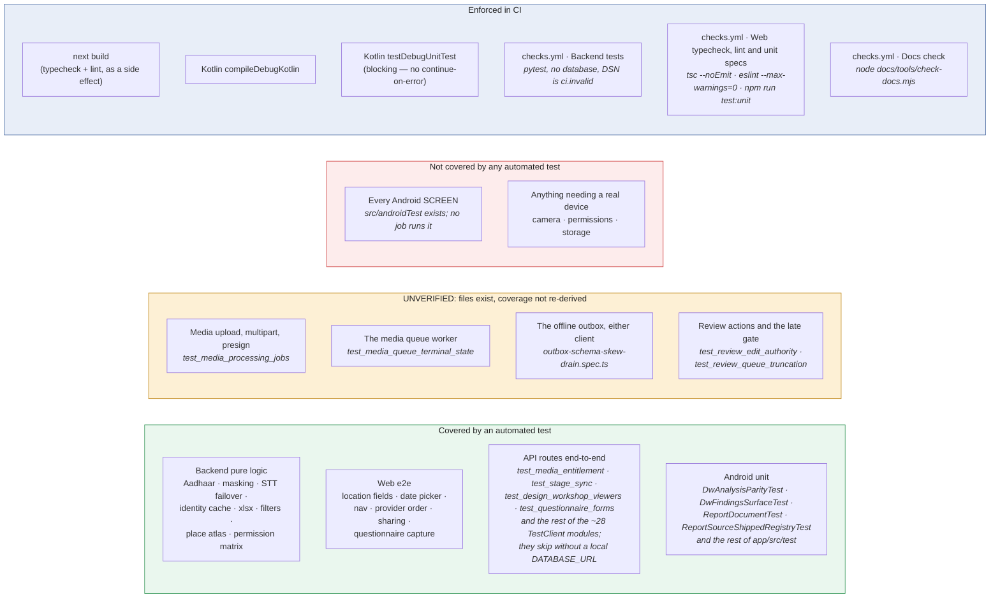

# QA audit — what is tested, what is not, and how this breaks

**Audit date: 2026-07-27.** Everything below is either a result measured on that date or a property
read out of the code on that date. Anything that could not be checked is marked **UNVERIFIED** rather
than asserted — a QA document that guesses is worse than no QA document.

Test counts, per surface, are generated into [REPO_FACTS.md](REPO_FACTS.md).

Sister documents: [CI.md](CI.md) for what runs automatically, [SECURITY.md](SECURITY.md) for the
security risk register, [SCALABILITY.md](SCALABILITY.md) for what breaks under load.

---

## 1. Test coverage, honestly



**Three coverage states, three colours, and `gated` is a fourth axis.** Green/amber/red are what a
test says about the code; blue is what CI says about the test, which is a different question — a
green node can sit in no CI job, and a blue one can gate something amber. `gated` used to be drawn in
the same amber this diagram now uses for UNVERIFIED, which is exactly the confusion the amber row
exists to prevent, so it moved to blue on 2026-08-20. **Nothing sits outside a subgraph**: a node
drawn in no colour reads as "nothing to worry about", and it is what an earlier edit did to the four
amber nodes when it removed them from *untested* without giving them anywhere to go.

> **§1 was left behind when §1.1 and §1.2 were corrected, and it is the part of this document a
> reader quotes. Retracted 2026-08-19, quoted rather than deleted, exactly as §1.2 does it.**
> It read:
>
> > **Measured 2026-07-27:** `python -m pytest -q` from `backend/` → **294 passed, 2 warnings,
> > 8.72 s**. The suite is fast because it is entirely **pure**: `backend/tests/conftest.py` does
> > nothing but put the backend root on `sys.path`. There is no database fixture, no test client, no
> > transaction rollback harness. […] **No test in this repository sends an HTTP request to a
> > route.**
>
> The three structural clauses are false. `backend/tests/` now holds roughly 110 modules, of which
> **~28 import `fastapi.testclient.TestClient` and drive real routes** — `test_media_entitlement`,
> `test_stage_sync`, `test_design_workshop_viewers`, `test_questionnaire_forms` and the rest. The old
> mermaid node **"Every API route end-to-end / no route test hits a database"** sat in the *untested*
> subgraph and has moved into *tested* above, where it names four of the modules rather than the area,
per the rule at the foot of this note. **The pass total is withdrawn rather than updated,
> because nobody has re-measured it on a comparable footing** — the number in `SESSION_HANDOVER.md`
> (1726 passed, 2 skipped, 2m55s) was measured against the compose stack, which is a different run
> from the one this line described.
>
> **Four more nodes left the *untested* subgraph and are NOT claimed as tested — they are claimed as
> UNVERIFIED, which is a different thing and the honest one.** The diagram used to carry "Media
> upload, multipart, presign", "The offline outbox, either client", "The media queue worker" and
> "Review actions and the late gate". Files now exist whose names answer three of the four —
> `backend/tests/test_media_processing_jobs.py`, `test_media_queue_terminal_state.py`,
> `test_review_edit_authority.py`, `test_review_queue_truncation.py`, and
> `frontend/e2e/outbox-schema-skew-drain.spec.ts` among the offline specs — so leaving them drawn in
> red would have been a second wrong picture. Whether each covers the whole of what its node named
> was not re-derived in the 2026-08-19 pass. **Re-derive it before promoting any of them to green**,
> and prefer naming the test to naming the area: an area shaded green is a claim nobody can check,
> which is how this diagram came to assert that no test hits a route.
>
> **The 2026-08-19 edit said this and then drew the four nodes in neither colour — corrected
> 2026-08-20.** Removing them from *untested* without an amber subgraph to receive them left them
> loose on the canvas, where a reader takes an uncoloured node as a settled one; the visible gap shrank
> from six items to two on a diagram whose whole job is to be honest about the gap. They are now in
> `unverified`, drawn amber, each carrying the file whose name answers it, and the amber block is the
> queue: **name the test that covers the node, or move the node back to red.**

**The shape of the suite, which is what the sentences above got wrong:**

There is **no shared database fixture and no transaction-rollback harness** — that much of the old
paragraph survives, and it is not the same claim as "no test touches a database". Each
database-backed module **guards itself**: it resolves `DATABASE_URL` at import and **skips unless
the URL names `localhost` or `127.0.0.1`**, with the reason spelled out on the mark ("needs a LOCAL
database; refuses to run against a remote `DATABASE_URL`"). **The refusal is aimed at a
`DATABASE_URL` naming a REMOTE host, not at `backend/.env`**: `.env` in this repository names the
local compose stack, `postgresql://…@127.0.0.1:55442/design_workshop`, so with `.env` present the
guard ADMITS and the database-backed modules attempt a connection — erroring once per test if nothing
is listening on that port, rather than skipping. **This paragraph said the opposite until
2026-08-20** ("`backend/.env` points at the live database, which is why that guard is a refusal
rather than a convenience"), and the reversal matters in both directions: it told a developer their
local run was skipping the database half when it was in fact erroring through it, and it told a
reader the guard was protecting production data that `.env` does not name. **The guard is still worth
having, for the reason the file itself gives**: `backend/.env` carries the compose value with an
instruction to replace it with a real database URL for any shared or deployed database, so on
somebody's machine it DOES name a live one — which is why the guard reads the host out of the
resolved DSN every run instead of trusting the file. Where the guard reads that value from is itself
under active change; read `backend/tests/conftest.py` rather than assuming, and
do not restate its contents here.

**Two consequences a reader planning work needs, in the order they will meet them:**

1. **The harness you would write a route test in already exists.** Copy `test_media_entitlement.py`:
   it creates its rows in a module-scoped fixture rather than inside a test, because the Prisma
   client is shared with the running app and bound to the `TestClient`'s event loop, and it acts as
   a **DESIGNER** rather than an admin on purpose — `owned_or_granted_where` is empty for Professor
   and above, so the same test written with the admin account passes against the unfixed code.
2. **A local stack listens on `55442`, not `5432`.** A run with `DATABASE_URL` pointing at
   `127.0.0.1` while nothing is listening does not skip — it **errors**, once per test. This has
   already cost this repository a session: a fixer reported "141 errors, nothing listening on 5432",
   concluded the suite was broken, and left the database-backed code it had just touched unexercised.
   The verifier re-ran it against the right port and got a clean run.

The permission matrix is still tested at the level of `can_review_record(reviewer, role)` *as well
as* at the route level, and both are worth having — that half of the old paragraph stands.

### 1.1 A trap in the pytest configuration — CLOSED 2026-08-12, and this section was DANGEROUSLY WRONG

> **What it used to say, and why it is quoted rather than deleted.** This section asserted that
> `pytest-asyncio` **is not installed**, that pytest warns `Unknown config option: asyncio_mode` on
> every run, and that "there are **zero** `async def test_` functions". It then offered a fix:
> *"either add `pytest-asyncio` to the dev dependencies, or delete the `asyncio_mode` line."*
>
> **Every factual clause was false, and the second branch of that fix is destructive.** Measured on
> 2026-08-12:
>
> - `grep -rn '^async def test_' backend/tests/` → **118**, not zero.
> - `backend/.venv/Lib/site-packages/pytest_asyncio-1.4.0.dist-info/` exists — the plugin **is**
>   installed, in the very interpreter §5 of this document tells you to use.
> - A `--collect-only` run gathers the suite with **no** `Unknown config option` warning, which is
>   itself proof the plugin is registered and the mode is live.
>
> So **deleting the `asyncio_mode` line would have silently stopped 118 tests from executing.**
> pytest would still collect them, emit a warning, and report green. That is precisely the invisible
> failure this section was written to prevent, prescribed as its own remedy, in the document a
> maintainer consults *before* touching test configuration. It is kept here because a register that
> quietly deletes its own bad advice teaches nobody, and because the shape of the error is worth
> recognising: it was true when written, and the suite grew past it.

**THE NARROWER HAZARD WAS REAL, AND IS NOW FIXED.** `pytest-asyncio` was present in `.venv` as a
transitive install but was **not declared** — `[project.optional-dependencies] dev` listed only
`ruff`, `pytest` and `httpx`. So the suite ran on every machine anybody had actually used, while a
clean `pip install -e '.[dev]'` on a fresh CI box or a new laptop produced an environment where those
118 tests were collected, skipped behind a warning, and reported as a pass.

It is now declared, with the reasoning at the dependency itself
(`backend/pyproject.toml`, `pytest-asyncio>=0.23`). **Do not delete `asyncio_mode = "auto"`**: it is
what makes those 118 tests run, and it is inert without the plugin, which is why the two belong in the
same commit and in the same paragraph.

### 1.2 Web end-to-end

`frontend/e2e/` holds Playwright specs (count in [REPO_FACTS.md](REPO_FACTS.md)) covering the areas
that were hardest to get right in the browser: location fields, the floating date picker, nav sheet
scrolling, provider ordering, sharing multi-select, questionnaire capture, searchable selects.

**How to run it, and what each variable is for, is in
[`frontend/e2e/README.md`](../frontend/e2e/README.md)** — one command, two variables. It is written
down because the suite spent a period being unrunnable for reasons that had nothing to do with the
product: presigned upload URLs naming a hostname only the docker network resolves, an unset
`NEXT_PUBLIC_API_URL` that made one spec query *production*, and specs opening records by ids copied
out of the production database. Those are fixed in `playwright.config.ts` and `e2e/support/`; the
README says why each default exists, so the next person does not rediscover them one red run at a
time.

There is also the older `frontend/scripts/pw-smoke.mjs`, a login-and-visit-every-page smoke script
(`PW_BASE`, `PW_EMAIL`, `PW_PASSWORD` from the shell).

~~**Neither runs in CI.**~~ **Half true as of 2026-08-20, and the half that changed is the half that
proves least.** `checks.yml`'s `Web typecheck, lint and unit specs` job runs `npm run test:unit`,
which is every `*-unit.spec.ts` except the two that navigate — `access-refusal-unit.spec.ts` and
`login-credential-floor-unit.spec.ts`, named here because "the two that navigate" is not something a
reader can grep for — pure functions, no dev server, no browser. §5's command block records how those
two fail, which is the test for whether a new spec belongs beside them. **Nothing runs a spec that drives a screen**, and `frontend/scripts/pw-smoke.mjs` is still
run by hand only. So the specs listed in the paragraph above — location fields, the date picker, nav
sheet scrolling, sharing multi-select — are exactly the ones CI does not touch. See §4.

> **Corrected:** the previous version of this document said the smoke run covered "all 11 protected
> pages". The `(protected)` tree now has far more than eleven route files, and no automated run
> visits all of them. The claim is withdrawn rather than updated, because nobody re-measured it.

### 1.3 Android

> **Retracted 2026-08-19, and quoted rather than deleted, per §1.1's convention.** This section
> read: "**No `src/test`, no `src/androidTest`.** `:app:testDebugUnitTest` is wired into CI and
> reports `NO-SOURCE`; the step prints a warning so a green tick is never mistaken for 'the tests
> passed'. The only real Android gate is that it **compiles**." Every clause of that is now false,
> and it stayed here after [REPO_FACTS.md](REPO_FACTS.md) had already been corrected on the same
> point — which is worth noticing: the generated file caught up and the prose beside it did not.

Both source sets exist; the counts are generated into [REPO_FACTS.md](REPO_FACTS.md) rather than
restated here. The unit suite is a **real gate**: the *Unit tests* step in
`.github/workflows/android-build.yml` branches on whether `app/src/test` holds Kotlin or Java
sources, takes the "running them for real" branch today, and carries no `continue-on-error` — so a
failing Kotlin test fails the workflow. The instrumented set is **not** run: it needs an emulator,
and the step's comment says to add a separate job with an emulator action rather than bolt one on.

The gates on Android are therefore: it compiles, and its unit tests pass. Lint is advisory (§4).

**What is still genuinely untested on Android is the UI and anything needing a device** — the
instrumented set exists but nothing runs it, so no automated check exercises a screen, a permission
prompt, the camera, or the offline outbox against real storage. That is the coverage gap; "no tests
at all" was the wrong shape of it, and the wrong shape sends someone to build a harness that is
already there.

---

## 2. Open failure modes, ranked

Ranked by what a user actually loses. Each row names where the mitigation lives, so "mitigated" can
be checked rather than believed.

### F1 — Media objects are readable by anyone with the URL · **open**

`media/*` is world-readable in the bucket policy. Object URLs sit in the database, in exports, and in
comments. A leaked URL is a permanent, unauthenticated read of an interview recording or a
photograph of a person.

*Impact:* the most serious data-exposure path in the system. *Mitigation:* none in code today; the
console actions are P0 in [SECURITY.md](SECURITY.md). Treat every media URL as public.

### F2 — `/docs`, `/redoc` and `/openapi.json` are publicly reachable · **fixed in tree, NOT deployed**

**Verified live, 2026-07-27:**

```
/health        200
/api/health    404      ← this path does not exist; see F8
/docs          200      ← unauthenticated
/redoc         200      ← unauthenticated
/openapi.json  200      ← 190 KB, every route and every field
```

The schema names every route, every query parameter and every field of every model, including the
ones behind admin-only roles. It is worth nothing to the researchers this app is for.

*Mitigation:* `BACKEND_EXPOSE_DOCS` now defaults to **false**, so the next backend deploy closes all
three. Until that deploy lands, they are open. Local development opts back in with
`BACKEND_EXPOSE_DOCS=true`.

### F3 — CloudFront → EC2 origin hop is plaintext HTTP · **open**

The viewer's TLS ends at CloudFront; the request crosses the AWS network to nginx on port 80 in the
clear, bearer token included. Risk P1 in [SECURITY.md](SECURITY.md), with the console fix.

### F4 — Upload 504 on slow links · **mitigated, depends on a console setting**

CloudFront's default origin response timeout is 30 s. A large upload that keeps the origin busy longer
than that returns 504 to the client even though the origin is working.

*Mitigation:* a single elected queue worker plus client-side retry, and the origin timeout raised in
the CloudFront console. The nginx side is already generous (`proxy_read_timeout 300s`,
`client_max_body_size 200M`, in `infra/terraform/user_data.sh`). **UNVERIFIED:** whether the console
value is currently ≥ 60 s cannot be read from this repository. Check it — [CDN.md](CDN.md) documents
the setting and the symptom.

### F5 — Pooler connection exhaustion · **mitigated, fragile**

*(Both incidents below were measured on Supabase, which hosted this deployment until 2026-08-22.
The root cause is connections-per-process multiplied by processes, which is provider-independent;
the specific ceiling that was hit was that provider's — see the open question in
[KUBERNETES.md](KUBERNETES.md).)*

Two distinct incidents, same root, both fixed:

- `DATABASE_CONNECTION_LIMIT` raised to 40 tripped the pooler's client ceiling (`EMAXCONN`) and
  crash-looped startup. It is back to **10 per worker** and must stay there.
- `--workers 2` ran a uvicorn supervisor that `SIGKILL`ed a busy child, orphaning its Prisma query
  engine, which kept holding pooler connections until every request 500'd. Now **one** web worker
  plus a separate `fieldrepo-queue` systemd unit.

*How it recurs:* anyone who "scales up" by adding a uvicorn worker or raising the connection limit
reproduces it exactly. The reasoning is a comment in `infra/terraform/user_data.sh` for that reason.

### F6 — Every list endpoint is slow · **partly fixed**

Measured on live production 2026-07-27, before the fix deployed: artisans 3.3 s, tools 4.6 s, search
8.9 s, dashboard 10.6 s. The cause is not row count — it is **relations resolved sequentially against
a cross-region database**, so cost tracks the number of relations. Full analysis in
[SCALABILITY.md](SCALABILITY.md), summary in [ARCHITECTURE.md §2.2](ARCHITECTURE.md).

*Mitigation:* relation loading is now waved (artisans 6→3-4 waves, tools 8→4-5, interviews 12→5-6),
and the 69-statement questionnaire save is down to 14. **UNVERIFIED:** the post-fix production
numbers. The improvements were measured on an isolated clone behind a 200 ms proxy, not on
production, and nobody has re-run the live table since deploying.

### F7 — Web auth token in `localStorage` · **accepted**

Any successful XSS on the frontend origin reads the token and impersonates the user for up to seven
days. There is no revocation. Risk P4 in [SECURITY.md](SECURITY.md); the fix is `HttpOnly` cookies
plus CSRF protection on both clients.

### F8 — `/api/health` does not exist · **documentation hazard, not a bug**

The health endpoints are `/health` and `/health/ready`, declared on the app rather than on the API
router, so they are **not** under the `/api` prefix. `/api/health` 404s.

This is listed as a failure mode because it has already produced a wrong measurement: a "154 ms API
floor" that was really the latency of a 404. Any monitor, uptime check or benchmark pointed at
`/api/health` is measuring nothing. The real floor is `/health` at ~129 ms.

### F9 — Android dataset download on API < 29 · **open, low reach**

The public-Downloads fallback needs `WRITE_EXTERNAL_STORAGE`, which is not requested, so saving fails
on Android 8–9. Caught and surfaced through `onError` rather than crashing. `minSdk` is 26, so those
devices are supported; most are API ≥ 29 and take the MediaStore path.

### F10 — Token expiry looks like a bug to users · **by design**

The JWT lasts `JWT_EXPIRES_MINUTES` (default 7 days) and cannot be revoked. A stale token yields 401,
which the user experiences as an unexplained error until they sign in again. A pre-login `/api/me`
401 in the console is benign.

### F11 — No direct SSH to the API box · **environmental**

Port 22 is blocked by the ISP on the development network. The box is managed through GitHub Actions
and AWS SSM Session Manager. Not a defect; it is a fact that shapes every runbook here.

---

## 3. Regressions found and fixed in this cycle

Kept because the shape of a bug is the best predictor of the next one, and because two of these were
*documented as working* while broken.

| # | Symptom | Root cause | Class |
|---|---|---|---|
| R1 | The offline outbox **duplicated a record on every sync pass** while the signal stayed bad | A replay was create-then-upload with no write-back, so a pass that died during the media upload re-created the record. Now `created` / `createdId` / `uploadedBatches` are written back per step. | data loss / duplication |
| R2 | The outbox **deleted the record and its photographs** and reported success | A 409 was read as "already saved, we lost the response". No endpoint means that: 409 from `/artisans` is a clashing Aadhaar, from `/crafts` a name clash, from `/questionnaire/interviews` an existing artisan set. Now surfaced as a conflict with everything kept. | **silent data loss** |
| R3 | Every text search 500'd | A pasted NUL byte reached Postgres. | availability |
| R4 | "Show in folders" 500'd for every questionnaire recording | Data-browser path resolution. | availability |
| R5 | Aadhaar numbers leaked into shared surfaces | Masking was applied at call sites rather than at the encoder. Now `mask_aadhaar` at the encoder. | **PII disclosure** |
| R6 | Non-Latin artisan names broke the data browser, then broke downloads when kept | Name handling in path construction. | correctness |
| R7 | Approving a pending questionnaire 500'd | | availability |
| R8 | A second dashboard total kept the first one's filter (Android) | | correctness |

R1 and R2 are the two to internalise: **both were in the code path that exists specifically to
prevent data loss**, both were invisible to the user, and both had the worst possible timing — they
fired precisely when the network was bad, which is the only reason the entry was queued at all.

---

## 4. What CI does not gate

From [CI.md](CI.md), restated here because a QA document should say plainly what is not checked:

**Four rows left this table on 2026-08-20**, when `.github/workflows/checks.yml` landed with three
jobs — `Backend tests`, `Web typecheck, lint and unit specs`, `Docs check` — on every pull request
and every push to `main`, with no `paths:` filter. They are struck rather than deleted, because each
was quoted onward and a reader meeting the quote needs to find the retraction. **Read the caveat
under the table before treating any of them as closed.**

| Not gated | Consequence |
|---|---|
| ~~**Backend tests**~~ | ~~Not in any workflow — `grep -rn pytest .github/workflows/*.yml` is empty.~~ **Struck 2026-08-20.** That grep now returns `checks.yml`. The `Backend tests` job runs the whole suite with a `ci.invalid` DSN, so the database-backed modules skip by design: 2862 passed, 381 skipped. The ~28 modules that need Postgres are still ungated, and adding a service container is a separate decision (§1). |
| ~~**Web e2e / smoke**~~ | ~~Playwright specs exist and nothing runs them.~~ **Half struck 2026-08-20.** `npm run test:unit` runs the `*-unit.spec.ts` selection — minus two files excluded by name — in the `Web typecheck, lint and unit specs` job: no dev server, no browser download, seconds not minutes. **No total is written here on purpose**; this row said "536 tests" after the number had moved, and Playwright prints the count in the step's own log every run. **The server-dependent specs and `frontend/scripts/pw-smoke.mjs` are still gated by nothing**, and they are the ones that drive screens. |
| ~~**Web typecheck / lint as a separate step**~~ | ~~`next build` fails on TS and ESLint errors … but it fails **after the backend has already deployed**.~~ **Struck 2026-08-20.** The same job runs `npx tsc --noEmit` and `npx eslint . --max-warnings=0` on the PR, before any deploy. |
| **Android lint** | Advisory. One pre-existing error (`PermissionImpliesUnsupportedChromeOsHardware` — `CAMERA` with no matching optional `<uses-feature>`) would fail every run if it were a gate. |
| ~~**Android tests**~~ | ~~None exist.~~ **This row is wrong and is struck rather than removed, because it was quoted onward.** The Android unit suite is a gate (§1.3). What is not gated is the **instrumented** set — it exists and needs an emulator, and no job provides one. |
| ~~**The documentation checker**~~ | ~~`node docs/tools/check-docs.mjs` runs in no workflow.~~ **Struck 2026-08-20**: it is the `Docs check` job. |
| **Anything on `main` after the merge button** | **This is the row the other four turned into, and it is the one to read.** `checks.yml` is a workflow of its own; GitHub cannot `needs:` across workflow files, so `deploy-backend.yml` and `deploy-frontend.yml` — both on `push: branches: [main]` — start alongside a red Checks run rather than behind it. Until the three job names above are added as **required status checks in branch protection**, which is repository configuration and lives nowhere in this repository, a commit that breaks the backend suite still ships. |

**The recommendation this section used to make is done, differently, and the difference is the
point.** It said: add `cd backend && python -m pytest -q` as a job that stage 1 `needs:`. A `needs:`
inside `deploy-backend.yml` only ever runs on `push: main` — i.e. after the merge — so it would never
have run on a pull request, which is where the carry-table drift this repository fears actually gets
introduced. A separate workflow runs on both. The cost is the row directly above: it advises, it does
not block, until somebody configures branch protection.

The old reasoning for why the job is cheap was also wrong and is not to be restated: it said "the
suite is pure and runs in nine seconds — it needs no database", and later that "a runner with no
`DATABASE_URL` runs the pure core and skips the rest". Neither holds. `Settings` requires
`DATABASE_URL`, `JWT_SECRET`, three AWS values and `MASTER_ADMIN_EMAIL`, so an empty environment
gives 70 collection errors, not skips — which is why `checks.yml` exports deliberately unusable
placeholders including a `.invalid` DSN. Giving that job a Postgres service would exercise the ~28
database-backed modules as well and is a second, larger decision.

---

## 5. How to reproduce the checks in this document

```bash
# Backend suite. NOT "pure, no database, ~9s" — that comment was three weeks out of date. The core
# is pure; ~28 modules drive routes against Postgres and skip themselves unless DATABASE_URL names
# localhost or 127.0.0.1.
#
# NOT EXPORTING DATABASE_URL DOES NOT GIVE YOU THE PURE CORE. This comment said it did until
# 2026-08-20 and it is wrong twice over. (a) conftest.py resolves the DSN out of backend/.env before
# any test module imports, and .env names 127.0.0.1:55442 — so the guard ADMITS, and with the compose
# stack down the database half ERRORS once per test instead of skipping. (b) With .env genuinely
# absent as well, `Settings` still requires DATABASE_URL, JWT_SECRET, three AWS values and
# MASTER_ADMIN_EMAIL, so 70 modules fail at COLLECTION and only ~1244 tests are gathered. The two
# honest runs are: start the stack (below), or export the unusable placeholders checks.yml uses.
# PYTHONUTF8=1 matters: schema.prisma holds box-drawing characters that cp1252 cannot encode.
PYTHONUTF8=1 python -m pytest -q          # from backend/, with ./.venv/Scripts/python.exe

# The database half taken OUT, the way CI does it: a DSN the guard reads as remote and can never
# resolve. Measured under exactly this environment: 2862 passed, 381 skipped, 0 failed, ~5 min.
# Watch the SKIP count, not the pass count — if it collapses toward zero with no database present,
# a gate has been inverted and the run is testing far less than its green tick claims.
DATABASE_URL=postgresql://ci:ci@ci.invalid:5432/no_such_database JWT_SECRET=… PYTHONUTF8=1 \
  python -m pytest -q                     # see .github/workflows/checks.yml for the full env block

# The same suite WITH the database half. Needs the compose stack; note the port is 55442, not 5432 —
# checking 5432 and concluding "nothing is listening" has already cost this repository a session.
docker compose --profile api up -d postgres
DATABASE_URL=postgresql://…@127.0.0.1:55442/… PYTHONUTF8=1 python -m pytest -q

# Backend lint. `.`, not `app` — that is what the `Lint the backend with ruff` step in
# checks.yml gates on, and the difference is most of it: measured 2026-08-22, 31 of the 37
# findings named in the dated baseline in backend/pyproject.toml live under `backend/tests/`,
# which `check app` never visits. That baseline is what keeps `check .` green; if it goes red,
# read the baseline's own header before touching `ignore`.
cd backend && ./.venv/Scripts/ruff.exe check .

# Web typecheck and lint. CI runs eslint with --max-warnings=0; run it that way or you will not see
# what the `web` job sees.
cd frontend && npx tsc --noEmit && npx eslint . --max-warnings=0

# The web specs that need NO dev server and NO browser download: every `*-unit.spec.ts` except
# access-refusal-unit.spec.ts and login-credential-floor-unit.spec.ts, which are excluded by name.
# NO TOTAL IS PRINTED HERE ON PURPOSE — this line carried "536 tests in ~31 s" past the day that
# stopped being true, and Playwright prints "N passed" itself on every run. The selection lives in
# package.json's `test:unit`, and the reasoning for it is in the `Unit specs` step of checks.yml,
# because package.json cannot hold a comment.
cd frontend && npm run test:unit

# If you drop the exclusion and run the whole `*-unit.spec.ts` pattern, the two excluded files fail
# and the rest are green. WHAT THEY FAIL WITH IS THE RULE, so read it rather than the count: every
# failure is inside `page.goto` with `net::ERR_CONNECTION_REFUSED at http://localhost:3000/login`.
# Connection refused (or a navigation timeout, where something answers :3000 but does not serve) is
# a spec asking for a dev server, and that spec is misnamed and belongs on the exclusion list. A
# failing `expect(source).toContain(…)` is NOT that: those assertions inspect source for a symbol a
# component is supposed to have, no dev server would change the answer, and excluding one would be
# silencing the check rather than scoping it. Measured 2026-08-20 with nothing listening on :3000.
cd frontend && npx playwright test ".*-unit\.spec\.ts"

# Android compiles, and its unit tests run.
cd android && ./gradlew :app:compileDebugKotlin -q
cd android && ./gradlew :app:testDebugUnitTest --console=plain

# Documentation itself: paths, citations, count drift, and role-ladder parity across the two clients.
# Run it on a CLEAN tree: REPO_FACTS.md's line counts are read off disk, so regenerating from a dirty
# working copy writes uncommitted lines into the column that promises to be reproducible from a clone.
node docs/tools/check-docs.mjs

# The live surface claims in F2 and F8. READ-ONLY — safe against production.
for u in /health /api/health /docs /redoc /openapi.json; do
  printf "%-16s " "$u"
  curl -s -o /dev/null -w "%{http_code}  %{time_total}s\n" "https://d2b34i3e92al6i.cloudfront.net$u"
done
```

**Never** point a write test at production. `backend/.env` in this tree names the local compose stack
(`127.0.0.1:55442`), but the file's own comment beside it tells the reader to replace it for any
shared or deployed database — so the value on the machine in front of you is whatever the last person
set, and it is not safe to assume. **Read the DSN before running anything that writes**: a test that
writes, migrates, or enables the media queue worker writes to whatever that string names, and against
the live database that is real field data. This paragraph asserted flatly that `.env` *is* the live
database until 2026-08-20, which is the more dangerous of the two errors it could make — it teaches a
reader that the local run is the risky one and the CI run is the safe one, when the file on this tree
is local and the guard in `conftest.py` is what actually decides.

---

## How this document is kept true

The failure of a QA document is that it describes the state of the world on the day it was written
and then stops. Two defences:

1. **Every claim carries a date or a command.** §1's pass count is dated and reproducible in nine
   seconds. §2's F2 and F8 are reproducible with the `curl` loop in §5. Anything neither dated nor
   reproducible is marked **UNVERIFIED**, and there are three of those (F4's console timeout, F6's
   post-fix production numbers, and any Android runtime claim).
2. **A row leaves §2 only when someone re-runs its check.** "Mitigated" states where the mitigation
   lives so the claim can be checked; "fixed in tree, not deployed" is its own status because the
   difference matters operationally and is the state F2 is in right now.

| Section | Re-check by |
|---|---|
| §1 counts and pass total | `node docs/tools/check-docs.mjs --write` regenerates the counts (on a CLEAN tree — its line counts are read off disk). Re-run pytest and **re-date** the pass total, saying which `DATABASE_URL` it ran with: the same command answers two very different numbers depending on whether the ~28 database-backed modules skip or run, and an undated, unqualified total is what left "294 passed" standing for three weeks. |
| §1's **structural** claims — "entirely pure", "no test client", "no route test" | **Not a count, and the checker cannot see them, which is exactly how they rotted.** `grep -rl TestClient backend/tests/ \| wc -l` settles the second and third in one command. Treat any absolute of the form "no test in this repository does X" as a claim with a shelf life; the mermaid diagram is the worst place for one, because a reader takes a picture as a summary rather than as a dated measurement. |
| §1.1 the pytest-asyncio trap | Gone when `grep asyncio_mode backend/pyproject.toml` returns nothing, or `pytest-asyncio` appears in the dev dependencies. |
| §2 F2, F8 | The `curl` loop in §5. F2 closes on the first backend deploy carrying the `BACKEND_EXPOSE_DOCS` default. |
| §2 F5 | `grep -n "workers\|connection_limit" infra/terraform/user_data.sh backend/app/core/db.py`. |
| §2 F6 | Re-run the latency table in [ARCHITECTURE.md §2.1](ARCHITECTURE.md) and **date it**. |
| §3 regressions | Historical. Append, never edit — the value is the pattern, not the current state. |
| §4 CI gates | `.github/workflows/*.yml`. A new job means a row leaves this table — **four left on 2026-08-20 when `checks.yml` landed, and the rule caught it late**: the workflow and the table describing a repository without it were written in the same wave. Strike, do not delete: every one of these rows has been quoted into another document. And check the row the four became — a job that runs is not the same claim as a job that blocks, and `deploy-*.yml` cannot `needs:` across a workflow file. |
| §1's mermaid diagram | Three coverage colours and one enforcement colour, and **every node inside a subgraph**. A node with no colour reads as settled; that is what an edit on 2026-08-19 did to four nodes it had just declared UNVERIFIED. Prefer naming the test file to naming the area: green over an area is a claim nobody can check. `R1` and `K1` were converted from area labels to named harnesses on 2026-08-20; **`B1` and `E1` are still area labels** and are the remaining queue — convert each when somebody re-derives what actually covers it, not by guessing filenames. |

**Review trigger:** every production deploy, plus any change under `backend/tests/`,
`frontend/e2e/`, or `.github/workflows/`.

**Audit cadence:** re-walk §2 top to bottom before each field deployment. That is the moment the cost
of a stale entry is highest — a researcher 300 km from a signal cannot read a mitigation that turned
out not to be in place.
