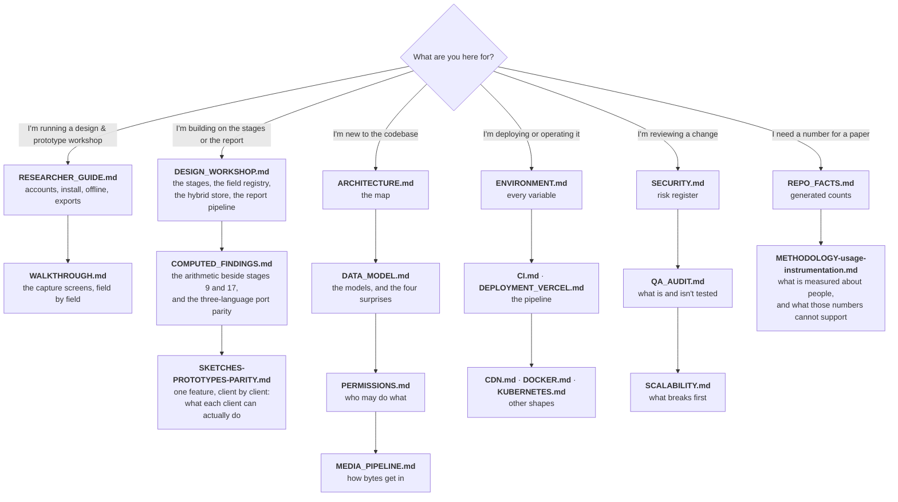

# Documentation

Start here. Every document below states, in its own final section, **how it is kept true** — what
regenerates it, what to diff it against, and which changes should trigger a human re-read. A document
with no such section does not meet the bar and is listed as a gap.

---

## Where to start, by what you are doing



---

## Every document

### The design team

| Document | Answers | Audience |
|---|---|---|
| [RESEARCHER_GUIDE.md](RESEARCHER_GUIDE.md) | How do I get an account, install the app, work with no signal, and get my data back out? | Craft and textile designers |
| [WALKTHROUGH.md](WALKTHROUGH.md) | What does each capture screen ask for, and in what order? | Same. Also mirrored in-app at `/guide` |

### The system

| Document | Answers |
|---|---|
| [DESIGN_WORKSHOP.md](DESIGN_WORKSHOP.md) | The product itself: the numbered workshop stages, the three capture tiers and the completeness gate, why the fields are data rather than columns, the promoted-column index over the stage JSON, the report pipeline and its templates, how a child collection prints under its parent, offline generation on the phone, and what the server-side PDF cannot do |
| [COMPUTED_FINDINGS.md](COMPUTED_FINDINGS.md) | The arithmetic that checks a designer's stage-9 and stage-17 conclusions against the rows underneath them: the sample floors, the verdict vocabularies, why nothing is ever auto-corrected, and the port-parity rules that keep three implementations equal to the rupee |
| [SKETCHES-PROTOTYPES-PARITY.md](SKETCHES-PROTOTYPES-PARITY.md) | One feature, client by client: what a designer can actually do with a sketch or a prototype on the web and on the handset, every row cited to a symbol, every gap marked deliberate or not — so that the comparison stops being re-derived by hand, and stops being wrong |
| [ARCHITECTURE.md](ARCHITECTURE.md) | What are the pieces, how does a request travel, where is the latency, how does transcription fail over, how does the offline outbox replay? |
| [DATA_MODEL.md](DATA_MODEL.md) | What is stored, how does it relate, and which four parts of the schema are not what they look like? |
| [PERMISSIONS.md](PERMISSIONS.md) | The **eight**-tier role ladder, the full capability matrix, the review state machine, the late-submission gate, and the **five** access systems layered on top — including the design-workshop viewer grant, the questionnaire visibility that follows it, and the read-only inspector scope the `INSPECTOR` tier reaches a workshop through (§4.5, added 2026-08-27; this row said “four” until that day) |
| [MEDIA_PIPELINE.md](MEDIA_PIPELINE.md) | Every tactic both clients use to get a photograph off a phone on a bad network without losing it, and the on-device quality checks that run before it leaves |
| [EDGE-COMPUTE-SPLIT.md](EDGE-COMPUTE-SPLIT.md) | Which work runs on the machine a designer is holding and which needs the server, feature by feature — the measurement paths, sketch rectification, the vendored tracer — and what is still doable with no signal |
| [SECURITY.md](SECURITY.md) | Transport, secrets, PII and Aadhaar handling, the authorisation model's security properties, and the open risk register |
| [SECURITY-REVIEW-2026-08-22.md](SECURITY-REVIEW-2026-08-22.md) | A point-in-time adversarial review of the 2026-08-22/23 change set: five ranked findings, the categories checked and found clean, and what the review could not verify |

### Operating it

| Document | Answers |
|---|---|
| [ENVIRONMENT.md](ENVIRONMENT.md) | Every environment variable, per service: required? default? secret? what breaks without it? |
| [CI.md](CI.md) | What happens on a push to `main`, in what order, and why the order is a dependency |
| [DEPLOYMENT_VERCEL.md](DEPLOYMENT_VERCEL.md) | The web deploy, and the two traps that ship a green pipeline over a broken site |
| [CDN.md](CDN.md) | CloudFront caching, the origin timeout that has already broken this system, and the invalidation runbook |
| [DOCKER.md](DOCKER.md) | Running the whole stack in containers |
| [KUBERNETES.md](KUBERNETES.md) | Running it on a cluster, and the connection ceiling that governs how far it scales |

### Getting the data out

| Document | Answers |
|---|---|
| [DATASET_API.md](DATASET_API.md) | Mass download for a **machine** — the `dataset:read` token, the catalogue, the streamed `.ndjson` / `.csv` with no row cap, and how artisan identity numbers are masked |

### Engineering results

| Document | Answers |
|---|---|
| [SCALABILITY.md](SCALABILITY.md) | What breaks first, what it costs to fix, and the measured finding that relations — not rows — drive the latency |
| [QA_AUDIT.md](QA_AUDIT.md) | What is tested, what is not, the open failure modes, and the regressions that were documented as working while broken |
| [TESTING-E2E-LOCAL.md](TESTING-E2E-LOCAL.md) | The order of commands that actually makes the browser suite runnable on a developer machine, and the four environment failures that impersonate product bugs |
| [AI_FEATURES.md](AI_FEATURES.md) | Background removal, layer separation, vectorisation: providers, costs, and how to turn one on |
| [RESEARCH_NOTES.md](RESEARCH_NOTES.md) | The measurement write-ups behind the engineering results |
| [REPO_FACTS.md](REPO_FACTS.md) | **Generated.** Model and enum counts, the API surface, the role ladder, test counts, code volume |
| [METHODOLOGY-usage-instrumentation.md](METHODOLOGY-usage-instrumentation.md) | How platform use is measured — one row per served request, the route template and never the path — who may read it, and the ten conclusions these numbers **cannot** support. The note to quote beside a figure in a paper; `GET /api/usage/collection` is its machine-readable half and wins where the two disagree |

### Findings registers

Two documents record what is **wrong** rather than how something works. They are separate on
purpose and the difference decides which one you write in.

| Document | Answers |
|---|---|
| [OPEN_FINDINGS.md](OPEN_FINDINGS.md) | The short, wholly actionable register: defects that have been through the fix-and-pin cycle, each with the test that pins it. Its header carries the open/closed counts, and its own worst failure has twice been an inaccurate count in that header |
| [AUDIT-2026-08-15.md](AUDIT-2026-08-15.md) | A dated, frozen snapshot: the 2026-08-15 correctness audit of frontend, backend and Android, every finding anchored to a `file:line` in the tree **as it stood that day** and put through an adversarial verification pass. Its line pins are the record and are never re-pinned; closures are appended as dated `CLOSED` paragraphs. Items move from here into `OPEN_FINDINGS.md` when they are taken on |

### Decisions

Each records a choice, the argument for it, and — where it was later reversed — the losing argument
kept in full, because a decision record that deletes the case it lost is worse than no record.

| Document | The decision |
|---|---|
| [DECISION-identity-card-ocr-on-android.md](DECISION-identity-card-ocr-on-android.md) | Whether to bundle an on-device text recogniser to read an Aadhaar card on the handset. Argued no, on APK cost; **reversed by the user, and the recogniser ships** |
| [DECISION-identity-card-ocr-on-web.md](DECISION-identity-card-ocr-on-web.md) | The same capability in the browser: no recogniser is bundled, lazily imported or fetched. The browser reads the card where it already can, through the Shape Detection API; everywhere else the server route does it |
| [DECISION-qr-scanning-on-android.md](DECISION-qr-scanning-on-android.md) | Which QR decoder the handset uses, and the history of changing that answer twice. **Built:** ZXing, on both read surfaces, with the typed box never hidden |
| [DECISION-photo-geometry-over-vision-measurement.md](DECISION-photo-geometry-over-vision-measurement.md) | Which of the two ways to measure a record's dimensions off a photograph is offered first. The deterministic on-device geometry becomes primary — free, offline, re-derivable, with an error bar — and the vision model is kept as a labelled fallback. **Built:** the Android adapter, deliberately unwired, with the two mounts written out |
| [DECISION-usage-consent-at-sign-in.md](DECISION-usage-consent-at-sign-in.md) | The consent flow itself: a blocking agreement at sign-in, which is a **condition of access** and therefore not freely-given consent — so the system stores the CIRCUMSTANCE beside the answer rather than filing a turnstile as a free choice. **Built:** four columns, an append-only decision log, a versioned notice, a withdrawal that deletes what was collected and costs nothing, and a gate that ADMITS the sign-in and reports rather than refusing (a 403 before the token is minted is a gate nobody can get through). Read this before the note below it |
| [DECISION-usage-consent-default.md](DECISION-usage-consent-default.md) | What is recorded about a designer's navigation **before anybody has been asked**, in a codebase that already gates an artisan's recorded voice behind a three-state answer. Three options were written out so the choice is visible; **built:** the middle one — the request is kept, the identity is dropped, and every row says truthfully that nobody was asked. One line changes it |
| [SALVAGED-BRANCHES-SUPERSEDED.md](SALVAGED-BRANCHES-SUPERSEDED.md) | Four `worktree-*` branches that look like unmerged feature work. Merging any of them regresses `main`; the table says why, branch by branch |
| [PLAN-AI-TIERS-AND-CUSTOM-SECTIONS.md](PLAN-AI-TIERS-AND-CUSTOM-SECTIONS.md) | The three-tier AI plan and designer-defined sections. **Agreed in principle, not started** — and half of it is "stop building what already exists" |

### Measurements

Numbers taken off real hardware or real builds, kept apart from the documents that quote them so a
figure has exactly one home. Every one of them states what was measured, when, and with what — and
spells an unmeasured cell **unmeasured** rather than filling it from a spec sheet.

| Document | What was measured |
|---|---|
| [DEVICE-TIER-MEASUREMENT.md](DEVICE-TIER-MEASUREMENT.md) | What each class of handset can actually run, through this app's own device-tier probe on the fleet's phone |
| [TIER2-LANGUAGE-MODEL-MEASUREMENT.md](TIER2-LANGUAGE-MODEL-MEASUREMENT.md) | The on-device language model: what it costs and what it does on that handset |
| [ASR-RUNTIME-MEASUREMENT.md](ASR-RUNTIME-MEASUREMENT.md) | The offline speech runtime weighed across eight real release builds — and why it is not in the build |
| [DICTATION-LANGUAGE-PACK-MEASUREMENT.md](DICTATION-LANGUAGE-PACK-MEASUREMENT.md) | Which speech language packs the handset will actually admit to downloading, from raw logcat, read twice four days apart |
| [DICTATION-DEVICE-VERIFICATION.md](DICTATION-DEVICE-VERIFICATION.md) | The microphone `ERROR_LANGUAGE_UNAVAILABLE` fix, verified on a Samsung SM-M325F rather than reasoned about |
| [R8-MEASUREMENT.md](R8-MEASUREMENT.md) | What R8 shrinking takes off the release APK, both builds run on an idle machine |

### The offline speech model

Three documents about one capability, split by which half of it they specify.

| Document | Answers |
|---|---|
| [ASR-RUNTIME-DOWNLOAD-CONTRACT.md](ASR-RUNTIME-DOWNLOAD-CONTRACT.md) | The client half: what the handset expects of an opt-in install, written as a specification for the server half before it existed |
| [ASR-MODEL-HOSTING.md](ASR-MODEL-HOSTING.md) | The server half, as built: what an operator does to host the model and what the endpoint promises |
| [ASR-MODEL-SIDELOAD.md](ASR-MODEL-SIDELOAD.md) | Getting the model onto a phone with a cable, for a handset with no data allowance. Same fingerprint check as a download, because it is the same code |

### One-offs worth keeping

| Document | Answers |
|---|---|
| [REPORT-DATA-WIRING.md](REPORT-DATA-WIRING.md) | The read-only research behind wiring artisan, product, process, tool and questionnaire data into the report. Notable for having had its `file:line` pins **removed** when they rotted — the episode that produced the checker's citation-drift test |
| [STALE-IMAGE-TRAP.md](STALE-IMAGE-TRAP.md) | Two incidents in one day where the code was correct and the running container was not. Written down because the third will look different and cost the same hour |
| [MARKET_RESEARCH.md](MARKET_RESEARCH.md) | The fourth, **dormant** capability of `backend/app/ai_features/`: finding what comparable products cost and who sells them. Off by default; a fresh clone behaves exactly as it did before it existed |

### Reference, not specification

These two describe something other than this checkout's current behaviour, and each says so in its
own opening lines. They are listed because everything in `docs/` is listed — a rule this page used
to call "the one failure mode this index cannot check for itself" while being wrong about nineteen
other documents, and which `docs/tools/check-docs.mjs` has enforced since 2026-08-22.

| Document | What it actually is |
|---|---|
| `TRANSCRIPTION_SERVICE.md` *(local-only — gitignored, see `.gitignore`; not present in a clone)* | A **portable pattern reference** for rebuilding queued audio transcription in another project. For this deployment's live provider chain, read [ARCHITECTURE.md](ARCHITECTURE.md) instead |
| [DESIGN-claude.md](DESIGN-claude.md) | A design-system extraction of an **external** product surface, kept as a visual-language reference. It is not a specification of this app's UI |

Also in the repository, outside `docs/`: [`../README.md`](../README.md) (orientation and local
setup) and [`../backend/DEPLOY_AWS.md`](../backend/DEPLOY_AWS.md) (the EC2/S3/CloudFront runbook).

---

## The rule about counts

**No hand-written document in this set states a count.** Not the number of models, not the number of
endpoints, not lines of code. Those all live in [REPO_FACTS.md](REPO_FACTS.md), which is generated
from the working tree, and prose links to it.

The reason is that a count is wrong the first time anybody adds a table, and it is wrong *silently* —
nothing about "32 models" looks stale. Centralising them means a migration makes exactly one file
wrong, and one command makes it right:

```bash
node docs/tools/check-docs.mjs --write
```

If you find a count written into prose anywhere in this set, that is a bug in the documentation, not
a detail to update.

---

## The checker

```bash
node docs/tools/check-docs.mjs           # verify — exit 1 on any failure
node docs/tools/check-docs.mjs --write   # regenerate REPO_FACTS.md, then verify
node docs/tools/check-docs.mjs --quiet   # failures only
```

It verifies the four things about documentation that *can* be verified:

| Check | Catches |
|---|---|
| **Generated counts are current** | A migration or a new route that nobody re-ran the generator for |
| **Every repository path mentioned exists** | A service or component path that a rename left behind. Paths resolve against the repo root and against `backend/`, `frontend/`, `android/`, because a runbook writes commands from the directory it told you to be in |
| **Line citations land inside their file** | `media.py:198-264` after the file shrank. It also *counts* citations per document and warns, because a citation that still fits is only possibly right — the durable fix is to cite symbol names |
| **The backend and web role ladders agree** | `ROLE_RANK` drifting between `backend/app/core/deps.py` and `frontend/lib/permissions.ts`. This is the one genuine correctness check in the set |
| **Every document has a maintenance section** | A new document shipping with no story for how it stays true |
| **Every document in `docs/` is listed on this page** | The one failure mode an index cannot check by reading itself. It was wrong by nineteen documents — including the 2026-08-15 audit and the open-findings register — while the section below claimed the opposite in as many words |
| **The handset's compiled-in API host matches the document that describes it** | `android/app/build.gradle.kts`'s `apiBaseUrl` default is a deploy target written as a string literal. The check ties it to [ENVIRONMENT.md](ENVIRONMENT.md)'s infrastructure table in **both** directions: while the two name different CloudFront distributions the document must carry the dated open question, and once they agree that block must be gone |
| **Mermaid blocks are structurally sane** | An unclosed fence, a block with no diagram type, and the specific bug that broke a diagram here: a **semicolon inside a sequence-diagram message**, which Mermaid reads as a statement separator so everything after it parses as a new statement and the whole diagram renders as a red error box |

It deliberately does **not** check whether a sentence is true. Nothing can. That is what each
document's own maintenance table is for.

**Mermaid, for certainty.** The lint above is structural. A real parse needs `mermaid` itself, which
is not a dependency of this repository, so it is run out-of-tree when diagrams change:

```bash
mkdir /tmp/mmd && cd /tmp/mmd && npm init -y && npm i mermaid jsdom
# Set window/document/DOMParser/Element/Node/HTMLElement/SVGElement/NodeFilter/getComputedStyle
# from a JSDOM instance, then for each fenced block:  await mermaid.parse(block)
```

Two things that run found and the structural lint would not have: a semicolon inside a sequence
message, and HTML entities (`&lt;`) inside one. **Normalise CRLF before matching** — half these files
are CRLF, and a `\n`-anchored regex silently finds zero blocks in them, which is exactly how ten
diagrams went unvalidated while the run looked green.

**Every mermaid block in this documentation set parsed on the last out-of-tree run, 2026-08-07** —
`mermaid.parse` against a JSDOM global, over every fenced block in `docs/*.md` and `../README.md`,
zero failures. The block *count* is deliberately not written here: the checker prints it on every
run, and a number in this paragraph would be wrong the next time anybody draws a diagram.

Findings in documents owned by another workstream are reported as **warnings**, not failures, so the
exit code speaks for the documents whose owner can act on it.

---

## Built, and not in any document here

A great deal landed faster than this set could absorb it. The modules below are **not covered by any
document above**, and listing them is the least dishonest thing to do about that: an undocumented
module is invisible to the checker, to a new reader, and to the review triggers that are supposed to
catch drift.

Every one of them carries a substantial module docstring or file header, and **that header is the
interim source of truth** — this repository's convention is that the reasoning lives next to the
code, so the gap is a discoverability gap rather than an explanation gap. The third column is the
thing a document would otherwise be relied on to tell you, and it was checked rather than assumed.

### Frontend — `frontend/lib/`

| Module | What it is | Surfaced? |
|---|---|---|
| `derivedFields.ts` | Client-side re-computation of `DAYS_BETWEEN` / `PRODUCT` / `SUM` fields, so a derived value appears in the frame the designer types the last input. A port of `stage_schema.derive_value`, never a second opinion | Yes — `FieldInput.tsx` |
| `photoIntake.ts` | Ranks which stage, entity and row a bulk-uploaded photograph belongs to, from its EXIF wall clock against the registry's DATE anchors. Refuses beyond a grace window rather than guessing; never drops a file | Yes — the workshop's photos page |
| `photoMeasure.ts` | Proposes a real-world dimension from a photograph, by same-plane pixel ratio or by four-corner homography, **always with an error bar** — and returns a typed refusal, carrying no value at all, wherever it cannot stand behind a number | Yes — `PhotoMeasureField` |
| `sketchRectify.ts` | Perspective-corrects a photographed sketch and extracts line art by Sauvola thresholding, into a **different** registry field. The original is never touched | Yes — `SketchRectifyField` |
| `qrEncode.ts` | A dependency-free ISO 18004 QR encoder, alphanumeric mode only — partly so that an arbitrary string, including a person's name, cannot get into a code | Yes — the workshop codes page |
| `qrDecode.ts` | The reader, sharing every table with `qrEncode.ts` so the two halves cannot disagree. Detects a symbol in a photograph — skew, glare, a code that is a small part of a large frame — and repairs it with Reed-Solomon. Pure: no DOM, so it is testable without a browser | Yes — via `qrImageDecode.ts` |
| `qrImageDecode.ts` | The browser half: a File, a dropped or pasted picture, or a video frame in; a decoded string or a sentence naming the next action out. Bounds the work, then re-cuts the located symbol out of the full-resolution original. `BarcodeDetector` is a fast path where it exists and is **never** required | Yes — `WorkshopCodeScanner` |
| `workshopCodes.ts` | The printed-code grammar and its anti-PII gate; the check character is a typo detector and explicitly not a signature | Yes — code sheet and scanner |
| `workshopSearch.ts` | An offline prefix index over a whole workshop draft, plus the `?find=`/`&row=` stage-focus URL contract. Same `\p{M}` tokeniser argument as [COMPUTED_FINDINGS.md](COMPUTED_FINDINGS.md) §2.7 | Yes — workshop page and stage form |
| `submissionReadiness.ts` | Turns the already-computed completeness gaps into ranked, clickable items. Adds an address and an order to `missing` and **deliberately nothing else** — it is not a third scorer | Yes — the readiness page |
| `reportDiff.ts` | What was *written* between two recorded exports, from timestamps only. Careful to say "written", never "changed", because no snapshot is kept | Yes — report history page |
| `carryContext.ts` | The records a researcher is currently working with, in per-user local storage, with a TTL and a PII allowlist | Yes — the capture forms' banner |
| `workshopAnalytics.ts` | The wire shape of the archive analytics endpoint | Yes — the admin analytics page |
| `designWorkshopViewers.ts` | The client half of the viewer grant — documented in [PERMISSIONS.md](PERMISSIONS.md) §4.4; the module itself is not | Yes — the workshop-access manage page |

### Backend — `backend/app/services/`

| Module | What it is | Reachable? |
|---|---|---|
| `workshop_analytics.py` | Cross-workshop adoption, cost-to-price and recurring themes. **Now documented** in [COMPUTED_FINDINGS.md](COMPUTED_FINDINGS.md) §4 | `GET /api/analytics/design-workshops`, admin only |
| `place_atlas.py` | Resolves the free-text craft `place` against a curated town table with an explicit `Precision`, and returns nothing rather than a guessed dot | The map endpoints, and the report map |
| `identity_ocr.py` | Reads an identity number off a card photograph through a vision model, Verhoeff-validates it, never logs it and never stores the image. **Off by default** | `POST /api/design-workshops/ocr/identity` |
| `district_lineage.py` | Which parent district each newly-notified district was carved from, so a district with no published border borrows one rather than inventing one | `GET /api/reference/district-lineage` |
| `report_chart.py` · `report_map.py` · `report_raster.py` · `report_annexures.py` · `report_theme.py` | The figure, map, rasterisation, annexure and theming halves of the report pipeline. [DESIGN_WORKSHOP.md](DESIGN_WORKSHOP.md) §6 describes the pipeline they belong to but not these modules | Through the report builder |
| `questionnaire_forms.py` · `questionnaire_xlsx.py` | The custom-questionnaire feature and its edit-in-Excel round trip. Its *visibility* rules are [PERMISSIONS.md](PERMISSIONS.md) §4.4.4; the feature itself is undocumented | `/api/questionnaires/*` |
| `designers.py` | The designer roster, which is a second sign-in gate on top of the role — noted in [PERMISSIONS.md](PERMISSIONS.md) §1 but not described anywhere | Sign-in and the designer screens |

### Scripts

| Script | What it is |
|---|---|
| `backend/scripts/seed_test_accounts.py` | One local account per role, so the **refuse** path of every permission can be exercised by hand. Refuses to run against a non-local `DATABASE_URL` |
| `scripts/build_boundaries.py` | Builds the district boundary assets. Note it lives at the **repository root**, not under `backend/scripts/`, and two modules cite it by a bare relative path that reads as though it were under `backend/` |

---

## Known gaps

Honest about its own state, since that is the standard the rest of the set is held to.

| Gap | Status |
|---|---|
| `SCALABILITY.md`, `DOCKER.md`, `KUBERNETES.md`, `CDN.md`, `AI_FEATURES.md`, `RESEARCH_NOTES.md` have no maintenance section | Owned by another workstream. The checker warns rather than failing; move each name out of `OWNED_ELSEWHERE` in `docs/tools/check-docs.mjs` as its owner adds one. |
| `SCALABILITY.md` pins line numbers | They will drift. The checker reports how many, per document, so the number cannot grow unnoticed — which is why it is not restated here. `MEDIA_PIPELINE.md` and [DESIGN_WORKSHOP.md](DESIGN_WORKSHOP.md) cite symbol names instead; that is the pattern. |
| Android has no equivalent of the role-ladder parity check | The Kotlin client's permission mirror is believed to match and is not proven to. Noted in [PERMISSIONS.md](PERMISSIONS.md). |
| Console state — CloudFront, S3, Vercel, Google Cloud — cannot be verified from a checkout | Every such claim is marked **UNVERIFIED**. The better fix, where it is possible, is the one [CI.md §1](CI.md) took: assert it at deploy time instead of documenting it. |
| Nothing checks that the Kotlin report renderers still match the Python ones | They are a hand port with no cross-language test, so a drift is invisible until two files of the same workshop are compared side by side. The largest documented risk in [DESIGN_WORKSHOP.md](DESIGN_WORKSHOP.md); tracked in [QA_AUDIT.md](QA_AUDIT.md). |
| The `ROLE_RANK` parity check cannot catch this set describing the ladder wrongly | It compares the backend against the web client. When `DESIGNER` was inserted at rank 35 **both were correct** and [PERMISSIONS.md](PERMISSIONS.md) went on printing a matrix with no column for it. A new tier is hand work in §1 and §2 of that document; nothing mechanical will say so. |
| Some capabilities are built, tested, and reach no user | Cost integrity has an endpoint and a Kotlin port and **no UI on any client**; the Kotlin market-analysis port is called by nothing on the handset. Named where they belong — [COMPUTED_FINDINGS.md](COMPUTED_FINDINGS.md) §3.6 — rather than described as if a designer could see them. **Checked 2026-08-08**, and this is the row that goes stale fastest: the check is one grep per module, and the answer changed twice while this page was being written. |
| No document is checked for describing the *current* product rather than a former one | The checker resolves paths, links and counts; it cannot tell that a paragraph describes a product this repository no longer builds. The mitigation is that the two documents that deliberately describe something else — `TRANSCRIPTION_SERVICE.md` and `DESIGN-claude.md` — say so in their first lines and are listed under "Reference, not specification" above. |

---

## How this document is kept true

It is an index, so it has exactly two ways to be wrong: a document exists and is not listed, or a
document is listed and does not exist.

**Both are now checked.** The second always was — `docs/tools/check-docs.mjs` resolves every
relative link here and fails on a broken one. The first is `checkIndexListsEveryDoc`, added
2026-08-22, and it was added because the sentence that used to stand here said the first was *not*
checked and asked a human to run `ls docs/*.md` against these tables — a ten-second check that
nobody ran, so nineteen documents were missing, among them the 2026-08-15 audit and
[OPEN_FINDINGS.md](OPEN_FINDINGS.md). "The one failure mode this index cannot check for itself" was
true of the index and never true of the checker. **A new document must still be added to the tables
above in the same commit that creates it** — the difference is that forgetting is now a red run
rather than an invisible gap.

The check tests only that each basename is *mentioned* here, not linked: one listed document is
gitignored and absent from a clone, so requiring a link would fail the cross-link check instead. It
cannot tell you whether the sentence beside a document is a fair description of it. That remains
hand work, and it is the reason each row says what the document ANSWERS rather than what it is
called.

The "Known gaps" table is kept true by being embarrassing. Each row names the thing that closes it.
