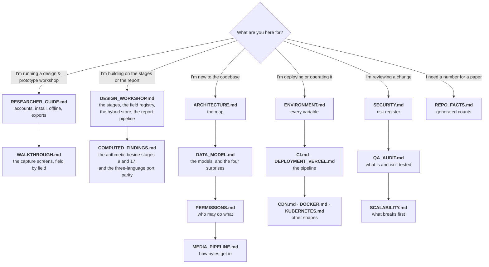

# Documentation

Start here. Every document below states, in its own final section, **how it is kept true** — what
regenerates it, what to diff it against, and which changes should trigger a human re-read. A document
with no such section does not meet the bar and is listed as a gap.

---

## Where to start, by what you are doing



---

## Every document

### The design team

| Document | Answers | Audience |
|---|---|---|
| [RESEARCHER_GUIDE.md](RESEARCHER_GUIDE.md) | How do I get an account, install the app, work with no signal, and get my data back out? | Craft and textile designers |
| [WALKTHROUGH.md](WALKTHROUGH.md) | What does each capture screen ask for, and in what order? | Same. Also mirrored in-app at `/guide` |

### The system

| Document | Answers |
|---|---|
| [DESIGN_WORKSHOP.md](DESIGN_WORKSHOP.md) | The product itself: the numbered workshop stages, the three capture tiers and the completeness gate, why the fields are data rather than columns, the promoted-column index over the stage JSON, the report pipeline and its templates, how a child collection prints under its parent, offline generation on the phone, and what the server-side PDF cannot do |
| [COMPUTED_FINDINGS.md](COMPUTED_FINDINGS.md) | The arithmetic that checks a designer's stage-9 and stage-17 conclusions against the rows underneath them: the sample floors, the verdict vocabularies, why nothing is ever auto-corrected, and the port-parity rules that keep three implementations equal to the rupee |
| [ARCHITECTURE.md](ARCHITECTURE.md) | What are the pieces, how does a request travel, where is the latency, how does transcription fail over, how does the offline outbox replay? |
| [DATA_MODEL.md](DATA_MODEL.md) | What is stored, how does it relate, and which four parts of the schema are not what they look like? |
| [PERMISSIONS.md](PERMISSIONS.md) | The role ladder, the full capability matrix, the review state machine, the late-submission gate, and the four access systems layered on top — including the design-workshop viewer grant and the questionnaire visibility that follows it |
| [MEDIA_PIPELINE.md](MEDIA_PIPELINE.md) | Every tactic both clients use to get a photograph off a phone on a bad network without losing it, and the on-device quality checks that run before it leaves |
| [SECURITY.md](SECURITY.md) | Transport, secrets, PII and Aadhaar handling, the authorisation model's security properties, and the open risk register |

### Operating it

| Document | Answers |
|---|---|
| [ENVIRONMENT.md](ENVIRONMENT.md) | Every environment variable, per service: required? default? secret? what breaks without it? |
| [CI.md](CI.md) | What happens on a push to `main`, in what order, and why the order is a dependency |
| [DEPLOYMENT_VERCEL.md](DEPLOYMENT_VERCEL.md) | The web deploy, and the two traps that ship a green pipeline over a broken site |
| [CDN.md](CDN.md) | CloudFront caching, the origin timeout that has already broken this system, and the invalidation runbook |
| [DOCKER.md](DOCKER.md) | Running the whole stack in containers |
| [KUBERNETES.md](KUBERNETES.md) | Running it on a cluster, and the connection ceiling that governs how far it scales |

### Getting the data out

| Document | Answers |
|---|---|
| [DATASET_API.md](DATASET_API.md) | Mass download for a **machine** — the `dataset:read` token, the catalogue, the streamed `.ndjson` / `.csv` with no row cap, and how artisan identity numbers are masked |

### Engineering results

| Document | Answers |
|---|---|
| [SCALABILITY.md](SCALABILITY.md) | What breaks first, what it costs to fix, and the measured finding that relations — not rows — drive the latency |
| [QA_AUDIT.md](QA_AUDIT.md) | What is tested, what is not, the open failure modes, and the regressions that were documented as working while broken |
| [AI_FEATURES.md](AI_FEATURES.md) | Background removal, layer separation, vectorisation: providers, costs, and how to turn one on |
| [RESEARCH_NOTES.md](RESEARCH_NOTES.md) | The measurement write-ups behind the engineering results |
| [REPO_FACTS.md](REPO_FACTS.md) | **Generated.** Model and enum counts, the API surface, the role ladder, test counts, code volume |

### Reference, not specification

These two describe something other than this checkout's current behaviour, and each says so in its
own opening lines. They are listed so that nothing in `docs/` is unlisted — an unlisted document is
the one failure mode this index cannot check for itself.

| Document | What it actually is |
|---|---|
| [TRANSCRIPTION_SERVICE.md](TRANSCRIPTION_SERVICE.md) | A **portable pattern reference** for rebuilding queued audio transcription in another project. For this deployment's live provider chain, read [ARCHITECTURE.md](ARCHITECTURE.md) instead |
| [DESIGN-claude.md](DESIGN-claude.md) | A design-system extraction of an **external** product surface, kept as a visual-language reference. It is not a specification of this app's UI |

Also in the repository, outside `docs/`: [`../README.md`](../README.md) (orientation and local
setup) and [`../backend/DEPLOY_AWS.md`](../backend/DEPLOY_AWS.md) (the EC2/S3/CloudFront runbook).

---

## The rule about counts

**No hand-written document in this set states a count.** Not the number of models, not the number of
endpoints, not lines of code. Those all live in [REPO_FACTS.md](REPO_FACTS.md), which is generated
from the working tree, and prose links to it.

The reason is that a count is wrong the first time anybody adds a table, and it is wrong *silently* —
nothing about "32 models" looks stale. Centralising them means a migration makes exactly one file
wrong, and one command makes it right:

```bash
node docs/tools/check-docs.mjs --write
```

If you find a count written into prose anywhere in this set, that is a bug in the documentation, not
a detail to update.

---

## The checker

```bash
node docs/tools/check-docs.mjs           # verify — exit 1 on any failure
node docs/tools/check-docs.mjs --write   # regenerate REPO_FACTS.md, then verify
node docs/tools/check-docs.mjs --quiet   # failures only
```

It verifies the four things about documentation that *can* be verified:

| Check | Catches |
|---|---|
| **Generated counts are current** | A migration or a new route that nobody re-ran the generator for |
| **Every repository path mentioned exists** | A service or component path that a rename left behind. Paths resolve against the repo root and against `backend/`, `frontend/`, `android/`, because a runbook writes commands from the directory it told you to be in |
| **Line citations land inside their file** | `media.py:198-264` after the file shrank. It also *counts* citations per document and warns, because a citation that still fits is only possibly right — the durable fix is to cite symbol names |
| **The backend and web role ladders agree** | `ROLE_RANK` drifting between `backend/app/core/deps.py` and `frontend/lib/permissions.ts`. This is the one genuine correctness check in the set |
| **Every document has a maintenance section** | A new document shipping with no story for how it stays true |
| **Mermaid blocks are structurally sane** | An unclosed fence, a block with no diagram type, and the specific bug that broke a diagram here: a **semicolon inside a sequence-diagram message**, which Mermaid reads as a statement separator so everything after it parses as a new statement and the whole diagram renders as a red error box |

It deliberately does **not** check whether a sentence is true. Nothing can. That is what each
document's own maintenance table is for.

**Mermaid, for certainty.** The lint above is structural. A real parse needs `mermaid` itself, which
is not a dependency of this repository, so it is run out-of-tree when diagrams change:

```bash
mkdir /tmp/mmd && cd /tmp/mmd && npm init -y && npm i mermaid jsdom
# Set window/document/DOMParser/Element/Node/HTMLElement/SVGElement/NodeFilter/getComputedStyle
# from a JSDOM instance, then for each fenced block:  await mermaid.parse(block)
```

Two things that run found and the structural lint would not have: a semicolon inside a sequence
message, and HTML entities (`&lt;`) inside one. **Normalise CRLF before matching** — half these files
are CRLF, and a `\n`-anchored regex silently finds zero blocks in them, which is exactly how ten
diagrams went unvalidated while the run looked green.

**Every mermaid block in this documentation set parsed on the last out-of-tree run, 2026-08-07** —
`mermaid.parse` against a JSDOM global, over every fenced block in `docs/*.md` and `../README.md`,
zero failures. The block *count* is deliberately not written here: the checker prints it on every
run, and a number in this paragraph would be wrong the next time anybody draws a diagram.

Findings in documents owned by another workstream are reported as **warnings**, not failures, so the
exit code speaks for the documents whose owner can act on it.

---

## Built, and not in any document here

A great deal landed faster than this set could absorb it. The modules below are **not covered by any
document above**, and listing them is the least dishonest thing to do about that: an undocumented
module is invisible to the checker, to a new reader, and to the review triggers that are supposed to
catch drift.

Every one of them carries a substantial module docstring or file header, and **that header is the
interim source of truth** — this repository's convention is that the reasoning lives next to the
code, so the gap is a discoverability gap rather than an explanation gap. The third column is the
thing a document would otherwise be relied on to tell you, and it was checked rather than assumed.

### Frontend — `frontend/lib/`

| Module | What it is | Surfaced? |
|---|---|---|
| `derivedFields.ts` | Client-side re-computation of `DAYS_BETWEEN` / `PRODUCT` / `SUM` fields, so a derived value appears in the frame the designer types the last input. A port of `stage_schema.derive_value`, never a second opinion | Yes — `FieldInput.tsx` |
| `photoIntake.ts` | Ranks which stage, entity and row a bulk-uploaded photograph belongs to, from its EXIF wall clock against the registry's DATE anchors. Refuses beyond a grace window rather than guessing; never drops a file | Yes — the workshop's photos page |
| `photoMeasure.ts` | Proposes a real-world dimension from a photograph, by same-plane pixel ratio or by four-corner homography, **always with an error bar** — and returns a typed refusal, carrying no value at all, wherever it cannot stand behind a number | Yes — `PhotoMeasureField` |
| `sketchRectify.ts` | Perspective-corrects a photographed sketch and extracts line art by Sauvola thresholding, into a **different** registry field. The original is never touched | Yes — `SketchRectifyField` |
| `qrEncode.ts` | A dependency-free ISO 18004 QR encoder, alphanumeric mode only — partly so that an arbitrary string, including a person's name, cannot get into a code | Yes — the workshop codes page |
| `qrDecode.ts` | The reader, sharing every table with `qrEncode.ts` so the two halves cannot disagree. Detects a symbol in a photograph — skew, glare, a code that is a small part of a large frame — and repairs it with Reed-Solomon. Pure: no DOM, so it is testable without a browser | Yes — via `qrImageDecode.ts` |
| `qrImageDecode.ts` | The browser half: a File, a dropped or pasted picture, or a video frame in; a decoded string or a sentence naming the next action out. Bounds the work, then re-cuts the located symbol out of the full-resolution original. `BarcodeDetector` is a fast path where it exists and is **never** required | Yes — `WorkshopCodeScanner` |
| `workshopCodes.ts` | The printed-code grammar and its anti-PII gate; the check character is a typo detector and explicitly not a signature | Yes — code sheet and scanner |
| `workshopSearch.ts` | An offline prefix index over a whole workshop draft, plus the `?find=`/`&row=` stage-focus URL contract. Same `\p{M}` tokeniser argument as [COMPUTED_FINDINGS.md](COMPUTED_FINDINGS.md) §2.7 | Yes — workshop page and stage form |
| `submissionReadiness.ts` | Turns the already-computed completeness gaps into ranked, clickable items. Adds an address and an order to `missing` and **deliberately nothing else** — it is not a third scorer | Yes — the readiness page |
| `reportDiff.ts` | What was *written* between two recorded exports, from timestamps only. Careful to say "written", never "changed", because no snapshot is kept | Yes — report history page |
| `carryContext.ts` | The records a researcher is currently working with, in per-user local storage, with a TTL and a PII allowlist | Yes — the capture forms' banner |
| `workshopAnalytics.ts` | The wire shape of the archive analytics endpoint | Yes — the admin analytics page |
| `designWorkshopViewers.ts` | The client half of the viewer grant — documented in [PERMISSIONS.md](PERMISSIONS.md) §4.4; the module itself is not | Yes — the workshop-access manage page |

### Backend — `backend/app/services/`

| Module | What it is | Reachable? |
|---|---|---|
| `workshop_analytics.py` | Cross-workshop adoption, cost-to-price and recurring themes. **Now documented** in [COMPUTED_FINDINGS.md](COMPUTED_FINDINGS.md) §4 | `GET /api/analytics/design-workshops`, admin only |
| `place_atlas.py` | Resolves the free-text craft `place` against a curated town table with an explicit `Precision`, and returns nothing rather than a guessed dot | The map endpoints, and the report map |
| `identity_ocr.py` | Reads an identity number off a card photograph through a vision model, Verhoeff-validates it, never logs it and never stores the image. **Off by default** | `POST /api/design-workshops/ocr/identity` |
| `district_lineage.py` | Which parent district each newly-notified district was carved from, so a district with no published border borrows one rather than inventing one | `GET /api/reference/district-lineage` |
| `report_chart.py` · `report_map.py` · `report_raster.py` · `report_annexures.py` · `report_theme.py` | The figure, map, rasterisation, annexure and theming halves of the report pipeline. [DESIGN_WORKSHOP.md](DESIGN_WORKSHOP.md) §6 describes the pipeline they belong to but not these modules | Through the report builder |
| `questionnaire_forms.py` · `questionnaire_xlsx.py` | The custom-questionnaire feature and its edit-in-Excel round trip. Its *visibility* rules are [PERMISSIONS.md](PERMISSIONS.md) §4.4.4; the feature itself is undocumented | `/api/questionnaires/*` |
| `designers.py` | The designer roster, which is a second sign-in gate on top of the role — noted in [PERMISSIONS.md](PERMISSIONS.md) §1 but not described anywhere | Sign-in and the designer screens |

### Scripts

| Script | What it is |
|---|---|
| `backend/scripts/seed_test_accounts.py` | One local account per role, so the **refuse** path of every permission can be exercised by hand. Refuses to run against a non-local `DATABASE_URL` |
| `scripts/build_boundaries.py` | Builds the district boundary assets. Note it lives at the **repository root**, not under `backend/scripts/`, and two modules cite it by a bare relative path that reads as though it were under `backend/` |

---

## Known gaps

Honest about its own state, since that is the standard the rest of the set is held to.

| Gap | Status |
|---|---|
| `SCALABILITY.md`, `DOCKER.md`, `KUBERNETES.md`, `CDN.md`, `AI_FEATURES.md`, `RESEARCH_NOTES.md` have no maintenance section | Owned by another workstream. The checker warns rather than failing; move each name out of `OWNED_ELSEWHERE` in `docs/tools/check-docs.mjs` as its owner adds one. |
| `SCALABILITY.md` pins line numbers | They will drift. The checker reports how many, per document, so the number cannot grow unnoticed — which is why it is not restated here. `MEDIA_PIPELINE.md` and [DESIGN_WORKSHOP.md](DESIGN_WORKSHOP.md) cite symbol names instead; that is the pattern. |
| Android has no equivalent of the role-ladder parity check | The Kotlin client's permission mirror is believed to match and is not proven to. Noted in [PERMISSIONS.md](PERMISSIONS.md). |
| Console state — CloudFront, S3, Vercel, Google Cloud — cannot be verified from a checkout | Every such claim is marked **UNVERIFIED**. The better fix, where it is possible, is the one [CI.md §1](CI.md) took: assert it at deploy time instead of documenting it. |
| Nothing checks that the Kotlin report renderers still match the Python ones | They are a hand port with no cross-language test, so a drift is invisible until two files of the same workshop are compared side by side. The largest documented risk in [DESIGN_WORKSHOP.md](DESIGN_WORKSHOP.md); tracked in [QA_AUDIT.md](QA_AUDIT.md). |
| The `ROLE_RANK` parity check cannot catch this set describing the ladder wrongly | It compares the backend against the web client. When `DESIGNER` was inserted at rank 35 **both were correct** and [PERMISSIONS.md](PERMISSIONS.md) went on printing a matrix with no column for it. A new tier is hand work in §1 and §2 of that document; nothing mechanical will say so. |
| Some capabilities are built, tested, and reach no user | Cost integrity has an endpoint and a Kotlin port and **no UI on any client**; the Kotlin market-analysis port is called by nothing on the handset. Named where they belong — [COMPUTED_FINDINGS.md](COMPUTED_FINDINGS.md) §3.6 — rather than described as if a designer could see them. **Checked 2026-08-08**, and this is the row that goes stale fastest: the check is one grep per module, and the answer changed twice while this page was being written. |
| No document is checked for describing the *current* product rather than a former one | The checker resolves paths, links and counts; it cannot tell that a paragraph describes a product this repository no longer builds. The mitigation is that the two documents that deliberately describe something else — `TRANSCRIPTION_SERVICE.md` and `DESIGN-claude.md` — say so in their first lines and are listed under "Reference, not specification" above. |

---

## How this document is kept true

It is an index, so it has exactly two ways to be wrong: a document exists and is not listed, or a
document is listed and does not exist.

The second is checked — `docs/tools/check-docs.mjs` resolves every relative link here and fails on a
broken one. The first is not, and is the one to watch: **a new document must be added to the tables
above in the same commit that creates it.** `ls docs/*.md` against this page's tables is the check,
and it takes ten seconds.

The "Known gaps" table is kept true by being embarrassing. Each row names the thing that closes it.
