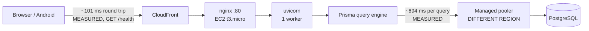
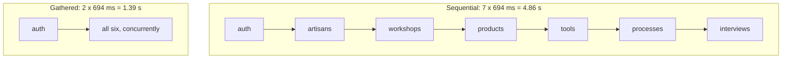
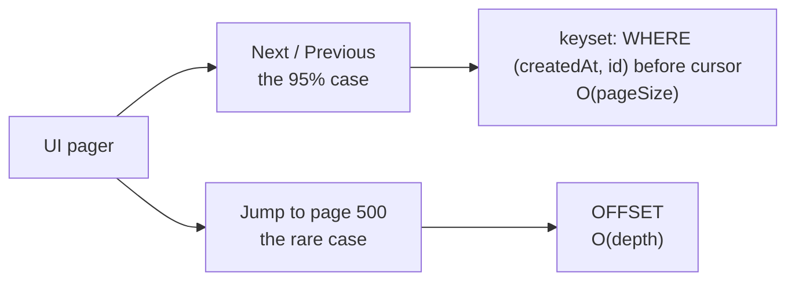
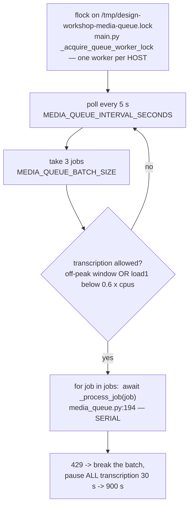
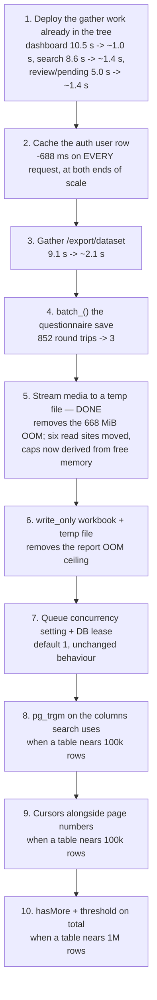

# Scalability: what breaks first, and what it costs to fix

What this system runs into as it grows, ranked by *when* each thing starts to hurt rather than by
how interesting it is. Every entry carries the evidence it rests on, the scale at which it begins
to bite, the fix, and — because this deployment is a 1 GiB EC2 box and must stay one — what the fix
costs the small case.

Sister documents:

- [docs/ARCHITECTURE.md](ARCHITECTURE.md) — what the components are and how a request flows.
- [docs/MEDIA_PIPELINE.md](MEDIA_PIPELINE.md) — upload, transcription and the processing queue.
- [docs/ENVIRONMENT.md](ENVIRONMENT.md) — every environment variable, per service.
- [backend/DEPLOY_AWS.md](../backend/DEPLOY_AWS.md) — the EC2/S3/CloudFront side.

The governing constraint, stated once so every recommendation below can be checked against it:

> **Nothing here may make the 1 GiB pilot harder to run.** A mandatory Redis, a search cluster or a
> message broker would speed up the large case and make the small one impossible. Anything
> infrastructural must be optional and must degrade to an in-process default. Fixes that help at
> *both* ends — removing a round trip, adding an index, collapsing sequential awaits — always win.

Two sections answer questions the ranked inventory does not, and are written to be readable on their
own: [§9.1](#91-the-one-cache-that-is-not-a-cache-conditional-get-on-the-field-registry) measures the
largest single body this API serves to a cold client and what a conditional GET does to it, and
[§15](#15-retention-every-table-with-no-delete-path-and-the-answer-for-each) writes down the
retention answer for every table nothing can delete a row from.

---

## 0. How to read the numbers

Two labels appear throughout, and they mean strictly different things.

| Label | Meaning |
|---|---|
| **MEASURED** | I ran it and recorded the result. The endpoint measurements are medians of 3–7 samples against the live production API on 2026-07-26; the memory measurements are `tracemalloc` on this machine. Section 8 says how to reproduce each one. |
| **MODELLED** | An extrapolation from a measured constant. Every one is arithmetic on a number labelled MEASURED, and the arithmetic is shown. None of them has been observed. |
| **NOT MEASURED** | Named explicitly where I could not measure something, rather than quietly modelling it and hoping. |

Where a figure came from someone else's work in this repository it is attributed to that file, and
labelled with whichever of the two it is.

Production volumes at the time of measurement, from the live API: **16 artisans, 18 products,
74 tools, 925 media files, 9 crafts, 4 processes, 1 workshop, 25 questionnaire interviews.** Media
totals **6.66 GiB** across 568 audio, 305 image and 52 video objects (MEASURED, §5.1).

---

## 1. The one measurement that explains almost everything

The database is in a different AWS region from the web box. That single fact dominates every other
performance property of this system, and it does so in a way that is exactly, boringly linear.



### 1.1 The model

Fitting latency against the number of database queries a route issues **one after another**:

> **T ≈ 98 ms + 694 ms × (number of sequential database round trips)**
>
> MEASURED. Least squares over six endpoints whose query count is unambiguous from the source
> (`/health` = 0, `/health/ready` = 1, `/api/me` = 1, `/reference/address` = 1, `/review/pending` = 7,
> `/dashboard/stats` = 15). **R² = 0.999999.**

The three anchor points that make it trustworthy are the ones where the code leaves no room for
interpretation:

- `GET /health` (`backend/app/main.py:412`) touches no database at all → **101 ms MEASURED**. That
  is the network, TLS and CloudFront floor.
- `GET /reference/address` (`backend/app/api/routes/reference.py:23`) has a docstring that says
  *"The payload is a pure constant — no database read"* — and it takes **789 ms MEASURED**. All
  688 ms of the difference is the `db.user.find_unique` inside `get_current_user`
  (`backend/app/core/deps.py:127`). An endpoint that reads nothing costs one round trip because
  authentication reads something.
- `GET /review/pending` (`backend/app/api/routes/review.py::list_pending_reviews`) looped over six
  record types issuing one `find_many` each **in the build these numbers were taken against**. It
  returns **22 bytes** — the queue is empty — and takes **4,958 ms MEASURED**. That is 7.00 implied
  round trips against a model that predicted 7. The tree gathers those six into one wave now
  (§3); production does not, which is the whole of §1.4.

### 1.2 The measured table

All medians, live production, 2026-07-26. "Trips" is `(T − 98) / 694` — the model inverted.

| Endpoint | MEASURED | Trips | Bytes | What the trips are |
|---|---:|---:|---:|---|
| `GET /health` | 101 ms | 0.00 | 15 | nothing |
| `GET /health/ready` | 796 ms | 1.01 | 52 | `SELECT 1` |
| `GET /api/me` | 786 ms | 0.99 | 1,010 | auth |
| `GET /reference/address` | 789 ms | 1.00 | 1,214 | auth (payload is a constant) |
| `GET /data/tree` | 790 ms | 1.00 | 1,099 | auth |
| `GET /users/directory` | 1,484 ms | 2.00 | 2,250 | auth + users |
| `GET /crafts?pageSize=20` | 2,137 ms | 2.94 | 5,491 | auth + count + page |
| `GET /tasks?pageSize=20` | 2,203 ms | 3.03 | 55 | |
| `GET /search?q=ram&types=artisans` | 2,159 ms | 2.97 | 5,761 | auth + count + page |
| `GET /questionnaire/questions` | 2,466 ms | 3.41 | 112,820 | |
| `GET /media?pageSize=1` | 2,744 ms | 3.81 | 15,595 | |
| `GET /processes?pageSize=20` | 3,023 ms | 4.22 | 30,075 | |
| `GET /artisans?pageSize=20` | 3,055 ms | 4.26 | 64,110 | |
| `GET /media?pageSize=20` | 3,124 ms | 4.36 | 380,249 | |
| `GET /workshops?pageSize=20` | 3,520 ms | 4.93 | 9,983 | |
| `GET /products?pageSize=20` | 3,780 ms | 5.31 | 209,150 | |
| `GET /tools?pageSize=20` | 4,228 ms | 5.95 | 245,010 | |
| `GET /questionnaire/interviews?pageSize=20` | 4,482 ms | 6.32 | 1,593,765 | |
| `GET /review/pending` | 4,958 ms | 7.00 | **22** | auth + 6 tables, sequentially |
| `GET /search?q=ram` (5 buckets) | 8,559 ms | 12.19 | 184,302 | auth + 5 counts + 5 pages |
| `GET /export/dataset` | 9,105 ms | 12.98 | 475,897 | 6 tables + media |
| `GET /dashboard/stats` | 10,504 ms | 15.00 | **1,896** | auth + 14 reads |
| `GET /data/report?format=json` | 13,289 ms | 19.01 | 2,748,089 | 19 tables/queries |

Two rows deserve to be read twice. `/review/pending` spends **five seconds** producing twenty-two
bytes. `/dashboard/stats` spends **ten and a half seconds** producing 1.9 kB. Neither number has
anything to do with how much data exists.

### 1.3 Rows do not matter; relations do

| Comparison | MEASURED |
|---|---|
| `/media?pageSize=1` → `pageSize=100` (100× the rows, 2.0 MB payload) | 2,875 ms → 3,571 ms (**+696 ms**) |
| `/tools?pageSize=1` → `pageSize=100` | 3,805 ms → 5,323 ms (**+1,518 ms**) |
| `/crafts` (1 relation) → `/tools` (7 relations), both 20 rows | 2,137 ms → 4,228 ms (**+2,091 ms**) |

Regressing list latency on the number of relations each route declares (crafts 1, artisans 4,
processes 4, products 6, tools 7):

> **346 ms per declared relation** — half a round trip each. MEASURED, R² = 0.9916.

A hundred-fold increase in *rows* costs less than one round trip. Six extra *relations* cost three.
This is the single most important shape in the system, and it is why every recommendation below is
about the count of sequential queries and almost never about query efficiency.

### 1.4 Production is running the pre-optimisation build

The working tree contains substantial round-trip work by other streams —
`backend/app/services/concurrency.py` (`gather_reads`), `records.py::hydrate_relations` and
`count_and_page`, and a gathered `/dashboard/stats` and `/search`. **None of it is deployed.** Two
measurements prove that:

- `/dashboard/stats` measures **15.00** implied trips, exactly the fourteen-sequential-reads shape
  the current docstring describes as the *old* behaviour (`dashboard.py:52-58`).
- `/search?q=ram` across five buckets measures **12.19** trips against **2.97** for a single bucket.
  If the ten bucket queries were gathered, five buckets would cost roughly what one costs. They cost
  five times as much, so they are still sequential in production.

So the deployed latencies in §1.2 are the *un-fixed* baseline. That is useful — it is the honest
"before" for a paper — but nothing below should be read as "already solved" merely because a fix
exists in the tree.

**I did not measure the un-deployed build.** Doing so would mean starting the app against the
production database, which also starts the media-queue worker; the brief forbids that, and it is the
right rule.

---

## 2. Ranked inventory

Ranked by *when* it bites, not by size of eventual win.

| # | Bottleneck | Evidence | Starts to hurt at | Fix | Cost to the 1 GiB pilot |
|---|---|---|---|---|---|
| 1 | **Sequential round trips per request** | §1.1–1.3, MEASURED | **Now**, at 16 artisans | Gather independent reads; batch relations; delete queries outright | None — strictly faster, no new memory |
| 2 | **One auth read on every request** | `deps.py:127`; `/reference/address` = 789 ms MEASURED | **Now**, every call | In-process TTL cache of the user row | ~200 KB RAM; role changes lag by the TTL |
| 3 | **Whole media objects read into RAM** — **DONE**, §5.1 | was `s3.py#get_object_bytes`, six read sites; largest live object **668 MiB** MEASURED | **Now** — that file already exists | `s3.download_to_temp` + `head_object`; caps derived from free memory (`services/memory_budget`), not constants | Disk instead of RAM; one `HEAD` per gated read; oversized work now refused visibly rather than attempted |
| 4 | **Write-path N+1** | `questionnaire.py#create_interview`'s answer loop = 3 queries per answer | **Now**, at ~14 answers in one save | `db.batch_()` / `create_many` — one round trip | None; strictly fewer queries |
| 5 | **Connection pool under burst** | Knee at 8 concurrent, MEASURED §6 | **Now**, at ~8 simultaneous users | Remove queries (see 1, 2); make the pool a knob | None |
| 6 | **Reports and manifests built entirely in RAM** | 284 B/cell MEASURED; caps allow 2.1 M cells | ~10–20× today's records | `write_only` workbook to a temp file; stream rows | Column widths become fixed, not content-fitted |
| 7 | **Queue throughput: one worker, serial batch** | `media_queue.py::process_next_media_jobs`; `main.py::_acquire_queue_worker_lock` | ~5–10× today's audio | Concurrency as a setting (default 1); DB lease instead of `flock` | None at default |
| 8 | **Unbounded aggregate responses** | `review.py::list_pending_reviews` (no paging), `data_browser.py::TAKE`, `::REPORT_TAKE` | ~200 pending per type | Paginate; stream the manifest | None |
| 9 | **Multi-column `ILIKE '%term%'`** | `records.py::contains`, 57 call sites | ~100–150 k rows in a searched table, MODELLED | `pg_trgm` GIN indexes — inside Postgres, no new service | Index build + write amplification; kilobytes today |
| 10 | **OFFSET pagination depth** | `pagination.py:10` | ~100 k rows **and** deep paging, MODELLED | Cursor alongside page numbers, not instead | None; additive field |
| 11 | **Exact `COUNT(*)` per list response** | `records.py::count_and_page` | ~1 M rows, MODELLED | Fetch `pageSize + 1`; report `hasMore` above a threshold | None until the threshold |

Items 9, 10 and 11 are the three the brief asked about most pointedly, and they rank **last**. That
is the finding, not an oversight; §7 shows the arithmetic.

---

## 3. Sequential round trips (rank 1)

### The evidence

`GET /review/pending` returning 22 bytes in 4,958 ms is the cleanest example in the codebase.
What follows is the **deployed** shape, which is what the measurement was taken against — the tree no
longer looks like this, and §1.4 is why that distinction is the whole point of this document:

```python
# backend/app/api/routes/review.py::list_pending_reviews, AS DEPLOYED
for record_type, delegate, label_fields in _PENDING_SOURCES:   # six record types
    rows = await delegate.find_many(...)                       # one round trip each, in series
```

Six tables, no dependency between them, awaited one at a time. On a database next door this is
free. Here it is 4.2 seconds.

`GET /export/dataset` (`export.py::dataset_manifest`) does the same with six `find_many` calls plus
a media query — 12.98 trips MEASURED. `/data/report` does it nineteen times — 19.01 trips
MEASURED.

Line pins are deliberately absent from this section now, for the reason
[§6](#6-connection-pool-and-burst-rank-5) gives about its own: these are exactly the lines a
conversion wave rewrites, and every numeric pin this section carried — `review.py:140-147`,
`export.py:153`, and `records.py:231-244` in the §2 table — had already come loose from what it
named before anybody followed it. A symbol survives the edit; a line number does not.

### The fix, and why it is the right shape



`backend/app/services/concurrency.py::gather_reads` already implements exactly this, bounded by the
Prisma pool so one request cannot drain it.

**The four routes this paragraph used to list as "still to convert" are now converted IN THE TREE,
and none of it is deployed.** §1.4 is still the governing fact and §1.2 is still the un-fixed
baseline that a redeploy has to be re-measured against:

| Route | Was | Now, in the tree |
|---|---|---|
| `review.py::list_pending_reviews` | 7 sequential trips, MEASURED 4,958 ms | one wave of six `find_many`; a second wave carries a `count` **only** for the record types that overflowed the cap, so a queue under the cap is one wave and nothing else |
| `export.py::dataset_manifest` | 12.98 trips MEASURED | the six tables in one wave; the media read stays a second wave because `media_or` is built out of their ids. The two visibility predicates above them were gathered too, but see the note below — that pair is one query either way |
| `data_browser.py::_report_records` (`/data/report`) | 19.01 trips MEASURED | the eight root reads in one wave; in the workshop branch products/tools/interviews (all keyed off the artisan ids alone) in one wave, with `processes` still below them because it needs the product ids |
| `media.py::list_media` | `count`, then `find_many`, then `_interview_labels`, then `media_url_scope`, in series | `count`+`find_many` in one wave; `_interview_labels`+`media_url_scope` in the next, inside the shared `_public`, so `GET /media/{id}` and `GET /media/orphans` inherit it |

`data_browser.py::_scope_for` was gathered with them, and **it is the one conversion in this
list that buys nothing measurable**, which is worth saying rather than leaving to be discovered.
Only one of its two halves queries: `records.owned_or_granted_where` is dictionary work on a record
owner column and reads the design-workshop tag ids only for `uploadedById`, and its own comment
forbids the record variant from growing a lookup to match. So the pair is one query below professor
and none at Professor and above, gathered or not. The same is true of the identical pair at the top
of `export.py::dataset_manifest`. Both are written as waves so the pair is stated as a pair — a
claim about shape, not about latency.

Thirteen smaller sites went the same way in the same pass: the `count`/`find_many` pairs behind
`/users`, `/tasks`, `/feedback`, the questionnaire-form list, the inspector list and `/media/jobs`;
the four independent picker reads behind `/tasks/options`; the artisan/section lookups and the
derived-progress counts inside `tasks.py::serialize_tasks`; the two perspectives of
`/data-access/grants`; the two reads behind `/design-workshops/{id}/report-history`; the per-kind
loop in `media.py::_tag_only_orphans`; the per-model loop in
`services/design_workshops.py::hydrate_entries`; and `questionnaire.py::section_payloads`, which is
the whole of the 3.41 measured trips on `GET /questionnaire/questions` once auth is subtracted. On
`/tools` and `/products`, `records.py::media_url_owners` moved from an await *after* `count_and_page`
into the same wave — a trip that never appears in §1.2 because those rows were measured as an
admin, for whom that lookup short-circuits without querying.

**One number to keep in view while reading that list**: `gather_reads` is bounded by `pool_width()`,
which is `Settings.database_connection_limit` = 10. A wave wider than ten does not fail — it
silently becomes two waves at the semaphore. `/dashboard/stats` is already over that line at sixteen
coroutines, and its own comment claimed otherwise until this pass corrected it.

**Cost to the small deployment: none.** Fewer wall-clock seconds for the same queries, the same
memory, no new dependency. This is the fix the brief's design rule was written for.

### The caveat that matters for rank 5

Gathering reduces **latency**. It does not reduce **load**. Six queries gathered still occupy six
pool connections and still cost six connection-seconds; they just overlap. A route converted from
7 sequential trips to 2 waves gets 3.5× faster *and* asks for up to six connections at once instead
of one. On a pool of ten that is fine for one request and interesting for three. See §6.

The fixes that improve throughput as well as latency are the ones that **delete** queries: caching
the auth read (§4), the `group_by` that replaced four count pairs in `dashboard.py:59-82`, and
`hydrate_relations`' one-query-per-relation batching in `backend/app/services/records.py`.

---

## 4. One database read on every authenticated request (rank 2)

### The evidence

```python
# backend/app/core/deps.py:127
user = await db.user.find_unique(where={"id": user_id})
```

Every authenticated route depends on `get_current_user`. **MEASURED:** `/reference/address`, whose
own docstring promises no database read, costs 789 ms; `/api/me` costs 786 ms; the floor is 101 ms.
The user lookup is **688 ms of flat tax on every single API call**, and one connection-second of
pool occupancy with it.

### The fix

A per-process TTL cache of the user row, keyed by user id, default TTL 10 s, invalidated
immediately on any write to that user. `backend/app/scale/memory_cache.py` (present in the tree,
not yet wired — see §9) is the right home: it is bounded by both entry count and bytes, which is
what a 1 GiB box needs.

Sizing: a user row is on the order of 1 kB, so **200 users ≈ 200 kB** (MODELLED from the 1,010-byte
`/api/me` payload). This is the cheapest cache in the system by a wide margin and the only one whose
hit rate approaches 100 %.

### The cost, stated plainly

A deleted or demoted account stays valid for up to the TTL. That is a real security property being
traded for 688 ms, so it should be a short TTL (10 s), the invalidation on user writes should be
unconditional, and the trade should be written down in `docs/SECURITY.md` rather than discovered.
With one uvicorn worker the invalidation is exact; with two it is exact only in the worker that
performed the write, which is an argument for keeping one web worker (which `backend/app/worker.py`
already documents as load-bearing for other reasons).

**A second instance of the same shape used to be claimed here, and it is not true of this tree.**
The paragraph that stood here named `records.py::visibility_where` (line 262) and ended "Every
researcher pays 694 ms per list request that these numbers do not show." That function no longer
exists. It was split in two: `records.py::viewable_where`, which is what the LIST routes call and
which returns `{}` for everybody without issuing a query at all — reading the repository is open to
every signed-in account, and its docstring says so — and `records.py::owned_or_granted_where`, which
kept the original grant-table body and is reached only from the paths that take data OUT:
`/export/dataset`, the `/data` browser and the download routes. So a researcher's list request costs
what an admin's costs, and the sentence removed here was pricing a query the list path had stopped
making. The line that pin named is now a docstring inside `records.py#_redact_sensitive` — which is
what a stale line pin looks like from the other side, and the reason this sentence no longer carries
one.

What survives is narrower and still worth caching. `owned_or_granted_where` **is** a real read below
professor — the media variant resolves design-workshop-tagged ids through
`records.py::_design_workshop_media_ids` — and `data_browser.py::_scope_for` calls it twice, once
per owner column, on every `/data` route — though only the media call actually queries, so that
route pays one of them and not two, and gathering the pair (§3) therefore removed nothing. Deleting
the query is the whole of the remaining prize: same cache, TTL 30 s, keyed by user id.
Professors and admins pay nothing either way, because `has_rank(user, "PROFESSOR")` returns an empty
filter without querying — which is why the measurements in §1.2, taken as an admin, do *not*
include it, and why nothing in that table moves when this one is done.

---

## 5. Memory on a 1 GiB box

### 5.1 Whole media objects in RAM (rank 3) — **DONE**; it was biting now

> **Status.** All three fixes below have landed, plus a fourth read site this section did not
> originally name (`POST /design-workshops/{id}/report`, which held *every* referenced photograph at
> once and was the largest case of all). Two parts are deliberately NOT closed and are marked as
> such inline rather than left to be rediscovered: the multipart second copy at send time, which
> needs a dependency this repository has not taken, and pydub's whole-decoded-PCM residency, which
> needs ffmpeg's segmenter. The measurements below are the "before" and are left as they were.

**MEASURED**, live media table, all 925 rows sampled:

| | |
|---|---|
| Total stored | 6,815 MiB |
| Median object | 2.01 MiB |
| p90 | 14.28 MiB |
| p99 | 97.07 MiB |
| **Largest** | **668.44 MiB** |
| Five largest | 131.2, 151.4, 156.0, 240.0, 668.4 MiB |
| Type mix | 568 AUDIO, 305 IMAGE, 52 VIDEO |

Every transcription read the whole object into the process heap:

```python
# backend/app/services/s3.py:286-306  (was :243-249 when this section was written)
def get_object_bytes(object_key: str) -> bytes:
    response = _client().get_object(...)
    return response["Body"].read()          # the entire object
```

It was then handed to the provider as a multipart field —
`files={"file": (filename, content, mime_type)}` — and `requests` assembles that multipart body as a
second contiguous bytes object. For the 668 MiB file that is **~1.34 GiB of live heap on a 1 GiB
box** (MODELLED from the MEASURED file size; the doubling is how `requests` builds multipart
bodies). ElevenLabs' declared ceiling is 1000 MiB (`ai.py:122`), so nothing in the code refused it.

Worse if the chain fell through to Whisper. Above 24 MiB (`ai.py:119`) `_split_audio_into_chunks`
decoded the entire file to uncompressed PCM via pydub and materialised **every** chunk into a list
before transcribing any of them. Decoded PCM is several times the compressed size; for a
multi-hundred-megabyte input this cannot fit and never will.

The same pattern sat in the *web* process: `/data/media/{id}/download?format=mp4` read the object
whole and re-encoded it, guarded only by `MAX_CONVERT_BYTES` (`data_browser.py:163`). Three live
files (131, 151, 156 MiB) were under that cap.

#### The six read sites, and the one this section did not name

Traced route function → read. Only the first had a cap of any kind before this work.

| # | Entry point | Read site | Process |
|---|---|---|---|
| 1 | `GET /data/media/{id}/download?format=mp4` | `data_browser.py::download_media` | web |
| 2 | Same function, the non-audio fallback when `media.url` is falsy | `data_browser.py::download_media` | web |
| 3 | **`POST /design-workshops/{id}/report`** | `design_workshops.py::MediaIndex.prefetch` (`:5095`) | **web** |
| 4 | `POST /media/{id}/transcribe-now` | `media_queue.py::transcribe_media_now` (`:596`) | web |
| 5 | The queue drain | `media_queue.py::_process_job` (`:795`, `:883`) | worker |
| 6 | `POST /design-workshops/{id}/ai-layers/{caption,subtitles}` | `design_workshops.py` routes (`:3002`, `:3079`) | web |

**Site 3 is the largest of them and this document did not have it.** `MediaIndex.prefetch` looped
over every image the built document referenced and accumulated `get_object_bytes(key)` into a dict
that stayed live across the whole render — no per-object cap, no aggregate cap, no cap on the number
of images — in the single-worker web process. That is strictly worse than the single 668 MiB read
this section is built around: one read is one object, this is all of them at once. At the measured
median of 2.01 MiB a forty-photograph report is ~80 MiB of live heap before ReportLab starts, and
one p99 object (97 MiB) among them doubles it.

**Fix, all of which keep the small case working — all three DONE, with one part explicitly not:**

1. ~~Stream the S3 object to a `NamedTemporaryFile` instead of `.read()`.~~ **DONE** —
   `s3.download_to_temp` (`:425`) streams via `download_fileobj` in ranged chunks and returns the
   path; `s3.discard_temp` (`:470`) is what every caller's `finally` calls. `s3.head_object`
   (`:334`) is the companion this document's follow-up note asked for: it reads `ContentLength` and
   no bytes, so an object that understates its size in the `MediaFile.sizeBytes` column is now
   refused *before* the fetch instead of after it. Sites 1, 2, 4, 5 (transcription) and 6
   (subtitles) all moved to it. `get_object_bytes` survives for the two callers that genuinely need
   every byte at once, both of which now have a size gate in front: MEASUREMENT (`media_queue.py`
   `:883`) and CAPTION (`design_workshops.py:3002`) send base64 of a whole image inside a JSON body,
   and there is no half of a base64.
   > **The "hand the provider an open file handle, which `requests` streams rather than buffers"
   > half of this was only half true, and the code now says so.** It is true for `data=` — Deepgram
   > posts a raw body, and `requests` hands a file object to urllib3 with a `Content-Length` off the
   > file, so nothing is resident. It is **false for `files=`**: `PreparedRequest._encode_files`
   > calls `fp.read()` and assembles the whole multipart body as one contiguous `bytes`, so the
   > OpenAI and ElevenLabs rungs still make the second copy at send time. What the handle removes
   > there is the *caller's* copy — the object no longer sits in the heap for the length of the job,
   > across every rung of the chain and the refinement hop after it, only during the one POST that
   > is sending it. Closing the rest needs a streaming multipart encoder
   > (`requests_toolbelt.MultipartEncoder`), which is a **new dependency this repository has not
   > taken**. Named here rather than done quietly. See `ai._upload_body`.
2. ~~Make `_split_audio_into_chunks` a generator, and let pydub read from the temp file path.~~
   **DONE** — `ai.py:667`. Both halves: it yields one chunk at a time instead of returning a list of
   all of them, and `AudioSegment.from_file` is given the path so ffmpeg opens the file itself.
   The "can this be split at all" decision stays eager and still returns `None`, because a generator
   object is truthy whether or not it will ever yield and making the whole function a generator
   would have turned an undecodable recording into an empty transcript in silence.
   > **What this does NOT fix, and it is the same sentence as above.** `AudioSegment` holds the
   > entire *decoded* PCM however it was loaded. Reading from the path removes the compressed copy
   > and the generator removes the N-chunks accumulation, but a multi-hundred-megabyte input still
   > will not fit, exactly as this section always said. Closing that needs ffmpeg's own segmenter
   > (`-f segment`) writing chunk files to disk. The size gates are what keep such a file from
   > reaching it.
3. ~~Replace `MAX_CONVERT_BYTES` with a limit derived from free memory, and lower the constant to
   32 MiB until then.~~ **DONE, both parts.** `MAX_CONVERT_BYTES` is 32 MiB (`data_browser.py:163`)
   and `convert_ceiling_bytes()` (`:3147`) is what the route actually asks;
   `services/memory_budget.py` is the derivation — `MemAvailable` from `/proc/meminfo`, **and** the
   cgroup's own `memory.max - memory.current`, whichever is smaller, because a container does not
   get its own `/proc/meminfo` and this repository ships a container. `psutil` was avoidable and was
   avoided. It only ever lowers a caller's constant, never raises it, and returns the constant
   unchanged where no source exists (every development box), so a roomy machine behaves exactly as
   it did. Fed to `MAX_CONVERT_BYTES`, `MAX_MEASUREMENT_BYTES`, `MAX_CAPTION_BYTES` and the report
   image budget.

**And a fourth fix, for site 3 — absent from the three-point list above because this section did
not have that read site at all:**

4. **DONE** — `MediaIndex.prefetch` now takes a budget: `REPORT_IMAGE_BUDGET_BYTES` (96 MiB) in
   aggregate and `REPORT_IMAGE_MAX_BYTES` (16 MiB) per image, both lowered by the same free-memory
   figure. A running total is kept against the REAL length of what arrives; the declared column is
   used only to skip a fetch that was going to be refused anyway. **The skipped photographs are
   reported, never dropped in silence** — `render_report` appends a warning naming the count, placed
   immediately after `_dropped_warnings` because it explains part of the number that sentence just
   gave. The order of `document.images` is the renderer's placement order, so a budget that runs out
   costs the LAST pictures in the report and never the first; nothing is sorted by size, because
   fitting more pictures in would decide which page loses one on a criterion no reader could guess.

**Cost to the pilot:** disk instead of RAM (the box has disk; it does not have RAM), one extra
temp-file lifecycle, and one `HEAD` round trip per gated read — negligible against a path that is
about to spend a cross-region provider round trip. No new service, no new dependency.

**The behaviour change worth stating plainly.** These are refusals where there used to be an
attempt. A recording over the ceiling is now answered `413` (web) or written terminal-UNAVAILABLE on
the media row with the reason on it (queue), instead of being fetched and OOM-ing the box; a report
whose photographs exceed the budget comes back with the tail of them missing and a warning saying
so, instead of not coming back at all. On a machine with memory to spare — every development box,
and the pilot when it is not under load — none of these fire and nothing changes.

### 5.2 The report workbook and the manifest (rank 6)

**MEASURED**, `tracemalloc` on this machine, openpyxl in the same non-`write_only`, styled
configuration `services/xlsx_report.py` uses:

| Sheet size | Heap after building cells | Peak heap | Bytes/cell (peak) |
|---|---:|---:|---:|
| 1,000 × 30 = 30 k cells | 6.2 MiB | 8.5 MiB | 296 |
| 5,000 × 30 = 150 k cells | 29.7 MiB | 40.6 MiB | 284 |

`build_report_workbook` (`xlsx_report.py:325-347`) holds the whole workbook as live `Cell` objects,
saves into a `BytesIO`, then `buffer.getvalue()` copies the bytes again, and `data_browser.py:2903`
wraps that copy in another `BytesIO`. Before any of that, `_rendered()` (`data_browser.py:2850`)
copies every prose row.

The caps allow fourteen sheets at `REPORT_TAKE = 5000` rows each (`data_browser.py::REPORT_TAKE`,
`:2050-2088`). At the measured ~30 columns:

> 14 × 5,000 × 30 = **2.1 M cells × 284 B ≈ 597 MiB** of workbook alone, plus the Python row lists
> that fed it, plus two copies of the serialised payload. **MODELLED** from the measured bytes/cell.

That does not fit in 1 GiB alongside uvicorn and the Prisma engine. Today it is invisible because
the whole repository is a few thousand cells — `/data/report?format=json` returns 2.75 MB
(MEASURED), which is perhaps 20 k cells. **The existing row caps are already above what the box can
render**; only the data being small is holding it up.

`GET /export/dataset` is the same story in JSON: it loads six tables (each ≤ 5,000 rows, with
relation includes) plus up to `MEDIA_TAKE = 20000` media rows (`export.py:26-28`) and returns one
list of every file path. **MEASURED today: 9,105 ms, 476 kB.** At 100× the media it is a ~48 MB JSON
response assembled entirely in memory (MODELLED, linear in row count).

One genuine relief: **the server never builds a ZIP.** There is no `zipfile` import anywhere in
`backend/` — the manifest is a list of `{path, url}` and the *client* downloads each object straight
from S3 and zips it locally (`export.py:39-51`). That is already the right architecture and should
be preserved, not replaced with server-side archiving.

**Fix:**

- `Workbook(write_only=True)` plus `wb.save(temp_path)` and a `FileResponse`. Peak heap drops to
  roughly one row. **Still unimplemented.**
- Feed sheets from a generator that pages the query in batches rather than materialising every row.
  **Still unimplemented.**
- ~~For the manifest, stream NDJSON (`{"path":…,"url":…}` per line) behind a `?stream=1` flag,
  keeping the existing JSON shape as the default so no client breaks.~~ **DONE** —
  `data_browser.manifest_ndjson_response`, offered by both `GET /export/dataset?stream=1` and
  `GET /data/manifest?stream=1`, with `X-Dataset-Total` / `X-Dataset-Media` / `X-Dataset-Truncated`
  / `X-Dataset-Skipped` carrying what the wrapper object used to. The fourth is this repository's
  own: `/export/dataset` answers five keys, not four, and `skippedMedia` has nowhere else to go
  once the wrapper is gone. The default JSON shape is unchanged and must stay so: both browser
  clients and every installed Android build read it.

**Why the manifest was done first, and what it actually fixed.** The client half was the urgent one.
`WorkshopRepositoryApi.datasetManifest()` and `.dataManifest()` were typed Retrofit calls with no
`@Streaming`, so the whole body went through the kotlinx-serialization converter's
`Serializer.FromString` — `decodeFromString(body.string())` — and `ResponseBody.string()` allocates
ONE contiguous `ByteArray` the size of the entire response and copies it into ONE contiguous
`String`. At the ~48 MB modelled above that is a single 48 MB allocation request on a handset heap
that is also holding Compose, and it fails as
`java.lang.OutOfMemoryError: Failed to allocate a 48000000 byte allocation`.
`android:largeHeap="true"` was already set, so that mitigation was spent — and would not have helped:
a large enough *contiguous* allocation fails on a fragmented heap however much total free memory is
reported.

The Android downloads (`WorkshopRepository.downloadDataset`, `.downloadDataFolder`) now spool the
NDJSON to a cache file and zip it a line at a time, so peak heap is one entry rather than one
manifest. **The spool is not redundant, and it is where this deliberately departs from the
line-by-line "zip as you read" this document specifies.** The manifest is served by the API host
while every media object comes from S3, so consuming the stream lazily would hold the manifest socket
open and idle for the length of each media transfer, and `ApiClient`'s 60-second read timeout would
kill it — a failure that appears on a slow rural connection and never on a desk. On the server side
the streamed path also drops each entry as it is encoded, which removes the second copy
`JSONResponse` used to hold beside the list. What it does **not** do is make the server's manifest
*build* incremental — the list is still assembled whole before the first byte is sent, and the caps
above are still what bounds it.

**Not part of this fix:** the three browser `JSZip.generateAsync({type:"blob"})` sites
(`data/page.tsx:865`, `:1516`, `sharing/page.tsx:766`). They are a real memory ceiling, but a
different one — a `Blob` the size of the whole *archive* (media bytes included, not just the
manifest), bounded by the browser's per-tab allocation rather than by a contiguous Java array. The
manifest fix does not touch it and would not have helped it; see `docs/OPEN_FINDINGS.md`.

**Cost to the pilot:** `write_only` cannot measure content to size columns after the fact, so column
widths become fixed rather than content-fitted, and the Overview sheet must be written first from
row counts already known. That is a small, visible cosmetic trade for removing an OOM class. It is
worth naming rather than hiding, because the workbook styling in `xlsx_report.py` is deliberate work.

---

## 6. Connection pool and burst (rank 5)

### What is configured

Line numbers are deliberately absent from this section. Everything it describes lives in two files
that a concurrent wave rewrites, so each item names the **symbol** instead — which is what a reader
follows anyway, and what `check-docs.mjs`'s citation check asks for when a range has come loose.

- `Settings.database_connection_limit` = **10** per process, cut from 40 after a documented
  pooler-exhaustion incident. Its declaration in `backend/app/core/config.py` carries the incident.
- `build_runtime_database_url` (`backend/app/core/db.py`) adds `pgbouncer=true` to the DSN when
  `Settings.database_use_transaction_pooler` is set, which it is by default. That flag is a
  **declaration by the operator** that `DATABASE_URL` already names a transaction-mode endpoint — it
  matches no hostname and re-routes nothing. Transaction mode is what matters here: session mode
  pinned one of a small number of server connections per client and crash-looped the service, while
  transaction mode returns the connection after each statement. The function **used to** do the
  routing itself, rewriting a `.pooler.supabase.com` host from `:5432` to `:6543`; that was removed
  on 2026-08-22, so pointing `DATABASE_URL` at the pooled endpoint is now the operator's job and the
  flag is how they say they did it. The *measurements* below were taken while the rewrite was live.
- One web process (uvicorn, single worker) plus one separate queue process
  (`backend/app/worker.py`), so **20 client connections** in steady state.
- `Settings.database_pool_timeout` is unset, so Prisma's default 10 s applies.
- **200 client connections** multiplexed over **~15 server connections** is the ceiling every
  connection budget in this repository is derived from. Those numbers were comments in `config.py`
  and `db.py` **until 2026-08-22** — they are still there at commit `72bb087` and gone from the tree
  this document ships in, dropped as provider-specific by the same wave that removed the host
  rewrite. This section and [RESEARCH_NOTES.md §6.1](RESEARCH_NOTES.md) are now the whole surviving
  record of them. They described the **Supabase** project this ran on until 2026-08-22, they were
  never independently verified even then, and **they are not known to hold for the current
  provider** —
  see the open question in [KUBERNETES.md](KUBERNETES.md).

### What it actually sustains — MEASURED

Concurrent `GET /api/artisans?pageSize=1` from a thread pool:

| Concurrency | Wall time | Median request | Slowest | Errors |
|---:|---:|---:|---:|---|
| 1 | 2,695 ms | 2,693 ms | 2,693 ms | none |
| 4 | 2,734 ms | 2,723 ms | 2,725 ms | none |
| 8 | 3,679 ms | 2,717 ms | 3,643 ms | none |
| 12 | 4,084 ms | 3,131 ms | 4,005 ms | none |

Flat to 4. The knee is at **8**, where the slowest request is 35 % above the median. At 12 the
median has moved too. No connection errors at any level, which is the reassuring half of the result.

### The model, and where it breaks

A request that issues *n* sequential round trips occupies a pool connection for roughly
`n × 694 ms`, because with a cross-region link essentially all of a query's duration is network.

> `/tools?pageSize=20` = 5.95 trips ≈ **4.1 connection-seconds per request**.
> Pool of 10 ⇒ **≈ 2.4 requests/second** of that endpoint before the pool is the limit. **MODELLED.**

The measured knee at 8 concurrent single-row reads (≈ 2.6 connection-seconds each ⇒ demand ≈ 10
connections) lands exactly on the configured pool of 10, which is decent corroboration for a crude
model.

Past saturation the failure mode is not graceful: requests queue inside the engine for up to the
10 s `pool_timeout` and then raise `P2024`. The watchdog in `main.py:90-93` correctly recognises
`P2024` as "saturated by load, not broken" and refuses to reconnect — that guard is load-bearing and
must survive any pool change.

### What to do

1. **Reduce trips per request** (§3, §4). This is the only change that raises the ceiling rather
   than reshuffling it. Removing the auth read alone takes `/tools` from 4.1 to 3.4 connection-
   seconds — a ~17 % throughput gain, for free, at both ends of scale.
2. **Set `DATABASE_POOL_TIMEOUT` explicitly** (5 s). Ten seconds of queueing on a link where a
   healthy request is 3 s means a saturated pool presents as a hang, not as an error, and CloudFront
   times out before the client learns anything.
3. **Do not raise `connection_limit` to fix a burst.** The pooler multiplexes over ~15 server
   connections; more client connections past that point buy queueing, not concurrency — and this is
   precisely the mistake the 40 → 10 cut was reverting.
4. **`gather_reads` is bounded by `pool_width()`** (`concurrency.py:25-32`), which means one request
   may legitimately ask for the entire pool. That is safe at one concurrent dashboard request and
   self-throttling at several. Worth keeping the bound at the pool size and never above it.

---

## 7. The three the brief asked about — and why they rank last

### 7.1 OFFSET pagination (rank 10)

`normalize_pagination` computes `skip = (page - 1) * page_size` (`pagination.py:10`) and every list
route passes it to `find_many`. The concern is correct in general: `OFFSET n` makes Postgres produce
and discard *n* rows.

**MEASURED**, holding the payload constant at one row so only the offset varies, over the 925-row
media table:

| Page (pageSize=1) | MEASURED |
|---:|---:|
| 1 | 2,744 ms |
| 100 | 2,987 ms |
| 300 | 2,686 ms |
| 600 | 2,743 ms |
| 900 | 3,273 ms |
| 925 | 3,253 ms |

Roughly 500 ms between the shallowest and deepest page — less than a single round trip, and not
cleanly separable from the fact that different pages carry different relation sets. **At 925 rows,
OFFSET is not measurable against the 694 ms constant.**

**MODELLED threshold.** The index-coverage migration in this tree
(`backend/prisma/migrations/20260726200000_index_coverage/migration.sql:53-56`) reports a MEASURED
figure from a 100× copy: an index scan that *discarded 49,404 rows* to find 500 took 56 ms — about
**1.1 µs per discarded row**. Therefore:

- OFFSET reaches 100 ms of cost at depth ≈ **91,000 rows**.
- OFFSET reaches one round trip (694 ms) at depth ≈ **630,000 rows**.

So OFFSET becomes the dominant term only when a single table is in the hundreds of thousands of rows
*and* users page deep into it. Both conditions matter: page 3 of a 10 M-row table is still free.

**The fix that keeps page numbers.** Yes — and the answer is *additive*, not a replacement:



Keep `{items, total, page, pageSize, pages}` exactly as it is and **add** `nextCursor` / `prevCursor`.
A client that walks sequentially sends the cursor and gets keyset performance; a client that jumps to
an arbitrary page sends `page` and pays the OFFSET it asked for. Real users overwhelmingly page
sequentially, so this captures nearly all of the benefit with **zero contract break** — the Android
app and the web app keep working unchanged, and neither has to be released in lockstep.

One correctness note for whoever implements it: every list orders by `createdAt desc` (the `order=`
each list route hands to `records.py::count_and_page`), and `createdAt` is **not unique**. A stable
cursor must be the compound `(createdAt, id)`, and the supporting index should be
`(createdAt DESC, id DESC)` rather than the bare `createdAt` the index migration adds. Otherwise two
records saved in the same millisecond will duplicate or skip across a page boundary.

**Cost to the pilot:** one extra field in a response body. Nothing else.

### 7.2 Exact `COUNT(*)` on every list response (rank 11)

`count_and_page` (`backend/app/services/records.py`) issues `delegate.count(where=where)` alongside
the page — and, importantly, *concurrently* with it in the tree version. Two consequences:

- While the count is faster than the page query, it costs **zero wall-clock time**. On the deployed
  sequential build it costs a full 694 ms; gathering it (§3) removes that without touching the
  count itself.
- An exact count with a filter that no index covers is a scan. At the 1.1 µs/row figure above, a
  filtered count is ~100 ms at 91 k rows and ~1.1 s at 1 M rows (**MODELLED**).

So the honest recommendation is: **do nothing yet.** When a table passes roughly a million rows,
switch to the cheap pattern rather than an approximate count:

1. Fetch `pageSize + 1` rows; `hasMore = len(rows) > pageSize`; return `pageSize` of them.
2. Return `total` exactly while it is under a threshold (say 10,000), and `null` above it, with a new
   `totalIsExact: bool`. The UI shows "1–20 of 4,312" or "1–20 of many".
3. If a number is genuinely required above the threshold, cache it per `(user, filter)` for 30 s —
   nobody needs a per-request-fresh count of 400,000 rows.

`pg_class.reltuples` is deliberately *not* recommended: it is only meaningful for an unfiltered
table, and every list here filters by visibility, workshop or status.

**Cost to the pilot:** none, because the threshold means the small deployment never leaves the exact
path. That is the whole point of expressing it as a threshold rather than a mode.

### 7.3 Text search: multi-column `ILIKE '%term%'` (rank 9)

**What the code does today**, confirmed:

```python
# backend/app/services/records.py::contains
def contains(value: str) -> dict[str, Any]:
    return {"contains": value.translate(_UNSEARCHABLE), "mode": "insensitive"}
```

`mode: "insensitive"` + `contains` compiles to `ILIKE '%term%'`. The docstring records **57 call
sites**. `/search` applies it across 3–6 columns per bucket (`search.py:105-123`); `/tools` applies
it across nine columns (`tools.py:85-95`). A btree cannot answer a leading-wildcard pattern at all,
which the index migration verified directly and acted on by **dropping eleven text-column btree
indexes** that could never be used (`migration.sql:131-149`).

**The 8,920 ms search is not an ILIKE problem.** MEASURED:

| | MEASURED |
|---|---:|
| `/search?q=ram&types=artisans` | 2,159 ms |
| `/search?types=artisans` (no query at all) | 2,159 ms |
| `/search?q=ram` (all five buckets) | 8,559 ms |

Adding the text predicate costs **nothing measurable** at today's volumes; adding four more buckets
costs 6.4 seconds. The 8.9 s search is ten sequential round trips wearing a text-search costume.
Fix §3 first and the same search lands near 1.4 s with the ILIKE untouched.

**When ILIKE does start to matter — MODELLED.** From the same 1.1 µs/row scan figure, with 5 columns
scanned per bucket, the predicate costs one round trip (694 ms) at roughly **125,000 rows** in a
searched table, and about 5 s per bucket at 1 M rows.

**The fix, and why it satisfies the no-new-infrastructure rule.** `pg_trgm` lives *inside* Postgres:

```sql
CREATE EXTENSION IF NOT EXISTS pg_trgm;
CREATE INDEX CONCURRENTLY "Artisan_name_trgm_idx"
  ON "Artisan" USING gin ("name" gin_trgm_ops);
```

Trigram GIN indexes serve `LIKE`, `ILIKE`, `~` and `~*` including leading wildcards, so **the query
semantics do not change at all** — `contains()` keeps working, no route changes, no client changes.
That property is worth more than raw speed here: the alternative, `tsvector` full-text search, is
smaller and faster but matches *lexemes*, so searching "ram" would stop finding "Sitaram". For
finding a name someone half-remembers, substring matching is the correct behaviour, and pg_trgm is
the only option that preserves it.

| Option | New service? | Semantics change? | Index size | Verdict |
|---|---|---|---|---|
| Status quo (`ILIKE`, no index) | no | — | 0 | Fine to ~125 k rows |
| **`pg_trgm` GIN** | **no** | **none** | ~30–60 % of the indexed text (MODELLED) | **Recommended** |
| `tsvector` + GIN | no | yes — word/prefix, not substring | ~20–30 % of text | Rejected: breaks "Sitaram" |
| External search cluster | yes | yes | n/a | **Forbidden by the constraint** |

**Cost to the pilot:** at 16 artisans and 925 media rows the indexes are kilobytes and build
instantly. The real cost is write amplification — GIN maintenance on insert and update — which at a
handful of records per day is unmeasurable. Two caveats worth writing into the migration: build with
`CREATE INDEX CONCURRENTLY` from `psql` (the migration file in this tree already documents the
`prisma migrate deploy` transaction-block trap at `migration.sql:6-20`), and note that a trigram
index cannot help a search term shorter than three characters, which will still scan.

**Add them lazily.** Index the columns a search actually uses often — `Artisan.name`,
`Artisan.place`, `ToolDocumentation.toolkitName`, `ProductDocumentation.productName`,
`MediaFile.originalFilename` — not all 57 call sites. Every index is a write cost forever.

---

## 8. Write paths, and O(n) where O(1) would do (ranks 4, 8)

### 8.1 The questionnaire save — three round trips per answer

```python
# backend/app/api/routes/questionnaire.py:216-258
for response in responses:
    await require_record(db.questionnairequestion, response.questionId)   # trip 1
    existing = await db.questionnaireresponse.find_unique(...)            # trip 2
    await db.questionnaireresponse.upsert(...)                            # trip 3
```

The question bank holds **284 questions across 24 sections** (MEASURED, counted from
`app/data/questionnaire_questions.json`). At 694 ms per trip:

| Answers saved in one request | Round trips | MODELLED time |
|---:|---:|---:|
| 10 | 30 | 20.8 s |
| 14 | 42 | **29.2 s** — the edge of CloudFront's origin timeout |
| 50 | 150 | 104 s |
| 284 | 852 | 9.9 minutes |

**This bites today, at pilot scale, with pilot data.** It is not a scale projection.

**Fix, in three round trips regardless of answer count:**

1. Validate every `questionId` in one query — `find_many(where={"id": {"in": ids}})` — and compare
   the returned set against the requested set.
2. Load every existing response for this interview in one query, and run the
   "only the original contributor may change this" check in Python against that map.
3. Write with `db.batch_()`, which prisma-client-py 0.15.0 supports (verified in the installed
   client) and which sends every statement in **one** round trip. `create_many` covers the pure-insert
   case. **Neither appears anywhere in `backend/` today** — that is the single largest unused lever
   in the codebase.

The same shape, smaller, at `questionnaire.py:201` and `:210`, `tools.py:203` and `:215`,
`workshops.py:135`, `:141`, `:348`, `:582`, `:594`, and `data_access.py:129`: join rows created one
at a time in a loop. Every one of them is a `create_many` or a `batch_`.

**Cost to the pilot:** none. Strictly fewer queries and the same semantics; `batch_` is a single
transaction, which is arguably *more* correct than a partially-applied loop.

### 8.2 Whole tables loaded to compute something small

| Site | What it loads | What it needs |
|---|---|---|
| `review.py::list_pending_reviews` | up to 200 rows × 6 tables, no pagination | one page of a merged queue |
| `export.py::dataset_manifest` | 6 tables (≤5,000 each, with includes) + ≤20,000 media | a streamed list of paths |
| `data_browser.py::TAKE` (500) | 500 rows per folder query | one screen of a tree |
| `records.py::owned_or_granted_where` (download paths only, **not** the list routes — see §4) | every grant row for the user, then `{"in": [ids]}` | a predicate |
| `app_settings.py:25` | the singleton settings row, on **every** queue tick (5 s) and several routes | a cached value |

`/review/pending` still has no `page`/`pageSize` at all, so the response grows with the backlog
until the per-type cap of 200 truncates it and a reviewer's oldest work becomes unreachable from
this route. **Two of the three things this paragraph prescribed have since been done, and the
prose is corrected here rather than left standing:**

- It said `total` goes “silently wrong” past the cap. It does not, and has not since the queue
  began answering `{items, shown, total, cap, truncated}`: `total` is a real `count`, issued for
  the record types that actually overflowed and for no others, and `truncated` says on the wire
  that the ceiling bit. What WAS still silent, until 2026-08-27, was every screen: both clients
  fetched those fields and discarded them, which was the live half of the defect. They read them
  now, with the wording decided once rather than per screen:
  `frontend/components/data/cappedList.ts::queueCutNotice` and its Kotlin twin
  `android/app/src/main/java/com/designprototype/workshop/ui/ReviewQueueCopy.kt::reviewQueueCutNotice`.
- It said “gather the six queries”. Done in the tree, **not deployed** — §3 has the shape and
  §1.4 is why the distinction matters.

What is left is the server-side page itself, and it is harder than the envelope makes it look:
`items.sort(...)` merges six independently-ordered sources in Python, so a correct page needs a
merged cursor rather than six offsets. **The measurement says it does not bite yet** — 22 bytes on
the wire against a threshold of ~200 pending per type — so it is deferred rather than scheduled,
and the worst case is bounded at 6 × 200 rows.

Two things in this codebase already do it right and are worth copying rather than reinventing:
`media.py::_interview_labels` (one batched query for a whole page's worth of two-hop labels) and
`records.py::hydrate_relations` (one batched query per relation, all issued together).

---

## 9. Caching: what genuinely helps, and the shape it must take

### The rule

> **Default: an in-process TTL cache with no extra service. Optional: a shared backend, off unless
> configured. A mandatory Redis is forbidden.**

The tree already contains the right skeleton, written by another stream. **The settings are already
there**: `backend/app/core/config.py` defines every `SCALE_*` field the package reads, and
`backend/app/scale/flags.py` reads them — `scale_cache_enabled`, `scale_rate_limit_enabled` and the
rest — each defaulting to off. An earlier version of this paragraph claimed `config.py` did not
define them and concluded that nothing in `app/scale/` was reachable at all. It was wrong on both
halves, and the correction changes what adoption costs from "design a settings surface" to "add a
call".

**A flag is necessary and not sufficient; the call site is the other half.** Nothing runs until some
code outside the package invokes it, and the two layers differ in who has to do that:

- **The limiter is a single call, and then it is flag-driven.** `install_rate_limit(app)` in
  `create_app` installs middleware when `SCALE_RATE_LIMIT_ENABLED` is on and returns `False` without
  touching the app when it is off — and that line landed on 2026-08-27 (`backend/app/main.py:584`),
  so on this deployment the switch really is the variable and nothing else.
  Its docstring pins the position (after `UnhandledErrorMiddleware`, before `CORSMiddleware`) because
  a 429 raised outside the CORS layer reaches the browser without `access-control-allow-origin` and
  surfaces as "Failed to fetch" rather than as a rate limit.
- **The cache cannot be switched on at all from outside a route.** `cached_response` only caches for
  a caller that wraps its loader in it and supplies an `audience` — there is no middleware and no
  global switch, by design, because a list response is not the same for two viewers. Turning
  `SCALE_CACHE_ENABLED` on changes nothing until a route adopts it, and `SCALE_CACHE_*` sizing is
  then per-process memory, not a service.

So the honest question is never "is the package reachable" but "which call sites exist, and which
variables are set on that environment". Read the first straight from the tree rather than from this
paragraph. Counted from the command below on 2026-08-27: **the limiter has a production call site**
(`backend/app/main.py::create_app`, plus `backend/app/scale/selfcheck.py:152`), and
**`cached_response` still has no caller outside the package** — beyond its definition in
`backend/app/scale/cache.py` the only hits are five calls in `backend/app/scale/selfcheck.py` and the
re-export in `backend/app/scale/__init__.py`. So the limiter is now a variable away, and the cache is
still a route away:

```bash
cd backend && grep -rn "install_rate_limit\|cached_response" app/ --include=*.py
```

Treat the package as the destination each fix below is aimed at, and take the per-endpoint adoption
recipe from `backend/app/scale/README.md` rather than improvising one:

| File | What it provides |
|---|---|
| `scale/memory_cache.py` | TTL + LRU store bounded by **both** entry count and bytes — the right bound for a 1 GiB box |
| `scale/keys.py` | Per-user audience in every key, and generation counters so invalidation is one atomic increment rather than a keyspace scan |
| `scale/singleflight.py` | One in-flight load per key, so an expiring hot key does not produce N identical queries |
| `scale/flags.py` | Every flag returns `False` on a fresh clone; nothing is imported until it is on |

Two properties of `keys.py` are not optional and must survive any redesign: **a list response is not
the same for two callers** (visibility is per-user, and `public_encode` masks Aadhaar per viewer), so
every key carries the user id; and **invalidation must not enumerate keys**, so it is a generation
counter, not a scan.

### Where a cache genuinely helps

Ranked by value on *this* deployment, which has few users and slow queries — the opposite of the
usual caching profile.

| What | Key | TTL | Saving per hit | Hit rate | Verdict |
|---|---|---|---|---|---|
| **Auth user row** | user id | 10 s | **688 ms + 1 conn-sec**, MEASURED | ~100 % | **Do this first** |
| `owned_or_granted_where` grants | user id | 30 s | 694 ms per download/export/`/data` request, for every non-professor — **not** per list request, see §4 | ~100 % | **Do this second** |
| `load_app_settings()` | singleton | 30 s | 694 ms per queue tick and per settings read | ~100 % | Cheap, obvious |
| `/questionnaire/questions` | role | 300 s | 2,368 ms MEASURED, 113 kB | high — it changes rarely | Good |
| `/dashboard/stats` | user id | 30 s | up to 10,400 ms MEASURED | low with few users, high with many | Good **with single-flight** |
| `/reference/address` | none | — | already a constant; free once auth is cached | — | Don't bother |

### Where a cache does **not** help, and should not be added

- **Record list pages.** The key is user × filter × page, so the hit rate is low and the memory cost
  is high — `/media?pageSize=100` is a 2 MB payload (MEASURED). Fix these with §3, not with a cache.
- **Search results.** Same reason, more so: the query string multiplies the key space.
- **Anything the user just wrote.** A researcher who saves an artisan and does not see it is a bug
  report, and the generation counter must be bumped on the write path before the response returns.

### Sizing for 1 GiB

Defaults should be chosen so that the cache is invisible in the memory budget: **32 MiB total,
2 MiB per entry, 512 entries.** The per-entry ceiling matters more than it looks — refusing one
oversized response is better than evicting several hundred small ones to fit it, which is exactly
what `memory_cache.set` already does (`memory_cache.py:67-85`).

### The optional shared backend

Redis, if configured, and only then. It buys one thing: a cache shared across processes, which
matters when there is more than one web process — and there is deliberately exactly one today
(`backend/app/worker.py:7-15` explains why, and it is a good reason). So the honest statement is:
**Redis is worth configuring at the point where you add a second web box, and not before.** Until
then it is a service to operate for no benefit. The generation-counter scheme in `keys.py` works
identically in both backends, which is what makes the switch a configuration change rather than a
rewrite.

### 9.1 The one cache that is not a cache: conditional GET on the field registry

`GET /api/design-workshops/schema` is the largest body this API serves to a cold client, it does not
vary per caller, and every cold start of every web session and every handset pays for it. It is the
single biggest byte saving available to the field client, and it needs no cache at all — only an
`ETag` and a 304.

**MEASURED 2026-08-28**, driven through `create_app()` — the real middleware stack, not the route in
isolation — with the identity dependency overridden, using the command at the end of this section:

| | Bytes | On the 40 kB/s link of §1 |
|---|---|---|
| Registry as JSON | 162,717 | — |
| 200, gzipped by `SelectiveGZipMiddleware` | 25,112 body / **25,855 on the wire** | 0.65 s |
| 304 to a client that returned the tag | 0 body / **664 on the wire** | 0.017 s |

**38.9x**, and 382 of the 664 bytes are the `Permissions-Policy` and CSP headers that
`SecurityHeadersMiddleware` puts on every response — the payload itself is gone.

**Every figure in that table is a dated floor.** It read 149,465 / 22,875 / 23,618 and **35.6x** when
it was measured on 2026-08-22, and was 8.9% short six days later: the registry gains fields and never
loses them, and the ratio therefore only ever grows. The drift is not annual — running the command
below twice within one session on 2026-08-28 returned 162,178 and then 162,717, with
`backend/app/services/stage_definitions.py` and `stage_schema.py` both carrying modification times
inside that session: another workstream was writing the registry while it was being measured.
Re-run it before quoting a
byte count, and date what you write. The only number enforced anywhere is the order-of-magnitude band
in `test_the_measured_sizes_are_still_in_the_range_the_docs_claim`, which is deliberately a band and
not an equality so that adding a field is not a red test.

**The 118 KB in the audit is the uncompressed figure.** No client has received an uncompressed
registry since `SelectiveGZipMiddleware` landed, so the saving available here was never 118 KB — it
is 25.1 KB per cold start (2026-08-28; it was 22.9 KB on 2026-08-22), which is still the largest
single item on this endpoint list.

**The freshness lifetime is deliberately zero** — `private, max-age=0, must-revalidate`. Conditional
GET buys the bytes, not the round trip, and that is the right trade here rather than a compromise:
the registry changes on deployment and at no other moment, no deployment emits a signal a handset in
a village could consult, and a phone rendering a form the server has moved past silently drops the
keys it does not know at save time. This repository has already paid for a stale registry once —
`registry_version`'s docstring records a bundled Android asset that carried three fewer derived
fields than the server and reported agreement anyway.

**The validator is a digest of the response body, and it must not be `registry_version()`.** That is
the trap, and it is not theoretical. The version digest deliberately covers less than the payload
does, saying so in its own docstring ("deliberately insensitive to labels and help text: retitling a
field must not invalidate every cached draft on every phone"). Seven kinds of change were applied to
the live registry on 2026-08-22 and each moved the response body while leaving
`registry_version()` character-for-character identical:

| Changed | In the body as | `registry_version()` moves? |
|---|---|---|
| A field label | `label` | no |
| A field's help text | `help` | no |
| A stage title | `title` | no |
| An ENUM option's label | `enums[…].label`, `options[…].label` | no |
| `columnWidthPct` | `columnWidthPct` | no |
| `maxLength` | `maxLength` | no |
| `minValue` | `minValue` | no |
| A field's *type* (the control) | `type` | **yes** |

Bind the ETag to the version and a client that has revalidated once holds all seven wrong for ever.
So the tag is `W/"<sha256 of the emitted bytes, 32 hex>"`, which cannot disagree with the body it
describes. Weak rather than strong because the gzip middleware may re-encode those bytes below the
route, so one validator ends up describing two content-codings — which is exactly what weakness
declares and what strength would misstate.

Pinned by `backend/tests/test_schema_conditional_get.py` — **41 tests, no database**. The count was 36
before the three `Vary` tests below, and 39 before the two browser-facing tests above (2026-08-28).
MEASURED green: `39 passed` in 449.22 s, 477.04 s and 533.93 s on 2026-08-23; `39 passed` in 198.40 s
on 2026-08-28 immediately before the two were added; and **`41 passed` in 385.03 s on 2026-08-28**
with them. (A selective run of just the additions took `5 passed, 36 deselected in 686.50 s` on the
same machine while it was building something else — which is the clearest evidence available that the
wall figure is about the box and not about the tests.)
**DO NOT QUOTE ANY OF THOSE AS A BOUND.** Three runs of an unchanged module spread over 85 s, a
reviewer on another machine recorded ~720 s, and five tests took longer than forty-one. Only **18.60 s** of
the 2026-08-23 run was the tests' own call time; everything else is the
`app.services.stage_definitions` import that every backend module pays once — the module's own header
says so at more length.

Every assertion about the seven rows above is doubled: the ETag moved **and** the version did not, so
that widening `registry_version()` some day cannot leave the suite green while it silently tests
nothing.

One asymmetry is deliberate and is asserted rather than left to be noticed: `Vary: Accept-Encoding`
is set by the route on the **304**, and on the **200** by `SelectiveGZipMiddleware` *when it
compresses*. The middleware passes 204 and 304 straight through — they have no body to compress —
so the route is the only place a 304 can acquire the header, and setting it in the route for both
would emit it twice on every compressed response.

**The middleware half is conditional, and the qualifier is the whole of it.** `SelectiveGZipMiddleware`
returns early when the request does not offer gzip, and appends `vary` only inside the compression
branch, which a body under `minimum_size` also skips. MEASURED through `create_app()`: the same
request with `Accept-Encoding: identity` answers 200 carrying `ETag` and `Cache-Control` and **no
`Vary` at all**, while every 304 carries it. Harmless as deployed — both clients send gzip, and
`private` keeps this response out of a shared cache, and `docs/CDN.md` records the distribution's
cache policy as `Managed-CachingDisabled` anyway
— but it is a conditional the two comments describing it must not state as a law. Both halves are now
pinned by tests that drive the real middleware stack:
`test_the_200_carries_vary_when_the_middleware_compresses_it` and
`test_the_200_carries_no_vary_when_the_client_refuses_gzip`.

**Reproduce it:**

```bash
cd backend && PYTHONUTF8=1 .venv/Scripts/python.exe - <<'EOF'
import asyncio, httpx
from types import SimpleNamespace
from app.main import create_app
from app.core import deps
app = create_app()
app.dependency_overrides[deps.get_current_user] = lambda: SimpleNamespace(
    id="u", email="d@e.test", role="DESIGNER")
def wire(r):
    head = f"HTTP/1.1 {r.status_code}\r\n" + "".join(f"{k}: {v}\r\n" for k, v in r.headers.items()) + "\r\n"
    return len(head.encode()) + int(r.headers.get("content-length") or len(r.content))
async def main():
    async with httpx.AsyncClient(transport=httpx.ASGITransport(app=app), base_url="http://m.test") as c:
        a = await c.get("/api/design-workshops/schema")
        b = await c.get("/api/design-workshops/schema", headers={"if-none-match": a.headers["etag"]})
        print("200", a.status_code, "decoded", len(a.content),
              "content-length", a.headers["content-length"], "wire", wire(a))
        print("304", b.status_code, "body", len(b.content), "wire", wire(b))
asyncio.run(main())
EOF
```

**ONE CLIENT OF THE TWO COLLECTS IT AS OF 2026-08-28.** Stated as a split rather than a headline so
nobody reads a measured ratio as a shipped one on both clients:

- **The web client does, since 2026-08-28.** `frontend/lib/api.ts` still passes `cache: "no-store"`
  to every `fetch` — that is deliberate and unchanged, because a record list served from a stale
  store is indistinguishable from a place with no records — but `ApiFetchOptions` now carries an
  opt-in, `revalidateFromHttpCache`, and **exactly one call in the client sets it**:
  `fetchStageRegistry` in `lib/designWorkshops.ts`, on this path. The browser then stores the
  response, revalidates it with `If-None-Match`, and materialises the 304 as an ordinary 200 with
  the stored body — so no caller in the app sees a 304 or needs to learn what one is.
  `cache: "no-cache"` rather than `"default"`: under `max-age=0, must-revalidate` the two behave
  identically today, and putting the demand in the request means the guarantee survives a proxy or a
  future edit that widens the response's freshness. `frontend/e2e/registry-conditional-get-unit.spec.ts`
  drives the real `apiFetch` and holds all of it, including a census that fails at a second opt-in.
- **The Android client still cannot.** `WorkshopRepositoryApi.kt` declares
  `@GET("design-workshops/schema")` through Retrofit, and no `okhttp3.Cache` is installed on any of
  them: `data/ApiClient.kt:78` builds the `OkHttpClient` without one, and a grep for `okhttp3.Cache`
  and `.cache(` across `android/app/src/main/java` on 2026-08-28 matched nothing at all against the
  six `OkHttpClient.Builder()` call sites it found. OkHttp therefore never stores a response and
  never conditions a request. Installing a small disk `Cache` is the whole change, and it is the
  larger half of the remaining saving: a handset is the metered connection §1 is about.

Two properties of the server half became load-bearing the moment a browser started conditioning, and
neither was asserted before, because every test in the module drives the route with the identity
dependency overridden and without an `Origin` header — the one shape in which both failures are
invisible. Both are now pinned in `test_schema_conditional_get.py`:

- **The tag is not a way past the identity dependency.** `If-None-Match: *` is answered True by
  `_if_none_match_matches` without comparing anything, so the order matters: FastAPI resolves
  `Depends(get_current_user)` before the handler body runs, and an unauthenticated conditional GET
  gets `401 Missing bearer token`, never a 304.
- **The 304 carries `Access-Control-Allow-Origin`.** The web client is served from another origin, and
  a browser applies the same cross-origin check to a revalidation's answer as to the first response.
  A 304 the browser cannot read is worse than no 304 at all — `fetch` rejects and the registry never
  loads. It holds because Starlette's `CORSMiddleware` stamps every response it wraps rather than only
  those with bodies, which is a fact about a dependency and therefore something to assert rather than
  assume. `Vary` ends up `Accept-Encoding` + `Origin` on both, in opposite orders; the test compares
  them as sets.

The server is unconditionally correct without either client: a request with no `If-None-Match` gets
exactly the payload it always got.

---

## 10. The media queue (rank 7)

### What the ceiling actually is



Three structural limits, all readable straight from the source:

1. **Concurrency is exactly one.** The batch loop at `media_queue.py:194-213` awaits each job in
   turn, and the election at `main.py:31-47` guarantees one worker per host. Batch size 3 controls
   how many jobs are *claimed*, not how many run at once.
2. **A single 429 stops everything.** `except RateLimited: … break` (`media_queue.py:204-209`) exits
   the batch and enters a process-global cooldown of 30 s doubling to 900 s
   (`media_queue.py:34-35, 68-75`). One throttled clip pauses transcription for every clip.
3. **Transcription only runs in the off-peak window or when the box is idle**
   (`media_queue.py:177-183`), where idle means 1-minute load average below 0.6 × CPU count. On a
   2-vCPU burstable instance under any real traffic, that gate is often shut.

### Throughput

**NOT MEASURED.** I did not run the queue — the brief forbids enabling it, correctly. What can be
stated without measuring is the shape: throughput is `1 / (mean job duration)`, and mean job
duration is S3 fetch + provider round trip, both of which are minutes for the large files in §5.1.

**MODELLED**, at a placeholder 60 s per clip: 60 clips/hour while the gate is open. Today's 568 audio
files are ~9.5 hours of continuous work. At 100× the data that is **39 days**, and it does not
improve by making the box faster, because the box is not the bottleneck — the serial loop is.

The queue also has a correctness property that depends on the concurrency being one: the cooldown
state is module-level globals (`media_queue.py:41-42`, with a comment saying exactly this). The
durable half is already right — `_defer_rate_limited_job` writes `runAfter` on the job row
(`media_queue.py:216-230`) — so a second worker would degrade to "backs off per job" rather than
"stampedes", which is tolerable.

### Fix, keeping the small case identical

- `MEDIA_QUEUE_CONCURRENCY`, **default 1**. At 1 the code path is what runs today. Above 1, run the
  batch through `asyncio.gather` with a semaphore.
- Replace the host-local `flock` election with a **lease row** in the database — a worker id and an
  expiry that the holder renews. Same single-worker behaviour on one box; a second box can take a
  second lease when there is one. The `flock` cannot see another host at all, so it silently caps
  the whole system at one worker forever.
- Move the rate-limit cooldown into the same lease row (or into a settings row) so it coordinates
  across workers instead of relying on there being only one.
- Split the cooldown **per provider**. The chain is ElevenLabs → Deepgram → Whisper
  (`DEFAULT_STT_PROVIDER_ORDER` in `backend/app/services/app_settings.py` — this bullet cited
  `config.py:166-175` until 2026-08-23, which is neither the right file nor, after the connection
  settings moved, the right lines); a 429 from one should not idle the other two.

**Cost to the pilot:** none at the defaults — one worker, one lease, identical behaviour. The lease
row adds one write per renewal interval.

---

## 11. What already scales, and should not be "improved"

Worth recording, because the temptation in a scale review is to touch everything.

- **Media bytes never pass through the API.** Uploads are presigned PUTs and presigned multipart
  parts (`s3.py:136, 192, 209`); the browser and the phone talk to S3 directly. Downloads redirect
  (`data_browser.py:2994`). The 6.66 GiB in the bucket has never touched the t3.micro's network
  budget, and the ZIP is assembled client-side (`export.py:39-51`). This is the single best scaling
  decision in the system.
- **The index coverage work in the tree** (`migrations/20260726200000_index_coverage/`) adds 15
  indexes matching real query shapes and drops 34 that no query can reach, with EXPLAIN evidence on a
  100× copy for each. Adding `(createdAt DESC, id DESC)` for keyset (§7.1) is the only amendment
  I would make.
- **`hydrate_relations`** (`backend/app/services/records.py`) is the correct answer to the relation
  cost in §1.3: one batched query per relation, all issued together, three waits per page regardless
  of relation count.
- **`/health` deliberately does not touch the database** (`main.py:412-424`), so a recovering pooler
  cannot cost the box its CloudFront origin health. Do not "improve" this into a real check.
- **The `P2024` guard in the watchdog** (`main.py:90-93`) prevents a saturated pool from being
  mistaken for a broken connection and torn down. Any pool change must keep it.

---

## 12. What I could not measure

Stated so nothing here is mistaken for an observation:

- **The un-deployed build.** Every latency in this document is the code that is live, which is the
  pre-`gather_reads` build (§1.4). Measuring the tree's version means running the app against the
  production database, which also starts the media-queue worker.
- **Queue throughput.** Never ran a job. §10 is structure, not stopwatch.
- **Actual RSS on the production box.** No shell access from here (the deployment notes record that
  the ISP blocks SSH and SSM is the route in). The memory ceilings in §5 are measured on this machine
  and extrapolated by cell and byte counts, not observed on the t3.micro.
- **`pg_trgm` speedups.** Creating an extension and an index on production is DDL, which the brief
  forbids. The threshold in §7.3 is arithmetic on another author's measured scan rate.
- **Pooler internals.** The 200-client / 15-server figures come from comments in `config.py` and
  `db.py`. I did not query `pg_stat_activity` to confirm them.
- **Anything above 12 concurrent requests.** I stopped the burst test at 12 rather than push a live
  pilot serving real researchers.

---

## 13. Reproducing the measurements

All read-only. The only non-GET is the login that mints a token.

```bash
# 1. The round-trip constant. Compare an endpoint with no DB read against one with exactly one.
curl -s -o /dev/null -w '%{time_total}\n' https://d3ekigkotd1xa2.cloudfront.net/health
curl -s -o /dev/null -w '%{time_total}\n' https://d3ekigkotd1xa2.cloudfront.net/health/ready

# 2. A token.
TOKEN=$(curl -s -X POST https://d3ekigkotd1xa2.cloudfront.net/api/auth/login \
  -H 'content-type: application/json' \
  -d '{"email":"admin@example.com","password":"..."}' | python -c 'import json,sys;print(json.load(sys.stdin)["accessToken"])')

# 3. The 7-round-trip endpoint that returns 22 bytes.
curl -s -o /dev/null -w '%{time_total} %{size_download}\n' \
  -H "authorization: Bearer $TOKEN" https://d3ekigkotd1xa2.cloudfront.net/api/review/pending

# 4. Relations, not rows: same one row, different relation counts.
for p in crafts artisans products tools; do
  curl -s -o /dev/null -w "$p %{time_total}\n" \
    -H "authorization: Bearer $TOKEN" "https://d3ekigkotd1xa2.cloudfront.net/api/$p?pageSize=20"
done

# 5. ILIKE costs nothing today: with and without a query term.
curl -s -o /dev/null -w 'with-q    %{time_total}\n' -H "authorization: Bearer $TOKEN" \
  'https://d3ekigkotd1xa2.cloudfront.net/api/search?q=ram&types=artisans'
curl -s -o /dev/null -w 'without-q %{time_total}\n' -H "authorization: Bearer $TOKEN" \
  'https://d3ekigkotd1xa2.cloudfront.net/api/search?types=artisans'
```

The openpyxl memory figure (§5.2) is `tracemalloc` around a 5,000 × 30 styled `Workbook`, saved to a
`BytesIO` and then `getvalue()`d — the exact sequence `xlsx_report.py:325-347` performs. The media
size distribution (§5.1) is every row of `GET /api/media?pageSize=100` paged to exhaustion, taking
`sizeBytes` and `mediaType`.

---

## 14. The order to do them in



Steps 1 to 7 make the **pilot** faster and lighter, today, with no new infrastructure and no new
dependency. Steps 8 to 10 are the ones that only matter later, and each is written so that the
small deployment never takes the expensive path. That ordering is not a compromise between the two
cases — it is what happens when you rank by evidence instead of by which problem sounds biggest.


---

## 15. Retention: every table with no delete path, and the answer for each

A scale review naturally asks which tables only ever grow. This one asks a narrower and more useful
question, because a government research data set **should** retain most of what it records: for
every table nothing can remove a row from, is that deliberate — and is the reason written down
anywhere a maintainer would find it? An unbounded table with an argued reason is a design. An
unbounded table with no reason recorded is a table nobody has decided about, and the two are
indistinguishable from the outside. This section removes that ambiguity for all of them.

**Nothing in this section changes behaviour.** No prune is added, and §15.4 argues why not.

### 15.1 Method, and what it can miss

Every model in `backend/prisma/schema.prisma` classified by whether any code path in `backend/app/`
can remove a row:

| Verdict | Meaning |
|---|---|
| `DIRECT` | `db.<model>.delete` or `.delete_many` is called somewhere in `app/` |
| `SOFT` | the model has `deletedAt` and `app/` writes it |
| `CASCADE` | `onDelete: Cascade` to a parent that is itself removable, transitively |
| `CASCADE-DEAD` | `onDelete: Cascade` to a parent that is only ever SOFT-deleted, so the cascade can never fire |
| `NONE` | nothing at all |

**MEASURED 2026-08-22** on the working tree: **55 models — 27 `DIRECT`, 2 `SOFT`, 11 `CASCADE`,
11 `NONE`, 4 `CASCADE-DEAD`.** The last two groups are the fifteen this section is about.

`CASCADE-DEAD` is the finding a table-by-table read would miss. Four models carry
`onDelete: Cascade` on a parent that is only ever soft-deleted, so the clause is real in the DDL and
unreachable in practice. `DwReportExport → DesignWorkshop` is the clearest: the workshop `DELETE`
route sets `deletedAt`, and `db.designworkshop.delete` appears nowhere in `app/`, so no export row
has ever been removed by that cascade or by anything else. A reader who sees the cascade and stops
there concludes the table is bounded. It is not.

**The blind spot, stated rather than hidden.** The scan is a regex for `db.<lowercased model>.delete`,
so a delete issued through a *dynamically resolved* delegate is invisible to it. Two such delegates
exist — `design_ratings.RATING_DELEGATE` (`"dwreviewrating"`) and the delegate map in
`dictation_consent._writable_model` — and both were read by hand. Neither deletes. Any new `getattr(db, name)`
access needs the same manual check, because this method cannot see it.

Two further routes look like deletions and are not, which is why the models below appear under
`NONE` despite having a `DELETE` verb pointed at them:

- `DELETE /designers/roster/{id}` and `DELETE /access/roster/{id}` both call `.update` and set
  `SUSPENDED`. `DesignerRoster`'s own model comment gives the reason and it is a good one: removing a
  departed designer by demotion "silently rewrites the authorship of every workshop they ran".
- `DELETE /questionnaire/questions/{id}` sets `isActive = false`, and says so in its docstring:
  "THIS HAS ALWAYS BEEN A RETIRE RATHER THAN A DELETE".

### 15.2 The eleven with no delete path of any kind

| Model | What adds a row | Growth | Retention answer | Argued where |
|---|---|---|---|---|
| `AppSetting` | `app_settings.get_or_create_app_settings` | **Cannot grow.** One row, `id = "singleton"` | Deliberate — a singleton is not a retention question | Model comment |
| `SecretTestResult` | `managed_secrets.record_environment_verdict` (upsert) | **Cannot grow.** `key String @id`, one row per environment-variable name | Deliberate — bounded by the number of secrets, and the row holds a verdict with no secret value in it | Model comment |
| `Location` | `records.attach_location` | Reference data. 15 rows — the `Location` model comment counts them ("the fifteen rows keep exactly the coordinates they have") | Deliberate — reference rows a researcher curates; deleting one orphans the records that cite it | Model comment |
| `AppRelease` | `app_release.publish_release` | One row per published APK, a handful a year | Deliberate — "the highest versionCode is the current release", so the history *is* the rollback path | Model comment |
| `QuestionnaireSection` | `questionnaire.create_section` | One per section of the standing instrument | Deliberate — retired via `isActive`, never removed, because answers reference it | Route docstring |
| `QuestionnaireQuestion` | `questionnaire.create_question` / `update_question` | One per question of the standing instrument | Deliberate — same rule, and `QuestionnaireResponse.question` is `onDelete: Restrict` so the database refuses it too. (Not `QuestionnaireFormAnswer.question`, which is also `Restrict` and guards the *other* model, `QuestionnaireFormQuestion` — the designer-uploaded instrument's questions) | Route docstring + schema |
| `Questionnaire` | `questionnaire_forms.create_from_parsed` | One per designer-uploaded instrument | Deliberate — `entries` cascade off it, so a delete would take a fortnight of recorded answers with it. The model comment already makes that argument for the workshop link (`SetNull, never Cascade`) | Model comment |
| `ReviewLog` | `review.set_review_status` / `edit_reviewed_record` | One row per review decision | Deliberate — an append-only audit trail. `DwReviewRating`'s comment names it as one of this repository's write-only ledgers, which is a readership problem and not a retention one | **NEW, here** |
| `RecordRevision` | `access.record_revision` | One row per edit to a record's fields | Deliberate — "an immutable audit row… so an admin can reconstruct the original values alongside every subsequent edit". A prune deletes exactly the reconstruction it exists for | Model comment |
| `DesignerRoster` | `designers.add_to_roster` | One row per empanelled designer | Deliberate — suspension, not deletion, because the role is read when deciding who may review whose work, so a removal is retroactive | Model comment |
| `AccessRoster` | `access_roster.admit` / `record_refused_attempt` | One row per admitted address | Deliberate — the platform allow-list; a removed row is an admission nobody can audit | Model comment |

### 15.3 The four whose cascade can never fire

These are the ones the audit is right to single out, because each *looks* bounded in the schema.

| Model | Cascade parent | Why it never fires | Growth | Retention answer |
|---|---|---|---|---|
| `QuestionnaireFormEntry` | `Questionnaire` | The parent has no delete path (§15.2) | One row per respondent sitting | **Deliberate, and a prune here would be a data-loss bug.** An entry is primary research data, and `QUESTIONNAIRE_ANNEXURE` is used by all six report templates (`report_templates.py`), so a submitted report can cite any of them |
| `DwReportExport` | `DesignWorkshop` | The workshop is soft-deleted only | One row per report generated, server-side or on a phone | **Deliberate, and a prune would corrupt a live feature.** `report_history` computes each file's `generation` as its one-based place in the whole export record; drop the oldest rows and every "Generation N" a designer has already seen renumbers. The route's docstring is explicit that the row is evidence: "An export row whose size or checksum could be rewritten afterwards would not be evidence of anything" |
| `DwWorkshopConsentDecision` | `DesignWorkshop` | Same | One row per consent answer, rare per workshop | **Deliberate, and the model says so in its first line**: "kept for ever". A withdrawal must not erase the answer that earlier sends were made under — "granted on the 3rd, withdrawn on the 9th" is only answerable from a log |
| `DwReviewRating` | `DesignWorkshop`, `DwStageEntry` | Same | One row per (stage entry, reviewer, round); a changed score updates the row rather than appending | **Deliberate.** The unique triple already bounds it to one row per opinion rather than one per keystroke, and the ratings *are* the review feature — the page's default sort is the mean of this column |

### 15.4 Why no prune is added, and what would change that

The honest outcome of working through all fifteen is that **none of them wants a prune**, and the
reasons divide into three kinds rather than being fifteen separate judgement calls:

1. **Four cannot grow at all** — `AppSetting` (a singleton), `SecretTestResult` (keyed by
   environment-variable name), `Location` and `AppRelease` (curated by hand). A prune would be
   machinery guarding a table that has no growth to guard against.
2. **Seven are audit or provenance records** — `ReviewLog`, `RecordRevision`,
   `DwWorkshopConsentDecision`, `DwReportExport`, `DesignerRoster`, `AccessRoster` and
   `DwReviewRating`. Pruning an audit trail deletes precisely the evidence it was created to hold,
   and for two of them a prune is not merely wasteful but incorrect: it renumbers report generations,
   and it erases the consent an already-sent recording was sent under.
3. **Four are the research data set itself** — `Questionnaire`, `QuestionnaireSection`,
   `QuestionnaireQuestion` and `QuestionnaireFormEntry`. The requirement is retention and the report
   templates cite them. What refuses their deletion is NOT the same in all four, and stating it as
   one rule overstates three of them:

   | Model | `isActive` retire | Something `Restrict`s it | What actually protects it |
   |---|---|---|---|
   | `QuestionnaireQuestion` | yes (`DELETE /questionnaire/questions/{id}`) | yes — `QuestionnaireResponse.question` | both, and this is the only one of the four where "twice over" is literal |
   | `QuestionnaireSection` | yes (`DELETE /questionnaire/sections/{id}`) | no — `QuestionnaireSectionStatus.section` is `Cascade`, `QuestionnaireQuestion.section` is `SetNull` | the retire, plus having no delete path |
   | `Questionnaire` | yes (`PATCH …{isActive: false}`, "what this API has INSTEAD of a delete") | no — `entries` and `sections` `Cascade` OFF it | having no delete path. A delete would take a fortnight of recorded answers with it, so here the schema is the hazard rather than the guard |
   | `QuestionnaireFormEntry` | **no such column** | no — its answers `Cascade` off it | having no delete path at all (§15.3) |

   The common protection is therefore the absence of a delete path, which is exactly what §15.3
   argues for `QuestionnaireFormEntry`; the `Restrict` is one model's extra belt and not the group's.

The growth that remains is genuinely slow, and slow in a shape that does not hurt. `RecordRevision`
and `ReviewLog` grow per *edit* and per *review decision*, not per read; every table above is queried
by its own primary key or by an indexed foreign key, so none of them gets slower as it lengthens.
Against §0's production volumes — 16 artisans, 1 workshop, 25 questionnaire interviews — the largest
is measured in thousands of narrow rows a year. **MODELLED**, from those volumes: a decade at ten
times the current pace puts every table in this section under 10 MB, on a box whose media bucket is
already 6.66 GiB. There is no scale argument for a prune here, only a tidiness one, and tidiness is
not worth a job that can delete a row a ministry document cites.

**What would change the answer.** Two things, and neither is true of the fifteen above:

- **A table that grows per request rather than per human act.** The nearest candidate in the schema
  is `MediaProcessingJob` — one row per queued transcription or measurement run — and it is
  deliberately *not* in this section, because it does have a delete path: `CASCADE` from `MediaFile`,
  which `media.delete_media` and `design_workshops.decide_identity_photograph` both hard-delete. If a prune is ever wanted,
  that is the table to want it for, and the rule would be: remove rows in `COMPLETED` older than N
  days, never `QUEUED`, `PROCESSING` or `FAILED`, and never the newest row for a given
  `mediaFileId`. It is safe because a job's durable output is written to `MediaFile.transcriptText`
  and not to the job row — `media_queue._transcript_write` is the whole contract. It belongs in
  `app/services/media_queue.py`, which owns that table's lifecycle; anywhere else splits the queue's
  rules across two files.
- **A retention *policy* arriving from outside** — a ministry data-protection rule with a stated
  period. That is a different instruction from "this table is large", it would apply to exactly the
  audit tables this section is most protective of, and it needs an owner decision rather than an
  engineering one. Recorded here so that it is a decision and not a discovery.

**Reproduce the classification:**

```bash
cd backend && PYTHONUTF8=1 .venv/Scripts/python.exe - <<'EOF'
import collections, re, pathlib
root = pathlib.Path(".")
sch = (root / "prisma/schema.prisma").read_text(encoding="utf-8")
blocks = dict(re.findall(r"^model (\w+) \{(.*?)^\}", sch, re.S | re.M))
src = "\n".join(p.read_text(encoding="utf-8", errors="replace") for p in (root / "app").rglob("*.py"))
direct, soft, parents = set(), set(), {}
for name, body in blocks.items():
    low = name.lower()
    if re.search(rf"\b(?:db|tx|client)\.{low}\.(?:delete|delete_many)\b", src):
        direct.add(name)
    if "deletedAt" in body and re.search(rf"\b(?:db|tx|client)\.{low}\.(?:update|update_many)\b", src):
        soft.add(name)
    parents[name] = [ln.strip().split()[1].rstrip("?[]") for ln in body.splitlines()
                     if "onDelete: Cascade" in ln and ln.strip().split()[1].rstrip("?[]") in blocks]
def live(name, seen=None):
    seen = seen or set()
    if name in seen:
        return False
    seen.add(name)
    return any(p in direct or live(p, seen) for p in parents.get(name, []))
verdicts = {}
for name in blocks:
    verdicts[name] = ("DIRECT" if name in direct else "SOFT" if name in soft
                      else ("CASCADE" if live(name) else "CASCADE-DEAD") if parents.get(name) else "NONE")
for name, v in verdicts.items():
    if v in ("NONE", "CASCADE-DEAD"):
        print(f"{v:13} {name}")
# The tally of section 15.1, so the sentence is re-derivable and not only the two tables.
tally = collections.Counter(verdicts.values())
print(f"{len(verdicts)} models -", ", ".join(f"{n} {v}" for v, n in tally.most_common()))
EOF
```
---

## How this document is kept true

Half of this page is arithmetic over measurements taken on one dated afternoon, and half is a
description of code that has since moved. They are maintained differently and the table says which is
which.

| Claim | What checks it | What it cannot check |
|---|---|---|
| Every repository path, and every citation that names a symbol | `node docs/tools/check-docs.mjs`. It resolves the paths, and for a citation that names a symbol on the same line it checks the symbol is still there | Whether the code still has the shape the paragraph describes |
| The ranked inventory (§2) and the remedies beside it | Read the code each row cites. Several rows are marked **DONE** and name the change that closed them | Whether a rank is still right. A remedy landing elsewhere can reorder these |
| The MEASURED endpoint timings | Nothing. §8 says how to reproduce each one; that is the whole check | — |
| The MODELLED figures | The arithmetic is shown inline, over a number labelled MEASURED. Re-do it | Whether the constant it extrapolates is still the constant |

**CITE BY SYMBOL, NEVER BY LINE.** This page pins line numbers in places and they rot silently — the
checker says so about this file by name, and three of them had drifted by 2026-08-28 and were
re-pinned to symbols (`s3.py#get_object_bytes`, `questionnaire.py#create_interview`,
`records.py#_redact_sensitive`). `docs/REPORT-DATA-WIRING.md` had to have its line pins removed
wholesale for the same reason. Any new citation added here names a symbol.

**A MEASURED NUMBER IS NEVER EDITED TO MATCH A NEW BELIEF.** Re-measure and date the new figure, or
mark the old one as superseded. §0's three labels are the vocabulary for doing that.

**Re-read this page when** a row in §2 is closed, when the instance size or the database region
changes, or when a remedy named here ships — the second of those invalidates most of the numbers at
once rather than one at a time.
