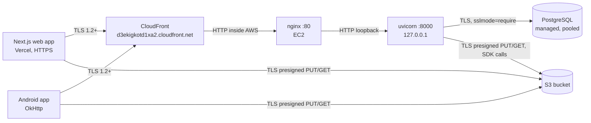

# Security: data in transit and at rest

How field data — artisan PII, GPS points, photographs, interview recordings and their transcripts —
is protected between the capture device and storage, what protects it once stored, and the risks
that are still open. Everything marked **ACTION** needs a human in a console; the code side is
already in the repository.

Audience: whoever operates the deployment (the AWS, database-provider and Vercel consoles) and
whoever reviews changes to `backend/app/core/*` and the Android network configuration.

---

## 1. Transport



| Hop | Protection | Where it is enforced |
|---|---|---|
| Browser / phone → API | TLS 1.2+ terminated at CloudFront | `android/app/build.gradle.kts` default `apiBaseUrl`, Vercel `NEXT_PUBLIC_API_URL` |
| CloudFront → nginx (EC2 origin) | **Plaintext HTTP inside AWS** — see risk P1 | CloudFront origin protocol policy |
| nginx → uvicorn | Plaintext on loopback (never leaves the box) | `ExecStart … --host 127.0.0.1` |
| Client → S3 (media bytes) | TLS; presigned URLs are always `https://` | `backend/app/services/s3.py` builds `https://s3.dualstack.<region>.amazonaws.com` |
| API → Postgres | TLS, **no plaintext fallback** | `sslmode=require` injected in `backend/app/core/config.py` |
| API → AI providers | TLS (vendor SDKs/HTTP clients) | `backend/app/services/ai.py` |

### 1.1 Database TLS

Every managed PostgreSQL worth using speaks TLS — but that is not the point, and assuming it is
was the bug. libpq and Prisma's PostgreSQL connector default to `sslmode=prefer`, which attempts
TLS and then **silently falls back to plaintext** if the handshake fails. A downgrade — a broken
proxy, a hostile network — would then ship the database password and every row in the clear, with
nothing in the logs to show for it.

`Settings._harden_database_url` therefore appends `sslmode=require` to `DATABASE_URL` as soon as
settings load, so both `build_runtime_database_url` in `core/db.py` and any script inherit it. (That
function used to rewrite a vendor's pooler host; the rewrite was removed on 2026-08-22 and the
hardening was never conditional on it.) The rule:

- **Remote host** (any managed PostgreSQL endpoint — anything not loopback/private) →
  `sslmode=require`.
- **Local host** (`localhost`, `127.0.0.1`, a private/RFC1918 address, a docker-compose service
  name) → left alone, because the docker-compose Postgres ships no certificate and `require` would
  break local development and the test suite.
- **Already configured** (`sslmode`/`sslaccept`/`sslcert`… already in the URL) → left alone; an
  explicit operator choice always wins.
- `DATABASE_REQUIRE_SSL=true|false` forces either answer.

`prisma migrate deploy` is unaffected: it reads `DATABASE_URL` straight from the environment, not
from this Settings object. Add `?sslmode=require` to the deployed `.env` value if you want
migrations covered too. It is harmless on any PostgreSQL endpoint that terminates TLS, which is
every managed one; the only host it would break is a local server with no certificate, and those are
not what `DATABASE_URL` points at in a deployment.

### 1.2 Security response headers

`SecurityHeadersMiddleware` in `backend/app/main.py` is registered last, which makes it the
**outermost user middleware**, so it stamps route responses, CORS preflights and the responses
produced by exception handlers (including the JSON 4xx/5xx bodies FastAPI raises). It is pure ASGI
(no `BaseHTTPMiddleware`), so it adds nothing to streaming responses or request cancellation, and it
never overwrites a header a route already set.

**One response is not covered.** Starlette's `ServerErrorMiddleware` — the last-resort handler for an
exception that escapes every user middleware — sits *outside* the whole user middleware stack, so its
bare `Internal Server Error` 500 goes out unstamped. That response carries no data and no
`Access-Control-Allow-Origin` either, so it is not a disclosure path; it is simply the one gap in
"every response". Do not read the table below as covering it.

| Header | Value | Why |
|---|---|---|
| `Strict-Transport-Security` | `max-age=63072000; includeSubDomains` | Browser refuses plaintext to this host for 2 years. **Only sent when the request arrived over TLS** (`scheme == https`, `X-Forwarded-Proto`, `CloudFront-Forwarded-Proto`, `X-Forwarded-Ssl`), so a local `http://` dev server never poisons a developer's browser. |
| `X-Content-Type-Options` | `nosniff` | Stops a JSON error body being sniffed into HTML/JS and executed. |
| `X-Frame-Options` | `DENY` | Clickjacking defence for browsers predating CSP `frame-ancestors`. |
| `Content-Security-Policy` | `default-src 'none'; frame-ancestors 'none'; base-uri 'none'; form-action 'none'` | A JSON API loads nothing and may not be framed. |
| `Referrer-Policy` | `strict-origin-when-cross-origin` | Keeps record ids and query strings out of the `Referer` sent to S3/MapTiler/Google. |
| `Permissions-Policy` | camera/mic/geolocation/… all `()` | Denies every powerful browser feature on this origin. |
| `X-Permitted-Cross-Domain-Policies` | `none` | No Flash-era cross-domain policy file is honoured. |

`/docs`, `/docs/oauth2-redirect` and `/redoc` are real HTML pages that load Swagger-UI / ReDoc from
jsdelivr, so they receive a narrower-but-workable CSP instead of the API one. Everything else gets
the strict policy. Whether those pages are served *at all* is now a setting — see §1.4.

### 1.4 The interactive docs and the OpenAPI schema

FastAPI serves `/docs`, `/redoc` and `/openapi.json` to anyone by default, and **on this deployment
they are currently reachable unauthenticated.** Verified 2026-07-27:

```
/docs          200
/redoc         200
/openapi.json  200   ~190 KB
```

The schema names every route, every query parameter and every field of every model, including the
ones behind admin-only roles. That is a map of the API handed to whoever asks, and it is worth
nothing to the researchers this app is for, none of whom read an OpenAPI schema.

`BACKEND_EXPOSE_DOCS` now controls all three, and it defaults to **`False`**. The default is closed
rather than open because the production `.env` lives in a GitHub secret this repository cannot read,
so a default-on flag would leave the docs exposed exactly where it matters. **The fix is in the tree
and not yet deployed**; the next backend deploy closes them. Local development opts back in with
`BACKEND_EXPOSE_DOCS=true`, which `.env.example` ships commented in.

**HSTS in production.** The viewer's TLS terminates at CloudFront, and nginx overwrites
`X-Forwarded-Proto` with its own (plaintext) scheme, so the app usually cannot tell that the viewer
used HTTPS. Set `SECURITY_FORCE_HSTS=true` in the EC2 `.env` to emit HSTS unconditionally.
`SECURITY_HSTS_ENABLED=false` disables the header entirely; `SECURITY_HSTS_MAX_AGE` tunes the age.

`preload` is deliberately **not** in the header. The API is served from a shared
`*.cloudfront.net` domain; submitting a shared domain to the HSTS preload list is not ours to do.
Once the API moves to a dedicated domain, adding `preload` becomes reasonable.

### 1.3 CORS

`BACKEND_CORS_ORIGINS` is an explicit allow-list, parsed defensively (comma **or** newline
separated, tolerant of pasted quotes/brackets, trailing slashes stripped because an `Origin` is only
ever `scheme://host[:port]`, duplicates dropped).

If the list contains `*`, `Settings.cors_allow_credentials` turns **false** and `create_app()` logs
an error. Reason: browsers reject a literal `Access-Control-Allow-Origin: *` alongside
`Allow-Credentials: true`, and Starlette works around that rejection by echoing the *caller's*
origin when the request carries cookies — turning a lazily-configured `*` into "any website may
call this API as the signed-in user". Keep `BACKEND_CORS_ORIGINS` set to the exact Vercel origin.

### 1.4 Android

`android/app/src/main/res/xml/network_security_config.xml`:

- `base-config cleartextTrafficPermitted="false"` — TLS required for every host not named below.
- Cleartext is permitted **only** for `10.0.2.2` (emulator → host machine), `127.0.0.1` and
  `localhost`. The EC2 origin behind the compiled-in CloudFront default
  (`ec2-15-207-145-174….compute.amazonaws.com`, `15.207.145.174` — the **field repository's** box,
  per the register in [CI.md](CI.md) §0, and part of the unresolved distribution question in
  [ENVIRONMENT.md](ENVIRONMENT.md) §4) was **removed**: it is a production host reachable only over
  plaintext HTTP, and keeping it listed meant one line in `local.properties` could ship bearer
  tokens and field data in the clear.
- Trust anchors are `system` only, so a user-installed CA (corporate MITM root, mitmproxy) cannot
  silently decrypt app traffic. `debug-overrides` re-adds `user` for debuggable builds only, so
  proxy debugging still works during development.
- `AndroidManifest.xml` sets `android:usesCleartextTraffic="false"`. The XML config takes precedence
  on every supported API level (minSdk 26); the manifest flag states the same intent for platform
  APIs that read it directly.

Developing against a LAN backend from a real phone: add your machine's private IP as an extra
`<domain>` **temporarily** and do not commit it.

---

## 2. At rest

### 2.1 S3 (media: photos, video, audio, documents, transcodes, APK releases)

| Path | Encryption | Mechanism |
|---|---|---|
| Multipart upload (large files) | Explicit SSE-S3 (AES-256) | `create_multipart_upload(..., ServerSideEncryption=…)` — `AWS_S3_SSE_ALGORITHM`, default `AES256` |
| Single presigned PUT (most web uploads) | **Bucket default encryption** | Applied server-side by S3 regardless of what the client sends |

**Why the single-PUT path cannot set the header in code.** Adding `ServerSideEncryption` to the
presign parameters puts `x-amz-server-side-encryption` into the SigV4 *signed headers*, which makes
it mandatory for the client: any PUT without that exact header fails with `SignatureDoesNotMatch`.
Both clients send only the headers `/media/presign` returns (`Content-Type`), and Android builds
already installed in the field can never be retrofitted — so signing it would break every upload,
including from phones that will never be updated. Bucket default encryption achieves the same
result with no client cooperation, which is why it is the load-bearing control here.

**ACTION — enable bucket default encryption** (S3 console → your bucket → Properties → Default
encryption → Edit): *Server-side encryption with Amazon S3 managed keys (SSE-S3)*, Bucket Key
enabled. Buckets created after January 2023 have this on by default — **verify** rather than assume,
and note it only applies to objects written *after* it is switched on. Re-encrypt anything older
with an in-place copy:

```bash
aws s3 cp s3://YOUR_BUCKET/media/ s3://YOUR_BUCKET/media/ \
  --recursive --sse AES256 --metadata-directive REPLACE
```

**ACTION — deny plaintext access to the bucket.** Add this statement to the bucket policy (S3
console → Permissions → Bucket policy). It rejects any request that did not arrive over TLS, which
covers the public media reads as well as the presigned PUTs:

```json
{
  "Sid": "DenyInsecureTransport",
  "Effect": "Deny",
  "Principal": "*",
  "Action": "s3:*",
  "Resource": [
    "arn:aws:s3:::YOUR_BUCKET",
    "arn:aws:s3:::YOUR_BUCKET/*"
  ],
  "Condition": { "Bool": { "aws:SecureTransport": "false" } }
}
```

Keep the existing `PublicReadMedia` allow statement (see `backend/DEPLOY_AWS.md` §4) — an explicit
`Deny` always wins over an `Allow`, so ordering does not matter.

**Do NOT add** the "deny unencrypted object uploads" statement
(`s3:x-amz-server-side-encryption` `Null: true`) that hardening guides usually pair with this. It
would reject exactly the presigned single PUTs described above and break all small-file uploads.
Default encryption already covers them.

**Media objects under `media/*` are world-readable.** The bucket policy grants `s3:GetObject` to
`Principal: "*"`, so anyone who learns an object URL can fetch the file without any token — the
object key (`media/<user-id>/<uuid>/<filename>`) is the only secret. Encryption at rest does not
change this; SSE-S3 protects the physical disks, not URL holders. See risk P0.

**Objects under `backups/` are NOT world-readable, and that is a property of how narrow the policy
is.** `aws_s3_bucket_policy.media_public_read` grants anonymous `GetObject` on `media/*` and on
nothing else, so the nightly database dumps ([CI.md](CI.md) §1.5) and the Terraform state under
`tfstate/` sit in the same bucket and answer nobody. **Widening that policy to `/*` would publish a
full database dump and a state file containing a live IAM secret access key.** It is the single most
consequential edit available in `infra/terraform/main.tf`, and the file says so at the resource.

#### The type an object is stored with is now validated (2026-09-03)

`POST /media/presign` puts the caller's `mimeType` into the object's **signed `Content-Type`**, which
is the type the storage host later *serves* it with. Until 2026-09-03 it accepted any string of up to
180 characters and signed it verbatim, so a `text/html` upload became a stored, world-readable
document that a browser **executes** when opened — a phishing page or a credential-harvesting form
living at a URL on the organisation's own storage host, reachable through `GET
/data/media/{id}/download`'s 307 and through the media lightbox's "Open" control.

Both `POST /media/presign` and `POST /media/multipart/create` now check the declared type against an
allow-list before signing anything. The shape is **broad prefix families with a deny-list in front of
them**, because an allow-list narrower than what the fleet actually uploads is not a control but an
outage: Android's `saveOrQueue` does not queue a 4xx, so a refused presign *loses* the recording. The
deny-list carries `text/html` and its XHTML/JavaScript spellings, which is the whole of what made the
stored object a document.

Two types are accepted deliberately, and the reasons are worth keeping because both look like
oversights:

* **`application/octet-stream`** — the audit asked for it to be refused. It is not, because both
  shipped clients emit it as their fallback for a file the platform will not type
  (`frontend/lib/media.ts`, and Android's `contentResolver.getType(uri) ?: …`), so refusing it would
  422 a declared registry field from every device. It is also the **inert** type: a browser downloads
  it and never renders it, which is not the case this control was about.
* **`image/svg+xml`** — the one genuinely scriptable type on the list, and the registry asks for it
  by name (`sketch.lineArtFile`). The argument for keeping it is that the storage host is a
  **different origin** from the app, so what executes can read neither this app's storage nor its
  cookies. **The mitigation is now the only remaining control for SVG** and it lives on the
  distribution, not in this code: a `Content-Disposition: attachment` or
  `Content-Security-Policy: sandbox` response header on the bucket/CDN, as named in
  `frontend/components/forms/MediaCaptureField.tsx`. That rule is not yet in place.

### 2.2 The database

Nothing in this section depends on which provider hosts it, with one exception, which is called out
first because it is the one that changed under this document's feet.

- **Encryption at rest is the provider's, and this repository cannot verify it.** Until 2026-08-22
  this section asserted AES-256 volume and backup encryption as a fact about one vendor's platform;
  production then moved twice (see "The database" in [ENVIRONMENT.md](ENVIRONMENT.md)), and a claim
  about one vendor is not transferable to another. **ANSWERED 2026-09-02, against the provider
  hosting production today:** its published security page states "All customer data is encrypted at
  rest with AES-256 and in transit via TLS." Backup encryption is **not separately asserted** on
  that page — and note that automated daily backups themselves are a paid-plan feature there, so
  the project's plan, not this repository, decides whether provider-side backups exist at all. No
  application configuration is required or possible either way. Re-confirm on the next provider
  move, with a date, as before.
- Passwords are stored as bcrypt hashes (`passlib`, `CryptContext(schemes=["bcrypt"])`). Google
  sign-in accounts have no password hash at all.
- **Nothing is encrypted at the column level.** Artisan names, phone numbers, addresses, GPS
  coordinates, interview transcripts and researcher notes are plaintext columns. Anyone with the
  database URL, a login to the provider's dashboard, or a `DATABASE_URL` leak reads all of it. Treat
  the database credentials as the crown jewels.
- Row Level Security is **not** in use: the API connects as the owning role and enforces every
  access rule in application code (`backend/app/core/deps.py`). A SQL-injection bug or a leaked
  connection string bypasses the entire RBAC ladder in one step. Prisma's parameterised queries are
  what stand between the two; keep raw SQL (`db.query_raw`) free of string interpolation.

### 2.3 What is *not* encrypted, anywhere

| Data | Where it sits | State |
|---|---|---|
| Media object keys / public URLs | `MediaFile.url` in Postgres, and in every client | Plaintext, and the URL alone grants read access |
| Auth token (web) | `localStorage["field_repo_token"]` | Plaintext, readable by any script on the origin |
| Auth token (Android) | `SharedPreferences("field_repository_auth")`, `MODE_PRIVATE` | Plaintext file in app-private storage; readable on a rooted device, and `android:allowBackup="true"` means it can leave the device in a backup |
| `.env` on EC2 | `/home/ubuntu/app/current/backend/.env`, `EnvironmentFile=` | Plaintext on an unencrypted-by-default EBS volume; holds `DATABASE_URL`, `JWT_SECRET`, AWS keys, every AI provider key. `current` is a symlink to the live release ([CI.md](CI.md) §1.2), and **each retained release keeps the `.env` it was deployed with** — so up to three plaintext copies exist on the volume at once, not one |
| Temporary media during processing | `tempfile` on the EC2 disk (ffmpeg/transcription) | Plaintext; removed after the job |
| CSV / dataset exports | Streamed to the downloader | Plaintext; once downloaded the data is outside every control in this document |

---

## 3. Authentication and sessions

### 3.1 Tokens

| Property | Value | Enforced in |
|---|---|---|
| Algorithm | HS256 (HMAC), **pinned on decode** | `decode_access_token(..., algorithms=[settings.jwt_algorithm])` |
| Allowed algorithms | HS256 / HS384 / HS512 only | `Settings._normalise_jwt_algorithm` — `JWT_ALGORITHM=none` refuses to start |
| Expiry | `JWT_EXPIRES_MINUTES`, default 10080 (7 days) | `create_access_token`; `verify_exp` + `require_exp` on decode |
| Subject | `sub` = user id, required | `require_sub` on decode, re-checked in `deps.get_current_user` |
| Secret | ≥ 32 characters, never the example placeholder | `verify_jwt_configuration()` at `create_app()` |

Pinning the algorithm closes **algorithm confusion**: without it, a token whose header says
`alg: none` is unsigned-but-accepted, and one that says `alg: RS256` is verified with our shared
secret treated as a public key. Requiring `exp` closes the "token with no expiry claim lives
forever" variant.

**The API refuses to start** if `JWT_SECRET` is the `.env.example` placeholder, is empty, or is
shorter than 32 characters — a guessable HMAC secret lets anyone mint a master-admin token, so it
must fail visibly on deploy rather than silently in production. `ALLOW_WEAK_JWT_SECRET=true`
downgrades the refusal to a `CRITICAL` log line for local development only.

Generate a real one with:

```bash
python -c "import secrets; print(secrets.token_urlsafe(48))"
```

### 3.2 Known weaknesses (accepted, with mitigations listed in §5)

- **Token storage is `localStorage` on the web.** Any successful XSS on the frontend origin reads
  the token and impersonates the user for up to 7 days. `HttpOnly; Secure; SameSite` cookies would
  make the token unreadable to script, at the cost of a CSRF defence and a change to both clients.
  The strict CSP on API responses does not help here — the risk lives on the *frontend* origin.
- **No refresh tokens, and revocation is narrow rather than absent.** *Rewritten 2026-09-03; this
  bullet used to read "no refresh tokens and no revocation", and that had been half wrong for a
  while and wholly wrong since that date.* A token is valid until `exp` unless one of two things has
  happened.

  First, `get_current_user` re-loads the user row on **every** request, so a *deleted* user is
  rejected immediately and a *demoted* user loses privileges immediately — the role in the token is
  never trusted for authorisation (§4.1).

  Second, `User.sessionsValidFrom` is a **per-account revocation watermark**: `deps._user_from_bearer`
  refuses any token whose `iat` predates it. Nothing new is read on the hot path to do it — the `User`
  row is loaded to authenticate the request regardless. Four acts write it: redeeming an
  admin-issued password link (`routes/auth.set_password`, the original writer), and, since
  2026-09-03, barring the address on the platform allow-list — `DELETE /api/access/roster/{id}` and
  the REJECT arm of `POST /api/access/roster/{id}/decision` — and ending an empanelment on the
  designer roster (`PATCH` and `DELETE /api/designers/roster/{id}`, which stamp only when the
  empanelment was actually carrying admissions). Before that date, suspending an account stopped the
  next sign-in and left the session the person was already in running for the rest of the token's
  lifetime: an administrator suspended a departing colleague at 10am, watched the row go SUSPENDED,
  and that colleague's phone went on creating records for up to seven days.

  **What is still NOT revoked, named so nobody infers otherwise.** Rows barred *before* 2026-09-03
  were never stamped and nothing backfills them on its own. And when the Gmail-alias sweep that finds
  every spelling of one mailbox is cut by its own limit
  (`access_roster.GMAIL_ACCOUNT_SWEEP_LIMIT`), the barring door logs at ERROR and returns without
  stamping — it cannot stamp accounts it could not read. That is the unsafe direction and it is
  deliberately loud rather than silent. (The narrower gap this bullet carried earlier in the day —
  that an account filed under `a.b@gmail.com` was missed when its roster row was filed under
  `ab@gmail.com` — was closed the same day: the lookup is now
  `access_roster.accounts_on_the_mailbox`, which canonicalises both sides and stamps every spelling.)

  A **role change** deliberately signs nobody out: losing a tier is not losing access, and the
  identity-cache invalidation is what makes a demotion take effect on the next request.

  Rotating `JWT_SECRET` still invalidates every token at once and remains the break-glass response
  to a suspected theft.
- **7-day lifetime** is long for a token that can only be revoked by the writers named above. It is a
  deliberate trade for field work with intermittent connectivity.
- **Android backup.** `android:allowBackup="true"` lets the auth token and preferences travel
  through Google's backup. Excluding them needs a `dataExtractionRules` / `fullBackupContent`
  resource, or moving the token to `EncryptedSharedPreferences`.

### 3.3 Google sign-in

Google ID tokens are verified server-side against Google's keys with the audience restricted to
the configured client ids (`GOOGLE_CLIENT_ID`, `GOOGLE_ANDROID_CLIENT_ID`). Brand-new self-registered
accounts land on `DEFAULT_SIGNUP_ROLE`, which defaults to the **lowest** tier
(`CROWDSOURCE_VOLUNTEER`) so an unknown Google account cannot read or write as a researcher until an
admin elevates it.

---

## 4. Authorisation: the eight-tier ladder

Defined in `backend/app/core/deps.py`. Higher ranks inherit everything below them.

**EIGHT since 2026-08-27**, when `INSPECTOR` was inserted at rank 37 — see the row in the table and
the two notes under it, and [PERMISSIONS.md](PERMISSIONS.md) §1 for the reasoning. The heading, the
count and the table were widened in the same wave as the enum, which is the discipline the paragraph
below exists to enforce and not a happy accident.

**Before that it was SEVEN, and this heading said six for as long as `DESIGNER` had existed.** The tier was inserted
at rank 35 — in the gap the original tens deliberately left — and this section went on printing a
six-row table, so a reader counting down the rows to work out what a designer may do got an answer
for somebody who is not in the product. A miscounted ladder is a security defect and not a typo:
this is the document a reviewer reads to decide whether a gate is covered, the repository's own
main permission test did not cover `DESIGNER` in its LADDER-WIDE tests until 2026-08-22 (`ALL_ROLES`
in `backend/tests/test_permission_matrix.py` was a six-entry tuple, though the `BELOW_ADMIN` block
in the same file has always driven the tier), and a sentence that says six is precisely how the
seventh keeps being left out of the next one. That gap is stated narrowly on purpose: a security
document that overstates a coverage hole is the same defect as one that understates it.

**The full capability matrix, the review state machine and the five layered access systems are
[PERMISSIONS.md](PERMISSIONS.md).** This section states only the security-relevant properties, so
that the matrix has exactly one home and cannot disagree with itself.

| Rank | Role | Security-relevant powers |
|---|---|---|
| 60 | `MASTER_ADMIN` | Everything, **plus the three nobody else has**: read/set provider key values, repository settings, publish OTA releases. The only account that may act on a peer. |
| 50 | `ADMIN` | Delete records, create/delete accounts, grant workshop access, approve **late** submissions |
| 40 | `PROFESSOR` | Manage crafts/workshops/questionnaire, download the dataset, view and promote users |
| 37 | `INSPECTOR` (labelled **"Inspector / Reviewer"**) | Everything a researcher may do, **plus reviewing a `DESIGNER`'s records** and reading a design workshop it has been scoped to. **Read-only in the workshop tree, and only where scoped** — it is outside `can_run_design_workshops`, exactly as a professor is, so it cannot run, stage-write, submit or sign a workshop. See both notes under this table. |
| 35 | `DESIGNER` | Everything a researcher may do, plus running a design & prototype workshop — the stage writes, the custom sections, the AI layers, the consent record (`can_run_design_workshops`). **Not reachable by outranking it** — see the note under this table. |
| 30 | `RESEARCHER` | **Create** records; edit own; review contributors and volunteers |
| 20 | `FIELD_CONTRIBUTOR` | Populate existing records; review volunteers. **Cannot create records.** |
| 10 | `CROWDSOURCE_VOLUNTEER` | Media, questionnaire answers and comments on existing records only |

**The one rule in this section that is not a threshold.** `can_run_design_workshops` is a **SET** —
`DESIGNER`, `ADMIN`, `MASTER_ADMIN` — so a `PROFESSOR` at rank 40 and an `INSPECTOR` at 37 both
outrank a designer at 35 and still cannot run a design & prototype workshop. `is_admin` is written as a set and
`is_master_admin` as an equality, but both name the TOP of the ladder and so behave exactly as
thresholds; this one skips a tier in the middle, which nothing else here does
([PERMISSIONS.md](PERMISSIONS.md) §1 calls it the one predicate in `deps.py` that is a set and not a
threshold, for the same reason). It is worth naming in a security document because an auditor who
reads the table as monotonic will conclude the professor gate covers the designer gate, and it does
not. The web client carries the identical set in `canRunDesignWorkshops`
(`frontend/lib/permissions.ts`) and must keep carrying it.

**The two directions `INSPECTOR` moves, because a security reader needs both and the table row only
carries one.** An audit on 2026-08-26 established that every design-workshop gate in this product is
set membership and not a rank floor — `_require_designer`, `load_ratable_workshop_or_404`,
`access_for` and `_assert_every_id_may_be_granted`. So a rank between 35 and 40 **gains nothing** in
the workshop tree, which is why the tier's actual workshop reach is a separate read-only row in
`DesignWorkshopInspector` ([PERMISSIONS.md](PERMISSIONS.md) §4.5) rather than anything the number
buys. That system's read loader takes **no `for_edit` parameter** and refuses to grow one, which is
what makes "read-only" a structural property here rather than a policy note: there is no argument an
inspector's request could carry that turns the read into a write.

In the other direction it **gains something no line of code names**: `can_review_record` is "strictly
below me", and 35 < 37, so an inspector may approve, reject and send back the repository records of
every designer, repository-wide and with no scope involved. **That is intended** — it is why the rank
is above 35 rather than below it — and the security-relevant part is the mechanism, not the outcome:
a rank insert confers it with no line naming either tier and no test going red, which is the shape
the 2026-08-26 audit flagged before the tier existed. It is written down in `can_review_record`'s
docstring and asserted in `backend/tests/test_inspector_tier.py` in both directions — an inspector
may reject a designer's record and may **not** rewrite it, because `can_edit_others_record` narrows
the same comparison to rank 40. True as of 2026-08-27; re-check with
`grep -n "def can_review_record" -A 30 backend/app/core/deps.py`.

**What this predicate does NOT gate, because the rank row above is easy to read as though it did.**
Running a workshop is not the same act as generating its report, and two file headers in `backend/`
carry standing corrections for conflating them: `can_run_design_workshops`' docstring says in capitals
that "IT DOES NOT DECIDE WHO MAY OPEN A WORKSHOP, AND IT DOES NOT GATE THE REPORT", and the module
header of `app/api/routes/design_workshops.py` says the same of the report. `generate_report` depends
only on `get_current_user` and then on `load_workshop_or_404`, so the report is gated by READ access —
the creator, an admin, or the holder of a `DesignWorkshopViewer` grant. The access CONCLUSION is
unchanged, because viewer eligibility is itself `DESIGN_WORKSHOP_ROLES`
(`app/services/design_workshop_viewers.py`), so a professor cannot generate one either; but they are
two different gates and an auditor looking for the report behind `can_run_design_workshops` will not
find it there.

Three corrections to what this table said previously, each of which mattered:

- **A Field Contributor cannot create records.** `can_create_records` requires rank ≥ `RESEARCHER`.
- **An admin cannot edit another admin's record.** `can_edit_others_record` composes
  `has_rank(PROFESSOR)` **and** `can_review_record`, and the latter requires *strictly* below. Rank 50
  is not strictly below rank 50. "Edit anyone's records" was wrong; "edit records created by anyone
  ranked below them" is right.
- **`canManageCrafts` and `canManageWorkshops` are no longer read.** They are still columns on
  `User`, and `users.py` still writes them, but no decision consults them: craft and workshop
  management is Professor **by rank alone**. The reason is a security one and is worth stating here
  rather than only in the docstring — a grant that lifts a researcher over the *taxonomy* is
  invisible in the role column, so nobody auditing the user table can see who holds it. Listing them
  as live grantable flags overstated the attack surface in one direction and understated the audit
  problem in the other.

Live grantable flags, therefore: **`canReview`, `canDownloadDataset`, `canManageQuestionnaire`,
`canViewProvenance`**.

Record-level rules layered on top of the ladder:

- `assert_can_contribute_fields` — a non-owner, non-admin may fill *empty* fields but may never
  change or clear a populated one. (An earlier version skipped incoming empty values, which let
  anyone **blank out** a populated field. Both directions are guarded now.)
- `can_review_record` — you may only review work created by someone **strictly below** you; the
  master admin reviews everyone.
- Object keys are namespaced `media/<user-id>/…` and a user may only manage their own staged uploads;
  `DELETE /media/object` additionally 409s on an object a record already points at.
- Cross-researcher access is tiered (download / comment / edit) with request+grant flows and an
  append-only `RecordRevision` audit trail recording `{field: {old, new}}` per edit. **Since
  2026-09-03 the revision and the row it describes are written in ONE transaction**
  (`access.record_revision` takes the caller's `client`), so the ledger can never record an edit that
  did not land. The failure mode it replaces is specific: a revision committed one statement before
  an `update` that died, naming an editor as the author of a value no row holds.
- A record submitted outside its workshop's dates is stamped by the **server** (a
  `workshopSubmission` key arriving from the client is replaced, never trusted), pinned to `PENDING`,
  and approvable only by an admin. The stamp survives an edit and survives a re-link to an in-window
  workshop — both are laundering paths that were closed deliberately.

Authorisation is **entirely application-side** (see §2.2 on RLS).

### 4.1 The token is not the authority

`create_access_token` puts `email` and `role` into the JWT, and **neither is trusted for
authorisation**. `get_current_user` re-reads the user row and every rank check reads *that*. This is
the revocation mechanism: tokens live seven days and are revoked only by the writers of
`sessionsValidFrom` (§3.2), so a role claim minted before a demotion would otherwise stay valid for a
week.

The identity cache (`AUTH_USER_CACHE_*`) shortens that revocation window; it does not remove it.
Five seconds by default, sized to collapse the burst of parallel requests one page load makes.
Explicit invalidation runs on every write that changes a user's authority — `users.py` create/update/
delete, the Google sign-in upsert in `auth.py`, `scripts/seed_admin.py`, and, since 2026-09-03, the
two barring doors in `routes/access.py`, the empanelment-ending doors in `routes/designers.py`, and
`set_password`'s session revocation in `auth.py` — so in-process a demotion or a bar takes effect on
the very next request. A **miss is never cached**, so a deleted account 401s every time rather than
for a TTL. An epoch counter is bumped by every invalidation and compared before the result is stored,
so a query already in flight when a role was revoked cannot write the pre-revocation row back.

**The cache was re-justified when the database was co-located on 2026-09-02, and the honest reading
of its TTL changed with it.** The 200–400 ms cross-region round trip it was traded against is gone —
a keyed `find_unique` is now on the order of 1–2 ms — so what the cache buys today is **burst
dedupe**, single-flighting one token across the parallel requests of a page load, not latency. And
the TTL is now a window on *session* revocation as well as on role and existence:
`_user_from_bearer` reads `sessionsValidFrom` off the row `resolve_user` hands it, so a cached row
carries the pre-revocation value. That only bites on writes no application process made — a `psql`
session, `scripts/seed_admin.py`, a future second replica — because every revocation writer calls
`invalidate_cached_user` and the deployment runs one worker on one replica. Cutting
`AUTH_USER_CACHE_TTL_SECONDS` to 1–2 seconds, or to 0 with `AUTH_USER_CACHE_ENABLED=false`, is a
cheaper trade than it was and is **recommended for the next deployment review**. It was deliberately
not changed here as a silent constant edit: the number is a security parameter and moving it belongs
in a decision somebody made, not in a docs wave.

`AUTH_USER_CACHE_ENABLED=false` restores one-query-per-request with a restart and no deploy. That
kill switch is the point of the flag: if the cache is ever suspected of serving a stale role during an
incident, it can be removed without shipping code.

---

## 4A. Personal data

The archive is about people, and two columns are direct government identifiers.

### 4A.1 Aadhaar

`Artisan.aadhaarNumber` is stored as the bare twelve digits and is `@unique` — it is the
**deduplication key**, which is what stops the same person being entered twice under two spellings
across two workshops. Handling, in `backend/app/services/artisan_identity.py`:

| Function | Does |
|---|---|
| `normalize_aadhaar` | strips the spacing people type (`"1234 5678 9012"`) to the 12 stored digits |
| `verhoeff_ok` | validates the UIDAI check digit — catches every single-digit error and every adjacent transposition, the two ways a 12-digit number is misread |
| `mask_aadhaar` | renders `XXXX XXXX 9012` for **every shared surface**: the Data Browser, the `.xlsx` report, CSV exports, and — since 2026-08-24 — a design workshop's participant roster and the ministry report built from it (see §4A.1) |
| `is_masked_aadhaar` | recognises a mask posted back unchanged from an edit form, so saving without touching the field is a no-op rather than a validation error |

**The exact threshold, because this paragraph used to overstate it (corrected 2026-08-22).** It read
"anything shorter than a full number is masked **entirely**". The real rule is **shorter than
FOUR**: all three ports — `mask_aadhaar`, `frontend/lib/identityCardText.ts`'s `maskIdentityNumber`
and Kotlin's `ArtisanIdentity.mask` — branch on `< 4`, so a value of four to eleven digits reveals
its last four exactly as a full one does. A six-digit malformed legacy value discloses four of its
six digits. Whether any such value exists is a database question, not a code one.

`ArtisanIdentity.mask`'s KDoc gets the *threshold* right — "anything shorter than four digits" —
and then repeats the same false justification beside it, "a malformed value can never leak more than
a well-formed one"; `mask_aadhaar`'s docstring and `maskIdentityNumber`'s restate the overstatement
whole. So the divergence is between the *comments* and the code rather than between the three
implementations, which agree on the `< 4` branch — they do **not** agree on what they count before
applying it, which is the Pehchan note further down. Do not re-broaden the sentence here without
changing the three functions in the same commit: they are a deliberate three-way port, and fixing
one of them alone is how a port stops being one.

**Only two of the three ports are reachable in the product, and the third is kept on purpose
(recorded 2026-08-22).** `mask_aadhaar` runs inside every encoded response, and
`ArtisanIdentity.mask` renders the handset's Aadhaar detail row through the file-private
`maskAadhaar` wrapper in `MainActivity.kt`. The web's `maskIdentityNumber` has **no production
caller**: `frontend/e2e/identity-card-web-unit.spec.ts` is the only file that imports it, because the
browser is never handed a number that still needs masking — the server masks before the value is on
the wire, and the edit form's concern is the opposite direction, `isMaskedIdentityNumber` in
`components/forms/AadhaarField.tsx`, recognising a mask posted back.

**It was not deleted, and the reason is worth the paragraph.** An audit brief described the dead
helper as encoding a *weaker* rule than the live redaction. Run against both real functions, it does
not. On an all-digit Aadhaar the two are identical. On anything else they diverge, because
`normalize_aadhaar` removes only whitespace and dashes while `NON_DIGITS` reduces the value to
digits — and the divergence does not run one way:

| Input | `mask_aadhaar` (live) | `maskIdentityNumber` (dead) |
|---|---|---|
| `123456789012` | `XXXX XXXX 9012` | `XXXX XXXX 9012` |
| `PMVK12` | `XXXX XXXX VK12` | `XXXX XXXX XXXX` |
| `12A345` | `XXXX XXXX A345` | `XXXX XXXX 2345` |

Each reveals four characters; on a mixed value they are not the *same* four, and the dead one can
surface a digit the live one masked while masking a letter the live one showed. Neither dominates,
and no input made the dead helper reveal more than four. **A helper with no caller leaks nothing, so
the disposition is: keep it, and pin the disagreement here.** The real hazard is the future edit
that gives it a caller — specifically one that hands it a Pehchan card number, which is uppercase
alphanumeric, and would then get a mask the server would never have produced. Anyone wiring it up
owes that reading first.

**Masking is applied at the encoder, not at the call sites.** It used to be per-call-site, and a
surface that forgot to call it leaked the full number — which is exactly what happened. Masking at
the boundary means a new export surface is masked by default and has to opt *out* to leak.

Callers that legitimately need the full value read the raw column. Nothing writes it to a log.

`pehchanCardNumber` (the PM Vishwakarma artisan ID) is an ordinary government reference number,
normalised to uppercase alphanumerics, `@unique`, required exactly when the artisan says they hold
one. ~~It is not masked.~~

**CORRECTED 2026-08-22 — it IS masked, and has been for some time.** This sentence was wrong in the
safe direction, which is the direction that gets re-derived rather than reported: a reader who
believes the number crosses in the clear either widens something to "restore" a leak that is not
there, or plans an audit that has already been done. The Pehchan number goes through the same
encoder rule as Aadhaar, on the same three surfaces:

| Where | What runs |
|---|---|
| The record encoder | `mask_identity_number` in `backend/app/services/records.py`, which reuses `mask_aadhaar` verbatim — the rule is "keep the last four", and the card it is applied to does not change it |
| The record field registry | `backend/app/services/record_fields.py` declares the Pehchan field as `mask_aadhaar(a.pehchanCardNumber)`, beside the Aadhaar field, so every surface built from the registry is masked by construction |
| The design-workshop stage hydration | `backend/app/services/design_workshops.py` fills the mirrored participant fields with `mask_identity_number(r.pehchanCardNumber)` **and, since 2026-08-24, `mask_identity_number(r.aadhaarNumber)`**, which is why neither an unmasked PM Vishwakarma ID nor an unmasked Aadhaar reaches a grantee's view of a workshop stage |

**THE AADHAAR NOW CROSSES ONTO THAT THIRD SURFACE TOO, MASKED — owner decision, 2026-08-24.**
Until that date the Aadhaar was carried into no design-workshop stage entry at any masking, and
several documents in this folder said so. The owner reversed it, having been shown that a
workshop's stage reads do not pass through `records._redact_sensitive`, that a
`DesignWorkshopViewer` is a grantee, and that a hydrated stage entry is a **permanent copy** —
hydration copies at save time and the report never re-resolves, so clearing `Artisan.aadhaarNumber`
afterwards retracts it from no entry and no already-generated document. Both numbers now cross on
identical terms, through the same helper, so one artisan's identity reads the same everywhere.
The decision, what the owner was shown, and the exact procedure to reverse it are recorded above
`participant.aadhaarNumber` in `backend/app/services/stage_definitions.py`.

Two consequences a security reader should have in front of them, neither of them hidden:

* the field is **typeable**, deliberately — hydration only fills blanks, so a designer entitled to
  the full number can supply one the record does not hold. ~~Android's `DwIdentityOcr` matches
  identity fields per field, so its on-device recogniser can write a **full twelve digits** into a
  stage entry in one tap. The box was hand-typeable by design either way; what changed is the
  effort;~~ **CORRECTED 2026-08-24, same day, after review: what is TYPED is not what is KEPT.** The
  paragraph above was true of the code and wrong about the decision. The owner decided both numbers
  cross *masked*, and the guarantee held only for the value hydration wrote: anything a client
  supplied afterwards — Android's Verhoeff-checked reader in one tap, or the registry help text's own
  invitation to type it in — was stored verbatim, permanently, on a surface whose stage reads never
  pass through `records._redact_sensitive`. `participant.aadhaarNumber` now declares
  `FieldSpec.store_masked`, so `coerce_value` masks the value **on every save** (and therefore also
  re-masks anything written before the flag existed, the next time that stage is saved). The box
  still takes a full number — that is the other half of the same instruction — and what is stored is
  `XXXX XXXX 9012`. Both clients say so on the control: the web prints what the save will keep while
  the digits are still on screen, and Android's card reader prints the full number on its button for
  proofreading and commits the mask. `participant.artisanCardNo` is deliberately **not** masked this
  way — its whole capture control exists to write the full Pehchan number off the card — so the two
  boxes on one roster row keep different amounts of what is typed, argued at both fields;
* clearing the column through `DELETE`-style redaction on `/artisans` no longer removes every
  copy. Four digits survive in every `DwStageEntry.data` that referenced the artisan. See the
  residue paragraph in `backend/app/api/routes/artisans.py`.

**One consequence of reusing the Aadhaar masker is worth knowing before anybody "improves" it:**
`mask_aadhaar` normalises through `normalize_aadhaar`, whose `_SEPARATORS` pattern removes
whitespace and dashes and **nothing else** — it does not reduce the value to digits. A Pehchan
number is uppercase alphanumeric, so its letters survive normalisation, count towards the
four-character floor, and can appear in the revealed tail: `XXXX XXXX` plus the last four
*characters* of the card, letters included. That is the same "keep the last four" rule the table
above states, applied to a string that is not all digits — not a second rule, and not a leak. It is
recorded here because a reader who assumes digits-only will read the code as broken and is likely
to "fix" it in the direction that reveals more. The two client ports normalise differently
(`NON_DIGITS` on the web, `normalizeAadhaar` on the handset); neither masks a Pehchan number,
because the Pehchan mask happens on the server before the value is ever sent.

### 4A.2 Everything else about a person

Names, phone numbers, email addresses, stated addresses, GPS coordinates, interview recordings and
their transcripts are **plaintext columns**, and the recordings themselves are **world-readable
objects** (§5, P0). The Aadhaar masking is a real control; it is not a general PII control, and it
should not be read as one.

**Location is two things, and conflating them is a privacy question as well as a data-quality one.**
The provenance group (`latitude`, `longitude`, `accuracy`, …) records **where the device was** — in
practice, where the researcher was sitting. The stated-address group (`state`, `district`, `village`,
`pincode`) records where the *subject* is. Publishing the first as though it were the second
misrepresents the subject's location; publishing it at all discloses the researcher's. See
[DATA_MODEL.md §2.4](DATA_MODEL.md).

---

## 5. Open risks, in priority order

Each item names the exact console action a human must take. Nothing here can be fixed by the
repository alone.

### P0 — Media objects are public to anyone holding a URL

`media/*` is world-readable, and object URLs are stored in the database, embedded in exports and
shared in comments. A leaked URL is a permanent, unauthenticated read of an interview recording or a
photograph of a person.

**Action (S3 + CloudFront console):** remove the `PublicReadMedia` statement and serve media through
either (a) presigned GET URLs minted by the API after the same RBAC checks that guard the record, or
(b) a CloudFront distribution in front of the bucket using Origin Access Control plus signed URLs.
Option (b) is console-only but needs the key pair managed. Until then, treat every media URL as
public.

**Option (a) is now closer than this document used to say.** `s3.py` already has
`presign_get_url(object_key, *, filename, mime_type, expires_in=900)` — it was added for APK release
downloads and is used by `app_release.py`. The remaining work is switching `public_url_for_key`'s
callers on the media paths and deciding the URL lifetime the clients need, not writing the primitive.

#### The server half is BUILT and shipped OFF — 2026-09-03

`MEDIA_PRESIGNED_READS` (default `false`) makes `public_encode` emit a 15-minute signed URL instead of
the permanent CDN one, at `records._sign_media_url` — the one door every read payload leaves by.
**Off is exactly today's behaviour, byte for byte.** The stored `MediaFile.url` column is never
rewritten either way, which is what makes the flip reversible.

The two moves this risk needs **must happen in this order and cannot happen together**: the server
stops emitting permanent URLs, and only then does a human remove `PublicReadMedia` from the bucket
policy. Doing the bucket first and the flag never is the one ordering that is unambiguously wrong.

#### THE OPERATOR RUNBOOK FOR THE MEDIA FLIP

`backend/app/core/config.py` and both `.env.example` files point readers here. Six steps; each names
its own rollback.

**1 · SHIP THE SERVER AND THE CLIENTS.** Deploy `main` with `MEDIA_PRESIGNED_READS` unset or
`false`, and publish **Android 0.0.8** and the web bundle carrying the URL-refresh tolerance. Nothing
changes for anybody. *Verify:* a `GET /api/media` row still returns the permanent CDN url.
*Rollback:* none needed — the flag is off.

**2 · THE FLEET ADOPTION GATE.** Do not proceed until effectively every active handset is on **≥
0.0.8**. Check it from the telemetry the fleet already reports — `GET /api/app-releases` and the
installed-version signal `WorkshopRepository.installedVersionCode` sends — and cross-check against
recent uploads per client version. **This is the step that cannot be undone by a server change.** A
0.0.7 handset caches `url` offline and renders photographs from the cached string with no network at
all: flipping ahead of adoption loses images on a phone that may not see a network for a week, and
nothing you deploy can reach it. *Rollback:* this step has no action to roll back — it is a wait.

**3 · SET THE FLAG.** Add `MEDIA_PRESIGNED_READS=true` to `BACKEND_ENV` and deploy. Leave
`MEDIA_PRESIGNED_READ_TTL_SECONDS` at `900`. *Rollback:* set it back to `false` and redeploy. **That
is the WHOLE rollback**, because the stored `MediaFile.url` column was never rewritten.

**4 · VERIFY.** `GET /api/media?pageSize=1` as an entitled account: `url` must now carry
`X-Amz-Signature`, `X-Amz-Expires=900` and `response-content-disposition=inline`. Fetch it — 200.
Wait sixteen minutes and fetch again — **403**. Open a PDF in the web lightbox and on the handset: it
must **preview, not download** (that is what `disposition=inline` is for). Confirm an unentitled
account still receives **no `url` at all**. Confirm `/export/dataset` and `/data` still return
manifests that download. *Rollback:* step 3's.

**5 · REMOVE `PublicReadMedia` FROM THE BUCKET POLICY.** Console; the statement is the one documented
in §2.1 above. *Rollback:* put the statement back — it is a policy edit, effective in seconds, and
every permanent URL starts working again.

**6 · VERIFY THE CLOSURE.** Take a media URL captured **before step 3** — the permanent CDN form —
and fetch it anonymously: it must now **403**. That is this risk closed. Then re-walk step 4, plus:

- `/data/media/{id}/download` must still serve. Its 307 target now 403s, so it falls through to
  streaming the bytes — **this is the step where that fallback is first load-bearing.**
- `/export/dataset` and the `/data` manifests must still download; they carry `export.py`'s six-hour
  signing fallback.
- `/data/report.xlsx`'s URL column is **dead by design** at this point. See the two deferred items in
  the decision table below; both are pre-flip work.

**WATCH FOR:** broken thumbnails reported after step 5 mean one of two things — a client without the
tolerance, or a deployment that cannot **sign**. The encoder falls back to the stored URL rather than
500ing, and that stored URL now 403s, so check the AWS credentials on the API box first.

#### Which surface gets what, and why (`records._sign_media_url`, 2026-09-03)

| Surface | What it emits | Why |
|---|---|---|
| Every `public_encode` payload — `/media`, `/search`, the record lists, review, dashboard, data-access, questionnaire, tasks | **SIGNED, 15 min, `inline`** | One door, 103 call sites across fifteen route modules; changing it anywhere else would be a partial fix wearing a complete one's clothes |
| The consolidated questionnaire | **SIGNED, same TTL**, at its own call site | It hand-builds its nodes and has no `objectKey`, so the encoder's walk never sees them |
| The generated report (docx/pdf), both clients | **UNCHANGED** | It already embeds image **bytes** server-side via `MediaIndex.prefetch`, so nothing in it can expire. **This is the pattern the other exports should copy** — it is the only one that makes a file still readable in a year |
| `/export/dataset` | **UNCHANGED** — keeps its existing six-hour signing fallback | Narrowing it to 15 minutes produces a corrupt archive with no error |
| `/data` tree + manifest | **PUBLIC UNTIL THE FLIP**, then owes the same six-hour answer | `data_browser.py` can sign nothing today — it imports neither presigner. **Pre-flip work** |
| `/data/report.xlsx`'s URL cell | **NEEDS `mediaId` + the download route, not a URL of any lifetime** | A 15-minute URL in a spreadsheet cell is a column of dead links; a six-hour one is a column that dies by Friday. **Pre-flip work, deliberately not changed with the flag** |
| `/data/media/{id}/download` | **UNCHANGED** | Authenticated per request; after the flip its 307 target 403s and the streaming fallback carries it |
| The APK presign | **UNCHANGED** | Not media — different bucket prefix, different lifecycle, already signed |

### P1 — CloudFront → EC2 origin hop is plaintext HTTP

The viewer's TLS ends at CloudFront; the request then crosses the AWS network to nginx on port 80 in
the clear, bearer token included.

**Action (CloudFront console → Origins → edit the EC2 origin):** put a certificate on the origin
(`certbot --nginx -d api.yourdomain.com`, which needs a domain pointed at the Elastic IP) and set
*Origin protocol policy* to **HTTPS only**. Then set `SECURITY_FORCE_HSTS=false` again, because
`X-Forwarded-Proto` will finally be truthful. Add a shared-secret header
(*Origin custom headers* + an nginx check) so the origin cannot be hit directly, and restrict the
EC2 security group's port 80 to the CloudFront managed prefix list `com.amazonaws.global.cloudfront.origin-facing`.

### P2 — Verify CloudFront is not caching authenticated responses

If the distribution caches API responses without keying on `Authorization`, one user's JSON can be
served to another. This is a data-leak class bug, not a performance one.

**Action (CloudFront console → Behaviors → the `/api/*` behavior):** confirm *Cache policy* is
**CachingDisabled** and *Origin request policy* forwards the `Authorization` header (e.g.
`AllViewerExceptHostHeader`). Confirm the origin response timeout is ≥ 60 s while you are there
(the upload 504 fix depends on it).

### P3 — `.env` and EBS at rest on EC2

`/home/ubuntu/app/current/backend/.env` holds `DATABASE_URL`, `JWT_SECRET` and every provider key in
plaintext, on a volume that AWS does not encrypt unless asked. **Since the release layout landed on
2026-09-03 there is more than one copy**: every retained release under `/home/ubuntu/app/releases/`
carries the `.env` it was deployed with, and three releases are kept. A rotation therefore has to
reach the older copies too, or a rollback restores the old credential along with the old code.

**Actions:**
1. **EC2 console → Volumes:** check *Encrypted*. If `Not encrypted`, snapshot → copy snapshot with
   encryption enabled → create a volume from the copy → attach (requires a stop/start window). Set
   *Account attributes → EBS encryption by default* so future volumes are covered.
2. Move secrets to **AWS Systems Manager Parameter Store (SecureString)** or Secrets Manager and
   have the deploy fetch them at start, rather than writing a plaintext `.env`.
3. `chmod 600 /home/ubuntu/app/releases/*/backend/.env` (systemd `EnvironmentFile=` reads it as
   root). The glob rather than the `current/` path on purpose: the deploy writes each release's copy
   `chmod 600` already, and this is the sweep that catches a release written before it did.

### P4 — Web token in `localStorage`

See §3.2. **Action:** none in a console; a frontend + backend change to `HttpOnly` cookies with CSRF
protection. Interim mitigation: keep `JWT_EXPIRES_MINUTES` no longer than the field workflow needs,
and rotate `JWT_SECRET` on any suspicion of theft (this logs everyone out).

### P5 — Android local storage and backup

The auth token sits in plain `SharedPreferences` with `allowBackup="true"`.

**Action (code, in the Android app):** switch `TokenStore` to `EncryptedSharedPreferences`, and add a
`dataExtractionRules`/`fullBackupContent` resource excluding `field_repository_auth`.

### P6 — Secret rotation hygiene

`JWT_SECRET`, the media IAM access key and the AI provider keys have no rotation schedule, and the
Terraform state file in `infra/terraform/` contains the generated secret key (gitignored — keep it
that way).

**Actions:** rotate the IAM access key (IAM console → the media user → Security credentials →
create new key, update `BACKEND_ENV`, deploy, delete the old key) on a schedule; enable **S3 server
access logging** or CloudTrail data events on the bucket so an object-URL leak is at least
detectable; enable **MFA** on the AWS root account and on the database provider's account.

**Terraform state moved to S3 on 2026-09-03**, and the bullet above is now half stale in a way that
matters. The backend is `s3://designrepo-media-626159998512/tfstate/designer-portal.tfstate`. The
state file still contains the media IAM user's **plaintext secret access key** — that is a property
of Terraform, not of where it is kept — and it is private for exactly one reason:
`aws_s3_bucket_policy.media_public_read` grants anonymous `GetObject` on `media/*` and on nothing
else. **Widening that policy to `/*` publishes this state file's IAM secret and every database dump
under `backups/` in the same edit.** Keep the local `terraform.tfstate` gitignored regardless; a
stale local copy is still a copy.

### Refuted — IMDSv2 was already required (2026-09-03)

Recorded here rather than deleted, because an audit finding that was checked and did not survive is
worth more written down than absent. An audit reported the EC2 instance metadata service as exposed
to SSRF on the grounds that `metadata_options` was absent from `aws_instance.api`. **It was not
exposed:** Canonical publishes the Ubuntu 24.04 AMIs with `ImdsSupport: v2.0`, so an instance
launched from that image defaults to `HttpTokens = required`. The finding was reasoning from the
absence of a block rather than from the AMI.

`metadata_options` was pinned anyway, and the reason is not the finding. "It defaults correctly" is a
property of **the image**, and the image is selected by `most_recent = true` over a name pattern — so
the instance's metadata posture was decided by whichever AMI Canonical published most recently, which
nothing here controls or reviews. Pinning makes it a property of the configuration, where it cannot
regress. The half that genuinely changed something is `http_put_response_hop_limit = 1`: AWS defaults
to 2 so a container on the instance can reach the endpoint through the docker bridge, and nothing on
this box runs in a container — uvicorn and the queue are plain systemd units. The instance profile it
protects is `designrepo-ssm`, carrying `AmazonSSMManagedInstanceCore`, which is enough to open a
shell on this box. Verify with `aws ec2 describe-instances --instance-ids i-0e091ca8e6b417b52 --query
'Reservations[].Instances[].MetadataOptions'`.

---

## 6. Configuration reference (security-relevant environment variables)

| Variable | Default | Effect |
|---|---|---|
| `JWT_SECRET` | — (required) | HMAC signing key. Must be ≥ 32 chars and not the placeholder, or the API refuses to start. |
| `JWT_EXPIRES_MINUTES` | `10080` (7 days) | Token lifetime. Revocation is limited to password-link redemption, allow-list barring and empanelment-ending (see §3.2), so shorter is still safer. |
| `JWT_ALGORITHM` | `HS256` | Restricted to HS256/384/512. |
| `ALLOW_WEAK_JWT_SECRET` | `false` | Development-only override for the startup secret guard. |
| `DATABASE_REQUIRE_SSL` | unset (auto) | `true`/`false` forces or disables `sslmode=require`; auto = require for remote hosts only. |
| `BACKEND_CORS_ORIGINS` | `http://localhost:3000` | Explicit origin allow-list. A `*` disables credentialed CORS and logs an error. |
| `SECURITY_HSTS_ENABLED` | `true` | Emit `Strict-Transport-Security` on TLS requests. |
| `SECURITY_HSTS_MAX_AGE` | `63072000` | HSTS max-age in seconds (2 years). |
| `SECURITY_FORCE_HSTS` | `false` | Emit HSTS even when the origin hop looks like plain HTTP (set `true` behind CloudFront). |
| `AWS_S3_SSE_ALGORITHM` | `AES256` | SSE algorithm for API-initiated (multipart) uploads. Set empty for local MinIO without KMS. |
| `BACKEND_EXPOSE_DOCS` | `false` | Serve `/docs`, `/redoc` and `/openapi.json`. Closed by default; see §1.4. |
| `AUTH_USER_CACHE_ENABLED` | `true` | The authenticated-identity cache. `false` restores one database read per request — the break-glass switch if a stale role is ever suspected. See §4.1. |
| `AUTH_USER_CACHE_TTL_SECONDS` | `5.0` | How long a demoted or deleted account can keep working after a write **this process cannot see** (psql, the seed script, another worker). In-process writes invalidate explicitly and have no window. |
| `AUTH_USER_CACHE_MAX_ENTRIES` | `512` | LRU ceiling, so worst-case memory is a number chosen here rather than one decided by how many people log in. |
| `SECRETS_ENCRYPTION_KEY` | derived from `JWT_SECRET` | Fernet key for `ManagedSecret`. **Set it explicitly before you ever rotate `JWT_SECRET`** — otherwise rotation makes every stored provider key undecryptable and each must be re-entered. |

---

## 7. Reporting

Suspected exposure of `JWT_SECRET`, `DATABASE_URL` or the AWS keys: rotate first, investigate second.
Rotating `JWT_SECRET` and redeploying invalidates every session immediately and costs users nothing
but a re-login.

**One caveat before rotating `JWT_SECRET`.** If `SECRETS_ENCRYPTION_KEY` was never set explicitly, it
is *derived from* `JWT_SECRET` — so rotating the JWT secret also makes every provider key in
`ManagedSecret` undecryptable, and each has to be re-entered in the Settings hub. In a real incident
that is an acceptable cost; knowing it in advance is the difference between a planned re-entry and a
transcription outage nobody can explain.

---

## How this document is kept true

Security documentation decays in a specific way: a risk gets fixed and the entry stays, or a control
is removed and the entry stays. Both teach the reader to trust the wrong thing. Two defences.

**Every entry carries a state, and the states are distinct:**

| State | Means |
|---|---|
| **open** | nothing mitigates it today |
| **fixed in tree, not deployed** | the code is right and production is not — §1.4 is here now |
| **mitigated** | a control exists; the row says where, so it can be checked rather than believed |
| **accepted** | a deliberate trade, with the cost written down |

**Every claim names its check:**

| Section | Kept true by |
|---|---|
| §1 transport | `infra/terraform/user_data.sh` (nginx), the CloudFront console (**UNVERIFIED from here**), `network_security_config.xml`. |
| §1.1 database TLS | `Settings._harden_database_url` in `backend/app/core/config.py`. |
| §1.2 response headers | `SecurityHeadersMiddleware` in `backend/app/main.py`. Check live: `curl -sI https://d3ekigkotd1xa2.cloudfront.net/health`. |
| §1.4 docs exposure | `curl -s -o /dev/null -w "%{http_code}" https://d3ekigkotd1xa2.cloudfront.net/openapi.json`. **This entry closes when that returns 404**, not when the code changes. |
| §3 tokens | `backend/app/core/security.py`; the startup guard is `verify_jwt_configuration`. |
| §4 the ladder | [PERMISSIONS.md](PERMISSIONS.md), which is itself checked — `docs/tools/check-docs.mjs` fails if the backend and web role ladders diverge. |
| §4.1 identity cache | `backend/app/core/deps.py`, and `backend/tests/test_user_identity_cache.py`. |
| §4A Aadhaar | `backend/app/services/artisan_identity.py`. The encoder-level masking is the property to re-check after any new export surface: add one, then confirm the number arrives masked. **Exercised 2026-08-24** on the design-workshop participant roster, which is the newest such surface: `mask_identity_number` is applied in the hydration lambda, and `test_both_identity_numbers_arrive_masked_and_neither_arrives_bare` pins that the bare digits of neither number cross. |
| §5 risk register | Each entry names a console screen. None can be confirmed from this repository. |
| §6 variables | `backend/app/core/config.py` is the only source; [ENVIRONMENT.md](ENVIRONMENT.md) is the full table. |

**Review triggers:** `backend/app/core/config.py`, `backend/app/core/security.py`,
`backend/app/core/deps.py`, `backend/app/main.py`, `backend/app/services/artisan_identity.py`,
`android/app/src/main/res/xml/network_security_config.xml`, or any new export/download route.

**Audit cadence:** re-walk §5 quarterly and after any infrastructure change. Every P-numbered risk is
a console action, so the register is only as current as the last time somebody opened the console —
which is why each is marked **UNVERIFIED from here** rather than presented as observed state.
