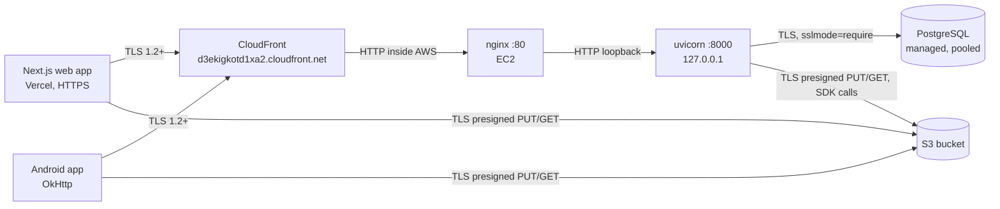

# Security: data in transit and at rest

How field data — artisan PII, GPS points, photographs, interview recordings and their transcripts —
is protected between the capture device and storage, what protects it once stored, and the risks
that are still open. Everything marked **ACTION** needs a human in a console; the code side is
already in the repository.

Audience: whoever operates the deployment (the AWS, database-provider and Vercel consoles) and
whoever reviews changes to `backend/app/core/*` and the Android network configuration.

---

## 1. Transport


```mermaid
flowchart LR
  web[Next.js web app<br/>Vercel, HTTPS]
  app[Android app<br/>OkHttp]
  cf[CloudFront<br/>d3ekigkotd1xa2.cloudfront.net]
  nginx[nginx :80<br/>EC2]
  api[uvicorn :8000<br/>127.0.0.1]
  s3[(S3 bucket)]
  pg[(PostgreSQL<br/>managed, pooled)]

  web -->|TLS 1.2+| cf
  app -->|TLS 1.2+| cf
  cf -->|HTTP inside AWS| nginx
  nginx -->|HTTP loopback| api
  web -->|TLS presigned PUT/GET| s3
  app -->|TLS presigned PUT/GET| s3
  api -->|TLS, sslmode=require| pg
  api -->|TLS presigned PUT/GET, SDK calls| s3
```

| Hop | Protection | Where it is enforced |
|---|---|---|
| Browser / phone → API | TLS 1.2+ terminated at CloudFront | `android/app/build.gradle.kts` default `apiBaseUrl`, Vercel `NEXT_PUBLIC_API_URL` |
| CloudFront → nginx (EC2 origin) | **Plaintext HTTP inside AWS** — see risk P1 | CloudFront origin protocol policy |
| nginx → uvicorn | Plaintext on loopback (never leaves the box) | `ExecStart … --host 127.0.0.1` |
| Client → S3 (media bytes) | TLS; presigned URLs are always `https://` | `backend/app/services/s3.py` builds `https://s3.dualstack.<region>.amazonaws.com` |
| API → Postgres | TLS, **no plaintext fallback** | `sslmode=require` injected in `backend/app/core/config.py` |
| API → AI providers | TLS (vendor SDKs/HTTP clients) | `backend/app/services/ai.py` |

### 1.1 Database TLS

Every managed PostgreSQL worth using speaks TLS — but that is not the point, and assuming it is
was the bug. libpq and Prisma's PostgreSQL connector default to `sslmode=prefer`, which attempts
TLS and then **silently falls back to plaintext** if the handshake fails. A downgrade — a broken
proxy, a hostile network — would then ship the database password and every row in the clear, with
nothing in the logs to show for it.

`Settings._harden_database_url` therefore appends `sslmode=require` to `DATABASE_URL` as soon as
settings load, so both `build_runtime_database_url` in `core/db.py` and any script inherit it. (That
function used to rewrite a vendor's pooler host; the rewrite was removed on 2026-08-22 and the
hardening was never conditional on it.) The rule:

- **Remote host** (any managed PostgreSQL endpoint — anything not loopback/private) →
  `sslmode=require`.
- **Local host** (`localhost`, `127.0.0.1`, a private/RFC1918 address, a docker-compose service
  name) → left alone, because the docker-compose Postgres ships no certificate and `require` would
  break local development and the test suite.
- **Already configured** (`sslmode`/`sslaccept`/`sslcert`… already in the URL) → left alone; an
  explicit operator choice always wins.
- `DATABASE_REQUIRE_SSL=true|false` forces either answer.

`prisma migrate deploy` is unaffected: it reads `DATABASE_URL` straight from the environment, not
from this Settings object. Add `?sslmode=require` to the deployed `.env` value if you want
migrations covered too. It is harmless on any PostgreSQL endpoint that terminates TLS, which is
every managed one; the only host it would break is a local server with no certificate, and those are
not what `DATABASE_URL` points at in a deployment.

### 1.2 Security response headers

`SecurityHeadersMiddleware` in `backend/app/main.py` is registered last, which makes it the
**outermost user middleware**, so it stamps route responses, CORS preflights and the responses
produced by exception handlers (including the JSON 4xx/5xx bodies FastAPI raises). It is pure ASGI
(no `BaseHTTPMiddleware`), so it adds nothing to streaming responses or request cancellation, and it
never overwrites a header a route already set.

**One response is not covered.** Starlette's `ServerErrorMiddleware` — the last-resort handler for an
exception that escapes every user middleware — sits *outside* the whole user middleware stack, so its
bare `Internal Server Error` 500 goes out unstamped. That response carries no data and no
`Access-Control-Allow-Origin` either, so it is not a disclosure path; it is simply the one gap in
"every response". Do not read the table below as covering it.

| Header | Value | Why |
|---|---|---|
| `Strict-Transport-Security` | `max-age=63072000; includeSubDomains` | Browser refuses plaintext to this host for 2 years. **Only sent when the request arrived over TLS** (`scheme == https`, `X-Forwarded-Proto`, `CloudFront-Forwarded-Proto`, `X-Forwarded-Ssl`), so a local `http://` dev server never poisons a developer's browser. |
| `X-Content-Type-Options` | `nosniff` | Stops a JSON error body being sniffed into HTML/JS and executed. |
| `X-Frame-Options` | `DENY` | Clickjacking defence for browsers predating CSP `frame-ancestors`. |
| `Content-Security-Policy` | `default-src 'none'; frame-ancestors 'none'; base-uri 'none'; form-action 'none'` | A JSON API loads nothing and may not be framed. |
| `Referrer-Policy` | `strict-origin-when-cross-origin` | Keeps record ids and query strings out of the `Referer` sent to S3/MapTiler/Google. |
| `Permissions-Policy` | camera/mic/geolocation/… all `()` | Denies every powerful browser feature on this origin. |
| `X-Permitted-Cross-Domain-Policies` | `none` | No Flash-era cross-domain policy file is honoured. |

`/docs`, `/docs/oauth2-redirect` and `/redoc` are real HTML pages that load Swagger-UI / ReDoc from
jsdelivr, so they receive a narrower-but-workable CSP instead of the API one. Everything else gets
the strict policy. Whether those pages are served *at all* is now a setting — see §1.4.

### 1.4 The interactive docs and the OpenAPI schema

FastAPI serves `/docs`, `/redoc` and `/openapi.json` to anyone by default, and **on this deployment
they are currently reachable unauthenticated.** Verified 2026-07-27:

```
/docs          200
/redoc         200
/openapi.json  200   ~190 KB
```

The schema names every route, every query parameter and every field of every model, including the
ones behind admin-only roles. That is a map of the API handed to whoever asks, and it is worth
nothing to the researchers this app is for, none of whom read an OpenAPI schema.

`BACKEND_EXPOSE_DOCS` now controls all three, and it defaults to **`False`**. The default is closed
rather than open because the production `.env` lives in a GitHub secret this repository cannot read,
so a default-on flag would leave the docs exposed exactly where it matters. **The fix is in the tree
and not yet deployed**; the next backend deploy closes them. Local development opts back in with
`BACKEND_EXPOSE_DOCS=true`, which `.env.example` ships commented in.

**HSTS in production.** The viewer's TLS terminates at CloudFront, and nginx overwrites
`X-Forwarded-Proto` with its own (plaintext) scheme, so the app usually cannot tell that the viewer
used HTTPS. Set `SECURITY_FORCE_HSTS=true` in the EC2 `.env` to emit HSTS unconditionally.
`SECURITY_HSTS_ENABLED=false` disables the header entirely; `SECURITY_HSTS_MAX_AGE` tunes the age.

`preload` is deliberately **not** in the header. The API is served from a shared
`*.cloudfront.net` domain; submitting a shared domain to the HSTS preload list is not ours to do.
Once the API moves to a dedicated domain, adding `preload` becomes reasonable.

### 1.3 CORS

`BACKEND_CORS_ORIGINS` is an explicit allow-list, parsed defensively (comma **or** newline
separated, tolerant of pasted quotes/brackets, trailing slashes stripped because an `Origin` is only
ever `scheme://host[:port]`, duplicates dropped).

If the list contains `*`, `Settings.cors_allow_credentials` turns **false** and `create_app()` logs
an error. Reason: browsers reject a literal `Access-Control-Allow-Origin: *` alongside
`Allow-Credentials: true`, and Starlette works around that rejection by echoing the *caller's*
origin when the request carries cookies — turning a lazily-configured `*` into "any website may
call this API as the signed-in user". Keep `BACKEND_CORS_ORIGINS` set to the exact Vercel origin.

### 1.4 Android

`android/app/src/main/res/xml/network_security_config.xml`:

- `base-config cleartextTrafficPermitted="false"` — TLS required for every host not named below.
- Cleartext is permitted **only** for `10.0.2.2` (emulator → host machine), `127.0.0.1` and
  `localhost`. The EC2 origin behind the compiled-in CloudFront default
  (`ec2-15-207-145-174….compute.amazonaws.com`, `15.207.145.174` — the **field repository's** box,
  per the register in [CI.md](CI.md) §0, and part of the unresolved distribution question in
  [ENVIRONMENT.md](ENVIRONMENT.md) §4) was **removed**: it is a production host reachable only over
  plaintext HTTP, and keeping it listed meant one line in `local.properties` could ship bearer
  tokens and field data in the clear.
- Trust anchors are `system` only, so a user-installed CA (corporate MITM root, mitmproxy) cannot
  silently decrypt app traffic. `debug-overrides` re-adds `user` for debuggable builds only, so
  proxy debugging still works during development.
- `AndroidManifest.xml` sets `android:usesCleartextTraffic="false"`. The XML config takes precedence
  on every supported API level (minSdk 26); the manifest flag states the same intent for platform
  APIs that read it directly.

Developing against a LAN backend from a real phone: add your machine's private IP as an extra
`<domain>` **temporarily** and do not commit it. Use a debug build and grant "Nearby devices" when it
asks: on Android 17 the app's traffic to the local network is blocked until `ACCESS_LOCAL_NETWORK` is
granted, and only `android/app/src/debug/AndroidManifest.xml` declares it (since 2026-10-09).

---

## 2. At rest

### 2.1 S3 (media: photos, video, audio, documents, transcodes, APK releases)

| Path | Encryption | Mechanism |
|---|---|---|
| Multipart upload (large files) | Explicit SSE-S3 (AES-256) | `create_multipart_upload(..., ServerSideEncryption=…)` — `AWS_S3_SSE_ALGORITHM`, default `AES256` |
| Single presigned PUT (most web uploads) | **Bucket default encryption** | Applied server-side by S3 regardless of what the client sends |

**Why the single-PUT path cannot set the header in code.** Adding `ServerSideEncryption` to the
presign parameters puts `x-amz-server-side-encryption` into the SigV4 *signed headers*, which makes
it mandatory for the client: any PUT without that exact header fails with `SignatureDoesNotMatch`.
Both clients send only the headers `/media/presign` returns (`Content-Type`), and Android builds
already installed in the field can never be retrofitted — so signing it would break every upload,
including from phones that will never be updated. Bucket default encryption achieves the same
result with no client cooperation, which is why it is the load-bearing control here.

**ACTION — enable bucket default encryption** (S3 console → your bucket → Properties → Default
encryption → Edit): *Server-side encryption with Amazon S3 managed keys (SSE-S3)*, Bucket Key
enabled. Buckets created after January 2023 have this on by default — **verify** rather than assume,
and note it only applies to objects written *after* it is switched on. Re-encrypt anything older
with an in-place copy:

```bash
aws s3 cp s3://YOUR_BUCKET/media/ s3://YOUR_BUCKET/media/ \
  --recursive --sse AES256 --metadata-directive REPLACE
```

**ACTION — deny plaintext access to the bucket.** Add this statement to the bucket policy (S3
console → Permissions → Bucket policy). It rejects any request that did not arrive over TLS, which
covers the public media reads as well as the presigned PUTs:

```json
{
  "Sid": "DenyInsecureTransport",
  "Effect": "Deny",
  "Principal": "*",
  "Action": "s3:*",
  "Resource": [
    "arn:aws:s3:::YOUR_BUCKET",
    "arn:aws:s3:::YOUR_BUCKET/*"
  ],
  "Condition": { "Bool": { "aws:SecureTransport": "false" } }
}
```

Keep the existing `PublicReadMedia` allow statement (see `backend/DEPLOY_AWS.md` §4) — an explicit
`Deny` always wins over an `Allow`, so ordering does not matter.

**Do NOT add** the "deny unencrypted object uploads" statement
(`s3:x-amz-server-side-encryption` `Null: true`) that hardening guides usually pair with this. It
would reject exactly the presigned single PUTs described above and break all small-file uploads.
Default encryption already covers them.

**Media objects under `media/*` are world-readable.** The bucket policy grants `s3:GetObject` to
`Principal: "*"`, so anyone who learns an object URL can fetch the file without any token — the
object key (`media/<user-id>/<uuid>/<filename>`) is the only secret. Encryption at rest does not
change this; SSE-S3 protects the physical disks, not URL holders. See risk P0.

**Objects under `backups/` are NOT world-readable, and that is a property of how narrow the policy
is.** `aws_s3_bucket_policy.media_public_read` grants anonymous `GetObject` on `media/*` and on
nothing else, so the nightly database dumps ([CI.md](CI.md) §1.5) and the Terraform state under
`tfstate/` sit in the same bucket and answer nobody. **Widening that policy to `/*` would publish a
full database dump and a state file containing a live IAM secret access key.** It is the single most
consequential edit available in `infra/terraform/main.tf`, and the file says so at the resource.

#### The type an object is stored with is now validated (2026-09-03)

`POST /media/presign` puts the caller's `mimeType` into the object's **signed `Content-Type`**, which
is the type the storage host later *serves* it with. Until 2026-09-03 it accepted any string of up to
180 characters and signed it verbatim, so a `text/html` upload became a stored, world-readable
document that a browser **executes** when opened — a phishing page or a credential-harvesting form
living at a URL on the organisation's own storage host, reachable through `GET
/data/media/{id}/download`'s 307 and through the media lightbox's "Open" control.

Both `POST /media/presign` and `POST /media/multipart/create` now check the declared type against an
allow-list before signing anything. The shape is **broad prefix families with a deny-list in front of
them**, because an allow-list narrower than what the fleet actually uploads is not a control but an
outage: Android's `saveOrQueue` does not queue a 4xx, so a refused presign *loses* the recording. The
deny-list carries `text/html` and its XHTML/JavaScript spellings, which is the whole of what made the
stored object a document.

Two types are accepted deliberately, and the reasons are worth keeping because both look like
oversights:

* **`application/octet-stream`** — the audit asked for it to be refused. It is not, because both
  shipped clients emit it as their fallback for a file the platform will not type
  (`frontend/lib/media.ts`, and Android's `contentResolver.getType(uri) ?: …`), so refusing it would
  422 a declared registry field from every device. It is also the **inert** type: a browser downloads
  it and never renders it, which is not the case this control was about.
* **`image/svg+xml`** — the one genuinely scriptable type on the list, and the registry asks for it
  by name (`sketch.lineArtFile`). The argument for keeping it is that the storage host is a
  **different origin** from the app, so what executes can read neither this app's storage nor its
  cookies. **The mitigation is now the only remaining control for SVG** and it lives on the
  distribution, not in this code: a `Content-Disposition: attachment` or
  `Content-Security-Policy: sandbox` response header on the bucket/CDN, as named in
  `frontend/components/forms/MediaCaptureField.tsx`. That rule is not yet in place.

### 2.2 The database

Nothing in this section depends on which provider hosts it, with one exception, which is called out
first because it is the one that changed under this document's feet.

- **Encryption at rest is the provider's, and this repository cannot verify it.** Until 2026-08-22
  this section asserted AES-256 volume and backup encryption as a fact about one vendor's platform;
  production then moved twice (see "The database" in [ENVIRONMENT.md](ENVIRONMENT.md)), and a claim
  about one vendor is not transferable to another. **ANSWERED 2026-09-02, against the provider
  hosting production today:** its published security page states "All customer data is encrypted at
  rest with AES-256 and in transit via TLS." Backup encryption is **not separately asserted** on
  that page — and note that automated daily backups themselves are a paid-plan feature there, so
  the project's plan, not this repository, decides whether provider-side backups exist at all. No
  application configuration is required or possible either way. Re-confirm on the next provider
  move, with a date, as before.
- Passwords are stored as bcrypt hashes — `$2b$`, cost 12 — written by `bcrypt` itself since 2026-10-09
  (`backend/app/core/security.py`; until then through passlib, which is unmaintained and could not run on
  bcrypt 5). The new code truncates to bcrypt's 72 bytes explicitly and keeps passlib's two refusals (a
  NUL character, more than 4096 bytes of UTF-8 — passlib measured the encoded secret, not its
  characters), so every stored hash verifies exactly as before —
  `backend/tests/test_password_hash_compat.py` checks hashes passlib wrote. An account
  CREATED by Google sign-in has no password hash at all; an account that has a password keeps it when
  its owner later signs in with Google (§3.3).
- **Nothing is encrypted at the column level.** Artisan names, phone numbers, addresses, GPS
  coordinates, interview transcripts and researcher notes are plaintext columns. Anyone with the
  database URL, a login to the provider's dashboard, or a `DATABASE_URL` leak reads all of it. Treat
  the database credentials as the crown jewels.
- Row Level Security is **not** in use: the API connects as the owning role and enforces every
  access rule in application code (`backend/app/core/deps.py`). A SQL-injection bug or a leaked
  connection string bypasses the entire RBAC ladder in one step. Prisma's parameterised queries are
  what stand between the two; keep raw SQL (`db.query_raw`) free of string interpolation.

### 2.3 What is *not* encrypted, anywhere

| Data | Where it sits | State |
|---|---|---|
| Media object keys / public URLs | `MediaFile.url` in Postgres, and in every client | Plaintext, and the URL alone grants read access |
| Auth token (web) | `localStorage["field_repo_token"]` | Plaintext, readable by any script on the origin |
| Auth token (Android) | `SharedPreferences("field_repository_auth")`, `MODE_PRIVATE` | Plaintext file in app-private storage; readable on a rooted device, and `android:allowBackup="true"` means it can leave the device in a backup |
| `.env` on EC2 | `/home/ubuntu/app/current/backend/.env`, `EnvironmentFile=` | Plaintext on the EBS root volume — unencrypted on the box running on 2026-10-09, encrypted at rest on the Ubuntu 26.04 rebuild `infra/terraform/main.tf` declares that day (§5 P3); holds `DATABASE_URL`, `JWT_SECRET`, AWS keys, every AI provider key. `current` is a symlink to the live release ([CI.md](CI.md) §1.2), and **each release directory keeps the `.env` it was deployed with** — three retained releases, plus any directory a failed deploy attempt left behind since 2026-09-17, so the number of plaintext copies is `ls /home/ubuntu/app/releases \| wc -l` and not a constant |
| Temporary media during processing | `tempfile` on the EC2 disk (ffmpeg/transcription) | Plaintext; removed after the job |
| CSV / dataset exports | Streamed to the downloader | Plaintext; once downloaded the data is outside every control in this document |

---

## 3. Authentication and sessions

### 3.1 Tokens

| Property | Value | Enforced in |
|---|---|---|
| Algorithm | HS256 (HMAC), **pinned on decode** | `decode_access_token(..., algorithms=[settings.jwt_algorithm])` |
| Allowed algorithms | HS256 / HS384 / HS512 only | `Settings._normalise_jwt_algorithm` — `JWT_ALGORITHM=none` refuses to start |
| Expiry | `JWT_EXPIRES_MINUTES`, default 10080 (7 days) | `create_access_token`; `verify_exp` + `require: ["exp", …]` on decode |
| Subject | `sub` = user id, required, a string | `require: [… "sub"]` on decode (PyJWT also refuses a non-string `sub`), re-checked in `deps.get_current_user` |
| Library | PyJWT since 2026-10-09 (python-jose before: its last release depends on `ecdsa`, CVE-2024-23342). Tokens are byte-identical to jose's; jose-minted tokens stay valid | `backend/tests/test_jwt_compat.py` holds tokens jose minted and the byte comparison |
| Password binding | `cred` = 16 hex characters of a SHA-256 of the account's `passwordHash` as it stood when the token was minted, on every token minted since 2026-10-09 (§3.6) | `create_access_token(credential=…)`, which reserves the claim; compared with the row in `deps._user_from_bearer` |
| Secret | ≥ 32 characters, never the example placeholder | `verify_jwt_configuration()` at `create_app()` |

Pinning the algorithm closes **algorithm confusion**: without it, a token whose header says
`alg: none` is unsigned-but-accepted, and one that says `alg: RS256` is verified with our shared
secret treated as a public key. Requiring `exp` closes the "token with no expiry claim lives
forever" variant.

**The API refuses to start** if `JWT_SECRET` is the `.env.example` placeholder, is empty, or is
shorter than 32 characters — a guessable HMAC secret lets anyone mint a master-admin token, so it
must fail visibly on deploy rather than silently in production. `ALLOW_WEAK_JWT_SECRET=true`
downgrades the refusal to a `CRITICAL` log line for local development only.

Generate a real one with:

```bash
python -c "import secrets; print(secrets.token_urlsafe(48))"
```

### 3.2 Known weaknesses (accepted, with mitigations listed in §5)

- **Token storage is `localStorage` on the web.** Any successful XSS on the frontend origin reads
  the token and impersonates the user for up to 7 days. `HttpOnly; Secure; SameSite` cookies would
  make the token unreadable to script, at the cost of a CSRF defence and a change to both clients.
  The strict CSP on API responses does not help here — the risk lives on the *frontend* origin.
- **No refresh tokens, and revocation is narrow rather than absent.** *Rewritten 2026-09-03; this
  bullet used to read "no refresh tokens and no revocation", and that had been half wrong for a
  while and wholly wrong since that date.* A token is valid until `exp` unless one of three things
  has happened — the third since 2026-10-09.

  First, `get_current_user` re-loads the user row on **every** request, so a *deleted* user is
  rejected immediately and a *demoted* user loses privileges immediately — the role in the token is
  never trusted for authorisation (§4.1).

  Second, `User.sessionsValidFrom` is a **per-account revocation watermark**: `deps._user_from_bearer`
  refuses any token whose `iat` predates it. Nothing new is read on the hot path to do it — the `User`
  row is loaded to authenticate the request regardless. Its writers:

  - **redeeming a password link** (`routes/auth.set_password`, the original writer);
  - **barring the address on the platform allow-list**, since 2026-09-03 — `DELETE
    /api/access/roster/{id}` and the REJECT arm of `POST /api/access/roster/{id}/decision`;
  - **ending an empanelment on the designer roster**, since the same date — `PATCH` and `DELETE
    /api/designers/roster/{id}`, which stamp only when the empanelment was actually carrying
    admissions;
  - **a provisioner setting somebody else's password, or raising their `mustChangePassword`**, at
    `PATCH /api/users/{id}`, since 2026-10-09 — so every session the account holds is refused from its
    next request, rather than lasting until a phone that re-reads `/me` only at launch is restarted.
    When each device NOTICES is the client's part: a browser tab drops its token at that request, the
    Android source since 2026-10-09 signs out there too, and builds up to 0.0.15 notice only at their
    next launch, keeping their queued work either way (§3.6);
  - **`scripts/seed_admin.py` resetting an existing master admin's password**, since the same date.

  **The writers that set or flag a password take their timestamp after the password is hashed and
  every awaited check has run, immediately before the write** (2026-10-09) — `PATCH /api/users/{id}`,
  the link's redemption and `scripts/seed_admin.py`. It used to be taken first, so a sign-in with the
  OLD password that read the row before the commit and minted its token in a later wall second —
  bcrypt alone takes a noticeable fraction of one — post-dated the watermark and kept a week of
  access. For a password write the binding in §3.6 now refuses that token on its first use as well;
  for a flag raised on its own, the stamp's position is the whole of the defence.

  Before 2026-09-03, suspending an account stopped the next sign-in and left the session the person
  was already in running for the rest of the token's lifetime: an administrator suspended a departing
  colleague at 10am, watched the row go SUSPENDED, and that colleague's phone went on creating records
  for up to seven days. Changing your OWN password at `POST /api/auth/change-password` writes no
  watermark — and since 2026-10-09 it ends every OTHER session of the account anyway, through the
  third mechanism, while the answer hands the session that made the change a fresh token in its
  `X-Session-Token` header (§3.6).

  **What is still NOT revoked, named so nobody infers otherwise.** Rows barred *before* 2026-09-03
  were never stamped and nothing backfills them on its own. And when the Gmail-alias sweep that finds
  every spelling of one mailbox is cut by its own limit
  (`access_roster.GMAIL_ACCOUNT_SWEEP_LIMIT`), the barring door logs at ERROR and returns without
  stamping — it cannot stamp accounts it could not read. That is the unsafe direction and it is
  deliberately loud rather than silent. (The narrower gap this bullet carried earlier in the day —
  that an account filed under `a.b@gmail.com` was missed when its roster row was filed under
  `ab@gmail.com` — was closed the same day: the lookup is now
  `access_roster.accounts_on_the_mailbox`, which canonicalises both sides and stamps every spelling.)

  Third, since 2026-10-09, **every token is bound to the password it was opened with**: a token whose
  `cred` claim no longer matches the account's current password is refused with the watermark's own
  sentence, so any password change ends every session opened before it, whoever made the change and
  by whichever door. §3.6 has the whole of it, including the tokens minted before that date, which
  carry no claim and are not ended this way.

  A **role change** deliberately signs nobody out: losing a tier is not losing access, and the
  identity-cache invalidation is what makes a demotion take effect on the next request.

  Rotating `JWT_SECRET` still invalidates every token at once and remains the break-glass response
  to a suspected theft.
- **7-day lifetime** is long for a token that can only be revoked by the writers named above or by a
  change of the password it was opened with (§3.6). It is a deliberate trade for field work with
  intermittent connectivity.
- **A password one person typed for another is a shared secret.** Provisioners (§3.4) create accounts
  with a password and set temporary ones, so for a while somebody besides the owner knows it. That is
  why such a password is temporary by default, why, since 2026-10-09, the server holds the account
  to replacing it (§3.4) rather than trusting both clients to, and why every session opened with it —
  the provisioner's, or anybody's who read the message it travelled in — ends when it is replaced
  (§3.6).
- **Android backup.** `android:allowBackup="true"` lets the auth token and preferences travel
  through Google's backup. Excluding them needs a `dataExtractionRules` / `fullBackupContent`
  resource, or moving the token to `EncryptedSharedPreferences`.

### 3.3 Google sign-in

Google ID tokens are verified server-side against Google's keys with the audience restricted to
the configured client ids (`GOOGLE_CLIENT_ID`, `GOOGLE_ANDROID_CLIENT_ID`), and the address must be
one Google has verified. A token that fails is logged by the audience it failed for and the class of
google-auth's exception — never the exception's message, which quotes a malformed token back whole
(`verify_google_token`, 2026-10-09). **Admission is decided before anything is written**: an address
the platform allow-list does not admit becomes a PENDING request and a 403, and no account is created
([PERMISSIONS.md](PERMISSIONS.md) §1). An admitted address with no account becomes one at the tier
its allow-list row names, or at `DEFAULT_SIGNUP_ROLE` when the row names none — the **lowest** tier
(`CROWDSOURCE_VOLUNTEER`) by default, so an unknown Google account cannot read or write as a
researcher until an admin elevates it.

**WHICH ACCOUNT A GOOGLE IDENTITY SIGNS IN TO — owner's decision, 2026-10-09.** The literal address
Google sent, first. On a miss, the one account WITH A PASSWORD (`authProvider` `LOCAL`) whose address
is the same Gmail mailbox under another spelling — dots, a `+tag`, `googlemail.com`, letter case,
canonicalised by `designers.canonical_email`. The sign-in reads it through
`access_roster.accounts_on_the_mailbox_for_sign_in`, which has Postgres return only the candidate
rows and then applies the same canonicalisation, so the answer is `accounts_on_the_mailbox`'s without
reading every Gmail account on every such sign-in (the parity is pinned in
`backend/tests/test_account_provisioning.py`). That is what stops a provisioner's
`sandy.craft3@gmail.com` and its owner's Google `sandycraft3@gmail.com` becoming two accounts for one
person, with their workshops split across both.

- **Never for the configured master admin** (2026-10-09). The master's sign-in writes `MASTER_ADMIN`
  onto whatever account it lands on, so the fold would have promoted an account a provisioner made
  under another spelling of the master's mailbox — the provisioner's password still on it — to the one
  tier nobody can manage; all it needed was an account planted before the master's first Google
  sign-in on a deployment where the master's own row did not exist yet (a handover, an unseeded box).
  The address at `MASTER_ADMIN_EMAIL` signs in to its literal row or to a new account there, and the
  elevation is written only onto an account found under that literal address.
- **And only onto one that is already a master admin or holds no password** (later the same day,
  `_refuse_to_promote_a_password_account` in `backend/app/api/routes/auth.py`). An account with no
  password at that address could only have been made by a Google sign-in on that mailbox. Any other
  holds a password that whoever chose it still knows — the provisioner who made it, an officer who
  redeemed a sanction order's first link before the register refused the mailbox, or the account's
  own holder when `MASTER_ADMIN_EMAIL` is pointed at an existing account — and promoting it handed that
  person a `MASTER_ADMIN` session no API door can take back. So the sign-in answers **409**
  (`MASTER_ADDRESS_HOLDS_A_PASSWORD_ACCOUNT_DETAIL`, which names `scripts/seed_admin.py`), writes
  nothing to the account, not even the avatar, and logs its id and role at ERROR. The operator runs
  the script, which gives that account a new temporary password and the master's role and ends every
  session the old password opened; the next Google sign-in then finds a master admin. A handover onto
  an existing password account therefore takes the script first ([DOCKER.md](DOCKER.md)). This is the
  defence beneath the doors: the users screen refuses any spelling of the mailbox to all but a master
  admin, and the sanction register refuses it to everybody (§3.4). It cleans nothing up: an account
  planted before that day can no longer be promoted this way, and repairing it is still the script.
- **Several such accounts is a 409**, telling the person to sign in with their email address and
  password and to ask an administrator to merge or correct the duplicates. Choosing between two
  accounts for one person is an administrator's call, not a sort order's.
- **A Gmail sweep cut by its own limit** is logged at ERROR and the old behaviour applies — a new
  Google account may be created beside the existing one. A visible duplicate an administrator can fix
  was preferred to locking every new Google user out of a large deployment.
- **Why the fold is safe**: Google has verified that the caller controls the mailbox, and every
  spelling the fold joins is, by Google's own published rule, delivered to that one mailbox. It is
  applied to nothing else, and only to `LOCAL` accounts.

**A PASSWORD ACCOUNT STAYS A PASSWORD ACCOUNT.** Signing in with Google is a second way into the same
account, not a conversion: the password hash stays, `authProvider` stays `LOCAL`, the name a
provisioner typed stays, and `mustChangePassword` stays — only the avatar is refreshed. So **Google
sign-in does not get round the forced change** (§3.4): an account still holding a temporary password
is held until its owner replaces it at change-password, which asks for that temporary password,
until a provisioner issues it a password link, or until a provisioner withdraws the required change.
An account Google created, with no password, behaves exactly as it always did. **A Google session
lasts as long as the account's password does not change** (§3.6): it carries the fingerprint of
whatever password the account held when it signed in, so a password set by any door afterwards ends
it, and a name or avatar correction does not.

### 3.3A Microsoft and Yahoo sign-in (2026-10-10)

Both are OpenID Connect, driven as an **authorization code with PKCE (S256) and a nonce**, and
**redeemed by the backend** with the client secret (`backend/app/services/oidc_sign_in.py`). Yahoo's
token endpoint accepts only a client secret and answers no cross-origin request, so no phone and no
browser could redeem a Yahoo code without holding a secret it must not hold; Microsoft is driven the
same way so there is one path. Each provider is live only when its client ID and secret are both set
(`MICROSOFT_CLIENT_ID`/`_SECRET`, `YAHOO_CLIENT_ID`/`_SECRET`); the clients draw a button only when
their own build carries the client ID — never a disabled one.

- **One redirect URI**, the web app's `/login/callback` (a route handler). A web `state` goes back to
  `/login` with the answer in the URL **fragment**, so the code reaches no server log and no
  `Referer`; the page removes it from the address bar before using it. A `state` starting `app.` is
  handed to the Android app on `com.designprototype.workshop.signin://oidc/callback`, where AppAuth
  refuses any `state` it did not send. A code intercepted on that hop is useless without the PKCE
  verifier, which never leaves the app (or the browser tab) that started the flow.
- **The ID token is verified even though it arrived on the TLS back channel**: signature against the
  provider's JWKS (RS256 or ES256 only — `none` and HMAC are refused before a key is looked up), issuer
  (Yahoo's fixed one; Microsoft's per-tenant one, bound to the token's `tid` and to `MICROSOFT_TENANT`),
  audience (with several, `azp` must be ours), `exp`/`nbf`/`iat` with a minute of leeway, and the
  **nonce**: the provider is sent `base64url(sha256(raw))` and the backend is sent the raw value, so a
  token is accepted only from whoever started the flow that minted it. Keys are cached for an hour and
  refetched for an unknown `kid` at most once a minute.
- **The address must be verified by the provider.** Yahoo: `email_verified` true. Microsoft: a
  personal account (tenant `9188040d-…`) carries an address Microsoft verified; a work or school
  account's `email` is whatever its tenant says, so it counts only with the optional claim
  `xms_edov` true — the owner must add `email` and `xms_edov` to the registration's ID token
  (Token configuration). This is what closes the "nOAuth" takeover, where a tenant administrator sets
  somebody else's address on an account they control. An unverified address is a 401 before admission
  is consulted, so nothing is written.
- **Admission and linking are Google's** (§3.3, through the one function both paths end in,
  `auth._sign_in_verified_mailbox`): the allow-list decides before any write, the same tiers, the
  same master-admin rules, a password account stays a password account. **One difference: no Gmail
  spelling is folded to find an account.** That fold rests on Google running Gmail and publishing its
  spelling rule; Microsoft and Yahoo promise nothing about other spellings of the address they
  verified, so their sign-in finds an account at the literal address or creates one. (The allow-list
  itself still reads a Gmail mailbox's spellings, as it does for a password sign-in.) A new account is
  recorded with `authProvider` `MICROSOFT` or `YAHOO`; a second provider on an existing account
  changes neither the provider nor the avatar.
- **Logged**: the provider and a reason tag (`nonce-mismatch`, `wrong-audience`,
  `redemption-refused` with the provider's fixed error code, …). Never a code, verifier, nonce,
  token, secret or response body. The person reads one sentence per provider — "did not complete",
  "was cancelled", or "has not confirmed the email address".

### 3.4 Provisioned passwords, and the forced change

**WHO TYPES A PASSWORD FOR WHOM.** Password accounts are created by the account provisioners —
`MINISTRY_ADMIN`, `ADMIN` and `MASTER_ADMIN`, `deps.ACCOUNT_PROVISIONER_ROLES`
([PERMISSIONS.md](PERMISSIONS.md) §1.2) — **at or below their own tier**: the ceiling is inclusive
(`account_provisioning.assert_role`), so a ministry admin can create another ministry admin and an
admin another admin, only a master admin creates a `MASTER_ADMIN`, and the account at the
`MASTER_ADMIN_EMAIL` address is always created one. **Every act on an account that already exists** —
a temporary password, the flag, a link, a name or an address correction — is for accounts **strictly
below** the provisioner (`assert_can_manage_target`), master admins being peers who cannot manage each
other. So a provisioner who creates a peer cannot manage it afterwards: its passwords are its owner's
and a higher tier's to look after. (Corrected 2026-10-09: this paragraph first said both acts were
for accounts strictly below, which understated who can multiply provisioning accounts.) **Never on
their own account**: a password, the flag or a link for oneself is a 403 pointing at
`POST /api/auth/change-password`, which asks for the current password and spends the per-account
guessing budget. A door that skipped both would turn a stolen session into a permanent takeover —
which is the one thing change-password exists to prevent.

**`mustChangePassword` IS REFUSED BY THE SERVER, NOT ONLY REPORTED (2026-10-09).** The flag means the
password the account holds was chosen by somebody else; a provisioner raises it by default when it
creates an account or sets a password, and can raise it alone to ask for a new one at the next
sign-in. A provisioner can also LOWER it alone, on an account it manages — `PATCH /api/users/{id}`
with `{mustChangePassword: false}` — which says the password the account holds is final, the same
power as setting one with the flag down, and so ends no session (owner's ruling, 2026-10-09). The
sanction register's machine-minted account is created with the flag down since the same date: its
random password was never shown to anybody, so it is no shared secret, and the INVITE link the register
issues is how the designer chooses theirs. Raising the flag there held a designer who signed in with
Google first behind a gate asking for a current password nobody had. Until 2026-10-09 the flag rode
out on `/me` and both clients drew the change-password screen, while a script holding the temporary
password and a bearer token could use the whole API for the token's seven days. Now
`deps.refuse_while_password_change_pending` answers every authenticated route outside
`deps.PASSWORD_CHANGE_ALLOWED_ROUTES` with **401**, the header `X-Password-Change-Required: 1` and the
detail `Choose a new password to continue.` The allow-list is what the change-password screen needs and
nothing else: `GET /api/me`, `GET /api/auth/me`, `POST /api/auth/change-password`,
`POST /api/auth/logout`, `GET` and `POST /api/usage/consent`, and `GET /api/app/release/latest`,
matched on the exact method and path.

- **The sign-in itself still succeeds** and answers `mustChangePassword: true`: the route somebody
  holding a temporary password uses to replace it, change-password, needs a bearer token, so refusing
  the sign-in would leave the account unable to comply without a link. The belt is on the protected
  routes instead.
- **401 and never 403**, because both clients keep queued offline work on a 401 and treat a 403 as a
  permanent refusal. The header tells a client to keep the token and draw the gate rather than sign
  out; `app/main.py` lists it in CORS `expose_headers`, or a browser could not read it.
- **Exempt: the account at `MASTER_ADMIN_EMAIL`, and no other** (`deps.is_configured_master_admin`).
  It is the deployment's recovery path, and `scripts/seed_admin.py` leaves it holding a flagged `.env`
  password that operator tooling signs in with. A SECOND master admin is held: a deputy made with a
  password another master admin typed holds exactly the shared secret this gate exists to retire, on
  the most powerful account there is, and holding it locks nobody out because change-password is on
  the allow-list. The platform allow-list, which CAN lock an account out for good, still exempts every
  master admin.
- **An account with no password is never held**: there is nothing for it to replace, and
  `PATCH /api/users/{id}` refuses (422) to raise the flag on one.
- **Where it is checked**: inside `get_current_user`, so behind every `require_*` dependency, and in
  `require_dataset_admin`, the one dependency that reads a bearer token without it. **A thirty-day
  `dataset:read` token is retired before that check is reached, and for good**: raising the flag stamps
  the watermark and a new password changes the fingerprint (§3.6), so a token minted before either is
  refused with a plain 401, no header — and stays refused after the owner has chosen a password. The
  operator mints a new one with the password the account holds now. What the check HOLDS, with the
  header and only until the password is chosen, is a token minted while the flag was already up —
  which the mint has refused since 2026-10-09 (`POST /api/datasets/token` answers a flagged account
  with a 403 and a sentence), so only a token from before that date can be in that state. (This bullet
  said a token minted before the flag went up "is held too" until it was corrected on 2026-10-09; such
  a token was never held, it was ended.) A new dependency that reads a bearer token directly must call
  the same check, or it is a door the flag does not close.
- **The way out is guarded too.** A wrong current password at change-password is a 400 (a 401 would
  read as a dead session on the web) and is still charged to the per-account budget; a new password
  equal to the current one is a 400 and is not charged; a link redeemed while the flag is up refuses
  the temporary password itself, without spending the link. Every password somebody chooses is
  bounded at 200 characters (`security.MAX_PASSWORD_LENGTH`); the sign-in box is unbounded and
  `verify_password` answers an over-long value as a wrong password rather than a 500.
- **The clients.** The web keeps the session on a gated 401, re-reads `/me`, draws **Set a new
  password** and pauses its offline drains until the flag clears. Android draws the same gate screen
  from build 0.0.6, and its handling of the gated 401 itself — keep the session, pause the outbox and
  the design-workshop and join-card sends — is in the Android source as of 2026-10-09 and reaches
  handsets with the next published build. **Builds 0.0.2 to 0.0.5 have no gate screen**, so somebody
  flagged while on one of them must choose the password on the web first. That cost was accepted.
  When the change goes through, every other session of the account ends and the answer hands the
  session that made it a fresh token in its `X-Session-Token` header, the body staying exactly
  `{"ok": true}` (§3.6): the web adopts the token before it re-reads `/me`, the next Android build
  does the same, and a handset on 0.0.6 to 0.0.15, which never reads the header, reports the change
  as made and is refused from its next request; it notices only when the app next starts, and its
  owner then signs in with the new password. When the answer to a change is LOST — no answer, a 5xx, a
  plain 401 — the Android source's gate asks `GET /me` before it says anything, because the change may
  have landed and retired the very session it was sent with (§3.6).

**A PROMOTION DOES NOT CARRY A LOWER PROVISIONER'S CREDENTIAL UPWARD (2026-10-09).** A temporary
password and a set-password link are both credentials the provisioner who made them holds, and raising
the account above that provisioner would hand it an account it could never have managed — a ministry
admin choosing an admin's password, or an admin a master admin's. So a `PATCH /api/users/{id}` that
raises the role withdraws every outstanding link of the account in the same request, and answers 409
while the account still holds a temporary password (the flag up and a password present) unless the
same request sets a new one; and redeeming a link asks again whether its issuer could still manage the
account (`account_provisioning.issuer_still_manages`). A master admin's link always passes, and so does
a link nobody issued or whose issuer's account has since been deleted; anything else reads as
withdrawn. **The access screen's approve and re-admit ask the same two questions** (since later the
same day — until then they asked neither). They lift an existing account to the approved tier
(`routes/access._lift_existing_account`); a lift withdraws the account's outstanding links after its
write, and an account still holding a temporary password is not lifted at all. That door has no
password field to set a new one in, and refusing the approval would leave the person's ACCESS
undecided over a question about their TIER, so the approval of the address stands, the account keeps
its tier, and the decision's answer carries `accountPromotionHeld` — a sentence naming the address,
both tiers and the two ways on, which `/admin/access` shows in place of its receipt (`null` on every
other decision). Both doors ask one predicate, `account_provisioning.holds_a_temporary_password`. Two
doors still lift an account without asking — a Google sign-in on an empanelled address, and the
sanction register — and both lift only to `DESIGNER`, below every provisioner, so neither can carry a
credential past whoever issued it.

**ANY SPELLING OF THE MASTER ADMIN'S MAILBOX IS A MASTER ADMIN'S TO ASSIGN (2026-10-09).**
`account_provisioning.is_master_email` compares Gmail-canonical forms on both sides, so on the users
screen and from the operator's script nobody but a master admin creates an account on, or moves one
onto, any spelling of the `MASTER_ADMIN_EMAIL` mailbox — dots, a `+tag`, `googlemail.com` — and the
answer is a 403. It compared the two strings until then, which is how the Google fold could be handed
a planted account (§3.3). The master's own protections — always `MASTER_ADMIN`, never deleted, changed
only by a master admin — stay on the configured address itself (`is_master_address`, literal), so an
account under another spelling stays an ordinary, deletable account rather than inheriting them.

**AND NO SANCTION ORDER NAMES THAT MAILBOX, FOR ANYBODY (later the same day).** The sanction register
creates the account of each designer an order names, and it was the one account-creating door that did
not ask: with no account at the master's address yet — a handover, an unseeded box — an order naming it
created one at `DESIGNER`, admitted and empanelled it, and handed the recording officer, an Assistant
Director upwards, its 72-hour first-password link; the officer set a password, the master's first
Google sign-in promoted the account, and the officer's password opened a master admin's session. Now
`sanction_orders.designer_standing_verdict` refuses any spelling of the mailbox with a **422**
(`SANCTION_MASTER_MAILBOX`) right after the self-naming check and before any read — for the lead and
every co-designer, and for every row a spreadsheet import reads, which reports it as refused and never
offers it for confirmation — whoever records the order, a master admin included, and whether or not an
account is already there. Re-issuing a first-password link from an older order is refused the same
way for an account on that mailbox (`sanction_orders.reissue_credential_link`). Beneath every door,
the master's Google sign-in promotes only an account that is already a master admin or holds no
password (§3.3).

**AN ADDRESS CORRECTION DOES NOT LEAVE A BAR BEHIND (2026-10-09).** A provisioner who is not an admin
may not move an account onto an address an administrator barred on the allow-list — nor, since this
date, OFF one, nor move a `DESIGNER` off an address whose empanelment an administrator ended: each is
a 409 (`account_provisioning.assert_not_escaping_a_bar`). Only the destination used to be asked, so a
suspended person who planted a PENDING row at a second address with one refused Google sign-in could
be "corrected" onto it and walk back in, the SUSPENDED row stranded on an address no account held. An
admin may still make the move, and the bar goes WITH the account (`access_roster.follow_email_change`):
the destination's allow-list row takes the old status with a note saying why — an ACTIVE row there
included, or one a racing sign-in writes there first — and an ended empanelment is carried to the new
mailbox, so the next sign-in cannot empanel it afresh. **And the old address stays barred** (later the
same day): where the destination has no row, a barred row is CREATED there — the status, who barred
the account and when, its tier and name, and `BAR_CARRIED_BY_EMAIL_MOVE_NOTE` — and the old row is
left where it is. The barred row used to move, leaving the old mailbox with no row at all, so a Google
sign-in there was queued PENDING as a stranger's, with no trace of the suspension, and an administrator
approving that request let the barred person back in under a new account. Letting the person back in
is the access screen's act, or the designer roster's, on either address.

**NOR MAY A NON-ADMIN END AN EMPANELMENT BY MOVING AN ACCOUNT (later the same day).** The carry above
happens whatever the account's role, and carrying an ended empanelment onto an address with an ACTIVE
one ENDS that one — an administrator's empanelment, possibly of somebody else. Ending an empanelment is
an admin's act, so a provisioner who is not an admin moving any account whose old address carries an
ended empanelment onto an address with an active one gets a 409
(`ENDING_AN_EMPANELMENT_BY_MOVING_DETAIL`, `account_provisioning.empanelment_active`). An admin's move
still carries the ending, and the server's audit line says so.

**ONE ACCOUNT PER MAILBOX, FOR EVERY PROVISIONER (later the same day).** On the users screen and from
the operator's script nobody — an admin or the master admin included — creates an account at, or
moves one onto, any spelling of a Gmail mailbox another account already uses: 409 "Email already
exists", the sentence an address taken in another letter case has always had
(`account_provisioning.email_in_use`, reading `access_roster.accounts_on_the_mailbox_for_sign_in`). One inbox with two accounts shared one
admission and one empanelment, since every gate reads the inbox as one key: a move onto it rewrote the
first account's allow-list row, a carried ending ended its empanelment, and the Google sign-in, which
will not guess between two password accounts on one mailbox, refused them both. A check that cannot
read every spelling refuses with a 503 and writes nothing. Outside the Gmail domains the literal
comparison is the whole answer. An account already sharing a mailbox with another is refused even a
respelling within it until the pair is merged or corrected.

**THE OPERATOR'S TWO SCRIPTS WRITE TEMPORARY PASSWORDS.** `scripts/seed_admin.py` stamps
`mustChangePassword` on every password it writes, with no way to opt out, stamps the watermark when it
resets an existing master admin, and leaves every other existing account untouched — re-running it
used to overwrite a live colleague's password and tier. `scripts/provision_account.py` sets the flag
unless `--no-must-change` is given, which is `POST /api/users`' own default and its own opt-out; reads
the password from `PROVISION_PASSWORD` and from nowhere else; never repeats a typed value when it
cannot read its arguments, in case it was a password — only a complaint naming nothing but its own
options (a missing one, say) is printed word for word, and every other becomes one fixed sentence,
which since 2026-10-09 covers an ambiguous `--a=…`, an invalid `--role …` and an `--apply=…` as well
as an unrecognised argument; dry-runs unless `--apply`; and refuses an actor the API would refuse —
barred, not admitted, or itself still holding a password somebody else chose.

### 3.5 Password links

A set-password link is a credential: whoever holds it sets the account's password, with no sign-in and
no role check, because the link is the whole authority.

- **Who issues one: a provisioner, on an account it may manage, never its own** —
  `account_provisioning.assert_may_reset_credentials`, the same target rule `PATCH /api/users/{id}`
  asks. **That closed a takeover (2026-10-09).** `POST /api/auth/password-links` used to ask only
  whether the CALLER was an admin and never whom the link was for, so any ADMIN could mint a link for a
  MASTER_ADMIN or a peer ADMIN, redeem it, set that account's password and sign its holder out of every
  device. Withdrawing a link is authorised on the account it belongs to, after a 404 for a link that
  does not exist — the id is an unguessable cuid from the issuing response, so the early 404 reveals
  nothing. **And redemption asks again** (2026-10-09): a link whose issuer could no longer manage the
  account — promoted past it, or the issuer demoted — reads as withdrawn, on the check and on the
  redemption alike (§3.4).
- **Purpose and lifetime** (`credential_links.purpose_for`): INVITE, 72 hours, for an account nobody
  has started using — one with no password, or one with a password nobody has signed in with yet
  (`firstLoginAt` empty) that was created on or after 2026-08-30 17:00 UTC, when `firstLoginAt` began
  to be written; RESET, 2 hours, for every other account with a password. A live account should not
  have a spare key for three days. **The date is the half that matters** (since 2026-10-09): the column
  was never backfilled, so every account in use before it carries an empty `firstLoginAt` it never
  earned, and reading that as "never signed in" gave dormant, established accounts — the ones that most
  often need a reset — a 72-hour link where a 2-hour one was meant. The sanction register's re-issue
  follows the same rule.
- **Refused for an account that signs in with Google and has no password** (422): there is nothing to
  reset, and a link would quietly give it a second way in.
- **Throttled per SUBJECT (429), not per issuer**: redeeming a link ends the account's sessions, so the
  budget belongs to the person being reset, and two issuers taking turns is the same harm.
- **Redemption** writes the password, stamps `passwordSetAt`, clears `mustChangePassword`, stamps
  `sessionsValidFrom` — taken after bcrypt, immediately before the write — and marks the link used.
  The link is bound to a fingerprint of the account's credential, so a password changed by any other
  route kills every outstanding link; and since 2026-10-09 the same fingerprint binds every session
  token (§3.6), so the new password also ends every session opened with the old one, whenever it was
  opened.
- **Delivery is a copy and paste, or an e-mail the provisioner chooses** (since 2026-10-10). By
  default the provisioner copies the link out of the screen (`credential_links.CopyLinkDelivery`) and
  hands it over. When mail is configured (`MAIL_FROM_ADDRESS`, [ENVIRONMENT.md](ENVIRONMENT.md)) Users
  also offers "E-mail a password link" (`delivery: "EMAIL"`, `credential_links.EmailDelivery`): the
  link is queued to the account's own address and **the provisioner is handed no copy of it** (the
  answer's `link` is null). The queued row (`EmailMessage`) holds the link only Fernet-sealed with the
  `managed_secrets` key, and the seal is set to NULL the moment the message is sent or has failed; a
  link that expires while still queued is never sent. Asking for e-mail where mail is off is a 422
  before anything is minted. The server's log lines carry account, link and message ids — never the
  link, a message body or an address. The link's origin is the backend's `NEXT_PUBLIC_APP_URL`.
- **What this product e-mails, and nothing else.** (1) A set-password or invitation link, only when a
  provisioner chooses e-mail for it, to that account's own address. (2) To a design workshop's
  designers (its designer-access rows, and its creator when the creator is a designer), a notice when
  an inspecting officer files a correction suggestion on it or sends it back: the workshop's title,
  the officer's name, the stage, the officer's note and a link to the workshop — never a stage value,
  a photograph or a record. Each person can switch (2) off in Settings
  (`UserPreference.emailReviewNotes`, opt-out); (1) is not a notification and has no opt-out. Bodies
  are rendered in the queue worker at send time and are never stored or logged; `EmailMessage` keeps
  the kind, the address, the subject, the template parameters above, the status, the attempts, SES's
  message id and the SES error code — the send log.
- **The web keeps the token off every request line it sends, and out of the address bar**
  (2026-10-09). `POST /api/auth/set-password/check` takes `{"token": …}` and answers exactly what
  `GET /api/auth/set-password?token=…` answers — the same verdict, the same three fields, nothing
  about the account, no authentication, and the same general rate limit. The web asks the POST
  (`checkPasswordLink` in `frontend/lib/signIn.ts`) and falls back to the GET only on a 404 or 405,
  which is what an API older than the POST answers. `/set-password` reads the token from a
  `#token=` fragment first and the query second, keeps it in the page's state, and replaces the
  address with one that carries neither before it checks anything, so it is not left in the address
  bar, a copied address, a bookmark or the entry Back returns to.
- **What still carries the token on a request line** ([OPEN_FINDINGS.md](OPEN_FINDINGS.md)). The
  published handset builds, 0.0.6 to 0.0.15, check with the GET, so the GET stays for them, and its
  token reaches anything in front of the API that logs request lines: the box's nginx keeps Ubuntu's
  default access log, and CloudFront would if its logging were switched on. `AccessLogRedaction` in
  `backend/app/main.py`, attached to the `uvicorn.access` logger when the module is imported, keeps it
  out of uvicorn's own line, which used to write it into the service's journal — and a deploy whose
  health check fails prints that journal into its Actions log. It writes the value of `token` — and of
  `access_token`, `id_token`, `refresh_token`, `code`, `key`, `password` and `secret`, in any letter
  case — as `[redacted]`. And every link is still issued as `?token=` (`credential_links.link_for`),
  because the shipped handsets read the token only from the query, so opening one still sends the token
  to the web host — in the request for the page and as the `Referer` of the page's own stylesheets,
  scripts and fonts, all requested before its script can rewrite the address. Moving `link_for` to
  `#token=` needs no web release; it waits for an Android release that reads both forms to replace the
  builds that read only the query. Neither form keeps the token out of the browser's history: Chromium
  records the address a link was opened with, `#token=` included, and the page's `replaceState` adds
  the clean address without removing that visit (measured 2026-10-09). Redeeming the link is what
  retires the token.
  The Android source took its half the same day: it asks `POST /api/auth/set-password/check` with the
  token in a JSON body, uses the GET only when that POST is answered 404 or 405 (a server without the
  route), and reads a link's token from its fragment as well as its query — in no published build as
  of 2026-10-09; the next build published after 0.0.15 is the first to carry it. The production API
  has answered that POST since `main` deployed the route on 2026-10-09 (measured that day: a token
  that is not one is answered `200` with `"valid": false` and the reason `malformed`), so that build's
  checks go out in a body, and its GET is left for a server from before the route.

### 3.6 Sessions are bound to the password they were opened with (2026-10-09)

**THE WATERMARK CANNOT SAY WHICH PASSWORD A SESSION WAS OPENED WITH, AND TWO FINDINGS LIVED IN THAT
GAP.** A temporary password a provisioner typed and sent over a chat opened sessions — the
provisioner's, anybody's who read the chat — and the owner's forced change then RELEASED them rather
than ending them: the hold was per account and the change cleared it, so each had full access as the
owner for the rest of its seven days. And a sign-in that read the old hash just before a reset
committed minted its token in a later wall second than the reset's watermark, so it post-dated the
revocation and lived for a week.

**SO EVERY TOKEN CARRIES THE PASSWORD IT WAS OPENED WITH.** Each token the API mints — the password
sign-in, the Google sign-in, the change-password answer and the dataset mint — carries `cred`:
`credential_links.credential_fingerprint` of the account's `passwordHash` at that moment, through
`deps.password_credential` and `security.CREDENTIAL_CLAIM`. It is 16 hex characters of a SHA-256,
never the hash, and an account with no password digests a fixed sentinel. It is the digest a password
link is bound by (§3.5), so "the password changed" has one definition for links and for sessions.
`create_access_token` reserves the claim, and `backend/tests/test_password_change_enforcement.py`
holds every mint in `backend/app/` to passing it.

**A TOKEN WHOSE CLAIM NO LONGER MATCHES IS REFUSED** by `deps._user_from_bearer`: 401 with the
watermark's sentence, `This session is no longer valid. Sign in again.`, and no
`X-Password-Change-Required` header. A claim that is present but is not a string this code could have
written is refused too. So any password change ends every older session and every older dataset token
of the account, for good — the owner's forced change and a voluntary one at
`POST /api/auth/change-password`, a provisioner's temporary password at `PATCH /api/users/{id}`, a
link's redemption, and `scripts/seed_admin.py` resetting the master admin. A sign-in that raced a reset
dies on its first request, whichever second its `iat` fell in. The check is one SHA-256 over the row
the request already loaded, and no query. What the watermark still does that this cannot is end
sessions when the password does NOT change — a bar on the allow-list, an ended empanelment, a raised
flag — and both checks run on every request.

**THE SESSION THAT MADE THE CHANGE CARRIES ON, ON A NEW TOKEN — HANDED BACK IN A HEADER, NEVER IN THE
BODY.** `POST /api/auth/change-password` answers 200 with exactly the body it has always had,
`{"ok": true}`, and puts a session token minted from the row its own write returned in the response
header `X-Session-Token` (`SESSION_TOKEN_HEADER` in `backend/app/api/routes/auth.py`). That token
carries the new fingerprint and is the one session the change does not end. It writes no
`sessionsValidFrom` — the fingerprint retires exactly the sessions the old password opened, and a
watermark stamped there would also refuse the new token, whose `iat` falls in the same wall second.
**The header is in CORS `expose_headers`**, beside `X-Password-Change-Required` — `app/main.py`
imports the constant rather than retyping it — because a browser hides any header not listed there
from the page's script: the web would keep the token the change has just retired and be signed out on
its next request, while the handset, which reads headers freely, would not.

**WHY NOT THE BODY.** Handsets on builds 0.0.6 to 0.0.15 decode this answer as a map of true-or-false
values, and a string beside `ok` makes that decode fail after the password has already changed: the
gate then reports the change as a failure, in the decoder's own words, which quote the value — a live
session token on the screen. The answer carried the token in its body for part of 2026-10-09, and was
moved into the header the same day ([OPEN_FINDINGS.md](OPEN_FINDINGS.md) records the closed entry).
`backend/tests/test_password_change_enforcement.py` holds the body to exactly `{"ok": true}` on every
change it makes.

- **The web** reads the header (`changeOwnPassword` in `frontend/lib/signIn.ts`, through
  `apiFetchWithHeaders` in `frontend/lib/api.ts`) and never looks for a token in the body. It stores
  the new token before it re-reads `/me`, on the first-sign-in gate and on the Settings card alike,
  and a refusal of a request that was sent with the token it has just replaced no longer signs the tab
  out (`sessionReplacedSince` in `frontend/lib/api.ts`). Both forms say what will happen before the
  change is made: "You stay signed in here, and are signed out everywhere else."
- **The next Android build** does the same: it reads the header off a successful answer only and
  stores the token before its next request (`WorkshopRepository.changeOwnPassword`), decodes the body
  with a type that skips any key it does not know, and its gate carries the same sentence. No build
  carrying it has been published as of 2026-10-09.
- **Handsets on builds 0.0.6 to 0.0.15 never read the header**, so to them the answer is what it always
  was and the gate reports the change as made. The session the handset holds was opened with the old
  password, so its next request is refused with the plain 401 above. Those builds read a session's end
  only at launch: until the app is next started, or signed out by hand, its queues keep their work and
  retry with the dead token, and the person then signs in with the password they have just chosen. Any
  client that ignores the header — a script included — meets the same 401. (Builds 0.0.2 to 0.0.5 draw
  no gate and never call this route — §3.4.)
- **An answer with no header** — a server older than the binding, which ends no session when the
  password changes — leaves each client's stored token where it was.

**WHEN A DEVICE NOTICES THAT ITS SESSION HAS ENDED IS THE CLIENT'S PART, AND THE ANDROID SOURCE SINCE
2026-10-09 NOTICES AT ITS NEXT REQUEST.** The server refuses a retired token from the moment of the
change, everywhere; a browser tab drops it at its next request. A handset built from the source since
that date does the same through `SessionEndedSignal` (`isSessionEnded` in
`android/app/src/main/java/com/designprototype/workshop/data/PasswordChangeRequired.kt`, raised by
`sessionInterceptor` in `ApiClient.kt`): a 401 with no `X-Password-Change-Required` header, to a request
sent to the API itself with a token, while the handset still holds that same token — a 401 for a token
replaced while the request was in flight is about a session already left. The app's root then re-reads
`/me` with the current token and applies the answer as it does at launch, so only a session that really
has ended is signed out, with "This sign-in has ended. If your password was changed on another device or
by an administrator, sign in with the new one." — the sentence the launch check now gives too. Every
queue keeps its work: the record outbox and the design-workshop sync treat the 401 exactly as before,
and a sign-out clears the token, never the queues. While the first-password gate is on screen the root
leaves the signal to the gate, whose own 401 means something else (below). Builds up to 0.0.15 read a
session's end only at launch, so on them a password changed elsewhere stalls the phone until it is
restarted, with nothing queued lost.

**AND A CHANGE WHOSE ANSWER IS LOST IS NOT REPORTED AS A CHANGE THAT FAILED** (the Android source since
2026-10-09). The server commits the new password before it answers, so a change that fails with no
answer, a 5xx or a plain 401 may have landed and retired the session it was sent with — and the gate
used to report it as a failure, in the transport's own words or as "nothing has changed" when there
were none, over a password that was already in force; a retry then met the retired session's 401, and
the person signed out, typed the temporary password and was refused. Now the gate asks `GET /me` with the session it holds
before choosing a sentence (`passwordGateAfterFailure` in
`android/app/src/main/java/com/designprototype/workshop/ui/PasswordSetupCopy.kt`): refused with a plain
401, it signs out with "Your new password may already be in effect. Sign in with it; if it is refused,
use the one you were given."; an account still owing a password gets the gate's usual words; one that no
longer owes one closes the gate; no answer, or any other refusal, leaves the gate up, saying it could
not tell whether the password was saved, with the same two-password advice. A refusal the route
itself answered — a 400, 403, 422 or 429, or the gate's own 401 — is shown at once, as before. **And
no credential write is sent twice by OkHttp**: change-password, set-password and issuing a password
link go out with one-shot bodies, so the connection-failure retry the client keeps for everything
else never transmits one again after a failure that may already have reached the server.

**TOKENS MINTED BEFORE THE RELEASE THAT CARRIES THE BINDING HAVE NO CLAIM, AND ARE ACCEPTED EXACTLY AS
BEFORE.** Refusing them would have signed everybody out at the deploy. They are the one kind a password
change does not end: a session lives to its `exp`, at most `JWT_EXPIRES_MINUTES` (seven days) after
that release reached the server, and a dataset token to its own, `DATASET_TOKEN_EXPIRES_MINUTES`
(thirty days by default). That includes a session opened with a temporary password before the release,
which the forced change still releases rather than ends. The watermark ends them for the acts that
write it, exactly as before.

**THE IDENTITY CACHE IS THE WINDOW, IN BOTH DIRECTIONS, FOR A PASSWORD WRITTEN OUTSIDE THE API.** The
fingerprint is compared with the row `resolve_user` hands back, which may be the identity cache's
(§4.1). Every writer inside the API invalidates, so through the API neither direction happens. For
`scripts/seed_admin.py` run as its own process, or a `psql` session, an old session can outlive the
write by up to `AUTH_USER_CACHE_TTL_SECONDS`, and a session opened with the NEW password inside that
window is refused until the cached row expires.

---

## 4. Authorisation: the eleven-tier ladder

Defined in `backend/app/core/deps.py`. Higher ranks inherit everything below them.

**ELEVEN since 2026-09-13**, when `ASSISTANT_DIRECTOR` (42), `REGIONAL_DIRECTOR` (45) and
`MINISTRY_ADMIN` (48) were inserted into the free 41-49 band. The heading, the count and the
table were widened in the same wave as the enum, which is the discipline the paragraph below
exists to enforce. **These are the first tiers ever added above the `PROFESSOR` floor**, and that
is the security-relevant part: every earlier insert bought review authority and nothing else,
while a rank above 40 clears every `has_rank(user, "PROFESSOR")` gate in the codebase at once —
including five outside `app/core/deps.py`, listed under the table.

**EIGHT since 2026-08-27**, when `INSPECTOR` was inserted at rank 37 — see the row in the table and
the two notes under it, and [PERMISSIONS.md](PERMISSIONS.md) §1 for the reasoning. The heading, the
count and the table were widened in the same wave as the enum, which is the discipline the paragraph
below exists to enforce and not a happy accident.

**Before that it was SEVEN, and this heading said six for as long as `DESIGNER` had existed.** The tier was inserted
at rank 35 — in the gap the original tens deliberately left — and this section went on printing a
six-row table, so a reader counting down the rows to work out what a designer may do got an answer
for somebody who is not in the product. A miscounted ladder is a security defect and not a typo:
this is the document a reviewer reads to decide whether a gate is covered, the repository's own
main permission test did not cover `DESIGNER` in its LADDER-WIDE tests until 2026-08-22 (`ALL_ROLES`
in `backend/tests/test_permission_matrix.py` was a six-entry tuple, though the `BELOW_ADMIN` block
in the same file has always driven the tier), and a sentence that says six is precisely how the
seventh keeps being left out of the next one. That gap is stated narrowly on purpose: a security
document that overstates a coverage hole is the same defect as one that understates it.

**The full capability matrix, the review state machine and the layered access systems are
[PERMISSIONS.md](PERMISSIONS.md).** This section states only the security-relevant properties, so
that the matrix has exactly one home and cannot disagree with itself.

| Rank | Role | Security-relevant powers |
|---|---|---|
| 60 | `MASTER_ADMIN` | Everything, **plus the three nobody else has**: read/set provider key values, repository settings, publish OTA releases. The only account that may act on a peer's RECORDS; on ACCOUNTS master admins are peers, and none may change or remove another. The account at `MASTER_ADMIN_EMAIL` is the break-glass — exempt from the allow-list and from the forced password change (§3.4). |
| 50 | `ADMIN` | Delete records, create and delete accounts, grant capability flags, overturn a bar on the allow-list, grant workshop access, approve **late** submissions |
| 48 | `MINISTRY_ADMIN` | **NOT AN ADMIN.** `is_admin` is set membership on `{MASTER_ADMIN, ADMIN}`, so this tier passes no admin gate: no deletes, no capability grants, no allow-list decisions, no key store, no `/admin` tree. It **provisions password accounts** through a set of its own (§3.4, since 2026-10-09) — creates them at or below its tier, sets temporary passwords, requires a change, issues links — on accounts strictly below it, and it may be appointed to a post on one workshop (§4, "serving on one workshop"). It holds the widest review **and rewrite** authority short of admin — everyone at `REGIONAL_DIRECTOR` and below, a professor included — plus every Professor-floor read (see the two notes under this table). |
| 45 | `REGIONAL_DIRECTOR` | Everything an assistant director holds, one tier wider: an assistant director's records come under review and correction too. Reviews and rewrites nothing at `ADMIN` or above. |
| 42 | `ASSISTANT_DIRECTOR` | The first tier above `PROFESSOR`, and the first that clears **both** halves of the review pair — `can_review_record` (strictly below) **and** `can_edit_others_record` (that comparison narrowed to a Professor floor). So it may rewrite a professor's, an inspector's and a designer's records. Inside `can_run_design_workshops` since 2026-09-14, with the other two directorate tiers (this row said "outside" until 2026-10-09). |
| 40 | `PROFESSOR` | Manage crafts/workshops/questionnaire, download the dataset, view and promote users |
| 37 | `INSPECTOR` (labelled **"Inspector / Reviewer"**) | Everything a researcher may do, **plus reviewing a `DESIGNER`'s records** and reading a design workshop it has been scoped to. **Read-only in the workshop tree, and only where scoped** — it is outside `can_run_design_workshops`, exactly as a professor is, so it cannot run, stage-write, submit or sign a workshop. See both notes under this table. |
| 35 | `DESIGNER` | Everything a researcher may do, plus running a design & prototype workshop — the stage writes, the custom sections, the AI layers, the consent record (`can_run_design_workshops`). **Not reachable by outranking it** — see the note under this table. |
| 30 | `RESEARCHER` | **Create** records; edit own; review contributors and volunteers |
| 20 | `FIELD_CONTRIBUTOR` | Populate existing records; review volunteers. **Cannot create records.** |
| 10 | `CROWDSOURCE_VOLUNTEER` | Media, questionnaire answers and comments on existing records only |

**The one rule in this section that is not a threshold.** `can_run_design_workshops` is a **SET** —
`DESIGNER`, the three directorate tiers, `ADMIN`, `MASTER_ADMIN` (it named only three until
2026-10-09; the frozenset is the authority) — so a `PROFESSOR` at rank 40 and an `INSPECTOR` at 37 both
outrank a designer at 35 and still cannot run a design & prototype workshop. `is_admin` is written as a set and
`is_master_admin` as an equality, but both name the TOP of the ladder and so behave exactly as
thresholds; this one skips a tier in the middle, which nothing else here does
([PERMISSIONS.md](PERMISSIONS.md) §1 calls it the one predicate in `deps.py` that is a set and not a
threshold, for the same reason). It is worth naming in a security document because an auditor who
reads the table as monotonic will conclude the professor gate covers the designer gate, and it does
not. The web client carries the identical set in `canRunDesignWorkshops`
(`frontend/lib/permissions.ts`) and must keep carrying it.

**The two directions `INSPECTOR` moves, because a security reader needs both and the table row only
carries one.** An audit on 2026-08-26 established that every design-workshop gate in this product is
set membership and not a rank floor — `_require_designer`, `load_ratable_workshop_or_404`,
`access_for` and `_assert_every_id_may_be_granted`. So a rank between 35 and 40 **gains nothing** in
the workshop tree, which is why the tier's actual workshop reach is a separate read-only row in
`DesignWorkshopInspector` ([PERMISSIONS.md](PERMISSIONS.md) §4.5) rather than anything the number
buys. That system's read loader takes **no `for_edit` parameter** and refuses to grow one, which is
what makes "read-only" a structural property here rather than a policy note: there is no argument an
inspector's request could carry that turns the read into a write.

In the other direction it **gains something no line of code names**: `can_review_record` is "strictly
below me", and 35 < 37, so an inspector may approve, reject and send back the repository records of
every designer, repository-wide and with no scope involved. **That is intended** — it is why the rank
is above 35 rather than below it — and the security-relevant part is the mechanism, not the outcome:
a rank insert confers it with no line naming either tier and no test going red, which is the shape
the 2026-08-26 audit flagged before the tier existed. It is written down in `can_review_record`'s
docstring and asserted in `backend/tests/test_inspector_tier.py` in both directions — an inspector
may reject a designer's record and may **not** rewrite it, because `can_edit_others_record` narrows
the same comparison to rank 40. True as of 2026-08-27; re-check with
`grep -n "def can_review_record" -A 30 backend/app/core/deps.py`.

**The directorate insert conferred more than the inspector insert did, in the same silent way, and a
security reader needs both halves.** `can_review_record` is "strictly below me" and
`can_edit_others_record` is that comparison narrowed to rank 40; a tier at 42 satisfies both, so all
three directorate tiers may **rewrite** the records they may reject, where an inspector at 37 may
only reject. That is intended and is why the ranks are above 40. **The half that is easy to miss is
not in `deps.py` at all.** Five bare `has_rank(user, "PROFESSOR")` calls live in services and routes,
and all three tiers clear all five the moment the numbers exist, with nothing naming a tier and no
test going red: `api/routes/artisans.py`'s `_may_read_full_aadhaar` (an artisan's **unmasked Aadhaar
number**, which that function's own docstring calls regulated personal data),
`services/records.py`'s `public_encode` (identity numbers de-masked in every encoded record payload,
and every uploader's presigned media URLs), `services/records.py`'s `media_url_owners` (the same
answer again on the transcript, annexure and export paths), `services/records.py`'s
`owned_or_granted_where` (an empty **download** filter — every row leaves in an export, rather than
only the caller's own and those granted to them; note this is *not* about reading, which
`viewable_where` opens to every signed-in account already), and `services/records.py`'s
`apply_status_policy_create` (a record the tier creates is APPROVED on arrival rather than PENDING).
Asserted in `backend/tests/test_directorate_tiers.py`. True as of 2026-09-13; re-check with
`grep -rn 'has_rank(' backend/app --include=*.py | grep -v core/deps.py`.

**What this predicate does NOT gate, because the rank row above is easy to read as though it did.**
Running a workshop is not the same act as generating its report, and two file headers in `backend/`
carry standing corrections for conflating them: `can_run_design_workshops`' docstring says in capitals
that "IT DOES NOT DECIDE WHO MAY OPEN A WORKSHOP, AND IT DOES NOT GATE THE REPORT", and the module
header of `app/api/routes/design_workshops.py` says the same of the report. `generate_report` depends
only on `get_current_user` and then on `load_workshop_or_404`, so the report is gated by READ access —
the creator, an admin, or the holder of a `DesignWorkshopViewer` grant. The access CONCLUSION is
unchanged, because viewer eligibility is itself `DESIGN_WORKSHOP_ROLES`
(`app/services/design_workshop_viewers.py`), so a professor cannot generate one either; but they are
two different gates and an auditor looking for the report behind `can_run_design_workshops` will not
find it there.

**Serving on one workshop: whoever inspects or supervises a workshop does not write it (2026-10-09).**
The three administering tiers may now be APPOINTED, by somebody else and one workshop at a time, as a
workshop's designer, Assistant Director, Regional Director or inspector. Since an admin can write
every workshop by role, and all three tiers sit in the design-workshop set, the independence an
inspection or an oversight post exists for can no longer be kept by keeping role sets apart, so it is
kept on the workshop, in one module
(`app/services/design_workshop_posts.py`): nobody appoints themselves, and nobody takes themselves
off an inspection or a director post either (a 409, since later the same day — another administrator
has to, which is what the 403 below tells a holder to ask for; a holder who could drop their own post
could write the workshop a second later, the deleted row the only record they held it); nobody
inspects or supervises a workshop they authored (a viewer row, or stages they wrote — never merely
having created it); nobody both supervises and inspects one; and while somebody holds a workshop's
inspection or one of its
director posts, every write to that workshop's CONTENT or its DESIGNER TEAM is refused to them with a
403 naming the post, at any tier and through the admin routes too. Its content is its stages, the
workshop itself (editing or deleting it), its artisan list (an upload or an unlink), the records filed
under it — filing one in, and any edit, delete or interview merge of one filed there, the review
queue's in-place edit of one, a tool's artisan links and every edit of a questionnaire form attached
to it included — and the files it holds: adding one (a new upload tagged to it, attached to a record
filed there or filed under it), deleting a photograph or a recording, setting, refining or re-running
a transcript, re-queuing a failed transcription job, changing a caption or transcript from the review
queue, deciding an identity photograph either way, and relinking a file out of it or into it. A file
belongs to it by its `designWorkshopId`, its `designWorkshop` tag, a live stage entry naming it, a
live AI layer made from it, or the record it hangs off being filed there
(`design_workshop_posts.media_design_workshop_ids`).
Its designer team is every door that decides who its designers are: the viewers `PUT`, the oversight
screen's two designer doors, deciding an access request either way, printing a join card. They keep
every read, appointing OTHER people to its posts and taking other people off them (under the same
rules, so appointing themselves is still a 409), restoring it, and generating its report and
recording its export; approving, rejecting or sending back a record filed there is not refused
either, being review rather than authorship.
One gate, `design_workshop_posts.refuse_a_holders_write`, answers all of those doors — the record and
media doors ask it for every workshop the record or file belongs to — so no two can disagree about a
holder. The three doors that did not ask it when the rule landed — a new upload, a retried
transcription job and the review queue's in-place edit — ask it since later the same day, and a review
edit no longer carries `designWorkshopId` at all (a 422 for everybody), so the review queue files no
record anywhere: filing is the record form's, behind its own gate. **So do the unfiled-records
report's doors** (`backend/app/services/workshop_inference.py`, also later that day), which an
administrator could use to delete a workshop's stage photographs, its roster artisans and the records
filed under it as "unfiled", or to file them under a crafts workshop, because that report's
"unfiled" meant only "no crafts workshop": its single-row filing and discard refuse a holder with the
403, and its bulk filing leaves a holder's rows alone and says how many. And a row a design workshop
claims is no longer "unfiled" for anybody: the report does not list a record filed under one or a file
filed under or tagged to one, and its discard refuses any row a design workshop claims, by any of the
five ways, with a 409 that sends the administrator to the record's or file's own screen, whose delete
asks the post rules. The rules, their status codes and
the known limits are [PERMISSIONS.md](PERMISSIONS.md) §4.8, and each limit is an open entry in
[OPEN_FINDINGS.md](OPEN_FINDINGS.md).

Three corrections to what this table said previously, each of which mattered:

- **A Field Contributor cannot create records.** `can_create_records` requires rank ≥ `RESEARCHER`.
- **An admin cannot edit another admin's record.** `can_edit_others_record` composes
  `has_rank(PROFESSOR)` **and** `can_review_record`, and the latter requires *strictly* below. Rank 50
  is not strictly below rank 50. "Edit anyone's records" was wrong; "edit records created by anyone
  ranked below them" is right.
- **`canManageCrafts` and `canManageWorkshops` are no longer read.** They are still columns on
  `User`, and the account routes still write them (only an admin may set one, like every capability
  flag), but no decision consults them: craft and workshop
  management is Professor **by rank alone**. The reason is a security one and is worth stating here
  rather than only in the docstring — a grant that lifts a researcher over the *taxonomy* is
  invisible in the role column, so nobody auditing the user table can see who holds it. Listing them
  as live grantable flags overstated the attack surface in one direction and understated the audit
  problem in the other.

Live grantable flags, therefore: **`canReview`, `canDownloadDataset`, `canManageQuestionnaire`,
`canViewProvenance`**.

Record-level rules layered on top of the ladder:

- `assert_can_contribute_fields` — a non-owner, non-admin may fill *empty* fields but may never
  change or clear a populated one. (An earlier version skipped incoming empty values, which let
  anyone **blank out** a populated field. Both directions are guarded now.)
- `can_review_record` — you may only review work created by someone **strictly below** you; the
  master admin reviews everyone.
- Object keys are namespaced `media/<user-id>/…` and a user may only manage their own staged uploads;
  `DELETE /media/object` additionally 409s on an object a record already points at.
- Cross-researcher access is tiered (download / comment / edit) with request+grant flows and an
  append-only `RecordRevision` audit trail recording `{field: {old, new}}` per edit. **Since
  2026-09-03 the revision and the row it describes are written in ONE transaction**
  (`access.record_revision` takes the caller's `client`), so the ledger can never record an edit that
  did not land. The failure mode it replaces is specific: a revision committed one statement before
  an `update` that died, naming an editor as the author of a value no row holds.
- A record submitted outside its workshop's dates is stamped by the **server** (a
  `workshopSubmission` key arriving from the client is replaced, never trusted), pinned to `PENDING`,
  and approvable only by an admin. The stamp survives an edit and survives a re-link to an in-window
  workshop — both are laundering paths that were closed deliberately.

Authorisation is **entirely application-side** (see §2.2 on RLS).

### 4.1 The token is not the authority

`create_access_token` puts `email` and `role` into the JWT, and **neither is trusted for
authorisation**. `get_current_user` re-reads the user row and every rank check reads *that*. This is
the revocation mechanism: tokens live seven days and are revoked only by the writers of
`sessionsValidFrom` (§3.2), so a role claim minted before a demotion would otherwise stay valid for a
week.

The identity cache (`AUTH_USER_CACHE_*`) shortens that revocation window; it does not remove it.
Five seconds by default, sized to collapse the burst of parallel requests one page load makes.
Explicit invalidation runs on every write that changes a user's authority — `users.py` update and
delete (including a provisioner's password set or raised flag, which also stamps the watermark),
account creation in `services/account_provisioning.py`, the Google sign-in upsert and change-password
in `auth.py`, `scripts/seed_admin.py`, and, since 2026-09-03, the two barring doors in
`routes/access.py`, the empanelment-ending doors in `routes/designers.py`, and `set_password`'s
session revocation in `auth.py` — so in-process a demotion, a bar or a forced change takes effect on
the very next request. A **miss is never cached**, so a deleted account 401s every time rather than
for a TTL. An epoch counter is bumped by every invalidation and compared before the result is stored,
so a query already in flight when a role was revoked cannot write the pre-revocation row back.

**The cache was re-justified when the database was co-located on 2026-09-02, and the honest reading
of its TTL changed with it.** The 200–400 ms cross-region round trip it was traded against is gone —
a keyed `find_unique` is now on the order of 1–2 ms — so what the cache buys today is **burst
dedupe**, single-flighting one token across the parallel requests of a page load, not latency. And
the TTL is now a window on *session* revocation as well as on role and existence:
`_user_from_bearer` reads `sessionsValidFrom` off the row `resolve_user` hands it, so a cached row
carries the pre-revocation value. That only bites on writes no application process made — a `psql`
session, `scripts/seed_admin.py`, a future second replica — because every revocation writer calls
`invalidate_cached_user` and the deployment runs one worker on one replica. Cutting
`AUTH_USER_CACHE_TTL_SECONDS` to 1–2 seconds, or to 0 with `AUTH_USER_CACHE_ENABLED=false`, is a
cheaper trade than it was and is **recommended for the next deployment review**. Since 2026-10-09 the
password binding (§3.6) reads the hash off the same row, so for a password written outside the API the
TTL is a window in both directions: an old session outliving the write, and a new one refused until
the cached row expires. It was deliberately
not changed here as a silent constant edit: the number is a security parameter and moving it belongs
in a decision somebody made, not in a docs wave.

`AUTH_USER_CACHE_ENABLED=false` restores one-query-per-request with a restart and no deploy. That
kill switch is the point of the flag: if the cache is ever suspected of serving a stale role during an
incident, it can be removed without shipping code.

---

## 4A. Personal data

The archive is about people, and two columns are direct government identifiers.

### 4A.1 Aadhaar

`Artisan.aadhaarNumber` is stored as the bare twelve digits and is `@unique` — it is the
**deduplication key**, which is what stops the same person being entered twice under two spellings
across two workshops. Handling, in `backend/app/services/artisan_identity.py`:

| Function | Does |
|---|---|
| `normalize_aadhaar` | strips the spacing people type (`"1234 5678 9012"`) to the 12 stored digits |
| `verhoeff_ok` | validates the UIDAI check digit — catches every single-digit error and every adjacent transposition, the two ways a 12-digit number is misread |
| `mask_aadhaar` | renders `XXXX XXXX 9012` for **every shared surface**: the Data Browser, the `.xlsx` report, CSV exports, and — since 2026-08-24 — a design workshop's participant roster and the ministry report built from it (see §4A.1) |
| `is_masked_aadhaar` | recognises a mask posted back unchanged from an edit form, so saving without touching the field is a no-op rather than a validation error |

**The exact threshold, because this paragraph used to overstate it (corrected 2026-08-22).** It read
"anything shorter than a full number is masked **entirely**". The real rule is **shorter than
FOUR**: all three ports — `mask_aadhaar`, `frontend/lib/identityCardText.ts`'s `maskIdentityNumber`
and Kotlin's `ArtisanIdentity.mask` — branch on `< 4`, so a value of four to eleven digits reveals
its last four exactly as a full one does. A six-digit malformed legacy value discloses four of its
six digits. Whether any such value exists is a database question, not a code one.

`ArtisanIdentity.mask`'s KDoc gets the *threshold* right — "anything shorter than four digits" —
and then repeats the same false justification beside it, "a malformed value can never leak more than
a well-formed one"; `mask_aadhaar`'s docstring and `maskIdentityNumber`'s restate the overstatement
whole. So the divergence is between the *comments* and the code rather than between the three
implementations, which agree on the `< 4` branch — they do **not** agree on what they count before
applying it, which is the Pehchan note further down. Do not re-broaden the sentence here without
changing the three functions in the same commit: they are a deliberate three-way port, and fixing
one of them alone is how a port stops being one.

**Only two of the three ports are reachable in the product, and the third is kept on purpose
(recorded 2026-08-22).** `mask_aadhaar` runs inside every encoded response, and
`ArtisanIdentity.mask` renders the handset's Aadhaar detail row through the file-private
`maskAadhaar` wrapper in `MainActivity.kt`. The web's `maskIdentityNumber` has **no production
caller**: `frontend/e2e/identity-card-web-unit.spec.ts` is the only file that imports it, because the
browser is never handed a number that still needs masking — the server masks before the value is on
the wire, and the edit form's concern is the opposite direction, `isMaskedIdentityNumber` in
`components/forms/AadhaarField.tsx`, recognising a mask posted back.

**It was not deleted, and the reason is worth the paragraph.** An audit brief described the dead
helper as encoding a *weaker* rule than the live redaction. Run against both real functions, it does
not. On an all-digit Aadhaar the two are identical. On anything else they diverge, because
`normalize_aadhaar` removes only whitespace and dashes while `NON_DIGITS` reduces the value to
digits — and the divergence does not run one way:

| Input | `mask_aadhaar` (live) | `maskIdentityNumber` (dead) |
|---|---|---|
| `123456789012` | `XXXX XXXX 9012` | `XXXX XXXX 9012` |
| `PMVK12` | `XXXX XXXX VK12` | `XXXX XXXX XXXX` |
| `12A345` | `XXXX XXXX A345` | `XXXX XXXX 2345` |

Each reveals four characters; on a mixed value they are not the *same* four, and the dead one can
surface a digit the live one masked while masking a letter the live one showed. Neither dominates,
and no input made the dead helper reveal more than four. **A helper with no caller leaks nothing, so
the disposition is: keep it, and pin the disagreement here.** The real hazard is the future edit
that gives it a caller — specifically one that hands it a Pehchan card number, which is uppercase
alphanumeric, and would then get a mask the server would never have produced. Anyone wiring it up
owes that reading first.

**Masking is applied at the encoder, not at the call sites.** It used to be per-call-site, and a
surface that forgot to call it leaked the full number — which is exactly what happened. Masking at
the boundary means a new export surface is masked by default and has to opt *out* to leak.

Callers that legitimately need the full value read the raw column. Nothing writes it to a log.

`pehchanCardNumber` (the PM Vishwakarma artisan ID) is an ordinary government reference number,
normalised to uppercase alphanumerics, `@unique`, required exactly when the artisan says they hold
one. ~~It is not masked.~~

**CORRECTED 2026-08-22 — it IS masked, and has been for some time.** This sentence was wrong in the
safe direction, which is the direction that gets re-derived rather than reported: a reader who
believes the number crosses in the clear either widens something to "restore" a leak that is not
there, or plans an audit that has already been done. The Pehchan number goes through the same
encoder rule as Aadhaar, on the same three surfaces:

| Where | What runs |
|---|---|
| The record encoder | `mask_identity_number` in `backend/app/services/records.py`, which reuses `mask_aadhaar` verbatim — the rule is "keep the last four", and the card it is applied to does not change it |
| The record field registry | `backend/app/services/record_fields.py` declares the Pehchan field as `mask_aadhaar(a.pehchanCardNumber)`, beside the Aadhaar field, so every surface built from the registry is masked by construction |
| The design-workshop stage hydration | `backend/app/services/design_workshops.py` fills the mirrored participant fields with `mask_identity_number(r.pehchanCardNumber)` **and, since 2026-08-24, `mask_identity_number(r.aadhaarNumber)`**, which is why neither an unmasked PM Vishwakarma ID nor an unmasked Aadhaar reaches a grantee's view of a workshop stage |

**THE AADHAAR NOW CROSSES ONTO THAT THIRD SURFACE TOO, MASKED — owner decision, 2026-08-24.**
Until that date the Aadhaar was carried into no design-workshop stage entry at any masking, and
several documents in this folder said so. The owner reversed it, having been shown that a
workshop's stage reads do not pass through `records._redact_sensitive`, that a
`DesignWorkshopViewer` is a grantee, and that a hydrated stage entry is a **permanent copy** —
hydration copies at save time and the report never re-resolves, so clearing `Artisan.aadhaarNumber`
afterwards retracts it from no entry and no already-generated document. Both numbers now cross on
identical terms, through the same helper, so one artisan's identity reads the same everywhere.
The decision, what the owner was shown, and the exact procedure to reverse it are recorded above
`participant.aadhaarNumber` in `backend/app/services/stage_definitions.py`.

Two consequences a security reader should have in front of them, neither of them hidden:

* the field is **typeable**, deliberately — hydration only fills blanks, so a designer entitled to
  the full number can supply one the record does not hold. ~~Android's `DwIdentityOcr` matches
  identity fields per field, so its on-device recogniser can write a **full twelve digits** into a
  stage entry in one tap. The box was hand-typeable by design either way; what changed is the
  effort;~~ **CORRECTED 2026-08-24, same day, after review: what is TYPED is not what is KEPT.** The
  paragraph above was true of the code and wrong about the decision. The owner decided both numbers
  cross *masked*, and the guarantee held only for the value hydration wrote: anything a client
  supplied afterwards — Android's Verhoeff-checked reader in one tap, or the registry help text's own
  invitation to type it in — was stored verbatim, permanently, on a surface whose stage reads never
  pass through `records._redact_sensitive`. `participant.aadhaarNumber` now declares
  `FieldSpec.store_masked`, so `coerce_value` masks the value **on every save** (and therefore also
  re-masks anything written before the flag existed, the next time that stage is saved). The box
  still takes a full number — that is the other half of the same instruction — and what is stored is
  `XXXX XXXX 9012`. Both clients say so on the control: the web prints what the save will keep while
  the digits are still on screen, and Android's card reader prints the full number on its button for
  proofreading and commits the mask. `participant.artisanCardNo` is deliberately **not** masked this
  way — its whole capture control exists to write the full Pehchan number off the card — so the two
  boxes on one roster row keep different amounts of what is typed, argued at both fields;
* clearing the column through `DELETE`-style redaction on `/artisans` no longer removes every
  copy. Four digits survive in every `DwStageEntry.data` that referenced the artisan. See the
  residue paragraph in `backend/app/api/routes/artisans.py`.

**One consequence of reusing the Aadhaar masker is worth knowing before anybody "improves" it:**
`mask_aadhaar` normalises through `normalize_aadhaar`, whose `_SEPARATORS` pattern removes
whitespace and dashes and **nothing else** — it does not reduce the value to digits. A Pehchan
number is uppercase alphanumeric, so its letters survive normalisation, count towards the
four-character floor, and can appear in the revealed tail: `XXXX XXXX` plus the last four
*characters* of the card, letters included. That is the same "keep the last four" rule the table
above states, applied to a string that is not all digits — not a second rule, and not a leak. It is
recorded here because a reader who assumes digits-only will read the code as broken and is likely
to "fix" it in the direction that reveals more. The two client ports normalise differently
(`NON_DIGITS` on the web, `normalizeAadhaar` on the handset); neither masks a Pehchan number,
because the Pehchan mask happens on the server before the value is ever sent.

### 4A.2 Everything else about a person

Names, phone numbers, email addresses, stated addresses, GPS coordinates, interview recordings and
their transcripts are **plaintext columns**, and the recordings themselves are **world-readable
objects** (§5, P0). The Aadhaar masking is a real control; it is not a general PII control, and it
should not be read as one.

**Location is two things, and conflating them is a privacy question as well as a data-quality one.**
The provenance group (`latitude`, `longitude`, `accuracy`, …) records **where the device was** — in
practice, where the researcher was sitting. The stated-address group (`state`, `district`, `village`,
`pincode`) records where the *subject* is. Publishing the first as though it were the second
misrepresents the subject's location; publishing it at all discloses the researcher's. See
[DATA_MODEL.md §2.4](DATA_MODEL.md).

---

## 5. Open risks, in priority order

Each item names the exact console action a human must take. Nothing here can be fixed by the
repository alone.

### P0 — Media objects are public to anyone holding a URL

`media/*` is world-readable, and object URLs are stored in the database, embedded in exports and
shared in comments. A leaked URL is a permanent, unauthenticated read of an interview recording or a
photograph of a person.

**Action (S3 + CloudFront console):** remove the `PublicReadMedia` statement and serve media through
either (a) presigned GET URLs minted by the API after the same RBAC checks that guard the record, or
(b) a CloudFront distribution in front of the bucket using Origin Access Control plus signed URLs.
Option (b) is console-only but needs the key pair managed. Until then, treat every media URL as
public.

**Option (a) is now closer than this document used to say.** `s3.py` already has
`presign_get_url(object_key, *, filename, mime_type, expires_in=900)` — it was added for APK release
downloads and is used by `app_release.py`. The remaining work is switching `public_url_for_key`'s
callers on the media paths and deciding the URL lifetime the clients need, not writing the primitive.

#### The server half is BUILT and shipped OFF — 2026-09-03

`MEDIA_PRESIGNED_READS` (default `false`) makes `public_encode` emit a 15-minute signed URL instead of
the permanent CDN one, at `records._sign_media_url` — the one door every read payload leaves by.
**Off is exactly today's behaviour, byte for byte.** The stored `MediaFile.url` column is never
rewritten either way, which is what makes the flip reversible.

The two moves this risk needs **must happen in this order and cannot happen together**: the server
stops emitting permanent URLs, and only then does a human remove `PublicReadMedia` from the bucket
policy. Doing the bucket first and the flag never is the one ordering that is unambiguously wrong.

#### THE OPERATOR RUNBOOK FOR THE MEDIA FLIP

`backend/app/core/config.py` and both `.env.example` files point readers here. Six steps; each names
its own rollback.

**1 · SHIP THE SERVER AND THE CLIENTS.** Deploy `main` with `MEDIA_PRESIGNED_READS` unset or
`false`, and publish **Android 0.0.8** and the web bundle carrying the URL-refresh tolerance. Nothing
changes for anybody. *Verify:* a `GET /api/media` row still returns the permanent CDN url.
*Rollback:* none needed — the flag is off.

**2 · THE FLEET ADOPTION GATE.** Do not proceed until effectively every active handset is on **≥
0.0.8**. Check it from the telemetry the fleet already reports — `GET /api/app-releases` and the
installed-version signal `WorkshopRepository.installedVersionCode` sends — and cross-check against
recent uploads per client version. **This is the step that cannot be undone by a server change.** A
0.0.7 handset caches `url` offline and renders photographs from the cached string with no network at
all: flipping ahead of adoption loses images on a phone that may not see a network for a week, and
nothing you deploy can reach it. *Rollback:* this step has no action to roll back — it is a wait.

**3 · SET THE FLAG.** Add `MEDIA_PRESIGNED_READS=true` to `BACKEND_ENV` and deploy. Leave
`MEDIA_PRESIGNED_READ_TTL_SECONDS` at `900`. *Rollback:* set it back to `false` and redeploy. **That
is the WHOLE rollback**, because the stored `MediaFile.url` column was never rewritten.

**4 · VERIFY.** `GET /api/media?pageSize=1` as an entitled account: `url` must now carry
`X-Amz-Signature`, `X-Amz-Expires=900` and `response-content-disposition=inline`. Fetch it — 200.
Wait sixteen minutes and fetch again — **403**. Open a PDF in the web lightbox and on the handset: it
must **preview, not download** (that is what `disposition=inline` is for). Confirm an unentitled
account still receives **no `url` at all**. Confirm `/export/dataset` and `/data` still return
manifests that download. *Rollback:* step 3's.

**5 · REMOVE `PublicReadMedia` FROM THE BUCKET POLICY.** Console; the statement is the one documented
in §2.1 above. *Rollback:* put the statement back — it is a policy edit, effective in seconds, and
every permanent URL starts working again.

**6 · VERIFY THE CLOSURE.** Take a media URL captured **before step 3** — the permanent CDN form —
and fetch it anonymously: it must now **403**. That is this risk closed. Then re-walk step 4, plus:

- `/data/media/{id}/download` must still serve. Its 307 target now 403s, so it falls through to
  streaming the bytes — **this is the step where that fallback is first load-bearing.**
- `/export/dataset` and the `/data` manifests must still download; they carry `export.py`'s six-hour
  signing fallback.
- `/data/report.xlsx`'s URL column is **dead by design** at this point. See the two deferred items in
  the decision table below; both are pre-flip work.

**WATCH FOR:** broken thumbnails reported after step 5 mean one of two things — a client without the
tolerance, or a deployment that cannot **sign**. The encoder falls back to the stored URL rather than
500ing, and that stored URL now 403s, so check the AWS credentials on the API box first.

#### Which surface gets what, and why (`records._sign_media_url`, 2026-09-03)

| Surface | What it emits | Why |
|---|---|---|
| Every `public_encode` payload — `/media`, `/search`, the record lists, review, dashboard, data-access, questionnaire, tasks | **SIGNED, 15 min, `inline`** | One door, 103 call sites across fifteen route modules; changing it anywhere else would be a partial fix wearing a complete one's clothes |
| The consolidated questionnaire | **SIGNED, same TTL**, at its own call site | It hand-builds its nodes and has no `objectKey`, so the encoder's walk never sees them |
| The generated report (docx/pdf), both clients | **UNCHANGED** | It already embeds image **bytes** server-side via `MediaIndex.prefetch`, so nothing in it can expire. **This is the pattern the other exports should copy** — it is the only one that makes a file still readable in a year |
| `/export/dataset` | **UNCHANGED** — keeps its existing six-hour signing fallback | Narrowing it to 15 minutes produces a corrupt archive with no error |
| `/data` tree + manifest | **PUBLIC UNTIL THE FLIP**, then owes the same six-hour answer | `data_browser.py` can sign nothing today — it imports neither presigner. **Pre-flip work** |
| `/data/report.xlsx`'s URL cell | **NEEDS `mediaId` + the download route, not a URL of any lifetime** | A 15-minute URL in a spreadsheet cell is a column of dead links; a six-hour one is a column that dies by Friday. **Pre-flip work, deliberately not changed with the flag** |
| `/data/media/{id}/download` | **UNCHANGED** | Authenticated per request; after the flip its 307 target 403s and the streaming fallback carries it |
| The APK presign | **UNCHANGED** | Not media — different bucket prefix, different lifecycle, already signed |

### P1 — CloudFront → EC2 origin hop is plaintext HTTP

The viewer's TLS ends at CloudFront; the request then crosses the AWS network to nginx on port 80 in
the clear, bearer token included.

**Action (CloudFront console → Origins → edit the EC2 origin):** put a certificate on the origin
(`certbot --nginx -d api.yourdomain.com`, which needs a domain pointed at the Elastic IP) and set
*Origin protocol policy* to **HTTPS only**. Then set `SECURITY_FORCE_HSTS=false` again, because
`X-Forwarded-Proto` will finally be truthful. Add a shared-secret header
(*Origin custom headers* + an nginx check) so the origin cannot be hit directly, and restrict the
EC2 security group's port 80 to the CloudFront managed prefix list `com.amazonaws.global.cloudfront.origin-facing`.

### P2 — Verify CloudFront is not caching authenticated responses

If the distribution caches API responses without keying on `Authorization`, one user's JSON can be
served to another. This is a data-leak class bug, not a performance one.

**Action (CloudFront console → Behaviors → the `/api/*` behavior):** confirm *Cache policy* is
**CachingDisabled** and *Origin request policy* forwards the `Authorization` header (e.g.
`AllViewerExceptHostHeader`). Confirm the origin response timeout is ≥ 60 s while you are there
(the upload 504 fix depends on it).

### P3 — `.env` and EBS at rest on EC2

`/home/ubuntu/app/current/backend/.env` holds `DATABASE_URL`, `JWT_SECRET` and every provider key in
plaintext, on a volume that AWS does not encrypt unless asked. **Since the release layout landed on
2026-09-03 there is more than one copy, and since 2026-09-17 the count is not fixed**: every
directory under `/home/ubuntu/app/releases/` carries the `.env` it was deployed with — three
**released** ones are kept, plus any attempt directory left by a run that failed after the `.env`
write and before the next successful deploy's prune swept it. `ls /home/ubuntu/app/releases` is the
only honest count. A rotation therefore has to reach all of them, or a rollback restores the old
credential along with the old code.

**Actions:**
1. **EC2 console → Volumes:** check *Encrypted*. If `Not encrypted`, snapshot → copy snapshot with
   encryption enabled → create a volume from the copy → attach (requires a stop/start window). Set
   *Account attributes → EBS encryption by default* so future volumes are covered.
   **Status 2026-10-09:** the running box's root volume reads `Encrypted: false`, and EBS encryption by
   default is off in `ap-south-1` (both read that day). The Ubuntu 26.04 rebuild declared in
   `infra/terraform/main.tf` the same day gives the replacement box `encrypted = true` on its root
   (the AWS-managed `aws/ebs` key), so the snapshot route is not needed for this box — the old volume
   stops mattering once the old instance is retired. Its plaintext `.env` copies are still on it while
   it sits stopped as the rollback, so terminate it, with its volume, once the rebuild has held.
   The account-level default is still worth setting.
2. Move secrets to **AWS Systems Manager Parameter Store (SecureString)** or Secrets Manager and
   have the deploy fetch them at start, rather than writing a plaintext `.env`.
3. `chmod 600 /home/ubuntu/app/releases/*/backend/.env` (systemd `EnvironmentFile=` reads it as
   root). The glob rather than the `current/` path on purpose: the deploy writes each release's copy
   `chmod 600` already, and this is the sweep that catches a release written before it did.

### P4 — Web token in `localStorage`

See §3.2. **Action:** none in a console; a frontend + backend change to `HttpOnly` cookies with CSRF
protection. Interim mitigation: keep `JWT_EXPIRES_MINUTES` no longer than the field workflow needs,
and rotate `JWT_SECRET` on any suspicion of theft (this logs everyone out).

### P5 — Android local storage and backup

The auth token sits in plain `SharedPreferences` with `allowBackup="true"`.

**Action (code, in the Android app):** switch `TokenStore` to `EncryptedSharedPreferences`, and add a
`dataExtractionRules`/`fullBackupContent` resource excluding `field_repository_auth`.

### P6 — Secret rotation hygiene

`JWT_SECRET`, the media IAM access key and the AI provider keys have no rotation schedule, and the
Terraform state file in `infra/terraform/` contains the generated secret key (gitignored — keep it
that way).

**Actions:** rotate the IAM access key (IAM console → the media user → Security credentials →
create new key, update `BACKEND_ENV`, deploy, delete the old key) on a schedule; enable **S3 server
access logging** or CloudTrail data events on the bucket so an object-URL leak is at least
detectable; enable **MFA** on the AWS root account and on the database provider's account.

**Terraform state moved to S3 on 2026-09-03**, and the bullet above is now half stale in a way that
matters. The backend is `s3://designrepo-media-626159998512/tfstate/designer-portal.tfstate`. The
state file still contains the media IAM user's **plaintext secret access key** — that is a property
of Terraform, not of where it is kept — and it is private for exactly one reason:
`aws_s3_bucket_policy.media_public_read` grants anonymous `GetObject` on `media/*` and on nothing
else. **Widening that policy to `/*` publishes this state file's IAM secret and every database dump
under `backups/` in the same edit.** Keep the local `terraform.tfstate` gitignored regardless; a
stale local copy is still a copy.

### Refuted — IMDSv2 was already required (2026-09-03)

Recorded here rather than deleted, because an audit finding that was checked and did not survive is
worth more written down than absent. An audit reported the EC2 instance metadata service as exposed
to SSRF on the grounds that `metadata_options` was absent from `aws_instance.api`. **It was not
exposed:** Canonical publishes the Ubuntu 24.04 AMIs with `ImdsSupport: v2.0`, so an instance
launched from that image defaults to `HttpTokens = required`. The finding was reasoning from the
absence of a block rather than from the AMI.

`metadata_options` was pinned anyway, and the reason is not the finding. "It defaults correctly" is a
property of **the image**, and the image is selected by `most_recent = true` over a name pattern — so
the instance's metadata posture was decided by whichever AMI Canonical published most recently, which
nothing here controls or reviews. Pinning makes it a property of the configuration, where it cannot
regress. The half that genuinely changed something is `http_put_response_hop_limit = 1`: AWS defaults
to 2 so a container on the instance can reach the endpoint through the docker bridge, and nothing on
this box runs in a container — uvicorn and the queue are plain systemd units. The instance profile it
protects is `designrepo-ssm`, carrying `AmazonSSMManagedInstanceCore`, which is enough to open a
shell on this box. Verify with `aws ec2 describe-instances --instance-ids i-0e091ca8e6b417b52 --query
'Reservations[].Instances[].MetadataOptions'`.

---

## 6. Configuration reference (security-relevant environment variables)

| Variable | Default | Effect |
|---|---|---|
| `JWT_SECRET` | — (required) | HMAC signing key. Must be ≥ 32 chars and not the placeholder, or the API refuses to start. |
| `JWT_EXPIRES_MINUTES` | `10080` (7 days) | Token lifetime. Revocation is limited to the `sessionsValidFrom` writers — password-link redemption, allow-list barring, empanelment-ending, a provisioner's password set or raised flag, and the seed script's master-admin reset (see §3.2) — and, since 2026-10-09, to any change of the password a token was opened with (§3.6), which tokens minted before that release do not carry; so shorter is still safer. |
| `MASTER_ADMIN_EMAIL` | — (required) | The break-glass account: always `MASTER_ADMIN`, never barred by the allow-list, and the ONE account exempt from the forced password change (§3.4). |
| `JWT_ALGORITHM` | `HS256` | Restricted to HS256/384/512. |
| `ALLOW_WEAK_JWT_SECRET` | `false` | Development-only override for the startup secret guard. |
| `DATABASE_REQUIRE_SSL` | unset (auto) | `true`/`false` forces or disables `sslmode=require`; auto = require for remote hosts only. |
| `BACKEND_CORS_ORIGINS` | `http://localhost:3000` | Explicit origin allow-list. A `*` disables credentialed CORS and logs an error. |
| `SECURITY_HSTS_ENABLED` | `true` | Emit `Strict-Transport-Security` on TLS requests. |
| `SECURITY_HSTS_MAX_AGE` | `63072000` | HSTS max-age in seconds (2 years). |
| `SECURITY_FORCE_HSTS` | `false` | Emit HSTS even when the origin hop looks like plain HTTP (set `true` behind CloudFront). |
| `AWS_S3_SSE_ALGORITHM` | `AES256` | SSE algorithm for API-initiated (multipart) uploads. Set empty for local MinIO without KMS. |
| `BACKEND_EXPOSE_DOCS` | `false` | Serve `/docs`, `/redoc` and `/openapi.json`. Closed by default; see §1.4. |
| `AUTH_USER_CACHE_ENABLED` | `true` | The authenticated-identity cache. `false` restores one database read per request — the break-glass switch if a stale role is ever suspected. See §4.1. |
| `AUTH_USER_CACHE_TTL_SECONDS` | `5.0` | How long a demoted or deleted account can keep working after a write **this process cannot see** (psql, the seed script, another worker). In-process writes invalidate explicitly and have no window. |
| `AUTH_USER_CACHE_MAX_ENTRIES` | `512` | LRU ceiling, so worst-case memory is a number chosen here rather than one decided by how many people log in. |
| `SECRETS_ENCRYPTION_KEY` | derived from `JWT_SECRET` | Fernet key for `ManagedSecret`. **Set it explicitly before you ever rotate `JWT_SECRET`** — otherwise rotation makes every stored provider key undecryptable and each must be re-entered. |

---

## 7. Reporting

Suspected exposure of `JWT_SECRET`, `DATABASE_URL` or the AWS keys: rotate first, investigate second.
Rotating `JWT_SECRET` and redeploying invalidates every session immediately and costs users nothing
but a re-login.

**One caveat before rotating `JWT_SECRET`.** If `SECRETS_ENCRYPTION_KEY` was never set explicitly, it
is *derived from* `JWT_SECRET` — so rotating the JWT secret also makes every provider key in
`ManagedSecret` undecryptable, and each has to be re-entered in the Settings hub. In a real incident
that is an acceptable cost; knowing it in advance is the difference between a planned re-entry and a
transcription outage nobody can explain.

---

## How this document is kept true

Security documentation decays in a specific way: a risk gets fixed and the entry stays, or a control
is removed and the entry stays. Both teach the reader to trust the wrong thing. Two defences.

**Every entry carries a state, and the states are distinct:**

| State | Means |
|---|---|
| **open** | nothing mitigates it today |
| **fixed in tree, not deployed** | the code is right and production is not — §1.4 is here now |
| **mitigated** | a control exists; the row says where, so it can be checked rather than believed |
| **accepted** | a deliberate trade, with the cost written down |

**Every claim names its check:**

| Section | Kept true by |
|---|---|
| §1 transport | `infra/terraform/user_data.sh` (nginx), the CloudFront console (**UNVERIFIED from here**), `network_security_config.xml`. |
| §1.1 database TLS | `Settings._harden_database_url` in `backend/app/core/config.py`. |
| §1.2 response headers | `SecurityHeadersMiddleware` in `backend/app/main.py`. Check live: `curl -sI https://d3ekigkotd1xa2.cloudfront.net/health`. |
| §1.4 docs exposure | `curl -s -o /dev/null -w "%{http_code}" https://d3ekigkotd1xa2.cloudfront.net/openapi.json`. **This entry closes when that returns 404**, not when the code changes. |
| §3 tokens | `backend/app/core/security.py`; the startup guard is `verify_jwt_configuration`. |
| §3.2 the watermark's writers | The comment at the foot of `deps._user_from_bearer` lists them. Re-check the list against the code with `grep -rn "sessionsValidFrom" backend/app backend/scripts` — a writer found there and not named in §3.2 is the drift. |
| §3.3–§3.5 Google sign-in, the forced change, password links | `backend/app/core/deps.py` (`PASSWORD_CHANGE_ALLOWED_ROUTES`, `password_change_pending`, `refuse_while_password_change_pending`), `backend/app/services/account_provisioning.py` (`is_master_email`, `is_master_address`, `issuer_still_manages`, `assert_not_escaping_a_bar`, `empanelment_active`, `email_in_use`, `holds_a_temporary_password`), `_lift_existing_account` in `backend/app/api/routes/access.py`, `backend/app/services/credential_links.py` (`purpose_for`, `FIRST_LOGIN_TRACKED_SINCE`, the two TTLs, `revoke_outstanding`), `backend/app/services/access_roster.py` (`follow_email_change`, `accounts_on_the_mailbox_for_sign_in`), `backend/app/services/sanction_orders.py` (`master_mailbox_reason`, `designer_standing_verdict`, `reissue_credential_link`) and `backend/app/api/routes/auth.py` (`_refuse_to_promote_a_password_account`, and `verify_google_token`'s log line), with `AccessLogRedaction` in `backend/app/main.py` for the link check's access line. Pinned by `backend/tests/test_password_change_enforcement.py`, which also asserts that every allow-listed route is one the application publishes, `backend/tests/test_account_provisioning.py` (its sections on a bar staying with the account and on the old address staying barred, one account per mailbox, an ended empanelment carried onto an active one, a promotion — by `PATCH` and by the access screen's approval — and the master admin's mailbox among them), `backend/tests/test_auth_identity_and_password_links.py` (`test_the_masters_google_sign_in_promotes_no_account_somebody_else_holds_a_password_to` among them, and its section on what a credential leaves in a log or on a terminal) and `backend/tests/test_change_password_budget.py`; the sanction register's refusal by `test_no_order_names_any_spelling_of_the_master_admins_mailbox` in `backend/tests/test_sanction_orders.py`, `test_the_master_admins_mailbox_is_refused_by_the_real_verdict_and_never_confirmed` in `backend/tests/test_sanction_import.py` and `test_no_link_is_reissued_for_an_account_on_the_master_admins_mailbox` in `backend/tests/test_sanction_order_designer_eligibility.py`. Added 2026-10-09. |
| §3.6 the password binding | `security.CREDENTIAL_CLAIM` and `create_access_token` in `backend/app/core/security.py`; `password_credential` and the second check in `_user_from_bearer` in `backend/app/core/deps.py`. Pinned by `backend/tests/test_password_change_enforcement.py` — `test_every_bearer_token_the_application_mints_is_bound_to_a_password` reads every mint in `backend/app/` and fails on one that passes no `credential=`, and the database-backed tests end a temporary password's sessions, a voluntary change's other sessions, a raced sign-in and a dataset token, keep a Google session through a name correction, and accept a token from before the binding. The answer's shape — a body of exactly `{"ok": true}` and the token in `X-Session-Token` — is held on every change those tests make, and `test_the_new_session_token_rides_in_a_header_a_browser_may_read` and `test_a_browser_may_send_the_change_and_read_the_token_it_hands_back` hold the header to CORS `expose_headers`, the second through a real preflight and a cross-origin answer. The clients' half is `frontend/e2e/password-change-enforcement-unit.spec.ts`, `frontend/e2e/change-password-card-unit.spec.ts`, `frontend/e2e/first-login-password-unit.spec.ts` and `android/app/src/test/java/com/designprototype/workshop/data/ChangePasswordSessionTest.kt`, which also drives the gate's question after a lost answer; when a handset notices an ended session, and that credential writes go out once, is `android/app/src/test/java/com/designprototype/workshop/data/SessionEndedSignalTest.kt`, which runs the app's own `ApiClient.httpClient` against canned answers and a local server. **The tell that it has rotted is a door that hands out a bearer token without `credential=`**, which that first test names. Added 2026-10-09. |
| §4 the ladder | [PERMISSIONS.md](PERMISSIONS.md), which is itself checked — `docs/tools/check-docs.mjs` fails if the backend and web role ladders diverge. |
| §4.1 identity cache | `backend/app/core/deps.py`, and `backend/tests/test_user_identity_cache.py`. |
| §4A Aadhaar | `backend/app/services/artisan_identity.py`. The encoder-level masking is the property to re-check after any new export surface: add one, then confirm the number arrives masked. **Exercised 2026-08-24** on the design-workshop participant roster, which is the newest such surface: `mask_identity_number` is applied in the hydration lambda, and `test_both_identity_numbers_arrive_masked_and_neither_arrives_bare` pins that the bare digits of neither number cross. |
| §5 risk register | Each entry names a console screen. None can be confirmed from this repository. |
| §6 variables | `backend/app/core/config.py` is the only source; [ENVIRONMENT.md](ENVIRONMENT.md) is the full table. |

**Review triggers:** `backend/app/core/config.py`, `backend/app/core/security.py`,
`backend/app/core/deps.py`, `backend/app/main.py`, `backend/app/services/artisan_identity.py`,
`backend/app/api/routes/auth.py`, `backend/app/services/account_provisioning.py`,
`backend/app/services/credential_links.py`, `backend/app/services/design_workshop_posts.py`,
`backend/app/services/record_design_workshop.py`, `backend/app/api/routes/media.py`,
`backend/app/api/routes/review.py`, `backend/app/api/routes/access.py`,
`backend/app/api/routes/datasets.py`, `backend/app/services/access_roster.py`,
`backend/app/services/sanction_orders.py`, `backend/app/services/workshop_inference.py`,
`android/app/src/main/java/com/designprototype/workshop/data/ApiClient.kt`,
`android/app/src/main/res/xml/network_security_config.xml`, any new export/download route, any new
door that creates an account, or any new door that mints a bearer token.

**Audit cadence:** re-walk §5 quarterly and after any infrastructure change. Every P-numbered risk is
a console action, so the register is only as current as the last time somebody opened the console —
which is why each is marked **UNVERIFIED from here** rather than presented as observed state.
